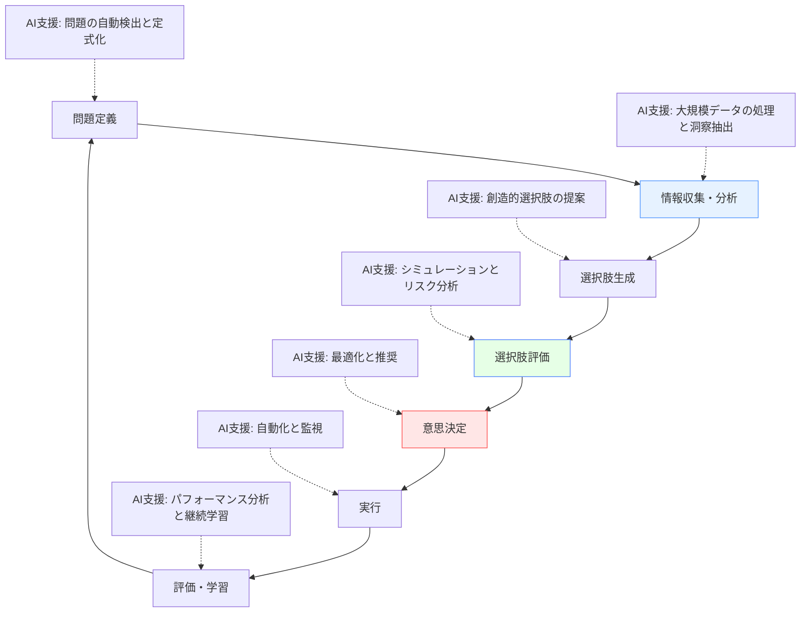
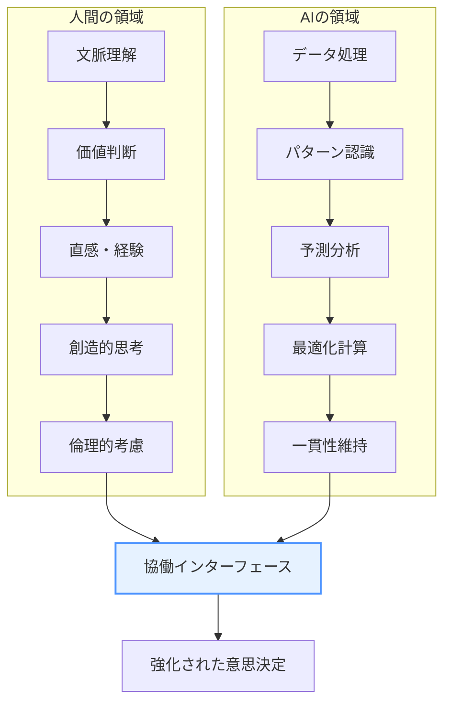
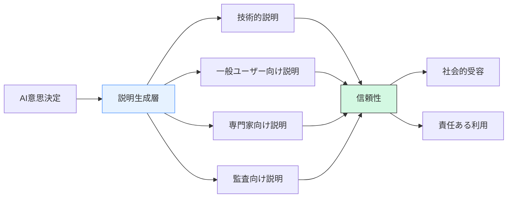
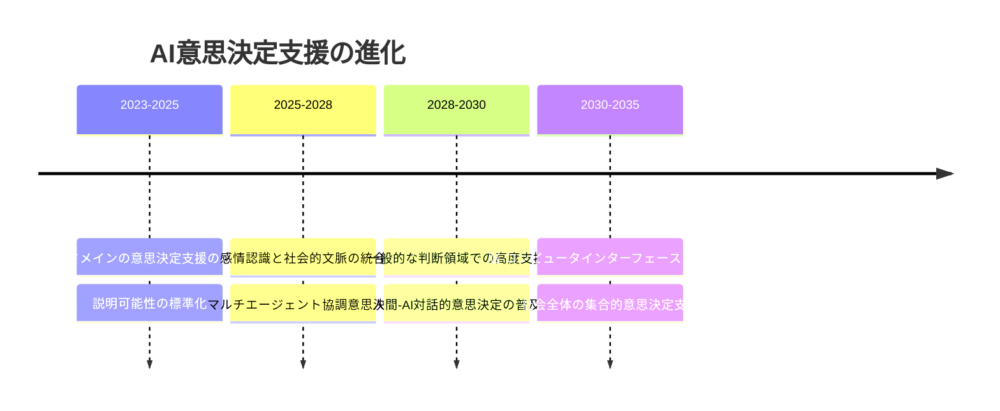

# AIと意思決定

!!! info "このページについて"

    このページでは、人工知能（AI）技術が意思決定に与える影響と可能性について詳しく解説します。  
    古典的な意思決定理論との統合から、AI特有のアルゴリズムによる意思決定支援、  
    さらに人間とAIの協働による意思決定の新しい枠組みや、実社会への応用、倫理的課題までを包括的に扱います。

## AIが変える意思決定の世界

人工知能（AI）技術は、意思決定（Decision Making）の領域に革命をもたらしています。大量のデータ処理能力、複雑なパターン認識、予測分析、最適化アルゴリズムを備えたAIは、個人から組織レベルまで、あらゆる規模の意思決定を根本から変革しています。

本章では、AIが意思決定プロセスをどのように変容させているか、その理論的基盤から実践的応用まで体系的に解説します。また、人間とAIの協働による意思決定の新たなパラダイムについても探求します。

## AIによる意思決定支援の基本メカニズム

### 意思決定プロセスにおけるAIの関与



AIは意思決定プロセスの各段階で異なる役割を果たし、人間の認知能力を拡張します。データ分析から選択肢評価、さらには意思決定の自動化まで、AIの関与はプロセス全体に及びます。

### AIによる意思決定支援の種類

| 支援タイプ | 内容 | 技術的アプローチ | 適用例 |
|----------|------|----------------|--------|
| **情報処理支援** | 大量データからの情報抽出 | データマイニング、NLP、コンピュータビジョン | 市場調査、医療診断支援 |
| **予測支援** | 将来状態の予測 | 機械学習、時系列分析、シミュレーション | 需要予測、リスク予測 |
| **選択肢生成支援** | 新たな選択肢の創出 | 生成AIモデル、遺伝的アルゴリズム | 製品設計、戦略立案 |
| **評価支援** | 選択肢の多面的評価 | 多基準意思決定、シミュレーション | 投資評価、候補者選考 |
| **自動化意思決定** | 定型的意思決定の自動化 | ルールベースシステム、機械学習 | 与信判断、取引実行 |
| **説明・解釈支援** | 意思決定の透明化 | 説明可能AI、可視化技術 | 医療診断根拠、融資判断説明 |
| **学習・適応支援** | 過去の意思決定からの学習 | 強化学習、フィードバック学習 | 継続的プロセス改善 |

## 意思決定理論とAI技術の融合

### 古典的意思決定理論のAI実装

古典的な意思決定理論がAI技術でどのように再解釈・強化されているかを見ていきましょう。

=== "期待効用理論とAI"


    期待効用理論は、不確実性下での選択において最大の期待効用を選ぶべきとする理論です。AIはこれを以下のように拡張します。

    - **複雑効用関数のモデリング**: 機械学習によって暗黙的・複雑な効用関数を学習
    - **確率推定の精緻化**: ベイジアン推論による確率の継続的更新
    - **多次元効用空間の最適化**: 進化的アルゴリズムによる複雑な効用空間の探索

    ??? TypeScript実装例

        ```typescript
        // AI拡張期待効用計算の概念的コード
        class AIEnhancedExpectedUtilityCalculator {
          private utilityModel: DeepNeuralNetwork;
          private probabilityEstimator: BayesianNetwork;
          
          constructor() {
            // 効用関数をモデル化するニューラルネットワーク初期化
            this.utilityModel = new DeepNeuralNetwork({
              layers: [10, 20, 10, 1],
              activation: 'relu'
            });
            
            // 確率を推定するベイジアンネットワーク初期化
            this.probabilityEstimator = new BayesianNetwork({
              variables: ['market_condition', 'competition', 'internal_factors']
            });
          }
          
          // ユーザー選好データから効用関数を学習
          trainUtilityFunction(preferenceData: PreferenceData[]): void {
            this.utilityModel.train(preferenceData, {
              epochs: 1000,
              batchSize: 32,
              validationSplit: 0.2
            });
          }
          
          // 新情報に基づき確率を更新
          updateProbabilities(newEvidence: Evidence): void {
            this.probabilityEstimator.update(newEvidence);
          }
          
          // 強化期待効用計算
          calculateEnhancedExpectedUtility(options: Decision[]): RankedDecisions {
            return options.map(option => {
              const possibleOutcomes = this.generateOutcomes(option);
              const expectedUtility = possibleOutcomes.reduce((sum, outcome) => {
                const utility = this.utilityModel.predict(outcome.features);
                const probability = this.probabilityEstimator.calculateProbability(outcome.conditions);
                return sum + (utility * probability);
              }, 0);
              
              return {
                option,
                expectedUtility,
                confidenceInterval: this.calculateConfidenceInterval(option)
              };
            }).sort((a, b) => b.expectedUtility - a.expectedUtility);
          }
          
          // その他の補助メソッド
          private generateOutcomes(option: Decision): Outcome[] { /* 実装 */ }
          private calculateConfidenceInterval(option: Decision): Interval { /* 実装 */ }
        }
        ```

=== "限定合理性のAI拡張"

    ハーバート・サイモンの限定合理性は人間の認知的制約を認識したモデルですが、AIはこれを以下のように補完します。

    - **探索空間の拡大**: AIによる広範な選択肢探索
    - **計算能力の補完**: 複雑な分析をAIが担当
    - **満足化基準の動的調整**: 状況に応じた基準の最適化

### 新たなAI駆動の意思決定モデル

=== "強化学習型意思決定モデル"
    #### 強化学習型意思決定モデル

    強化学習は環境との相互作用から学習する手法で、意思決定における以下の強みを持ちます。

    - **試行錯誤からの学習**: 実際の結果からポリシーを改善
    - **長期的報酬の最大化**: 短期的選択と長期的影響のバランス
    - **不確実な環境への適応**: 環境変化に対応する戦略の発達

    ```mermaid
    graph TD
        A[エージェント/意思決定者] --> B[行動選択]
        B --> C[環境への働きかけ]
        C --> D[環境の状態変化]
        D --> E[報酬/フィードバック]
        E --> F[ポリシー更新]
        F --> A
        
        style A fill:#f9d5e5,stroke:#333
        style F fill:#e6ffe6,stroke:#4d7fff
    ```

=== "マルチエージェント集合意思決定モデル"
    #### マルチエージェント集合意思決定モデル

    複数のAIエージェントと人間の集合知を活用するアプローチです。

    - **多様なエージェントの協働**: 異なる専門性や視点の統合
    - **分散型意思決定**: 局所的知識と全体最適化の両立
    - **交渉と合意形成**: エージェント間の協調と競争のバランス

## 人間-AI協働による意思決定の新パラダイム

### 協働意思決定の基本モデル



### 協働モデルの種類

| 協働モデル | 特徴 | AIの役割 | 人間の役割 | 適用例 |
|----------|------|--------|----------|--------|
| **AI支援型** | AIが選択肢や分析を提供、最終判断は人間 | 情報提供、分析、推奨 | 判断、選択、承認 | 医療診断支援、投資アドバイス |
| **人間監督型** | AIが主導、人間が監視と介入 | 自動意思決定、実行 | 監視、例外処理、改善 | 自動運転、工場自動化 |
| **共同創造型** | 人間とAIが対話的に解決策を創出 | 創造的提案、代替案検討 | 方向性指示、選択、統合 | 製品設計、コンテンツ創作 |
| **拡張知能型** | AIが人間の認知能力を拡張 | 認知支援、情報フィルタリング | 直感、判断、メタ認知 | 複雑データ分析、研究開発 |

### 効果的な協働のための条件

人間とAIの協働意思決定を効果的にするためには、以下の条件が重要です。

#### 1. 適切な信頼関係

- **過信の回避**: AIの能力限界への理解
- **不信の克服**: AIの専門領域の認識
- **校正された信頼**: 適切な信頼水準の維持
- **透明性確保**: AIの判断プロセスの可視化

#### 2. 効果的な相互理解

??? TypeScript実装例

    ```typescript
    // 人間-AI相互理解のためのインターフェースの概念コード
    class Human_AI_CollaborativeInterface {
      private humanModel: UserModel;
      private aiCapabilityModel: AICapabilityModel;
      private explainabilityEngine: ExplainabilityEngine;
      private confidenceEstimator: ConfidenceEstimator;
      
      constructor() {
        this.humanModel = new UserModel();
        this.aiCapabilityModel = new AICapabilityModel();
        this.explainabilityEngine = new ExplainabilityEngine();
        this.confidenceEstimator = new ConfidenceEstimator();
      }
      
      // AIの判断と根拠を人間に説明
      explainAIDecisionToHuman(decision: AIDecision): ExplanationOutput {
        const userExpertiseLevel = this.humanModel.getExpertiseLevel();
        const decisionConfidence = this.confidenceEstimator.estimateConfidence(decision);
        
        return this.explainabilityEngine.generateExplanation({
          decision,
          confidenceLevel: decisionConfidence,
          explanationLevel: userExpertiseLevel,
          relevantFactors: this.extractRelevantFactors(decision),
          alternativeOptions: this.generateAlternatives(decision),
          visualizations: this.generateVisualization(decision)
        });
      }
      
      // 人間の意図をAIが理解
      interpretHumanIntent(humanInput: HumanInput): InterpretedIntent {
        const clarificationQuestions = this.identifyAmbiguities(humanInput);
        const implicitConstraints = this.inferConstraints(humanInput);
        const valueAlignment = this.assessValueAlignment(humanInput);
        
        return {
          explicitGoals: this.extractExplicitGoals(humanInput),
          implicitGoals: this.inferImplicitGoals(humanInput),
          constraints: implicitConstraints,
          preferences: this.inferPreferences(humanInput),
          clarificationNeeded: clarificationQuestions.length > 0,
          clarificationQuestions
        };
      }
      
      // 協働作業のためのワークスペース管理
      manageCollaborativeWorkspace(context: DecisionContext): CollaborativeWorkspace {
        return {
          sharedContext: this.buildSharedContext(context),
          humanEditableElements: this.identifyHumanElements(context),
          aiEditableElements: this.identifyAIElements(context),
          changeHistory: this.trackChanges(context),
          suggestionQueue: this.generateSuggestions(context)
        };
      }
      
      // その他の補助メソッド
      private extractRelevantFactors(decision: AIDecision): Factor[] { /* 実装 */ }
      private generateAlternatives(decision: AIDecision): Alternative[] { /* 実装 */ }
      private generateVisualization(decision: AIDecision): Visualization[] { /* 実装 */ }
      // ...
    }
    ```

#### 3. 明確な役割分担

- **相補的専門性**: 各主体の強みの活用
- **動的役割調整**: 状況に応じた役割の変更
- **責任の明確化**: 各決定段階での責任所在の特定
- **適応的自動化**: 状況と能力に応じた自動化レベルの調整

## 産業別AIによる意思決定革新


=== "金融・投資分野"
    ### 金融・投資分野

    金融分野では、AIが投資判断、リスク管理、ポートフォリオ最適化などを革新しています。

    - **アルゴリズム取引**: 市場データから瞬時に取引決定を行うAIシステム
    - **リスク評価**: 複雑な要因を考慮した与信判断と詐欺検知
    - **ポートフォリオ最適化**: 個人のリスク選好に合わせた資産配分の最適化
    - **マクロ経済予測**: 多様なデータソースを統合した経済指標予測

    ```mermaid
    graph TD
        A[市場データ] --> B[AI分析エンジン]
        C[企業情報] --> B
        D[マクロ経済指標] --> B
        E[ニュース・SNS] --> B
        
        B --> F[市場動向予測]
        B --> G[銘柄評価]
        B --> H[リスク分析]
        B --> I[ポートフォリオ生成]
        
        F --> J[投資戦略決定]
        G --> J
        H --> J
        I --> J
        
        J --> K[取引実行]
        K --> L[パフォーマンス評価]
        L --> B
        
        style B fill:#e6f2ff,stroke:#4d94ff
        style J fill:#ffe6e6,stroke:#ff4d4d
    ```

=== "医療分野"
    ### 医療分野

    医療におけるAI意思決定支援は、診断、治療計画、リソース割り当てなど多岐にわたります。

    - **診断支援**: 画像解析や症状パターンからの診断サポート
    - **治療計画最適化**: 個別化医療のための治療オプション評価
    - **リソース配分**: 病院のリソース管理と患者スケジューリング
    - **薬剤反応予測**: 個人の遺伝情報に基づく薬効・副作用予測

=== "ビジネス・経営分野"
    ### ビジネス・経営分野

    ビジネスでは、戦略立案から運用上の意思決定までAIが支援しています。

    - **需要予測と在庫管理**: 複合要因を考慮した精密な需要予測
    - **価格最適化**: 動的価格設定による収益最大化
    - **マーケティング戦略**: 個客データに基づくパーソナライズド戦略
    - **人材管理**: 採用・配置・育成における意思決定支援

=== "公共政策分野"
    ### 公共政策分野

    公共政策においても、AIはデータ駆動型の政策立案と評価を可能にしています。

    - **政策シミュレーション**: 政策オプションの影響予測
    - **リソース最適配分**: 公共サービスの効率的配置
    - **リスク評価と緊急対応**: 災害・危機管理での迅速な判断支援
    - **社会的影響分析**: 政策の多面的影響評価

## 認知バイアスの軽減とAI

AIは人間の意思決定における認知バイアスを軽減する可能性を持ちます。

### 主要バイアスとAIによる対策

| 認知バイアス | 内容 | AIによる対策 | 実装アプローチ |
|------------|------|------------|--------------|
| **確証バイアス** | 既存の信念を支持する情報を優先 | 反証情報の自動提示 | 多様な情報源からの対立視点抽出 |
| **アンカリング効果** | 初期値に影響された判断 | 複数の参照点提示 | マルチスタート最適化アルゴリズム |
| **可用性ヒューリスティック** | 思い出しやすい事例への過度の依存 | 統計的代表性確保 | サンプリングバイアス検出・修正 |
| **損失回避バイアス** | 利益より損失を過大評価 | リスク-リターンの客観的分析 | 期待値計算と確率的シミュレーション |
| **集団思考** | 集団内の意見への同調 | 独立した複数視点の提供 | マルチエージェントシミュレーション |

### バイアス検出と軽減の技術

??? TypeScript実装例

    ```typescript
    // 意思決定バイアス検出・軽減システムの概念コード
    class BiasDetectionMitigationSystem {
      private decisionContext: DecisionContext;
      private userBehaviorTracker: UserBehaviorTracker;
      private statisticalAnalyzer: StatisticalAnalyzer;
      private alternativeGenerator: AlternativeGenerator;
      
      constructor(context: DecisionContext) {
        this.decisionContext = context;
        this.userBehaviorTracker = new UserBehaviorTracker();
        this.statisticalAnalyzer = new StatisticalAnalyzer();
        this.alternativeGenerator = new AlternativeGenerator();
      }
      
      // 確証バイアスの検出と軽減
      mitigateConfirmationBias(userQuery: string, searchResults: SearchResult[]): BiasAwareResults {
        // 検索クエリから調査仮説を抽出
        const hypothesis = this.extractHypothesis(userQuery);
        
        // 検索結果の偏りを分析
        const resultsBias = this.analyzeResultsBias(searchResults, hypothesis);
        
        if (resultsBias.biasDetected) {
          // 反対の視点や証拠を追加
          const counterevidence = this.searchCounterEvidence(hypothesis);
          const balancedResults = this.balanceResults(searchResults, counterevidence);
          
          return {
            originalResults: searchResults,
            balancedResults: balancedResults,
            biasAlert: {
              biasType: 'confirmation',
              severityLevel: resultsBias.severityLevel,
              explanation: 'あなたの検索結果には確証バイアスの可能性があります。反対の視点も考慮しました。'
            }
          };
        }
        
        return { originalResults: searchResults };
      }
      
      // アンカリング効果の検出と軽減
      mitigateAnchoringBias(initialValue: number, estimationTask: EstimationTask): AntiAnchoringSupport {
        // 過去の類似判断でのアンカリング効果を分析
        const anchoringRisk = this.assessAnchoringRisk(initialValue, estimationTask);
        
        if (anchoringRisk.riskLevel > 0.6) {
          // 複数の代替参照点を生成
          const alternativeAnchors = this.generateAlternativeAnchors(estimationTask);
          // ボトムアップ推定を促進
          const decomposedEstimation = this.decomposeEstimationTask(estimationTask);
          
          return {
            alternativeAnchors,
            decomposedEstimation,
            biasAlert: {
              biasType: 'anchoring',
              riskLevel: anchoringRisk.riskLevel,
              suggestion: '初期値に影響されないよう、複数の視点から検討してください。'
            }
          };
        }
        
        return { originalAnchor: initialValue };
      }
      
      // 可用性ヒューリスティックの検出と軽減
      mitigateAvailabilityBias(scenario: DecisionScenario): AvailabilityBiasMitigation {
        // ユーザーが想起しやすい事例パターンを分析
        const availabilityPattern = this.analyzeUserAvailabilityPattern(scenario);
        
        if (availabilityPattern.biasDetected) {
          // 統計的に代表的なサンプルを提示
          const representativeSamples = this.provideRepresentativeSamples(scenario);
          // 頻度情報の明示的表示
          const frequencyInfo = this.compileFrequencyStatistics(scenario);
          
          return {
            representativeSamples,
            frequencyInfo,
            biasAlert: {
              biasType: 'availability',
              explanation: '直感的に思い浮かぶ事例が必ずしも代表的とは限りません。統計的データも参考にしてください。'
            }
          };
        }
        
        return {};
      }
      
      // その他のバイアス対策メソッド
      mitigateLossAversionBias(options: DecisionOption[]): LossAversionMitigation { /* 実装 */ }
      mitigateGroupthinkBias(groupContext: GroupDecisionContext): GroupthinkMitigation { /* 実装 */ }
      
      // ヘルパーメソッド
      private extractHypothesis(query: string): Hypothesis { /* 実装 */ }
      private analyzeResultsBias(results: SearchResult[], hypothesis: Hypothesis): BiasAnalysis { /* 実装 */ }
      private searchCounterEvidence(hypothesis: Hypothesis): Evidence[] { /* 実装 */ }
      // ...
    }
    ```

## AIによる意思決定の倫理的・社会的課題

### 意思決定権限と責任の所在

AIが意思決定に関与する度合いが高まるにつれ、責任の所在が複雑化しています。

- **責任の分散**: 人間、AI開発者、組織間での責任配分
- **説明責任の確保**: AIの判断に対する説明可能性の要件
- **法的枠組みの進化**: AI意思決定に関する法規制の発展
- **社会的受容性**: 異なる領域でのAI意思決定の許容度

### 透明性と説明可能性

AI意思決定の透明性と説明可能性は信頼構築の鍵です。



### 公平性とバイアス

AIによる意思決定の公平性は重要な課題です。

- **データバイアスの認識**: 訓練データに内在するバイアスの検出
- **アルゴリズム公平性**: 異なる公平性指標間のトレードオフ
- **継続的監視**: 運用中のシステムの公平性モニタリング
- **多様なステークホルダーの参加**: 包括的な視点の確保

### 人間の自律性と依存

AIへの過度の依存は新たな脆弱性を生み出す可能性があります。

- **スキル劣化**: 人間の意思決定能力の退化リスク
- **批判的思考の維持**: AI提案に対する健全な懐疑心の重要性
- **サイバーセキュリティ**: AIシステムへの攻撃による意思決定操作
- **レジリエンス設計**: AIシステム障害時のフォールバック戦略

## 未来展望：AIと意思決定の進化

### 短期的展望（1-3年）

- **説明可能AIの標準化**: 意思決定支援AIにおける説明機能の標準実装
- **ドメイン特化型意思決定AI**: 特定分野での高度な意思決定支援
- **マルチモーダル入力**: 複数データ形式を統合した意思決定支援

### 中期的展望（3-5年）

- **感情認識AI意思決定**: 人間の感情状態を考慮した適応的支援
- **集合知とAIの融合**: 集団意思決定とAIの効果的統合
- **自己適応型意思決定システム**: ユーザーに合わせて自動調整するシステム

### 長期的展望（5-10年以上）

- **汎用AI意思決定アシスタント**: 多領域で適用可能な高度支援
- **神経インターフェースとの統合**: 脳波から意図を読み取る技術との統合
- **創発的意思決定システム**: 予期せぬ状況でも適応・進化するシステム



## 実践的応用。AIと意思決定の統合

### 組織へのAI意思決定導入フレームワーク

組織にAI意思決定支援を導入する際の体系的アプローチです。

1. **評価と優先順位付け**:
    - 意思決定プロセスの現状分析
    - AIが価値を付加できる領域の特定
    - ROIとリスク評価

2. **設計と開発**:
    - 人間中心設計アプローチ
    - 段階的実装計画
    - 説明可能性と透明性の要件

3. **統合と変革管理**:
    - ユーザートレーニングとスキル開発
    - 業務プロセスの再設計
    - 組織文化の調整

4. **評価と継続的改善**:
    - 定量的・定性的性能指標
    - フィードバックループ構築
    - 進化する要件への適応

### 実装上の課題と対策

| 課題 | 内容 | 対策 | 実装アプローチ |
|-----|------|------|--------------|
| **データ品質** | 不完全/偏ったデータによる判断劣化 | データガバナンス体制構築 | データ検証パイプライン、異常検知 |
| **モデル選択** | 用途に適したAIモデルの選定 | 段階的評価プロセス | A/Bテスト、性能ベンチマーク |
| **人材ギャップ** | AI活用スキルを持つ人材不足 | トレーニングとスキル開発 | 段階的学習プログラム |
| **組織抵抗** | 変化への心理的抵抗 | 変革管理と参加型設計 | ユーザー参加型開発、成功事例の共有 |
| **継続的更新** | モデル劣化と環境変化への対応 | モニタリングと更新体制 | ドリフト検出、オンライン学習 |

## まとめ：AIによる意思決定の変革

AIは意思決定のプロセスとアウトカムを根本から変革しつつあります。その鍵となるのは。

1. **データと経験の融合**: AIの分析力と人間の経験・直感の統合
2. **認知能力の拡張**: 人間の限界を超えた情報処理と選択肢評価
3. **説明可能性の確保**: 透明で理解可能なAI支援意思決定
4. **継続的学習と適応**: 過去の判断からの系統的な学習と改善
5. **価値観との整合**: 人間の価値観に沿った意思決定支援

これらの要素を適切に組み合わせることで、AIは人間の意思決定能力を大幅に強化し、より良い判断と成果をもたらす可能性を秘めています。しかし同時に、責任ある開発と導入、人間の自律性の尊重、倫理的考慮が不可欠です。

AIと意思決定の分野は今後も急速に発展していくでしょう。本章で紹介した概念と技術が、読者の皆様のAI意思決定システム実装の一助となれば幸いです。

## 参考文献

1. Kahneman, D., Sibony, O., & Sunstein, C. R. (2021). Noise: A Flaw in Human Judgment. Little, Brown Spark.
2. Sutton, R. S., & Barto, A. G. (2018). Reinforcement Learning: An Introduction (2nd ed.). MIT Press.
3. Russell, S., & Norvig, P. (2020). Artificial Intelligence: A Modern Approach (4th ed.). Pearson.
4. Fischhoff, B., & Broomell, S. B. (2020). Judgment and Decision Making. Annual Review of Psychology, 71, 331-355.
5. Brynjolfsson, E., & McAfee, A. (2017). The Business of Artificial Intelligence. Harvard Business Review, 7, 3-11.
6. 松尾豊. (2020). 『人工知能とディープラーニング』 KADOKAWA.
7. 井上智洋. (2018). 『人工知能と経済の未来』 文藝春秋.
8. European Commission. (2022). Proposal for a Regulation on Artificial Intelligence. Brussels: European Commission.