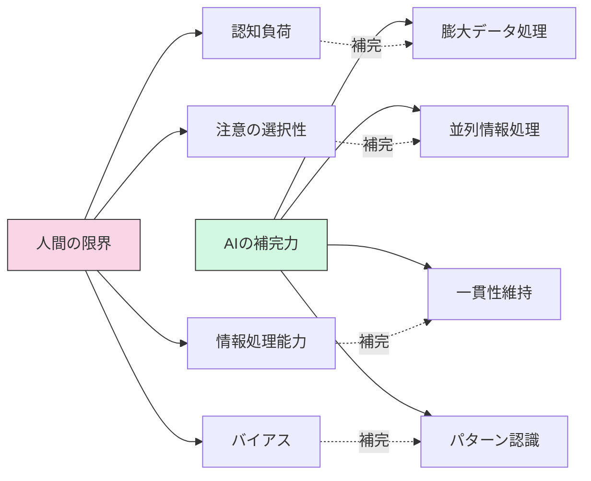
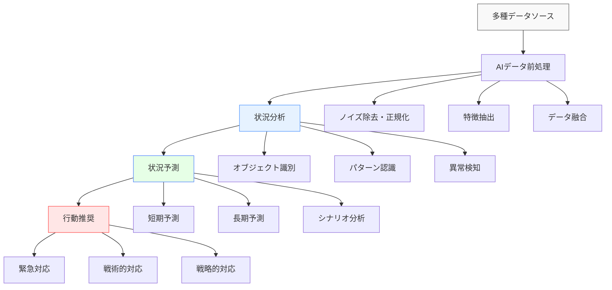
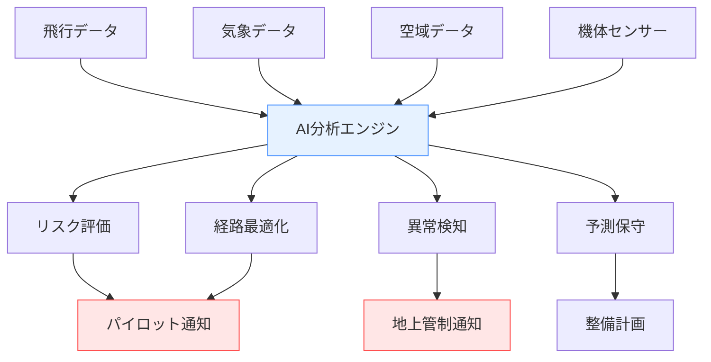
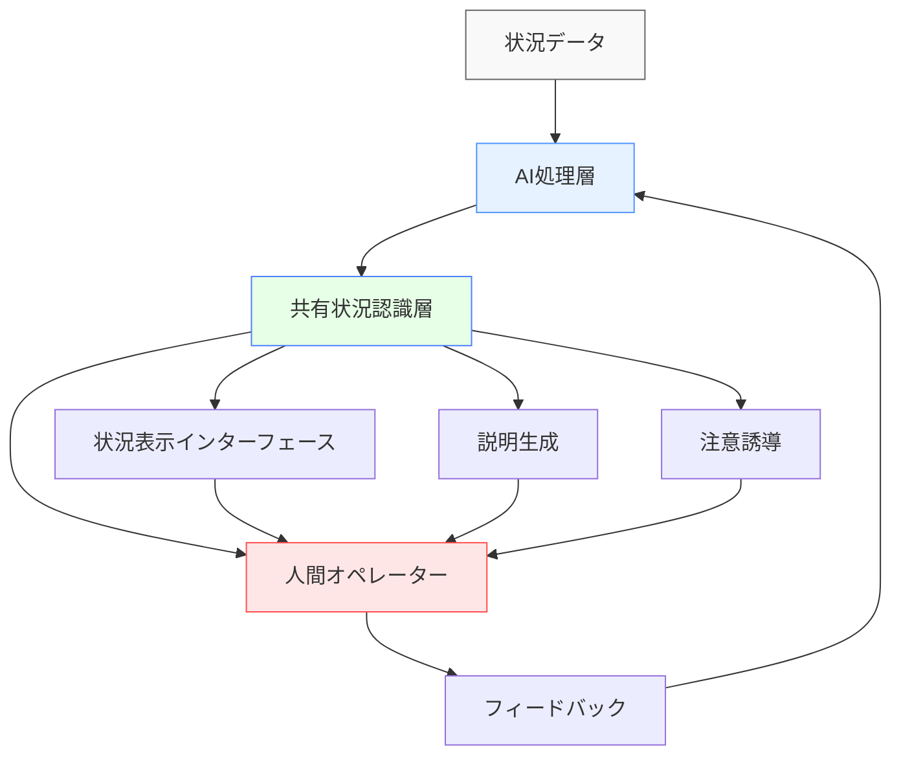

# AIと状況認識

## AIが変える状況認識の世界

人工知能（AI）の進化により、状況認識（SA: Situational Awareness）の能力は飛躍的に向上しています。膨大なデータを瞬時に処理し、複雑なパターンを認識し、先を予測するAIの能力は、人間の認知限界を超え、これまで不可能だった精度と速度での状況把握を可能にしています。

本章では、AIが状況認識をどのように変革しているか、その理論的背景から実践的応用まで体系的に解説します。

## AIと状況認識の関係性

### 状況認識の限界とAIの補完力



人間の状況認識には、認知バイアス、注意の限界、情報過負荷など多くの制約があります。AIはこれらの限界を補完することで、より包括的で正確な状況認識を実現します。

### 人間-AI協働による状況認識の最適化

| 人間の強み | AIの強み | 協働効果 |
|---|---|---|
| 文脈理解 | データ処理能力 | 状況の包括的理解 |
| 経験・直感 | パターン検出 | 異常・新規状況の察知 |
| 適応性 | 一貫性 | 変化する環境での信頼性 |
| 創造的問題解決 | 大量データ分析 | 革新的かつデータ駆動の判断 |
| 倫理的判断 | バイアスのない分析 | 公平で効果的な意思決定 |

## AIによる状況認識強化の基本メカニズム

### 多層的状況認識モデル



AIは上記の多層構造を通じて、生データから意味のある状況認識と行動推奨を生成します。各層で専門的なAIアルゴリズムが適用され、Endsleyの3レベルモデルに対応した状況認識を実現します。

### Endsleyモデルとの対応関係

| Endsleyモデル | AI機能 | 実現技術 |
|---|---|---|
| **レベル1: 知覚** | 状況要素の検出・認識 | 物体検出、音声認識、テキスト分析、センサーデータ処理 |
| **レベル2: 理解** | 状況要素間の関係性把握 | グラフネットワーク分析、因果推論、知識グラフ、関係抽出 |
| **レベル3: 予測** | 将来状態の予測 | 時系列予測、モンテカルロシミュレーション、デジタルツイン、強化学習 |

## 状況認識を強化するAI技術

### マルチモーダルAI：多次元データの統合理解

複数の感覚モダリティ（視覚、聴覚、テキスト、センサーデータなど）を統合処理することで、より人間に近い包括的な状況認識を実現します。

??? TypeScript実装例

    ```typescript
    // マルチモーダルAI統合の基本アーキテクチャ（概念コード）
    interface MultiModalPerception {
      visualStream: ImageData[];
      audioStream: AudioData[];
      textStream: TextData[];
      sensorData: SensorReading[];
      
      // マルチモーダル融合処理
      fuseModalities(): SituationalContext;
      
      // クロスモーダル注意機構
      crossModalAttention(
        primaryModality: ModalityType, 
        supportModalities: ModalityType[]
      ): EnhancedPerception;
    }

    // 実装例：ビジョン・テキスト融合による強化状況認識
    class VisionTextFusion implements MultiModalPerception {
      // 画像内の物体とテキスト説明の関連付け
      alignVisualEntitiesWithText(
        detectedObjects: VisualEntity[],
        textDescriptions: TextEntity[]
      ): SemanticAlignment[] {
        // 実装略
      }
      
      // シーンの文脈的理解
      deriveContextualUnderstanding(
        visualScene: SceneGraph,
        textualContext: TextualGraph
      ): ContextualizedScene {
        // 実装略
      }
    }
    ```

### 時空間認識AI：動的状況の把握

状況の時間的変化と空間的関係を同時に捉えることで、動的環境における状況認識を強化します。

- **時系列分析**: LSTMやTransformerを用いた時間的パターン認識
- **空間関係処理**: グラフニューラルネットワークによる物体間関係の理解
- **時空間予測**: 3D畳み込みネットワークによる動的シーン予測

### 説明可能AI：状況認識の透明化

AIの判断根拠を可視化することで、状況認識の信頼性を高めます。

- **注意機構可視化**: AIが注目している状況要素の視覚化
- **特徴重要度分析**: 各特徴の判断への寄与度の定量化
- **反事実説明**: 「もし状況がXだった場合は結果がYに変わる」という説明

### 継続学習AI：状況認識の適応的進化

新たな状況や変化する環境に適応するための継続的学習メカニズムを実装します。

- **オンライン学習**: 新データからのリアルタイム学習
- **転移学習**: 既存知識の新領域への適用
- **メタ学習**: 学習方法自体の最適化

## 産業別AIによる状況認識革新

### 航空分野

航空分野では、AIが複雑な飛行環境の状況認識を強化し、安全性と効率性を高めています。

- **自動空中衝突回避システム**: 機械学習による動的リスク評価
- **気象条件予測**: 深層学習による微気象予測と飛行計画最適化
- **パイロット注意支援**: AR/VRと組み合わせた視覚的状況強調
- **整備予測**: IoTセンサーとAIによる機体状態モニタリング



### 医療分野

医療におけるAIは、診断精度の向上から患者モニタリング、手術支援まで状況認識を根本から変革しています。

- **医療画像診断支援**: CNNによる異常検出と診断根拠の可視化
- **生体信号リアルタイム解析**: 患者状態の継続的モニタリングと早期異常検知
- **医療記録からの知識抽出**: NLPによる患者歴と医学知識の統合解釈
- **周術期モニタリング**: マルチモーダルAIによる手術中の包括的状況認識

### 災害対応・緊急管理

災害時の複雑な状況を迅速に把握し、効果的な意思決定を支援します。

- **災害マッピング**: 衛星・ドローン画像のリアルタイム解析
- **被害予測**: 過去データと現状からの機械学習予測
- **リソース最適配置**: 強化学習による救援リソースの最適配分
- **社会メディア分析**: 災害情報のリアルタイム抽出と検証

## AIと人間の協働による強化状況認識

### Human-AI Teaming のベストプラクティス

AIと人間が互いの強みを活かして協力することで、状況認識の質を最大化します。

- **相互理解**: AIの能力・限界の理解と人間の意図・行動の学習
- **適応的自動化**: 状況の複雑さに応じた自動化レベルの動的調整
- **相互信頼構築**: 一貫した性能と透明性による信頼関係の醸成
- **シームレスな情報共有**: 状況認識の効果的な相互伝達

### 人間中心の状況認識支援設計



### 認知負荷を考慮したAI情報提示

人間の認知特性に合わせたAI情報の提示により、情報過負荷を防ぎつつ最適な状況認識を支援します。

- **情報フィルタリング**: 状況と役割に応じた重要情報の選別
- **適応的詳細度**: 状況の緊急度に応じた情報粒度の調整
- **マルチモーダル提示**: 視覚・聴覚など複数チャネルの効果的活用
- **予測的情報提供**: 将来必要となる情報の先行提示

## 実装例：AIによる統合状況認識システム

### システムアーキテクチャ

??? TypeScript実装例
    この実装例では、AIを活用した統合的な状況認識システムの基本構造を示しています。システムは以下の主要なコンポーネントで構成されます。

    1. **MultiSourceDataAcquisition** - 多種多様なデータソースからのデータ収集を担当
    2. **DataPreprocessing** - データの前処理、ノイズ除去、正規化を行います
    3. **SituationAnalysis** - データの分析を行い、状況の認識と評価を実施
    4. **SituationPrediction** - 状況の進展予測を行い、次に発生しうる出来事を推測します
    5. **ExplainableAI** - AIの判断根拠を提供し、透明性を確保します
    6. **AdaptiveVisualization** - 分析結果を人間が理解しやすい形で可視化します
    7. **UserFeedbackSystem** - ユーザーからのフィードバックを受け、分析結果や予測を改善します

    各コンポーネントは、Observable/Observerパターンを利用し、リアルタイムでデータ処理を連携しています。データ取得から前処理、分析、予測、結果表示までの流れがシームレスに統合されており、動的な状況認識を実現します。


    ```typescript
    // AIによる統合状況認識システム
    class AISituationalAwarenessSystem {
      // コンポーネント定義
      private dataAcquisition: MultiSourceDataAcquisition;
      private preprocessing: DataPreprocessing;
      private analysis: SituationAnalysis;
      private prediction: SituationPrediction;
      private explanation: ExplainableAI;
      private visualization: AdaptiveVisualization;
      private feedback: UserFeedbackSystem;
      
      constructor() {
        // コンポーネント初期化
        this.dataAcquisition = new MultiSourceDataAcquisition();
        this.preprocessing = new DataPreprocessing();
        this.analysis = new SituationAnalysis();
        this.prediction = new SituationPrediction();
        this.explanation = new ExplainableAI();
        this.visualization = new AdaptiveVisualization();
        this.feedback = new UserFeedbackSystem();
        
        // データフローの設定
        this.setupDataFlow();
      }
      
      // データフロー設定
      private setupDataFlow(): void {
        // Observable/Observer パターンによるデータフロー
        this.dataAcquisition.dataStream.pipe(
          map(data => this.preprocessing.process(data)),
          map(processedData => {
            const analysisResult = this.analysis.analyze(processedData);
            const predictionResult = this.prediction.predict(analysisResult);
            const explanation = this.explanation.explain(analysisResult, predictionResult);
            return { analysisResult, predictionResult, explanation };
          })
        ).subscribe(results => {
          // 視覚化と表示
          this.visualization.render(results);
        });
        
        // フィードバックループ
        this.feedback.feedbackStream.subscribe(feedback => {
          this.analysis.updateBasedOnFeedback(feedback);
          this.prediction.updateBasedOnFeedback(feedback);
        });
      }
      
      // 状況認識の実行
      public performSituationalAwareness(): Observable<SituationalAwarenessResult> {
        return this.dataAcquisition.acquireData().pipe(
          // パイプライン処理
        );
      }
    }

    // 状況認識結果のインターフェース
    interface SituationalAwarenessResult {
      currentSituation: SituationAssessment;
      predictedDevelopments: PredictedScenario[];
      confidenceLevel: number;
      criticalFactors: Factor[];
      recommendedActions: Action[];
      explanations: Explanation[];
    }
    ```

### 実装上の重要ポイント

1. **モジュラー設計**: 各コンポーネントを疎結合に設計し、拡張性を確保
2. **リアルタイム処理**: Observableパターンを用いた非同期データ処理
3. **説明可能性**: すべての判断に対する根拠の生成と提示
4. **人間フィードバック**: 人間の知識・経験を取り入れた継続的改善
5. **適応的視覚化**: ユーザーの役割と状況に応じた情報提示

## AIによる状況認識の課題と対策

### 主要課題と対応策

| 課題 | 影響 | 対策 | 実装技術 |
|---|---|---|---|
| **不確実性管理** | 不正確な状況認識 | 確率的推論、不確実性の明示的モデル化 | ベイジアンネットワーク、モンテカルロドロップアウト |
| **説明可能性** | ブラックボックス問題 | 解釈可能モデル、事後説明技術 | LIME/SHAP、注意機構可視化 |
| **データ品質** | ゴミ入れゴミ出し問題 | 堅牢な前処理、異常検知 | データバリデーション、ロバスト学習 |
| **過信と不信** | 不適切な信頼関係 | 正確な性能表示、信頼度の明示 | 信頼度校正、不確実性推定 |
| **バイアス** | 偏った状況認識 | 公平性監査、多様なデータ | フェアネス評価指標、バイアス軽減技術 |

### 倫理的考慮事項

AIによる状況認識を実装する際には、以下の倫理的観点を考慮する必要があります。

- **透明性**: システムの能力と限界の明示
- **責任所在**: 人間とAIの役割・責任の明確化
- **プライバシー**: 状況認識のための情報収集とプライバシーのバランス
- **自律性**: 人間の意思決定権の尊重と維持
- **公平性**: 様々な集団・状況に対する公平な状況認識

## 未来展望：AIと状況認識の進化

### 短期的展望（1-3年）

- **マルチモーダル統合の高度化**: より自然な複数感覚情報の統合
- **説明可能AI技術の標準化**: 状況認識の透明性確保の制度化
- **エッジAIの普及**: 現場でのリアルタイム状況認識処理

### 中期的展望（3-5年）

- **予測的状況認識の精度向上**: より長期的・複雑な状況予測
- **人間-AI共同意識の発達**: より自然なインタラクションによる共有状況認識
- **セルフスーパービジョン学習の一般化**: 教師なしでの状況理解能力獲得

### 長期的展望（5-10年以上）

- **汎用人工知能（AGI）による状況理解**: 人間レベルの文脈理解と状況認識
- **脳-コンピュータインターフェースとの統合**: 直接的な思考レベルでの状況共有
- **集合知能としての状況認識**: 複数AIと人間による集合的状況認識

## まとめ：AIによる状況認識の変革

AIは状況認識の能力を量的にも質的にも変革し、これまで不可能だった複雑・動的環境での精密な状況把握を実現しています。その鍵となるのは。

1. **多種大量データの統合処理**: 人間の処理能力を超えたデータ活用
2. **パターン認識と予測**: 過去の経験からの学習と未来予測
3. **人間との適切な協働**: AIと人間の強みを最大限に活かす設計
4. **継続的な学習と適応**: 変化する環境への柔軟な対応
5. **説明可能性と信頼性**: 透明で信頼できる状況認識の提供

こうしたAIの能力を責任ある形で活用することで、航空、医療、災害対応など多様な分野で安全性と効率性を大幅に向上させることができます。一方で、技術的課題や倫理的問題にも適切に対処しながら、人間中心の状況認識拡張を目指すことが重要です。

AIによる状況認識の革新は始まったばかりであり、今後ますます発展していくでしょう。本章で紹介した概念と技術が、読者の皆様のAI状況認識システム実装の一助となれば幸いです。

## 参考文献

1. Endsley, M. R. (2015). Situation Awareness Misconceptions and Misunderstandings. Journal of Cognitive Engineering and Decision Making, 9(1), 4-32.
2. Russell, S., & Norvig, P. (2020). Artificial Intelligence: A Modern Approach (4th ed.). Pearson.
3. Jajodia, S., Liu, P., Swarup, V., & Wang, C. (Eds.). (2022). Cyber Situational Awareness: Issues and Research. Springer.
4. Hoffman, R. R., Johnson, M., Bradshaw, J. M., & Underbrink, A. (2019). Trust in Automation: Human–Machine Teaming. IEEE Intelligent Systems, 34(6), 5-11.
5. 松尾豊. (2019). 人工知能とディープラーニング. KADOKAWA.
6. 西田豊明編. (2019). 人工知能学大事典. 共立出版.