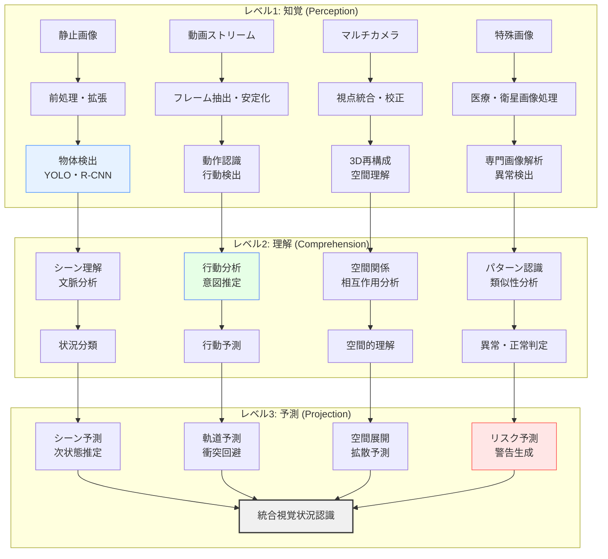

# コンピュータビジョンによる状況認識

!!! info "このページについて"

    このページでは、コンピュータビジョン（Computer Vision）が状況認識（Situational Awareness）にもたらす革命的変化について詳しく解説します。  
    画像・映像データからの物体検出、行動認識、異常検知から、最新の深層学習技術まで、視覚情報を活用した状況理解の技術を理論と実装の両面から掘り下げます。  
    実践的なTypeScriptコード例により、リアルタイム映像解析システムの構築方法を具体的に示します。

## コンピュータビジョンが変える状況認識の世界

コンピュータビジョン（CV）は、画像や映像から意味のある情報を自動抽出する技術として、状況認識の精度と範囲を劇的に拡張しています。監視カメラ、ドローン、衛星画像、医療画像など、様々な視覚データから状況を即座に把握し、異常を検知し、将来を予測する能力は、人間の視覚による認識を大幅に超越しています。

本章では、コンピュータビジョン技術が状況認識をどのように強化しているか、Endsleyモデルとの対応から最新の深層学習応用まで体系的に解説します。

## コンピュータビジョンによる状況認識の基本フレームワーク

### Endsleyモデルとコンピュータビジョン技術の対応



### コンピュータビジョン技術と状況認識への応用

| CV技術 | 状況認識への応用 | 主要手法 | 具体例 |
|---|---|---|---|
| **物体検出** | 重要オブジェクトの識別 | YOLO、Faster R-CNN、SSD | 人・車両・危険物の検出 |
| **画像分類** | シーン・状況の分類 | ResNet、EfficientNet、Vision Transformer | 緊急時・平常時の判別 |
| **セマンティックセグメンテーション** | 領域ごとの詳細理解 | U-Net、DeepLab、Mask R-CNN | 災害被害範囲の特定 |
| **行動認識** | 人物・車両の行動分析 | 3D CNN、LSTM、Transformer | 異常行動・危険行為の検出 |
| **顔認識・表情解析** | 個人識別・感情状態把握 | FaceNet、ArcFace、表情分類 | セキュリティ・ストレス検知 |
| **光学文字認識** | テキスト情報の抽出 | CRAFT、TrOCR、PaddleOCR | 標識・文書からの情報取得 |
| **異常検知** | 正常パターンからの逸脱 | Autoencoder、One-Class SVM | 設備故障・不審行動の発見 |

## リアルタイム映像解析による状況認識

### 監視・セキュリティシステム

リアルタイムでの映像監視により、セキュリティリスクや緊急事態を即座に検出します。

??? TypeScript実装例

    この実装では、WebRTCとCanvas APIを活用したブラウザベースのリアルタイム映像監視システムです。複数カメラからの映像を統合し、物体検出・行動認識・異常検知を並行実行し、アラート生成まで行う包括的なシステムです。

    ```typescript
    // リアルタイム映像監視による状況認識システム
    interface VideoAnalysisResult {
      frameId: string;
      timestamp: Date;
      detectedObjects: DetectedObject[];
      recognizedActions: RecognizedAction[];
      anomalies: Anomaly[];
      sceneClassification: SceneClassification;
      riskAssessment: RiskAssessment;
    }

    interface DetectedObject {
      id: string;
      class: string;
      confidence: number;
      boundingBox: BoundingBox;
      trackingId?: string;
      attributes: ObjectAttributes;
    }

    interface RecognizedAction {
      actionType: string;
      confidence: number;
      duration: number;
      involvedObjects: string[];
      riskLevel: 'low' | 'medium' | 'high' | 'critical';
    }

    interface Anomaly {
      type: 'behavior' | 'object' | 'scene' | 'pattern';
      description: string;
      severity: number;
      location: BoundingBox;
      confidence: number;
    }

    class RealTimeVideoSurveillanceSystem {
      private videoStreams: Map<string, MediaStream> = new Map();
      private canvasElements: Map<string, HTMLCanvasElement> = new Map();
      private objectDetector: ObjectDetectionModel;
      private actionRecognizer: ActionRecognitionModel;
      private anomalyDetector: AnomalyDetectionModel;
      private trackingSystem: MultiObjectTracker;
      private alertSystem: AlertSystem;
      
      constructor() {
        this.initializeVisionModels();
        this.setupRealTimeProcessing();
      }
      
      private initializeVisionModels(): void {
        // YOLO v8 ベースの物体検出
        this.objectDetector = new YOLOv8Detector({
          modelPath: '/models/yolov8n.onnx',
          classNames: this.getSecurityRelevantClasses(),
          confidenceThreshold: 0.5,
          nmsThreshold: 0.4
        });
        
        // 3D CNN による行動認識
        this.actionRecognizer = new Action3DCNNModel({
          modelPath: '/models/action_recognition_3dcnn.onnx',
          frameSequenceLength: 16,
          actions: [
            'normal_walking', 'running', 'fighting', 'falling',
            'suspicious_behavior', 'crowd_gathering', 'vehicle_accident'
          ]
        });
        
        // オートエンコーダーベース異常検知
        this.anomalyDetector = new AutoencoderAnomalyDetector({
          modelPath: '/models/anomaly_detection_ae.onnx',
          reconstructionThreshold: 0.8,
          spatialAttention: true
        });
        
        // マルチオブジェクト追跡
        this.trackingSystem = new DeepSORTTracker({
          maxAge: 30,
          minHits: 3,
          iouThreshold: 0.3
        });
      }
      
      // 複数カメラからの映像監視開始
      async startMultiCameraSurveillance(
        cameraConfigs: CameraConfig[]
      ): Promise<Observable<CameraSurveillanceResult[]>> {
        const surveillanceStreams = await Promise.all(
          cameraConfigs.map(async (config) => {
            const stream = await this.initializeCameraStream(config);
            return this.analyzeCameraStream(config.cameraId, stream);
          })
        );
        
        // 複数カメラの結果を統合
        return combineLatest(surveillanceStreams).pipe(
          map(results => this.integrateCameraResults(results)),
          tap(integratedResults => this.processIntegratedResults(integratedResults)),
          share()
        );
      }
      
      // 個別カメラストリームの分析
      private analyzeCameraStream(
        cameraId: string,
        stream: MediaStream
      ): Observable<CameraSurveillanceResult> {
        return new Observable<CameraSurveillanceResult>(observer => {
          const video = document.createElement('video');
          const canvas = document.createElement('canvas');
          const context = canvas.getContext('2d')!;
          
          video.srcObject = stream;
          video.play();
          
          canvas.width = 640;
          canvas.height = 480;
          this.canvasElements.set(cameraId, canvas);
          
          let frameBuffer: ImageData[] = [];
          let frameCount = 0;
          
          // フレーム処理間隔（30 FPS）
          const frameInterval = setInterval(async () => {
            try {
              // フレーム取得
              context.drawImage(video, 0, 0, canvas.width, canvas.height);
              const imageData = context.getImageData(0, 0, canvas.width, canvas.height);
              
              frameBuffer.push(imageData);
              if (frameBuffer.length > 16) frameBuffer.shift();
              
              // 分析実行
              const analysisResult = await this.analyzeVideoFrame(
                cameraId,
                imageData,
                frameBuffer,
                frameCount++
              );
              
              observer.next({
                cameraId,
                result: analysisResult,
                frameNumber: frameCount
              });
              
            } catch (error) {
              observer.error(error);
            }
          }, 1000 / 30);
          
          return () => {
            clearInterval(frameInterval);
            video.srcObject = null;
            stream.getTracks().forEach(track => track.stop());
          };
        });
      }
      
      // フレーム分析の実行
      private async analyzeVideoFrame(
        cameraId: string,
        currentFrame: ImageData,
        frameBuffer: ImageData[],
        frameNumber: number
      ): Promise<VideoAnalysisResult> {
        // 並列で各種分析を実行
        const [objectDetectionResult, actionRecognitionResult, anomalyResult] = 
          await Promise.all([
            this.detectObjects(currentFrame),
            this.recognizeActions(frameBuffer),
            this.detectAnomalies(currentFrame, frameBuffer)
          ]);
        
        // オブジェクト追跡の更新
        const trackedObjects = await this.trackingSystem.update(
          objectDetectionResult.detections
        );
        
        // シーン分類
        const sceneClassification = await this.classifyScene(currentFrame);
        
        // リスク評価
        const riskAssessment = this.assessRisk({
          objects: trackedObjects,
          actions: actionRecognitionResult,
          anomalies: anomalyResult,
          scene: sceneClassification
        });
        
        return {
          frameId: `${cameraId}_${frameNumber}`,
          timestamp: new Date(),
          detectedObjects: trackedObjects,
          recognizedActions: actionRecognitionResult,
          anomalies: anomalyResult,
          sceneClassification,
          riskAssessment
        };
      }
      
      // 物体検出
      private async detectObjects(imageData: ImageData): Promise<ObjectDetectionResult> {
        // ImageData を tensor に変換
        const tensor = this.imageDataToTensor(imageData);
        
        // YOLO推論実行
        const detections = await this.objectDetector.detect(tensor);
        
        // 後処理（NMS適用、信頼度フィルタリング）
        const filteredDetections = this.postProcessDetections(detections);
        
        return {
          detections: filteredDetections.map(det => ({
            id: this.generateDetectionId(),
            class: det.className,
            confidence: det.confidence,
            boundingBox: det.boundingBox,
            attributes: this.extractObjectAttributes(det, imageData)
          })),
          processingTime: performance.now()
        };
      }
      
      // 行動認識
      private async recognizeActions(
        frameSequence: ImageData[]
      ): Promise<RecognizedAction[]> {
        if (frameSequence.length < 16) return [];
        
        // フレームシーケンスをテンソルに変換
        const sequenceTensor = this.frameSequenceToTensor(
          frameSequence.slice(-16)
        );
        
        // 3D CNN による行動分類
        const actionProbabilities = await this.actionRecognizer.predict(
          sequenceTensor
        );
        
        // 閾値を超える行動を抽出
        const recognizedActions = actionProbabilities
          .filter(action => action.confidence > 0.7)
          .map(action => ({
            actionType: action.className,
            confidence: action.confidence,
            duration: this.estimateActionDuration(action),
            involvedObjects: this.findInvolvedObjects(action),
            riskLevel: this.assessActionRisk(action.className)
          }));
        
        return recognizedActions;
      }
      
      // 異常検知
      private async detectAnomalies(
        currentFrame: ImageData,
        frameHistory: ImageData[]
      ): Promise<Anomaly[]> {
        const anomalies: Anomaly[] = [];
        
        // オートエンコーダーによる再構成異常検知
        const reconstructionError = await this.anomalyDetector.getReconstructionError(
          currentFrame
        );
        
        if (reconstructionError > this.anomalyDetector.threshold) {
          const anomalyRegions = await this.localizeAnomalies(
            currentFrame,
            reconstructionError
          );
          
          anomalies.push(...anomalyRegions.map(region => ({
            type: 'scene' as const,
            description: `異常なシーンパターンを検出`,
            severity: region.severity,
            location: region.boundingBox,
            confidence: region.confidence
          })));
        }
        
        // 時系列パターン異常検知
        if (frameHistory.length >= 10) {
          const temporalAnomalies = await this.detectTemporalAnomalies(
            frameHistory
          );
          anomalies.push(...temporalAnomalies);
        }
        
        return anomalies;
      }
      
      // 複数カメラ結果の統合
      private integrateCameraResults(
        cameraResults: CameraSurveillanceResult[]
      ): IntegratedSurveillanceResult {
        // カメラ間での物体対応付け
        const globalObjectMap = this.correlateObjectsAcrossCameras(cameraResults);
        
        // 全体的な状況評価
        const overallSituation = this.assessOverallSituation(cameraResults);
        
        // 重要イベントの統合
        const consolidatedEvents = this.consolidateEvents(cameraResults);
        
        // アラート生成
        const alerts = this.generateIntegratedAlerts(
          overallSituation,
          consolidatedEvents
        );
        
        return {
          timestamp: new Date(),
          cameraResults,
          globalObjectMap,
          overallSituation,
          consolidatedEvents,
          alerts
        };
      }
      
      // インタラクティブな映像検索
      async searchVideoByDescription(
        description: string,
        timeRange: TimeRange
      ): Promise<VideoSearchResult[]> {
        // 自然言語による検索クエリ解析
        const queryAnalysis = await this.analyzeSearchQuery(description);
        
        // 該当する映像セグメントの検索
        const candidateSegments = await this.findCandidateSegments(
          queryAnalysis,
          timeRange
        );
        
        // 類似度による順位付け
        const rankedResults = await this.rankSearchResults(
          candidateSegments,
          queryAnalysis
        );
        
        return rankedResults.map(segment => ({
          videoId: segment.videoId,
          startTime: segment.startTime,
          endTime: segment.endTime,
          relevanceScore: segment.score,
          matchedElements: segment.matches,
          thumbnail: segment.thumbnail
        }));
      }
      
      // リアルタイムアラート処理
      private processIntegratedResults(
        results: IntegratedSurveillanceResult
      ): void {
        // 高リスクアラートの即座の処理
        const criticalAlerts = results.alerts.filter(
          alert => alert.severity === 'critical'
        );
        
        if (criticalAlerts.length > 0) {
          this.alertSystem.triggerEmergencyResponse(criticalAlerts);
        }
        
        // 中程度のアラートの蓄積と分析
        const mediumAlerts = results.alerts.filter(
          alert => alert.severity === 'medium'
        );
        
        if (mediumAlerts.length > 0) {
          this.alertSystem.accumulateAndAnalyze(mediumAlerts);
        }
        
        // ログとデータベースへの記録
        this.recordSurveillanceData(results);
      }
    }

    // 結果インターフェース
    interface CameraSurveillanceResult {
      cameraId: string;
      result: VideoAnalysisResult;
      frameNumber: number;
    }

    interface IntegratedSurveillanceResult {
      timestamp: Date;
      cameraResults: CameraSurveillanceResult[];
      globalObjectMap: GlobalObjectMap;
      overallSituation: OverallSituationAssessment;
      consolidatedEvents: ConsolidatedEvent[];
      alerts: Alert[];
    }

    interface VideoSearchResult {
      videoId: string;
      startTime: Date;
      endTime: Date;
      relevanceScore: number;
      matchedElements: MatchedElement[];
      thumbnail: string;
    }
    ```

### 行動認識・パターン分析

人や車両の行動パターンを学習し、異常な行動や危険な状況を早期に検出します。

=== "人物行動認識"
    - **正常行動の学習**: 日常的な行動パターンの統計的モデル化
    - **異常行動検出**: 暴力、転倒、不審行動の自動検知
    - **群衆分析**: 人流密度、パニック状態の検出

=== "車両行動分析"
    - **交通パターン**: 正常な交通流と異常な動きの識別
    - **事故予兆検出**: 急停車、蛇行運転などの危険兆候
    - **駐車監視**: 違法駐車、長時間駐車の検出

## 医療・産業画像による専門的状況認識

### 医療画像診断支援

医療画像から病変や異常を検出し、診断精度の向上と見落とし防止を支援します。

??? TypeScript実装例

    この実装では、医療画像（X線、CT、MRI等）の解析システムです。深層学習モデルによる病変検出、セグメンテーション、診断支援機能を統合し、医師の診断を支援する包括的なシステムです。DICOM形式の対応や説明可能AIも含まれています。

    ```typescript
    // 医療画像診断支援システム
    interface MedicalImageAnalysisResult {
      imageId: string;
      modality: 'X-Ray' | 'CT' | 'MRI' | 'Ultrasound' | 'Mammography';
      findings: MedicalFinding[];
      overallAssessment: DiagnosticAssessment;
      confidenceScore: number;
      recommendations: ClinicalRecommendation[];
      explanation: DiagnosticExplanation;
    }

    interface MedicalFinding {
      findingType: string;
      location: AnatomicalLocation;
      severity: 'normal' | 'mild' | 'moderate' | 'severe';
      confidence: number;
      boundingBox?: BoundingBox;
      segmentationMask?: Uint8Array;
      measurements?: Measurement[];
    }

    interface DiagnosticAssessment {
      primaryDiagnosis: string;
      differentialDiagnoses: string[];
      urgencyLevel: 'routine' | 'urgent' | 'emergent';
      followUpRequired: boolean;
      comparisonWithPrior?: PriorComparison;
    }

    class MedicalImageDiagnosticSystem {
      private chestXRayModel: ChestXRayClassifier;
      private ctScanAnalyzer: CTScanAnalyzer;
      private mriAnalyzer: MRIAnalyzer;
      private segmentationModel: MedicalSegmentationModel;
      private explainabilityEngine: MedicalXAIEngine;
      private clinicalKnowledgeBase: ClinicalKnowledgeBase;
      
      constructor() {
        this.initializeMedicalModels();
      }
      
      private initializeMedicalModels(): void {
        // 胸部X線分析モデル（14種類の所見検出）
        this.chestXRayModel = new ChestXRayClassifier({
          modelPath: '/models/chestxray_densenet121.onnx',
          diseases: [
            'Atelectasis', 'Cardiomegaly', 'Effusion', 'Infiltration',
            'Mass', 'Nodule', 'Pneumonia', 'Pneumothorax',
            'Consolidation', 'Edema', 'Emphysema', 'Fibrosis',
            'Pleural_Thickening', 'Hernia'
          ],
          threshold: 0.5
        });
        
        // CT画像解析（3D CNN）
        this.ctScanAnalyzer = new CTScanAnalyzer({
          lungNodulesModel: '/models/lung_nodules_3dcnn.onnx',
          liverLesionsModel: '/models/liver_lesions_unet.onnx',
          brainTumorModel: '/models/brain_tumor_resnet3d.onnx'
        });
        
        // MRI解析
        this.mriAnalyzer = new MRIAnalyzer({
          brainMRIModel: '/models/brain_mri_segmentation.onnx',
          cardiacMRIModel: '/models/cardiac_mri_analysis.onnx'
        });
        
        // セグメンテーション（U-Net系）
        this.segmentationModel = new MedicalSegmentationModel({
          architecture: 'attention_unet',
          modelPath: '/models/medical_segmentation_aunet.onnx'
        });
        
        // 説明可能AI
        this.explainabilityEngine = new MedicalXAIEngine({
          gradcamEnabled: true,
          shapEnabled: true,
          attentionVisualization: true
        });
        
        // 臨床知識ベース
        this.clinicalKnowledgeBase = new ClinicalKnowledgeBase({
          diseaseOntology: '/knowledge/disease_ontology.json',
          clinicalGuidelines: '/knowledge/clinical_guidelines.json',
          drugInteractions: '/knowledge/drug_interactions.json'
        });
      }
      
      // 医療画像の包括的分析
      async analyzeMedicalImage(
        imageData: DICOMImageData,
        patientInfo: PatientInfo,
        clinicalContext: ClinicalContext
      ): Promise<MedicalImageAnalysisResult> {
        // DICOM メタデータの解析
        const dicomMetadata = this.parseDICOMMetadata(imageData);
        
        // 画像前処理（正規化、強調、ノイズ除去）
        const preprocessedImage = await this.preprocessMedicalImage(
          imageData,
          dicomMetadata.modality
        );
        
        // モダリティ別の専門分析
        const modalitySpecificAnalysis = await this.performModalitySpecificAnalysis(
          preprocessedImage,
          dicomMetadata.modality,
          patientInfo
        );
        
        // セグメンテーション実行
        const segmentationResult = await this.performMedicalSegmentation(
          preprocessedImage,
          dicomMetadata.modality
        );
        
        // 所見の統合と評価
        const consolidatedFindings = this.consolidateFindings(
          modalitySpecificAnalysis,
          segmentationResult
        );
        
        // 臨床的評価
        const clinicalAssessment = await this.performClinicalAssessment(
          consolidatedFindings,
          patientInfo,
          clinicalContext
        );
        
        // 説明可能性の生成
        const explanation = await this.generateDiagnosticExplanation(
          preprocessedImage,
          consolidatedFindings,
          clinicalAssessment
        );
        
        return {
          imageId: imageData.instanceUID,
          modality: dicomMetadata.modality,
          findings: consolidatedFindings,
          overallAssessment: clinicalAssessment,
          confidenceScore: this.calculateOverallConfidence(consolidatedFindings),
          recommendations: this.generateClinicalRecommendations(clinicalAssessment),
          explanation: explanation
        };
      }
      
      // モダリティ別専門分析
      private async performModalitySpecificAnalysis(
        image: ProcessedMedicalImage,
        modality: string,
        patientInfo: PatientInfo
      ): Promise<ModalitySpecificResult> {
        switch (modality) {
          case 'X-Ray':
            return await this.analyzeChestXRay(image, patientInfo);
          
          case 'CT':
            return await this.analyzeCTScan(image, patientInfo);
          
          case 'MRI':
            return await this.analyzeMRIScan(image, patientInfo);
          
          case 'Ultrasound':
            return await this.analyzeUltrasound(image, patientInfo);
          
          default:
            throw new Error(`Unsupported modality: ${modality}`);
        }
      }
      
      // 胸部X線解析
      private async analyzeChestXRay(
        image: ProcessedMedicalImage,
        patientInfo: PatientInfo
      ): Promise<ChestXRayAnalysisResult> {
        // 14疾患の同時検出
        const diseaseClassification = await this.chestXRayModel.classify(image);
        
        // 解剖学的構造の検出
        const anatomicalStructures = await this.detectAnatomicalStructures(
          image,
          'chest'
        );
        
        // 心胸郭比の計算
        const cardiothoracicRatio = this.calculateCardiothoracicRatio(
          anatomicalStructures
        );
        
        // 年齢・性別を考慮した正常値との比較
        const ageGenderAdjustedAssessment = this.adjustForPatientDemographics(
          diseaseClassification,
          patientInfo
        );
        
        return {
          diseaseClassifications: ageGenderAdjustedAssessment,
          anatomicalStructures: anatomicalStructures,
          measurements: {
            cardiothoracicRatio: cardiothoracicRatio,
            lungVolume: this.estimateLungVolume(anatomicalStructures)
          },
          qualityAssessment: this.assessImageQuality(image)
        };
      }
      
      // CT画像解析
      private async analyzeCTScan(
        image: ProcessedMedicalImage,
        patientInfo: PatientInfo
      ): Promise<CTAnalysisResult> {
        // 3Dボリューム解析
        const volumeAnalysis = await this.ctScanAnalyzer.analyzeVolume(image);
        
        // 臓器別分析
        const organSpecificAnalysis = await this.performOrganSpecificCTAnalysis(
          image,
          volumeAnalysis.detectedOrgans
        );
        
        // 造影剤効果の分析（造影CT の場合）
        let contrastAnalysis = null;
        if (this.isContrastEnhanced(image)) {
          contrastAnalysis = await this.analyzeContrastEnhancement(image);
        }
        
        return {
          volumeAnalysis: volumeAnalysis,
          organAnalysis: organSpecificAnalysis,
          contrastAnalysis: contrastAnalysis,
          reconstructionMetrics: this.calculateReconstructionMetrics(image)
        };
      }
      
      // 診断説明の生成
      private async generateDiagnosticExplanation(
        image: ProcessedMedicalImage,
        findings: MedicalFinding[],
        assessment: DiagnosticAssessment
      ): Promise<DiagnosticExplanation> {
        // Grad-CAM による注意領域の可視化
        const attentionMaps = await this.explainabilityEngine.generateGradCAM(
          image,
          findings
        );
        
        // SHAP値による特徴量重要度
        const featureImportance = await this.explainabilityEngine.calculateSHAP(
          image,
          assessment.primaryDiagnosis
        );
        
        // 自然言語での説明生成
        const naturalLanguageExplanation = this.generateNaturalLanguageExplanation(
          findings,
          assessment,
          attentionMaps
        );
        
        // 類似症例の検索
        const similarCases = await this.findSimilarCases(
          findings,
          assessment.primaryDiagnosis
        );
        
        return {
          attentionMaps: attentionMaps,
          featureImportance: featureImportance,
          explanation: naturalLanguageExplanation,
          similarCases: similarCases,
          confidence: this.calculateExplanationConfidence(
            attentionMaps,
            featureImportance
          )
        };
      }
      
      // 時系列医療画像の比較分析
      async compareMedicalImageSeries(
        currentImage: DICOMImageData,
        priorImages: DICOMImageData[],
        patientInfo: PatientInfo
      ): Promise<MedicalImageSeriesComparison> {
        // 各画像の個別分析
        const currentAnalysis = await this.analyzeMedicalImage(
          currentImage,
          patientInfo,
          { type: 'follow_up' }
        );
        
        const priorAnalyses = await Promise.all(
          priorImages.map(image => 
            this.analyzeMedicalImage(image, patientInfo, { type: 'prior' })
          )
        );
        
        // 時系列変化の分析
        const progressionAnalysis = this.analyzeProgression(
          currentAnalysis,
          priorAnalyses
        );
        
        // 治療効果の評価
        const treatmentResponse = this.evaluateTreatmentResponse(
          progressionAnalysis,
          patientInfo.treatmentHistory
        );
        
        return {
          currentAnalysis: currentAnalysis,
          priorAnalyses: priorAnalyses,
          progressionAnalysis: progressionAnalysis,
          treatmentResponse: treatmentResponse,
          clinicalSignificance: this.assessClinicalSignificance(
            progressionAnalysis
          )
        };
      }
      
      // AI診断品質保証
      async performQualityAssurance(
        analysisResult: MedicalImageAnalysisResult,
        groundTruth?: GroundTruthData
      ): Promise<QualityAssuranceReport> {
        // 信頼度の検証
        const confidenceValidation = this.validateConfidenceScores(
          analysisResult
        );
        
        // 一貫性チェック
        const consistencyCheck = this.checkDiagnosticConsistency(
          analysisResult
        );
        
        // 既知の限界との照合
        const limitationAssessment = this.assessKnownLimitations(
          analysisResult
        );
        
        // グラウンドトゥルースとの比較（利用可能な場合）
        let performanceMetrics = null;
        if (groundTruth) {
          performanceMetrics = this.calculatePerformanceMetrics(
            analysisResult,
            groundTruth
          );
        }
        
        return {
          confidenceValidation: confidenceValidation,
          consistencyCheck: consistencyCheck,
          limitationAssessment: limitationAssessment,
          performanceMetrics: performanceMetrics,
          overallQualityScore: this.calculateOverallQualityScore({
            confidenceValidation,
            consistencyCheck,
            limitationAssessment
          })
        };
      }
    }

    // 結果インターフェース
    interface DiagnosticExplanation {
      attentionMaps: AttentionMap[];
      featureImportance: FeatureImportanceMap;
      explanation: string;
      similarCases: SimilarCase[];
      confidence: number;
    }

    interface MedicalImageSeriesComparison {
      currentAnalysis: MedicalImageAnalysisResult;
      priorAnalyses: MedicalImageAnalysisResult[];
      progressionAnalysis: ProgressionAnalysis;
      treatmentResponse: TreatmentResponseEvaluation;
      clinicalSignificance: ClinicalSignificanceAssessment;
    }
    ```

### 産業・製造業での画像検査

製造ラインでの品質検査、設備監視、安全管理において高精度の視覚検査を実現します。

=== "品質検査"
    - **外観検査**: 製品表面の傷、汚れ、変色の検出
    - **寸法測定**: 精密な寸法・形状の自動測定
    - **組立検査**: 部品の正しい配置や組み付け状態の確認

=== "設備監視"
    - **設備状態監視**: 機械の動作状態や劣化の視覚的検知
    - **異常検知**: 煙、火花、異常振動の早期発見
    - **メンテナンス予測**: 部品摩耗や故障予兆の検出

## 衛星・ドローン画像による広域状況認識

### 災害監視・被害評価

衛星画像やドローン映像から災害の規模、被害状況、復旧の進捗を定量的に評価します。

=== "災害検知"
    - **自然災害の早期発見**: 森林火災、洪水、地震被害の自動検出
    - **被害範囲の定量化**: 被災面積、建物損壊数の自動集計
    - **時系列変化分析**: 災害前後の比較による被害評価

=== "都市・環境監視"
    - **都市開発監視**: 建設進捗、土地利用変化の追跡
    - **環境変化検出**: 森林減少、水質変化、大気汚染の監視
    - **交通・人流分析**: 大規模イベントや渋滞の鳥瞰監視

## 実装上の重要考慮事項

### 性能最適化とリアルタイム処理

| 課題 | 影響 | 対策手法 | 実装アプローチ |
|---|---|---|---|
| **処理速度** | リアルタイム性の劣化 | モデル軽量化、並列処理 | WebGL、Web Workers、WASM |
| **メモリ使用量** | ブラウザクラッシュ | ストリーミング処理、メモリ管理 | 分割処理、ガベージコレクション最適化 |
| **ネットワーク負荷** | 遅延・帯域制限 | エッジ処理、圧縮 | エッジAI、画像圧縮 |
| **バッテリー消費** | モバイルデバイス制限 | 効率的なアルゴリズム | 間欠処理、省電力モード |

### プライバシーと倫理的配慮

=== "プライバシー保護"
    - **顔のぼかし・マスキング**: 個人識別情報の自動保護
    - **差分プライバシー**: 統計的プライバシー保護手法
    - **ローカル処理**: クラウド送信を避けたエッジ処理

=== "倫理的AI"
    - **バイアス軽減**: 多様なデータセットによる公平性確保
    - **透明性**: 判断プロセスの説明可能性
    - **人間の監督**: AIの判断に対する人間の最終確認

## 産業別応用事例

### 交通・物流分野

=== "交通管理"
    - **交通流監視**: 渋滞検知、信号制御最適化
    - **事故検知**: 自動事故通報、緊急車両誘導
    - **駐車管理**: 空き駐車場検出、違法駐車監視

=== "物流最適化"
    - **倉庫管理**: 在庫の視覚的確認、ピッキング支援
    - **配送監視**: 荷物状態確認、配送ルート最適化
    - **品質管理**: 荷物の損傷検査、温度管理

### 農業・環境分野

=== "精密農業"
    - **作物監視**: 生育状況、病害虫の早期発見
    - **収穫予測**: 作物の成熟度判定、収量予測
    - **土壌分析**: 土壌状態の視覚的評価

=== "環境監視"
    - **生態系監視**: 野生動物の個体数調査、行動分析
    - **汚染検知**: 水質・大気汚染の視覚的監視
    - **気候変動影響**: 氷河・森林変化の長期追跡

## 未来展望と技術トレンド

### 短期的展望（1-3年）

- **エッジAIの普及**: 低遅延での現地処理能力の向上
- **3D理解の進歩**: 深度推定、3D物体検出の精度向上
- **マルチモーダル統合**: 視覚・音声・テキストの完全統合

### 中期的展望（3-5年）

- **Video Understanding**: 長時間映像の文脈理解
- **Few-shot Learning**: 少数サンプルでの新クラス学習
- **自己教師あり学習**: ラベルなしでの高精度学習

### 長期的展望（5-10年以上）

- **汎用視覚AI**: 人間レベルの視覚理解能力
- **脳型視覚処理**: ニューロモルフィック視覚チップ
- **量子画像処理**: 量子アルゴリズムによる高速化

## まとめ：コンピュータビジョンによる状況認識の変革

コンピュータビジョンは、視覚情報から状況を理解する能力を飛躍的に向上させ、これまで人間の目と経験に依存していた多くの分野で自動化と精度向上を実現しています。

**成功の鍵となる要素：**

1. **リアルタイム処理**: 遅延の最小化と効率的な並列処理
2. **多角的分析**: 物体検出・行動認識・異常検知の統合
3. **説明可能性**: AI判断の根拠と信頼性の確保
4. **プライバシー配慮**: 個人情報保護と倫理的配慮
5. **継続的学習**: 新しい状況や環境への適応能力

これらを適切に実装することで、セキュリティ、医療、製造、交通など多様な領域で安全性と効率性を大幅に向上させることができます。

コンピュータビジョンによる状況認識は最も実用性の高い分野の一つであり、本章の技術と実装例が、読者の皆様の実践的システム構築に役立てば幸いです。

## 参考文献

1. Goodfellow, I., Bengio, Y., & Courville, A. (2016). Deep Learning. MIT Press.
2. Szeliski, R. (2021). Computer Vision: Algorithms and Applications (2nd ed.). Springer.
3. Prince, S. J. D. (2012). Computer Vision: Models, Learning, and Inference. Cambridge University Press.
4. Forsyth, D. A., & Ponce, J. (2012). Computer Vision: A Modern Approach (2nd ed.). Pearson.
5. Redmon, J., & Farhadi, A. (2018). YOLOv3: An Incremental Improvement. arXiv preprint arXiv:1804.02767.
6. He, K., Zhang, X., Ren, S., & Sun, J. (2016). Deep Residual Learning for Image Recognition. CVPR.
7. Long, J., Shelhamer, E., & Darrell, T. (2015). Fully Convolutional Networks for Semantic Segmentation. CVPR.
8. 藤吉弘亘, 山下隆義. (2020). 画像認識 (機械学習プロフェッショナルシリーズ). 講談社.
9. 牛久祥孝. (2018). コンピュータビジョン最前線. 共立出版.
10. 森島繁生, 松山隆司. (2019). コンピュータビジョン 広がる要素技術と応用. オーム社.