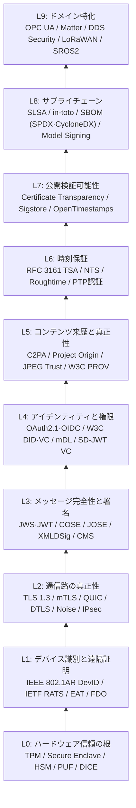
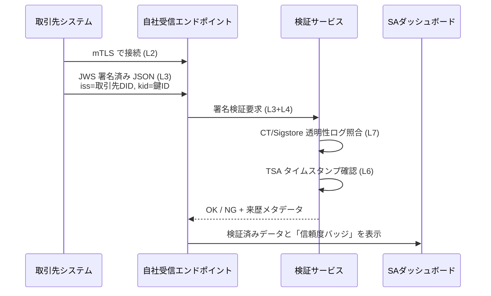
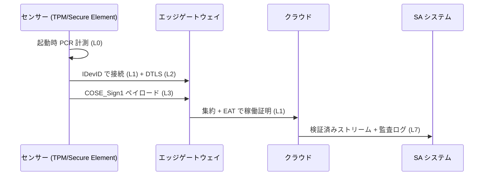
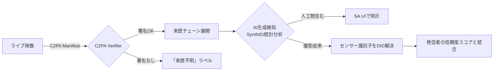
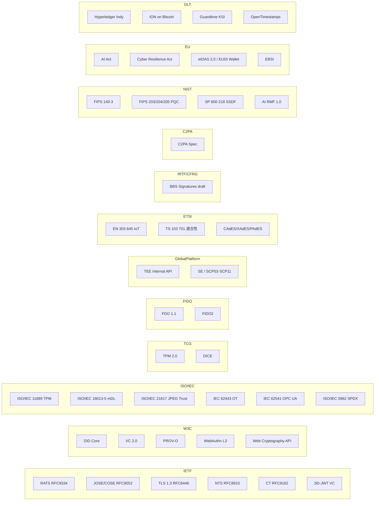

# データ真正性・信頼性の検証技術 — リアルタイムSA/DMを支える信頼の層

リアルタイムでの状況認識（SA）と意思決定（DM）は、入力となるデータが「本当に本物か」「本当にその発信源から来たのか」に決定的に依存します。
ところが現代は、**ライブ映像すらリアルタイムに改竄できる時代**です。本人が怒っていても笑顔で配信できる（[DeepFaceLive](https://github.com/iperov/DeepFaceLive) など）、テキスト・センサーデータならさらに容易に偽装できます。

このページでは、SA/DM の判断材料となるデータについて「**何を、どのレイヤーで、どの標準で**検証するか」を網羅的にカタログ化します。

!!! note "本ページの仕様情報の最終確認日"
    主要な標準・規格について、**2026-06 時点**での版数・施行状況を反映しています。標準は継続的に更新されるため、特に C2PA・W3C VC・EU CRA・eIDAS 2.0・ETSI EN 303 645・NIST AI RMF など動きの早い領域は、実装前に各団体公式サイトで版数と発効日を必ず再確認してください。

!!! info "想定する脅威モデル"
    - **コンテンツ改竄**: ディープフェイク映像・音声・画像、生成AIによる合成
    - **発信源詐称**: 取引先・公的機関・センサーを騙る中間者攻撃やリプレイ
    - **デバイス成りすまし**: 管理外のセンサーが管理下のセンサーを名乗る
    - **時刻詐称**: 過去のデータを「今」として配信
    - **サプライチェーン汚染**: モデル・ソフトウェア・ファームウェアの改変

---

## 1. 信頼の階層モデル (Trust Stack)

「信頼」は単一のプロトコルでは作れず、**ハードウェアの根 → 識別 → 通信 → メッセージ → 来歴 → 時刻 → 公開検証**という積み上げで担保します。

各レイヤーが**下位レイヤーを前提**に成立する点が肝です。たとえば C2PA の署名は、その鍵が安全なデバイス（L0）で生成され、識別子（L1）に紐づき、時刻（L6）と監視可能性（L7）で裏付けられていなければ「絵に描いた来歴」になります。

---

## 2. レイヤー別カタログ

### L0: ハードウェア信頼の根 (Root of Trust)

| 技術 | 役割 | 標準化主体 |
|---|---|---|
| TPM 2.0 | 鍵の隔離・PCR・Attestation Key | [TCG](https://trustedcomputinggroup.org/) / ISO/IEC 11889 |
| Intel SGX / TDX, AMD SEV-SNP, ARM CCA | Confidential Computing | Intel / AMD / Arm, [CCC](https://confidentialcomputing.io/) |
| Apple Secure Enclave, Android StrongBox | モバイル鍵保護 | ベンダ独自 + Common Criteria |
| HSM (FIPS 140-3) | サーバ側鍵管理 | [NIST FIPS 140-3](https://csrc.nist.gov/pubs/fips/140-3/final) |
| PUF (Physical Unclonable Function) | 個体固有な鍵生成 | ISO/IEC 20897 |
| DICE (Device Identifier Composition Engine) | 階層的なデバイス身分証 | [TCG DICE](https://trustedcomputinggroup.org/work-groups/dice-architectures/) |
| GlobalPlatform TEE / SE | TEE 内部 API、SE アプレット、SCP の業界仕様 | [GlobalPlatform Specifications](https://globalplatform.org/specs-library/) |
| GlobalPlatform SCP03 / SCP11 | SE への安全なチャネル | [GP Secure Channel Protocols](https://globalplatform.org/specs-library/?filter-committee=card) |

ポイント: 「センサーが本当にうちのものか」の最終的な根拠は、**工場出荷時に焼き込まれた鍵がここに守られているか**で決まります。
GlobalPlatform は **TEE (TrustZone 系) と SE (eSE/eUICC/SIM) を結ぶ業界横断の API・プロトコル仕様**を提供し、Android Keystore・各種モバイル決済・eSIM の土台になっています。SE の中で鍵を生成・退避する仕組み (SCP03/SCP11) を選んで初めて、L1 以降の Attestation が意味を持ちます。

### L1: デバイス識別と遠隔証明 (Attestation)

| 技術 | 何を保証 | 出典 |
|---|---|---|
| IEEE 802.1AR (IDevID / LDevID) | 製造由来のデバイス識別証明書 | [IEEE 802.1AR-2018](https://standards.ieee.org/ieee/802.1AR/6995/) |
| IETF RATS Architecture | 検証者・証明者の役割モデル | [RFC 9334](https://www.rfc-editor.org/rfc/rfc9334) |
| EAT (Entity Attestation Token) | アテステーション結果の運搬形式 | [draft-ietf-rats-eat](https://datatracker.ietf.org/doc/draft-ietf-rats-eat/) |
| TPM Remote Attestation (PCR + Quote) | 起動状態の証明 | TCG |
| FIDO Device Onboard (FDO) | 工場〜現場のゼロタッチ鍵投入 | [FIDO Alliance FDO 1.1](https://fidoalliance.org/specs/FDO/FIDO-Device-Onboard-RD-v1.1-20211214/) |
| Arm PSA Certified | IoT デバイス成熟度認証 | [PSA Certified](https://www.psacertified.org/) |

センサーやエッジデバイスが「管理下のものか」を**鍵だけでなく稼働状態まで含めて証明**するのが Attestation の本質です。

### L2: 通信路の真正性

| 技術 | 仕様 |
|---|---|
| TLS 1.3 | [RFC 8446](https://www.rfc-editor.org/rfc/rfc8446) |
| QUIC | [RFC 9000](https://www.rfc-editor.org/rfc/rfc9000) / [RFC 9001](https://www.rfc-editor.org/rfc/rfc9001) |
| DTLS 1.3 | [RFC 9147](https://www.rfc-editor.org/rfc/rfc9147) |
| mTLS (相互認証) | TLS のクライアント証明書プロファイル |
| Noise Protocol Framework | [Noise spec](https://noiseprotocol.org/) (WireGuard, Signal が採用) |
| IPsec / IKEv2 | [RFC 7296](https://www.rfc-editor.org/rfc/rfc7296) |
| MASQUE / CONNECT-UDP | [RFC 9298](https://www.rfc-editor.org/rfc/rfc9298) |

取引先からのデータ流入は、**mTLS + 証明書ピンニング**が現実解。クライアント側の証明書は L0・L1 で守る。

### L3: メッセージ完全性と署名

| 技術 | 用途 | 仕様 |
|---|---|---|
| JWS / JWT | JSON 系の署名 | [RFC 7515](https://www.rfc-editor.org/rfc/rfc7515) / [RFC 7519](https://www.rfc-editor.org/rfc/rfc7519) |
| JWE | JSON 暗号 | [RFC 7516](https://www.rfc-editor.org/rfc/rfc7516) |
| COSE | CBOR 署名（IoT 向け） | [RFC 9052](https://www.rfc-editor.org/rfc/rfc9052) / [RFC 9053](https://www.rfc-editor.org/rfc/rfc9053) |
| XML Signature | 電子契約・電子署名 | [W3C XMLDSig](https://www.w3.org/TR/xmldsig-core2/) |
| CAdES / XAdES / PAdES | 長期署名 | ETSI EN 319 122 / 132 / 142 |
| CMS | バイナリ署名 | [RFC 5652](https://www.rfc-editor.org/rfc/rfc5652) |
| HMAC | 共通鍵での MAC | [RFC 2104](https://www.rfc-editor.org/rfc/rfc2104) |
| Hash-based Signatures (XMSS/LMS) | 量子耐性署名 | [RFC 8391](https://www.rfc-editor.org/rfc/rfc8391) / [RFC 8554](https://www.rfc-editor.org/rfc/rfc8554) |

「センサーがバラまく軽量データ」は COSE、「Web/SaaS 経由のデータ」は JWS が定番。

### L4: アイデンティティ・権限・属性

| 技術 | 目的 | 仕様 |
|---|---|---|
| OAuth 2.1 | 認可 | [draft-ietf-oauth-v2-1](https://datatracker.ietf.org/doc/draft-ietf-oauth-v2-1/) |
| OpenID Connect | 認証 | [OIDC Core](https://openid.net/specs/openid-connect-core-1_0.html) |
| FIDO2 / WebAuthn | パスワードレス認証 | [W3C WebAuthn L3](https://www.w3.org/TR/webauthn-3/) |
| W3C DID | 自己主権型識別子 | [W3C DID Core](https://www.w3.org/TR/did-core/) |
| W3C Verifiable Credentials (VC) 2.0 | 属性証明 | [W3C VC 2.0](https://www.w3.org/TR/vc-data-model-2.0/)（**2025-05-15 に W3C Recommendation 化**） |
| SD-JWT (基盤) | JWT 選択的開示の基盤仕様 | **[RFC 9901](https://www.rfc-editor.org/rfc/rfc9901)（2025-11 公開）** |
| SD-JWT VC | 選択的開示 JWT VC | [draft-ietf-oauth-sd-jwt-vc](https://datatracker.ietf.org/doc/draft-ietf-oauth-sd-jwt-vc/)（v16、ドラフト継続中） |
| ISO/IEC 18013-5 (mDL) | モバイル運転免許 | [ISO/IEC 18013-5](https://www.iso.org/standard/69084.html) |
| eIDAS 2.0 / EUDI Wallet | EU の身分証エコシステム | [EU eIDAS 2.0 Regulation](https://eur-lex.europa.eu/eli/reg/2024/1183/oj) |

「誰が発した情報か」を**人間にも組織にもセンサーにも**与える層。VC/DID は SA/DM の入力検証で今後の本命。

#### ゼロ知識証明 (ZKP) によるプライバシー保全検証

「**属性を開示せずに条件だけ証明する**」技術。SA/DM では「協力者の身元は伏せたまま資格だけ確認」「機微なテレメトリの値は伏せて閾値超過のみ通知」など、**情報統制と検証性を両立**する場面で効きます。

| 技術 | 用途 | 仕様・実装 |
|---|---|---|
| BBS+ Signatures / BBS Signature Scheme | VC の選択的開示 + 非リンク可能性 | [IETF draft-irtf-cfrg-bbs-signatures](https://datatracker.ietf.org/doc/draft-irtf-cfrg-bbs-signatures/) |
| Data Integrity BBS 2023 Cryptosuite | W3C VC への BBS 統合 | [W3C VC Data Integrity BBS](https://www.w3.org/TR/vc-di-bbs/) |
| SD-JWT (Selective Disclosure JWT) | 開示属性のサブセット選択（厳密には非ZKP、ハッシュ開示方式） | **[RFC 9901](https://www.rfc-editor.org/rfc/rfc9901)（2025-11 RFC 化）** |
| ISO/IEC 18013-5 mDL の ZKP プロファイル | 「18歳以上か」だけ証明する年齢検証 | [ISO/IEC 18013-5](https://www.iso.org/standard/69084.html) |
| zk-SNARK (Groth16 / PLONK) | 汎用 ZK 回路 | 主要実装: [snarkjs](https://github.com/iden3/snarkjs) |
| zk-STARK | 量子耐性・透明セットアップ | [StarkWare](https://starkware.co/) |
| ISO/IEC 18370 シリーズ | 盲信号（Blind Signature）の国際標準 | [ISO/IEC 18370-1/2](https://www.iso.org/standard/62290.html) |

SA/DM での使いどころ:

- **匿名通報・内部告発**: 通報者が「自社の正社員」であることだけを ZKP で示し、本人特定はしない
- **多国籍オペレーション**: パートナー機関の人員に対し、所属国は伏せて「クリアランス保有」のみ証明
- **センサー融合**: 競合企業同士が「私のセンサー群の合計値は閾値未満」を相手に開示せず証明

注意点: ZKP は**プロトコル設計コストが高く、誤実装が即プライバシー漏洩**につながります。
W3C/IETF が固めた **BBS+ ベースの VC** を起点に、必要な箇所だけ汎用 zk に拡張する漸進採用が現実的です。

### L5: コンテンツ来歴 (Provenance) と真正性

ディープフェイクや生成 AI への直接の打ち手はここ。**「真贋判定」ではなく「来歴の連鎖」**を検証する発想です。

| 技術 | 何が分かるか | 仕様 |
|---|---|---|
| C2PA / Content Credentials | 撮影・編集・AI 生成の連鎖を署名付きで埋め込み | [C2PA Spec 2.x](https://spec.c2pa.org/) (2.2: 2025-05, 2.3: 2025-12 でライブ配信対応, 2.4 系へ拡張中) |
| JPEG Trust | C2PA を JPEG 標準に統合 | [ISO/IEC 21617-1:2025](https://www.iso.org/standard/86831.html)（Part 1 発行済、Part 2/3 開発中） |
| Project Origin | 報道機関向けの来歴チェーン | [Project Origin](https://www.originproject.info/) |
| CAI (Content Authenticity Initiative) | 業界連合 | [CAI](https://contentauthenticity.org/) |
| W3C PROV | 汎用来歴オントロジー | [W3C PROV-O](https://www.w3.org/TR/prov-o/) |
| SynthID | AI 生成画像・テキスト・音声の電子透かし | [Google DeepMind SynthID](https://deepmind.google/technologies/synthid/) |
| Leica M11-P / Sony α1 II / Nikon Z6III | カメラ内蔵 C2PA 署名 | 各社プレスリリース |
| Samsung Galaxy S25 標準カメラ | 民生スマートフォン初の純正 C2PA 署名 (2025年) | Samsung / C2PA 公式 |

C2PA は「**改竄されていない**」を保証するのではなく、「**誰が、どんな道具で、どう加工したか**」の改竄不能な記録です。SA/DM の UI ではこの履歴を**そのまま意思決定者に見せる**設計が望ましい。

### L6: 時刻保証

| 技術 | 役割 | 仕様 |
|---|---|---|
| RFC 3161 Time-Stamp Protocol | 信頼できる第三者による時刻署名 | [RFC 3161](https://www.rfc-editor.org/rfc/rfc3161) |
| NTS (Network Time Security) | NTP 自体の認証 | [RFC 8915](https://www.rfc-editor.org/rfc/rfc8915) |
| Roughtime | 改竄不能な近似時刻 | [draft-ietf-ntp-roughtime-19](https://datatracker.ietf.org/doc/draft-ietf-ntp-roughtime/)（**2026-03-17 に Experimental RFC として IESG 承認**、RFC 番号付与待ち） |
| IEEE 1588 PTP + AUTHENTICATION TLV | 産業用高精度時刻認証 | [IEEE 1588-2019](https://standards.ieee.org/ieee/1588/6825/) |

**「いつのデータか」が改竄可能だと、全レイヤーの署名がリプレイ攻撃に弱くなる。**

### L7: 公開検証可能性 (Transparency)

第三者が**いつでも独立に検証できる**ログ。発行者の鍵が漏れたとしても、過去の発行記録は隠せない。

| 技術 | 領域 | 仕様 |
|---|---|---|
| Certificate Transparency | TLS 証明書発行ログ | [RFC 9162](https://www.rfc-editor.org/rfc/rfc9162) |
| Sigstore / Rekor | ソフトウェア署名ログ。**Rekor v2 が 2025-10 に GA**（タイルログ + Trillian-Tessera） | [Sigstore](https://www.sigstore.dev/) |
| OpenTimestamps | Bitcoin による分散タイムスタンプ | [OpenTimestamps](https://opentimestamps.org/) |
| Trillian | 汎用 Merkle Tree ログ | [Google Trillian](https://github.com/google/trillian) |

#### ブロックチェーン／分散型台帳 (DLT) によるプロベナンス

「**単一の透明性ログ運営者すら信頼しない**」場合、合意形成を分散させた DLT が選択肢に上がります。

| 技術 | 用途 | 出典 |
|---|---|---|
| Hyperledger Indy | 自己主権型 ID と VC レジストリ | [Hyperledger Indy](https://www.hyperledger.org/projects/hyperledger-indy) |
| Hyperledger Fabric | 許可型サプライチェーン台帳 | [Hyperledger Fabric](https://www.hyperledger.org/projects/fabric) |
| ION (Sidetree on Bitcoin) | スケーラブルな DID メソッド | [ION](https://identity.foundation/ion/) |
| Guardtime KSI | キーレス署名（Bitcoin 風 Merkle 集約） | [Guardtime KSI](https://guardtime.com/technology) |
| EBSI (European Blockchain Services Infrastructure) | EU 公的書類の検証台帳 | [EBSI](https://ec.europa.eu/digital-building-blocks/sites/display/EBSI/Home) |
| C2PA + Blockchain bindings (実験的) | C2PA Manifest のオンチェーン公証 | C2PA Spec 補遺 |
| IBM Food Trust / VeChain など | 物理サプライチェーン来歴 | 各社ドキュメント |

ただし**現実的な評価**:

- 多くの SA/DM ユースケースでは、**C2PA + Certificate Transparency + Sigstore（中央運営だが公開検証可能）の組み合わせの方が低コストかつ高性能**
- DLT は「**運営者すら結託しても改竄不能**」が必要な場面、すなわち国家間プロジェクト・規制対応・長期保存（数十年）で初めて元が取れる
- Bitcoin に外部ハッシュを書き込む **OpenTimestamps** は両者の中間で、運営者は不要だが既存 PKI と素直に併用できる現実解
- スループット、確定性、エネルギーコスト、規制リスクのトレードオフを設計時に明示することが必須

> 設計指針: **「中央運営でも検証性は十分か?」「数十年スパンで運営者が消えるリスクはあるか?」**の 2 点で DLT 投入を判断する。多くの場合の答えは No（=透明性ログで十分）。

### L8: サプライチェーン (ソフトウェア・モデル)

SA/DM システム自体や、それが使う AI モデル・データセットも改竄対象です。

| 技術 | 目的 | 仕様 |
|---|---|---|
| SLSA | サプライチェーン成熟度フレーム | [SLSA v1.0](https://slsa.dev/spec/v1.0/) |
| in-toto | ビルド工程の検証 | [in-toto](https://in-toto.io/) |
| SPDX | SBOM 標準 | [ISO/IEC 5962:2021](https://www.iso.org/standard/81870.html) |
| CycloneDX | SBOM / ML-BOM / SaaS-BOM | [OWASP CycloneDX](https://cyclonedx.org/) |
| NIST SSDF | セキュア開発フレーム | [NIST SP 800-218](https://csrc.nist.gov/pubs/sp/800/218/final) |
| Model Signing | ML モデル署名 | [Sigstore Model Signing](https://github.com/sigstore/model-transparency) |
| EU Cyber Resilience Act (CRA) | EU 域内製品の必須要件化。**2024-12-10 発効／報告義務 2026-09-11／全面適用 2027-12-11** | [EU CRA](https://digital-strategy.ec.europa.eu/en/policies/cyber-resilience-act) |
| NIST AI RMF + Generative AI Profile (AI 600-1) | 生成AIに固有のリスク領域 12 と対応アクション。**2026-04 に Critical Infrastructure Profile のコンセプトノート公開、2026-02 に AI Agent Standards Initiative 始動** | [NIST AI 600-1](https://nvlpubs.nist.gov/nistpubs/ai/NIST.AI.600-1.pdf) |

### L9: ドメイン特化 (OT / IoT / ロボティクス)

| 技術 | ドメイン | 仕様 |
|---|---|---|
| OPC UA Security | 産業オートメーション | [IEC 62541-2](https://reference.opcfoundation.org/) |
| IEC 62443 | OT/ICS セキュリティ | [IEC 62443 シリーズ](https://www.iec.ch/blog/understanding-iec-62443) |
| Matter (最新 1.5.1) | スマートホーム IoT。**1.5 で WebRTC ベースのカメラ・ドアベル対応 (2025-11)** | [CSA Matter](https://csa-iot.org/all-solutions/matter/) |
| Thread | IPv6 メッシュ | [Thread Group](https://www.threadgroup.org/) |
| LoRaWAN セキュリティ | LPWAN | [LoRa Alliance Security](https://lora-alliance.org/resource_hub/lorawan-security-whitepaper/) |
| DDS Security | ロボティクス・自動車 | [OMG DDS Security 1.1](https://www.omg.org/spec/DDS-SECURITY/1.1/) |
| SROS2 | ROS 2 のセキュリティ | [SROS2](https://design.ros2.org/articles/ros2_dds_security.html) |
| MQTT v5 + TLS | IoT メッセージング | [OASIS MQTT 5.0](https://docs.oasis-open.org/mqtt/mqtt/v5.0/mqtt-v5.0.html) |
| 3GPP 5G AKA / SUCI | セルラー識別子保護 | [3GPP TS 33.501](https://www.3gpp.org/dynareport/33501.htm) |
| ETSI EN 303 645 | 消費者 IoT サイバーセキュリティ基準（13 項目／68 条項／33 必須要件） | [ETSI EN 303 645 v3.1.3 (2024-09)](https://www.etsi.org/deliver/etsi_en/303600_303699/303645/) |
| ETSI TS 103 701 | EN 303 645 への適合性評価 | [ETSI TS 103 701](https://www.etsi.org/deliver/etsi_ts/103700_103799/103701/) |

**ETSI EN 303 645** はカメラ・スマートスピーカー・コネクテッド家電など「**民生用 IoT に関する事実上の最低ライン**」を定めた欧州規格で、以下の 13 の必須要件を含みます。

1. デフォルトパスワード禁止
2. 脆弱性報告窓口の整備
3. ソフトウェアの最新化（OTA）
4. 認証情報の安全な保管
5. 通信時の機密性確保
6. 攻撃対象面の最小化
7. ソフトウェア完全性の保証
8. 個人データの保護
9. システムレジリエンス
10. テレメトリの異常監視
11. 個人データの容易な削除
12. インストール／メンテナンスの容易さ
13. 入力データの検証

英国の **PSTI Act 2022**（[Product Security and Telecommunications Infrastructure Act](https://www.legislation.gov.uk/ukpga/2022/46)、2024 年 4 月施行）はこの規格を法的基準に取り込んでおり、**EU CRA・シンガポール CLS・インド TEC との相互参照**も進んでいます。
SA/DM システムに民生センサーを組み込む場合、調達基準として EN 303 645 適合を要求するのが最も簡潔です。

---

## 3. SA/DM への適用シナリオ

### シナリオA: 取引先からの「業務データ」

実装上の指針:

- 取引先証明書は CT に載っているもののみ受理
- ペイロードは JWS、`iss` は W3C DID または X.509 SAN URI
- 時刻は受信側ではなく**送信側の TSA 署名**を信頼の根に

### シナリオB: 自社管理下のセンサー配信

ここでの最大の落とし穴は「**鍵があれば本物**」と考えてしまうこと。
鍵が漏れた・複製された場合に備え、**Remote Attestation で稼働中のソフトウェアまで毎回証明**するのが現代のベストプラクティス。

### シナリオC: SNS・外部映像をSA入力にする

ポイント:

- C2PA は「真贋」ではなく「来歴」のみ。SA UI 側でその意味を**意思決定者に明示**する必要がある
- リアルタイム配信における C2PA は ISO/IEC 21617 シリーズで標準化が進行中

### シナリオD: 生成AIによる意思決定支援結果の真正性

LLM やビジョン AI が出した分析結果も検証対象です。

- モデルバイナリは **Sigstore Model Signing** で署名
- 学習データの来歴は **MLBOM (CycloneDX)** で記述
- 推論ログは**改竄耐性ログ** (Trillian / Rekor 風) に追記
- 出力テキスト・画像には **SynthID** または **C2PA AI Manifest** を付与

---

## 4. 標準化マップ（団体 × レイヤー）

主要団体の役割を一言で:

- **IETF**: トランスポートとデータ表現の RFC
- **IRTF/CFRG**: 新規暗号方式（BBS+ など）のレビュー
- **W3C**: Web ブラウザを介した識別と検証
- **ISO/IEC**: 産業横断の規格と互換性
- **TCG**: ハードウェア信頼の根
- **GlobalPlatform**: TEE / Secure Element の業界仕様
- **ETSI**: 欧州主導の通信・IoT 規格（EN 303 645 など消費者基準）
- **C2PA**: コンテンツ来歴の事実上の標準
- **NIST**: 暗号と AI/サプライチェーンの基準
- **FIDO Alliance**: パスワードレス認証とデバイス投入
- **DLT 系**: 単一運営者を信用しない長期来歴用途
- **EU**: 規制によって**標準採用を強制**する立場（AI Act / CRA / eIDAS 2.0 / PSTI 整合）

---

## 5. TypeScript 実装の足がかり

普段 TypeScript を書く読者向けに、主要レイヤーで使える OSS を挙げます。

| レイヤー | ライブラリ | 用途 |
|---|---|---|
| L2 | Node.js `tls` / undici | mTLS クライアント・サーバ |
| L3 | [`jose`](https://github.com/panva/jose) | JWS / JWT / JWE |
| L3 (IoT) | [`cose-js`](https://github.com/erdtman/cose-js) | COSE 署名検証 |
| L4 | [`@transmute/verifiable-credentials`](https://github.com/transmute-industries/verifiable-credentials) | W3C VC |
| L4 | [`did-resolver`](https://github.com/decentralized-identity/did-resolver) | DID 解決 |
| L4 | [`@simplewebauthn/server`](https://github.com/MasterKale/SimpleWebAuthn) | WebAuthn |
| L4 (ZKP) | [`@digitalbazaar/bbs-signatures`](https://github.com/digitalbazaar/bbs-signatures) | BBS 署名・選択的開示 |
| L4 (ZKP) | [`@sd-jwt/core`](https://github.com/openwallet-foundation-labs/sd-jwt-js) | SD-JWT |
| L4 (ZKP) | [`snarkjs`](https://github.com/iden3/snarkjs) | zk-SNARK 回路の生成・検証 |
| L5 | [`c2pa-node`](https://github.com/contentauth/c2pa-node) | C2PA 検証 |
| L6 | [`@digitalbazaar/timestamp`](https://www.npmjs.com/package/@digitalbazaar/timestamp) 等 | TSA 連携 |
| L7 | [`@sigstore/sign`](https://github.com/sigstore/sigstore-js) | Sigstore 署名 |

ブラウザ側では **[Web Cryptography API](https://www.w3.org/TR/WebCryptoAPI/)** が標準。`SubtleCrypto.verify()` で JWS の検証は完結します。Angular なら HTTP インターセプタ層で署名検証してから NgRx に流す設計が綺麗です。

---

## 6. 見落としやすい落とし穴

1. **時刻同期がないと署名はほぼ無意味**。`exp/nbf` の検証が崩れる
2. **C2PA は「改竄されていない」を証明しない**。あくまで来歴。UI 上で誤解させないラベリング設計が必要
3. **DevID は工場出荷時点の身分証**。「今この瞬間、改竄ファームが動いてないか」は Attestation で別途確認
4. **量子耐性 (PQC) への移行が始まっている**。[FIPS 203 (ML-KEM)](https://csrc.nist.gov/pubs/fips/203/final) / [FIPS 204 (ML-DSA)](https://csrc.nist.gov/pubs/fips/204/final) / [FIPS 205 (SLH-DSA)](https://csrc.nist.gov/pubs/fips/205/final) は 2024 年 8 月に公開済
5. **取引先の鍵管理は自社の責任ではないが、CT で監視はできる**。ピン留めではなく CT 監視に倒すと運用負荷が下がる
6. **AI 出力にも署名を**。SA UI に出る分析結果が誰の責任で出されたかを技術的に追跡可能にする

---

## 7. 今後 10 年の動向（2026-06 時点）

- **PQC 全面移行**: TLS, JOSE, COSE, X.509 すべてが PQ ハイブリッドへ。FIPS 203/204/205 (2024-08) を起点に IETF で hybrid キー交換のドラフトが進行中
- **Confidential Computing の主流化**: クラウド側でも「他人に見えないまま計算」（Intel TDX / AMD SEV-SNP / ARM CCA）
- **EUDI Wallet と mDL の普及**: 「身分の VC」が SA の前提に。**EU 全加盟国で 2026-12-24 までに最低 1 つの認証済ウォレットを提供義務**
- **C2PA のカメラ標準搭載**: Leica・Sony・Nikon に続き、**Samsung Galaxy S25 で民生スマホ純正対応 (2025)**。CSA Matter 1.5 のカメラ統合とも連動
- **AI Act / CRA / NIS2 の規制効果**: **CRA は 2026-09-11 から報告義務開始、2027-12-11 から全面適用**。「来歴を出せない製品は EU で売れない」状況へ
- **Roughtime と NTS の併用**: **Roughtime が 2026-03 に Experimental RFC として承認**、改竄不能な時刻がコモディティ化へ
- **AI エージェント標準化**: NIST が 2026-02 に AI Agent Standards Initiative を始動、エージェント間の認証・来歴・責任分界が新たな標準化テーマに

---

## 8. SA/DM 設計者向けチェックリスト

- [ ] 入力データの**発信源**は L4 (DID/X.509/OIDC) で識別できているか
- [ ] **通信路**は mTLS かつ証明書は CT 監視下か
- [ ] **メッセージ**は JWS/COSE で署名され、検証コードがアプリ層にあるか
- [ ] センサーデータは**ハードウェア鍵**で署名されているか
- [ ] 配信時刻は**送信側 TSA**で署名されているか
- [ ] 外部メディア入力に C2PA 検証パイプラインがあるか
- [ ] AI 出力に SynthID / C2PA AI Manifest を埋め込んでいるか
- [ ] 利用するモデル・SBOM・コンテナイメージが Sigstore で署名・透明性ログに登録されているか
- [ ] UI 上で「来歴」「検証結果」「信頼度」を意思決定者に**そのまま見せている**か
- [ ] PQC 移行計画があるか
- [ ] 民生 IoT を採用する場合、**ETSI EN 303 645 適合**を調達要件にしているか
- [ ] **ZKP / 選択的開示**で過剰な属性開示を避ける設計余地を検討したか
- [ ] DLT を使うかどうかを「中央運営者の信頼性」「長期保存要件」で明示的に判断したか

---

## 参考

- IETF: [RFC 9334 RATS Architecture](https://www.rfc-editor.org/rfc/rfc9334), [RFC 9052 COSE](https://www.rfc-editor.org/rfc/rfc9052), [RFC 8446 TLS 1.3](https://www.rfc-editor.org/rfc/rfc8446), [RFC 9901 SD-JWT](https://www.rfc-editor.org/rfc/rfc9901)
- IRTF/CFRG: [draft-irtf-cfrg-bbs-signatures-10](https://datatracker.ietf.org/doc/draft-irtf-cfrg-bbs-signatures/)
- W3C: [DID Core](https://www.w3.org/TR/did-core/), [Verifiable Credentials 2.0 (Rec 2025-05)](https://www.w3.org/TR/vc-data-model-2.0/), [PROV-O](https://www.w3.org/TR/prov-o/)
- C2PA: [Specifications portal](https://spec.c2pa.org/)
- ISO/IEC: [21617-1:2025 JPEG Trust](https://www.iso.org/standard/86831.html)
- TCG: [TPM 2.0](https://trustedcomputinggroup.org/resource/tpm-library-specification/), [DICE](https://trustedcomputinggroup.org/work-groups/dice-architectures/)
- GlobalPlatform: [Specifications Library](https://globalplatform.org/specs-library/)
- ETSI: [EN 303 645 v3.1.3](https://www.etsi.org/deliver/etsi_en/303600_303699/303645/), [TS 103 701](https://www.etsi.org/deliver/etsi_ts/103700_103799/103701/)
- NIST: [FIPS 203/204/205 PQC](https://csrc.nist.gov/projects/post-quantum-cryptography), [AI RMF 1.0](https://www.nist.gov/itl/ai-risk-management-framework), [AI 600-1 Generative AI Profile](https://nvlpubs.nist.gov/nistpubs/ai/NIST.AI.600-1.pdf)
- EU: [AI Act](https://eur-lex.europa.eu/eli/reg/2024/1689/oj), [CRA (発効 2024-12-10／報告義務 2026-09-11／全面適用 2027-12-11)](https://digital-strategy.ec.europa.eu/en/policies/cyber-resilience-act), [eIDAS 2.0 (EUDI Wallet 2026-12-24 提供義務)](https://eur-lex.europa.eu/eli/reg/2024/1183/oj)
