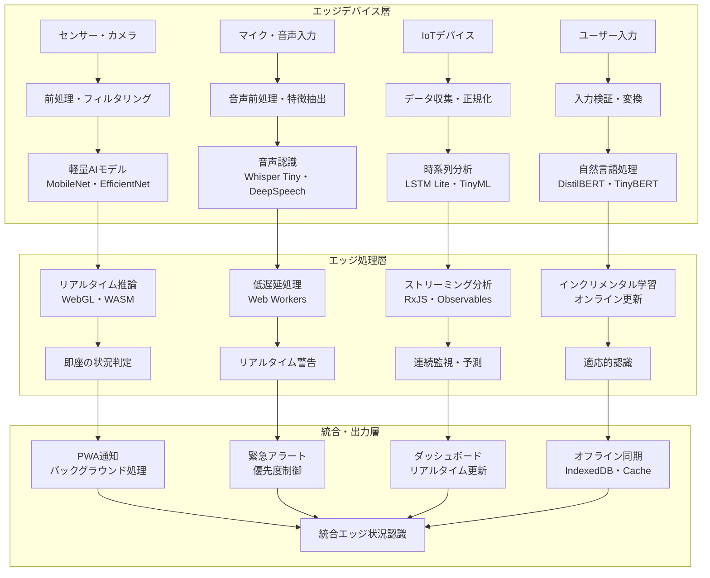

# エッジAI・リアルタイム処理による状況認識

!!! info "このページについて"

    このページでは、エッジAI（Edge AI）とリアルタイム処理技術が状況認識（Situational Awareness）にもたらす革命的変化について詳しく解説します。  
    クラウドに依存しない現場での即座のAI判断、低遅延処理、プライバシー保護から、ブラウザベースのエッジAI実装まで、現地処理による状況認識技術を理論と実装の両面から掘り下げます。  
    実践的なTypeScriptコード例により、PWAとWebAssemblyを活用したリアルタイムエッジAIシステムの構築方法を具体的に示します。

## エッジAIが変える状況認識の世界

エッジAI（Edge AI）は、クラウドサーバーではなくデバイス端末やエッジサーバーでAI処理を実行する技術として、状況認識の応答性、プライバシー保護、信頼性を飛躍的に向上させています。ネットワーク接続に依存せず、リアルタイムでの状況判断を可能にするエッジAIは、自動運転、産業制御、医療機器、防犯システムなど、即座の判断が求められる分野で必須の技術となっています。

本章では、エッジAI技術が状況認識をどのように変革しているか、ブラウザベースの実装から最新の軽量化技術まで体系的に解説します。

## エッジAIによる状況認識の基本フレームワーク

### エッジAIアーキテクチャと状況認識の対応



### エッジAI技術と状況認識への応用

| エッジAI技術 | 状況認識への応用 | 主要技術 | 具体例 |
|---|---|---|---|
| **軽量モデル** | 高速現地推論 | MobileNet、EfficientNet、SqueezeNet | スマートフォンでの画像認識 |
| **モデル圧縮** | メモリ・計算量削減 | 量子化、プルーニング、知識蒸留 | IoTデバイスでのリアルタイム分析 |
| **ハードウェア最適化** | 専用チップでの高速化 | WebGL、WebAssembly、NPU | ブラウザでのリアルタイム映像解析 |
| **フェデレーテッドラーニング** | プライバシー保護学習 | 分散学習、差分プライバシー | 医療データの協調学習 |
| **ストリーミング処理** | 連続データの即座処理 | Apache Kafka、RxJS | センサーデータのリアルタイム分析 |
| **インクリメンタル学習** | リアルタイム適応 | オンライン学習、適応フィルタ | 環境変化への自動適応 |
| **エッジオーケストレーション** | 複数デバイス連携 | Kubernetes Edge、OpenFaaS | 分散エッジシステムの協調 |

## ブラウザベースエッジAIの実装

### TensorFlow.js・ONNXランタイム統合システム

ブラウザ環境でのリアルタイムAI推論を実現する包括的なシステムです。

??? TypeScript実装例

    この実装では、TensorFlow.jsとONNX Runtime Webを統合したブラウザベースのエッジAIシステムです。WebGL、WebAssembly、Web Workersを活用してリアルタイム推論を実現し、PWAとの統合によりオフライン機能も提供します。

    ```typescript
    // ブラウザベースエッジAI統合システム
    interface EdgeAIInferenceResult {
      inferenceId: string;
      timestamp: Date;
      modelType: 'tensorflow' | 'onnx' | 'webgl' | 'wasm';
      predictions: Prediction[];
      processingTime: number;
      memoryUsage: MemoryUsage;
      confidence: number;
      metadata: InferenceMetadata;
    }

    interface Prediction {
      class: string;
      confidence: number;
      boundingBox?: BoundingBox;
      segmentationMask?: Uint8Array;
      embeddings?: Float32Array;
    }

    interface MemoryUsage {
      heap: number;
      gpu: number;
      buffer: number;
      peak: number;
    }

    interface ModelConfiguration {
      modelPath: string;
      runtime: 'tfjs' | 'onnx' | 'webgl' | 'wasm';
      quantization: 'fp32' | 'fp16' | 'int8';
      batchSize: number;
      inputShape: number[];
      outputShape: number[];
    }

    class BrowserEdgeAISystem {
      private tfModels: Map<string, tf.LayersModel> = new Map();
      private onnxSessions: Map<string, InferenceSession> = new Map();
      private webglBackend: WebGLBackend;
      private wasmBackend: WebAssemblyBackend;
      private workerPool: WorkerPool;
      private performanceMonitor: PerformanceMonitor;
      private memoryManager: MemoryManager;
      
      constructor() {
        this.initializeRuntimes();
        this.setupPerformanceMonitoring();
        this.initializeWorkerPool();
      }
      
      private async initializeRuntimes(): Promise<void> {
        // TensorFlow.js バックエンド初期化
        await tf.ready();
        await tf.setBackend('webgl');
        
        // WebGL バックエンドの設定
        this.webglBackend = new WebGLBackend({
          precision: 'highp',
          textureDownloadOptimization: true,
          parallelCompilation: true
        });
        
        // WebAssembly バックエンドの設定
        this.wasmBackend = new WebAssemblyBackend({
          simdSupport: this.checkSIMDSupport(),
          threadsSupport: this.checkThreadsSupport(),
          optimization: 'speed'
        });
        
        // ONNX Runtime Web の初期化
        ort.env.wasm.wasmPaths = '/wasm/';
        ort.env.webgl.contextId = 'webgl2';
        
        // メモリ管理システム
        this.memoryManager = new MemoryManager({
          maxHeapSize: 512 * 1024 * 1024, // 512MB
          gcThreshold: 0.8,
          preallocation: true
        });
      }
      
      // 複数モデルの並列読み込み
      async loadModels(
        modelConfigs: ModelConfiguration[]
      ): Promise<ModelLoadResult[]> {
        const loadPromises = modelConfigs.map(async (config) => {
          try {
            const startTime = performance.now();
            
            let model: any;
            switch (config.runtime) {
              case 'tfjs':
                model = await this.loadTensorFlowModel(config);
                break;
              case 'onnx':
                model = await this.loadONNXModel(config);
                break;
              case 'webgl':
                model = await this.loadWebGLModel(config);
                break;
              case 'wasm':
                model = await this.loadWASMModel(config);
                break;
            }
            
            const loadTime = performance.now() - startTime;
            
            return {
              modelId: config.modelPath,
              runtime: config.runtime,
              model: model,
              loadTime: loadTime,
              memoryFootprint: await this.calculateModelMemoryFootprint(model),
              success: true
            };
            
          } catch (error) {
            return {
              modelId: config.modelPath,
              runtime: config.runtime,
              error: error.message,
              success: false
            };
          }
        });
        
        return Promise.all(loadPromises);
      }
      
      // TensorFlow.js モデルの読み込み
      private async loadTensorFlowModel(
        config: ModelConfiguration
      ): Promise<tf.LayersModel> {
        // モデルの読み込み
        const model = await tf.loadLayersModel(config.modelPath);
        
        // モデルの最適化
        if (config.quantization !== 'fp32') {
          return await this.quantizeModel(model, config.quantization);
        }
        
        // モデルのウォームアップ
        await this.warmupModel(model, config.inputShape);
        
        this.tfModels.set(config.modelPath, model);
        return model;
      }
      
      // ONNX モデルの読み込み
      private async loadONNXModel(
        config: ModelConfiguration
      ): Promise<InferenceSession> {
        const sessionOptions: InferenceSession.SessionOptions = {
          executionProviders: ['webgl', 'cpu'],
          graphOptimizationLevel: 'all',
          enableCpuMemArena: true,
        };
        
        // WebGL プロバイダーの設定
        if (this.webglBackend.isSupported()) {
          sessionOptions.executionProviders = ['webgl'];
        }
        
        const session = await InferenceSession.create(
          config.modelPath,
          sessionOptions
        );
        
        this.onnxSessions.set(config.modelPath, session);
        return session;
      }
      
      // リアルタイム推論の実行
      async performRealtimeInference(
        inputData: any,
        modelId: string,
        options?: InferenceOptions
      ): Promise<EdgeAIInferenceResult> {
        const inferenceId = this.generateInferenceId();
        const startTime = performance.now();
        
        // メモリ使用量の監視開始
        const memoryBefore = await this.measureMemoryUsage();
        
        try {
          // 入力データの前処理
          const preprocessedData = await this.preprocessInput(
            inputData,
            modelId,
            options?.preprocessing
          );
          
          // モデルの種類に応じた推論実行
          let predictions: Prediction[];
          const model = this.getModel(modelId);
          
          if (this.tfModels.has(modelId)) {
            predictions = await this.runTensorFlowInference(
              model as tf.LayersModel,
              preprocessedData
            );
          } else if (this.onnxSessions.has(modelId)) {
            predictions = await this.runONNXInference(
              model as InferenceSession,
              preprocessedData
            );
          } else {
            throw new Error(`Model not found: ${modelId}`);
          }
          
          // 後処理
          const postprocessedPredictions = await this.postprocessPredictions(
            predictions,
            options?.postprocessing
          );
          
          const processingTime = performance.now() - startTime;
          const memoryAfter = await this.measureMemoryUsage();
          
          return {
            inferenceId,
            timestamp: new Date(),
            modelType: this.getModelType(modelId),
            predictions: postprocessedPredictions,
            processingTime,
            memoryUsage: this.calculateMemoryDelta(memoryBefore, memoryAfter),
            confidence: this.calculateOverallConfidence(postprocessedPredictions),
            metadata: {
              modelId,
              inputShape: preprocessedData.shape,
              batchSize: preprocessedData.batchSize,
              backend: await tf.getBackend()
            }
          };
          
        } catch (error) {
          throw new EdgeAIInferenceError(
            `推論エラー: ${error.message}`,
            inferenceId,
            modelId
          );
        } finally {
          // メモリクリーンアップ
          await this.memoryManager.cleanup();
        }
      }
      
      // ストリーミング推論（RxJS統合）
      createInferenceStream(
        inputStream: Observable<any>,
        modelId: string,
        options?: StreamInferenceOptions
      ): Observable<EdgeAIInferenceResult> {
        return inputStream.pipe(
          // バッファリング（バッチ処理用）
          bufferTime(options?.bufferTime || 100),
          filter(buffer => buffer.length > 0),
          
          // 並列推論実行
          mergeMap(batch => 
            from(this.processBatch(batch, modelId, options)).pipe(
              // タイムアウト処理
              timeout(options?.timeout || 5000),
              catchError(error => of({
                error: error.message,
                modelId,
                timestamp: new Date()
              } as EdgeAIInferenceResult))
            )
          ),
          
          // パフォーマンス監視
          tap(result => this.performanceMonitor.recordInference(result)),
          
          // メモリ使用量チェック
          tap(() => this.memoryManager.checkUsage()),
          
          share()
        );
      }
      
      // バッチ推論の処理
      private async processBatch(
        batch: any[],
        modelId: string,
        options?: StreamInferenceOptions
      ): Promise<EdgeAIInferenceResult[]> {
        // バッチサイズの最適化
        const optimalBatchSize = await this.calculateOptimalBatchSize(
          modelId,
          batch.length
        );
        
        const results: EdgeAIInferenceResult[] = [];
        
        // バッチをチャンクに分割
        for (let i = 0; i < batch.length; i += optimalBatchSize) {
          const chunk = batch.slice(i, i + optimalBatchSize);
          
          // 並列処理での推論実行
          const chunkResults = await Promise.all(
            chunk.map(input => 
              this.performRealtimeInference(input, modelId, options)
            )
          );
          
          results.push(...chunkResults);
        }
        
        return results;
      }
      
      // Web Workers での並列処理
      async performParallelInference(
        inputs: any[],
        modelId: string
      ): Promise<EdgeAIInferenceResult[]> {
        const workerTasks = inputs.map((input, index) => ({
          taskId: `inference_${index}`,
          input: input,
          modelId: modelId,
          workerId: index % this.workerPool.size
        }));
        
        return this.workerPool.executeTasks(workerTasks);
      }
      
      // プログレッシブローディング（段階的モデル読み込み）
      async loadModelProgressively(
        modelConfig: ModelConfiguration,
        onProgress?: (progress: LoadProgress) => void
      ): Promise<void> {
        const totalLayers = await this.getModelLayerCount(modelConfig.modelPath);
        let loadedLayers = 0;
        
        // レイヤーごとの段階的読み込み
        for (const layerInfo of await this.getLayerInfo(modelConfig.modelPath)) {
          await this.loadLayer(layerInfo);
          loadedLayers++;
          
          if (onProgress) {
            onProgress({
              loaded: loadedLayers,
              total: totalLayers,
              percentage: (loadedLayers / totalLayers) * 100,
              currentLayer: layerInfo.name
            });
          }
        }
      }
      
      // モデル性能の動的最適化
      async optimizeModelPerformance(
        modelId: string,
        performanceTargets: PerformanceTargets
      ): Promise<OptimizationResult> {
        const currentPerformance = await this.measureModelPerformance(modelId);
        
        const optimizations: OptimizationStrategy[] = [];
        
        // レイテンシ最適化
        if (currentPerformance.latency > performanceTargets.maxLatency) {
          optimizations.push(new LatencyOptimization({
            quantization: 'int8',
            pruning: 0.3,
            batchOptimization: true
          }));
        }
        
        // メモリ最適化
        if (currentPerformance.memoryUsage > performanceTargets.maxMemory) {
          optimizations.push(new MemoryOptimization({
            layerFusion: true,
            constantFolding: true,
            bufferReuse: true
          }));
        }
        
        // 精度最適化
        if (currentPerformance.accuracy < performanceTargets.minAccuracy) {
          optimizations.push(new AccuracyOptimization({
            ensembling: true,
            dataAugmentation: true,
            fineTuning: true
          }));
        }
        
        return this.applyOptimizations(modelId, optimizations);
      }
    }

    // Web Worker 統合クラス
    class EdgeAIWorkerPool {
      private workers: Worker[] = [];
      private taskQueue: TaskQueue = new TaskQueue();
      
      constructor(workerCount: number = navigator.hardwareConcurrency || 4) {
        this.initializeWorkers(workerCount);
      }
      
      private initializeWorkers(count: number): void {
        for (let i = 0; i < count; i++) {
          const worker = new Worker('/workers/edge-ai-worker.js');
          worker.onmessage = this.handleWorkerMessage.bind(this);
          worker.onerror = this.handleWorkerError.bind(this);
          this.workers.push(worker);
        }
      }
      
      async executeTasks(tasks: WorkerTask[]): Promise<any[]> {
        return Promise.all(
          tasks.map(task => this.executeTask(task))
        );
      }
      
      private async executeTask(task: WorkerTask): Promise<any> {
        return new Promise((resolve, reject) => {
          const worker = this.getAvailableWorker();
          const timeout = setTimeout(() => {
            reject(new Error(`Worker task timeout: ${task.taskId}`));
          }, 30000);
          
          worker.postMessage({
            taskId: task.taskId,
            type: 'inference',
            data: task.input,
            modelId: task.modelId
          });
          
          const handleResponse = (event: MessageEvent) => {
            if (event.data.taskId === task.taskId) {
              clearTimeout(timeout);
              worker.removeEventListener('message', handleResponse);
              
              if (event.data.error) {
                reject(new Error(event.data.error));
              } else {
                resolve(event.data.result);
              }
            }
          };
          
          worker.addEventListener('message', handleResponse);
        });
      }
      
      private getAvailableWorker(): Worker {
        // 単純なラウンドロビン選択
        return this.workers[Math.floor(Math.random() * this.workers.length)];
      }
    }

    // 結果インターフェース
    interface StreamInferenceOptions extends InferenceOptions {
      bufferTime?: number;
      timeout?: number;
      maxConcurrency?: number;
      backpressureStrategy?: 'drop' | 'buffer' | 'latest';
    }

    interface LoadProgress {
      loaded: number;
      total: number;
      percentage: number;
      currentLayer: string;
    }

    interface PerformanceTargets {
      maxLatency: number; // milliseconds
      maxMemory: number; // bytes
      minAccuracy: number; // 0-1
      minThroughput: number; // inferences per second
    }

    interface OptimizationResult {
      originalPerformance: PerformanceMetrics;
      optimizedPerformance: PerformanceMetrics;
      appliedOptimizations: OptimizationStrategy[];
      improvement: PerformanceImprovement;
    }
    ```

### PWA統合リアルタイム状況認識システム

PWA（Progressive Web App）機能を活用したオフライン対応のエッジAIシステムです。

??? TypeScript実装例

    この実装では、Service Worker、IndexedDB、Web Push APIを統合したPWAベースのエッジAI状況認識システムです。オフライン機能、バックグラウンド処理、プッシュ通知によりシームレスなユーザー体験を提供します。

    ```typescript
    // PWA統合エッジAI状況認識システム
    interface PWAEdgeAIConfiguration {
      modelCaching: ModelCachingConfig;
      offlineCapabilities: OfflineConfig;
      backgroundProcessing: BackgroundProcessingConfig;
      pushNotifications: PushNotificationConfig;
      syncStrategy: SyncStrategyConfig;
    }

    interface SituationalAwareness {
      id: string;
      timestamp: Date;
      situationType: 'normal' | 'warning' | 'critical' | 'emergency';
      confidence: number;
      details: SituationDetails;
      actions: RecommendedAction[];
      offlineGenerated: boolean;
    }

    interface OfflineInferenceResult {
      inferenceId: string;
      modelVersion: string;
      result: EdgeAIInferenceResult;
      cachedAt: Date;
      syncStatus: 'pending' | 'synced' | 'failed';
    }

    class PWAEdgeAISituationalAwarenessSystem {
      private serviceWorkerManager: ServiceWorkerManager;
      private indexedDBManager: IndexedDBManager;
      private cacheManager: CacheManager;
      private backgroundSync: BackgroundSyncManager;
      private pushManager: PushNotificationManager;
      private edgeAISystem: BrowserEdgeAISystem;
      private connectivityMonitor: ConnectivityMonitor;
      
      constructor(config: PWAEdgeAIConfiguration) {
        this.initializePWAComponents(config);
        this.setupOfflineCapabilities();
        this.initializeEdgeAI();
      }
      
      private async initializePWAComponents(
        config: PWAEdgeAIConfiguration
      ): Promise<void> {
        // Service Worker の登録
        if ('serviceWorker' in navigator) {
          const registration = await navigator.serviceWorker.register(
            '/sw-edge-ai.js',
            { scope: '/' }
          );
          
          this.serviceWorkerManager = new ServiceWorkerManager(registration);
        }
        
        // IndexedDB の初期化
        this.indexedDBManager = new IndexedDBManager({
          dbName: 'EdgeAI_SituationalAwareness',
          dbVersion: 2,
          stores: [
            'models',
            'inferences',
            'situations',
            'cache_metadata',
            'sync_queue'
          ]
        });
        
        await this.indexedDBManager.initialize();
        
        // キャッシュマネージャー
        this.cacheManager = new CacheManager({
          cacheName: 'edge-ai-models-v1',
          maxCacheSize: 100 * 1024 * 1024, // 100MB
          ttl: 7 * 24 * 60 * 60 * 1000 // 7 days
        });
        
        // バックグラウンド同期
        this.backgroundSync = new BackgroundSyncManager({
          syncInterval: 30000, // 30秒
          maxRetries: 3,
          exponentialBackoff: true
        });
        
        // プッシュ通知
        this.pushManager = new PushNotificationManager({
          vapidKey: config.pushNotifications.vapidKey,
          applicationServerKey: config.pushNotifications.serverKey
        });
        
        // 接続監視
        this.connectivityMonitor = new ConnectivityMonitor();
      }
      
      // モデルの事前キャッシュ
      async precacheModels(modelConfigs: ModelConfiguration[]): Promise<void> {
        const cachePromises = modelConfigs.map(async (config) => {
          try {
            // モデルファイルの取得
            const modelResponse = await fetch(config.modelPath);
            const modelBlob = await modelResponse.blob();
            
            // IndexedDB に保存
            await this.indexedDBManager.put('models', {
              id: config.modelPath,
              data: modelBlob,
              config: config,
              cachedAt: new Date(),
              version: this.generateModelVersion(config)
            });
            
            // Cache API にも保存（高速アクセス用）
            await this.cacheManager.put(config.modelPath, modelResponse);
            
            console.log(`モデル ${config.modelPath} のキャッシュ完了`);
            
          } catch (error) {
            console.error(`モデル ${config.modelPath} のキャッシュ失敗:`, error);
          }
        });
        
        await Promise.all(cachePromises);
      }
      
      // オフライン状況認識の実行
      async performOfflineSituationalAwareness(
        inputData: any,
        contextInfo?: ContextualInfo
      ): Promise<SituationalAwareness> {
        const isOnline = this.connectivityMonitor.isOnline();
        
        try {
          // オフライン時はキャッシュからモデルを読み込み
          const model = isOnline 
            ? await this.loadModelOnline('primary_situation_model')
            : await this.loadModelFromCache('primary_situation_model');
          
          // エッジAI推論の実行
          const inferenceResult = await this.edgeAISystem.performRealtimeInference(
            inputData,
            'primary_situation_model'
          );
          
          // 状況評価の生成
          const situationAssessment = this.assessSituation(
            inferenceResult,
            contextInfo
          );
          
          // 推奨アクションの生成
          const recommendedActions = await this.generateRecommendedActions(
            situationAssessment
          );
          
          const awareness: SituationalAwareness = {
            id: this.generateSituationId(),
            timestamp: new Date(),
            situationType: situationAssessment.type,
            confidence: situationAssessment.confidence,
            details: situationAssessment.details,
            actions: recommendedActions,
            offlineGenerated: !isOnline
          };
          
          // 結果の保存（オンライン時は同期、オフライン時はキューイング）
          if (isOnline) {
            await this.saveSituationOnline(awareness);
          } else {
            await this.queueSituationForSync(awareness);
          }
          
          // 緊急度が高い場合は即座に通知
          if (awareness.situationType === 'critical' || awareness.situationType === 'emergency') {
            await this.sendImmediateNotification(awareness);
          }
          
          return awareness;
          
        } catch (error) {
          // エラー時のフォールバック処理
          return this.generateFallbackAssessment(inputData, error);
        }
      }
      
      // キャッシュからのモデル読み込み
      private async loadModelFromCache(modelId: string): Promise<any> {
        // IndexedDB からモデルデータを取得
        const cachedModel = await this.indexedDBManager.get('models', modelId);
        
        if (!cachedModel) {
          throw new Error(`Cached model not found: ${modelId}`);
        }
        
        // キャッシュ有効期限をチェック
        const cacheAge = Date.now() - cachedModel.cachedAt.getTime();
        if (cacheAge > this.cacheManager.ttl) {
          console.warn(`Cached model ${modelId} is expired, but using for offline operation`);
        }
        
        // Blob からモデルを復元
        const modelUrl = URL.createObjectURL(cachedModel.data);
        
        try {
          const model = await this.edgeAISystem.loadModel({
            ...cachedModel.config,
            modelPath: modelUrl
          });
          
          return model;
        } finally {
          URL.revokeObjectURL(modelUrl);
        }
      }
      
      // バックグラウンド処理の設定
      setupBackgroundProcessing(): void {
        // Service Worker でのバックグラウンド処理
        this.serviceWorkerManager.onMessage('background-inference', async (data) => {
          const result = await this.performOfflineSituationalAwareness(
            data.inputData,
            data.contextInfo
          );
          
          // 結果をメインスレッドに送信
          return { result };
        });
        
        // バックグラウンド同期の設定
        this.backgroundSync.register('sync-situations', async () => {
          await this.syncPendingSituations();
        });
        
        // 定期的なモデル更新チェック
        this.backgroundSync.register('model-updates', async () => {
          await this.checkModelUpdates();
        });
      }
      
      // バックグラウンド同期の実行
      private async syncPendingSituations(): Promise<void> {
        const pendingSituations = await this.indexedDBManager.getAll('sync_queue');
        
        for (const situation of pendingSituations) {
          try {
            // オンラインサーバーへの同期
            await this.syncSituationToServer(situation.data);
            
            // 同期完了後、キューから削除
            await this.indexedDBManager.delete('sync_queue', situation.id);
            
          } catch (error) {
            // 同期失敗の記録
            situation.retryCount = (situation.retryCount || 0) + 1;
            situation.lastAttempt = new Date();
            
            if (situation.retryCount < 3) {
              await this.indexedDBManager.put('sync_queue', situation);
            } else {
              console.error(`Sync failed for situation ${situation.id} after 3 attempts`);
              await this.indexedDBManager.delete('sync_queue', situation.id);
            }
          }
        }
      }
      
      // リアルタイム状況監視ストリーム
      createSituationalAwarenessStream(
        inputStream: Observable<any>,
        options?: StreamOptions
      ): Observable<SituationalAwareness> {
        return inputStream.pipe(
          // オフライン対応バッファリング
          buffer(this.connectivityMonitor.connectionChanges$.pipe(
            startWith(this.connectivityMonitor.isOnline()),
            distinctUntilChanged()
          )),
          
          // 状況認識処理
          mergeMap(bufferedInputs => 
            from(bufferedInputs).pipe(
              mergeMap(input => 
                from(this.performOfflineSituationalAwareness(input))
              ),
              // エラーハンドリング
              catchError(error => {
                console.error('Situational awareness error:', error);
                return of(this.generateErrorAwareness(error));
              })
            )
          ),
          
          // 重複除去
          distinctUntilChanged((a, b) => 
            a.id === b.id && a.timestamp.getTime() === b.timestamp.getTime()
          ),
          
          // 優先度フィルタリング
          filter(awareness => 
            !options?.minSeverity || 
            this.getSeverityLevel(awareness.situationType) >= options.minSeverity
          ),
          
          // 通知送信
          tap(awareness => {
            if (this.shouldNotify(awareness)) {
              this.sendNotification(awareness);
            }
          }),
          
          share()
        );
      }
      
      // プッシュ通知の送信
      private async sendNotification(awareness: SituationalAwareness): Promise<void> {
        if (!('Notification' in window)) {
          return;
        }
        
        const permission = await Notification.requestPermission();
        if (permission !== 'granted') {
          return;
        }
        
        const notificationOptions: NotificationOptions = {
          body: this.generateNotificationBody(awareness),
          icon: this.getNotificationIcon(awareness.situationType),
          badge: '/icons/badge-72x72.png',
          vibrate: this.getVibrationPattern(awareness.situationType),
          data: { situationId: awareness.id },
          actions: [
            {
              action: 'view',
              title: '詳細を確認',
              icon: '/icons/view-action.png'
            },
            {
              action: 'dismiss',
              title: '閉じる',
              icon: '/icons/dismiss-action.png'
            }
          ]
        };
        
        if (this.serviceWorkerManager.registration) {
          await this.serviceWorkerManager.registration.showNotification(
            this.getNotificationTitle(awareness.situationType),
            notificationOptions
          );
        } else {
          new Notification(
            this.getNotificationTitle(awareness.situationType),
            notificationOptions
          );
        }
      }
      
      // PWA インストール支援
      setupPWAInstallation(): void {
        let deferredPrompt: any;
        
        window.addEventListener('beforeinstallprompt', (e) => {
          e.preventDefault();
          deferredPrompt = e;
          
          // インストールボタンの表示
          this.showInstallButton();
        });
        
        document.getElementById('install-button')?.addEventListener('click', async () => {
          if (deferredPrompt) {
            deferredPrompt.prompt();
            const { outcome } = await deferredPrompt.userChoice;
            console.log(`PWA installation ${outcome}`);
            deferredPrompt = null;
            this.hideInstallButton();
          }
        });
      }
      
      // システム状態の監視ダッシュボード
      createSystemDashboard(): SystemDashboard {
        return new SystemDashboard({
          metrics: {
            modelCacheStatus: this.getModelCacheStatus(),
            inferencePerformance: this.getInferenceMetrics(),
            offlineCapability: this.getOfflineStatus(),
            syncQueueStatus: this.getSyncQueueStatus(),
            memoryUsage: this.getMemoryUsage()
          },
          realTimeUpdates: true,
          exportCapability: true
        });
      }
    }

    // Service Worker マネージャー
    class ServiceWorkerManager {
      constructor(private registration: ServiceWorkerRegistration) {
        this.setupMessageHandling();
      }
      
      private setupMessageHandling(): void {
        navigator.serviceWorker.addEventListener('message', (event) => {
          this.handleServiceWorkerMessage(event);
        });
      }
      
      async onMessage(type: string, handler: (data: any) => Promise<any>): Promise<void> {
        // Service Worker からのメッセージハンドリング
        navigator.serviceWorker.addEventListener('message', async (event) => {
          if (event.data.type === type) {
            try {
              const result = await handler(event.data.payload);
              event.ports[0]?.postMessage({ success: true, result });
            } catch (error) {
              event.ports[0]?.postMessage({ success: false, error: error.message });
            }
          }
        });
      }
    }

    // 結果インターフェース
    interface StreamOptions {
      minSeverity?: number;
      bufferSize?: number;
      debounceTime?: number;
      enableNotifications?: boolean;
    }

    interface SystemDashboard {
      metrics: SystemMetrics;
      realTimeUpdates: boolean;
      exportCapability: boolean;
      render(): HTMLElement;
      updateMetrics(newMetrics: SystemMetrics): void;
      exportData(format: 'json' | 'csv'): Blob;
    }

    interface SystemMetrics {
      modelCacheStatus: CacheStatus;
      inferencePerformance: PerformanceMetrics;
      offlineCapability: OfflineStatus;
      syncQueueStatus: SyncStatus;
      memoryUsage: MemoryMetrics;
    }
    ```

## 軽量化・最適化技術

### モデル圧縮と最適化戦略

エッジデバイスでの実行に適したAIモデルの軽量化技術です。

=== "量子化（Quantization）"
    - **FP32 → INT8変換**: 精度を保ちながら4倍の高速化
    - **動的量子化**: 実行時の量子化による柔軟性確保
    - **量子化認識学習**: 量子化を考慮した学習プロセス

=== "プルーニング（Pruning）"
    - **構造化プルーニング**: チャネル・レイヤー単位の削除
    - **非構造化プルーニング**: 個別重みの削除
    - **段階的プルーニング**: 学習と削除の反復プロセス

=== "知識蒸留（Knowledge Distillation）"
    - **教師-生徒モデル**: 大規模モデルから小規模モデルへの知識転移
    - **自己蒸留**: 同一モデル内での知識集約
    - **マルチ教師蒸留**: 複数教師からの総合的学習

## プライバシー保護技術

### フェデレーテッドラーニングとプライバシー保護

データを集中化せずに学習を行う分散学習技術です。

=== "フェデレーテッドラーニング"
    - **水平フェデレーション**: 同じ特徴量を持つ分散データ
    - **垂直フェデレーション**: 異なる特徴量を持つデータの統合
    - **転移学習フェデレーション**: 関連ドメインからの知識転移

=== "差分プライバシー"
    - **ノイズ注入**: 統計的プライバシー保護
    - **局所差分プライバシー**: デバイス側でのプライバシー保護
    - **プライバシー予算管理**: プライバシー損失の定量的管理

## 実装上の重要考慮事項

### 性能・メモリ最適化

| 最適化項目 | 課題 | 対策手法 | 実装アプローチ |
|---|---|---|---|
| **レイテンシ削減** | リアルタイム要求への対応 | 並列処理、パイプライン化 | Web Workers、WebGL並列計算 |
| **メモリ効率** | 限られたデバイスメモリ | ストリーミング処理、メモリプール | ArrayBuffer再利用、GC最適化 |
| **バッテリー消費** | モバイルデバイスの制約 | 効率的アルゴリズム、間欠処理 | 処理頻度調整、省電力モード |
| **ネットワーク使用量** | 通信コスト・速度制限 | データ圧縮、差分更新 | gzip圧縮、増分同期 |

### 信頼性・堅牢性確保

=== "障害対応"
    - **フォールバック戦略**: モデル障害時の代替処理
    - **グレースフル劣化**: 段階的な機能縮退
    - **自動復旧**: 障害からの自動回復機能

=== "品質管理"
    - **モデル検証**: デプロイ前の品質確認
    - **A/B テスト**: 段階的な新モデル導入
    - **監視・アラート**: 異常検知と通知システム

## 産業別応用事例

### 製造業・工場自動化

=== "品質検査"
    - **エッジカメラ**: リアルタイム不良品検出
    - **音響監視**: 機械異常の音響解析
    - **予測保全**: 設備故障の事前予測

=== "安全管理"
    - **作業者監視**: 危険行為の即座検知
    - **立入禁止区域**: 不正侵入の自動警告
    - **緊急事態対応**: 事故時の迅速な対応

### 自動車・交通分野

=== "自動運転"
    - **車載AI**: 即座の運転判断
    - **V2X通信**: 車両間での情報共有
    - **エッジクラウド**: 路側インフラでの協調処理

=== "交通管理"
    - **信号制御**: リアルタイム交通最適化
    - **駐車管理**: 空き状況の即座更新
    - **事故検知**: 自動事故通報システム

### 医療・ヘルスケア

=== "診断支援"
    - **医療機器**: 診断装置での即座分析
    - **ウェアラブル**: 生体データの連続監視
    - **遠隔診療**: 通信遅延を回避した診断

=== "緊急医療"
    - **救急搬送**: 搬送中の状態監視
    - **集中治療**: 重篤患者の連続監視
    - **災害医療**: 通信途絶時の自立診断

## 未来展望と技術トレンド

### 短期的展望（1-3年）

- **5G・6G統合**: 超低遅延通信との組み合わせ
- **専用チップ普及**: NPU、VPUの一般化
- **ブラウザAPI拡張**: WebGPU、WebNN等の標準化

### 中期的展望（3-5年）

- **エッジクラウド**: 分散処理基盤の成熟
- **オートML**: エッジ向けモデル自動生成
- **量子エッジ**: 量子コンピュータの小型化

### 長期的展望（5-10年以上）

- **ニューロモルフィック**: 脳型チップの実用化
- **自己進化AI**: エッジでの自律学習
- **アンビエントAI**: 環境に溶け込むAI

## まとめ：エッジAIによる状況認識の変革

エッジAIは、状況認識の応答性、プライバシー保護、信頼性を根本から向上させ、クラウド依存から脱却した自律的なAIシステムを実現しています。

#### 成功の鍵となる要素

1. **リアルタイム処理**: 低遅延での即座の状況判断
2. **オフライン対応**: ネットワーク接続に依存しない動作
3. **軽量化技術**: 限られたリソースでの高性能実現
4. **プライバシー保護**: ローカル処理によるデータ保護
5. **PWA統合**: シームレスなユーザー体験の提供

これらを適切に実装することで、製造業、自動車、医療など多様な分野で、より安全で効率的な状況認識システムを構築できます。

エッジAIは今後最も重要な技術領域の一つであり、本章の技術と実装例が、読者の皆様のリアルタイムAIシステム構築に役立てば幸いです。

## 参考文献

1. Li, E., et al. (2019). Edge AI: On-Demand Accelerating Deep Neural Network Inference via Edge Computing. IEEE Transactions on Wireless Communications, 19(1), 447-457.
2. Zhou, Z., et al. (2019). Edge Intelligence: Paving the Last Mile of Artificial Intelligence with Edge Computing. Proceedings of the IEEE, 107(8), 1738-1762.
3. Deng, S., et al. (2020). Edge Intelligence: The Confluence of Edge Computing and Artificial Intelligence. IEEE Internet of Things Journal, 7(8), 7457-7469.
4. McMahan, B., et al. (2017). Communication-Efficient Learning of Deep Networks from Decentralized Data. AISTATS.
5. Howard, A. G., et al. (2017). MobileNets: Efficient Convolutional Neural Networks for Mobile Vision Applications. arXiv:1704.04861.
6. Jacob, B., et al. (2018). Quantization and Training of Neural Networks for Efficient Integer-Arithmetic-Only Inference. CVPR.
7. 松井勇佑. (2021). エッジAI実装入門. オーム社.
8. 藤井彰人. (2020). エッジコンピューティング技術と活用. CQ出版.
9. W3C. (2021). Web Neural Network API Specification. World Wide Web Consortium.
10. Google. (2021). TensorFlow.js Guide: Platform and Environment. TensorFlow Documentation.