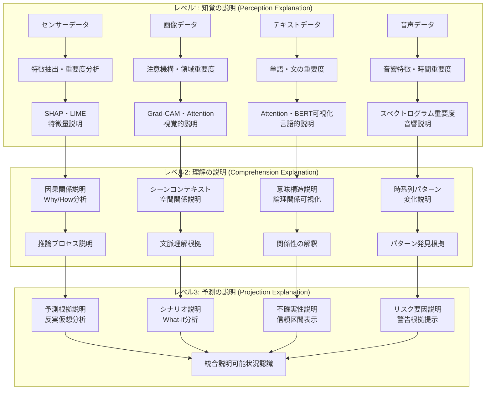

# 説明可能AI（XAI）による状況認識の透明化

!!! info "このページについて"

    このページでは、説明可能AI（Explainable AI/XAI）が状況認識（Situational Awareness）にもたらす透明性と信頼性の向上について詳しく解説します。  
    ブラックボックス化したAI判断の根拠を明確にし、人間が理解可能な形で状況認識の過程を説明する技術を理論と実装の両面から掘り下げます。  
    実践的なTypeScriptコード例により、説明可能な状況認識システムの構築方法を具体的に示します。

## 説明可能AIが変える状況認識の世界

説明可能AI（XAI: Explainable AI）は、複雑なAIシステムの判断プロセスを人間が理解可能な形で説明する技術として、状況認識の信頼性と実用性を飛躍的に向上させています。特に医療、金融、自動運転など、高い信頼性が要求される分野では、AIの判断根拠を明確に示すことが法的・倫理的要件となっており、説明可能性は必須の技術要素となっています。

本章では、XAI技術が状況認識をどのように透明化し、人間とAIの協働をどのように促進するか、Endsleyモデルとの対応から最新の説明技術まで体系的に解説します。

## 説明可能AIによる状況認識の基本フレームワーク

### Endsleyモデルと説明可能AI技術の対応



### 説明可能AI技術と状況認識への応用

| XAI技術 | 状況認識への応用 | 主要手法 | 具体例 |
|---|---|---|---|
| **モデル非依存説明** | 任意のAIモデルの判断説明 | LIME、SHAP、Permutation Importance | ブラックボックスモデルの意思決定根拠 |
| **注意機構可視化** | 重要領域・要素の特定 | Attention Maps、Grad-CAM | 画像診断での病変領域特定 |
| **反実仮想説明** | 判断が変わる条件の提示 | Counterfactual Explanations | 「Xが変わればYになる」分析 |
| **規則抽出** | 判断論理の自然言語化 | Decision Rules、TREPAN | 「もしAならばB」ルール生成 |
| **プロトタイプ分析** | 典型例による説明 | Prototypes、Criticism | 類似ケースによる判断根拠 |
| **因果推論** | 原因と結果の関係説明 | Causal Graphs、Do-Calculus | 状況変化の因果メカニズム |
| **不確実性定量化** | 判断の信頼性評価 | Bayesian Methods、Conformal Prediction | 予測精度の信頼区間 |

## XAI技術による透明な状況認識システム

### SHAP・LIME統合説明システム

複数の説明手法を統合し、包括的で理解しやすい説明を生成します。

??? TypeScript実装例

    この実装では、SHAP（SHapley Additive exPlanations）とLIME（Local Interpretable Model-agnostic Explanations）を統合した説明システムです。RxJSを活用したリアクティブな説明生成と、複数の視点からの説明を統合して提供します。

    ```typescript
    // SHAP・LIME統合説明システム
    interface ComprehensiveExplanation {
      predictionId: string;
      timestamp: Date;
      shapExplanation: SHAPExplanation;
      limeExplanation: LIMEExplanation;
      integratedExplanation: IntegratedExplanation;
      confidenceMetrics: ConfidenceMetrics;
      visualizations: ExplanationVisualization[];
    }

    interface SHAPExplanation {
      featureImportances: FeatureImportance[];
      baseValue: number;
      shapValues: number[];
      interactionEffects: InteractionEffect[];
      globalImportance: GlobalImportance[];
    }

    interface LIMEExplanation {
      localModel: LocalModel;
      featureWeights: FeatureWeight[];
      neighborhoodSize: number;
      fidelity: number;
      localAccuracy: number;
    }

    interface IntegratedExplanation {
      consensusFeatures: ConsensusFeature[];
      conflictingFeatures: ConflictingFeature[];
      overallConfidence: number;
      explanationQuality: ExplanationQuality;
      humanReadableExplanation: string;
    }

    class SHAPLIMEExplanationSystem {
      private shapExplainer: SHAPExplainer;
      private limeExplainer: LIMEExplainer;
      private integrationEngine: ExplanationIntegrationEngine;
      private visualizationEngine: ExplanationVisualizationEngine;
      private confidenceCalculator: ExplanationConfidenceCalculator;
      
      constructor() {
        this.initializeExplainers();
        this.setupReactiveExplanationPipeline();
      }
      
      private initializeExplainers(): void {
        // SHAP説明器の初期化
        this.shapExplainer = new SHAPExplainer({
          explainerType: 'tree', // 'tree', 'linear', 'deep', 'kernel'
          numSamples: 1000,
          checkAdditivity: true,
          featureNames: this.getFeatureNames()
        });
        
        // LIME説明器の初期化
        this.limeExplainer = new LIMEExplainer({
          mode: 'classification', // 'classification', 'regression'
          numFeatures: 20,
          numSamples: 5000,
          distance_metric: 'cosine',
          kernelWidth: 0.25
        });
        
        // 説明統合エンジン
        this.integrationEngine = new ExplanationIntegrationEngine({
          weightingStrategy: 'confidence_weighted',
          conflictResolution: 'ensemble_voting',
          consistencyThreshold: 0.8
        });
        
        // 可視化エンジン
        this.visualizationEngine = new ExplanationVisualizationEngine({
          chartTypes: ['waterfall', 'force_plot', 'summary_plot', 'decision_plot'],
          interactivity: true,
          responsiveDesign: true
        });
      }
      
      // リアクティブ説明生成パイプライン
      private setupReactiveExplanationPipeline(): void {
        // 説明要求のストリーム
        this.explanationRequests$ = new Subject<ExplanationRequest>();
        
        // 並列説明生成
        this.explanationResults$ = this.explanationRequests$.pipe(
          // 重複リクエストの除去
          distinctUntilChanged((a, b) => a.predictionId === b.predictionId),
          
          // 並列でSHAPとLIME説明を生成
          mergeMap(request => 
            forkJoin({
              shapResult: this.generateSHAPExplanation(request),
              limeResult: this.generateLIMEExplanation(request),
              metadata: of(request)
            }).pipe(
              // タイムアウト処理
              timeout(30000),
              catchError(error => of({
                shapResult: null,
                limeResult: null,
                metadata: request,
                error: error.message
              }))
            )
          ),
          
          // 結果の統合
          map(({ shapResult, limeResult, metadata, error }) => {
            if (error) {
              return { error, metadata };
            }
            
            return this.integrateExplanations(
              shapResult,
              limeResult,
              metadata
            );
          }),
          
          // 結果の共有
          share()
        );
      }
      
      // 包括的説明の生成
      async generateComprehensiveExplanation(
        prediction: MLPrediction,
        inputData: any,
        model: MLModel
      ): Promise<ComprehensiveExplanation> {
        // 説明要求の作成
        const explanationRequest: ExplanationRequest = {
          predictionId: prediction.id,
          prediction: prediction,
          inputData: inputData,
          model: model,
          timestamp: new Date()
        };
        
        // リアクティブパイプラインに要求を送信
        this.explanationRequests$.next(explanationRequest);
        
        // 結果の取得
        const result = await this.explanationResults$.pipe(
          filter(result => result.metadata?.predictionId === prediction.id),
          take(1)
        ).toPromise();
        
        if (result.error) {
          throw new Error(`説明生成エラー: ${result.error}`);
        }
        
        return result as ComprehensiveExplanation;
      }
      
      // SHAP説明の生成
      private async generateSHAPExplanation(
        request: ExplanationRequest
      ): Promise<SHAPExplanation> {
        // SHAP値の計算
        const shapValues = await this.shapExplainer.explainInstance(
          request.inputData,
          request.model
        );
        
        // 特徴量重要度の計算
        const featureImportances = this.calculateFeatureImportances(shapValues);
        
        // 相互作用効果の分析
        const interactionEffects = await this.analyzeInteractionEffects(
          request.inputData,
          request.model
        );
        
        // グローバル重要度の計算
        const globalImportance = await this.calculateGlobalImportance(
          request.model
        );
        
        return {
          featureImportances,
          baseValue: shapValues.baseValue,
          shapValues: shapValues.values,
          interactionEffects,
          globalImportance
        };
      }
      
      // LIME説明の生成
      private async generateLIMEExplanation(
        request: ExplanationRequest
      ): Promise<LIMEExplanation> {
        // 近傍データの生成
        const neighborhood = this.generateNeighborhood(
          request.inputData,
          this.limeExplainer.numSamples
        );
        
        // ローカルモデルの学習
        const localModel = await this.trainLocalModel(
          neighborhood,
          request.model
        );
        
        // 特徴量重みの計算
        const featureWeights = this.extractFeatureWeights(localModel);
        
        // 忠実度の評価
        const fidelity = this.calculateFidelity(
          localModel,
          request.model,
          neighborhood
        );
        
        return {
          localModel,
          featureWeights,
          neighborhoodSize: neighborhood.length,
          fidelity,
          localAccuracy: localModel.accuracy
        };
      }
      
      // 説明の統合
      private integrateExplanations(
        shapResult: SHAPExplanation,
        limeResult: LIMEExplanation,
        request: ExplanationRequest
      ): ComprehensiveExplanation {
        // 合意特徴量の特定
        const consensusFeatures = this.findConsensusFeatures(
          shapResult.featureImportances,
          limeResult.featureWeights
        );
        
        // 矛盾特徴量の特定
        const conflictingFeatures = this.findConflictingFeatures(
          shapResult.featureImportances,
          limeResult.featureWeights
        );
        
        // 統合説明の生成
        const integratedExplanation = this.generateIntegratedExplanation(
          consensusFeatures,
          conflictingFeatures,
          shapResult,
          limeResult
        );
        
        // 信頼度指標の計算
        const confidenceMetrics = this.calculateConfidenceMetrics(
          shapResult,
          limeResult,
          integratedExplanation
        );
        
        // 可視化の生成
        const visualizations = this.generateVisualizations(
          shapResult,
          limeResult,
          integratedExplanation
        );
        
        return {
          predictionId: request.predictionId,
          timestamp: new Date(),
          shapExplanation: shapResult,
          limeExplanation: limeResult,
          integratedExplanation,
          confidenceMetrics,
          visualizations
        };
      }
      
      // 対話的説明の生成
      async generateInteractiveExplanation(
        explanation: ComprehensiveExplanation,
        userQuery: string
      ): Promise<InteractiveExplanationResponse> {
        // ユーザークエリの解析
        const queryIntent = await this.analyzeUserQuery(userQuery);
        
        switch (queryIntent.type) {
          case 'feature_importance':
            return this.explainFeatureImportance(
              explanation,
              queryIntent.targetFeature
            );
            
          case 'counterfactual':
            return this.generateCounterfactualExplanation(
              explanation,
              queryIntent.desiredOutcome
            );
            
          case 'confidence':
            return this.explainConfidence(explanation);
            
          case 'comparison':
            return this.compareWithSimilarCases(
              explanation,
              queryIntent.comparisonTarget
            );
            
          default:
            return this.generateGeneralExplanation(explanation);
        }
      }
      
      // 反実仮想説明の生成
      private async generateCounterfactualExplanation(
        explanation: ComprehensiveExplanation,
        desiredOutcome: any
      ): Promise<CounterfactualExplanation> {
        // 最小変更による反実仮想例の生成
        const counterfactuals = await this.findMinimalCounterfactuals(
          explanation,
          desiredOutcome
        );
        
        // 変更可能性の評価
        const feasibility = this.assessCounterfactualFeasibility(
          counterfactuals
        );
        
        // 自然言語での説明生成
        const naturalLanguageExplanation = this.generateCounterfactualNarrative(
          counterfactuals,
          feasibility
        );
        
        return {
          counterfactualExamples: counterfactuals,
          feasibilityAssessment: feasibility,
          explanation: naturalLanguageExplanation,
          confidence: this.calculateCounterfactualConfidence(counterfactuals)
        };
      }
      
      // 時系列説明の生成
      async generateTimeSeriesExplanation(
        timeSeriesPredictions: TimeSeriesPrediction[],
        explanationWindow: number = 10
      ): Promise<TimeSeriesExplanation> {
        // ウィンドウごとの説明生成
        const windowExplanations = await Promise.all(
          this.createTimeWindows(timeSeriesPredictions, explanationWindow)
            .map(window => this.explainTimeWindow(window))
        );
        
        // 時系列パターンの分析
        const temporalPatterns = this.analyzeTemporalPatterns(
          windowExplanations
        );
        
        // 変化点の検出と説明
        const changePoints = this.detectAndExplainChangePoints(
          timeSeriesPredictions,
          windowExplanations
        );
        
        // トレンドの説明
        const trendExplanation = this.explainTrends(
          temporalPatterns,
          changePoints
        );
        
        return {
          windowExplanations,
          temporalPatterns,
          changePoints,
          trendExplanation,
          overallConfidence: this.calculateTimeSeriesExplanationConfidence(
            windowExplanations
          )
        };
      }
      
      // 説明品質の評価
      async evaluateExplanationQuality(
        explanation: ComprehensiveExplanation,
        groundTruth?: GroundTruthExplanation
      ): Promise<ExplanationQualityMetrics> {
        // 一貫性の評価
        const consistency = this.evaluateConsistency(
          explanation.shapExplanation,
          explanation.limeExplanation
        );
        
        // 安定性の評価
        const stability = await this.evaluateStability(explanation);
        
        // 完全性の評価
        const completeness = this.evaluateCompleteness(explanation);
        
        // 理解しやすさの評価
        const comprehensibility = this.evaluateComprehensibility(
          explanation.integratedExplanation
        );
        
        // グラウンドトゥルースとの比較（利用可能な場合）
        let faithfulness = null;
        if (groundTruth) {
          faithfulness = this.evaluateFaithfulness(explanation, groundTruth);
        }
        
        return {
          consistency,
          stability,
          completeness,
          comprehensibility,
          faithfulness,
          overallQuality: this.calculateOverallQuality({
            consistency,
            stability,
            completeness,
            comprehensibility
          })
        };
      }
    }

    // 結果インターフェース
    interface InteractiveExplanationResponse {
      queryType: string;
      explanation: string;
      visualizations: Visualization[];
      followUpSuggestions: string[];
      confidence: number;
    }

    interface CounterfactualExplanation {
      counterfactualExamples: CounterfactualExample[];
      feasibilityAssessment: FeasibilityAssessment;
      explanation: string;
      confidence: number;
    }

    interface TimeSeriesExplanation {
      windowExplanations: WindowExplanation[];
      temporalPatterns: TemporalPattern[];
      changePoints: ChangePoint[];
      trendExplanation: TrendExplanation;
      overallConfidence: number;
    }
    ```

### 注意機構可視化システム

深層学習モデルの注意機構を可視化し、AIが重要視している情報を直感的に理解できるようにします。

??? TypeScript実装例

    この実装では、Transformerベースのモデルの注意機構を可視化するシステムです。マルチヘッド注意、レイヤー間注意、時系列注意などを統合的に可視化し、ユーザーが直感的に理解できる形で提示します。

    ```typescript
    // 注意機構可視化システム
    interface AttentionVisualizationResult {
      modelId: string;
      inputId: string;
      timestamp: Date;
      attentionMaps: AttentionMap[];
      aggregatedAttention: AggregatedAttention;
      interpretations: AttentionInterpretation[];
      interactiveElements: InteractiveElement[];
    }

    interface AttentionMap {
      layerIndex: number;
      headIndex?: number;
      attentionType: 'self' | 'cross' | 'global';
      weights: number[][];
      inputTokens: string[];
      outputTokens: string[];
      heatmapData: HeatmapData;
    }

    interface AggregatedAttention {
      globalAttention: number[];
      layerWiseAttention: LayerWiseAttention[];
      headRoleAnalysis: HeadRoleAnalysis[];
      attentionFlow: AttentionFlow;
    }

    interface AttentionInterpretation {
      pattern: 'local' | 'global' | 'syntactic' | 'semantic';
      description: string;
      confidence: number;
      evidenceTokens: TokenEvidence[];
    }

    class AttentionVisualizationSystem {
      private attentionExtractor: AttentionExtractor;
      private visualizationRenderer: AttentionVisualizationRenderer;
      private patternAnalyzer: AttentionPatternAnalyzer;
      private interactionHandler: InteractionHandler;
      
      constructor() {
        this.initializeVisualizationComponents();
        this.setupInteractiveVisualization();
      }
      
      private initializeVisualizationComponents(): void {
        // 注意重み抽出器
        this.attentionExtractor = new AttentionExtractor({
          supportedModels: ['bert', 'gpt', 'transformer', 't5'],
          extractionLayers: 'all', // 'all', 'last', [1, 3, 5]
          includeGradients: true
        });
        
        // 可視化レンダラー
        this.visualizationRenderer = new AttentionVisualizationRenderer({
          renderingEngine: 'canvas', // 'canvas', 'svg', 'webgl'
          colorScheme: 'viridis',
          animationEnabled: true,
          responsiveDesign: true
        });
        
        // パターン分析器
        this.patternAnalyzer = new AttentionPatternAnalyzer({
          patternTypes: ['positional', 'syntactic', 'semantic', 'task_specific'],
          clusteringMethod: 'hierarchical',
          significanceThreshold: 0.1
        });
        
        // インタラクションハンドラー
        this.interactionHandler = new InteractionHandler({
          interactions: ['hover', 'click', 'brush', 'zoom'],
          tooltipEnabled: true,
          selectionEnabled: true
        });
      }
      
      // マルチモーダル注意可視化
      async visualizeMultiModalAttention(
        model: TransformerModel,
        textInput: string,
        imageInput?: ImageData,
        audioInput?: AudioData
      ): Promise<AttentionVisualizationResult> {
        // 入力の前処理
        const processedInputs = await this.preprocessMultiModalInputs({
          text: textInput,
          image: imageInput,
          audio: audioInput
        });
        
        // 注意重みの抽出
        const attentionWeights = await this.attentionExtractor.extractAttention(
          model,
          processedInputs
        );
        
        // モダリティ間注意の分析
        const crossModalAttention = this.analyzeCrossModalAttention(
          attentionWeights,
          processedInputs
        );
        
        // 注意パターンの分析
        const attentionPatterns = await this.patternAnalyzer.analyzePatterns(
          attentionWeights
        );
        
        // 可視化要素の生成
        const visualizations = await this.generateVisualizations(
          attentionWeights,
          crossModalAttention,
          attentionPatterns
        );
        
        return {
          modelId: model.id,
          inputId: this.generateInputId(processedInputs),
          timestamp: new Date(),
          attentionMaps: visualizations.attentionMaps,
          aggregatedAttention: visualizations.aggregatedAttention,
          interpretations: this.generateInterpretations(attentionPatterns),
          interactiveElements: this.createInteractiveElements(visualizations)
        };
      }
      
      // リアルタイム注意ストリーム可視化
      visualizeAttentionStream(
        modelStream: Observable<ModelPrediction>
      ): Observable<StreamingAttentionVisualization> {
        return modelStream.pipe(
          // バッファリング（スムーズなアニメーション用）
          bufferTime(100),
          filter(buffer => buffer.length > 0),
          
          // 注意重みの抽出
          mergeMap(predictions => 
            from(predictions).pipe(
              mergeMap(prediction => 
                this.extractAttentionWeights(prediction)
              ),
              toArray()
            )
          ),
          
          // 時系列注意パターンの分析
          scan((acc, current) => {
            return this.updateTemporalAttentionPatterns(acc, current);
          }, this.initializeTemporalState()),
          
          // 可視化の生成
          map(temporalState => 
            this.generateStreamingVisualization(temporalState)
          ),
          
          // フレームレート制御
          throttleTime(16), // 60fps
          
          share()
        );
      }
      
      // 注意ヘッド役割分析
      async analyzeAttentionHeadRoles(
        model: TransformerModel,
        dataset: Dataset
      ): Promise<AttentionHeadRoleAnalysis> {
        const headAnalyses = [];
        
        // 各レイヤーの各ヘッドを分析
        for (let layerIdx = 0; layerIdx < model.numLayers; layerIdx++) {
          for (let headIdx = 0; headIdx < model.numHeads; headIdx++) {
            const headAnalysis = await this.analyzeIndividualHead(
              model,
              layerIdx,
              headIdx,
              dataset
            );
            headAnalyses.push(headAnalysis);
          }
        }
        
        // ヘッドの機能分類
        const functionalClusters = this.clusterHeadsByFunction(headAnalyses);
        
        // 冗長性分析
        const redundancyAnalysis = this.analyzeHeadRedundancy(headAnalyses);
        
        // 重要度ランキング
        const importanceRanking = this.rankHeadsByImportance(headAnalyses);
        
        return {
          headAnalyses,
          functionalClusters,
          redundancyAnalysis,
          importanceRanking,
          recommendations: this.generateOptimizationRecommendations(
            functionalClusters,
            redundancyAnalysis
          )
        };
      }
      
      // 個別ヘッドの分析
      private async analyzeIndividualHead(
        model: TransformerModel,
        layerIdx: number,
        headIdx: number,
        dataset: Dataset
      ): Promise<IndividualHeadAnalysis> {
        // 注意パターンの収集
        const attentionPatterns = await this.collectAttentionPatterns(
          model,
          layerIdx,
          headIdx,
          dataset
        );
        
        // 位置的パターンの分析
        const positionalPatterns = this.analyzePositionalPatterns(
          attentionPatterns
        );
        
        // 構文的パターンの分析
        const syntacticPatterns = this.analyzeSyntacticPatterns(
          attentionPatterns,
          dataset
        );
        
        // 意味的パターンの分析
        const semanticPatterns = this.analyzeSemanticPatterns(
          attentionPatterns,
          dataset
        );
        
        // ヘッド機能の分類
        const functionClassification = this.classifyHeadFunction({
          positionalPatterns,
          syntacticPatterns,
          semanticPatterns
        });
        
        return {
          layerIndex: layerIdx,
          headIndex: headIdx,
          functionClassification,
          positionalPatterns,
          syntacticPatterns,
          semanticPatterns,
          confidence: this.calculateAnalysisConfidence({
            positionalPatterns,
            syntacticPatterns,
            semanticPatterns
          })
        };
      }
      
      // インタラクティブ注意探索
      createInteractiveAttentionExplorer(
        attentionData: AttentionVisualizationResult
      ): InteractiveAttentionExplorer {
        const explorer = new InteractiveAttentionExplorer({
          container: this.createVisualizationContainer(),
          data: attentionData,
          interactions: {
            tokenSelection: true,
            layerNavigation: true,
            headComparison: true,
            patternHighlighting: true
          }
        });
        
        // インタラクションイベントの設定
        this.setupExplorerInteractions(explorer);
        
        return explorer;
      }
      
      private setupExplorerInteractions(
        explorer: InteractiveAttentionExplorer
      ): void {
        // トークン選択時の処理
        explorer.onTokenSelect$.subscribe(selectedToken => {
          const relatedAttentions = this.findRelatedAttentions(
            selectedToken,
            explorer.data
          );
          explorer.highlightRelatedElements(relatedAttentions);
        });
        
        // レイヤー変更時の処理
        explorer.onLayerChange$.subscribe(layerIndex => {
          const layerData = this.getLayerData(layerIndex, explorer.data);
          explorer.updateVisualization(layerData);
        });
        
        // ヘッド比較時の処理
        explorer.onHeadComparison$.subscribe(({ head1, head2 }) => {
          const comparisonAnalysis = this.compareAttentionHeads(head1, head2);
          explorer.displayComparison(comparisonAnalysis);
        });
        
        // パターンハイライト時の処理
        explorer.onPatternHighlight$.subscribe(pattern => {
          const matchingElements = this.findPatternMatches(
            pattern,
            explorer.data
          );
          explorer.highlightPattern(matchingElements);
        });
      }
      
      // 注意重み分析レポート生成
      async generateAttentionAnalysisReport(
        attentionData: AttentionVisualizationResult[]
      ): Promise<AttentionAnalysisReport> {
        // 統計的分析
        const statisticalAnalysis = this.performStatisticalAnalysis(
          attentionData
        );
        
        // パターン頻度分析
        const patternFrequency = this.analyzePatternFrequency(attentionData);
        
        // 異常パターンの検出
        const anomalyDetection = this.detectAnomalousAttentionPatterns(
          attentionData
        );
        
        // パフォーマンス相関分析
        const performanceCorrelation = await this.analyzePerformanceCorrelation(
          attentionData
        );
        
        // 改善提案の生成
        const improvementSuggestions = this.generateImprovementSuggestions({
          statisticalAnalysis,
          patternFrequency,
          anomalyDetection,
          performanceCorrelation
        });
        
        return {
          executiveSummary: this.generateExecutiveSummary({
            statisticalAnalysis,
            patternFrequency,
            performanceCorrelation
          }),
          detailedAnalysis: {
            statisticalAnalysis,
            patternFrequency,
            anomalyDetection,
            performanceCorrelation
          },
          visualizations: this.generateReportVisualizations(attentionData),
          improvementSuggestions,
          confidence: this.calculateReportConfidence({
            statisticalAnalysis,
            patternFrequency,
            performanceCorrelation
          })
        };
      }
    }

    // 結果インターフェース
    interface AttentionHeadRoleAnalysis {
      headAnalyses: IndividualHeadAnalysis[];
      functionalClusters: FunctionalCluster[];
      redundancyAnalysis: RedundancyAnalysis;
      importanceRanking: HeadImportanceRanking[];
      recommendations: OptimizationRecommendation[];
    }

    interface InteractiveAttentionExplorer {
      container: HTMLElement;
      data: AttentionVisualizationResult;
      onTokenSelect$: Observable<SelectedToken>;
      onLayerChange$: Observable<number>;
      onHeadComparison$: Observable<HeadComparison>;
      onPatternHighlight$: Observable<AttentionPattern>;
      highlightRelatedElements(elements: RelatedElement[]): void;
      updateVisualization(data: LayerVisualizationData): void;
      displayComparison(analysis: ComparisonAnalysis): void;
      highlightPattern(elements: PatternElement[]): void;
    }

    interface AttentionAnalysisReport {
      executiveSummary: ExecutiveSummary;
      detailedAnalysis: DetailedAnalysis;
      visualizations: ReportVisualization[];
      improvementSuggestions: ImprovementSuggestion[];
      confidence: number;
    }
    ```

## 実装上の重要考慮事項

### 説明品質の評価と管理

| 評価項目 | 説明 | 評価手法 | 実装アプローチ |
|---|---|---|---|
| **忠実性** | 元モデルの動作をどの程度正確に説明しているか | モデル予測との相関分析 | 予測一致率、相関係数 |
| **安定性** | 類似入力に対する説明の一貫性 | 摂動テスト、ノイズ注入 | 説明の分散測定 |
| **理解しやすさ** | 人間にとっての理解容易性 | ユーザースタディ、認知負荷測定 | 可読性指標、タスク完了時間 |
| **完全性** | 重要な要因を漏れなく説明しているか | 特徴量カバレッジ分析 | 重要特徴量の網羅率 |
| **効率性** | 説明生成の計算コスト | 処理時間、メモリ使用量測定 | パフォーマンスプロファイリング |

### 計算効率とリアルタイム性能

=== "説明生成の最適化"
    - **並列処理**: 複数説明手法の同時実行
    - **キャッシュ戦略**: 類似説明の再利用
    - **近似手法**: 計算量削減のための近似アルゴリズム

=== "ユーザビリティ最適化"
    - **適応的詳細度**: ユーザーの専門性に応じた説明レベル調整
    - **段階的開示**: 必要に応じた詳細情報の追加表示
    - **視覚的階層**: 重要度に基づく情報の視覚的優先順位

## 産業別応用事例

### 医療分野における説明可能AI

=== "診断支援"
    - **画像診断説明**: 病変領域の可視化と診断根拠の提示
    - **薬剤推奨説明**: 処方薬選択の根拠と代替案の説明
    - **リスク予測説明**: 疾患発症リスクの要因分析

=== "臨床意思決定支援"
    - **治療計画説明**: 推奨治療法の根拠と効果予測
    - **患者層別化**: 個別化医療の根拠説明
    - **副作用予測**: 副作用リスクの要因分析

### 金融分野における説明可能AI

=== "与信・審査"
    - **信用評価説明**: 融資可否判断の根拠明示
    - **リスク評価説明**: 投資リスクの要因分析
    - **異常取引説明**: 不正検知の根拠提示

=== "規制対応"
    - **アルゴリズム監査**: 公平性・透明性の証明
    - **バイアス分析**: 差別的判断の検出と説明
    - **説明義務対応**: 法的要件への準拠

### 自動運転・交通分野

=== "安全性説明"
    - **判断根拠の説明**: 運転判断の理由明示
    - **事故原因分析**: 事故時の判断プロセス解析
    - **安全性証明**: システムの安全性根拠

=== "ユーザー信頼醸成"
    - **運転行動説明**: AI運転の判断理由説明
    - **学習過程説明**: AI改善プロセスの透明化
    - **性能保証**: 安全性能の定量的説明

## TypeScript実装：統合説明可能状況認識システム

### システム全体アーキテクチャ

??? TypeScript実装例

    ```typescript
    // 統合説明可能状況認識システム
    interface ExplainableSituationalAwarenessResult {
      situationAssessment: SituationAssessment;
      explanation: ComprehensiveExplanation;
      visualizations: ExplanationVisualization[];
      interactiveElements: InteractiveExplanationElement[];
      trustMetrics: TrustMetrics;
      auditTrail: AuditTrail;
    }

    interface SituationAssessment {
      currentSituation: SituationState;
      riskLevel: RiskLevel;
      predictions: SituationPrediction[];
      recommendations: ActionRecommendation[];
      confidence: number;
    }

    interface ComprehensiveExplanation {
      overallExplanation: string;
      componentExplanations: ComponentExplanation[];
      causalChain: CausalLink[];
      uncertaintyFactors: UncertaintyFactor[];
      alternativeScenarios: AlternativeScenario[];
    }

    class ExplainableSituationalAwarenessSystem {
      private situationAnalyzer: SituationAnalyzer;
      private explanationEngine: ComprehensiveExplanationEngine;
      private visualizationSystem: ExplanationVisualizationSystem;
      private auditingSystem: AuditingSystem;
      private trustCalculator: TrustCalculator;
      
      constructor() {
        this.initializeExplainableSystem();
        this.setupAuditTrail();
      }
      
      private initializeExplainableSystem(): void {
        // 状況分析エンジン
        this.situationAnalyzer = new SituationAnalyzer({
          analysisModules: [
            new ImageAnalysisModule(),
            new TextAnalysisModule(),
            new SensorDataModule(),
            new TemporalAnalysisModule()
          ],
          explainabilityRequired: true
        });
        
        // 包括的説明エンジン
        this.explanationEngine = new ComprehensiveExplanationEngine({
          explainers: [
            new SHAPExplainer(),
            new LIMEExplainer(),
            new AttentionExplainer(),
            new CausalExplainer()
          ],
          integrationStrategy: 'consensus_weighted',
          naturalLanguageGenerator: new NLGEngine()
        });
        
        // 可視化システム
        this.visualizationSystem = new ExplanationVisualizationSystem({
          chartTypes: ['waterfall', 'heatmap', 'network', 'timeline'],
          interactivity: true,
          accessibility: true
        });
        
        // 監査システム
        this.auditingSystem = new AuditingSystem({
          logLevel: 'detailed',
          retention: '7years',
          compliance: ['GDPR', 'HIPAA', 'SOX']
        });
        
        // 信頼度計算器
        this.trustCalculator = new TrustCalculator({
          metrics: ['consistency', 'stability', 'fidelity', 'completeness'],
          aggregationMethod: 'weighted_average'
        });
      }
      
      // 説明可能状況認識の実行
      async analyzeSituationWithExplanation(
        multiModalInput: MultiModalInput,
        userContext: UserContext
      ): Promise<ExplainableSituationalAwarenessResult> {
        // 監査ログの開始
        const sessionId = this.auditingSystem.startSession({
          userId: userContext.userId,
          timestamp: new Date(),
          inputHash: this.generateInputHash(multiModalInput)
        });
        
        try {
          // 状況分析の実行
          const situationAssessment = await this.situationAnalyzer.analyze(
            multiModalInput,
            { explainabilityEnabled: true }
          );
          
          // 包括的説明の生成
          const explanation = await this.explanationEngine.generateExplanation(
            situationAssessment,
            multiModalInput,
            userContext
          );
          
          // 可視化の生成
          const visualizations = await this.visualizationSystem.createVisualizations(
            situationAssessment,
            explanation,
            userContext.preferences
          );
          
          // インタラクティブ要素の生成
          const interactiveElements = this.createInteractiveElements(
            situationAssessment,
            explanation,
            visualizations
          );
          
          // 信頼度指標の計算
          const trustMetrics = await this.trustCalculator.calculateTrust(
            situationAssessment,
            explanation
          );
          
          // 監査証跡の生成
          const auditTrail = this.auditingSystem.generateAuditTrail(sessionId);
          
          const result = {
            situationAssessment,
            explanation,
            visualizations,
            interactiveElements,
            trustMetrics,
            auditTrail
          };
          
          // 結果の記録
          this.auditingSystem.logResult(sessionId, result);
          
          return result;
          
        } catch (error) {
          // エラーの記録
          this.auditingSystem.logError(sessionId, error);
          throw error;
        } finally {
          // セッションの終了
          this.auditingSystem.endSession(sessionId);
        }
      }
      
      // 対話的説明セッション
      createInteractiveExplanationSession(
        initialResult: ExplainableSituationalAwarenessResult
      ): Observable<InteractiveExplanationResponse> {
        return new Observable<InteractiveExplanationResponse>(observer => {
          const session = new InteractiveExplanationSession({
            initialResult,
            explanationEngine: this.explanationEngine,
            visualizationSystem: this.visualizationSystem
          });
          
          // ユーザークエリのストリーム処理
          session.userQueries$.pipe(
            // クエリの分析
            map(query => this.analyzeUserQuery(query)),
            
            // 説明の生成
            mergeMap(analyzedQuery => 
              this.generateTargetedExplanation(
                analyzedQuery,
                initialResult
              )
            ),
            
            // 可視化の更新
            map(explanation => 
              this.updateVisualizationsForQuery(explanation)
            )
          ).subscribe(
            response => observer.next(response),
            error => observer.error(error)
          );
          
          return () => session.destroy();
        });
      }
      
      // 説明の有効性検証
      async validateExplanationEffectiveness(
        explanation: ComprehensiveExplanation,
        userFeedback: UserFeedback[]
      ): Promise<ExplanationValidationResult> {
        // ユーザー理解度の分析
        const comprehensionAnalysis = this.analyzeUserComprehension(
          userFeedback
        );
        
        // 説明の客観的品質評価
        const objectiveQuality = await this.assessObjectiveQuality(
          explanation
        );
        
        // 信頼度の変化追跡
        const trustEvolution = this.trackTrustEvolution(
          userFeedback
        );
        
        // 行動変化の分析
        const behaviorImpact = this.analyzeBehaviorImpact(
          userFeedback
        );
        
        return {
          comprehensionScore: comprehensionAnalysis.score,
          objectiveQualityScore: objectiveQuality.score,
          trustScore: trustEvolution.finalScore,
          behaviorImpactScore: behaviorImpact.score,
          overallEffectiveness: this.calculateOverallEffectiveness({
            comprehensionAnalysis,
            objectiveQuality,
            trustEvolution,
            behaviorImpact
          }),
          recommendations: this.generateImprovementRecommendations({
            comprehensionAnalysis,
            objectiveQuality,
            trustEvolution,
            behaviorImpact
          })
        };
      }
    }

    // ユーティリティクラス
    class ExplanationVisualizationSystem {
      createDashboard(
        result: ExplainableSituationalAwarenessResult
      ): ExplanationDashboard {
        const dashboard = new ExplanationDashboard({
          layout: 'responsive_grid',
          components: [
            this.createSituationOverview(result.situationAssessment),
            this.createExplanationSummary(result.explanation),
            this.createTrustIndicator(result.trustMetrics),
            this.createInteractiveExplorer(result.interactiveElements)
          ]
        });
        
        return dashboard;
      }
      
      private createSituationOverview(
        assessment: SituationAssessment
      ): SituationOverviewComponent {
        return new SituationOverviewComponent({
          currentState: assessment.currentSituation,
          riskVisualization: this.createRiskVisualization(assessment.riskLevel),
          predictionsTimeline: this.createPredictionsTimeline(assessment.predictions),
          recommendationsPanel: this.createRecommendationsPanel(assessment.recommendations)
        });
      }
      
      private createExplanationSummary(
        explanation: ComprehensiveExplanation
      ): ExplanationSummaryComponent {
        return new ExplanationSummaryComponent({
          mainExplanation: explanation.overallExplanation,
          causalChain: this.visualizeCausalChain(explanation.causalChain),
          uncertaintyIndicators: this.createUncertaintyIndicators(explanation.uncertaintyFactors),
          alternativeScenarios: this.createScenarioComparison(explanation.alternativeScenarios)
        });
      }
    }
    ```

## 倫理的・法的考慮事項

### プライバシーと透明性のバランス

| 考慮項目 | 課題 | 対策 | 実装例 |
|---|---|---|---|
| **個人情報保護** | 説明に個人情報が含まれるリスク | 差分プライバシー、匿名化 | k-匿名性、局所的抑制 |
| **企業秘密保護** | 説明により企業秘密が漏洩 | 段階的開示、抽象化 | 特徴量の抽象的説明 |
| **アルゴリズム公平性** | バイアスのある説明 | 公平性監査、多様性確保 | 集団公平性指標 |
| **説明責任** | 説明の正確性・完全性 | 品質保証、検証体制 | 説明の自動検証 |

### 規制対応と標準化

=== "法的要件への対応"
    - **GDPR対応**: EU一般データ保護規則の説明権への準拠
    - **金融規制**: 金融サービスにおけるアルゴリズム透明性要件
    - **医療規制**: 医療AI の説明可能性ガイドライン対応

=== "業界標準の活用"
    - **ISO/IEC 23053**: AI システムの説明可能性フレームワーク
    - **IEEE Standards**: AI 倫理設計標準の適用
    - **業界ベストプラクティス**: 分野別の説明可能性ガイドライン

## 未来展望と技術トレンド

### 短期的展望（1-3年）

- **説明品質の標準化**: 説明可能性の定量的評価指標の確立
- **リアルタイム説明**: 低遅延での説明生成技術の実用化
- **多言語対応**: グローバル展開に向けた多言語説明生成

### 中期的展望（3-5年）

- **適応的説明**: ユーザーの理解度に応じた動的説明調整
- **因果的説明**: より深い因果関係の自動発見と説明
- **集団知による説明検証**: 専門家集団による説明品質の検証

### 長期的展望（5-10年以上）

- **認知科学統合**: 人間の認知特性を考慮した最適説明
- **神経インターフェース**: 脳活動から理解度を直接測定
- **自己進化説明**: AIが自ら説明方法を改善する技術

## まとめ：説明可能AIによる状況認識の透明化

説明可能AIは、状況認識システムの信頼性と実用性を根本から向上させ、AIと人間の効果的な協働を実現する鍵となる技術です。

#### 成功の鍵となる要素

1. **多角的説明手法**: SHAP、LIME、注意機構等の統合活用
2. **ユーザー中心設計**: 利用者の専門性と文脈に応じた説明
3. **品質保証体制**: 説明の正確性・完全性・一貫性の確保
4. **規制対応**: 法的要件と倫理的基準への準拠
5. **継続的改善**: ユーザーフィードバックに基づく説明品質向上

これらを適切に実装することで、医療、金融、自動運転など高い信頼性が要求される分野でAIシステムの社会実装を大幅に促進できます。

説明可能AIは今後ますます重要性を増す分野であり、本章の技術と実装例が、読者の皆様の信頼できるAIシステム構築に役立てば幸いです。

## 参考文献

1. Molnar, C. (2020). Interpretable Machine Learning: A Guide for Making Black Box Models Explainable. Lulu.com.
2. Ribeiro, M. T., Singh, S., & Guestrin, C. (2016). "Why Should I Trust You?": Explaining the Predictions of Any Classifier. KDD.
3. Lundberg, S. M., & Lee, S. I. (2017). A Unified Approach to Interpreting Model Predictions. NIPS.
4. Selvaraju, R. R., et al. (2017). Grad-CAM: Visual Explanations from Deep Networks via Gradient-based Localization. ICCV.
5. Doshi-Velez, F., & Kim, B. (2017). Towards A Rigorous Science of Interpretable Machine Learning. arXiv:1702.08608.
6. Guidotti, R., et al. (2018). A Survey of Methods for Explaining Black Box Models. ACM Computing Surveys, 51(5), 1-42.
7. 杉山将編. (2021). 機械学習の解釈性 (機械学習プロフェッショナルシリーズ). 講談社.
8. 神嶌敏弘. (2020). 説明可能AI入門. リックテレコム.
9. European Commission. (2019). Ethics Guidelines for Trustworthy AI. Brussels: European Commission.
10. NIST. (2021). AI Risk Management Framework: AI RMF 1.0. National Institute of Standards and Technology.