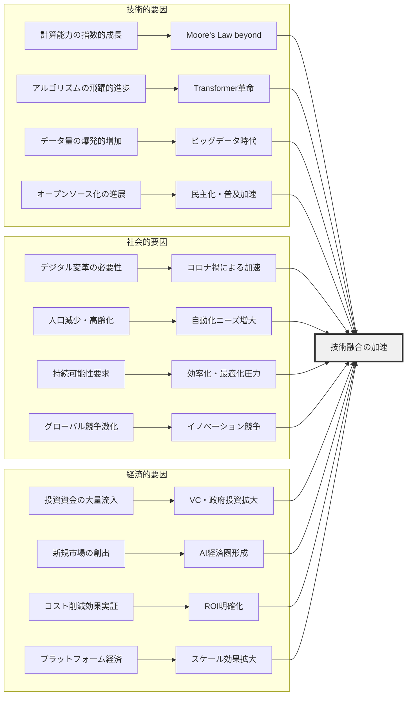
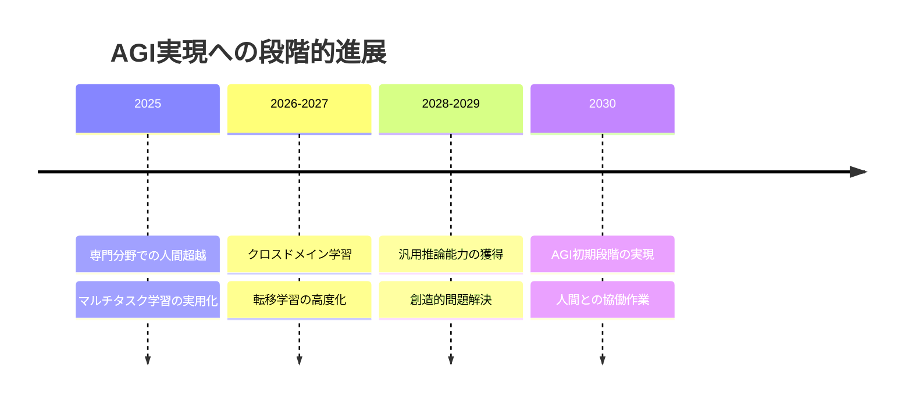
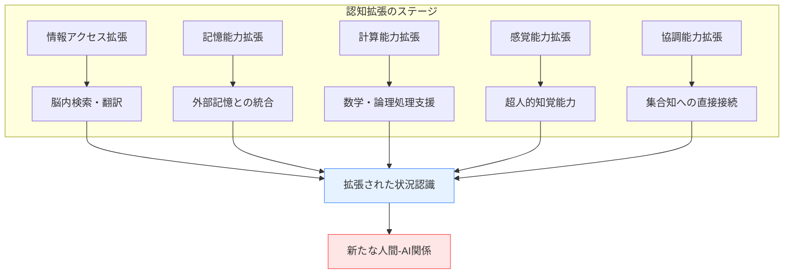
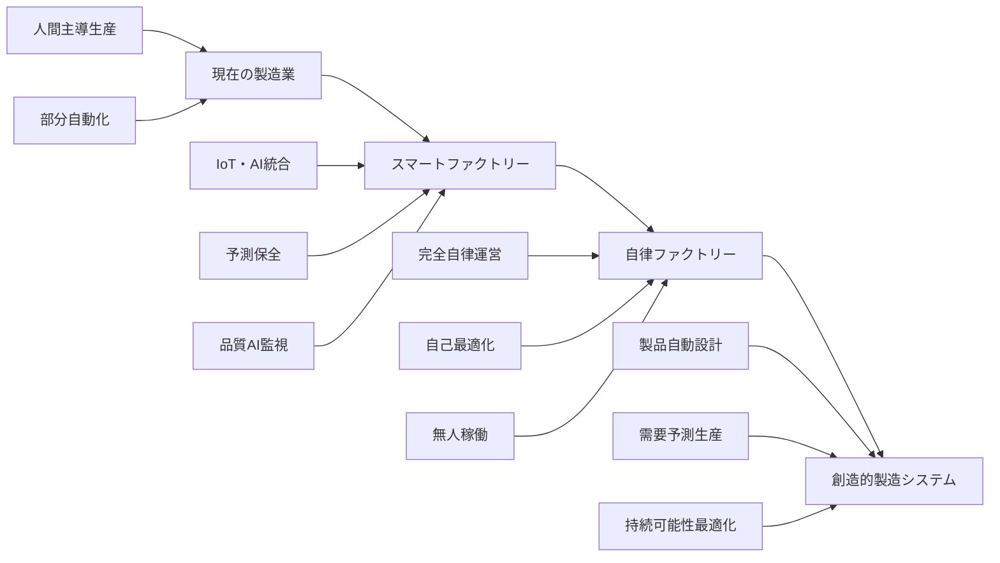
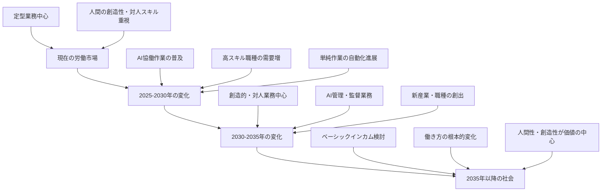

# AIと状況認識の将来動向

!!! info "このページについて"

    このページでは、AI技術と状況認識の融合がもたらす将来の技術トレンドと社会変革について解説します。  
    個別技術の詳細ではなく、技術間の相互作用、社会・経済への影響、実装における課題と機会に焦点を当てた横断的な分析を行います。  
    技術者視点での実装ロードマップや、日本における特有の展開も含め、包括的な将来展望を提示します。

## 技術融合がもたらす新たなパラダイム

AI技術と状況認識の融合は、単なる技術的進歩を超えて、人間と機械の関係性、社会システム、経済構造を根本から変革しています。これらの変化は相互に影響し合い、予想を超える速度で新たなパラダイムを生み出しています。

### 技術融合の加速要因



## 短期トレンド（2025-2027年）：実用化の加速

### 1. マルチモーダルAIの実用展開

**現状から実用化への橋渡し**

複数のデータ形式（テキスト、画像、音声、センサーデータ）を統合処理するマルチモーダルAIが、特定分野での実用レベルに到達します。

| 分野 | 実用化例 | 技術的成熟度 | 普及見込み |
|---|---|---|---|
| **顧客サービス** | 音声+表情+テキスト統合分析 | 85% | 大企業中心 |
| **医療診断** | 画像+検査値+症状統合診断 | 90% | 専門機関導入 |
| **製造業** | 画像+音響+振動統合監視 | 80% | 先進工場展開 |
| **教育** | 学習状況の多角的分析 | 70% | 実証実験段階 |

### 2. エッジAIの本格普及

**クラウド依存からエッジ処理への転換**

5G/6G通信の普及とエッジコンピューティングの成熟により、リアルタイム処理が標準となります。

??? TypeScript実装例

    ```typescript
    // 2025-2027年の標準的なエッジAI実装例
    interface EdgeAIStandardArchitecture {
      // 分散処理ノード
      edgeNodes: EdgeProcessingNode[];
      // 5G/6G通信管理
      communicationManager: NextGenCommunicationManager;
      // リアルタイム協調
      coordinationService: EdgeCoordinationService;
      // セキュリティ統合
      securityLayer: ZeroTrustSecurityLayer;
    }

    class NextGenEdgeAISystem {
      private edgeOrchestrator: EdgeOrchestrator;
      private realTimeSync: RealTimeSynchronizer;
      private adaptiveOptimizer: AdaptiveOptimizer;
      
      constructor() {
        this.edgeOrchestrator = new EdgeOrchestrator({
          // 自動負荷分散
          loadBalancing: 'ai_driven',
          // 予測的リソース配置
          resourceAllocation: 'predictive',
          // フォルトトレラント設計
          faultTolerance: 'active_redundancy'
        });
        
        this.realTimeSync = new RealTimeSynchronizer({
          // 5G Ultra Low Latency対応
          maxLatency: 1, // 1ms
          // 時刻同期精度
          timeSyncPrecision: 'microsecond',
          // 分散合意プロトコル
          consensusProtocol: 'raft_optimized'
        });
      }
      
      // 分散状況認識の実行
      async performDistributedSituationalAwareness(
        sensorData: MultiSensorData,
        geographicScope: GeographicScope
      ): Promise<DistributedSAResult> {
        // 地理的に最適なエッジノードを選択
        const optimalNodes = await this.edgeOrchestrator.selectOptimalNodes(
          geographicScope,
          sensorData.dataSize,
          this.getCurrentNetworkConditions()
        );
        
        // 並列分散処理
        const distributedResults = await Promise.all(
          optimalNodes.map(node => 
            node.processSituationalData(sensorData, {
              coordinationEnabled: true,
              realTimeSync: true,
              qualityThreshold: 0.95
            })
          )
        );
        
        // 結果の統合と合意形成
        const consensusResult = await this.realTimeSync.buildConsensus(
          distributedResults,
          {
            consensusAlgorithm: 'byzantine_fault_tolerant',
            minimumAgreement: 0.8,
            maxConsensusTime: 10 // 10ms
          }
        );
        
        return {
          situationalAssessment: consensusResult.assessment,
          confidence: consensusResult.confidence,
          processingLatency: consensusResult.totalLatency,
          participatingNodes: optimalNodes.length,
          geographicCoverage: geographicScope
        };
      }
    }
    ```

### 3. 説明可能AIの標準化

**規制対応から競争優位へ**

EU AI Act、米国Executive Order等の規制により、説明可能性が法的要件となり、技術標準が確立されます。

| 規制・標準 | 適用分野 | 技術要件 | 対応期限 |
|---|---|---|---|
| **EU AI Act** | 高リスクAIシステム | 完全な透明性・説明可能性 | 2025年8月 |
| **ISO/IEC 23053** | AIシステム全般 | 説明可能性フレームワーク | 2025年12月 |
| **IEEE 2857** | 自律システム | プライバシー配慮説明 | 2026年6月 |
| **日本AI原則** | 公共サービスAI | 社会受容性確保 | 2026年3月 |

## 中期トレンド（2027-2030年）：システム統合の時代

### 1. 汎用人工知能（AGI）への道筋

**専門AIから汎用AIへの進化**

複数ドメインでの学習統合により、人間レベルの汎用的理解能力を持つAIが登場し始めます。



### 2. 量子AI・ニューロモルフィックの実用化

**コンピューティングパラダイムの変革**

量子コンピューティングと脳型チップが実用段階に入り、AI処理能力が桁違いに向上します。

| 技術 | 実用化時期 | 性能向上 | 主要応用 |
|---|---|---|---|
| **量子機械学習** | 2027-2028年 | 100-1000倍高速化 | 最適化問題、暗号化 |
| **ニューロモルフィック** | 2028-2029年 | 10-100倍省電力 | エッジAI、IoT |
| **光学コンピューティング** | 2029-2030年 | 1000倍以上高速化 | リアルタイム推論 |

### 3. デジタルツイン・メタバースの成熟

**仮想と現実の完全統合**

物理世界の完全なデジタル複製により、シミュレーションベースの状況認識が標準となります。

## 長期トレンド（2030-2040年）：社会変革の本格化

### 1. 人間拡張（Human Augmentation）の普及

**認知能力の技術的拡張**

Brain-Computer Interface（BCI）により、人間の認知能力が技術的に拡張されます。



### 2. 自律的社会システムの出現

**AI主導の社会運営**

都市管理、交通制御、資源配分などがAIによって自律的に最適化される社会システムが実現します。

| システム | 自律化レベル | 人間の役割 | 実現時期 |
|---|---|---|---|
| **都市管理** | 90%自動化 | 政策決定・監視 | 2032-2035年 |
| **交通制御** | 95%自動化 | 緊急時介入 | 2030-2033年 |
| **エネルギー管理** | 85%自動化 | 戦略立案・監督 | 2031-2034年 |
| **教育システム** | 70%自動化 | 人間性教育・創造性 | 2033-2037年 |

### 3. 超知能（ASI）への移行期

**人間を超越するAIの登場**

2035年以降、人間の知能を全ての分野で上回る超知能AIが登場し、社会の根本的変革が始まります。

## 産業別影響と変革パターン

### 製造業：完全自律ファクトリー

**2025-2030年の変革**



### 医療・ヘルスケア：予防医学の実現

**個別化医療から予防医学への転換**

- **2025-2027年**: AIドクター支援システムの普及
- **2027-2030年**: 予測医学・個別化治療の標準化
- **2030-2035年**: 予防中心の医療システム確立
- **2035年以降**: 不死・長寿研究の本格化

### 教育：適応型学習システム

**一律教育から個別最適化への転換**

個々の学習者に合わせた完全個別化教育が実現し、人間の創造性と協調性に特化した教育に転換します。

## 日本特有の展開パターン

### 強みを活かした戦略的展開

| 分野 | 日本の強み | AI統合戦略 | 期待される成果 |
|---|---|---|---|
| **製造業** | 品質管理・改善文化 | 匠の技のAI化 | 世界最高品質の自動化 |
| **高齢化対応** | 課題先進国 | 介護・医療AI | グローバル展開可能な解決策 |
| **災害対策** | 災害多発国の経験 | 防災・減災AI | レジリエント社会のモデル |
| **おもてなし** | サービス文化 | ホスピタリティAI | 人間味のあるAIサービス |

### 日本の課題と対策

#### 1. 人材不足への対応

**現状の課題**

- AI人材の絶対的不足
- 既存人材のリスキリング遅れ
- 海外人材獲得競争での劣勢

**対策方向性**

- 全国民向けAIリテラシー教育
- 企業内リスキリング制度の義務化
- 海外AI人材の積極的誘致

#### 2. 規制・制度改革

**必要な制度改革**

- AI開発・活用を促進する規制緩和
- データ流通・活用の基盤整備
- プライバシー保護と利活用のバランス
- 国際標準への積極的関与

## 技術者向け実装ロードマップ

### Phase 1（2025-2026年）：基盤技術の習得

**最優先で習得すべき技術**

??? TypeScript実装例

    ```typescript
    // 2025-2026年の基盤技術スタック例
    interface NextGenDeveloperSkillset {
      // AI/ML基盤
      aiFrameworks: ('TensorFlow.js' | 'ONNX.js' | 'WebNN')[];
      
      // エッジコンピューティング
      edgeTechnologies: {
        webassembly: 'advanced';
        webgl: 'intermediate';
        webworkers: 'advanced';
        pwa: 'expert';
      };
      
      // リアルタイム処理
      streamingTech: {
        rxjs: 'expert';
        webrtc: 'intermediate';
        websockets: 'advanced';
        serverSentEvents: 'intermediate';
      };
      
      // 可視化・UX
      visualizationLibs: ('D3.js' | 'Three.js' | 'Plotly.js')[];
      
      // セキュリティ
      securityFrameworks: {
        zeroTrust: 'intermediate';
        encryption: 'advanced';
        authentication: 'expert';
      };
    }

    // 推奨学習パス
    class DeveloperLearningPath {
      // フェーズ1: AI基盤技術
      phase1_AIFoundation(): LearningModule[] {
        return [
          {
            topic: 'ブラウザAI推論',
            technologies: ['TensorFlow.js', 'ONNX.js'],
            duration: '2-3ヶ月',
            practiceProjects: ['画像分類アプリ', 'リアルタイム音声認識']
          },
          {
            topic: 'エッジAI最適化',
            technologies: ['WebAssembly', 'Web Workers'],
            duration: '1-2ヶ月',
            practiceProjects: ['軽量AIモデル実装', '並列処理システム']
          }
        ];
      }
      
      // フェーズ2: 統合システム開発
      phase2_SystemIntegration(): LearningModule[] {
        return [
          {
            topic: 'マルチモーダル処理',
            technologies: ['Canvas API', 'Web Audio API', 'WebRTC'],
            duration: '3-4ヶ月',
            practiceProjects: ['統合状況認識システム', 'リアルタイム分析ダッシュボード']
          },
          {
            topic: '説明可能AI',
            technologies: ['SHAP.js', 'D3.js', 'Custom Visualization'],
            duration: '2-3ヶ月',
            practiceProjects: ['AI解釈システム', 'インタラクティブ説明ツール']
          }
        ];
      }
    }
    ```

### Phase 2（2026-2028年）：専門分野の深化

**分野別専門化**

- **フロントエンド専門者**: UI/UX + AI統合、リアルタイム可視化
- **バックエンド専門者**: AI推論API、分散処理、パフォーマンス最適化
- **フルスタック**: エンドツーエンドAIアプリケーション開発
- **AI専門者**: モデル開発、最適化、デプロイメント

### Phase 3（2028-2030年）：新領域への挑戦

**次世代技術への適応**

- 量子コンピューティング統合
- ニューロモルフィック処理
- 脳コンピューターインターフェース
- メタバース・AR/VR統合

## 社会・経済への長期的影響

### ポジティブインパクト

#### 1. 生産性の飛躍的向上

**定量的効果予測**

| セクター | 生産性向上率 | 実現時期 | 主要要因 |
|---|---|---|---|
| **製造業** | 300-500% | 2028-2032年 | 完全自動化、予測保全 |
| **医療** | 200-300% | 2027-2030年 | AI診断、個別化治療 |
| **教育** | 400-600% | 2030-2035年 | 適応型学習、個別指導 |
| **物流** | 250-400% | 2026-2029年 | 自動運転、最適化配送 |

#### 2. イノベーション創出の加速

**科学研究・開発の革新**

- 新薬開発期間の短縮（15年→3-5年）
- 材料科学における新素材発見の加速
- 気候変動対策技術の急速な発展
- 宇宙開発・探査技術の飛躍的進歩

### 課題とリスク

#### 1. 雇用・労働市場への影響

**雇用代替の予測**



#### 2. 社会格差・デジタルデバイド

**対応が必要な格差拡大リスク**

- AI活用能力による所得格差
- 地域間のデジタルインフラ格差
- 世代間のテクノロジー適応格差
- 国際間のAI技術格差

#### 3. プライバシー・自由度への影響

**監視社会化のリスク**

- 常時監視による行動制約
- AI判断による人間の選択肢制限
- プライバシーの概念変化
- 自由意志と決定論的予測の矛盾

## 持続可能な発展への貢献

### 環境・エネルギー問題への対応

#### 1. カーボンニュートラル実現への貢献

**AI活用による環境負荷削減**

| 分野 | CO2削減効果 | 実現メカニズム | 実現時期 |
|---|---|---|---|
| **エネルギー最適化** | 20-30%削減 | スマートグリッド、需給予測 | 2025-2028年 |
| **交通システム** | 30-40%削減 | 自動運転、配送最適化 | 2027-2032年 |
| **製造プロセス** | 25-35%削減 | 工程最適化、廃棄物削減 | 2026-2030年 |
| **建物管理** | 15-25%削減 | 空調最適化、予測制御 | 2025-2027年 |

#### 2. 循環経済（サーキュラーエコノミー）の実現

**AI活用による資源循環最適化**

- 製品ライフサイクル全体の最適化
- 廃棄物の完全リサイクルシステム
- 共有経済の効率最大化
- 持続可能な消費行動の促進

## まとめ：変化への適応戦略

### 個人レベルでの対応戦略

#### 1. 継続的学習の重要性

**変化に適応するための学習戦略**

- **技術的スキル**: プログラミング、AI/ML、データ分析
- **創造的スキル**: デザイン思考、イノベーション、アート
- **人間的スキル**: コミュニケーション、協調、リーダーシップ
- **批判的思考**: 論理的分析、倫理的判断、問題解決

#### 2. キャリア設計の考え方

**AI時代に価値を持ち続ける職業特性**

- AI と協働できる能力
- 創造性・独創性を発揮できる分野
- 人間らしい温かさ・共感力が求められる職種
- 複雑な問題解決能力が必要な業務

### 組織レベルでの対応戦略

#### 1. デジタル変革（DX）の加速

**AI導入の段階的アプローチ**

1. **基盤整備段階**: データ蓄積、インフラ構築
2. **局所的導入段階**: 特定業務へのAI適用
3. **システム統合段階**: 全社的なAI活用
4. **変革実現段階**: ビジネスモデルの根本的変化

#### 2. 人材戦略の転換

**AI時代の人材育成・確保**

- 既存社員のリスキリング・アップスキリング
- AI専門人材の積極的採用・育成
- 多様性確保とインクルーシブな組織づくり
- 継続学習を支援する制度・文化の構築

### 社会レベルでの対応戦略

#### 1. 教育システムの抜本的改革

**AI時代に適応した教育内容**

- プログラミング・AI教育の必修化
- 創造性・批判的思考力の重視
- 協調性・コミュニケーション能力の育成
- 生涯学習システムの構築

#### 2. 社会制度の適応

**AI普及に伴う制度設計**

- 労働法・雇用制度の見直し
- 社会保障制度の再設計
- 税制の抜本的改革
- AI倫理・規制の国際協調

## 結語：未来への責任

AI技術と状況認識の融合は、人類史上最大級の変革をもたらす可能性を秘めています。この変革は必然的に進行しますが、その方向性と影響の程度は、今私たちが行う選択と行動によって決定されます。

技術者として、私たちは単に技術を開発・実装するだけでなく、その社会的影響を深く理解し、責任ある開発を心がける必要があります。AI技術の恩恵を最大化し、リスクを最小化するために、技術的専門性と人文的洞察を両立させた視点が求められています。

この文書が、AI技術の将来展望を理解し、変化に適応するための一助となれば幸いです。技術の進歩は止まることなく続きますが、その中で人間らしさと社会の持続可能性を保持していくことが、私たちの世代の使命といえるでしょう。

## 参考文献・リソース

### 学術・研究資料
1. Amodei, D., et al. (2016). Concrete Problems in AI Safety. arXiv:1606.06565.
2. Russell, S. (2019). Human Compatible: Artificial Intelligence and the Problem of Control. Viking.
3. Brynjolfsson, E., & McAfee, A. (2014). The Second Machine Age. W. W. Norton & Company.
4. Harari, Y. N. (2017). Homo Deus: A Brief History of Tomorrow. Harper.

### 政策・規制文書
5. European Commission. (2021). Proposal for a Regulation on Artificial Intelligence. Brussels: European Commission.
6. Executive Office of the President. (2023). Executive Order on Safe, Secure, and Trustworthy AI. The White House.
7. 内閣府. (2019). AI戦略2019. 統合イノベーション戦略推進会議.

### 技術・実装資料
8. Goodfellow, I., Bengio, Y., & Courville, A. (2016). Deep Learning. MIT Press.
9. Nielsen, M. A., & Chuang, I. L. (2010). Quantum Computation and Quantum Information. Cambridge University Press.
10. W3C. (2023). Web Neural Network API. World Wide Web Consortium.

### 継続学習リソース
- [Coursera AI for Everyone](https://www.coursera.org/learn/ai-for-everyone)
- [edX MIT Introduction to Machine Learning](https://openlearninglibrary.mit.edu/courses/course-v1:MITx+6.036+1T2019/about)
- [日本ディープラーニング協会 G検定・E資格](https://www.jdla.org/)
- [Google AI Education](https://ai.google/education/)