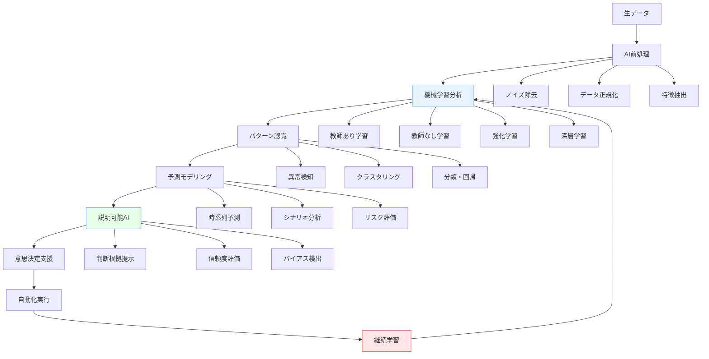
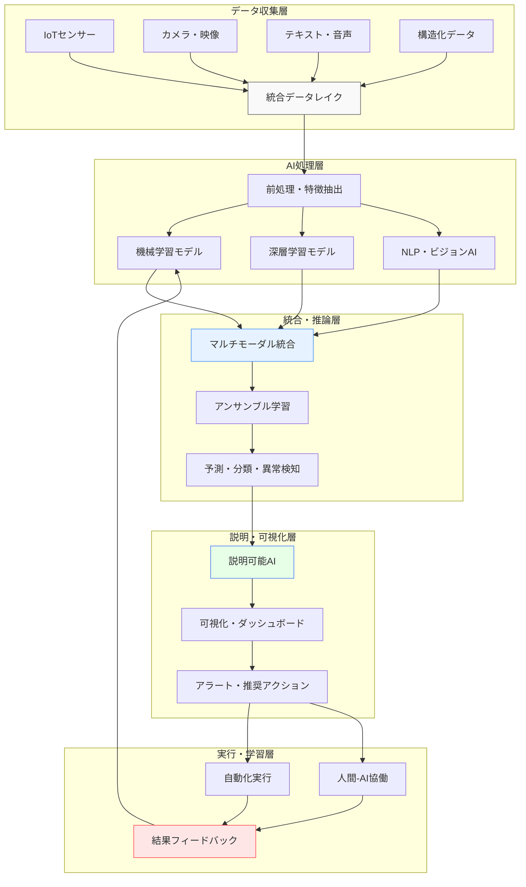

# AI・未来技術と状況認識

!!! info "このセクションについて"
    このセクションでは、人工知能（AI）と未来技術が状況認識と意思決定にもたらす革命的変化について解説します。機械学習、深層学習、自然言語処理、コンピュータビジョンから量子コンピューティング、デジタルツイン、メタバースまで、現在そして未来の技術が如何にして人間の認知能力を拡張し、より効果的な意思決定を支援するかを探求します。

## AI・未来技術の重要性

現代の状況認識システムは、膨大なデータの処理、複雑なパターンの認識、リアルタイムでの予測分析において人間の能力の限界を超えています。AI技術の導入により、これらの課題を克服し、より精密で迅速、かつ包括的な状況認識が実現されています。

### AI技術による状況認識の進化



## AI技術分野別概要

このセクションでは、以下のAI・未来技術分野における状況認識への応用を詳しく解説します。

<div class="grid cards" markdown>

- ### [機械学習・深層学習](./machine-learning/)

    ---
    
    データからのパターン学習と予測

    - **教師あり学習**: 分類・回帰による予測モデル
    - **教師なし学習**: クラスタリング・異常検知
    - **強化学習**: 意思決定の最適化
    - **深層学習**: ニューラルネットワークによる高度なパターン認識

- ### [自然言語処理（NLP）](./natural-language-processing/)

    ---
    
    テキスト・音声データからの情報抽出

    - **情報抽出**: 構造化されていないデータからの知識獲得
    - **感情分析**: 世論・市場動向の把握
    - **自動翻訳**: 多言語環境での情報共有
    - **大規模言語モデル**: GPT、BERT等による高度な言語理解

- ### [コンピュータビジョン](./computer-vision/)

    ---
    
    画像・映像からの状況認識

    - **オブジェクト検出**: 物体・人物の自動識別
    - **画像分類**: シーン理解・状況判定
    - **異常検知**: 監視カメラによる異常行動・事象検出
    - **医療画像解析**: X線、MRI、CT画像の診断支援

- ### [予測分析・シミュレーション](./predictive-analytics/)

    ---
    
    将来の状況予測とシナリオ分析

    - **時系列分析**: 過去データからの傾向予測
    - **モンテカルロシミュレーション**: 確率的シナリオ分析
    - **デジタルツイン**: 現実世界のリアルタイム再現
    - **複雑系モデリング**: システム全体の相互作用分析

- ### [説明可能AI（XAI）](./explainable-ai/)

    ---
    
    AI判断の透明性と信頼性確保

    - **解釈可能性**: 判断根拠の明確化
    - **可視化技術**: AI思考プロセスの視覚的表現
    - **バイアス検出**: AI判断の公平性確保
    - **信頼性評価**: 予測精度の定量的評価

- ### [エッジAI・リアルタイム処理](./edge-ai/)

    ---
    
    現場での即座のAI判断

    - **エッジコンピューティング**: 現地でのデータ処理
    - **リアルタイム推論**: 低遅延AI判断
    - **軽量化モデル**: モバイル・IoTデバイス向けAI
    - **フェデレーテッドラーニング**: プライバシー保護学習

</div>

## 未来技術の展望

<div class="grid cards" markdown>

<!-- - ### [量子コンピューティング](./quantum-computing/) -->
- ### 量子コンピューティング

    ---
    
    国家・企業の競争優位の新次元

    - **量子機械学習**: 量子アルゴリズムによる高速学習
    - **量子暗号**: 通信セキュリティの革新
    - **最適化問題**: 複雑な組み合わせ最適化の解決
    - **量子シミュレーション**: 分子・材料レベルのモデリング

<!-- - ### [メタバース・没入型技術](./metaverse/) -->
- ### メタバース・没入型技術

    ---

    仮想世界での状況認識・意思決定

    - **VR/AR**: 拡張・仮想現実による情報表示
    - **デジタルツイン**: 仮想空間での実世界再現
    - **没入型シミュレーション**: 仮想環境での訓練・体験
    - **バーチャルコラボレーション**: 遠隔地との協働作業

<!-- - ### [ブロックチェーン・分散技術](./blockchain/) -->
- ### ブロックチェーン・分散技術

    ---

    信頼性とトレーサビリティの確保

    - **データ完全性**: 改ざん不可能な記録管理
    - **分散意思決定**: DAOによる集合知活用
    - **スマートコントラクト**: 自動実行される契約
    - **トークン経済**: インセンティブ設計による行動誘導

<!-- - ### [バイオテクノロジー・脳科学](./biotechnology/) -->
- ### バイオテクノロジー・脳科学

    ---

    人間の認知能力拡張

    - **ブレイン・コンピューター・インターフェース**: 直接的な脳コンピューター接続
    - **認知拡張**: 薬物・技術による認知能力向上
    - **神経フィードバック**: 脳活動の可視化・制御
    - **バイオセンサー**: 生体情報による状況認識

</div>

## 技術統合アーキテクチャ

### 多層AI統合システム



### 実装上の考慮事項

| 要素 | 課題 | 解決策 | 実装例 |
|---|---|---|---|
| スケーラビリティ | 大量データ処理の負荷 | 分散処理、クラウドネイティブ設計 | Kubernetes、Apache Spark |
| リアルタイム性 | 低遅延での推論実行 | エッジAI、ストリーミング処理 | TensorRT、Apache Kafka |
| 説明可能性 | ブラックボックス問題 | XAI、可視化技術 | LIME、SHAP、Grad-CAM |
| プライバシー | 個人情報保護 | フェデレーテッドラーニング、差分プライバシー | TensorFlow Federated |
| セキュリティ | 敵対的攻撃への対策 | 堅牢性向上、異常検知 | Adversarial Training |
| 倫理・公平性 | AIバイアス、意思決定の公平性 | フェアネス指標、多様性確保 | Fairness Indicators |

## Typescript実装例：統合AI状況認識システム

#### システム概要

このTypeScript実装例は、複数のAI技術を統合して包括的な状況認識を実現するシステムアーキテクチャを示しています。

#### 主要コンポーネント

=== "1. システム構成インターフェース"
    - **AISituationalAwarenessSystem**: メインシステムの構成要素を定義
    - **データ取得**: マルチモーダルデータの統合処理
    - **AI処理パイプライン**: 機械学習モデルの統合実行
    - **説明可能AI**: 判断根拠の生成・可視化
    - **継続学習**: フィードバックからの自動改善

=== "2. 予測・分析結果の構造化"
    - **SituationalPrediction**: 状況認識の総合結果
    - **PredictionComponent**: 個別予測項目（分類、回帰、異常検知等）
    - **ExplanationComponent**: AI判断の説明・根拠
    - **ActionRecommendation**: 推奨される行動・対策

=== "3. データ統合処理"
    - **マルチモーダルストリーム**: テキスト、画像、センサー、構造化データの並行処理
    - **前処理パイプライン**: データ正規化、特徴抽出の自動化
    - **リアルタイム処理**: RxJSを活用したストリーミング処理

=== "4. AI分析エンジン"
    - **テキスト分析**: 感情分析、エンティティ抽出、トピック分析
    - **画像分析**: オブジェクト検出、シーン分類、異常検知
    - **マルチモーダル統合**: 複数データソースの融合分析
    - **予測生成**: 時系列予測、分類、異常検知の統合実行

=== "5. システム監視・保守"
    - **パフォーマンス監視**: 精度・性能のリアルタイム追跡
    - **継続学習**: 新データによるモデル自動更新
    - **ヘルスチェック**: システム稼働状況の監視
    - **アラート生成**: 異常・重要事象の自動通知

#### 実装の特徴

1. **モジュラー設計**: 各AI技術を独立したモジュールとして実装
2. **リアルタイム処理**: Observableパターンによる非同期データ処理
3. **型安全性**: TypeScriptによる厳密な型定義
4. **拡張性**: 新しいAI技術の容易な追加・統合
5. **説明可能性**: 全ての判断に対する根拠提供
6. **自動化**: システムの自律運用とメンテナンス

このシステムは、現実の状況認識プラットフォーム開発における設計パターンとベストプラクティスを示し、実装時の参考となる具体的なアーキテクチャを提供しています。
    
??? TypeScript実装例

    ```typescript
    // 統合AI状況認識システムの基本アーキテクチャ
    interface AISituationalAwarenessSystem {
        dataIngestor: MultiModalDataIngestor;
        preprocessor: AIDataPreprocessor;
        mlPipeline: MachineLearningPipeline;
        fusionEngine: MultiModalFusionEngine;
        explainer: ExplainableAIEngine;
        decisionSupport: AIDecisionSupport;
        feedbackLoop: ContinuousLearningEngine;
    }

    interface SituationalPrediction {
        id: string;
        timestamp: Date;
        scenario: string;
        confidence: number;
        predictions: PredictionComponent[];
        explanations: ExplanationComponent[];
        recommendations: ActionRecommendation[];
        uncertainties: UncertaintyMetrics;
    }

    interface PredictionComponent {
        type: PredictionType;
        value: any;
        confidence: number;
        timeHorizon: number; // minutes
        dataSource: string[];
        methodology: AlgorithmType;
    }

    enum PredictionType {
        CLASSIFICATION = 'classification',
        REGRESSION = 'regression',
        ANOMALY_DETECTION = 'anomaly_detection',
        TIME_SERIES_FORECAST = 'time_series_forecast',
        REINFORCEMENT_LEARNING = 'reinforcement_learning'
    }

    enum AlgorithmType {
        RANDOM_FOREST = 'random_forest',
        NEURAL_NETWORK = 'neural_network',
        SVM = 'svm',
        LSTM = 'lstm',
        TRANSFORMER = 'transformer',
        ENSEMBLE = 'ensemble'
    }

    class IntegratedAISituationalAwareness {
        private dataStreams: Map<string, Observable<any>> = new Map();
        private mlModels: Map<string, MLModel> = new Map();
        private fusionEngine: MultiModalFusionEngine;
        private explainabilityEngine: ExplainableAIEngine;
        private continuousLearning: ContinuousLearningEngine;

        constructor() {
            this.fusionEngine = new MultiModalFusionEngine();
            this.explainabilityEngine = new ExplainableAIEngine();
            this.continuousLearning = new ContinuousLearningEngine();
            this.initializeSystem();
        }

        // システム初期化
        private initializeSystem(): void {
            // データストリーム設定
            this.setupDataStreams();
            
            // 機械学習モデル読み込み
            this.loadMLModels();
            
            // リアルタイム処理パイプライン構築
            this.setupRealTimePipeline();
            
            // 継続学習メカニズム活性化
            this.enableContinuousLearning();
        }

        // マルチモーダルデータストリーム設定
        private setupDataStreams(): void {
            // テキストデータストリーム
            this.dataStreams.set('text', 
                this.createTextStream().pipe(
                    map(data => this.preprocessText(data)),
                    share()
                )
            );

            // 画像データストリーム
            this.dataStreams.set('image',
                this.createImageStream().pipe(
                    map(data => this.preprocessImage(data)),
                    share()
                )
            );

            // センサーデータストリーム
            this.dataStreams.set('sensor',
                this.createSensorStream().pipe(
                    map(data => this.preprocessSensorData(data)),
                    bufferTime(1000), // 1秒バッファ
                    share()
                )
            );

            // 構造化データストリーム
            this.dataStreams.set('structured',
                this.createStructuredDataStream().pipe(
                    map(data => this.preprocessStructuredData(data)),
                    share()
                )
            );
        }

        // 統合AI状況認識実行
        async performIntegratedSituationalAwareness(
            timeHorizon: number = 60
        ): Promise<SituationalPrediction> {
            // 現在のデータスナップショット取得
            const currentData = await this.getCurrentDataSnapshot();

            // 各モダリティでのAI分析
            const textAnalysis = await this.analyzeTextData(currentData.text);
            const imageAnalysis = await this.analyzeImageData(currentData.image);
            const sensorAnalysis = await this.analyzeSensorData(currentData.sensor);
            const structuredAnalysis = await this.analyzeStructuredData(currentData.structured);

            // マルチモーダル統合
            const fusedAnalysis = await this.fusionEngine.fuseAnalyses([
                textAnalysis,
                imageAnalysis,
                sensorAnalysis,
                structuredAnalysis
            ]);

            // 予測実行
            const predictions = await this.generatePredictions(fusedAnalysis, timeHorizon);

            // 説明生成
            const explanations = await this.explainabilityEngine.generateExplanations(
                predictions,
                fusedAnalysis
            );

            // 行動推奨生成
            const recommendations = await this.generateActionRecommendations(
                predictions,
                explanations
            );

            // 不確実性定量化
            const uncertainties = await this.quantifyUncertainties(predictions);

            return {
                id: generateUUID(),
                timestamp: new Date(),
                scenario: this.determineScenario(fusedAnalysis),
                confidence: this.calculateOverallConfidence(predictions),
                predictions,
                explanations,
                recommendations,
                uncertainties
            };
        }

        // テキストデータ分析
        private async analyzeTextData(textData: TextData[]): Promise<TextAnalysisResult> {
            const model = this.mlModels.get('nlp_transformer') as NLPModel;

            // 感情分析
            const sentimentAnalysis = await model.analyzeSentiment(textData);

            // エンティティ抽出
            const entityExtraction = await model.extractEntities(textData);

            // トピックモデリング
            const topicModeling = await model.extractTopics(textData);

            // 要約生成
            const summarization = await model.generateSummary(textData);

            // 異常テキスト検出
            const anomalyDetection = await model.detectAnomalousText(textData);

            return {
                sentiment: sentimentAnalysis,
                entities: entityExtraction,
                topics: topicModeling,
                summary: summarization,
                anomalies: anomalyDetection,
                confidence: this.calculateTextAnalysisConfidence({
                    sentiment: sentimentAnalysis,
                    entities: entityExtraction,
                    topics: topicModeling
                })
            };
        }

        // 画像データ分析
        private async analyzeImageData(imageData: ImageData[]): Promise<ImageAnalysisResult> {
            const cnnModel = this.mlModels.get('cnn_vision') as VisionModel;

            // オブジェクト検出
            const objectDetection = await cnnModel.detectObjects(imageData);

            // シーン分類
            const sceneClassification = await cnnModel.classifyScenes(imageData);

            // 異常検知
            const anomalyDetection = await cnnModel.detectAnomalies(imageData);

            // 特徴抽出
            const featureExtraction = await cnnModel.extractFeatures(imageData);

            // セマンティックセグメンテーション
            const segmentation = await cnnModel.segmentImages(imageData);

            return {
                objects: objectDetection,
                scenes: sceneClassification,
                anomalies: anomalyDetection,
                features: featureExtraction,
                segmentation: segmentation,
                confidence: this.calculateImageAnalysisConfidence({
                    objects: objectDetection,
                    scenes: sceneClassification
                })
            };
        }

        // 予測生成
        private async generatePredictions(
            fusedAnalysis: FusedAnalysisResult,
            timeHorizon: number
        ): Promise<PredictionComponent[]> {
            const predictions: PredictionComponent[] = [];

            // 時系列予測
            const timeSeriesModel = this.mlModels.get('lstm_forecaster') as TimeSeriesModel;
            const timeSeriesPrediction = await timeSeriesModel.forecast(
                fusedAnalysis.temporalFeatures,
                timeHorizon
            );

            predictions.push({
                type: PredictionType.TIME_SERIES_FORECAST,
                value: timeSeriesPrediction.forecast,
                confidence: timeSeriesPrediction.confidence,
                timeHorizon,
                dataSource: ['sensor', 'structured'],
                methodology: AlgorithmType.LSTM
            });

            // 分類予測
            const classificationModel = this.mlModels.get('ensemble_classifier') as ClassificationModel;
            const classificationPrediction = await classificationModel.predict(fusedAnalysis.features);

            predictions.push({
                type: PredictionType.CLASSIFICATION,
                value: classificationPrediction.class,
                confidence: classificationPrediction.confidence,
                timeHorizon: 0, // 即座の分類
                dataSource: ['text', 'image', 'sensor', 'structured'],
                methodology: AlgorithmType.ENSEMBLE
            });

            // 異常検知
            const anomalyModel = this.mlModels.get('isolation_forest') as AnomalyDetectionModel;
            const anomalyPrediction = await anomalyModel.detectAnomalies(fusedAnalysis.features);

            predictions.push({
                type: PredictionType.ANOMALY_DETECTION,
                value: anomalyPrediction.anomalies,
                confidence: anomalyPrediction.confidence,
                timeHorizon: 5, // 5分先までの異常予測
                dataSource: ['sensor', 'image'],
                methodology: AlgorithmType.RANDOM_FOREST
            });

            return predictions;
        }

        // アクション推奨生成
        private async generateActionRecommendations(
            predictions: PredictionComponent[],
            explanations: ExplanationComponent[]
        ): Promise<ActionRecommendation[]> {
            const recommendations: ActionRecommendation[] = [];

            for (const prediction of predictions) {
                switch (prediction.type) {
                    case PredictionType.ANOMALY_DETECTION:
                        if (prediction.value.length > 0) {
                            recommendations.push({
                                action: 'INVESTIGATE_ANOMALY',
                                priority: this.calculatePriority(prediction.confidence),
                                description: '異常が検出されました。詳細調査を推奨します。',
                                evidence: explanations.filter(e => e.predictionId === prediction.type),
                                timeConstraint: 300, // 5分以内
                                resources: ['investigation_team', 'monitoring_tools']
                            });
                        }
                        break;

                    case PredictionType.TIME_SERIES_FORECAST:
                        if (prediction.value.trend === 'declining') {
                            recommendations.push({
                                action: 'PREVENTIVE_MEASURES',
                                priority: 'MEDIUM',
                                description: '予測トレンドに基づく予防措置の実施を推奨します。',
                                evidence: explanations.filter(e => e.predictionId === prediction.type),
                                timeConstraint: timeHorizon * 60, // 予測時間内
                                resources: ['preventive_team']
                            });
                        }
                        break;

                    case PredictionType.CLASSIFICATION:
                        if (prediction.confidence > 0.8) {
                            recommendations.push({
                                action: 'CONFIRM_CLASSIFICATION',
                                priority: 'LOW',
                                description: '高信頼度の分類結果の確認を推奨します。',
                                evidence: explanations.filter(e => e.predictionId === prediction.type),
                                timeConstraint: 600, // 10分以内
                                resources: ['validation_team']
                            });
                        }
                        break;
                }
            }

            return recommendations;
        }

        // 継続学習実行
        private enableContinuousLearning(): void {
            // フィードバックループ設定
            this.continuousLearning.setupFeedbackLoop();

            // 定期的なモデル更新
            interval(3600000).subscribe(async () => { // 1時間ごと
                await this.updateModelsWithNewData();
            });

            // パフォーマンス監視
            this.monitorModelPerformance().subscribe(performance => {
                if (performance.accuracy < 0.85) {
                    this.triggerModelRetraining(performance.modelId);
                }
            });
        }

        // モデルパフォーマンス監視
        private monitorModelPerformance(): Observable<ModelPerformance> {
            return merge(
                this.monitorClassificationAccuracy(),
                this.monitorPredictionError(),
                this.monitorAnomalyDetectionRate()
            ).pipe(
                throttleTime(60000) // 1分に1回最大
            );
        }

        // リアルタイム状況認識ダッシュボード
        getRealTimeSituationalDashboard(): Observable<SituationalDashboard> {
            return combineLatest([
                this.performIntegratedSituationalAwareness(),
                this.getSystemHealth(),
                this.getModelPerformanceMetrics()
            ]).pipe(
                map(([awareness, health, performance]) => ({
                    timestamp: new Date(),
                    situationalAwareness: awareness,
                    systemHealth: health,
                    modelPerformance: performance,
                    alerts: this.generateSystemAlerts(awareness, health),
                    insights: this.generateKeyInsights(awareness),
                    recommendedActions: awareness.recommendations
                }))
            );
        }
    }

    interface ActionRecommendation {
        action: string;
        priority: 'LOW' | 'MEDIUM' | 'HIGH' | 'CRITICAL';
        description: string;
        evidence: ExplanationComponent[];
        timeConstraint: number; // seconds
        resources: string[];
    }

    interface ExplanationComponent {
        predictionId: string;
        explanation: string;
        importance: number;
        visualizations: VisualizationData[];
    }

    interface UncertaintyMetrics {
        aleatoric: number; // データの不確実性
        epistemic: number; // モデルの不確実性
        overall: number;
        sources: UncertaintySource[];
    }

    interface SituationalDashboard {
        timestamp: Date;
        situationalAwareness: SituationalPrediction;
        systemHealth: SystemHealthStatus;
        modelPerformance: ModelPerformanceMetrics;
        alerts: SystemAlert[];
        insights: KeyInsight[];
        recommendedActions: ActionRecommendation[];
    }
    ```

## 応用分野別実装

### 産業界におけるAI活用例

| 分野 | AI技術 | 状況認識応用 | 効果・メリット |
|---|---|---|---|
| 製造業 | コンピュータビジョン、予測保全 | 品質検査自動化、設備故障予測 | 不良品削減、ダウンタイム最小化 |
| 金融 | 異常検知、自然言語処理 | 不正取引検知、市場分析 | リスク削減、投資判断支援 |
| 小売業 | 推薦システム、需要予測 | 顧客行動分析、在庫最適化 | 売上向上、コスト削減 |
| 交通 | 自動運転、交通流解析 | 安全運転支援、渋滞予測 | 事故削減、効率向上 |
| エネルギー | スマートグリッド、需要予測 | 電力需給バランス、故障予測 | 安定供給、効率運用 |

### 社会基盤でのAI活用例

| 分野 | AI技術 | 状況認識応用 | 社会的インパクト |
|---|---|---|---|
| 都市計画 | シミュレーション、最適化 | 交通流・人流分析、都市設計 | 住みやすい街づくり |
| 災害対策 | 画像解析、予測モデル | 被害予測、避難計画最適化 | 防災・減災効果 |
| 医療 | 画像診断、薬物発見 | 疾病診断、治療計画立案 | 健康寿命延伸 |
| 教育 | 個別化学習、学習分析 | 学習状況把握、教育効果測定 | 教育格差解消 |
| 環境 | 環境モニタリング、予測 | 汚染検知、気候変動対策 | 持続可能社会実現 |

## 倫理・社会課題

### AI導入における重要課題

| 課題 | 具体的問題 | 対策・解決策 | 実装アプローチ |
|---|---|---|---|
| **プライバシー** | 個人データの不適切利用 | 差分プライバシー、フェデレーテッドラーニング | TensorFlow Privacy、PySyft |
| **バイアス・公平性** | アルゴリズムバイアス、差別 | フェアネス指標、多様性確保 | Fairness Indicators、IBM AIF360 |
| **説明可能性** | ブラックボックス問題 | XAI技術、可視化 | LIME、SHAP、What-If Tool |
| **セキュリティ** | 敵対的攻撃、モデル盗用 | 堅牢性向上、セキュア学習 | Adversarial Training、Differential Privacy |
| **雇用・社会影響** | 自動化による雇用代替 | リスキリング、新職種創造 | 人間-AI協働設計 |
| **責任・説明責任** | AI判断の責任所在 | ガバナンス体制、監査制度 | AI Ethics Board、Algorithm Auditing |

## 技術実装ガイドライン

### 開発段階別チェックリスト

#### 1. 要件定義・設計段階
- [ ] 状況認識の目的・スコープ明確化
- [ ] ステークホルダー分析・要求収集
- [ ] 倫理・法的制約の確認
- [ ] データ取得・プライバシー要件定義
- [ ] AI導入効果の定量化

#### 2. データ準備・モデル開発段階
- [ ] データ品質評価・前処理
- [ ] バイアス検出・軽減策実装
- [ ] モデル選択・アーキテクチャ設計
- [ ] 説明可能性要件への対応
- [ ] セキュリティ対策実装

#### 3. 検証・テスト段階
- [ ] 精度・性能評価
- [ ] 公平性・バイアステスト
- [ ] 堅牢性・セキュリティテスト
- [ ] ユーザビリティテスト
- [ ] A/Bテスト・パイロット運用

#### 4. 運用・保守段階
- [ ] モニタリング・アラート設定
- [ ] パフォーマンス継続評価
- [ ] フィードバックループ構築
- [ ] モデル更新・再学習体制
- [ ] ユーザー教育・サポート

## 学習リソース・開発環境

### 推奨フレームワーク・ツール

| カテゴリ | ツール・フレームワーク | 特徴・用途 |
|---|---|---|
| **機械学習** | TensorFlow, PyTorch | 深層学習・大規模モデル開発 |
| **データ処理** | Apache Spark, Dask | 分散データ処理・前処理 |
| **可視化** | Plotly, D3.js, Observable | インタラクティブ可視化 |
| **説明可能AI** | LIME, SHAP, Captum | モデル解釈・説明生成 |
| **MLOps** | MLflow, Kubeflow, Weights & Biases | モデル管理・実験追跡 |
| **エッジAI** | TensorFlow Lite, ONNX Runtime | 軽量化・高速推論 |
| **クラウド** | AWS SageMaker, Google AI Platform, Azure ML | マネージドML環境 |

### 学習パス・認定資格

| レベル | 学習内容 | 推奨資格 |
|---|---|---|
| **初級** | 機械学習基礎、Python/R | Google AI Certificate、Coursera ML |
| **中級** | 深層学習、専門分野（CV/NLP） | TensorFlow Developer Certificate |
| **上級** | MLOps、システム設計 | AWS ML Specialty、GCP ML Engineer |
| **専門** | 研究開発、論文執筆 | PhD、学会発表 |

## 将来展望・ロードマップ

### 短期（1-2年）
- **エッジAIの普及**: IoTデバイスでのリアルタイム処理
- **説明可能AIの標準化**: 規制対応・信頼性向上
- **フェデレーテッドラーニングの実用化**: プライバシー保護学習

### 中期（3-5年）
- **量子機械学習の登場**: 量子アルゴリズムによる高速化
- **AGI要素技術の発達**: マルチモーダル・汎用AI
- **自律システムの高度化**: 完全自動運転・ロボット

### 長期（5-10年）
- **汎用人工知能（AGI）の実現**: 人間レベル・超人級AI
- **脳-コンピューター直接接続**: 認知拡張・テレパシー通信
- **シンギュラリティへの接近**: 技術的特異点・社会変革

### メタバース・量子世界での状況認識
- **仮想世界の現実化**: メタバース空間での生活・労働
- **量子状態の直接観測**: ナノスケール・分子レベル制御
- **次元間情報処理**: 多元宇宙理論の実用化

## まとめ

AI・未来技術は、状況認識と意思決定の概念を根本から変革しています。単なる自動化を超えて、人間の認知能力を拡張し、これまで不可能だった複雑な問題解決を可能にしています。

### 成功のカギ
- **技術と倫理のバランス**: 革新性と責任ある利用の両立
- **人間中心設計**: AIは人間を支援する道具として位置づけ
- **継続的学習**: 変化する環境への適応能力
- **説明可能性**: 判断プロセスの透明性確保
- **社会的受容**: ステークホルダーとの対話・合意形成

### 日本の役割と機会
日本は、製造業での品質管理、高齢化社会での医療・介護、災害対策など、AI技術の社会実装で世界をリードできる潜在力を持っています。Society 5.0の実現に向け、技術開発と社会制度の両面での取り組みが期待されます。

各技術分野の詳細については、右記のリンクからご確認ください。最新の研究動向から実装事例まで、AI・未来技術による状況認識の進化を深く探求していきましょう。

### 関連リンク

#### 研究機関・学会
- [人工知能学会](https://www.ai-gakkai.or.jp/)
- [IEEE Computational Intelligence Society](https://cis.ieee.org/)
- [AAAI - Association for the Advancement of Artificial Intelligence](https://www.aaai.org/)

#### 技術コミュニティ
- [Kaggle](https://www.kaggle.com/) - データ科学コンペティション
- [Papers With Code](https://paperswithcode.com/) - 最新研究論文・実装
- [Hugging Face](https://huggingface.co/) - NLPモデル・データセット
- [Google AI Research](https://ai.google/research/) - 最新AI研究

### 参考文献

- Goodfellow, I., Bengio, Y., & Courville, A. (2016). Deep Learning. MIT Press.
- Russell, S., & Norvig, P. (2020). Artificial Intelligence: A Modern Approach (4th ed.). Pearson.
- 松尾豊. (2015). 人工知能は人間を超えるか. KADOKAWA.
- 西田豊明編. (2019). 人工知能学大事典. 共立出版.
- Molnar, C. (2020). Interpretable Machine Learning. Lulu.com.
- O'Neil, C. (2016). Weapons of Math Destruction. Crown Publishing.