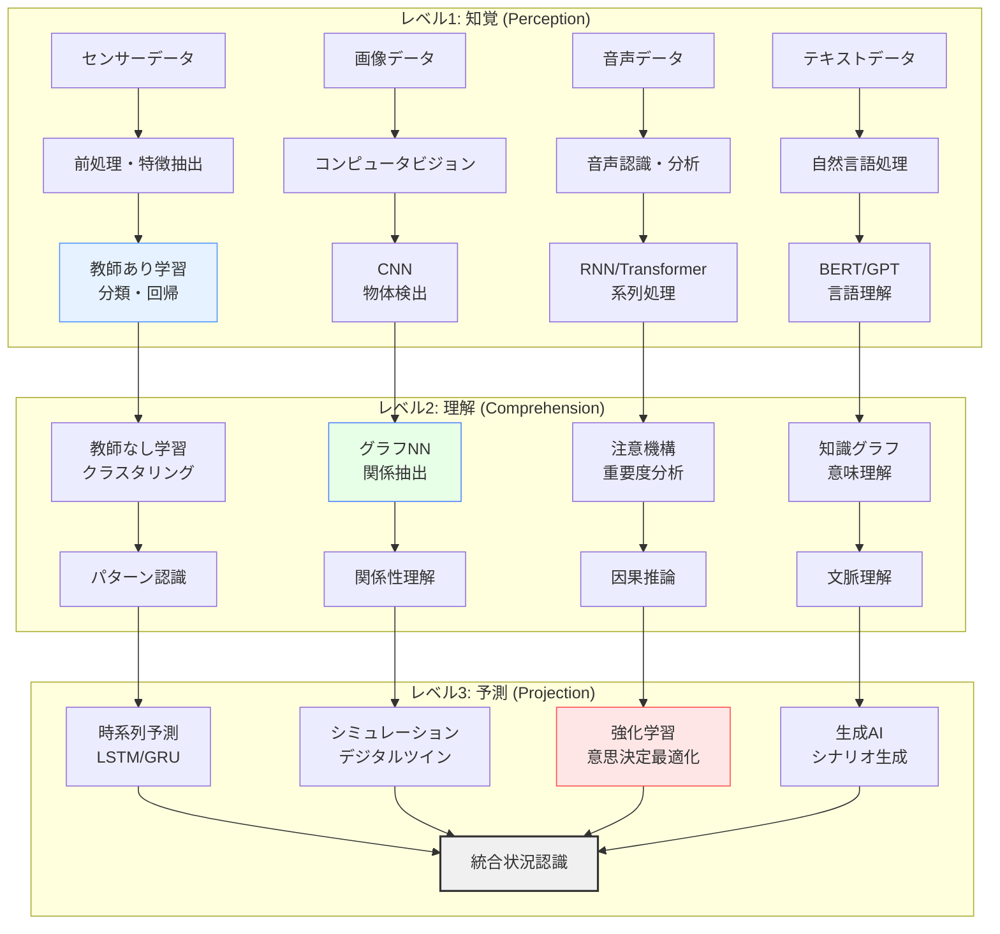

# 機械学習・深層学習による状況認識

!!! info "このページについて"

    このページでは、機械学習と深層学習が状況認識（Situational Awareness）にもたらす革命的変化について詳しく解説します。  
    教師あり学習、教師なし学習、強化学習から、深層学習の最新技術まで、状況認識の各段階でどのように活用されるかを理論と実装の両面から掘り下げます。  
    実践的なTypeScriptコード例も含め、現実の状況認識システム構築への応用を意識した構成となっています。

## 機械学習が変える状況認識の世界

機械学習（Machine Learning）と深層学習（Deep Learning）は、状況認識の精度と範囲を飛躍的に向上させています。膨大なデータからパターンを学習し、複雑な状況を自動で認識・予測する能力は、人間の認知限界を大幅に拡張し、これまで不可能だった精密で包括的な状況把握を実現しています。

本章では、機械学習・深層学習技術が状況認識をどのように変革しているか、Endsleyの3レベルモデルとの対応関係から実装技術まで体系的に解説します。

## 機械学習による状況認識の基本フレームワーク

### Endsleyモデルと機械学習技術の対応



### 機械学習パラダイムと状況認識への応用

| 学習パラダイム | 状況認識への応用 | 主要技術 | 具体例 |
|---|---|---|---|
| **教師あり学習** | 既知パターンの分類・予測 | SVM、決定木、ランダムフォレスト、NN | 異常検知、リスク分類、結果予測 |
| **教師なし学習** | 隠れたパターンの発見 | k-means、階層クラスタリング、PCA、オートエンコーダ | 行動パターン分析、異常状況検出 |
| **半教師あり学習** | 限定ラベルデータでの学習 | Self-training、Co-training、Graph-based | 新規状況の分類、少数事例学習 |
| **強化学習** | 動的環境での最適行動学習 | Q-learning、Actor-Critic、PPO | 最適意思決定、適応的制御 |
| **転移学習** | 既存知識の新領域適用 | Fine-tuning、Domain Adaptation | 類似状況への知識転用 |
| **メタ学習** | 学習方法自体の最適化 | MAML、Reptile | 新しい状況への迅速適応 |

## 教師あり学習による状況認識

### 分類による状況カテゴリ認識

状況を既知のカテゴリに分類することで、適切な対応策を迅速に決定できます。

??? TypeScript実装例

    この例では、センサーデータなどの特徴量から現在の状況を「NORMAL」「WARNING」などに分類する教師あり学習システムを定義しています。複数の機械学習モデルを組み合わせたアンサンブル学習によって高い精度と堅牢性を実現し、信頼度・不確実性・説明可能性なども考慮しています。

    ```typescript
    // 状況分類のための教師あり学習システム
    interface SituationFeature {
      timestamp: Date;
      sensorValues: number[];
      contextualData: any;
      environmentalFactors: number[];
      historicalPattern: number[];
    }

    interface SituationLabel {
      category: 'NORMAL' | 'WARNING' | 'CRITICAL' | 'EMERGENCY';
      subCategory: string;
      confidenceLevel: number;
      actionRequired: boolean;
    }

    interface TrainingExample {
      features: SituationFeature;
      label: SituationLabel;
      metadata: {
        source: string;
        timestamp: Date;
        validator: string;
      };
    }

    class SupervisedSituationClassifier {
      private model: MLModel;
      private featureExtractor: FeatureExtractor;
      private preprocessor: DataPreprocessor;
      private validator: ModelValidator;
      
      constructor() {
        this.featureExtractor = new AdvancedFeatureExtractor();
        this.preprocessor = new DataPreprocessor();
        this.validator = new CrossValidator();
        this.initializeModel();
      }
      
      // モデル初期化
      private initializeModel(): void {
        // アンサンブル学習による堅牢な分類器
        this.model = new EnsembleClassifier({
          baseModels: [
            new RandomForestClassifier({
              nEstimators: 100,
              maxDepth: 10,
              minSamplesLeaf: 5
            }),
            new GradientBoostingClassifier({
              nEstimators: 50,
              learningRate: 0.1,
              maxDepth: 6
            }),
            new SupportVectorMachine({
              kernel: 'rbf',
              C: 1.0,
              gamma: 'scale'
            })
          ],
          votingStrategy: 'soft',
          weights: [0.4, 0.4, 0.2]
        });
      }
      
      // 訓練データからの学習
      async trainModel(trainingData: TrainingExample[]): Promise<TrainingResult> {
        // データ前処理
        const processedData = await this.preprocessTrainingData(trainingData);
        
        // 特徴量抽出
        const features = await this.extractFeatures(processedData);
        
        // 訓練・検証分割
        const { trainSet, validationSet } = this.splitData(features, 0.8);
        
        // モデル訓練
        const trainingMetrics = await this.model.fit(
          trainSet.features,
          trainSet.labels,
          {
            epochs: 100,
            batchSize: 32,
            validationSplit: 0.2,
            callbacks: [
              new EarlyStopping({ patience: 10 }),
              new ReduceLROnPlateau({ factor: 0.5, patience: 5 })
            ]
          }
        );
        
        // モデル評価
        const validationMetrics = await this.evaluateModel(validationSet);
        
        // 交差検証
        const crossValidationResults = await this.validator.crossValidate(
          this.model, features, 5
        );
        
        return {
          trainingMetrics,
          validationMetrics,
          crossValidationResults,
          modelSummary: this.model.summary(),
          featureImportance: this.getFeatureImportance()
        };
      }
      
      // 状況分類の実行
      async classifySituation(
        currentSituation: SituationFeature
      ): Promise<ClassificationResult> {
        // 前処理
        const processedSituation = await this.preprocessor.transform([currentSituation]);
        
        // 特徴量抽出
        const features = await this.featureExtractor.extract(processedSituation);
        
        // 予測実行
        const prediction = await this.model.predict(features);
        
        // 信頼度計算
        const confidence = await this.model.predictProba(features);
        
        // 不確実性推定
        const uncertainty = await this.estimateUncertainty(features);
        
        // 説明生成
        const explanation = await this.generateExplanation(features, prediction);
        
        return {
          predictedCategory: prediction.category,
          subCategory: prediction.subCategory,
          confidence: confidence.max(),
          uncertainty: uncertainty,
          explanation: explanation,
          recommendedActions: this.getRecommendedActions(prediction),
          alertLevel: this.determineAlertLevel(prediction, confidence)
        };
      }
      
      // 特徴量重要度分析
      private getFeatureImportance(): FeatureImportance[] {
        return this.model.getFeatureImportances().map((importance, index) => ({
          featureName: this.featureExtractor.getFeatureNames()[index],
          importance: importance,
          category: this.categorizeFeature(index)
        })).sort((a, b) => b.importance - a.importance);
      }
      
      // リアルタイム学習（オンライン学習）
      async updateModelOnline(newExample: TrainingExample): Promise<void> {
        // 新サンプルの前処理
        const processedExample = await this.preprocessTrainingData([newExample]);
        
        // 特徴量抽出
        const features = await this.extractFeatures(processedExample);
        
        // インクリメンタル学習
        await this.model.partialFit(features[0].features, features[0].label);
        
        // モデル性能のモニタリング
        await this.monitorModelPerformance();
      }
      
      // モデル性能継続監視
      private async monitorModelPerformance(): Promise<PerformanceMetrics> {
        const recentPredictions = await this.getRecentPredictions(100);
        const actualOutcomes = await this.getActualOutcomes(recentPredictions);
        
        const currentMetrics = this.calculateMetrics(recentPredictions, actualOutcomes);
        
        // 性能劣化検知
        if (currentMetrics.accuracy < this.performanceThreshold.accuracy) {
          await this.triggerModelRetraining();
        }
        
        return currentMetrics;
      }
      
      // モデル説明生成
      private async generateExplanation(
        features: ProcessedFeatures,
        prediction: Prediction
      ): Promise<Explanation> {
        // SHAP値による説明
        const shapValues = await this.calculateSHAPValues(features);
        
        // 特徴量寄与度の可視化データ
        const contributionVisualization = this.createContributionVisualization(shapValues);
        
        // 自然言語での説明生成
        const naturalLanguageExplanation = this.generateNaturalExplanation(
          shapValues, prediction
        );
        
        return {
          shapValues,
          contributionVisualization,
          naturalLanguageExplanation,
          confidenceInterval: this.calculateConfidenceInterval(features),
          alternativePredictions: this.getAlternativePredictions(features)
        };
      }
    }

    // 結果インターフェース
    interface ClassificationResult {
      predictedCategory: string;
      subCategory: string;
      confidence: number;
      uncertainty: number;
      explanation: Explanation;
      recommendedActions: Action[];
      alertLevel: AlertLevel;
    }

    interface TrainingResult {
      trainingMetrics: Metrics;
      validationMetrics: Metrics;
      crossValidationResults: CrossValidationMetrics;
      modelSummary: ModelSummary;
      featureImportance: FeatureImportance[];
    }
    ```

### 回帰による状況予測

連続値の予測により、状況の定量的評価や将来予測を行います。

=== "リスク度予測"
    状況のリスク度を0-1の連続値で予測し、適切な警戒レベルを設定します。

    - **多元回帰分析**: 複数要因からのリスク度算出
    - **時系列回帰**: 過去の推移からの未来リスク予測
    - **非線形回帰**: 複雑な関係性を持つリスク要因の処理

=== "パフォーマンス予測"
    システムや人間のパフォーマンスを定量的に予測します。

    - **効率性指標予測**: タスク完了時間、精度、コストの予測
    - **疲労度推定**: 作業者の疲労レベルと性能低下の予測
    - **システム負荷予測**: インフラの処理能力と負荷の予測

## 教師なし学習による状況パターン発見

### クラスタリングによる状況パターン分析

既知のラベルなしに状況の自然なグループ化を発見し、新たな状況カテゴリや異常パターンを特定します。

??? TypeScript実装例

    ラベルのないデータから自然なパターンを抽出するクラスタリングと異常検知のシステムです。DBSCANやK-meansの組み合わせによるハイブリッドクラスタリングや、Isolation Forest等による異常検知を活用し、状況の分類・理解・新規性評価を行います。リアルタイム分析や時系列追跡にも対応しています。

    ```typescript
    // 教師なし学習による状況パターン分析システム
    class UnsupervisedSituationAnalyzer {
      private clusteringModel: ClusteringModel;
      private anomalyDetector: AnomalyDetectionModel;
      private dimensionalityReducer: DimensionalityReduction;
      private patternMiner: FrequentPatternMiner;
      
      constructor() {
        this.initializeModels();
      }
      
      private initializeModels(): void {
        // 階層クラスタリング + K-means のハイブリッド
        this.clusteringModel = new HybridClustering({
          primaryMethod: new DBSCAN({
            eps: 0.5,
            minSamples: 5,
            metric: 'euclidean'
          }),
          secondaryMethod: new KMeans({
            nClusters: 'auto',
            initMethod: 'k-means++',
            maxIterations: 300
          }),
          validationMethod: new SilhouetteAnalysis()
        });
        
        // 異常検知（複数手法のアンサンブル）
        this.anomalyDetector = new AnomalyEnsemble({
          methods: [
            new IsolationForest({ contamination: 0.1 }),
            new LocalOutlierFactor({ nNeighbors: 20 }),
            new OneClassSVM({ kernel: 'rbf', gamma: 'scale' })
          ],
          votingStrategy: 'majority'
        });
        
        // 次元削減
        this.dimensionalityReducer = new AdaptiveDimensionReduction({
          methods: ['PCA', 'UMAP', 't-SNE'],
          selectionCriteria: 'explained_variance'
        });
      }
      
      // 状況パターンの発見
      async discoverSituationPatterns(
        situationData: SituationFeature[]
      ): Promise<PatternDiscoveryResult> {
        // 前処理とスケーリング
        const preprocessedData = await this.preprocessData(situationData);
        
        // 次元削減
        const reducedData = await this.dimensionalityReducer.fitTransform(
          preprocessedData
        );
        
        // クラスタリング実行
        const clusteringResult = await this.clusteringModel.fitPredict(reducedData);
        
        // 各クラスターの特徴分析
        const clusterProfiles = await this.analyzeClusterProfiles(
          preprocessedData,
          clusteringResult.labels
        );
        
        // 異常パターン検出
        const anomalies = await this.anomalyDetector.detectAnomalies(
          preprocessedData
        );
        
        // 頻出パターン抽出
        const frequentPatterns = await this.patternMiner.minePatterns(
          situationData,
          { minSupport: 0.05, minConfidence: 0.8 }
        );
        
        // パターンの可視化データ生成
        const visualizationData = await this.generateVisualizationData(
          reducedData,
          clusteringResult,
          anomalies
        );
        
        return {
          clusters: clusterProfiles,
          anomalies: anomalies,
          frequentPatterns: frequentPatterns,
          visualization: visualizationData,
          insights: await this.generateInsights(clusterProfiles, anomalies),
          recommendations: await this.generateRecommendations(clusterProfiles)
        };
      }
      
      // クラスタープロファイル分析
      private async analyzeClusterProfiles(
        data: PreprocessedData,
        labels: number[]
      ): Promise<ClusterProfile[]> {
        const uniqueLabels = [...new Set(labels)];
        
        return Promise.all(
          uniqueLabels.map(async (label) => {
            const clusterData = data.filter((_, index) => labels[index] === label);
            
            // 統計的特徴
            const statistics = this.calculateClusterStatistics(clusterData);
            
            // 代表的サンプル
            const representatives = this.findRepresentativeSamples(clusterData, 5);
            
            // 特徴的パターン
            const characteristicPatterns = await this.extractCharacteristicPatterns(
              clusterData
            );
            
            // 時系列パターン分析
            const temporalPatterns = await this.analyzeTemporalPatterns(clusterData);
            
            return {
              clusterId: label,
              size: clusterData.length,
              statistics: statistics,
              representatives: representatives,
              characteristicPatterns: characteristicPatterns,
              temporalPatterns: temporalPatterns,
              description: this.generateClusterDescription(statistics, characteristicPatterns)
            };
          })
        );
      }
      
      // リアルタイム状況分析
      async analyzeCurrentSituation(
        currentSituation: SituationFeature
      ): Promise<RealTimeAnalysisResult> {
        // 前処理
        const processedSituation = await this.preprocessData([currentSituation]);
        
        // どのクラスターに属するか判定
        const clusterAssignment = await this.clusteringModel.predict(
          processedSituation[0]
        );
        
        // 異常度判定
        const anomalyScore = await this.anomalyDetector.decisionFunction(
          processedSituation[0]
        );
        
        // 類似状況の検索
        const similarSituations = await this.findSimilarSituations(
          processedSituation[0],
          10
        );
        
        // 状況の新規性評価
        const noveltyScore = await this.assessNovelty(processedSituation[0]);
        
        return {
          assignedCluster: clusterAssignment,
          clusterProfile: await this.getClusterProfile(clusterAssignment),
          anomalyScore: anomalyScore,
          isAnomalous: anomalyScore > this.anomalyThreshold,
          similarSituations: similarSituations,
          noveltyScore: noveltyScore,
          interpretation: this.interpretAnalysisResult(
            clusterAssignment,
            anomalyScore,
            noveltyScore
          )
        };
      }
      
      // パターン進化の追跡
      async trackPatternEvolution(
        timeWindow: TimeWindow
      ): Promise<PatternEvolutionResult> {
        // 時間窓ごとのデータ取得
        const timeSeriesData = await this.getTimeSeriesData(timeWindow);
        
        // 各時点でのパターン分析
        const temporalPatterns = await Promise.all(
          timeSeriesData.map(async (windowData) => {
            return await this.discoverSituationPatterns(windowData.situations);
          })
        );
        
        // パターンの出現・消失・変化を追跡
        const patternEvolution = this.trackPatternChanges(temporalPatterns);
        
        // 新興パターンの検出
        const emergingPatterns = this.detectEmergingPatterns(temporalPatterns);
        
        // 消失パターンの検出
        const disappearingPatterns = this.detectDisappearingPatterns(temporalPatterns);
        
        return {
          evolutionTimeline: patternEvolution,
          emergingPatterns: emergingPatterns,
          disappearingPatterns: disappearingPatterns,
          stabilityAnalysis: this.analyzePatternStability(temporalPatterns),
          trendAnalysis: this.analyzeTrends(patternEvolution)
        };
      }
    }

    // 結果インターフェース
    interface PatternDiscoveryResult {
      clusters: ClusterProfile[];
      anomalies: AnomalyInfo[];
      frequentPatterns: FrequentPattern[];
      visualization: VisualizationData;
      insights: Insight[];
      recommendations: Recommendation[];
    }

    interface RealTimeAnalysisResult {
      assignedCluster: number;
      clusterProfile: ClusterProfile;
      anomalyScore: number;
      isAnomalous: boolean;
      similarSituations: SimilarSituation[];
      noveltyScore: number;
      interpretation: string;
    }
    ```

### 異常検知による状況認識

=== "統計的異常検知"
    統計的手法により、正常状況からの逸脱を検出します。

    - **ガウシアンモデル**: 正常状況の確率分布からの逸脱検知
    - **多変量統計**: 複数変数間の相関を考慮した異常検知
    - **変化点検出**: 状況の急激な変化の特定

=== "機械学習による異常検知"
    機械学習アルゴリズムによる高度な異常パターン認識。

    - **Isolation Forest**: 異常データの分離による検知
    - **Local Outlier Factor**: 局所的な密度差による異常検知
    - **オートエンコーダ**: 正常パターンの再構成誤差による検知

## 深層学習による高度な状況認識

### 畳込みニューラルネットワーク（CNN）

画像・映像データからの状況認識において、CNNは革命的な精度向上をもたらしています。

??? TypeScript実装例

    畳み込みニューラルネットワーク（CNN）を用いた画像からの状況認識モデルです。ResNetと注意機構（Attention）を組み合わせた構成で、シーン認識・物体検出・セグメンテーション・深度推定など複数タスクに対応します。映像ストリームからのリアルタイム分析や対話的説明生成機能も含まれます。

    ```typescript
    // CNN による画像状況認識システム
    class CNNSituationRecognizer {
      private model: CNNModel;
      private preprocessor: ImagePreprocessor;
      private postprocessor: ResultPostprocessor;
      private explainer: CNNExplainer;
      
      constructor() {
        this.initializeModel();
        this.preprocessor = new ImagePreprocessor();
        this.postprocessor = new ResultPostprocessor();
        this.explainer = new CNNExplainer();
      }
      
      private initializeModel(): void {
        // ResNet + Attention メカニズムのハイブリッドモデル
        this.model = new HybridCNNModel({
          backbone: new ResNet50({
            pretrained: true,
            freezeBackbone: false
          }),
          attentionModule: new SpatialAttention({
            channelReduction: 16
          }),
          classifier: new MultiLevelClassifier({
            levels: ['scene', 'objects', 'activities', 'anomalies'],
            hiddenSizes: [512, 256, 128]
          }),
          auxiliaryTasks: [
            new ObjectDetectionHead(),
            new SemanticSegmentationHead(),
            new DepthEstimationHead()
          ]
        });
      }
      
      // 画像からの状況認識
      async recognizeSituation(
        imageData: ImageData | ImageData[]
      ): Promise<SituationRecognitionResult> {
        // バッチ処理対応
        const images = Array.isArray(imageData) ? imageData : [imageData];
        
        // 前処理
        const preprocessedImages = await this.preprocessor.process(images, {
          resize: [224, 224],
          normalize: true,
          augmentation: false
        });
        
        // CNN推論実行
        const modelOutput = await this.model.predict(preprocessedImages, {
          returnAttention: true,
          returnIntermediateFeatures: true
        });
        
        // 結果の後処理
        const processedResults = await this.postprocessor.process(modelOutput);
        
        // 信頼度・不確実性評価
        const confidenceScores = this.calculateConfidenceScores(modelOutput);
        const uncertaintyEstimate = await this.estimateUncertainty(modelOutput);
        
        // 説明可能性の生成
        const explanations = await this.explainer.generateExplanations(
          preprocessedImages,
          modelOutput,
          {
            method: 'grad-cam',
            layerName: 'conv5_block3_out'
          }
        );
        
        return {
          predictions: processedResults,
          confidence: confidenceScores,
          uncertainty: uncertaintyEstimate,
          explanations: explanations,
          attentionMaps: modelOutput.attentionMaps,
          detectedObjects: modelOutput.objectDetections,
          sceneSegmentation: modelOutput.segmentationMasks,
          riskAssessment: this.assessRiskFromVisualContext(processedResults)
        };
      }
      
      // リアルタイム映像解析
      async analyzeVideoStream(
        videoStream: MediaStream
      ): Promise<Observable<StreamAnalysisResult>> {
        return new Observable<StreamAnalysisResult>(observer => {
          const videoElement = document.createElement('video');
          const canvas = document.createElement('canvas');
          const context = canvas.getContext('2d')!;
          
          videoElement.srcObject = videoStream;
          videoElement.play();
          
          // フレーム処理のタイマー
          const frameInterval = setInterval(async () => {
            try {
              // フレーム取得
              context.drawImage(videoElement, 0, 0, canvas.width, canvas.height);
              const imageData = context.getImageData(0, 0, canvas.width, canvas.height);
              
              // 状況認識実行
              const result = await this.recognizeSituation(imageData);
              
              // 時系列解析
              const temporalAnalysis = await this.analyzeTemporalPatterns(result);
              
              // イベント検出
              const eventDetection = this.detectEvents(result, temporalAnalysis);
              
              observer.next({
                frameResult: result,
                temporalAnalysis: temporalAnalysis,
                detectedEvents: eventDetection,
                timestamp: new Date()
              });
            } catch (error) {
              observer.error(error);
            }
          }, 1000 / 30); // 30 FPS
          
          // クリーンアップ
          return () => {
            clearInterval(frameInterval);
            videoElement.srcObject = null;
          };
        });
      }
      
      // マルチスケール状況認識
      async multiScaleRecognition(
        imageData: ImageData
      ): Promise<MultiScaleResult> {
        const scales = [0.5, 0.75, 1.0, 1.25, 1.5];
        
        // 各スケールでの認識実行
        const scaleResults = await Promise.all(
          scales.map(async (scale) => {
            const scaledImage = await this.preprocessor.rescale(imageData, scale);
            return await this.recognizeSituation(scaledImage);
          })
        );
        
        // スケール間の結果統合
        const integratedResult = this.integrateMultiScaleResults(scaleResults);
        
        // スケール不変特徴の抽出
        const scaleInvariantFeatures = this.extractScaleInvariantFeatures(scaleResults);
        
        return {
          perScaleResults: scaleResults,
          integratedResult: integratedResult,
          scaleInvariantFeatures: scaleInvariantFeatures,
          optimalScale: this.determineOptimalScale(scaleResults)
        };
      }
      
      // 対話的説明生成
      async generateInteractiveExplanation(
        imageData: ImageData,
        recognitionResult: SituationRecognitionResult,
        userQuery: string
      ): Promise<InteractiveExplanation> {
        // ユーザークエリの解析
        const queryAnalysis = await this.analyzeUserQuery(userQuery);
        
        // 該当領域のハイライト
        const relevantRegions = await this.identifyRelevantRegions(
          imageData,
          recognitionResult,
          queryAnalysis
        );
        
        // 段階的説明の生成
        const layeredExplanation = await this.generateLayeredExplanation(
          recognitionResult,
          queryAnalysis,
          relevantRegions
        );
        
        // 反実例の生成
        const counterfactualExamples = await this.generateCounterfactuals(
          imageData,
          recognitionResult,
          queryAnalysis
        );
        
        return {
          queryAnalysis: queryAnalysis,
          relevantRegions: relevantRegions,
          layeredExplanation: layeredExplanation,
          counterfactualExamples: counterfactualExamples,
          interactionSuggestions: this.generateInteractionSuggestions(queryAnalysis)
        };
      }
    }

    // 結果インターフェース
    interface SituationRecognitionResult {
      predictions: SituationPrediction[];
      confidence: ConfidenceScores;
      uncertainty: UncertaintyEstimate;
      explanations: Explanation[];
      attentionMaps: AttentionMap[];
      detectedObjects: ObjectDetection[];
      sceneSegmentation: SegmentationMask;
      riskAssessment: RiskAssessment;
    }

    interface StreamAnalysisResult {
      frameResult: SituationRecognitionResult;
      temporalAnalysis: TemporalAnalysis;
      detectedEvents: Event[];
      timestamp: Date;
    }
    ```

### 回帰ニューラルネットワーク（RNN/LSTM/GRU）

時系列データや順序性のあるデータから、状況の時間的変化パターンを学習します。

=== "LSTM による時系列状況予測"
    Long Short-Term Memory（LSTM）は、長期間の依存関係を捉えて状況の変化を予測します。

    - **状況遷移予測**: 現在の状況から将来の状況変化を予測
    - **異常パターン検出**: 正常な時系列パターンからの逸脱を検知
    - **周期性分析**: 状況の周期的パターンの発見と予測

=== "Attention機構による重要要素特定"
    Attention機構により、状況判断に重要な時点や要素を特定します。

    - **時間的注意**: 重要な時点への注目
    - **特徴的注意**: 重要な特徴量への注目
    - **マルチヘッド注意**: 複数の観点からの同時注意

### Transformer による統合状況理解

Transformerは、自己注意機構（Self-Attention）を活用して、時系列・テキスト・マルチモーダルなデータ間の関係性を効率的に捉えるモデルです。BERT、GPT、Vision Transformer（ViT）などの成功により、画像・音声・テキストを統合的に処理し、高度な状況理解を実現する基盤として注目されています。

最新のTransformerアーキテクチャにより、複雑な状況理解を実現します。

## 強化学習による適応的状況認識

### 環境との相互作用による学習

強化学習は、動的環境との相互作用を通じて最適な状況認識戦略を学習します。

??? TypeScript実装例

    動的環境下での最適な行動選択を学習する強化学習ベースの状況認識エージェントです。Double DQNとDueling Networkを組み合わせた構成で、Prioritized Experience Replay や Epsilon-Greedy戦略を用いて学習効率を向上させています。実行時には信頼度・代替行動・説明も出力可能です。

    ```typescript
    // 強化学習による適応的状況認識システム
    class ReinforcementLearningSituationAgent {
      private agent: RLAgent;
      private environment: SituationEnvironment;
      private replayBuffer: ExperienceReplayBuffer;
      private explorationStrategy: ExplorationStrategy;
      
      constructor(environmentConfig: EnvironmentConfig) {
        this.environment = new SituationEnvironment(environmentConfig);
        this.initializeAgent();
        this.replayBuffer = new PrioritizedExperienceReplay({
          capacity: 100000,
          alpha: 0.6,
          beta: 0.4
        });
        this.explorationStrategy = new EpsilonGreedyStrategy({
          epsilonStart: 1.0,
          epsilonEnd: 0.01,
          epsilonDecay: 0.995
        });
      }
      
      private initializeAgent(): void {
        // Double DQN + Dueling Network のハイブリッド
        this.agent = new HybridRLAgent({
          network: new DuelingDQN({
            stateSize: this.environment.getStateSize(),
            actionSize: this.environment.getActionSize(),
            hiddenLayers: [512, 256, 128],
            advantageStream: [256, 128],
            valueStream: [256, 1]
          }),
          targetNetwork: new DuelingDQN({
            // 同じ構成
          }),
          optimizer: new AdamOptimizer({
            learningRate: 0.001,
            beta1: 0.9,
            beta2: 0.999
          }),
          updateFrequency: 4,
          targetUpdateFrequency: 1000
        });
      }
      
      // 訓練ループ
      async train(episodes: number): Promise<TrainingResult> {
        const trainingMetrics: EpisodeMetrics[] = [];
        
        for (let episode = 0; episode < episodes; episode++) {
          let state = await this.environment.reset();
          let totalReward = 0;
          let stepCount = 0;
          const episodeExperiences: Experience[] = [];
          
          while (!this.environment.isDone()) {
            // 行動選択（探索 vs 活用）
            const action = await this.selectAction(state, episode);
            
            // 環境での行動実行
            const stepResult = await this.environment.step(action);
            const { nextState, reward, done, info } = stepResult;
            
            // 経験の記録
            const experience: Experience = {
              state: state,
              action: action,
              reward: reward,
              nextState: nextState,
              done: done,
              priority: this.calculatePriority(reward, info)
            };
            
            episodeExperiences.push(experience);
            this.replayBuffer.add(experience);
            
            // 学習実行（バッチサイズに達した場合）
            if (this.replayBuffer.size() >= 32) {
              await this.learn();
            }
            
            state = nextState;
            totalReward += reward;
            stepCount++;
          }
          
          // エピソード終了後の処理
          const episodeMetrics = {
            episode: episode,
            totalReward: totalReward,
            stepCount: stepCount,
            explorationRate: this.explorationStrategy.getCurrentEpsilon(),
            averageQLoss: this.agent.getAverageQLoss(),
            situationRecognitionAccuracy: this.evaluateSituationRecognition()
          };
          
          trainingMetrics.push(episodeMetrics);
          
          // 探索率の更新
          this.explorationStrategy.updateEpsilon();
          
          // 定期的なモデル評価
          if (episode % 100 === 0) {
            await this.evaluateAgent(episode);
          }
        }
        
        return {
          trainingMetrics: trainingMetrics,
          finalAgent: this.agent,
          learnedPolicy: await this.extractLearnedPolicy()
        };
      }
      
      // 行動選択
      private async selectAction(state: State, episode: number): Promise<Action> {
        // 探索 vs 活用の決定
        if (this.explorationStrategy.shouldExplore(episode)) {
          return this.environment.sampleRandomAction();
        } else {
          // Q値に基づく最適行動選択
          const qValues = await this.agent.predict(state);
          return this.agent.selectBestAction(qValues);
        }
      }
      
      // 学習実行
      private async learn(): Promise<void> {
        // 優先度付き経験リプレイからサンプリング
        const batch = this.replayBuffer.sample(32);
        
        // ターゲットQ値の計算
        const targetQValues = await this.calculateTargetQValues(batch);
        
        // 損失計算と逆伝播
        const loss = await this.agent.trainStep(batch.states, targetQValues);
        
        // 優先度の更新
        this.replayBuffer.updatePriorities(batch.indices, loss.itemLosses);
      }
      
      // 実行時の状況認識・意思決定
      async performSituationalDecisionMaking(
        currentSituation: SituationState
      ): Promise<SituationalDecision> {
        // 状況の前処理と特徴抽出
        const processedState = await this.preprocessSituation(currentSituation);
        
        // Q値による行動価値評価
        const actionValues = await this.agent.predict(processedState);
        
        // 最適行動の選択
        const optimalAction = this.agent.selectBestAction(actionValues);
        
        // 行動の信頼度評価
        const actionConfidence = this.calculateActionConfidence(actionValues);
        
        // 代替行動の評価
        const alternativeActions = this.evaluateAlternativeActions(actionValues);
        
        // 状況認識の説明生成
        const explanation = await this.generateDecisionExplanation(
          processedState,
          actionValues,
          optimalAction
        );
        
        return {
          recommendedAction: optimalAction,
          confidence: actionConfidence,
          alternativeActions: alternativeActions,
          explanation: explanation,
          situationAssessment: this.assessSituation(processedState),
          riskEvaluation: this.evaluateRisk(processedState, optimalAction)
        };
      }
      
      // メタ学習による迅速適応
      async adaptToNewSituation(
        newSituationType: SituationType,
        fewShotExamples: SituationExample[]
      ): Promise<AdaptationResult> {
        // メタ学習済みモデルから初期化
        const adaptedAgent = this.agent.clone();
        
        // 少数サンプルでの迅速適応
        const adaptationResult = await adaptedAgent.fewShotAdaptation(
          fewShotExamples,
          {
            adaptationSteps: 10,
            metaLearningRate: 0.01,
            innerLearningRate: 0.1
          }
        );
        
        // 適応後の性能評価
        const performanceMetrics = await this.evaluateAdaptedAgent(
          adaptedAgent,
          newSituationType
        );
        
        return {
          adaptedAgent: adaptedAgent,
          adaptationLoss: adaptationResult.loss,
          performanceMetrics: performanceMetrics,
          adaptationConfidence: this.calculateAdaptationConfidence(performanceMetrics)
        };
      }
    }

    // インターフェース定義
    interface SituationalDecision {
      recommendedAction: Action;
      confidence: number;
      alternativeActions: AlternativeAction[];
      explanation: DecisionExplanation;
      situationAssessment: SituationAssessment;
      riskEvaluation: RiskEvaluation;
    }

    interface Experience {
      state: State;
      action: Action;
      reward: number;
      nextState: State;
      done: boolean;
      priority: number;
    }
    ```

## 実装上の重要考慮事項

### データ品質とバイアス対策

| 課題 | 影響 | 対策手法 | 実装アプローチ |
|---|---|---|---|
| **データ偏り** | 特定状況への過適応 | データ拡張、バランシング | SMOTE、GAN、Data Augmentation |
| **ラベルノイズ** | 学習精度の低下 | ノイズ除去、堅牢学習 | Co-teaching、DivideMix |
| **概念ドリフト** | 性能劣化 | 適応学習、継続監視 | Online Learning、Drift Detection |
| **少数クラス問題** | 重要状況の見落とし | 重み付け学習、合成データ | Focal Loss、ADASYN |

### モデル解釈性と説明可能性

機械学習による状況認識では、判断根拠の透明性が重要です。

=== "局所的説明"
    - **LIME**: 個別予測の線形近似による説明
    - **SHAP**: Shapley値による特徴量寄与度分析
    - **Grad-CAM**: CNN の注意領域可視化

=== "大域的説明"
    - **特徴量重要度**: モデル全体での特徴量の重要性
    - **部分依存プロット**: 特徴量と予測値の関係可視化
    - **代理モデル**: 解釈可能モデルによる近似

### 性能評価と継続的改善

??? TypeScript実装例

    ```typescript
    // モデル性能評価・監視システム
    class MLPerformanceMonitor {
      private metricsCalculator: MetricsCalculator;
      private driftDetector: ConceptDriftDetector;
      private performanceTracker: PerformanceTracker;
      private alertSystem: AlertSystem;
      
      constructor() {
        this.metricsCalculator = new ComprehensiveMetrics();
        this.driftDetector = new MultiMethodDriftDetector();
        this.performanceTracker = new TimeSeriesTracker();
        this.alertSystem = new IntelligentAlertSystem();
      }
      
      // 包括的性能評価
      async evaluateModel(
        model: MLModel,
        testData: TestDataset,
        evaluationConfig: EvaluationConfig
      ): Promise<ComprehensiveEvaluation> {
        // 基本性能指標
        const basicMetrics = await this.metricsCalculator.calculateBasicMetrics(
          model, testData
        );
        
        // 詳細分析
        const detailedAnalysis = await this.performDetailedAnalysis(
          model, testData, basicMetrics
        );
        
        // 公平性評価
        const fairnessMetrics = await this.evaluateFairness(
          model, testData, evaluationConfig.protectedAttributes
        );
        
        // 堅牢性テスト
        const robustnessTest = await this.testRobustness(model, testData);
        
        // 説明可能性評価
        const explainabilityScore = await this.evaluateExplainability(model, testData);
        
        return {
          basicMetrics: basicMetrics,
          detailedAnalysis: detailedAnalysis,
          fairnessMetrics: fairnessMetrics,
          robustnessTest: robustnessTest,
          explainabilityScore: explainabilityScore,
          overallScore: this.calculateOverallScore({
            basicMetrics,
            fairnessMetrics,
            robustnessTest,
            explainabilityScore
          })
        };
      }
      
      // リアルタイム性能監視
      monitorRealTimePerformance(
        model: MLModel,
        dataStream: Observable<PredictionData>
      ): Observable<PerformanceAlert> {
        return dataStream.pipe(
          // バッファリング（時間窓）
          bufferTime(60000), // 1分間のデータをバッファ
          
          // 性能計算
          map(buffer => this.calculateRealTimeMetrics(buffer)),
          
          // ドリフト検出
          map(metrics => ({
            metrics,
            drift: this.driftDetector.detectDrift(metrics)
          })),
          
          // アラート判定
          filter(result => this.shouldAlert(result)),
          
          // アラート生成
          map(result => this.generatePerformanceAlert(result))
        );
      }
      
      // A/Bテスト実行
      async runABTesting(
        modelA: MLModel,
        modelB: MLModel,
        testDataset: TestDataset,
        testConfig: ABTestConfig
      ): Promise<ABTestResult> {
        // テスト分割
        const { groupA, groupB } = this.splitTestData(testDataset, testConfig.splitRatio);
        
        // 並行評価
        const [resultA, resultB] = await Promise.all([
          this.evaluateModel(modelA, groupA, testConfig),
          this.evaluateModel(modelB, groupB, testConfig)
        ]);
        
        // 統計的有意差検定
        const significanceTest = this.performSignificanceTest(resultA, resultB);
        
        // 実用的有意差評価
        const practicalSignificance = this.assessPracticalSignificance(
          resultA, resultB, testConfig.minEffectSize
        );
        
        return {
          modelAResult: resultA,
          modelBResult: resultB,
          significanceTest: significanceTest,
          practicalSignificance: practicalSignificance,
          recommendation: this.generateRecommendation(
            resultA, resultB, significanceTest, practicalSignificance
          )
        };
      }
    }
    ```

## 産業別応用事例

### 航空分野における機械学習応用

=== "フライトデータ分析"
    - **異常フライト検出**: センサーデータからの異常パターン識別
    - **乱気流予測**: 気象データと機械学習による乱気流予測
    - **燃費最適化**: 飛行パラメータの最適化

=== "整備予測"
    - **予測保全**: 機体データからの故障予測
    - **部品寿命予測**: 使用パターンからの交換時期予測
    - **整備スケジュール最適化**: 複数制約下での最適スケジューリング

### 医療分野における機械学習応用

=== "診断支援"
    - **医療画像診断**: X線、CT、MRIからの疾患検出
    - **病理診断**: 組織像からの癌細胞検出
    - **心電図解析**: 不整脈の自動検出

=== "患者モニタリング"
    - **バイタルサイン監視**: 異常値の早期検出
    - **薬剤反応予測**: 個人差を考慮した薬効予測
    - **退院リスク評価**: 再入院リスクの予測

## 未来展望と技術トレンド

### 短期的展望（1-3年）

- **マルチモーダル学習の標準化**: 複数データ形式の統合処理
- **Few-shot学習の実用化**: 少数データでの迅速な学習
- **説明可能AIの義務化**: 規制対応としての透明性確保

### 中期的展望（3-5年）

- **自己教師あり学習の普及**: ラベルなしデータの効果的活用
- **ニューラルアーキテクチャ探索**: 自動的な最適ネットワーク設計
- **連合学習の実装**: プライバシー保護しながらの分散学習

### 長期的展望（5-10年以上）

- **汎用人工知能（AGI）への進展**: 人間レベルの汎用的理解能力
- **量子機械学習**: 量子コンピュータによる学習の高速化
- **脳型コンピューティング**: ニューロモルフィックチップによる効率化

## まとめ：機械学習による状況認識の変革

機械学習・深層学習は状況認識の能力を質的・量的に変革し、従来不可能だった複雑な状況理解と予測を実現しています。

以下の5点が、成功するシステム構築の鍵です。

1. **適切な学習パラダイムの選択**：問題特性に応じた教師あり/なし/強化学習の使い分け  
2. **多層的アプローチ**：Endsleyモデルの各レベルに対応した技術統合  
3. **説明可能性の確保**：ブラックボックス化を避け、判断根拠の透明化  
4. **継続的学習**：概念ドリフトや変化する環境への適応メカニズム  
5. **人間との協働**：AIと人間の強みを活かした設計

これらを適切に実装することで、航空、医療、製造業など多様な領域で安全性と効率性を大幅に向上させることができます。技術的課題や倫理的問題にも配慮しながら、責任ある機械学習の活用が重要です。

機械学習による状況認識の分野は急速に発展しており、本章で紹介した技術と実装例が、読者の皆様のシステム構築に役立てば幸いです。

## 関連リンク

- [AIと状況認識](../ai-sa-context.md)
- [AIと意思決定](../ai-dm-context.md)
- [未来技術の展望](./future-trends.md)

## 参考文献

1. Goodfellow, I., Bengio, Y., & Courville, A. (2016). Deep Learning. MIT Press.
2. Sutton, R. S., & Barto, A. G. (2018). Reinforcement Learning: An Introduction (2nd ed.). MIT Press.
3. Bishop, C. M. (2006). Pattern Recognition and Machine Learning. Springer.
4. Hastie, T., Tibshirani, R., & Friedman, J. (2009). The Elements of Statistical Learning (2nd ed.). Springer.
5. Russell, S., & Norvig, P. (2020). Artificial Intelligence: A Modern Approach (4th ed.). Pearson.
6. LeCun, Y., Bengio, Y., & Hinton, G. (2015). Deep Learning. Nature, 521(7553), 436-444.
7. 岡谷貴之. (2022). 深層学習 改訂第2版. 講談社.
8. 松尾豊. (2015). 人工知能は人間を超えるか. KADOKAWA.
9. 杉山将. (2015). 機械学習プロフェッショナルシリーズ. 講談社.
10. Molnar, C. (2020). Interpretable Machine Learning. Lulu.com.