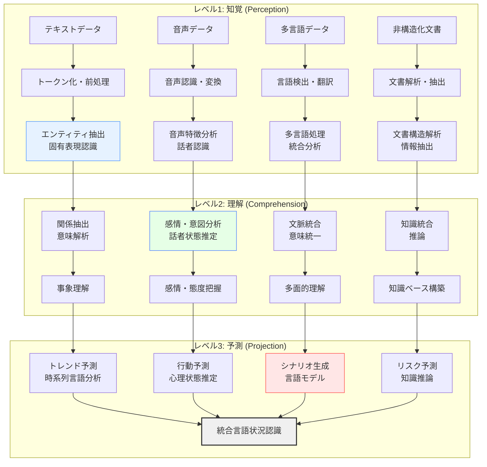

# 自然言語処理による状況認識

!!! info "このページについて"

    このページでは、自然言語処理（NLP: Natural Language Processing）が状況認識（Situational Awareness）に与える革命的影響について詳しく解説します。  
    テキスト・音声データからの情報抽出、感情分析、大規模言語モデルの活用まで、言語データを活用した状況理解の技術を理論と実装の両面から掘り下げます。  
    実践的なTypeScriptコード例により、現実の状況認識システムへの応用を具体的に示します。

## 自然言語処理が変える状況認識の世界

自然言語処理（NLP）は、人間の言語を理解・処理する技術として、状況認識の精度と範囲を大幅に拡張しています。ニュース、SNS、音声通話、報告書など、日々生成される膨大な言語データから状況を把握し、リスクを予測し、意思決定を支援する能力は、従来の数値データ中心の分析を根本から変革しています。

本章では、NLP技術が状況認識をどのように強化しているか、Endsleyモデルとの対応から最新の大規模言語モデル活用まで体系的に解説します。

## NLPによる状況認識の基本フレームワーク

### Endsleyモデルと自然言語処理技術の対応



### NLP技術と状況認識への応用

| NLP技術 | 状況認識への応用 | 主要手法 | 具体例 |
|---|---|---|---|
| **テキスト分類** | 状況カテゴリの自動判別 | BERT、RoBERTa、GPT | ニュース分類、リスクレベル判定 |
| **感情分析** | 世論・市場心理の把握 | Transformer、LSTM | SNS世論分析、顧客満足度測定 |
| **固有表現認識** | 重要な人・場所・事象の抽出 | NER、SpaCy | 事件・事故の当事者特定 |
| **関係抽出** | エンティティ間の関係理解 | 依存構文解析、Graph Neural Networks | 因果関係の発見、影響度分析 |
| **要約生成** | 大量情報の効率的把握 | 抽出型・生成型要約 | 報告書自動要約、状況サマリー |
| **質問応答** | 状況に関する問い合わせ対応 | BERT-QA、GPT | 緊急時の情報検索、専門知識照会 |
| **言語生成** | 状況報告・説明の自動作成 | GPT、T5 | 状況報告書生成、対応指示作成 |

## テキスト分析による状況理解

### 感情分析によるムード・世論把握

社会の感情動向や市場心理を定量的に把握し、状況変化の早期発見につなげます。

??? TypeScript実装例

    この実装例では、複数のソーシャルメディアやニュースサイトからテキストデータを収集し、感情分析を行うシステムを構築しています。リアルタイムでの感情トレンド追跡、異常検知、アラート生成まで含む包括的なシステムです。

    ```typescript
    // 感情分析による状況認識システム
    interface SentimentAnalysisResult {
      sentiment: 'positive' | 'negative' | 'neutral';
      confidence: number;
      emotions: EmotionScores;
      aspectSentiments: AspectSentiment[];
      intensity: number;
    }

    interface EmotionScores {
      joy: number;
      anger: number;
      fear: number;
      sadness: number;
      surprise: number;
      disgust: number;
    }

    interface AspectSentiment {
      aspect: string;
      sentiment: string;
      confidence: number;
    }

    class SentimentBasedSituationMonitor {
      private sentimentAnalyzer: MultiModalSentimentAnalyzer;
      private trendAnalyzer: SentimentTrendAnalyzer;
      private anomalyDetector: SentimentAnomalyDetector;
      private alertSystem: SentimentAlertSystem;
      
      constructor() {
        this.initializeAnalyzers();
      }
      
      private initializeAnalyzers(): void {
        // 複数手法を組み合わせた感情分析エンジン
        this.sentimentAnalyzer = new MultiModalSentimentAnalyzer({
          models: [
            new BERTSentimentModel({ language: 'ja' }),
            new RoBERTaSentimentModel({ language: 'ja' }),
            new LexiconBasedAnalyzer({ 
              lexicon: 'japanese_emotion_lexicon',
              weightingStrategy: 'tf-idf'
            })
          ],
          ensembleStrategy: 'weighted_voting',
          weights: [0.5, 0.3, 0.2]
        });
        
        this.trendAnalyzer = new SentimentTrendAnalyzer({
          windowSize: '1hour',
          trendDetectionThreshold: 0.15,
          seasonalityAdjustment: true
        });
        
        this.anomalyDetector = new SentimentAnomalyDetector({
          method: 'isolation_forest',
          contamination: 0.05
        });
      }
      
      // リアルタイム感情監視
      monitorSentimentStream(
        dataStream: Observable<TextData>
      ): Observable<SentimentSituationUpdate> {
        return dataStream.pipe(
          // バッチ処理用のバッファリング
          bufferTime(30000), // 30秒ごとのバッチ
          
          // 感情分析実行
          mergeMap(async (textBatch) => {
            const sentimentResults = await Promise.all(
              textBatch.map(text => this.analyzeSentiment(text))
            );
            
            return {
              timestamp: new Date(),
              batchSize: textBatch.length,
              sentiments: sentimentResults,
              aggregatedSentiment: this.aggregateSentiments(sentimentResults)
            };
          }),
          
          // トレンド分析
          map(batchResult => ({
            ...batchResult,
            trendAnalysis: this.trendAnalyzer.analyzeTrend(
              batchResult.aggregatedSentiment
            )
          })),
          
          // 異常検知
          map(result => ({
            ...result,
            anomalyScore: this.anomalyDetector.detectAnomaly(
              result.aggregatedSentiment
            )
          })),
          
          // アラート判定
          tap(result => {
            if (this.shouldTriggerAlert(result)) {
              this.alertSystem.triggerAlert(result);
            }
          }),
          
          // エラーハンドリング
          catchError(error => {
            console.error('感情分析エラー:', error);
            return of({
              timestamp: new Date(),
              error: error.message,
              fallbackAnalysis: this.getFallbackAnalysis()
            } as SentimentSituationUpdate);
          })
        );
      }
      
      // 個別テキストの感情分析
      private async analyzeSentiment(textData: TextData): Promise<SentimentAnalysisResult> {
        // 前処理
        const preprocessedText = await this.preprocessText(textData.content);
        
        // 複数モデルでの分析実行
        const modelResults = await this.sentimentAnalyzer.analyze(preprocessedText);
        
        // アスペクトベース感情分析
        const aspectSentiments = await this.analyzeAspectSentiments(
          preprocessedText
        );
        
        // 感情強度の計算
        const intensity = this.calculateEmotionIntensity(modelResults);
        
        return {
          sentiment: modelResults.primarySentiment,
          confidence: modelResults.confidence,
          emotions: modelResults.emotions,
          aspectSentiments: aspectSentiments,
          intensity: intensity
        };
      }
      
      // 感情集約処理
      private aggregateSentiments(
        sentiments: SentimentAnalysisResult[]
      ): AggregatedSentiment {
        // 重み付き平均による集約
        const weights = sentiments.map(s => s.confidence);
        const totalWeight = weights.reduce((sum, w) => sum + w, 0);
        
        const aggregated = {
          overallSentiment: this.calculateWeightedSentiment(sentiments, weights),
          sentimentDistribution: this.calculateSentimentDistribution(sentiments),
          dominantEmotions: this.identifyDominantEmotions(sentiments),
          polarization: this.calculatePolarization(sentiments),
          volatility: this.calculateVolatility(sentiments)
        };
        
        return aggregated;
      }
      
      // 地域・時間別感情分析
      async analyzeSentimentByRegionAndTime(
        timeRange: TimeRange,
        regions: string[]
      ): Promise<SpatioTemporalSentimentAnalysis> {
        const analyses = await Promise.all(
          regions.map(async (region) => {
            const regionalData = await this.getRegionalTextData(region, timeRange);
            const sentimentTimeSeries = await this.analyzeTimeSeriesSentiment(
              regionalData
            );
            
            return {
              region: region,
              timeRange: timeRange,
              sentimentTimeSeries: sentimentTimeSeries,
              keyEvents: this.identifyKeyEvents(sentimentTimeSeries),
              regionalTrends: this.analyzeRegionalTrends(sentimentTimeSeries)
            };
          })
        );
        
        // 地域間比較分析
        const crossRegionalAnalysis = this.compareRegionalSentiments(analyses);
        
        return {
          regionalAnalyses: analyses,
          crossRegionalComparison: crossRegionalAnalysis,
          globalTrends: this.identifyGlobalTrends(analyses)
        };
      }
      
      // アラート条件判定
      private shouldTriggerAlert(result: SentimentSituationUpdate): boolean {
        const conditions = [
          // 感情の急激な変化
          result.trendAnalysis.changeRate > 0.3,
          // 異常スコアの閾値超過
          result.anomalyScore > 0.8,
          // ネガティブ感情の急増
          result.aggregatedSentiment.overallSentiment < -0.7,
          // 感情の極端な二極化
          result.aggregatedSentiment.polarization > 0.9
        ];
        
        return conditions.some(condition => condition);
      }
    }

    // 結果インターフェース
    interface SentimentSituationUpdate {
      timestamp: Date;
      batchSize?: number;
      sentiments?: SentimentAnalysisResult[];
      aggregatedSentiment?: AggregatedSentiment;
      trendAnalysis?: TrendAnalysis;
      anomalyScore?: number;
      error?: string;
      fallbackAnalysis?: any;
    }

    interface AggregatedSentiment {
      overallSentiment: number;
      sentimentDistribution: SentimentDistribution;
      dominantEmotions: string[];
      polarization: number;
      volatility: number;
    }
    ```

### 固有表現認識による重要情報抽出

テキストから人名、組織名、場所、日時などの重要な情報を自動抽出し、状況の構造化理解を支援します。

=== "エンティティ抽出"
    - **人物**: 関係者、責任者、被害者の特定
    - **組織**: 関連企業、政府機関、団体の識別
    - **場所**: 事件・事故の発生地点、影響範囲
    - **時間**: 発生時刻、期間、スケジュール

=== "関係抽出"
    - **因果関係**: 原因と結果の関連性分析
    - **所属関係**: 人物と組織の関係
    - **空間関係**: 地理的な位置関係
    - **時系列関係**: 事象の前後関係

## 音声処理による状況認識

### リアルタイム音声分析

音声データから話者の感情状態、ストレスレベル、緊急度を推定し、状況の深層理解を実現します。

??? TypeScript実装例

    この実装では、リアルタイム音声ストリームから感情・ストレス・緊急度を分析するシステムです。音声認識、話者識別、感情分析を統合し、緊急時対応システムや顧客サービス向上に活用できます。WebRTCを使った実装で実際のブラウザ環境での動作を想定しています。

    ```typescript
    // リアルタイム音声分析による状況認識システム
    interface AudioAnalysisResult {
      transcript: string;
      speakerInfo: SpeakerInfo;
      emotionAnalysis: AudioEmotionAnalysis;
      stressLevel: number;
      urgencyScore: number;
      voiceQuality: VoiceQualityMetrics;
    }

    interface SpeakerInfo {
      id: string;
      confidence: number;
      gender: 'male' | 'female' | 'unknown';
      estimatedAge: number;
      voicePrint: number[];
    }

    interface AudioEmotionAnalysis {
      primaryEmotion: string;
      emotionIntensity: number;
      emotionConfidence: number;
      detailedEmotions: { [emotion: string]: number };
      arousal: number; // 覚醒度
      valence: number; // 感情価
    }

    interface VoiceQualityMetrics {
      pitch: number;
      volume: number;
      speechRate: number;
      pauseFrequency: number;
      jitter: number; // 音声の揺らぎ
      shimmer: number; // 振幅の揺らぎ
    }

    class RealTimeAudioSituationAnalyzer {
      private audioContext: AudioContext;
      private speechRecognizer: SpeechRecognizer;
      private speakerIdentifier: SpeakerIdentifier;
      private emotionAnalyzer: AudioEmotionAnalyzer;
      private stressDetector: StressDetector;
      private urgencyClassifier: UrgencyClassifier;
      
      constructor() {
        this.initializeAudioProcessing();
      }
      
      private initializeAudioProcessing(): void {
        // ブラウザ音声処理の初期化
        this.audioContext = new (window.AudioContext || window.webkitAudioContext)();
        
        // 音声認識エンジン
        this.speechRecognizer = new AdvancedSpeechRecognizer({
          language: 'ja-JP',
          continuous: true,
          interimResults: true,
          confidence: true
        });
        
        // 話者識別システム
        this.speakerIdentifier = new DeepSpeakerIdentifier({
          embeddingSize: 256,
          threshold: 0.85
        });
        
        // 音声感情分析
        this.emotionAnalyzer = new AudioEmotionAnalyzer({
          model: 'wav2vec2_emotion',
          frameSize: 1024,
          hopLength: 512
        });
        
        // ストレス検出器
        this.stressDetector = new VoiceStressAnalyzer({
          features: ['fundamental_frequency', 'jitter', 'shimmer', 'mfcc'],
          model: 'svm_stress_classifier'
        });
      }
      
      // リアルタイム音声ストリーム分析
      async analyzeAudioStream(
        audioStream: MediaStream
      ): Promise<Observable<AudioSituationUpdate>> {
        return new Observable<AudioSituationUpdate>(observer => {
          const mediaRecorder = new MediaRecorder(audioStream, {
            mimeType: 'audio/webm;codecs=opus'
          });
          
          const audioChunks: Blob[] = [];
          
          // 音声データの収集
          mediaRecorder.ondataavailable = async (event) => {
            if (event.data.size > 0) {
              audioChunks.push(event.data);
              
              try {
                // 音声分析実行
                const analysisResult = await this.analyzeAudioChunk(event.data);
                
                // 状況評価
                const situationAssessment = this.assessSituation(analysisResult);
                
                observer.next({
                  timestamp: new Date(),
                  audioAnalysis: analysisResult,
                  situationAssessment: situationAssessment,
                  alerts: this.generateAlerts(analysisResult, situationAssessment)
                });
              } catch (error) {
                observer.error(error);
              }
            }
          };
          
          // 定期的な音声キャプチャ（1秒間隔）
          mediaRecorder.start(1000);
          
          return () => {
            mediaRecorder.stop();
            audioStream.getTracks().forEach(track => track.stop());
          };
        });
      }
      
      // 音声チャンクの分析
      private async analyzeAudioChunk(audioBlob: Blob): Promise<AudioAnalysisResult> {
        // 音声バッファの取得
        const audioBuffer = await this.blobToArrayBuffer(audioBlob);
        const audioData = await this.audioContext.decodeAudioData(audioBuffer);
        
        // 並行して各種分析を実行
        const [
          transcript,
          speakerInfo,
          emotionAnalysis,
          stressLevel,
          voiceQuality
        ] = await Promise.all([
          this.speechRecognizer.recognize(audioBlob),
          this.speakerIdentifier.identify(audioData),
          this.emotionAnalyzer.analyze(audioData),
          this.stressDetector.detectStress(audioData),
          this.extractVoiceQuality(audioData)
        ]);
        
        // 緊急度スコアの計算
        const urgencyScore = this.calculateUrgencyScore({
          transcript,
          emotionAnalysis,
          stressLevel,
          voiceQuality
        });
        
        return {
          transcript: transcript.text,
          speakerInfo,
          emotionAnalysis,
          stressLevel,
          urgencyScore,
          voiceQuality
        };
      }
      
      // 状況評価
      private assessSituation(analysis: AudioAnalysisResult): SituationAssessment {
        // キーワードベースの状況分類
        const situationKeywords = this.extractSituationKeywords(analysis.transcript);
        
        // 音声特徴からの状況推定
        const audioSituation = this.inferSituationFromAudio(analysis);
        
        // 総合的な状況評価
        const overallAssessment = {
          situationType: this.classifySituationType(situationKeywords, audioSituation),
          severity: this.calculateSeverity(analysis),
          confidence: this.calculateConfidence(analysis),
          recommendations: this.generateRecommendations(analysis)
        };
        
        return overallAssessment;
      }
      
      // 緊急度計算
      private calculateUrgencyScore(analysisData: {
        transcript: TranscriptResult;
        emotionAnalysis: AudioEmotionAnalysis;
        stressLevel: number;
        voiceQuality: VoiceQualityMetrics;
      }): number {
        let urgencyScore = 0;
        
        // テキスト内容からの緊急度
        const urgentKeywords = ['助けて', '緊急', '危険', '事故', '怪我'];
        const transcriptUrgency = urgentKeywords.some(keyword => 
          analysisData.transcript.text.includes(keyword)
        ) ? 0.8 : 0;
        
        // 感情からの緊急度
        const emotionUrgency = Math.max(
          analysisData.emotionAnalysis.detailedEmotions['fear'] || 0,
          analysisData.emotionAnalysis.detailedEmotions['anger'] || 0
        );
        
        // ストレスレベルからの緊急度
        const stressUrgency = Math.min(analysisData.stressLevel, 1.0);
        
        // 音声品質からの緊急度（話速、音量変化等）
        const voiceUrgency = this.calculateVoiceUrgency(analysisData.voiceQuality);
        
        // 重み付き平均
        urgencyScore = (
          transcriptUrgency * 0.4 +
          emotionUrgency * 0.3 +
          stressUrgency * 0.2 +
          voiceUrgency * 0.1
        );
        
        return Math.min(urgencyScore, 1.0);
      }
      
      // 会話分析（複数話者対応）
      async analyzeConversation(
        audioStream: MediaStream,
        duration: number
      ): Promise<ConversationAnalysis> {
        const conversationData: AudioAnalysisResult[] = [];
        
        // 指定時間の音声データ収集
        const analysisStream = await this.analyzeAudioStream(audioStream);
        
        return new Promise((resolve) => {
          const subscription = analysisStream.subscribe({
            next: (update) => {
              conversationData.push(update.audioAnalysis);
            },
            complete: () => {
              const analysis = this.analyzeConversationPatterns(conversationData);
              resolve(analysis);
            }
          });
          
          // 指定時間後に分析終了
          setTimeout(() => {
            subscription.unsubscribe();
          }, duration);
        });
      }
      
      // 会話パターン分析
      private analyzeConversationPatterns(
        conversationData: AudioAnalysisResult[]
      ): ConversationAnalysis {
        // 話者変化の検出
        const speakerChanges = this.detectSpeakerChanges(conversationData);
        
        // 感情変化の追跡
        const emotionFlow = this.trackEmotionFlow(conversationData);
        
        // 会話の質的分析
        const conversationQuality = this.assessConversationQuality(conversationData);
        
        // 重要な発言の抽出
        const keyMoments = this.identifyKeyMoments(conversationData);
        
        return {
          duration: conversationData.length,
          speakerChanges,
          emotionFlow,
          conversationQuality,
          keyMoments,
          summary: this.generateConversationSummary(conversationData)
        };
      }
    }

    // 結果インターフェース
    interface AudioSituationUpdate {
      timestamp: Date;
      audioAnalysis: AudioAnalysisResult;
      situationAssessment: SituationAssessment;
      alerts: Alert[];
    }

    interface ConversationAnalysis {
      duration: number;
      speakerChanges: SpeakerChange[];
      emotionFlow: EmotionTimeline[];
      conversationQuality: ConversationQuality;
      keyMoments: KeyMoment[];
      summary: string;
    }
    ```

## 大規模言語モデル（LLM）の活用

### GPT・BERT系モデルによる高度言語理解

最新の大規模言語モデルを活用して、複雑な文脈理解と状況推論を実現します。

=== "文脈理解"
    - **長文解析**: 長い文書の要点抽出と構造理解
    - **暗黙的意味**: 明示されていない含意の推定
    - **文脈依存**: 前後の文脈を考慮した意味解釈

=== "状況推論"
    - **因果推論**: 原因と結果の論理的関係分析
    - **意図推定**: 発言者・執筆者の意図理解
    - **予測生成**: 状況の展開シナリオ生成

### マルチモーダル言語処理

テキスト、画像、音声を統合した包括的な状況理解システムを構築します。

??? TypeScript実装例

    この実装では、GPTやBERTなどの大規模言語モデルを活用し、テキスト・画像・音声を統合して分析するマルチモーダルシステムです。複雑な状況推論、シナリオ生成、質問応答機能を実装し、高度な状況認識を実現します。

    ```typescript
    // 大規模言語モデルによる統合状況理解システム
    interface MultiModalInput {
      text?: string;
      image?: ImageData;
      audio?: AudioData;
      structured?: StructuredData;
      metadata: InputMetadata;
    }

    interface SituationUnderstandingResult {
      contextualAnalysis: ContextualAnalysis;
      situationInference: SituationInference;
      scenarioGeneration: GeneratedScenario[];
      riskAssessment: RiskAssessment;
      actionRecommendations: ActionRecommendation[];
      confidence: number;
    }

    interface ContextualAnalysis {
      mainEntities: Entity[];
      relationships: Relationship[];
      temporalSequence: TimelineEvent[];
      spatialContext: SpatialInfo;
      emotionalContext: EmotionalContext;
    }

    class LLMSituationUnderstandingSystem {
      private textLLM: LargeLanguageModel;
      private multiModalLLM: MultiModalLanguageModel;
      private reasoningEngine: CausalReasoningEngine;
      private scenarioGenerator: ScenarioGenerator;
      private knowledgeBase: DynamicKnowledgeBase;
      
      constructor() {
        this.initializeLLMComponents();
      }
      
      private initializeLLMComponents(): void {
        // GPT-4系モデルの初期化
        this.textLLM = new OpenAIGPTModel({
          model: 'gpt-4-turbo',
          temperature: 0.2,
          maxTokens: 4000,
          systemPrompt: this.createSituationAnalysisPrompt()
        });
        
        // マルチモーダルモデル
        this.multiModalLLM = new GPT4VisionModel({
          model: 'gpt-4-vision-preview',
          maxTokens: 2000
        });
        
        // 因果推論エンジン
        this.reasoningEngine = new CausalReasoningEngine({
          knowledgeGraph: 'situation_causality_graph',
          inferenceMethod: 'probabilistic_reasoning'
        });
        
        // シナリオ生成器
        this.scenarioGenerator = new AdvancedScenarioGenerator({
          baseModel: this.textLLM,
          creativityLevel: 0.3,
          scenarios: ['best_case', 'worst_case', 'most_likely']
        });
      }
      
      // 統合状況理解の実行
      async understandSituation(
        inputs: MultiModalInput[]
      ): Promise<SituationUnderstandingResult> {
        // 入力データの前処理と統合
        const integratedContext = await this.integrateMultiModalInputs(inputs);
        
        // 段階的分析の実行
        const [
          contextualAnalysis,
          situationInference,
          scenarioGeneration,
          riskAssessment
        ] = await Promise.all([
          this.performContextualAnalysis(integratedContext),
          this.performSituationInference(integratedContext),
          this.generateScenarios(integratedContext),
          this.assessRisks(integratedContext)
        ]);
        
        // 行動推奨の生成
        const actionRecommendations = await this.generateActionRecommendations({
          contextualAnalysis,
          situationInference,
          riskAssessment
        });
        
        // 信頼度計算
        const confidence = this.calculateConfidence({
          contextualAnalysis,
          situationInference,
          inputs
        });
        
        return {
          contextualAnalysis,
          situationInference,
          scenarioGeneration,
          riskAssessment,
          actionRecommendations,
          confidence
        };
      }
      
      // マルチモーダル入力の統合
      private async integrateMultiModalInputs(
        inputs: MultiModalInput[]
      ): Promise<IntegratedContext> {
        const integrationTasks = inputs.map(async (input) => {
          let analysis: any = {};
          
          // テキスト分析
          if (input.text) {
            analysis.textAnalysis = await this.analyzeText(input.text);
          }
          
          // 画像分析
          if (input.image) {
            analysis.imageAnalysis = await this.analyzeImage(input.image);
          }
          
          // 音声分析
          if (input.audio) {
            analysis.audioAnalysis = await this.analyzeAudio(input.audio);
          }
          
          return {
            inputId: input.metadata.id,
            timestamp: input.metadata.timestamp,
            source: input.metadata.source,
            analysis
          };
        });
        
        const individualAnalyses = await Promise.all(integrationTasks);
        
        // クロスモーダル統合
        const crossModalAnalysis = await this.performCrossModalAnalysis(
          individualAnalyses
        );
        
        return {
          individualAnalyses,
          crossModalAnalysis,
          temporalSequence: this.constructTemporalSequence(individualAnalyses),
          consistencyCheck: this.checkCrossModalConsistency(individualAnalyses)
        };
      }
      
      // 文脈分析
      private async performContextualAnalysis(
        context: IntegratedContext
      ): Promise<ContextualAnalysis> {
        // LLMプロンプトの構築
        const analysisPrompt = this.buildContextAnalysisPrompt(context);
        
        // GPT-4による高度文脈分析
        const llmResponse = await this.textLLM.generate(analysisPrompt, {
          responseFormat: 'structured_json',
          schema: this.getContextAnalysisSchema()
        });
        
        // 構造化された結果の解析
        const structuredResult = JSON.parse(llmResponse.content);
        
        // エンティティと関係の抽出・拡張
        const enhancedEntities = await this.enhanceEntities(
          structuredResult.entities
        );
        
        const enhancedRelationships = await this.enhanceRelationships(
          structuredResult.relationships
        );
        
        return {
          mainEntities: enhancedEntities,
          relationships: enhancedRelationships,
          temporalSequence: structuredResult.timeline,
          spatialContext: structuredResult.spatial,
          emotionalContext: structuredResult.emotional
        };
      }
      
      // 状況推論
      private async performSituationInference(
        context: IntegratedContext
      ): Promise<SituationInference> {
        // 因果推論の実行
        const causalAnalysis = await this.reasoningEngine.analyzeCausality(context);
        
        // 状況分類
        const situationClassification = await this.classifySituation(context);
        
        // 意図・目的の推定
        const intentAnalysis = await this.analyzeIntent(context);
        
        // 影響度分析
        const impactAnalysis = await this.analyzeImpact(context);
        
        return {
          situationType: situationClassification.primaryType,
          subTypes: situationClassification.subTypes,
          causalChain: causalAnalysis.causalChain,
          rootCauses: causalAnalysis.rootCauses,
          keyActors: intentAnalysis.keyActors,
          objectives: intentAnalysis.objectives,
          potentialImpacts: impactAnalysis.impacts,
          uncertainty: this.calculateUncertainty(causalAnalysis)
        };
      }
      
      // インタラクティブ質問応答
      async answerSituationQuestion(
        situation: SituationUnderstandingResult,
        question: string
      ): Promise<SituationQAResult> {
        // 質問の分析
        const questionAnalysis = await this.analyzeQuestion(question);
        
        // 関連情報の抽出
        const relevantContext = this.extractRelevantContext(
          situation,
          questionAnalysis
        );
        
        // LLMによる回答生成
        const answerPrompt = this.buildQAPrompt(
          question,
          relevantContext,
          questionAnalysis
        );
        
        const response = await this.textLLM.generate(answerPrompt, {
          temperature: 0.1,
          maxTokens: 1000
        });
        
        // 回答の検証と補強
        const verifiedAnswer = await this.verifyAnswer(
          response.content,
          relevantContext
        );
        
        return {
          question: question,
          answer: verifiedAnswer.answer,
          confidence: verifiedAnswer.confidence,
          sources: relevantContext.sources,
          followUpQuestions: this.generateFollowUpQuestions(
            questionAnalysis,
            verifiedAnswer
          )
        };
      }
      
      // 継続的状況更新
      async updateSituationUnderstanding(
        currentSituation: SituationUnderstandingResult,
        newInputs: MultiModalInput[]
      ): Promise<SituationUpdateResult> {
        // 新規情報の分析
        const newAnalysis = await this.understandSituation(newInputs);
        
        // 既存理解との統合
        const integratedUnderstanding = await this.integrateSituationUpdates(
          currentSituation,
          newAnalysis
        );
        
        // 変化の検出
        const changes = this.detectSituationChanges(
          currentSituation,
          integratedUnderstanding
        );
        
        // 更新の重要度評価
        const updateSignificance = this.assessUpdateSignificance(changes);
        
        return {
          updatedSituation: integratedUnderstanding,
          changes: changes,
          significance: updateSignificance,
          recommendations: this.generateUpdateRecommendations(changes)
        };
      }
      
      // システムプロンプトの構築
      private createSituationAnalysisPrompt(): string {
        return `
        あなたは高度な状況分析AIアシスタントです。以下の能力を持っています。

        1. 複雑な状況の文脈理解と要素分析
        2. 因果関係の特定と推論
        3. リスク評価と将来予測
        4. 実用的な行動提案

        入力された情報を基に、以下の観点から状況を分析してください。

        - 主要な要素と関係性
        - 時系列での変化
        - 潜在的なリスクと機会
        - 推奨される対応策

        分析は論理的で客観的に、根拠とともに提示してください。
        `.trim();
      }
    }

    // 結果インターフェース
    interface SituationInference {
      situationType: string;
      subTypes: string[];
      causalChain: CausalLink[];
      rootCauses: Cause[];
      keyActors: Actor[];
      objectives: Objective[];
      potentialImpacts: Impact[];
      uncertainty: number;
    }

    interface SituationQAResult {
      question: string;
      answer: string;
      confidence: number;
      sources: Source[];
      followUpQuestions: string[];
    }
    ```

## 多言語・文化的文脈の処理

### グローバル状況認識

多言語環境での状況認識において、言語・文化的な違いを考慮した分析を行います。

=== "多言語処理"
    - **言語検出**: 自動言語識別と適切なモデル選択
    - **機械翻訳**: 高精度翻訳による言語統合
    - **言語固有分析**: 各言語の特性を考慮した分析

=== "文化的文脈"
    - **文化的差異**: 表現方法や価値観の違いを考慮
    - **地域特性**: 地域固有の表現や慣習の理解
    - **時代的変化**: 言語使用の時代的変遷への対応

## 実装上の重要考慮事項

### データプライバシーとセキュリティ

| 課題 | リスク | 対策手法 | 実装アプローチ |
|---|---|---|---|
| **個人情報保護** | プライバシー侵害 | データ匿名化、差分プライバシー | 自動マスキング、k-匿名性 |
| **機密情報漏洩** | 企業秘密の流出 | アクセス制御、暗号化 | エンドツーエンド暗号化 |
| **バイアス増幅** | 社会的偏見の拡大 | 公平性監査、多様性確保 | バイアス検出アルゴリズム |
| **悪用防止** | 偽情報生成、操作 | 真正性検証、使用制限 | デジタル署名、監査ログ |

### モデル性能と効率性

=== "精度向上"
    - **ドメイン適応**: 特定分野向けの特化調整
    - **アンサンブル学習**: 複数モデルの組み合わせ
    - **継続学習**: 新データによる段階的改善

=== "効率性確保"
    - **モデル軽量化**: 量子化、プルーニング、知識蒸留
    - **並列処理**: GPU/TPU活用による高速化
    - **キャッシュ戦略**: 頻出パターンの事前計算

## 産業別応用事例

### 金融・投資分野

=== "市場分析"
    - **ニュース影響分析**: 経済ニュースの市場への影響予測
    - **SNS感情分析**: 投資家心理の定量化
    - **決算書解析**: 財務報告書の自動読解と評価

=== "リスク管理"
    - **詐欺検知**: 不審な取引パターンの発見
    - **信用評価**: テキスト情報を含む多面的評価
    - **規制遵守**: 法規制の自動監視と遵守確認

### 医療・ヘルスケア分野

=== "診断支援"
    - **症状記録分析**: 患者の主訴から症状パターン抽出
    - **医療文献検索**: 関連研究の自動検索・要約
    - **薬剤相互作用**: 処方薬の安全性チェック

=== "患者モニタリング"
    - **精神状態評価**: 発話内容からのメンタルヘルス評価
    - **服薬指導**: 個別化された服薬説明の生成
    - **健康相談**: AI健康アドバイザーシステム

### 製造・産業分野

=== "品質管理"
    - **不良報告分析**: 製品不良の原因分析と対策立案
    - **保守指示書生成**: 設備メンテナンス手順の自動作成
    - **安全マニュアル**: 作業安全指示の動的生成

=== "顧客サービス"
    - **問い合わせ対応**: カスタマーサポートの自動化
    - **製品マニュアル**: 使用方法の個別化説明
    - **トラブルシューティング**: 問題解決手順の提示

## 未来展望と技術トレンド

### 短期的展望（1-3年）

- **多言語LLMの精度向上**: 日本語等の非英語圏での性能改善
- **リアルタイム処理の最適化**: 低遅延での高精度言語処理
- **プライバシー保護技術**: 連合学習、差分プライバシーの実用化

### 中期的展望（3-5年）

- **マルチモーダル統合**: テキスト・画像・音声の完全統合
- **因果推論の高度化**: より複雑な因果関係の自動発見
- **個人適応**: ユーザー固有の言語パターンへの適応

### 長期的展望（5-10年以上）

- **汎用言語AI**: 人間レベルの言語理解・生成能力
- **リアルタイム多言語翻訳**: 完璧な同時通訳システム
- **創発的言語理解**: 新しい概念・表現の自動学習

## まとめ：NLPによる状況認識の変革

自然言語処理は、人間の言語という最も豊富な情報源から状況を理解する能力を大幅に拡張し、これまで数値化困難だった複雑な状況の定量的把握を可能にしています。

**成功の鍵となる要素：**

1. **多層的言語分析**: 語彙→文法→意味→文脈の段階的理解
2. **マルチモーダル統合**: テキスト・音声・画像の総合的処理
3. **文化的適応**: 言語・文化圏に特化した理解メカニズム
4. **プライバシー配慮**: 安全で倫理的な言語データ活用
5. **継続的改善**: 新しい表現や概念への適応学習

これらを適切に実装することで、金融、医療、製造業など多様な分野で情報理解と意思決定の質を飛躍的に向上させることができます。

自然言語処理による状況認識は急速に進歩している分野であり、本章の技術と実装例が、読者の皆様の実践的システム構築に役立てば幸いです。

## 参考文献

1. Jurafsky, D., & Martin, J. H. (2020). Speech and Language Processing (3rd ed.). Pearson.
2. Rogers, A., Kovaleva, O., & Rumshisky, A. (2020). A Primer on Neural Network Models for Natural Language Processing. Journal of Artificial Intelligence Research, 57, 615-686.
3. Devlin, J., Chang, M. W., Lee, K., & Toutanova, K. (2018). BERT: Pre-training of Deep Bidirectional Transformers for Language Understanding. arXiv preprint arXiv:1810.04805.
4. Brown, T., Mann, B., Ryder, N., et al. (2020). Language Models are Few-Shot Learners. Advances in Neural Information Processing Systems, 33, 1877-1901.
5. Liu, P., Yuan, W., Fu, J., et al. (2023). Pre-train, Prompt, and Predict: A Systematic Survey of Prompting Methods in Natural Language Processing. ACM Computing Surveys, 55(9), 1-35.
6. 奥村学, 乾健太郎. (2021). 自然言語処理の基礎. コロナ社.
7. 荒木健治. (2020). 深層学習による自然言語処理入門. オーム社.
8. 坪井祐太, 海野裕也, 鈴木潤. (2021). 深層学習による自然言語処理. 講談社.
9. Manning, C. D., & Schütze, H. (1999). Foundations of Statistical Natural Language Processing. MIT Press.
10. Goldberg, Y. (2017). Neural Network Methods for Natural Language Processing. Morgan & Claypool Publishers.