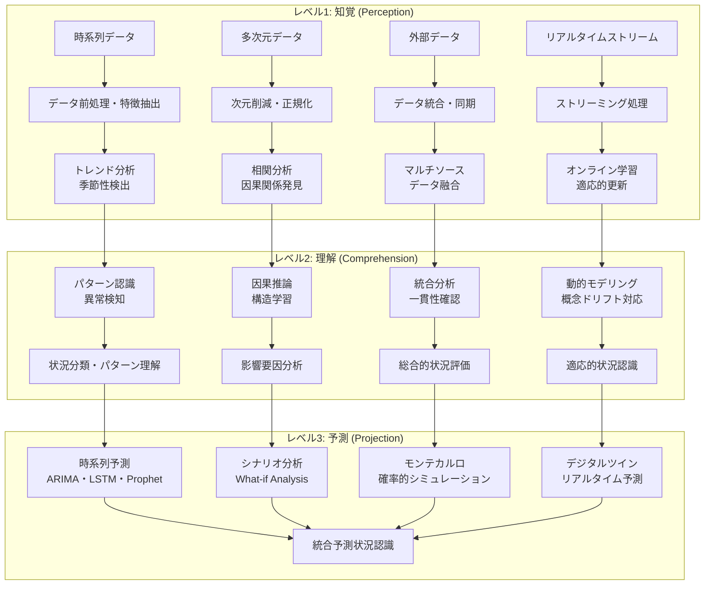

# 予測分析・シミュレーションによる状況認識

!!! info "このページについて"

    このページでは、予測分析とシミュレーション技術が状況認識（Situational Awareness）にもたらす革命的変化について詳しく解説します。  
    時系列予測、モンテカルロシミュレーション、デジタルツイン、シナリオ分析から、最新の機械学習予測技術まで、将来の状況を予測・評価する技術を理論と実装の両面から掘り下げます。  
    実践的なTypeScriptコード例により、リアルタイム予測システムとシミュレーション環境の構築方法を具体的に示します。

## 予測分析が変える状況認識の世界

予測分析とシミュレーション技術は、現在の状況から将来を見通す能力を大幅に強化し、状況認識の第3レベル「予測（Projection）」を根本から変革しています。過去のデータパターンから未来を予測し、複数のシナリオを検討し、リスクを定量化する能力は、プロアクティブな意思決定と予防的対策を可能にしています。

本章では、予測分析・シミュレーション技術が状況認識をどのように強化しているか、Endsleyモデルとの対応から最新の予測技術まで体系的に解説します。

## 予測分析による状況認識の基本フレームワーク

### Endsleyモデルと予測分析技術の対応



### 予測分析技術と状況認識への応用

| 予測分析技術 | 状況認識への応用 | 主要手法 | 具体例 |
|---|---|---|---|
| **時系列予測** | 将来状況の定量的予測 | ARIMA、LSTM、Prophet、Transformer | 需要予測、リスク予測、性能予測 |
| **シナリオ分析** | 複数の可能な未来の検討 | Monte Carlo、Decision Trees | 戦略企画、リスク管理、投資計画 |
| **因果推論** | 介入効果の予測 | 構造方程式、因果グラフ | 政策効果予測、治療効果推定 |
| **異常予測** | 正常からの逸脱予測 | Isolation Forest、LSTM-AE | 設備故障予測、セキュリティ侵害予測 |
| **最適化** | 最良の行動選択 | 線形計画、遺伝的アルゴリズム | リソース配分、スケジュール最適化 |
| **強化学習** | 動的環境での最適戦略学習 | Q-Learning、Policy Gradient | 自動取引、リアルタイム制御 |
| **デジタルツイン** | 現実世界のリアルタイム模擬 | 物理モデル+ML | 製造プロセス、都市シミュレーション |

## 時系列予測による将来状況認識

### 高度時系列予測システム

複数の予測モデルを統合し、不確実性を考慮した堅牢な将来予測を実現します。

??? TypeScript実装例

    この実装では、複数の時系列予測モデル（ARIMA、LSTM、Prophet、Transformer）を統合したアンサンブル予測システムです。不確実性の定量化、異常検知、リアルタイム更新機能を含む包括的な時系列予測システムです。

    ```typescript
    // 統合時系列予測システム
    interface TimeSeriesPredictionResult {
      predictions: PredictionPoint[];
      confidence: ConfidenceInterval[];
      uncertainty: UncertaintyMetrics;
      modelPerformance: ModelPerformanceMetrics;
      anomalies: TimeSeriesAnomaly[];
      explanation: PredictionExplanation;
    }

    interface PredictionPoint {
      timestamp: Date;
      value: number;
      confidence: number;
      contributingFactors: Factor[];
    }

    interface ConfidenceInterval {
      timestamp: Date;
      lower: number;
      upper: number;
      confidence: number; // 95%, 99% etc.
    }

    interface UncertaintyMetrics {
      aleatoric: number; // データの不確実性
      epistemic: number; // モデルの不確実性
      total: number;
      sources: UncertaintySource[];
    }

    class AdvancedTimeSeriesPredictionSystem {
      private arimaModel: ARIMAModel;
      private lstmModel: LSTMTimeSeriesModel;
      private prophetModel: ProphetModel;
      private transformerModel: TimeSeriesTransformer;
      private ensembleModel: EnsembleTimeSeriesModel;
      private anomalyDetector: TimeSeriesAnomalyDetector;
      private uncertaintyEstimator: UncertaintyQuantifier;
      
      constructor() {
        this.initializePredictionModels();
      }
      
      private initializePredictionModels(): void {
        // ARIMA モデル（統計的手法）
        this.arimaModel = new ARIMAModel({
          autoOrder: true,
          seasonalOrder: [1, 1, 1, 12], // 季節性対応
          informationCriterion: 'aic'
        });
        
        // LSTM による深層学習予測
        this.lstmModel = new LSTMTimeSeriesModel({
          sequenceLength: 60,
          features: ['value', 'trend', 'seasonal', 'external'],
          layers: [64, 32, 16],
          dropout: 0.2,
          recurrentDropout: 0.2
        });
        
        // Facebook Prophet（トレンド+季節性）
        this.prophetModel = new ProphetModel({
          growthType: 'logistic',
          seasonalityMode: 'multiplicative',
          holidays: true,
          changepoints: 'auto'
        });
        
        // Transformer（Attention機構）
        this.transformerModel = new TimeSeriesTransformer({
          sequenceLength: 96,
          predictionLength: 24,
          hiddenSize: 256,
          numHeads: 8,
          numLayers: 6
        });
        
        // アンサンブルモデル
        this.ensembleModel = new EnsembleTimeSeriesModel({
          baseModels: [
            { model: this.arimaModel, weight: 0.25 },
            { model: this.lstmModel, weight: 0.35 },
            { model: this.prophetModel, weight: 0.25 },
            { model: this.transformerModel, weight: 0.15 }
          ],
          metaLearner: new LinearRegression(),
          stackingEnabled: true
        });
        
        // 異常検知
        this.anomalyDetector = new TimeSeriesAnomalyDetector({
          methods: ['isolation_forest', 'lstm_autoencoder', 'statistical'],
          sensitivity: 0.95,
          adaptiveThreshold: true
        });
        
        // 不確実性定量化
        this.uncertaintyEstimator = new BayesianUncertaintyQuantifier({
          mcSamples: 1000,
          conformalPrediction: true,
          quantileRegression: true
        });
      }
      
      // 包括的時系列予測の実行
      async predictTimeSeries(
        historicalData: TimeSeriesData[],
        predictionHorizon: number,
        externalFactors?: ExternalFactors[]
      ): Promise<TimeSeriesPredictionResult> {
        // データ前処理と特徴抽出
        const preprocessedData = await this.preprocessTimeSeriesData(
          historicalData,
          externalFactors
        );
        
        // 複数モデルでの予測実行
        const individualPredictions = await Promise.all([
          this.arimaModel.predict(preprocessedData, predictionHorizon),
          this.lstmModel.predict(preprocessedData, predictionHorizon),
          this.prophetModel.predict(preprocessedData, predictionHorizon),
          this.transformerModel.predict(preprocessedData, predictionHorizon)
        ]);
        
        // アンサンブル予測
        const ensemblePrediction = await this.ensembleModel.predict(
          preprocessedData,
          individualPredictions,
          predictionHorizon
        );
        
        // 不確実性の定量化
        const uncertaintyMetrics = await this.uncertaintyEstimator.quantify(
          ensemblePrediction,
          individualPredictions,
          preprocessedData
        );
        
        // 信頼区間の計算
        const confidenceIntervals = this.calculateConfidenceIntervals(
          ensemblePrediction,
          uncertaintyMetrics
        );
        
        // 異常検知
        const anomalies = await this.anomalyDetector.detectAnomalies(
          historicalData,
          ensemblePrediction
        );
        
        // 予測説明の生成
        const explanation = await this.generatePredictionExplanation(
          ensemblePrediction,
          individualPredictions,
          preprocessedData
        );
        
        // モデル性能評価
        const modelPerformance = await this.evaluateModelPerformance(
          individualPredictions,
          ensemblePrediction
        );
        
        return {
          predictions: ensemblePrediction.points,
          confidence: confidenceIntervals,
          uncertainty: uncertaintyMetrics,
          modelPerformance: modelPerformance,
          anomalies: anomalies,
          explanation: explanation
        };
      }
      
      // リアルタイム予測更新
      updatePredictionsRealTime(
        dataStream: Observable<TimeSeriesDataPoint>
      ): Observable<RealtimePredictionUpdate> {
        return dataStream.pipe(
          // データバッファリング
          bufferTime(60000), // 1分間のバッファ
          filter(buffer => buffer.length > 0),
          
          // 増分学習
          concatMap(async (newDataPoints) => {
            // 新データでのモデル更新
            await this.updateModelsIncremental(newDataPoints);
            
            // 予測の再実行
            const updatedPrediction = await this.predictTimeSeries(
              this.getRecentHistoricalData(1000), // 直近1000点
              24 // 24時間先
            );
            
            // 変化の検出
            const changeDetection = this.detectPredictionChanges(
              this.previousPrediction,
              updatedPrediction
            );
            
            this.previousPrediction = updatedPrediction;
            
            return {
              timestamp: new Date(),
              updatedPrediction: updatedPrediction,
              changeDetection: changeDetection,
              modelDrift: this.assessModelDrift(newDataPoints)
            };
          }),
          
          // エラーハンドリング
          catchError(error => {
            console.error('リアルタイム予測更新エラー:', error);
            return of({
              timestamp: new Date(),
              error: error.message,
              fallbackPrediction: this.getFallbackPrediction()
            } as RealtimePredictionUpdate);
          }),
          
          share()
        );
      }
      
      // シナリオベース予測
      async generateScenarioPredictions(
        baseData: TimeSeriesData[],
        scenarios: Scenario[]
      ): Promise<ScenarioPredictionResult[]> {
        const scenarioResults = await Promise.all(
          scenarios.map(async (scenario) => {
            // シナリオ固有の外部要因を適用
            const modifiedData = this.applyScenarioFactors(baseData, scenario);
            
            // 各シナリオでの予測実行
            const prediction = await this.predictTimeSeries(
              modifiedData,
              scenario.horizonDays * 24
            );
            
            // シナリオの実現可能性評価
            const feasibility = this.assessScenarioFeasibility(
              scenario,
              prediction
            );
            
            return {
              scenario: scenario,
              prediction: prediction,
              feasibility: feasibility,
              keyInsights: this.extractScenarioInsights(scenario, prediction)
            };
          })
        );
        
        // シナリオ間の比較分析
        const comparativeAnalysis = this.compareScenarios(scenarioResults);
        
        return scenarioResults.map(result => ({
          ...result,
          comparativeAnalysis: comparativeAnalysis
        }));
      }
      
      // 多変量時系列予測
      async predictMultivariateTimeSeries(
        multivariateData: MultivariateTimeSeriesData,
        targetVariables: string[],
        predictionHorizon: number
      ): Promise<MultivariatePredictionResult> {
        // ベクトル自己回帰（VAR）モデル
        const varModel = new VectorAutoregressionModel({
          maxLags: 12,
          targetVariables: targetVariables
        });
        
        // 多変量LSTM
        const multivariatelstm = new MultivariateLSTMModel({
          sequenceLength: 48,
          features: multivariateData.variables,
          hiddenSize: 128,
          numLayers: 3
        });
        
        // 動的因子モデル
        const factorModel = new DynamicFactorModel({
          numFactors: 5,
          factorLags: 2
        });
        
        // 各モデルでの予測
        const [varPrediction, lstmPrediction, factorPrediction] = 
          await Promise.all([
            varModel.predict(multivariateData, predictionHorizon),
            multivariatehtml.predict(multivariateData, predictionHorizon),
            factorModel.predict(multivariateData, predictionHorizon)
          ]);
        
        // グレンジャー因果性検定
        const causalityAnalysis = await this.analyzeGrangerCausality(
          multivariateData
        );
        
        // 多変量異常検知
        const multivariateAnomalies = await this.detectMultivariateAnomalies(
          multivariateData,
          [varPrediction, lstmPrediction, factorPrediction]
        );
        
        return {
          predictions: {
            var: varPrediction,
            lstm: lstmPrediction,
            factor: factorPrediction
          },
          causalityAnalysis: causalityAnalysis,
          anomalies: multivariateAnomalies,
          crossCorrelations: this.calculateCrossCorrelations(multivariateData)
        };
      }
      
      // 予測精度の継続評価
      async evaluatePredictionAccuracy(
        predictions: TimeSeriesPredictionResult[],
        actualValues: TimeSeriesData[]
      ): Promise<AccuracyEvaluationResult> {
        // 基本精度指標
        const basicMetrics = this.calculateBasicAccuracyMetrics(
          predictions,
          actualValues
        );
        
        // 方向性精度（上昇・下降の方向予測精度）
        const directionalAccuracy = this.calculateDirectionalAccuracy(
          predictions,
          actualValues
        );
        
        // 異常時の予測精度
        const anomalyPredictionAccuracy = this.evaluateAnomalyPredictionAccuracy(
          predictions,
          actualValues
        );
        
        // 信頼区間の妥当性
        const confidenceIntervalValidation = this.validateConfidenceIntervals(
          predictions,
          actualValues
        );
        
        return {
          basicMetrics: basicMetrics,
          directionalAccuracy: directionalAccuracy,
          anomalyAccuracy: anomalyPredictionAccuracy,
          confidenceValidation: confidenceIntervalValidation,
          overallScore: this.calculateOverallAccuracyScore({
            basicMetrics,
            directionalAccuracy,
            anomalyAccuracy
          })
        };
      }
    }

    // 結果インターフェース
    interface RealtimePredictionUpdate {
      timestamp: Date;
      updatedPrediction?: TimeSeriesPredictionResult;
      changeDetection?: ChangeDetectionResult;
      modelDrift?: ModelDriftAssessment;
      error?: string;
      fallbackPrediction?: any;
    }

    interface ScenarioPredictionResult {
      scenario: Scenario;
      prediction: TimeSeriesPredictionResult;
      feasibility: FeasibilityAssessment;
      keyInsights: ScenarioInsight[];
      comparativeAnalysis?: ComparativeAnalysis;
    }

    interface MultivariatePredictionResult {
      predictions: {
        var: VARPrediction;
        lstm: LSTMPrediction;
        factor: FactorPrediction;
      };
      causalityAnalysis: GrangerCausalityResult;
      anomalies: MultivariateAnomaly[];
      crossCorrelations: CrossCorrelationMatrix;
    }
    ```

### 需要予測・容量計画

ビジネスや社会インフラの需要を予測し、適切な容量計画とリソース配分を支援します。

=== "需要予測"
    - **消費者需要**: 商品・サービスの需要パターン予測
    - **インフラ需要**: 電力、交通、通信インフラの負荷予測
    - **季節変動対応**: 季節性やイベントの影響を考慮した予測

=== "容量最適化"
    - **リソース配分**: 需要予測に基づく最適な資源割り当て
    - **コスト最適化**: 過剰・不足の両方を避けた効率的運用
    - **スケーラビリティ**: 需要変動に対応する拡張性確保

## モンテカルロシミュレーションによるリスク評価

### 確率的シナリオ分析

不確実性を明示的に扱い、複数の可能な未来を確率的にシミュレーションします。

??? TypeScript実装例

    この実装では、モンテカルロ法を活用したリスク評価・シナリオ分析システムです。複数の不確実要因を確率分布でモデル化し、大量のシミュレーションによって将来の状況分布を推定し、リスク指標を算出します。

    ```typescript
    // モンテカルロシミュレーションによるリスク評価システム
    interface MonteCarloSimulationResult {
      scenarios: SimulationScenario[];
      statistics: SimulationStatistics;
      riskMetrics: RiskMetrics;
      sensitivityAnalysis: SensitivityAnalysis;
      extremeEvents: ExtremeEvent[];
      confidenceLevels: ConfidenceLevel[];
    }

    interface SimulationScenario {
      scenarioId: string;
      inputParameters: { [key: string]: number };
      outputValues: { [key: string]: number };
      probability: number;
      riskLevel: 'low' | 'medium' | 'high' | 'extreme';
    }

    interface RiskMetrics {
      valueAtRisk: { [confidence: string]: number }; // VaR
      conditionalValueAtRisk: { [confidence: string]: number }; // CVaR
      maximumDrawdown: number;
      probabilityOfLoss: number;
      expectedShortfall: number;
      tailRisk: number;
    }

    class MonteCarloRiskAnalysisSystem {
      private randomGenerator: RandomNumberGenerator;
      private distributionFitter: DistributionFitter;
      private correlationModeler: CorrelationModeler;
      private sensitivityAnalyzer: SensitivityAnalyzer;
      private extremeValueAnalyzer: ExtremeValueAnalyzer;
      
      constructor() {
        this.initializeSimulationComponents();
      }
      
      private initializeSimulationComponents(): void {
        // 高品質乱数生成器（Mersenne Twister）
        this.randomGenerator = new MersenneTwisterGenerator({
          seed: Date.now(),
          threadSafe: true
        });
        
        // 確率分布フィッティング
        this.distributionFitter = new DistributionFitter({
          supportedDistributions: [
            'normal', 'lognormal', 'exponential', 'gamma',
            'beta', 'uniform', 'triangular', 'weibull'
          ],
          fittingMethod: 'maximum_likelihood',
          goodnessOfFit: ['ks_test', 'anderson_darling', 'chi_square']
        });
        
        // 相関・依存関係モデリング
        this.correlationModeler = new CorrelationModeler({
          copulaTypes: ['gaussian', 'student_t', 'clayton', 'gumbel'],
          dependenceMetrics: ['pearson', 'spearman', 'kendall']
        });
        
        // 感度分析
        this.sensitivityAnalyzer = new SensitivityAnalyzer({
          methods: ['sobol', 'morris', 'fast', 'delta_moment'],
          interactionEffects: true
        });
        
        // 極値分析
        this.extremeValueAnalyzer = new ExtremeValueAnalyzer({
          distribution: 'generalized_extreme_value',
          threshold: 'auto',
          returnPeriods: [10, 50, 100, 500, 1000]
        });
      }
      
      // モンテカルロシミュレーションの実行
      async runMonteCarloSimulation(
        model: SimulationModel,
        parameters: ModelParameters,
        numSimulations: number = 10000
      ): Promise<MonteCarloSimulationResult> {
        // パラメータの確率分布を推定
        const parameterDistributions = await this.fitParameterDistributions(
          parameters
        );
        
        // 変数間の相関関係をモデル化
        const correlationStructure = await this.modelCorrelations(
          parameters.historicalData
        );
        
        // シミュレーション実行
        const scenarios = await this.generateScenarios(
          model,
          parameterDistributions,
          correlationStructure,
          numSimulations
        );
        
        // 統計量の計算
        const statistics = this.calculateStatistics(scenarios);
        
        // リスク指標の算出
        const riskMetrics = this.calculateRiskMetrics(scenarios);
        
        // 感度分析
        const sensitivityAnalysis = await this.performSensitivityAnalysis(
          model,
          parameters,
          scenarios
        );
        
        // 極値イベントの分析
        const extremeEvents = await this.analyzeExtremeEvents(scenarios);
        
        // 信頼水準別結果
        const confidenceLevels = this.calculateConfidenceLevels(
          scenarios,
          [0.90, 0.95, 0.99, 0.999]
        );
        
        return {
          scenarios: scenarios.slice(0, 1000), // サンプル結果のみ返却
          statistics: statistics,
          riskMetrics: riskMetrics,
          sensitivityAnalysis: sensitivityAnalysis,
          extremeEvents: extremeEvents,
          confidenceLevels: confidenceLevels
        };
      }
      
      // シナリオ生成
      private async generateScenarios(
        model: SimulationModel,
        distributions: ParameterDistribution[],
        correlations: CorrelationMatrix,
        numSimulations: number
      ): Promise<SimulationScenario[]> {
        const scenarios: SimulationScenario[] = [];
        
        // 並列処理でシミュレーション実行
        const batchSize = 1000;
        const numBatches = Math.ceil(numSimulations / batchSize);
        
        for (let batch = 0; batch < numBatches; batch++) {
          const batchSize = Math.min(1000, numSimulations - batch * 1000);
          const batchScenarios = await this.generateScenarioBatch(
            model,
            distributions,
            correlations,
            batchSize,
            batch * 1000
          );
          scenarios.push(...batchScenarios);
        }
        
        return scenarios;
      }
      
      // バッチシナリオ生成
      private async generateScenarioBatch(
        model: SimulationModel,
        distributions: ParameterDistribution[],
        correlations: CorrelationMatrix,
        batchSize: number,
        startIndex: number
      ): Promise<SimulationScenario[]> {
        const batchScenarios: SimulationScenario[] = [];
        
        for (let i = 0; i < batchSize; i++) {
          const scenarioId = `scenario_${startIndex + i}`;
          
          // 相関を考慮したランダムサンプリング
          const sampledParameters = await this.sampleCorrelatedParameters(
            distributions,
            correlations
          );
          
          // モデル実行
          const outputValues = await model.execute(sampledParameters);
          
          // 確率計算
          const probability = this.calculateScenarioProbability(
            sampledParameters,
            distributions
          );
          
          // リスクレベル判定
          const riskLevel = this.assessScenarioRisk(outputValues);
          
          batchScenarios.push({
            scenarioId,
            inputParameters: sampledParameters,
            outputValues,
            probability,
            riskLevel
          });
        }
        
        return batchScenarios;
      }
      
      // リスク指標の計算
      private calculateRiskMetrics(scenarios: SimulationScenario[]): RiskMetrics {
        // 結果値を昇順ソート
        const sortedValues = scenarios
          .map(s => s.outputValues.primaryMetric)
          .sort((a, b) => a - b);
        
        const n = sortedValues.length;
        
        // Value at Risk (VaR)
        const valueAtRisk = {
          '95%': sortedValues[Math.floor(n * 0.05)],
          '99%': sortedValues[Math.floor(n * 0.01)],
          '99.9%': sortedValues[Math.floor(n * 0.001)]
        };
        
        // Conditional Value at Risk (CVaR)
        const conditionalValueAtRisk = {
          '95%': this.calculateCVaR(sortedValues, 0.05),
          '99%': this.calculateCVaR(sortedValues, 0.01),
          '99.9%': this.calculateCVaR(sortedValues, 0.001)
        };
        
        // Maximum Drawdown
        const maximumDrawdown = this.calculateMaximumDrawdown(sortedValues);
        
        // Probability of Loss
        const probabilityOfLoss = sortedValues.filter(v => v < 0).length / n;
        
        // Expected Shortfall
        const expectedShortfall = this.calculateExpectedShortfall(sortedValues);
        
        // Tail Risk
        const tailRisk = this.calculateTailRisk(sortedValues);
        
        return {
          valueAtRisk,
          conditionalValueAtRisk,
          maximumDrawdown,
          probabilityOfLoss,
          expectedShortfall,
          tailRisk
        };
      }
      
      // 感度分析の実行
      private async performSensitivityAnalysis(
        model: SimulationModel,
        parameters: ModelParameters,
        scenarios: SimulationScenario[]
      ): Promise<SensitivityAnalysis> {
        // Sobol感度指数の計算
        const sobolIndices = await this.calculateSobolIndices(
          model,
          parameters,
          1000
        );
        
        // Morris screening method
        const morrisIndices = await this.calculateMorrisIndices(
          model,
          parameters,
          500
        );
        
        // 相関ベース感度分析
        const correlationSensitivity = this.calculateCorrelationSensitivity(
          scenarios
        );
        
        // 回帰ベース感度分析
        const regressionSensitivity = await this.calculateRegressionSensitivity(
          scenarios
        );
        
        return {
          sobolIndices: sobolIndices,
          morrisIndices: morrisIndices,
          correlationSensitivity: correlationSensitivity,
          regressionSensitivity: regressionSensitivity,
          ranking: this.rankParameterImportance([
            sobolIndices,
            morrisIndices,
            correlationSensitivity
          ])
        };
      }
      
      // リアルタイムリスク監視
      monitorRealTimeRisk(
        dataStream: Observable<RealTimeData>,
        riskThresholds: RiskThreshold[]
      ): Observable<RiskAlert> {
        return dataStream.pipe(
          // 5分間のウィンドウ
          bufferTime(300000),
          filter(buffer => buffer.length > 0),
          
          // 高速モンテカルロシミュレーション
          concatMap(async (dataBuffer) => {
            const quickSimulation = await this.runQuickMonteCarloSimulation(
              dataBuffer,
              1000 // 少数のシミュレーション
            );
            
            // 閾値チェック
            const triggeredAlerts = this.checkRiskThresholds(
              quickSimulation.riskMetrics,
              riskThresholds
            );
            
            return triggeredAlerts;
          }),
          
          // アラートがある場合のみ通知
          filter(alerts => alerts.length > 0),
          
          // フラット化
          mergeMap(alerts => alerts),
          
          share()
        );
      }
      
      // ストレステストの実行
      async runStressTest(
        baseModel: SimulationModel,
        stressScenarios: StressScenario[]
      ): Promise<StressTestResult[]> {
        const stressTestResults = await Promise.all(
          stressScenarios.map(async (stressScenario) => {
            // ストレスシナリオの適用
            const stressedModel = this.applyStressScenario(
              baseModel,
              stressScenario
            );
            
            // ストレス下でのモンテカルロシミュレーション
            const stressSimulation = await this.runMonteCarloSimulation(
              stressedModel,
              stressScenario.parameters,
              5000
            );
            
            // ベースラインとの比較
            const baselineSimulation = await this.runMonteCarloSimulation(
              baseModel,
              stressScenario.parameters,
              5000
            );
            
            const impact = this.calculateStressImpact(
              baselineSimulation,
              stressSimulation
            );
            
            return {
              stressScenario: stressScenario,
              stressResult: stressSimulation,
              baselineResult: baselineSimulation,
              impact: impact,
              resilience: this.assessResilience(impact)
            };
          })
        );
        
        return stressTestResults;
      }
    }

    // 結果インターフェース
    interface SensitivityAnalysis {
      sobolIndices: SobolIndex[];
      morrisIndices: MorrisIndex[];
      correlationSensitivity: CorrelationSensitivity;
      regressionSensitivity: RegressionSensitivity;
      ranking: ParameterRanking[];
    }

    interface StressTestResult {
      stressScenario: StressScenario;
      stressResult: MonteCarloSimulationResult;
      baselineResult: MonteCarloSimulationResult;
      impact: StressImpact;
      resilience: ResilienceAssessment;
    }
    ```

## デジタルツインによるリアルタイム状況シミュレーション

### 物理システムの仮想複製

現実世界のシステムをリアルタイムで模擬し、様々な条件下での動作を予測・最適化します。

=== "製造プロセス"
    - **生産ライン最適化**: 製造工程の効率化と品質向上
    - **予防保全**: 設備の故障予測とメンテナンス計画
    - **品質予測**: 製品品質の事前評価と改善提案

=== "都市・インフラ"
    - **交通シミュレーション**: 交通流の最適化と渋滞予測
    - **エネルギー管理**: 電力需給バランスの最適制御
    - **災害対応**: 避難計画の事前シミュレーション

### スマートシティ統合シミュレーション

都市全体をデジタルツインとして構築し、複合的な都市問題の解決を支援します。

??? TypeScript実装例

    この実装では、スマートシティ全体を統合的にシミュレーションするデジタルツインシステムです。交通・エネルギー・人流・環境など複数のサブシステムを統合し、都市レベルでの最適化とリアルタイム制御を実現します。

    ```typescript
    // スマートシティ統合デジタルツインシステム
    interface CityDigitalTwinResult {
      cityState: CityState;
      subsystemStates: SubsystemState[];
      predictions: CityPrediction[];
      optimizations: OptimizationRecommendation[];
      alertsAndWarnings: CityAlert[];
      performanceMetrics: CityPerformanceMetrics;
    }

    interface CityState {
      timestamp: Date;
      population: PopulationMetrics;
      traffic: TrafficMetrics;
      energy: EnergyMetrics;
      environment: EnvironmentalMetrics;
      infrastructure: InfrastructureMetrics;
      economy: EconomicMetrics;
    }

    interface SubsystemState {
      subsystemType: 'traffic' | 'energy' | 'water' | 'waste' | 'public_safety';
      status: 'optimal' | 'normal' | 'warning' | 'critical';
      utilization: number;
      efficiency: number;
      predictedIssues: PredictedIssue[];
    }

    class SmartCityDigitalTwinSystem {
      private trafficSimulator: TrafficFlowSimulator;
      private energySimulator: EnergyGridSimulator;
      private populationSimulator: PopulationDynamicsSimulator;
      private environmentSimulator: EnvironmentalSimulator;
      private economicSimulator: EconomicActivitySimulator;
      private integrationEngine: SystemIntegrationEngine;
      private optimizationEngine: CityOptimizationEngine;
      private alertSystem: CityAlertSystem;
      
      constructor() {
        this.initializeCitySimulators();
        this.setupRealTimeIntegration();
      }
      
      private initializeCitySimulators(): void {
        // 交通流シミュレーション
        this.trafficSimulator = new TrafficFlowSimulator({
          roadNetwork: this.loadRoadNetworkData(),
          trafficLights: this.loadTrafficLightData(),
          publicTransport: this.loadPublicTransportData(),
          vehicleTypes: ['car', 'bus', 'bike', 'pedestrian'],
          realTimeUpdates: true
        });
        
        // エネルギーグリッドシミュレーション
        this.energySimulator = new EnergyGridSimulator({
          powerPlants: this.loadPowerPlantData(),
          distributionNetwork: this.loadDistributionNetworkData(),
          renewableEnergy: this.loadRenewableEnergyData(),
          energyStorage: this.loadEnergyStorageData(),
          demandProfiles: this.loadEnergyDemandData()
        });
        
        // 人口動態シミュレーション
        this.populationSimulator = new PopulationDynamicsSimulator({
          demographics: this.loadDemographicData(),
          migrationPatterns: this.loadMigrationData(),
          economicFactors: this.loadEconomicData(),
          socialFactors: this.loadSocialData()
        });
        
        // 環境シミュレーション
        this.environmentSimulator = new EnvironmentalSimulator({
          airQuality: this.loadAirQualityData(),
          waterQuality: this.loadWaterQualityData(),
          noiseLevel: this.loadNoiseLevelData(),
          greenSpaces: this.loadGreenSpaceData(),
          weatherData: this.loadWeatherData()
        });
        
        // 経済活動シミュレーション
        this.economicSimulator = new EconomicActivitySimulator({
          businessDistricts: this.loadBusinessData(),
          employmentData: this.loadEmploymentData(),
          realEstateData: this.loadRealEstateData(),
          tourismData: this.loadTourismData()
        });
        
        // システム統合エンジン
        this.integrationEngine = new SystemIntegrationEngine({
          subsystems: [
            this.trafficSimulator,
            this.energySimulator,
            this.populationSimulator,
            this.environmentSimulator,
            this.economicSimulator
          ],
          interactionRules: this.loadInteractionRules(),
          feedbackLoops: this.loadFeedbackLoops()
        });
        
        // 最適化エンジン
        this.optimizationEngine = new CityOptimizationEngine({
          objectives: [
            'traffic_efficiency',
            'energy_efficiency',
            'air_quality',
            'economic_growth',
            'quality_of_life'
          ],
          constraints: this.loadOptimizationConstraints(),
          optimizationMethods: ['genetic_algorithm', 'simulated_annealing', 'reinforcement_learning']
        });
      }
      
      // リアルタイム都市シミュレーション
      runRealTimeCitySimulation(): Observable<CityDigitalTwinResult> {
        return interval(60000).pipe( // 1分間隔
          concatMap(async () => {
            // リアルタイムデータの取得
            const realTimeData = await this.collectRealTimeData();
            
            // 各サブシステムのシミュレーション実行
            const subsystemResults = await this.runSubsystemSimulations(
              realTimeData
            );
            
            // システム間相互作用の計算
            const integrationResult = await this.integrationEngine.integrate(
              subsystemResults
            );
            
            // 統合都市状態の算出
            const cityState = this.calculateCityState(integrationResult);
            
            // 将来予測の実行
            const predictions = await this.generateCityPredictions(
              cityState,
              24 // 24時間先
            );
            
            // 最適化推奨の生成
            const optimizations = await this.generateOptimizationRecommendations(
              cityState,
              predictions
            );
            
            // アラート・警告の生成
            const alerts = this.generateCityAlerts(cityState, predictions);
            
            // 性能指標の計算
            const performanceMetrics = this.calculateCityPerformanceMetrics(
              cityState
            );
            
            return {
              cityState,
              subsystemStates: subsystemResults,
              predictions,
              optimizations,
              alertsAndWarnings: alerts,
              performanceMetrics
            };
          }),
          
          share()
        );
      }
      
      // サブシステムシミュレーション実行
      private async runSubsystemSimulations(
        realTimeData: RealTimeCityData
      ): Promise<SubsystemState[]> {
        // 並列でサブシステムシミュレーション実行
        const [
          trafficState,
          energyState,
          environmentState,
          populationState,
          economicState
        ] = await Promise.all([
          this.simulateTrafficSystem(realTimeData.traffic),
          this.simulateEnergySystem(realTimeData.energy),
          this.simulateEnvironmentalSystem(realTimeData.environment),
          this.simulatePopulationSystem(realTimeData.population),
          this.simulateEconomicSystem(realTimeData.economic)
        ]);
        
        return [
          trafficState,
          energyState,
          environmentState,
          populationState,
          economicState
        ];
      }
      
      // 交通システムシミュレーション
      private async simulateTrafficSystem(
        trafficData: TrafficData
      ): Promise<SubsystemState> {
        // 現在の交通状況の分析
        const currentTrafficFlow = await this.trafficSimulator.analyzeCurrentFlow(
          trafficData
        );
        
        // 交通渋滞の予測
        const congestionPrediction = await this.trafficSimulator.predictCongestion(
          currentTrafficFlow,
          2 // 2時間先
        );
        
        // 信号制御の最適化
        const signalOptimization = await this.trafficSimulator.optimizeSignalTiming(
          currentTrafficFlow,
          congestionPrediction
        );
        
        // 公共交通機関の効率評価
        const publicTransportEfficiency = await this.trafficSimulator.evaluatePublicTransport(
          trafficData.publicTransport
        );
        
        // 交通システム状態の評価
        const systemStatus = this.evaluateTrafficSystemStatus({
          currentFlow: currentTrafficFlow,
          congestionLevel: congestionPrediction.averageCongestionLevel,
          signalEfficiency: signalOptimization.efficiency,
          publicTransportPerformance: publicTransportEfficiency.performance
        });
        
        return {
          subsystemType: 'traffic',
          status: systemStatus.status,
          utilization: systemStatus.utilization,
          efficiency: systemStatus.efficiency,
          predictedIssues: congestionPrediction.predictedIssues
        };
      }
      
      // エネルギーシステムシミュレーション
      private async simulateEnergySystem(
        energyData: EnergyData
      ): Promise<SubsystemState> {
        // 現在のエネルギー需給バランス
        const supplyDemandBalance = await this.energySimulator.analyzeSupplyDemand(
          energyData
        );
        
        // 再生可能エネルギーの発電予測
        const renewableForecast = await this.energySimulator.forecastRenewableGeneration(
          energyData.weather,
          24 // 24時間先
        );
        
        // エネルギー貯蔵の最適化
        const storageOptimization = await this.energySimulator.optimizeEnergyStorage(
          supplyDemandBalance,
          renewableForecast
        );
        
        // グリッド安定性の評価
        const gridStability = await this.energySimulator.assessGridStability(
          supplyDemandBalance,
          storageOptimization
        );
        
        const systemStatus = this.evaluateEnergySystemStatus({
          supplyDemandRatio: supplyDemandBalance.ratio,
          renewableShare: renewableForecast.renewableShare,
          storageUtilization: storageOptimization.utilization,
          gridStability: gridStability.stabilityScore
        });
        
        return {
          subsystemType: 'energy',
          status: systemStatus.status,
          utilization: systemStatus.utilization,
          efficiency: systemStatus.efficiency,
          predictedIssues: gridStability.predictedIssues
        };
      }
      
      // シナリオベース都市計画シミュレーション
      async simulateUrbanPlanningScenarios(
        planningScenarios: UrbanPlanningScenario[]
      ): Promise<UrbanPlanningSimulationResult[]> {
        const results = await Promise.all(
          planningScenarios.map(async (scenario) => {
            // シナリオに基づく都市構造の変更
            const modifiedCityModel = this.applyCityStructureChanges(
              this.baseCityModel,
              scenario.infrastructureChanges
            );
            
            // 長期シミュレーション（5-10年）
            const longTermSimulation = await this.runLongTermCitySimulation(
              modifiedCityModel,
              scenario.timeHorizonYears
            );
            
            // 経済的影響の評価
            const economicImpact = await this.evaluateEconomicImpact(
              scenario,
              longTermSimulation
            );
            
            // 社会的影響の評価
            const socialImpact = await this.evaluateSocialImpact(
              scenario,
              longTermSimulation
            );
            
            // 環境的影響の評価
            const environmentalImpact = await this.evaluateEnvironmentalImpact(
              scenario,
              longTermSimulation
            );
            
            return {
              scenario: scenario,
              simulationResult: longTermSimulation,
              economicImpact: economicImpact,
              socialImpact: socialImpact,
              environmentalImpact: environmentalImpact,
              overallScore: this.calculateOverallScenarioScore({
                economicImpact,
                socialImpact,
                environmentalImpact
              })
            };
          })
        );
        
        // シナリオ間の比較分析
        const comparativeAnalysis = this.compareUrbanPlanningScenarios(results);
        
        return results.map(result => ({
          ...result,
          comparativeAnalysis: comparativeAnalysis
        }));
      }
      
      // 緊急事態シミュレーション
      async simulateEmergencyScenarios(
        emergencyTypes: EmergencyType[]
      ): Promise<EmergencySimulationResult[]> {
        return Promise.all(
          emergencyTypes.map(async (emergencyType) => {
            // 緊急事態の発生をシミュレーション
            const emergencyEvent = this.generateEmergencyEvent(emergencyType);
            
            // 緊急事態下での都市システムの応答
            const systemResponse = await this.simulateEmergencyResponse(
              emergencyEvent,
              this.currentCityState
            );
            
            // 避難計画の評価
            const evacuationPlan = await this.evaluateEvacuationPlan(
              emergencyEvent,
              systemResponse
            );
            
            // 復旧計画の生成
            const recoveryPlan = await this.generateRecoveryPlan(
              emergencyEvent,
              systemResponse
            );
            
            return {
              emergencyType: emergencyType,
              emergencyEvent: emergencyEvent,
              systemResponse: systemResponse,
              evacuationPlan: evacuationPlan,
              recoveryPlan: recoveryPlan,
              estimatedImpact: this.estimateEmergencyImpact(systemResponse),
              preparednessLevel: this.assessPreparednessLevel(systemResponse)
            };
          })
        );
      }
    }

    // 結果インターフェース
    interface UrbanPlanningSimulationResult {
      scenario: UrbanPlanningScenario;
      simulationResult: LongTermCitySimulation;
      economicImpact: EconomicImpactAssessment;
      socialImpact: SocialImpactAssessment;
      environmentalImpact: EnvironmentalImpactAssessment;
      overallScore: number;
      comparativeAnalysis?: ComparativeAnalysis;
    }

    interface EmergencySimulationResult {
      emergencyType: EmergencyType;
      emergencyEvent: EmergencyEvent;
      systemResponse: EmergencySystemResponse;
      evacuationPlan: EvacuationPlan;
      recoveryPlan: RecoveryPlan;
      estimatedImpact: EmergencyImpactEstimate;
      preparednessLevel: PreparednessAssessment;
    }
    ```

## 実装上の重要考慮事項

### 計算効率とスケーラビリティ

| 課題 | 影響 | 対策手法 | 実装アプローチ |
|---|---|---|---|
| **計算量の増大** | レスポンス時間の悪化 | 並列化、近似アルゴリズム | Web Workers、WASM、GPU.js |
| **メモリ使用量** | ブラウザの制限 | ストリーミング処理、圧縮 | チャンク処理、データ圧縮 |
| **リアルタイム制約** | 予測の遅延 | 増分計算、キャッシュ | 差分更新、結果キャッシュ |
| **精度と速度のトレードオフ** | 実用性の低下 | 適応的精度調整 | 動的パラメータ調整 |

### 不確実性と信頼性

=== "不確実性の定量化"
    - **モデル不確実性**: 複数モデルの組み合わせによる頑健性
    - **パラメータ不確実性**: ベイジアン推論による確率的扱い
    - **データ不確実性**: 観測誤差とノイズの明示的モデル化

=== "予測精度の管理"
    - **継続的検証**: 実際の結果との比較による精度評価
    - **適応的調整**: 精度低下時の自動的なモデル再調整
    - **信頼区間**: 予測の不確実性の明示的表示

## 産業別応用事例

### 金融・保険分野

=== "リスク管理"
    - **ポートフォリオリスク**: 市場変動による損失可能性の定量化
    - **信用リスク**: 債務不履行確率の予測とシナリオ分析
    - **オペレーショナルリスク**: 業務プロセスリスクの評価

=== "保険数理"
    - **災害リスク評価**: 自然災害による損失予測
    - **保険料設定**: リスクベースの料金計算
    - **準備金計算**: 将来の支払い義務の推定

### 製造・サプライチェーン分野

=== "生産計画"
    - **需要予測**: 製品需要の時系列予測
    - **在庫最適化**: 適正在庫レベルの決定
    - **生産スケジューリング**: 効率的な生産計画立案

=== "サプライチェーン最適化"
    - **調達リスク**: サプライヤーリスクの評価と対策
    - **物流最適化**: 配送ルートと在庫配置の最適化
    - **品質予測**: 製品品質の事前予測

### エネルギー・インフラ分野

=== "エネルギー管理"
    - **需要予測**: 電力・ガス需要の精密予測
    - **再生可能エネルギー**: 風力・太陽光発電量予測
    - **グリッド最適化**: 電力網の効率的運用

=== "インフラ保全"
    - **設備寿命予測**: インフラの劣化予測と更新計画
    - **災害対策**: 自然災害によるインフラ被害予測
    - **投資計画**: インフラ投資の費用対効果分析

## 未来展望と技術トレンド

### 短期的展望（1-3年）

- **リアルタイム予測の高精度化**: より迅速で正確な予測システム
- **説明可能な予測**: 予測根拠の透明性向上
- **エッジコンピューティング**: 現場での高速予測処理

### 中期的展望（3-5年）

- **多目的最適化**: 複数の目標を同時に考慮した最適化
- **フェデレーテッドラーニング**: プライバシー保護予測学習
- **カスタム予測モデル**: 業界・企業特化型予測システム

### 長期的展望（5-10年以上）

- **量子シミュレーション**: 量子コンピュータによる超高速シミュレーション
- **汎用予測システム**: 分野を問わない汎用的予測能力
- **自己進化予測**: 環境変化に自動適応する予測システム

## まとめ：予測分析による状況認識の変革

予測分析とシミュレーション技術は、状況認識の第3レベル「予測」を根本から変革し、これまで経験と直感に依存していた将来見通しを、科学的で定量的なものに変えています。

#### 成功の鍵となる要素

1. **多角的予測アプローチ**: 複数手法の組み合わせによる予測精度向上
2. **不確実性の明示**: 予測の限界と信頼性の透明な表示
3. **リアルタイム適応**: 変化する環境への継続的な適応学習
4. **シナリオ分析**: 複数の可能な未来の体系的検討
5. **統合的視点**: システム全体の相互作用を考慮した予測

これらを適切に実装することで、金融、製造、エネルギー、都市計画など多様な分野で意思決定の質を飛躍的に向上させることができます。

予測分析による状況認識は最も実用的価値の高い分野の一つであり、本章の技術と実装例が、読者の皆様の予測システム構築に役立てば幸いです。

## 参考文献

1. Box, G. E., Jenkins, G. M., Reinsel, G. C., & Ljung, G. M. (2015). Time Series Analysis: Forecasting and Control (5th ed.). Wiley.
2. Hyndman, R. J., & Athanasopoulos, G. (2021). Forecasting: Principles and Practice (3rd ed.). OTexts.
3. Kroese, D. P., Taimre, T., & Botev, Z. I. (2011). Handbook of Monte Carlo Methods. Wiley.
4. Saltelli, A., Ratto, M., Andres, T., et al. (2008). Global Sensitivity Analysis: The Primer. Wiley.
5. Gilchrist, W. (2000). Statistical Modelling with Quantile Functions. Chapman and Hall/CRC.
6. 柴田里程. (2017). 時系列解析 (統計学One Point). 共立出版.
7. 沖本竜義. (2018). 経済・ファイナンスデータの計量時系列分析 (統計ライブラリー). 朝倉書店.
8. 西郷浩. (2014). モンテカルロ法の基礎と応用. 朝倉書店.
9. Grieves, M. (2014). Digital Twin: Manufacturing Excellence through Virtual Factory Replication. Digital Manufacturing, 1(1), 1-7.
10. Tao, F., Zhang, H., Liu, A., & Nee, A. Y. (2019). Digital Twin in Industry: State-of-the-Art. IEEE Transactions on Industrial Informatics, 15(4), 2405-2415.