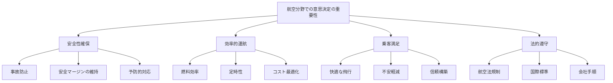
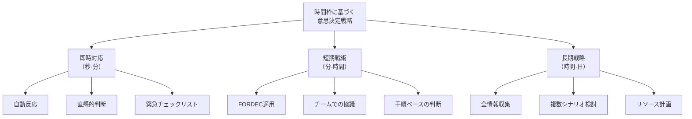
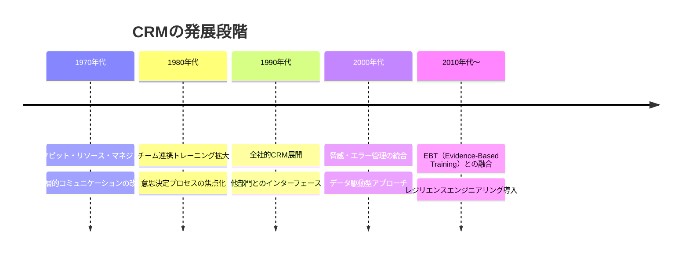
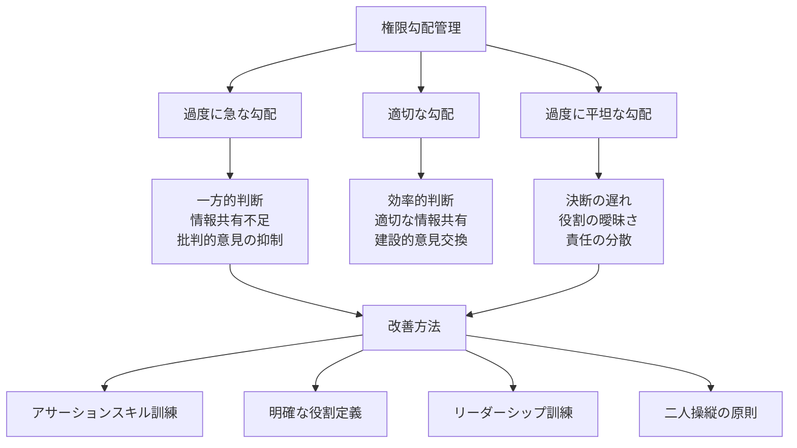
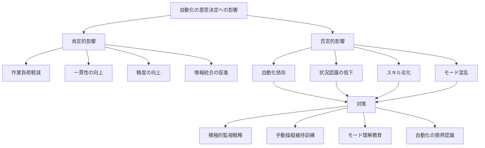
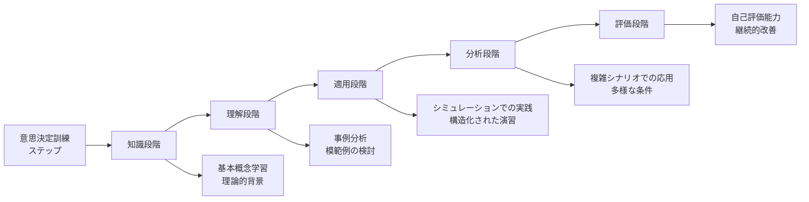
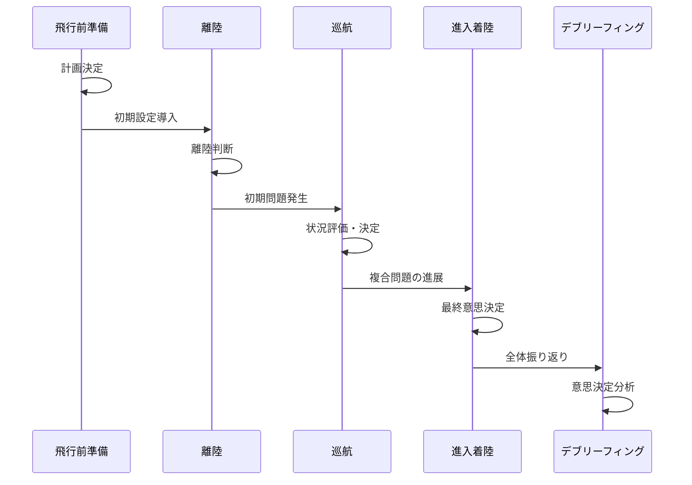
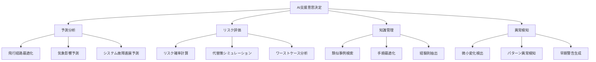

# 航空分野での意思決定

!!! info "このページについて"
    このページでは、航空分野における意思決定（Decision Making）の重要性と応用について詳しく解説します。パイロット、航空管制官、地上スタッフなど、航空業界に関わる専門職の意思決定プロセスと、その訓練・改善方法について学びます。

## 航空分野での意思決定の特徴

航空分野における意思決定は、安全性に直結し、時間的制約の強い高リスク環境で行われる特徴があります。

### 固有の環境特性

| 特性 | 説明 | 意思決定への影響 |
|------|------|----------------|
| **時間的切迫性** | 緊急事態では秒単位の判断<br>瞬時の決断が必要 | 迅速な意思決定プロセス<br>直感と分析のバランス |
| **高いリスク性** | 判断ミスが人命に直結<br>重大な結果をもたらす可能性 | 安全最優先の判断基準<br>保守的バイアスの存在 |
| **複雑な情報環境** | 多様な計器と情報源<br>逐次的に変化する状況 | 情報の優先順位付け<br>状況認識との強い連動 |
| **チーム協調** | 多人数での分担責任<br>階層的権限構造 | 意思決定の役割分担<br>コミュニケーションの重要性 |
| **高度な自動化** | 先進的なシステム<br>人間とコンピュータの協働 | 自動化信頼度の判断<br>監視者役割の重要性 |

### 航空意思決定の重要性



## 意思決定モデルと戦略

### 航空特有の意思決定モデル

=== "FORDEC モデル"
    #### FORDEC モデル

    FORDEC（Facts, Options, Risks & Benefits, Decision, Execution, Check）は、特に航空分野で広く採用されている構造化された意思決定フレームワークです。

    ```mermaid
    graph LR
        F[Facts<br>事実確認] --> O[Options<br>選択肢検討]
        O --> R[Risks & Benefits<br>リスク・利点評価]
        R --> D[Decision<br>決定]
        D --> E[Execution<br>実行]
        E --> C[Check<br>確認]
        C --> F
    ```

    ##### FORDEC プロセスの詳細

    | 段階 | 主な活動 | キー質問 | 意思決定の焦点 |
    |------|----------|----------|---------------|
    | **Facts** | 客観的情報収集<br>現状の明確化 | 「何が起きているか？」<br>「何がわかっているか？」 | 状況認識の形成<br>問題の明確化 |
    | **Options** | 可能な選択肢の列挙<br>代替案の特定 | 「どのような選択肢があるか？」<br>「他に方法はないか？」 | 創造的思考<br>広い視野での検討 |
    | **Risks & Benefits** | 各選択肢のリスク分析<br>利点の評価 | 「各選択肢のリスクは？」<br>「何が得られるか？」 | 批判的分析<br>トレードオフの検討 |
    | **Decision** | 最適選択肢の選定<br>明確な決断 | 「どの選択肢を取るか？」<br>「決定事項は何か？」 | 統合的判断<br>明確な決定 |
    | **Execution** | 行動計画の展開<br>役割の割り当て | 「誰が何をするか？」<br>「どう実行するか？」 | 明確なタスク割り当て<br>効果的実行 |
    | **Check** | 結果の検証<br>必要な調整 | 「計画通り進んでいるか？」<br>「修正が必要か？」 | モニタリング<br>適応的調整 |


=== "認知的連続体アプローチ"
    #### 認知的連続体アプローチ

    認知的連続体（Cognitive Continuum）アプローチは、直感的判断と分析的判断の両方を状況に応じて活用するモデルです。

    ```mermaid
    graph TD
        A[認知的連続体アプローチ]
        A --- B[直感的判断]
        A --- C[分析的判断]
        
        B --- B1[迅速]
        B --- B2[パターン認識ベース]
        B --- B3[経験依存]
        
        C --- C1[体系的]
        C --- C2[ルールベース]
        C --- C3[意識的評価]
        
        D[時間的余裕] --- E[少ない]
        D --- F[多い]
        
        E --- B
        F --- C
    ```

    ##### 直感的判断と分析的判断の特徴

    | 特性 | 直感的判断 | 分析的判断 |
    |------|-----------|-----------|
    | **処理速度** | 迅速<br>瞬時判断 | 緩慢<br>段階的検討 |
    | **認知プロセス** | 自動的・無意識的<br>パターン認識ベース | 意識的・努力要<br>ルールベース |
    | **リソース要求** | 低い認知負荷<br>多重タスクに適合 | 高い認知負荷<br>集中作業 |
    | **適用条件** | 緊急時<br>時間的圧力下<br>熟練者の経験 | 複雑問題<br>時間的余裕<br>不明確な状況 |
    | **航空での例** | 離着陸時の即時判断<br>緊急回避操作 | 不具合発生時の対応手順<br>代替空港選定 |

### 時間枠に基づく意思決定戦略

航空分野では、利用可能な時間に応じた意思決定戦略が重視されます。



## 職種別の意思決定特性

=== "パイロット（操縦士）"
    ### パイロット（操縦士）

    パイロットの意思決定は、飛行の各段階で異なる特性と課題を持ちます。

    #### 飛行フェーズ別の意思決定特性

    | 飛行フェーズ | 意思決定の特徴 | 特有の課題 | 意思決定支援要素 |
    |------------|--------------|-----------|----------------|
    | **飛行前計画** | 戦略的・分析的<br>十分な時間 | 気象予測の不確実性<br>代替計画の必要性 | 気象ブリーフィング<br>フライトプランニングツール |
    | **離陸・上昇** | 戦術的・時間制約<br>高い作業負荷 | 緊急時意思決定の準備<br>V1カット判断 | 標準運航手順<br>明確な中止基準 |
    | **巡航** | 監視的・予測的<br>比較的余裕 | 経路変更の判断<br>気象回避 | 気象レーダー<br>データリンク情報 |
    | **進入・着陸** | 戦術的・状況依存<br>多層的判断 | 安定進入基準<br>復航判断 | 進入ブリーフィング<br>明確な限界値 |
    | **異常・緊急時** | 時間圧力下<br>高ストレス | 問題の認識・特定<br>優先順位決定 | チェックリスト<br>CRMの活用 |

    #### 意思決定バイアスとその対策

    パイロットは以下のような認知バイアスの影響を受けやすいことが知られています。

    ```mermaid
    graph TD
        A[パイロットの<br>意思決定バイアス] --> B[継続バイアス]
        A --> C[確証バイアス]
        A --> D[権威勾配]
        A --> E[ハロー効果]
        
        B --> B1[計画変更の抵抗]
        C --> C1[裏付け情報のみ注目]
        D --> D1[上位者への過度依存]
        E --> E1[全体印象からの一般化]
        
        B --> F[対策]
        C --> F
        D --> F
        E --> F
        
        F --> F1[明確な中止基準]
        F --> F2[悪魔の代弁者]
        F --> F3[CRMトレーニング]
        F --> F4[構造化チェックリスト]f
    ```

=== "航空管制官（Air Traffic Controller）"
    ### 航空管制官（Air Traffic Controller）

    航空管制官は、多数の航空機の安全と効率を同時に確保するための意思決定を担当します。

    #### 複数機管制での意思決定プロセス

    === "空間・時間的判断"
        **航空機間の間隔維持決定**
        
        - 複数航空機の3次元位置関係評価
        - 速度・高度・方位による将来位置予測
        - 潜在的コンフリクトの早期検出
        - 間隔保持のための最適指示選択

    === "優先順位判断"
        **管制業務の優先順位決定**
        
        - 安全関連タスクの最優先判断
        - 複数の同時要求間の優先順位付け
        - 緊急機と通常運航機の処理バランス
        - リソース配分（注意・通信時間）の最適化

    === "協調的判断"
        **チームでの意思決定**
        
        - 管制セクター間の情報共有と調整
        - 航空機パイロットとの協調的判断
        - スーパーバイザーとの状況共有
        - 混雑時の支援要請判断

    #### 管制官のワークロード管理と意思決定

    ```mermaid
    graph LR
        A[ワークロード] --> B[低]
        A --> C[適正]
        A --> D[高]
        
        B --> B1[リラックス状態<br>注意力低下<br>過小警戒]
        C --> C1[最適パフォーマンス<br>適切な状況認識<br>効率的判断]
        D --> D1[情報処理能力低下<br>トンネルビジョン<br>判断精度低下]
        
        B1 --> E[対策]
        D1 --> E
        
        E --> E1[自己監視強化]
        E --> E2[業務複雑性調整]
        E --> E3[支援要請]
        E --> E4[交通流制限]
    ```

=== "運航管理者（Flight Dispatcher）"
    ### 運航管理者（Flight Dispatcher）

    運航管理者は、フライト計画の作成と運航中の支援を通じて、戦略的な意思決定に関わります。

    #### 運航管理における意思決定領域

    | 意思決定領域 | 主要判断事項 | 考慮要素 | 意思決定時間枠 |
    |------------|-------------|----------|--------------|
    | **フライト計画** | 経路選択<br>高度選択<br>燃料搭載量 | 気象条件<br>空域制限<br>機材性能 | 出発数時間前<br>（長期・分析的） |
    | **出発判断** | 離陸許可<br>規制適合性<br>運航制限 | MEL項目<br>乗員資格<br>空港状況 | 出発直前<br>（中期・半分析的） |
    | **運航監視** | 経路変更<br>代替空港変更<br>緊急支援 | 気象変化<br>機材不具合<br>空港閉鎖 | 運航中適宜<br>（短期・適応的） |
    | **イレギュラー対応** | 遅延処理<br>欠航判断<br>運航継続性 | 乗客影響<br>乗員勤務制限<br>連鎖影響 | 状況発生時<br>（即時・戦術的） |


## チーム意思決定と CRM

### Crew Resource Management (CRM)

クルー・リソース・マネジメント（CRM）は、フライトクルーの効果的なチーム意思決定を促進するためのフレームワークです。

#### CRMの発展段階



#### CRMの主要要素

| 要素 | 説明 | 意思決定への貢献 |
|------|------|----------------|
| **状況認識の共有** | チーム全体での共通状況理解 | 情報基盤の統一<br>判断前提の整合 |
| **効果的コミュニケーション** | 明確な情報伝達<br>閉ループ確認 | 誤解の防止<br>情報品質向上 |
| **明確なリーダーシップ** | 役割認識と責任分担 | 意思決定権の明確化<br>行動の一貫性 |
| **ワークロード管理** | タスク配分と優先順位付け | 認知資源の最適配分<br>過負荷防止 |
| **意思決定プロセス** | 構造化された判断手順 | バイアス軽減<br>体系的判断 |

### ブリーフィングの役割

ブリーフィングは、事前の意思決定枠組みを共有し、チームの意思決定能力を高める重要なツールです。

#### 効果的なブリーフィングの構造

=== "出発前ブリーフィング"
    **飛行前の共通理解構築**
    
    - 飛行計画の確認と共有
    - 予想される気象状況と対応策
    - 潜在的な問題点とその対処
    - 意思決定権限と移譲条件の明確化
    - 「What-if」シナリオの事前検討

=== "アプローチブリーフィング"
    **進入・着陸計画の共有**
    
    - 進入方式と着陸滑走路の確認
    - 特殊条件（風向、視程、滑走路状態）
    - 不安定進入時の復航判断基準
    - 予想されるATC指示と対応計画
    - 緊急事態発生時の役割分担

### 権限勾配管理

航空機のコックピットでは、階層的な権限構造が存在しますが、これが意思決定に与える影響を適切に管理することが重要です。



## 意思決定支援システム

### コックピット自動化と意思決定支援

現代の航空機は高度に自動化されており、これが意思決定プロセスにも大きな影響を与えています。

#### 自動化システムの層

| 層 | システム例 | 意思決定支援機能 | パイロットの役割 |
|---|-----------|----------------|---------------|
| **飛行経路管理** | FMS（飛行管理システム）<br>LNAV/VNAV | 最適経路計算<br>4次元軌道管理 | 経路承認<br>モード監視 |
| **飛行制御管理** | オートパイロット<br>自動推力制御 | 精密な機体制御<br>安定性維持 | モード選択<br>性能監視 |
| **システム管理** | ECAM/EICAS<br>自動故障診断 | 障害検出・分析<br>推奨行動提示 | 警告確認<br>対応策選択 |
| **情報管理** | 電子フライトバッグ<br>データリンク | 情報統合・表示<br>リアルタイム更新 | 情報解釈<br>関連性判断 |

#### 自動化の意思決定への影響



!!! warning "自動化のパラドックス"
    自動化レベルが高いほど、パイロットの状況認識と意思決定能力が低下する傾向があります。これを「自動化のパラドックス」と呼びます。高度な自動化環境では、適切な監視戦略と手動スキルの維持が特に重要です。

### 航空交通管理（ATM）システム

航空交通管理システムは、管制官の意思決定を支援する統合システムです。

#### ATM意思決定支援機能

=== "戦術的意思決定支援"
    **短期的な管制判断支援**
    
    - 衝突警報・予測機能
    - セクター内交通流表示
    - 航空機間最短到達時間計算
    - 管制指示履歴追跡
    - 電子フライトストリップ

=== "戦略的意思決定支援"
    **中長期的な計画支援**
    
    - 到着管理最適化
    - 空域容量予測
    - 気象影響シミュレーション
    - 交通流予測モデル
    - 協調的意思決定（CDM）ツール

## 訓練と評価

### 意思決定スキルの訓練アプローチ

#### 段階的訓練プログラム



#### 効果的な訓練手法

| 訓練手法 | 説明 | 特徴的効果 | 実施例 |
|----------|------|-----------|-------|
| **ケーススタディ** | 実際のインシデント分析<br>判断プロセス検証 | バイアス認識<br>反面教師学習 | 過去事故の分析<br>ヒヤリハット共有 |
| **シナリオベース訓練** | 実践的シミュレーション<br>現実的状況再現 | 実践的適用<br>ストレス下訓練 | LOFT<br>不具合対応訓練 |
| **判断演習** | 仮想的判断ポイント<br>選択肢評価練習 | 判断枠組み習得<br>選択肢発想力 | 判断点教材<br>選択理由付け |
| **マイクロワールド** | 簡易版現実の再現<br>実験的環境 | パラメータ操作<br>繰り返し練習 | コンピュータシミュレーション<br>タブレット演習 |

### LOFT (Line-Oriented Flight Training)

LOFT は実際の運航環境を模擬したシナリオベースのシミュレーター訓練で、特に意思決定能力の向上に効果的です。

#### LOFTの特徴

- **リアリズム**: 実際の運航に基づいたシナリオ設計
- **完全な飛行**: 出発前から到着までの一連のプロセス
- **介入なし**: インストラクターは観察者として参加
- **異常事態の統合**: 通常運航に異常が自然に発生
- **CRMの重視**: チーム協調と意思決定の評価

#### LOFTシナリオの設計



### EBT (Evidence-Based Training)

EBT（証拠に基づく訓練）は、実際のデータ分析に基づいて設計された最新の訓練アプローチです。

#### EBTの意思決定要素

| コンピテンシー | 説明 | 意思決定側面 |
|--------------|------|-------------|
| **問題解決と意思決定** | 問題の特定と解決<br>リスク評価と判断 | コア・コンピテンシーとして直接評価<br>明示的訓練対象 |
| **状況認識** | 環境モニタリング<br>情報理解と予測 | 意思決定の前提条件<br>情報基盤の質の保証 |
| **ワークロード管理** | タスク優先順位付け<br>リソース配分 | 意思決定の効率性<br>認知資源の最適化 |
| **コミュニケーション** | 明確な情報交換<br>意図の伝達 | 集団意思決定の促進<br>判断共有の手段 |
| **リーダーシップ** | 指示と調整<br>権限の適切な行使 | 最終判断の責任<br>チーム判断の統合 |

### 評価と認証

#### 意思決定能力の評価方法

=== "定性的評価"
    **プロセス重視の評価**
    
    - チェックパイロットによる主観評価
    - 意思決定プロセスの観察
    - デブリーフィングでの振り返り
    - 自己評価とインストラクター評価の比較
    - ナラティブ・フィードバック

=== "定量的評価"
    **データに基づく客観評価**
    
    - 飛行パラメータ分析（FDM/FOQA）
    - 行動マーカーの頻度カウント
    - パフォーマンス指標の測定
    - タイムライン分析
    - 標準からの逸脱度測定

## 事例分析

### 意思決定成功事例

=== "US Airways 1549便ハドソン川着水（2009年）"
    **短時間での効果的な意思決定の例**
    
    #### 状況
    ニューヨークのラガーディア空港を離陸直後、バードストライクにより両エンジンが停止したエアバスA320機。
    
    #### 意思決定プロセス
    - **事実確認**: エンジン停止の確認、高度・速度・位置の把握
    - **選択肢評価**: ラガーディア空港への帰還、テターボロ空港、ハドソン川着水の3案を検討
    - **リスク分析**: 空港到達の可能性と失敗時のリスク評価
    - **決定**: ハドソン川への着水を選択
    - **実行**: 乗員への指示、乗客への準備放送、最適着水姿勢の維持
    - **確認**: 着水後の避難指示と監視
    
    #### 成功要因
    - 深い専門知識と経験の活用
    - 明確な優先順位（飛行機の制御維持）
    - 迅速かつ冷静な判断
    - 全選択肢の短時間での効果的評価
    - クルー間の効果的な協力

=== "カンタス32便エンジン故障（2010年）"
    **複雑障害時の系統的意思決定**
    
    #### 状況
    シンガポール発のカンタス航空A380機が離陸後、2番エンジンで爆発が発生。多数のシステム故障が連鎖的に発生。
    
    #### 意思決定プロセス
    - **事実収集**: 複数の警告確認、損傷範囲の特定
    - **状況安定化**: 機体制御の確保と高度維持
    - **チーム編成**: 各乗員の役割明確化（問題分析、チェックリスト実行、飛行操作）
    - **系統的分析**: 影響システムの整理と優先順位付け
    - **リスク管理**: 燃料放出判断と着陸重量計算
    - **着陸戦略**: 進入速度増加と長い最終進入の選択
    
    #### 成功要因
    - 体系的な問題分析と対処
    - 明確な役割分担と相互支援
    - 時間的圧力下での冷静な対応
    - 複数の不確実性への適応的管理
    - 豊富な知識と経験の活用

### 意思決定失敗事例

=== "エールフランス447便事故（2009年）"
    **自動化との相互作用と意思決定の失敗**
    
    #### 状況
    リオデジャネイロからパリへ向かうA330機が大西洋上空で速度計故障後に操縦不能に陥り墜落。
    
    #### 意思決定の問題点
    - **状況認識の欠如**: 失速状態の認識失敗
    - **自動化理解の不足**: オートパイロット解除後の制御則変化の認識不足
    - **コミュニケーション不足**: 操縦桿入力の非共有
    - **認知的フレームの固着**: 失速可能性を考慮しない思考パターン
    - **作業負荷管理の失敗**: 驚きと混乱による認知機能低下
    
    #### 教訓
    - 基本的な飛行技能の重要性
    - 自動化システム理解の必要性
    - 効果的なクロスチェック手順
    - 明確なコミュニケーションの重要性
    - 異常事態時の役割分担の明確化

=== "テネリフェ空港衝突事故（1977年）"
    **コミュニケーションと権限勾配の問題**
    
    #### 状況
    カナリア諸島テネリフェ空港での霧中滑走路上で、離陸するKLM機と滑走中のパンナム機が衝突し583名が死亡。
    
    #### 意思決定の問題点
    - **急勾配の権限関係**: KLM機長の権威的立場と意見の言いにくさ
    - **時間的プレッシャー**: 勤務時間制限への懸念
    - **コミュニケーション不明確**: 管制指示の誤解と確認不足
    - **基本手順の省略**: 離陸許可の確認不足
    - **確証バイアス**: 自分の想定に合う情報のみの受容
    
    #### 教訓
    - CRMの重要性
    - 標準運航手順の遵守
    - コミュニケーションの明確化
    - チーム内での異論表明の重要性
    - 時間的プレッシャーの管理

## 将来の展望

### テクノロジーの進化と意思決定

最新のテクノロジーは航空意思決定を大きく変えようとしています。

#### 新技術の影響

| 技術 | 説明 | 意思決定への影響 | 実装タイムライン |
|------|------|----------------|---------------|
| **AI支援システム** | 機械学習による<br>意思決定支援 | リスク評価の強化<br>選択肢の提案 | 短期〜中期<br>(1-5年) |
| **データフュージョン** | 多様なデータソース<br>の統合と分析 | 高度化された状況認識<br>より正確な予測 | 短期<br>(1-3年) |
| **拡張現実（AR）** | 視界への情報<br>オーバーレイ | 直感的情報理解<br>視覚的意思決定支援 | 中期<br>(3-7年) |
| **自律システム統合** | 人間と自律システム<br>の協調運用 | 役割・権限の再定義<br>監視者役割の増大 | 中期〜長期<br>(5-10年) |
| **脳-機械インターフェース** | 脳信号による<br>直接制御・監視 | 意思決定速度の向上<br>認知負荷の監視 | 長期<br>(10年以上) |

#### AI支援意思決定の可能性



### 自律運航システムと人間の意思決定

#### 自律レベルと意思決定権限

| 自律レベル | 特徴 | 人間の役割 | 意思決定分担 |
|-----------|------|-----------|------------|
| **レベル0<br>手動運航** | 人間による完全制御<br>基本的警告のみ | 直接的操縦<br>全判断 | 人間: 全て<br>システム: なし |
| **レベル1<br>支援運航** | 単一機能の自動化<br>人間主体の操作 | 主要操縦<br>全監視 | 人間: ほぼ全て<br>システム: 提案のみ |
| **レベル2<br>部分的自律** | 複数機能の自動化<br>状況に応じた支援 | 監視<br>例外対応 | 人間: 戦略・承認<br>システム: 戦術実行 |
| **レベル3<br>条件付き自律** | 特定条件下での自律<br>人間は準備態勢 | 待機<br>例外対応 | 人間: 緊急時<br>システム: 通常時全て |
| **レベル4<br>高度自律** | ほぼ全状況での自律<br>人間監視任意 | 監督<br>戦略判断 | 人間: 目的設定<br>システム: 手段決定 |
| **レベル5<br>完全自律** | 全条件での完全自律<br>人間の関与不要 | 目的指定<br>なし | 人間: 使命定義<br>システム: 全実行判断 |

### 将来の意思決定訓練

#### 適応型訓練システム

=== "個別化訓練"
    **パイロット特性に合わせた最適化**
    
    - AIによる個人の意思決定パターン分析
    - 弱点に焦点を当てた訓練シナリオ自動生成
    - 学習進度に応じた難易度自動調整
    - 個人の認知スタイルに合わせた訓練方法の最適化
    - リアルタイムパフォーマンス評価とフィードバック

=== "統合シミュレーション"
    **高度な訓練環境**
    
    - 複数組織（航空会社、管制、空港）の統合訓練
    - VR/ARによる臨場感の向上
    - 実運航データに基づくリアルなシナリオ
    - 生体情報モニタリングによるストレスレベル調整
    - 神経科学的知見に基づく認知強化技術

## まとめ

航空分野での意思決定は、以下の特徴を持ちます。

### 重要なポイント

1. **段階的アプローチ**: 構造化された意思決定プロセス（FORDECなど）の活用
2. **適応的判断**: 状況に応じた直感的・分析的判断の適切な使い分け
3. **チーム協調**: CRMを活用した効果的なチーム意思決定の実現
4. **技術との協調**: 自動化システムと人間の適切な役割分担
5. **継続的学習**: 事例分析と体系的訓練による意思決定能力の向上

### 成功する意思決定の要素

航空分野で効果的な意思決定を行うための重要な要素。

- **包括的状況認識**: 全体状況の正確な把握と理解
- **明確な優先順位**: 安全を第一とした判断基準の階層
- **柔軟な適応性**: 変化する状況への対応能力
- **効果的なコミュニケーション**: チーム内での情報共有と協調
- **批判的思考**: バイアスを認識し客観的判断を行う能力
- **システム思考**: 個別判断の全体への影響を考慮する視点

航空分野で培われた意思決定手法やトレーニング方法は、医療、緊急対応、産業など他の高リスク分野にも広く応用されており、今後も技術の発展と共に進化し続けるでしょう。

## 関連リンク

- [基本概念：意思決定とは](../../basics/decision-making)
- [航空分野での状況認識](../aviation-sa)
- [意思決定の理論と実践：認知バイアスと意思決定](../../decision-making-guide/cognitive-biases)
- [意思決定トレーニング](../../decision-making-guide/decision-training)

## 参考文献

1. ICAO. (2013). *Manual on Aeroplane Upset Prevention and Recovery Training* (Doc 10011). International Civil Aviation Organization.
2. Jensen, R. S. (1995). *Pilot Judgment and Crew Resource Management*. Ashgate Publishing.
3. Orasanu, J., & Fischer, U. (1997). Finding decisions in natural environments: The view from the cockpit. In C. Zsambok & G. Klein (Eds.), *Naturalistic Decision Making*, 343-357.
4. Endsley, M. R., & Jones, D. G. (2012). *Designing for Situation Awareness: An Approach to User-Centered Design* (2nd ed.). CRC Press.
5. FAA. (2016). *Pilot's Handbook of Aeronautical Knowledge* (FAA-H-8083-25B). Federal Aviation Administration.
6. Kahneman, D. (2011). *Thinking, Fast and Slow*. Farrar, Straus and Giroux.
7. Dismukes, R. K., Berman, B. A., & Loukopoulos, L. D. (2007). *The Limits of Expertise: Rethinking Pilot Error and the Causes of Airline Accidents*. Ashgate Publishing.
8. 中西晶・佐相邦英 (2007). 『航空分野におけるヒューマンファクター: CRMからSMSへ』. 東京電機大学出版局.
9. BEA. (2012). *Final Report: Air France flight AF 447, Rio de Janeiro - Paris*. Bureau d'Enquêtes et d'Analyses pour la sécurité de l'aviation civile.
10. Helmreich, R. L., Merritt, A. C., & Wilhelm, J. A. (1999). The evolution of Crew Resource Management training in commercial aviation. *International Journal of Aviation Psychology, 9*(1), 19-32.