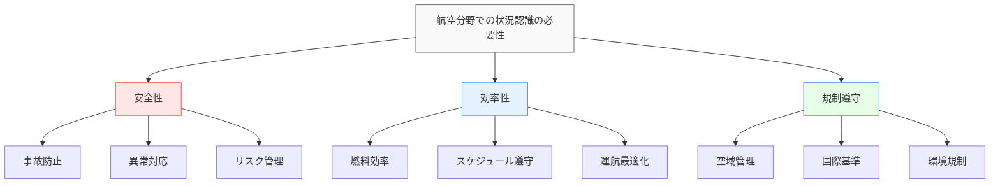
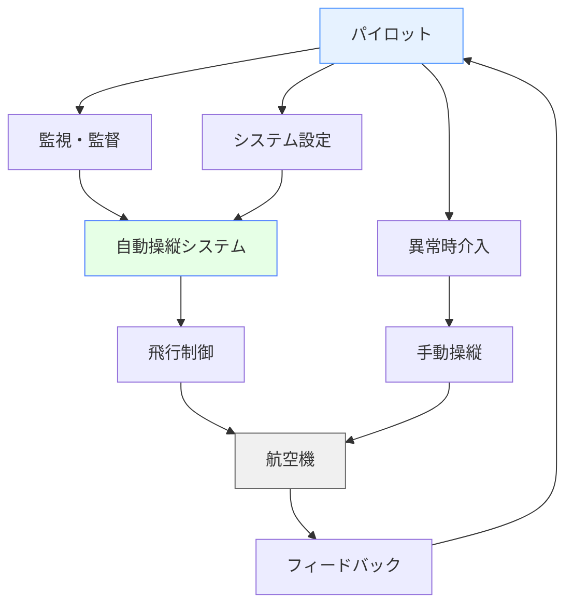
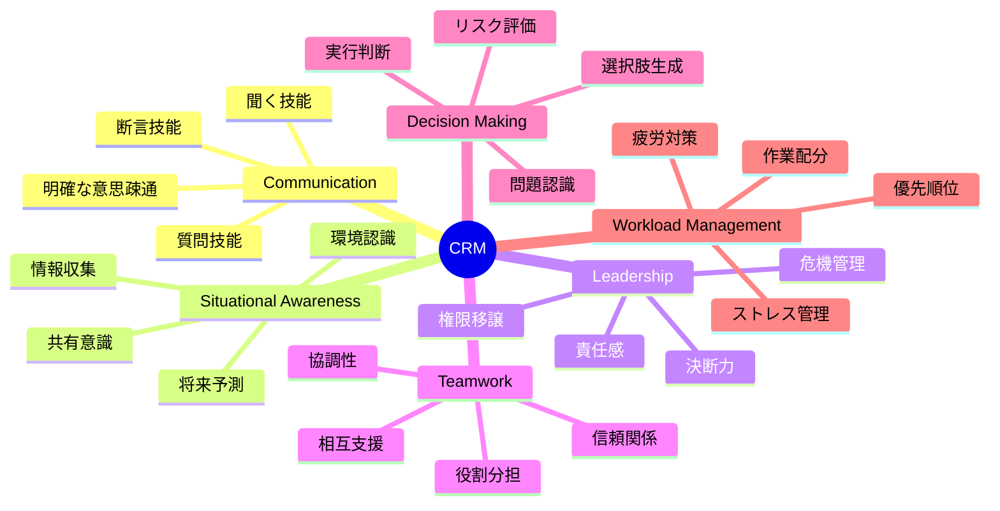
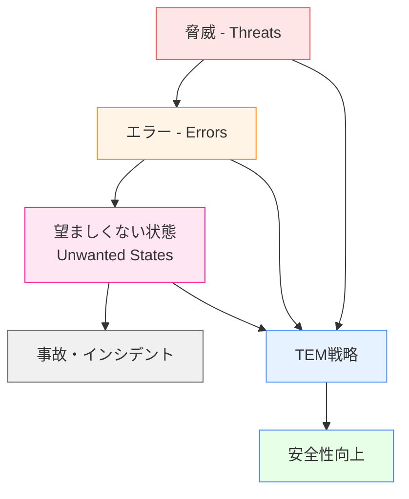
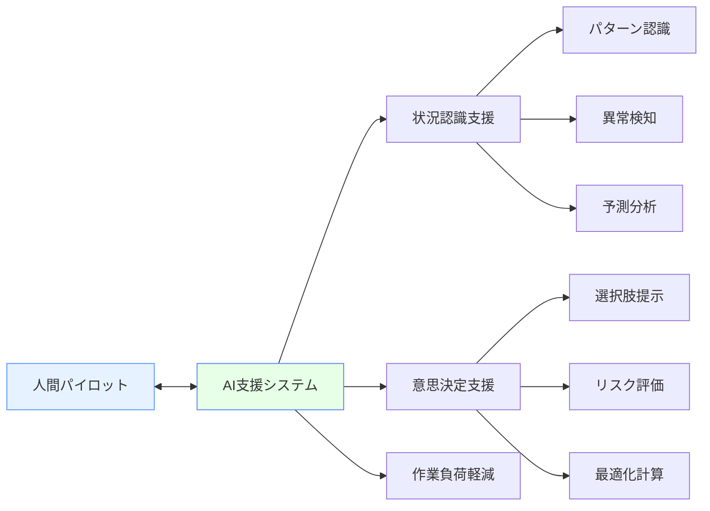

# 航空分野での状況認識

!!! info "このページについて"
    このページでは、航空分野における状況認識（Situational Awareness）の重要性と応用について詳しく解説します。パイロット、航空管制官、地上スタッフなど、航空業界に関わる全ての職種での状況認識の実践例を学びます。

## 航空分野での状況認識の特徴

航空分野は、状況認識研究の発祥地であり、最も体系的に理論と実践が発展した分野です。この分野での状況認識には以下の特徴があります。

### 固有の環境特性

| 特性 | 説明 | 状況認識への影響 |
|------|------|----------------|
| **3次元高速移動** | 水平・垂直方向の同時移動<br>時速数百キロの高速度 | 空間認識の複雑性<br>時間的余裕の制限 |
| **高度な技術統合** | 先進的なアビオニクス<br>自動化システム | 人間-機械協調の必要性<br>モード認識の重要性 |
| **厳格な規則・手順** | 国際的な統一基準<br>標準化されたプロトコル | 規則に基づく状況判断<br>例外状況への対応力 |
| **天候・環境依存** | 気象条件の大きな影響<br>可視性の制限 | 間接情報への依存<br>予測能力の重要性 |

### 状況認識が求められる理由



## 職種別の状況認識

=== "パイロット（操縦士）"

    ### パイロット（操縦士）

    パイロットの状況認識は、飛行の安全と効率に直結する最も重要な要素です。

    #### パイロットの状況認識の3レベル

    === "レベル1: 知覚（Perception）"
        **計器・外部環境からの情報収集**
        
        - **飛行計器**: 高度、速度、方位、姿勢の確認
        - **エンジン計器**: 燃料、油圧、電気系統の状態
        - **外部環境**: 気象条件、他機、地形、空港状況
        - **通信**: 管制指示、ATIS、他機との通信
        
        !!! example "知覚の例"
            「高度10,000フィート、速度250ノット、方位090度、前方に積乱雲、管制官から降下指示あり」

    === "レベル2: 理解（Comprehension）"
        **情報の統合と意味の把握**
        
        - **飛行状態の評価**: 計画通りか、異常はないか
        - **気象影響の判断**: 安全な飛行に支障はないか
        - **交通状況の把握**: 他機との間隔、優先順位
        - **システム状態の理解**: 正常動作か、制限はないか
        
        !!! example "理解の例"
            「現在正常に飛行中だが、前方の積乱雲により迂回が必要。燃料は十分だが、到着が10分遅れる見込み」

    === "レベル3: 予測（Projection）"
        **将来状況の予測と計画**
        
        - **航路予測**: 現在のコースの継続可能性
        - **燃料計算**: 目的地到着までの燃料収支
        - **気象発展**: 天候変化の影響予測
        - **緊急時計画**: 異常発生時の対応策
        
        !!! example "予測の例"
            「この積乱雲は東に移動しているため、30度右に迂回すれば5分で回避可能。予備燃料内で対応可能」

    #### 単独機とチーム運用の状況認識

    === "単独パイロット（小型機等）"
        **特徴**: 全責任が一人に集中
        
        - すべての情報を一人で処理する必要
        - 作業負荷管理が特に重要
        - 外部リソース（管制、気象情報等）の効果的活用
        - セルフチェックと確認の徹底

    === "マルチクルー運用（旅客機等）"
        **特徴**: チーム全体での共有状況認識
        
        - **機長（Captain）**: 最終決定権者、全体統制
        - **副操縦士（First Officer）**: 相互監視、バックアップ
        - **航空機関士（Flight Engineer）**: システム専門監視（一部機種）
        - **客室乗務員（Cabin Crew）**: 客室状況、緊急時連携

=== "航空管制官（Air Traffic Controller）"

    ### 航空管制官（Air Traffic Controller）

    航空管制官は、多数の航空機を同時に監視し、安全で効率的な空域利用を実現します。

    #### 管制官の役割別状況認識

    | 管制種別 | 主な責任範囲 | 状況認識の焦点 | 特徴的な技能 |
    |----------|-------------|---------------|-------------|
    | **塔台管制<br>(Tower Control)** | 空港周辺空域<br>離着陸管制 | 滑走路状況<br>地上移動<br>近距離交通 | 視覚的監視<br>高頻度意思決定<br>気象判断 |
    | **進入管制<br>(Approach Control)** | 空港周辺中距離<br>進入・出発管制 | 航空機の順序付け<br>間隔管理<br>効率的経路 | レーダー解析<br>3次元交通管理<br>順序最適化 |
    | **航路管制<br>(En-route Control)** | 高高度巡航空域<br>長距離航行管制 | 航路交通流<br>燃料効率<br>気象回避 | 長期計画<br>交通流最適化<br>協調調整 |

    #### 管制官の情報処理プロセス

    ```mermaid
    sequenceDiagram
        participant R as レーダー画面
        participant C as 管制官
        participant F as フライトプラン
        participant P as パイロット
        participant O as 他管制官
        
        R->>C: 航空機位置・高度・速度
        F->>C: 予定航路・時刻
        C->>C: 交通状況統合判断
        C->>P: 管制指示（方位・高度・速度）
        P->>C: 指示復唱・遵守報告
        C->>O: 引き継ぎ・調整
        C->>C: 結果確認・次行動計画
    ```

=== "地上支援スタッフ"

    ### 地上支援スタッフ

    地上での航空機運用に関わるスタッフも、安全運航に欠かせない状況認識が求められます。

    #### 主要な地上職種と状況認識

    === "航空整備士<br>(Aircraft Mechanic)"
        **機体の安全性確保**
        
        - 機体システムの状態診断
        - 整備作業の優先順位判断
        - 運航スケジュールとの調整
        - 予防保全と緊急対応

    === "グランドハンドリング<br>(Ground Handling)"
        **地上業務の安全・効率運営**
        
        - 航空機周辺の作業安全
        - 貨物・旅客の効率的取り扱い
        - 気象条件による作業調整
        - 他部門との連携

    === "運航管理者<br>(Flight Dispatcher)"
        **フライト計画と運航判断**
        
        - 気象状況の分析・予測
        - 燃料計算と代替空港選定
        - パイロットとの協議・決定
        - 緊急時・異常時の対応判断

## 技術システムと状況認識

### アビオニクス（航空電子機器）の進化

現代の航空機は高度に統合されたアビオニクスシステムにより、パイロットの状況認識を支援しています。

#### グラスコックピット（Glass Cockpit）

| システム | 主な機能 | 状況認識への貢献 |
|----------|----------|----------------|
| **PFD<br>(Primary Flight Display)** | 基本飛行情報表示 | 飛行状態の直感的把握<br>異常状況の強調表示 |
| **MFD<br>(Multi-Function Display)** | 統合情報表示 | 天気・航行・システム状態<br>情報の統合的表示 |
| **FMS<br>(Flight Management System)** | 航法・性能計算 | 自動航法支援<br>燃料・時間予測 |
| **TCAS<br>(Traffic Collision Avoidance System)** | 交通監視・回避 | 他機情報の自動表示<br>衝突回避指示 |

#### 自動化システムとの協調



!!! warning "自動化のパラドックス"
    自動化システムは通常時の負荷を軽減しますが、異常時にはかえって状況認識を困難にする場合があります。パイロットは自動化への適切な依存と、手動操縦技能の維持のバランスが重要です。

### 気象・交通情報システム

#### 最新の支援技術

=== "ウェザーレーダー"
    **機上気象レーダー**
    
    - リアルタイム降水強度表示
    - 乱気流・上昇下降気流検出
    - 3次元気象情報
    - 将来位置での気象予測

=== "ADS-B (Automatic Dependent Surveillance-Broadcast)"
    **次世代監視システム**
    
    - GPS基準の正確な位置情報
    - 他機位置のリアルタイム表示
    - 地上交通管制との情報共有
    - 将来の4D航法支援

=== "データリンク通信"
    **デジタル情報交換**
    
    - 気象情報の自動更新
    - 管制指示のデジタル送信
    - 機体状況の自動報告
    - 音声通信の負荷軽減

## 訓練とCRM（Crew Resource Management）

### 状況認識訓練の体系

航空分野では、状況認識能力向上のための体系的な訓練が確立されています。

#### 段階的訓練プログラム

| 訓練段階 | 主な内容 | 期待効果 | 実施環境 |
|----------|----------|----------|----------|
| **基礎訓練** | SA理論・基本概念<br>情報処理技法<br>注意管理 | SA意識向上<br>基本技能習得 | 座学・簡易シミュレータ |
| **応用訓練** | 職種別SA技能<br>チーム連携<br>異常時対応 | 実践的SA能力<br>協調技能 | 高忠実度シミュレータ |
| **統合訓練** | リアリスティック<br>シナリオ訓練<br>緊急時対応 | 総合的判断力<br>危機管理能力 | 実機・実環境 |

#### Crew Resource Management (CRM)

CRMは、技術的技能（Hard Skills）だけでなく、非技術的技能（Soft Skills）を向上させる訓練概念です。

##### CRMの主要要素



##### CRMの実践例

=== "コミュニケーション"
    **効果的な情報共有**
    
    - **Call-Challenge-Response**: 重要事項の確実な伝達
    - **クローズドループ**: 送信→受信→確認の完結
    - **グレーデッドアサーション**: 段階的な主張手法
    - **適切な質問**: 疑問点の積極的確認

=== "リーダーシップ"
    **状況に応じた統率力**
    
    - **権威勾配の管理**: 階級に関係ない安全情報共有
    - **決断の時期判断**: 迅速さと慎重さのバランス
    - **チーム統合**: 全員の能力を活かす環境作り
    - **責任の明確化**: 役割と権限の適切な分担

### フライトシミュレータ訓練

#### シミュレータの種類と特徴

| シミュレータ種別 | 特徴 | SA訓練での活用 |
|----------------|------|---------------|
| **FFS (Full Flight Simulator)** | 最高忠実度<br>6軸フルモーション | 通常・緊急時<br>総合的SA評価 |
| **FTD (Flight Training Device)** | 高忠実度<br>一部物理効果 | 手順訓練<br>システムSA |
| **FNPT (Flight Navigation and Procedures Trainer)** | 中忠実度<br>航法・手順重視 | 計器飛行<br>航法SA |
| **CBT (Computer Based Training)** | 座学形式<br>理論中心 | SA概念<br>知識体系 |

#### シミュレータ訓練の利点

- **安全性**: 危険なシナリオの安全な体験
- **再現性**: 同じ状況での反復訓練
- **記録性**: 行動の詳細な記録・分析
- **効率性**: 天候に左右されない確実な実施

## 事故事例と教訓

航空事故の分析から、状況認識の重要性と失敗の要因が明らかになっています。

### 代表的な事故と状況認識

=== "テネリフェ空港事故（1977年）"
    **状況認識の失敗による史上最悪の航空事故**
    
    - **問題点**: 濃霧による視界不良、無線通信の混乱、思い込みによる誤解
    - **SA関連要因**: 
        - 知覚の困難（視界不良）
        - 理解の齟齬（通信内容の誤解）
        - 予測の失敗（相手機の動きの誤認）
    - **教訓**: 明確なコミュニケーション、確認の重要性

=== "エールフランス447便事故（2009年）"
    **自動化システムと人間の協調問題**
    
    - **問題点**: オートパイロット解除後の不適切な操縦、失速認識の遅れ
    - **SA関連要因**:
        - システム状態の誤解（自動化モード認識）
        - 飛行状態の誤判断（失速状況の理解不足）
        - チーム間の情報共有不足
    - **教訓**: 基本技能の維持、システム理解の重要性

### 状況認識失敗の典型パターン

| 失敗パターン | 典型的状況 | 予防策 |
|-------------|-----------|--------|
| **知覚の見落とし** | 計器確認の怠り<br>警告の見逃し | スキャンパターン訓練<br>チェックリスト遵守 |
| **理解の誤り** | 状況の誤解釈<br>システム状態の誤認 | 知識・経験の向上<br>相互確認の実施 |
| **予測の失敗** | 状況変化の予測不足<br>結果の予想外れ | シナリオ訓練<br>「What-if」思考 |
| **情報共有不足** | チーム内認識不足<br>コミュニケーション不備 | CRM訓練<br>標準用語の使用 |

### 現代の安全文化

#### 脅威とエラー管理（TEM: Threat and Error Management）

現代航空業界では、TEMという概念で安全性を管理しています。



##### 脅威の種類と管理

- **環境脅威**: 気象、地形、空港条件 → 情報収集・計画変更
- **組織脅威**: 時間圧力、規則変更 → 適切なリソース配分
- **個人脅威**: 疲労、ストレス → 体調管理・交代要員

## 将来の展望

### 次世代航空交通管理

#### SESAR / NextGen プロジェクト

欧州のSESAR（Single European Sky ATM Research）、米国のNextGenなど、次世代航空交通管理システムの開発が進んでいます。

##### 主要技術革新

| 技術 | 概要 | 状況認識への影響 |
|------|------|----------------|
| **4D航法** | 時間要素を含む<br>精密な航路管理 | より正確な将来予測<br>効率的な運航計画 |
| **システムワイド<br>情報管理** | 全体最適化<br>情報共有システム | 広域状況認識<br>協調的意思決定 |
| **軌道ベース運用** | 個別最適化された<br>飛行軌道 | パーソナライズド<br>状況認識支援 |

### 自動化・自律化の進展

#### Urban Air Mobility（都市型航空移動）

ドローンやeVTOLによる都市部での航空交通が実現に向かっています。

##### 新たな要求

- **低高度空域管理**: 従来にない高密度運航
- **自動化システム**: 人間の介入を最小化
- **統合運航システム**: 既存航空交通との協調

#### 人工知能との協調



### 日本における取り組み

<div class="grid cards" markdown>

-   #### 国土交通省の施策

    ---

    - **航空イノベーション推進会議**: <br>新技術導入の検討
    - **空の移動革命**: <br>ドローン・空飛ぶクルマの社会実装
    - **航空安全プログラム**: <br>継続的な安全性向上


-   #### 産業界の動向

    ---
    
    - **JAL・ANA**: <br>デジタル技術活用、訓練革新
    - **三菱重工**: <br>国産航空機開発、新技術統合
    - **JAXA**: <br>次世代航空技術研究、安全性向上

</div>


## まとめ

航空分野での状況認識は、以下の特徴を持ちます。

### 重要なポイント

1. **3次元高速環境**: 複雑な空間認識と迅速な判断が要求
2. **高度な技術統合**: 人間と機械の効果的な協調が必要
3. **チーム協調**: 個人とチーム全体の状況認識が重要
4. **継続的改善**: 事故分析による安全性の常規化
5. **将来への対応**: AI・自動化との更なる統合

### 他分野への応用

航空分野で発展した状況認識の基本アプローチは、医療、緊急対応、産業など他分野にも広く応用されています。特に以下の要素は普遍的価値があります。

- 体系的な訓練方法
- チーム連携の手法
- リスク管理の考え方
- 継続的改善の仕組み

航空分野の状況認識は、安全性と効率性を両立させる優れたフレームワークとして、今後も発展し続けることが期待されます。

## 関連リンク

- [基本概念：状況認識とは](../../basics/what-is-sa)
- [状況認識の理論と実践：状況認識のトレーニング](../../situational-awareness-guide/training-sa)
- [ソフトウェア：航空関連ソフトウェア](../../software/aviation-sa-software)
<!-- - [ケーススタディ：航空事故事例](../../case-studies/aviation-cases) -->

## 参考文献

1. Endsley, M. R. (1995). Toward a theory of situation awareness in dynamic systems. *Human Factors, 37*(1), 32-64.
2. Wickens, C. D. (2002). Situation awareness and workload in aviation. *Current Directions in Psychological Science, 11*(4), 128-133.
3. FAA. (2016). *Pilot's Handbook of Aeronautical Knowledge* (FAA-H-8083-25B). Federal Aviation Administration.
4. Helmreich, R. L., Merritt, A. C., & Wilhelm, J. A. (1999). The evolution of Crew Resource Management training in commercial aviation. *International Journal of Aviation Psychology, 9*(1), 19-32.
5. BEA. (2012). *Final Report: Air France flight AF 447, Rio de Janeiro - Paris*. Bureau d'Enquêtes et d'Analyses pour la sécurité de l'aviation civile.