# 日常生活分野での状況認識

!!! info "このページについて"
    このページでは、日常生活における状況認識（Situational Awareness）の重要性と応用について詳しく解説します。自動車運転、歩行者としての移動、スポーツ活動、家庭内安全管理など、私たちの身近な場面での状況認識の実践例を学びます。

## 日常生活での状況認識の特徴

日常生活分野は、専門的な訓練を受けていない一般の人々が、複雑で予測困難な環境で安全かつ効率的に活動するために、無意識的・意識的に状況認識を実践している分野です。

### 固有の環境特性

| 特性 | 説明 | 状況認識への影響 |
|------|------|----------------|
| **多様な環境** | 家庭・職場・移動・レジャー 異なる環境の頻繁な変化 | 環境適応能力 文脈切り替えの必要性 |
| **非専門性** | 特別な訓練を受けていない 直感的な判断に依存 | 経験則による判断 バイアスの影響大 |
| **継続性** | 起きている間は常時 習慣化された行動 | 注意の自動化 気づきの重要性 |
| **社会的相互作用** | 他者との関係 コミュニケーション依存 | 相互理解の必要性 非言語的情報の重要性 |
| **個人責任** | 各自の判断に委ねられる 即座のフィードバック | 自己責任の自覚 学習機会の活用 |

### 状況認識が求められる理由

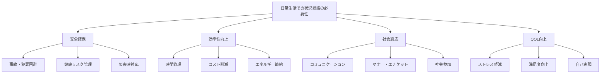

## 場面別の状況認識

### 自動車運転（Driving）

自動車運転は、日常生活で最も高度な状況認識を要求される活動の一つです。

#### 運転時の状況認識の3レベル

=== "レベル1: 知覚（Perception）"
    **道路環境・車両状態からの情報収集**
    
    - **視覚情報**: 前方車両、信号、標識、歩行者、道路状況
    - **聴覚情報**: エンジン音、タイヤ音、サイレン、クラクション
    - **車両状態**: 速度、燃料、警告灯、操舵感覚
    - **環境条件**: 天候、時間帯、交通量、道路種別
    
    !!! example "知覚の例"
        「前方200m先に渋滞の列、右車線に救急車接近中、速度60km/h、燃料残量半分、小雨で路面湿潤」

=== "レベル2: 理解（Comprehension）"
    **交通状況の統合的把握**
    
    - **交通流の分析**: 渋滞原因、車線ごとの流れ、混雑度
    - **他車の意図**: ウインカー、車間距離、速度変化からの推測
    - **道路条件**: 路面状況、見通し、制限速度との関係
    - **危険度評価**: 現在の走行が安全か、注意が必要な要素
    
    !!! example "理解の例"
        「前方の渋滞は事故渋滞の可能性。救急車通過のため右車線は空く。雨で制動距離増加、速度をやや下げる必要」

=== "レベル3: 予測（Projection）"
    **交通状況の発展と運転行動の計画**
    
    - **交通流予測**: 渋滞の進展、信号変化、車線合流
    - **他車行動予測**: 車線変更、急ブレーキ、割り込み
    - **自車行動計画**: 車線選択、速度調整、目的地到達時間
    - **リスク回避**: 危険な状況の予測と回避行動
    
    !!! example "予測の例"
        「救急車通過後、右車線に車両が戻り混雑。左車線維持で5分後に渋滞抜ける見込み。次の信号で右折準備」

#### 高齢者と若年者の運転特性

| 年齢層 | 強み | 弱み | 状況認識への影響 |
|--------|------|------|----------------|
| **若年者 (20-30代)** | 反射神経良好 新技術への適応力 | 経験不足 リスク軽視傾向 | 瞬時の知覚は優秀 理解・予測は発展途上 |
| **中年者 (40-50代)** | 経験豊富 安定した判断力 | 疲労の影響 集中力の変化 | バランスの取れたSA 状況に応じた調整 |
| **高齢者 (60代以上)** | 豊富な経験 慎重な運転 | 反応速度低下 視力・聴力減衰 | 経験による補完 身体機能との調整必要 |

### 歩行者・自転車・電動車両利用者

#### 都市部での移動時の状況認識

=== "歩行者"
    **街中での安全な移動**
    
    - 交通状況の把握（車両、信号、横断歩道）
    - 周囲の人々の動き（歩行速度、方向）
    - 環境の変化（道路工事、催事、混雑）
    - 個人の安全（不審者、危険箇所）
    - 新しい移動手段への注意（電動キックボード、電動モペット）

=== "自転車利用者"
    **車道・歩道での複合的な状況認識**
    
    - 車両との位置関係（追い越し、幅寄せ回避）
    - 歩行者との共存（歩道走行時の注意）
    - 道路状況（段差、水たまり、障害物）
    - 交通ルールの遵守（信号、一時停止）
    - 電動車両との相互認識（速度差、挙動の違い）

=== "電動キックボード利用者"
    **特定小型原動機付自転車としての安全運転**
    
    - 法的要件の理解（2023年7月法改正）
    - 走行可能場所の認識（車道・自転車レーン・歩道条件）
    - 車両・歩行者との速度差の把握
    - バッテリー残量・制動性能の確認
    - ヘルメット着用と安全装備の重要性

=== "電動モペット（電動原付）利用者"
    **原動機付自転車としての責任ある運転**
    
    - 免許・登録の法的義務
    - 車道専用走行の徹底
    - 充電・航続距離の管理
    - 自動車との協調（右折・追い越し時の注意）
    - 駐車場所の選択と盗難防止

#### 新しい移動手段の社会統合

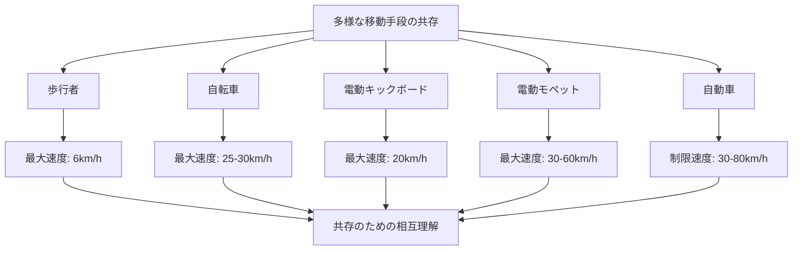

#### 電動キックボードの法的分類と状況認識

| 分類 | 主な特徴 | 走行場所 | 状況認識のポイント |
|------|----------|----------|-------------------|
| **特定小型原動機付自転車 （一般型）** | 最高速度20km/h 車体の大きさ制限 | 車道・自転車レーン 条件付き歩道 | 車両との速度差 歩行者への配慮 路面状況への注意 |
| **特例特定小型原動機付自転車 （歩道通行可能型）** | 最高速度6km/h 専用表示等 | 歩道通行可能 （13歳以上） | 歩行者優先の徹底 徐行義務 障害物回避 |
| **原動機付自転車 （従来型）** | 最高速度30km/h以上 免許・ナンバー必要 | 車道のみ | 自動車並みの交通法規 安全装備の徹底 責任の自覚 |

#### 利用者の状況認識向上ポイント

=== "安全装備・メンテナンス"
    **機械的安全の確保**
    
    - ヘルメット着用（努力義務→推奨）
    - 反射材・ライトの装着
    - ブレーキ性能の定期確認
    - タイヤ・車体の点検
    - バッテリー管理とSOC確認

=== "交通ルール・マナー"
    **社会との調和**
    
    - 道路交通法の理解・遵守
    - 歩行者・自転車への思いやり
    - 駐車場所の適正選択
    - 騒音・排気ガスへの配慮（電動の利点）
    - 盗難防止対策の徹底

=== "状況判断・リスク管理"
    **予測運転の実践**
    
    - 車両・歩行者の動きの予測
    - 天候・路面状況の考慮
    - 体調・疲労度の自己管理
    - 緊急時の回避行動準備
    - 保険加入によるリスク対策

#### SLAM安全手法の日常適用

SLAM（Stop, Look, Assess, Manage）手法は、軍事・産業分野から日常生活への応用可能な安全管理フレームワークです。

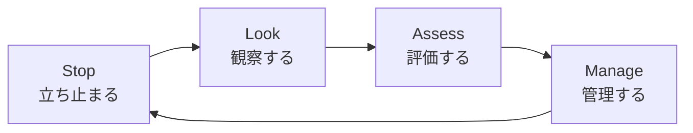

##### 日常場面でのSLAM適用例

| 場面 | Stop | Look | Assess | Manage |
|------|------|------|--------|--------|
| **道路横断** | 歩道で一時停止 | 左右・信号確認 | 車両速度・距離判定 | 安全なタイミングで横断 |
| **駅ホーム** | 黄色線の内側で停止 | 電車接近・ドア位置確認 | 混雑度・乗車可能性評価 | 適切な乗車・待機判断 |
| **夜道歩行** | 人通りの少ない場所で立ち止まり | 周囲の人・照明状況確認 | 危険度・代替ルート評価 | 安全なルート選択・警戒継続 |

### スポーツ活動

#### チームスポーツでの状況認識

=== "サッカー"
    **フィールド全体の動的状況把握**
    
    - **ボール周辺**: ボール位置、相手選手のプレス状況
    - **チーム配置**: 味方選手の位置、フォーメーション
    - **スペース認識**: オフサイドライン、サイドライン、ゴールエリア
    - **時間管理**: 試合時間、体力配分、戦術的調整

=== "野球"
    **状況に応じた戦術的判断**
    
    - **カウント状況**: ボール・ストライク、走者の位置
    - **守備位置**: 相手バッターの特徴、作戦に応じた守備シフト
    - **試合状況**: イニング、得点差、代走・代打の選択
    - **投球配球**: 過去の対戦データ、バッターの癖

#### 個人スポーツでの状況認識

=== "マラソン・ランニング"
    **長時間の自己管理**
    
    - 身体状態の把握（心拍、呼吸、疲労度）
    - 環境条件（気温、湿度、風、路面）
    - ペース配分（目標タイム、分岐点での調整）
    - 安全管理（車道、歩道、夜間の視認性）

=== "登山・ハイキング"
    **自然環境での総合的判断**
    
    - 天候変化（雲の動き、風向き、気温変化）
    - 体力・時間管理（登行ペース、下山時刻）
    - 装備・食料（水分、食料、防寒具）
    - 安全確保（道迷い防止、滑落リスク）

### 家庭内安全管理

#### 日常的な安全確認

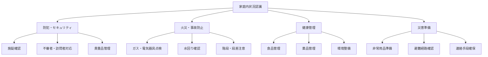

#### 高齢者・子供の安全管理

| 対象 | 主な注意点 | 状況認識のポイント | 家族の対応 |
|------|-----------|-------------------|-----------|
| **高齢者** | 転倒・転落 認知機能低下 体調急変 | 行動パターンの変化 身体機能の変化 服薬状況 | バリアフリー化 見守りシステム コミュニケーション |
| **乳幼児** | 誤飲・窒息 転落・やけど 迷子 | 発達段階に応じた危険 行動の予測不可性 保護者の目線 | 安全対策グッズ 環境整備 常時監視 |
| **学童** | 交通事故 不審者 ケガ | 自立性と経験不足 注意力の限界 友人関係の影響 | 安全教育 通学路確認 緊急時対応 |

## 技術システムと日常生活の状況認識

### スマートフォン・アプリケーション

現代の日常生活では、スマートフォンが状況認識を大幅に強化しています。

#### 位置情報・ナビゲーション

| アプリ・サービス | 主な機能 | 状況認識への貢献 |
|----------------|----------|----------------|
| **Google Maps Yahoo!カーナビ** | 経路案内 渋滞情報 所要時間予測 | リアルタイム交通状況 最適経路選択 到着時刻予測 |
| **乗換案内 Yahoo!乗換案内** | 電車・バス路線 運行状況 遅延情報 | 公共交通の状況把握 代替手段の検索 時間調整 |
| **防災アプリ Yahoo!防災速報** | 気象警報 地震情報 避難情報 | 災害リスクの把握 早期警戒 避難判断支援 |

#### ヘルスケア・フィットネス

=== "活動量計・スマートウォッチ"
    **身体状況の継続的監視**
    
    - 歩数、心拍数、消費カロリーの記録
    - 睡眠パターンの分析
    - ストレスレベルの測定
    - 運動目標の管理と達成度確認

=== "健康管理アプリ"
    **総合的なヘルスケア**
    
    - 食事記録と栄養管理
    - 薬の服用リマインダー
    - 体重・血圧の推移記録
    - 医療機関との情報共有

### 家庭内IoT・スマートホーム

#### 家庭用IoTデバイス

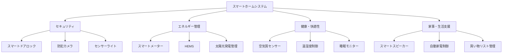

#### スマートデバイスによる状況認識強化

- **予測的メンテナンス**: 家電製品の故障予測と交換時期通知
- **エネルギー最適化**: 使用パターン学習による自動制御
- **セキュリティ統合**: 複数センサーの情報統合による異常検知
- **生活パターン分析**: 日常行動の記録・分析による健康管理

### 自動運転技術

#### 運転支援システム（ADAS）

現在実用化されている運転支援技術は、人間の状況認識を補完・強化しています。

| システム | 機能 | 状況認識への影響 | 注意点 |
|----------|------|----------------|--------|
| **衝突回避システム** | 前方車両・歩行者検知 自動ブレーキ | 死角の補完 反応時間短縮 | システム限界の理解 適切な車間距離維持 |
| **車線維持支援** | 車線逸脱警告 自動操舵補正 | 車線認識 疲労運転対策 | 明示的手動操舵の必要性 道路状況への注意 |
| **アダプティブクルーズ** | 前車追従 自動速度調整 | 交通流適応 疲労軽減 | 交通状況への継続的注意 手動介入の準備 |

#### 自動運転レベルと人間の役割

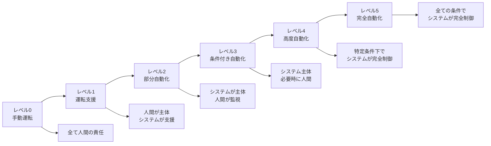

!!! warning "自動化と状況認識の関係"
    自動化レベルが上がるほど、人間の状況認識能力は低下する傾向があります（自動化のパラドックス）。特にレベル2-3では、システムの限界を理解し、常に手動介入の準備をしておくことが重要です。

## 社会的状況認識

### コミュニケーション・対人関係

#### 非言語コミュニケーションの状況認識

=== "表情・ジェスチャー"
    **相手の感情・意図の読み取り**
    
    - 顔の表情（喜怒哀楽、困惑、不安）
    - 身体の姿勢（緊張、リラックス、拒否）
    - 手の動き（強調、指示、自己防御）
    - 視線の方向（関心、回避、確認）

=== "空間・距離"
    **社会的距離の調整**
    
    - パーソナルスペース（文化・関係による違い）
    - 公的空間でのポジション取り
    - 群衆での他者との関係
    - 会話時の適切な距離感

#### デジタルコミュニケーション

| コミュニケーション形式 | 特徴 | 状況認識のポイント |
|-------------------|------|-------------------|
| **SNS （Twitter, Facebook等）** | 公開性・拡散性 非リアルタイム | 投稿内容の適切性 反応の予測 プライバシー管理 |
| **メッセージアプリ （LINE, WhatsApp等）** | プライベート リアルタイム性 | 相手の状況配慮 タイミング選択 文脈の理解 |
| **ビデオ会議 （Zoom, Teams等）** | 対面に近い 技術依存 | 環境準備 非言語情報 技術トラブル対応 |

### 公共空間でのマナー・エチケット

#### 場所別の状況認識と行動調整

=== "電車・バス内"
    **限られた空間での共存**
    
    - 座席・立ち位置の選択
    - 荷物・身体の配置
    - 音量・会話への配慮
    - 優先席・乗降時のマナー

=== "商業施設"
    **買い物・サービス利用時**
    
    - 混雑状況の把握と回避
    - 店員・他の客への配慮
    - 支払い方法・システムの理解
    - 感染症対策（時期により）

=== "職場・学校"
    **組織内での適応**
    
    - 組織文化・暗黙のルールの理解
    - 同僚・上司との関係性
    - 会議・プレゼンテーションでの空気読み
    - ワークライフバランスの調整

## 危険回避と防犯意識

### 犯罪予防のための状況認識

#### 防犯における環境デザイン（CPTED）

CPTED（Crime Prevention Through Environmental Design）の概念を個人レベルで応用。

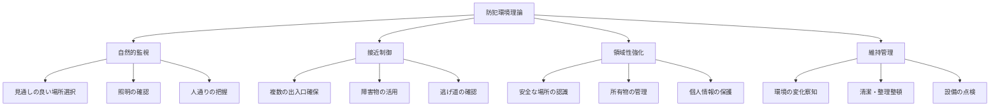

#### 日常生活での防犯チェックポイント

| 場面 | 危険要因 | 状況認識のポイント | 対策 |
|------|----------|-------------------|------|
| **ATM利用** | スキミング 強盗・恐喝 | 周囲の人物・機器の確認 時間帯・場所の選択 | 人通りの多い場所選択 操作時の注意深さ |
| **夜間外出** | 通り魔・暴行 置引・ひったくり | 照明・人通り・避難場所 不審者の察知 | 明るい道選択 貴重品の管理 |
| **オンライン** | 詐欺・なりすまし 個人情報漏洩 | 相手の身元確認 情報の機密性評価 | 二段階認証 情報の最小限共有 |

### 災害時の状況認識

#### 地震発生時の初期対応

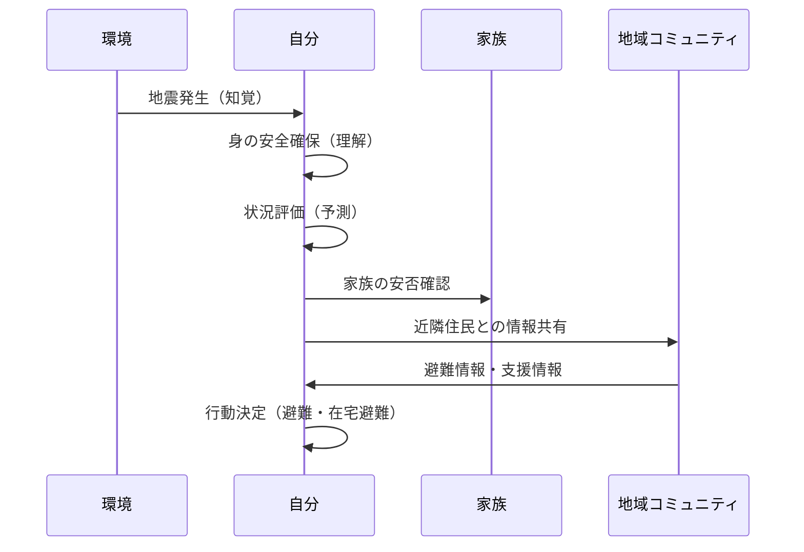

#### 災害種別の状況認識ポイント

| 災害種別 | 前兆・初期症状 | 判断要素 | 行動選択 |
|----------|---------------|----------|----------|
| **地震** | 初期微動（P波） 緊急地震速報 | 震度・継続時間 建物の安全性 | 身を守る行動 避難準備・実施 |
| **火災** | 煙の臭い・色 警報音 | 火元の位置・規模 延焼速度・方向 | 初期消火・避難 通報・周知 |
| **台風・豪雨** | 気象情報 風雨の強化 | 進路・強度予測 土砂災害リスク | 事前避難・備蓄 情報収集継続 |

## 学習・習得方法

### 状況認識能力の向上方法

#### 個人でできる練習法

=== "観察力向上"
    **日常的な気づき能力の強化**
    
    - マインドフルネス・瞑想による注意力向上
    - 散歩時の意識的観察練習
    - 写真撮影を通じた視点の多様化
    - 日記・記録による振り返り

=== "判断力強化"
    **状況の理解・予測能力の向上**
    
    - ニュース・事例の分析習慣
    - 「もしも」シナリオの思考実験
    - 他者の視点からの状況理解
    - 問題解決プロセスの体系化

=== "行動スキル"
    **効果的な対応能力の獲得**
    
    - 緊急時対応の知識・技能習得
    - コミュニケーション技術の向上
    - ストレス管理・リラクゼーション
    - 身体的フィットネスの維持

#### 家族・コミュニティでの共有学習

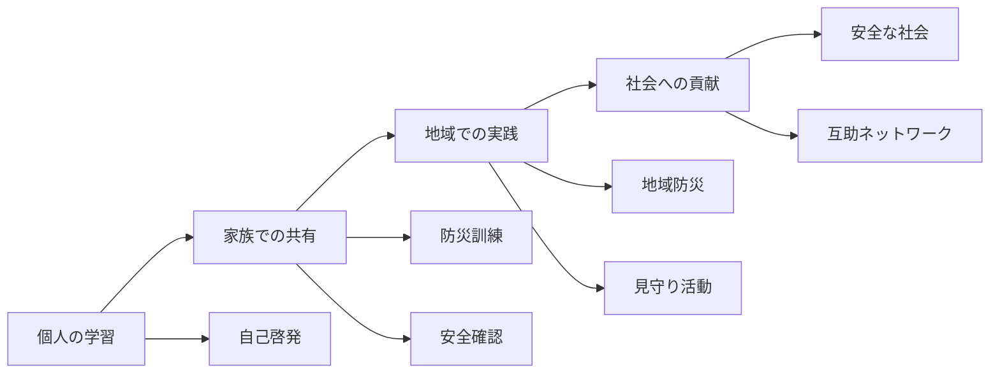

### 教育・普及活動

#### 学校教育での安全教育

| 学年 | 主な教育内容 | 状況認識の観点 | 実践方法 |
|------|-------------|---------------|----------|
| **小学校低学年** | 基本的な安全ルール 危険の認識 | 身近な危険の察知 大人への相談 | 交通安全教室 避難訓練 |
| **小学校高学年** | 地域安全・防災 情報リテラシー | 地域での安全行動 情報の判断 | 地域探検 IT安全教育 |
| **中学・高校** | リスク管理 社会参加意識 | 総合的な状況判断 社会的責任 | 防災リーダー育成 ボランティア活動 |

#### 生涯学習・社会教育

- **公民館・コミュニティセンター**: 防災講座、交通安全教室
- **企業・職場**: 安全衛生教育、メンタルヘルス研修
- **NPO・ボランティア団体**: 地域安全活動、啓発活動
- **メディア・出版**: 安全情報の発信、事例の共有

## 日本の取り組み

### 政府・自治体の施策

#### 国レベルの安全・安心社会構築

-   #### 内閣府・関係省庁

    ---

    **安全・安心社会の実現**
    
    - 第3次犯罪被害者等基本計画
    - 交通安全基本計画
    - 防災基本計画
    - 食品安全基本法

-   #### 警察庁

    ---
    
    **治安維持・犯罪予防**
    
    - 犯罪情勢の分析・公表
    - 地域安全活動の推進
    - サイバー犯罪対策
    - 交通事故防止対策

-   #### 消防庁

    ---
    
    **防災・減災対策**
    
    - 防災教育・訓練の推進
    - 住宅用火災警報器普及
    - 救急救命講習の普及
    - 地域防災力の強化

#### 自治体レベルの取り組み例

=== "東京都"
    **首都直下地震等への備え**
    
    - 東京防災ブック配布
    - 防災アプリ開発・運用
    - 地域危険度測定調査
    - 帰宅困難者対策

=== "神戸市"
    **震災経験を活かした減災社会**
    
    - 防災福祉コミュニティ
    - 災害時要援護者支援
    - 震災資料の保存・継承
    - 国際防災協力

=== "静岡県"
    **地震防災先進県としての取り組み**
    
    - 第4次地震被害想定
    - ふじのくに防災学講座
    - 地震防災センター運営
    - 津波対策推進地域指定

### 民間企業・団体の取り組み

#### 技術開発・サービス提供

| 企業・団体 | 主な取り組み | 状況認識への貢献 |
|-----------|-------------|----------------|
| **NTTドコモ** | 緊急速報メール デジタル地図サービス | 災害情報の即時配信 位置情報による安全確認 |
| **ソフトバンク** | Yahoo!防災速報 線状降水帯情報 | 多様な災害情報統合 個人向けカスタマイズ |
| **トヨタ自動車** | Toyota Safety Sense つながるクルマ | 運転支援システム プローブ情報活用 |
| **ALSOK・セコム** | ホームセキュリティ 見守りサービス | 住宅・施設の安全管理 高齢者見守り |

#### 地域コミュニティ・NPO

- **自治会・町内会**: 防犯パトロール、防災訓練
- **交通安全協会**: 交通安全教育、街頭指導
- **防犯ボランティア**: 地域見守り活動、青色回転灯パトロール
- **防災士会**: 地域防災リーダー育成、啓発活動

## 将来の展望

### AI・IoTによる日常生活支援

#### パーソナル状況認識アシスタント

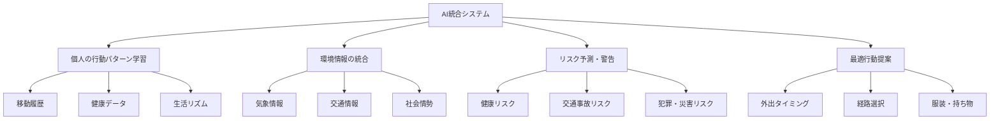

#### 予測的安全管理

=== "健康管理"
    **継続的監視と早期警告**
    
    - ウェアラブルデバイスによる生体情報監視
    - AI診断による病気の早期発見
    - 個人の健康データに基づく生活指導
    - 医療機関との連携とデータ共有

=== "交通安全"
    **事故ゼロ社会の実現**
    
    - 車車間・路車間通信による協調制御
    - 歩行者・自転車との相互認識システム
    - 交通流最適化による事故リスク減少
    - 個人の運転特性に応じた安全支援

=== "防犯・防災"
    **予防重視の安全社会**
    
    - AIによる犯罪予測とパトロール最適化
    - 個人の行動パターンからの異常検知
    - 災害予測精度向上と個別避難支援
    - コミュニティ連携による互助システム

### Society 5.0時代の状況認識

#### 人間中心の技術統合

| 技術 | 特徴 | 日常生活への影響 | 期待効果 |
|------|------|----------------|----------|
| **拡張現実（AR）** | 現実空間への情報重畳 | ナビゲーション 情報表示の直感化 | 状況把握の効率化 意思決定支援 |
| **音声AI** | 自然言語での対話 | ハンズフリー情報取得 高齢者・障害者支援 | アクセシビリティ向上 操作負荷軽減 |
| **ブロックチェーン** | 信頼性のある情報流通 | 個人情報管理 真偽情報の確認 | プライバシー保護 情報の信頼性確保 |
| **6G・量子通信** | 超高速・超低遅延通信 | リアルタイム情報共有 遠隔協調作業 | 即座の状況共有 迅速な意思決定 |

### 社会課題への対応

#### 超高齢社会での状況認識支援

=== "認知機能低下への対応"
    **テクノロジーによる補完**
    
    - GPS・見守りシステムによる迷子防止
    - 音声AI・画像認識による日常サポート
    - 家族・介護者との情報共有システム
    - 薬物管理・服薬リマインダー

=== "身体機能低下への対応"
    **バリアフリー・ユニバーサルデザイン**
    
    - 音声・振動による情報伝達強化
    - 自動運転・移動支援サービス
    - スマートホームによる生活支援
    - 緊急時自動通報システム

#### デジタルデバイド解消

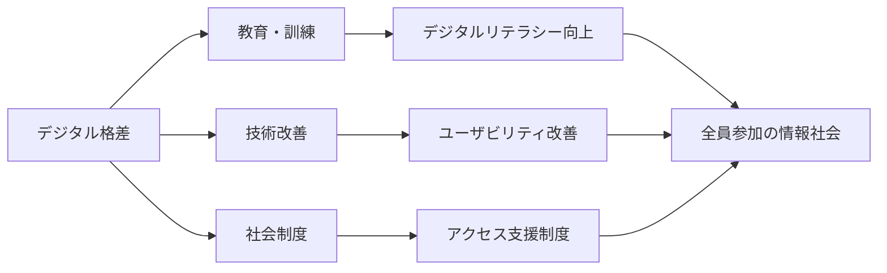

## まとめ

日常生活分野での状況認識は、以下の特徴を持ちます。

### 重要なポイント

1. **身近性と普遍性**: すべての人に関わる基本的な生活技能
2. **継続的な学習**: 年齢・環境に応じた適応と成長
3. **技術との協調**: デジタルツールによる能力強化
4. **社会的共有**: コミュニティ全体での安全・安心の実現
5. **個人の責任**: 自分や家族の安全を守る主体的行動

### システム開発への示唆

日常生活分野での状況認識は、システム開発の観点から以下の示唆を与えます。

- **ユーザーフレンドリー**: 専門知識不要で直感的に使える設計
- **パーソナライゼーション**: 個人の特性・状況に適応するシステム
- **シームレス統合**: 日常生活に自然に溶け込むサービス設計
- **プライバシー保護**: 個人情報を扱う際の高度なセキュリティ
- **アクセシビリティ**: 年齢・能力に関わらず利用可能な設計
- **レジリエンス**: 障害時でも基本機能を維持する堅牢性

日常生活での状況認識は、私たち一人ひとりが安全で快適な生活を送るための基盤となる能力です。技術の発展により、この能力はさらに強化され、より安全で豊かな社会の実現に貢献することが期待されます。

## 関連リンク

- [基本概念：状況認識とは](../../basics/what-is-sa)
- [状況認識の理論と実践：状況認識のトレーニング](../../situational-awareness-guide/training-sa)
- [応用分野：他の分野での活用](../../applications/)

## 参考文献

1. Gibson, J. J. (1979). *The ecological approach to visual perception*. Houghton Mifflin.
2. Reason, J. (1997). *Managing the risks of organizational accidents*. Ashgate Publishing.
3. Lupton, D. (2013). *Risk and everyday life*. Routledge.
4. 内閣府. (2021). *令和3年版交通安全白書*. 
5. 国土交通省. (2020). *令和2年版国土交通白書*. 
6. Wickens, C. D., & McCarley, J. S. (2008). *Applied attention theory*. CRC Press.