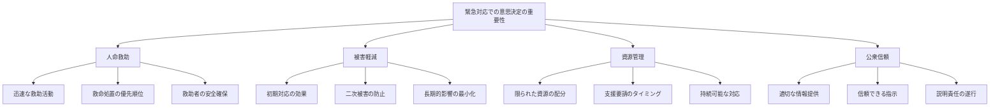
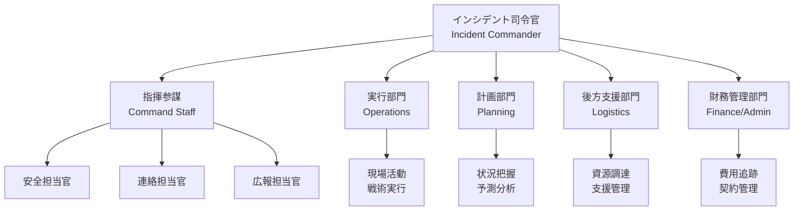
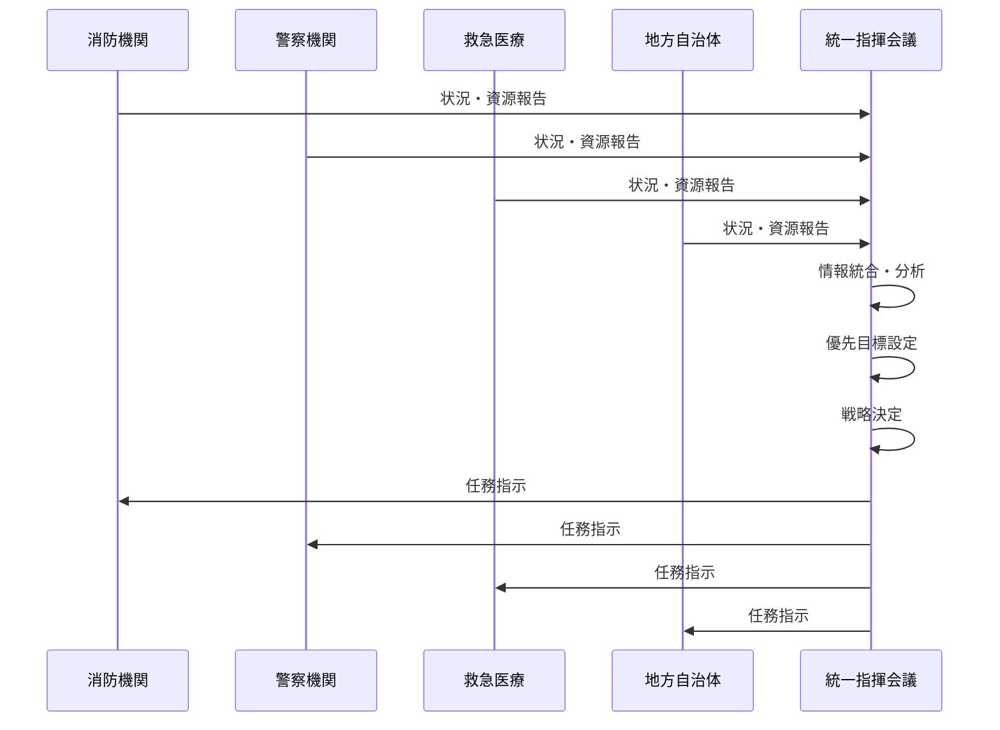
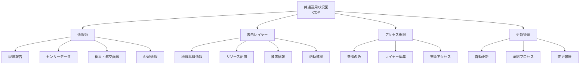
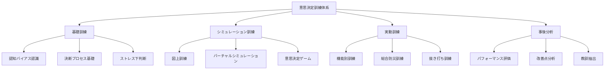
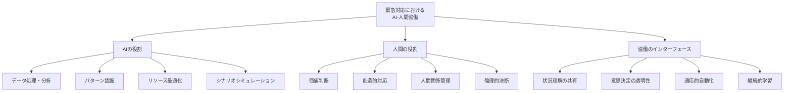

# 緊急対応分野での意思決定

!!! info "このページについて"
    このページでは、緊急対応・危機管理分野における意思決定（Decision Making）の重要性と応用について詳しく解説します。消防士、警察官、救急隊員、災害対策本部職員など、緊急事態に対応する専門職の意思決定プロセスと、その訓練・改善方法について学びます。

## 緊急対応分野での意思決定の特徴

緊急対応分野における意思決定は、時間的切迫性、高い不確実性、重大な結果をもたらす可能性を持つ特殊な環境で行われます。

### 固有の環境特性

| 特性 | 説明 | 意思決定への影響 |
|------|------|----------------|
| **時間的切迫性** | 即時対応の必要性<br>遅延による被害拡大 | 迅速な判断要求<br>時間-精度のトレードオフ |
| **情報の不完全性** | 断片的情報<br>不確実性の高さ | 限定情報での判断<br>仮説ベースの対応 |
| **高リスク状況** | 生命・財産への脅威<br>二次災害の可能性 | 安全重視の判断<br>リスク-利益の評価 |
| **複数機関連携** | 異なる組織の協働<br>指揮系統の複雑さ | 調整された判断<br>権限範囲の明確化 |
| **心理的圧力** | ストレス環境<br>感情的負荷 | 認知バイアスの増大<br>回復力の必要性 |

### 緊急対応意思決定の重要性



## 意思決定モデルと戦略

### 緊急対応特有の意思決定モデル

=== "OODA ループ"
    #### OODA ループ（Observe, Orient, Decide, Act）

    軍事戦略から派生し、緊急対応分野で広く採用されている迅速な意思決定サイクルです。

    ```mermaid
    graph LR
        A[Observe<br>観察] --> B[Orient<br>状況把握]
        B --> C[Decide<br>決定]
        C --> D[Act<br>行動]
        D --> A
        
    
    
    
    ```

    ##### OODA ループの各段階詳細

    | 段階 | 主な活動 | 緊急対応での適用 | 時間目安 |
    |------|----------|----------------|----------|
    | **Observe<br>(観察)** | 情報収集<br>状況監視<br>環境スキャン | 現場状況の把握<br>被害規模の評価<br>危険要因の特定 | 秒〜分<br>(継続的) |
    | **Orient<br>(状況把握)** | 情報分析<br>状況理解<br>文脈解釈 | 状況の意味理解<br>リスク評価<br>対応優先順位 | 秒〜分 |
    | **Decide<br>(決定)** | 対応戦略選択<br>資源配分<br>指示内容決定 | 行動方針決定<br>部隊配置計画<br>戦術選択 | 秒〜分 |
    | **Act<br>(行動)** | 指示伝達<br>対応実行<br>効果確認 | 救助活動展開<br>消火活動実行<br>避難誘導 | 分〜時間 |


=== "認知的連続体アプローチ"
    #### 認知的連続体アプローチ

    緊急対応場面での直感的判断と分析的判断のバランスを考慮したモデルです。

    ```mermaid
    graph TD
        A[認知的連続体] --> B[直感型<br>意思決定]
        A --> C[分析型<br>意思決定]
        
        B --> B1[認識プライミング]
        B --> B2[パターンマッチング]
        B --> B3[メンタルシミュレーション]
        
        C --> C1[選択肢の比較評価]
        C --> C2[確率的分析]
        C --> C3[系統的問題解決]
        
        D[時間的余裕] --- E[少ない]
        D --- F[多い]
        
        G[経験レベル] --- H[高い]
        G --- I[低い]
        
        E --- B
        H --- B
        F --- C
        I --- C
        
    
    
    
    ```

    ##### 直感型と分析型意思決定の特性比較

    | 特性 | 直感型意思決定 | 分析型意思決定 |
    |------|--------------|--------------|
    | **思考プロセス** | 無意識的・自動的<br>パターン認識に基づく | 意識的・段階的<br>論理的分析に基づく |
    | **時間的特性** | 即時的（秒単位）<br>迅速な対応 | 段階的（分〜時間）<br>熟考を要する |
    | **適した場面** | 切迫した緊急事態<br>熟練者の判断 | 複合的な状況<br>前例のない問題 |
    | **リソース要求** | 認知的負荷が低い<br>ストレス下でも機能 | 認知的負荷が高い<br>集中力を要する |
    | **緊急対応例** | 火災現場での即時退避判断<br>交通事故現場での初期判断 | 大規模災害の資源配分<br>複合災害の対応計画 |

### 戦略的意思決定フレームワーク

#### WRAP法（Heath & Heath）

より良い意思決定のための実践的フレームワークであるWRAP法は、緊急対応場面でも有効です。

| 要素 | 説明 | 緊急対応での適用 |
|------|------|----------------|
| **Widen options<br>選択肢の拡大** | 二者択一思考からの脱却<br>複数選択肢の発想 | 代替戦術の検討<br>創造的解決策の模索 |
| **Reality-test assumptions<br>仮定の現実検証** | 思い込みの検証<br>反証の探索 | シナリオの検証<br>最悪事態の想定 |
| **Attain distance<br>距離を置く** | 感情的距離の確保<br>客観的視点の獲得 | 指揮所の適切な設置<br>全体俯瞰の維持 |
| **Prepare to be wrong<br>間違いへの備え** | 将来の不確実性考慮<br>柔軟な計画策定 | コンティンジェンシープラン<br>トリガーポイントの設定 |

## 職種別の意思決定特性

=== "消防指揮官（Fire Commander）"
    ### 消防指揮官（Fire Commander）

    消防指揮官は、火災現場や救助現場での作戦展開と人員配置の決定を担当します。

    #### 消防指揮官の意思決定領域

    | 意思決定領域 | 主要判断事項 | 考慮要素 | 意思決定時間枠 |
    |------------|-------------|----------|--------------|
    | **戦略決定** | 攻勢/防御戦略<br>危険区域設定<br>避難指示 | 火災性状<br>建物構造<br>気象条件 | 初動数分<br>（戦略的決断） |
    | **戦術決定** | 部隊配置<br>進入経路<br>水利選定 | 利用可能資源<br>火災拡大予測<br>建物状態 | 数分〜十数分<br>（状況に応じた調整） |
    | **安全管理** | 退避判断<br>安全マージン<br>装備選択 | 建物倒壊危険<br>有害物質<br>救助者安全 | 即時〜継続的<br>（安全最優先） |
    | **資源管理** | 応援要請<br>交代計画<br>資機材配分 | 活動予測時間<br>隊員疲労<br>特殊資機材 | 十数分〜時間<br>（長期的視点） |

    #### 消防指揮判断プロセス

    ```mermaid
    graph TD
        A[現場到着] --> B[状況評価<br>サイズアップ]
        B --> C[戦略決定]
        C --> D[戦術展開]
        D --> E[進捗評価]
        E --> F[戦略再評価]
        F --> C
        
        B --> B1[火災規模・種類]
        B --> B2[建物構造・用途]
        B --> B3[危険要因]
        B --> B4[救助必要性]
        B --> B5[利用可能資源]
        
        C --> C1[攻勢戦略]
        C --> C2[防御戦略]
        C --> C3[非常時戦略]
        
    
    
    
    
    ```

=== "救急隊長（EMS Leader）"
    ### 救急隊長（EMS Leader）

    救急隊長は、限られた医療資源の中で最大の救命効果を得るための判断を担当します。

    #### 救急活動の意思決定特性

    ##### トリアージ判断

    - **START法（Simple Triage and Rapid Treatment）**: 多数傷病者発生時の迅速な重症度判定
    - **二次トリアージ**: より詳細な医学的評価に基づく優先順位付け
    - **再評価と調整**: 傷病者状態の変化に応じた継続的判断

    ##### 救急活動の意思決定シーケンス

    ```mermaid
    sequenceDiagram
        participant S as 現場安全評価
        participant A as 初期評価
        participant T as トリアージ
        participant P as 処置優先順位
        participant TR as 搬送判断
        participant H as 病院選定
        
        S->>S: 安全確保
        S->>A: 全体状況把握
        A->>T: 重症度評価
        T->>P: 処置順序決定
        P->>P: 処置実施
        P->>TR: 搬送必要性判断
        TR->>H: 搬送先決定
        H->>H: 受入要請・連絡
    ```

=== "災害対策本部長（EOC Director）"
    ### 災害対策本部長（EOC Director）

    災害対策本部長は、大規模災害時に複数機関の調整と全体的な資源配分を決定します。

    #### 災害対応の意思決定領域

    | 段階 | 主な意思決定 | 判断材料 | 意思決定の特徴 |
    |------|------------|----------|--------------|
    | **初動対応期** | 災害規模評価<br>初期資源配分<br>応援要請 | 第一報情報<br>気象データ<br>過去事例 | 限定情報下<br>迅速な判断<br>保守的見積り |
    | **応急対応期** | 避難指示・勧告<br>救助活動方針<br>情報発信戦略 | 被害状況報告<br>活動進捗<br>リソース状況 | 情報統合<br>優先順位<br>政治的判断 |
    | **復旧初期** | 二次災害防止<br>ライフライン復旧<br>支援物資配分 | 詳細被害情報<br>ニーズアセスメント<br>復旧予測 | 中期的視点<br>資源最適化<br>フィードバック活用 |

    #### 災害対策本部の意思決定構造

    ```mermaid
    graph TD
        A[災害対策本部] --> B[情報収集・分析班]
        A --> C[総合調整班]
        A --> D[広報班]
        A --> E[資源管理班]
        
        B --> B1[被害情報収集]
        B --> B2[気象情報分析]
        B --> B3[活動状況把握]
        
        C --> C1[方針決定]
        C --> C2[各機関調整]
        C --> C3[優先順位設定]
        
        D --> D1[住民広報]
        D --> D2[メディア対応]
        D --> D3[情報管理]
        
        E --> E1[人員配置]
        E --> E2[資機材管理]
        E --> E3[支援受入調整]
        
    
    
    
    ```

## チーム意思決定とインシデントマネジメント

### インシデント・コマンド・システム（ICS）

ICS（Incident Command System）は、緊急対応において多数の組織が協調的に活動するための標準化された管理システムです。

#### ICSにおける意思決定構造



#### ICSの意思決定原則

| 原則 | 説明 | 意思決定への効果 |
|------|------|----------------|
| **統一指揮** | 単一の指揮系統<br>明確な責任体制 | 意思決定権限の明確化<br>指示の一貫性確保 |
| **指揮範囲の管理** | 適切な監督範囲<br>（3-7部下が理想） | 適切な監督能力<br>効果的な情報管理 |
| **モジュール方式** | 機能別組織構造<br>柔軟な拡大縮小 | 状況に応じた組織調整<br>必要機能の確保 |
| **行動計画の統一** | 共通の計画に基づく活動<br>目標の明確化 | 一貫した判断基準<br>活動の調和 |
| **資源管理** | 人員・装備の把握と配分<br>効率的な活用 | 資源配分の最適化<br>過不足への対応 |

### 統一指揮（Unified Command）

複数機関が協働で対応する大規模事案では、統一指揮体制が重要な意思決定構造となります。

#### 統一指揮の特徴

- **共同意思決定**: 各機関代表者による合議的判断
- **権限と責任の共有**: 機関の法的権限を尊重しつつ共同対応
- **単一の行動計画**: 統一された計画と目標設定
- **資源の統合運用**: 効率的な資源配分と活用

#### 統一指揮の意思決定プロセス



## 意思決定支援システム

### 緊急時意思決定支援システム

#### 主要な支援システム

| システム | 主な機能 | 意思決定支援の側面 |
|----------|----------|-------------------|
| **GIS<br>(地理情報システム)** | 空間データ表示<br>地理情報分析<br>リソース可視化 | 空間的状況把握<br>最適経路選択<br>資源配置計画 |
| **災害シミュレーション** | 浸水予測<br>延焼予測<br>被害推定 | 将来状況の予測<br>予防的判断<br>リスク評価 |
| **リソース管理システム** | 資源追跡<br>配分最適化<br>状態監視 | 資源状況の把握<br>効率的配分<br>過不足予測 |
| **共通運用状況図<br>(COP)** | 統合情報表示<br>リアルタイム更新<br>情報共有 | 統一状況認識<br>協調判断<br>情報伝達円滑化 |

#### 共通運用状況図（Common Operational Picture）



### 意思決定支援ツール

#### チェックリストとプロトコル

緊急対応では、標準化されたチェックリストやプロトコルが意思決定の質を高めます。

=== "チェックリスト"
    **体系的判断の支援**
    
    - 初動対応チェックリスト
    - 状況評価（サイズアップ）シート
    - 安全管理チェックポイント
    - 撤収判断チェックリスト
    - 引継ぎ確認項目

=== "標準作業手順書（SOP）"
    **一貫した判断の基盤**
    
    - 各種災害対応SOP
    - 危険物対応プロトコル
    - 指揮権移譲手順
    - 複数機関連携手順
    - 大量傷病者対応手順

=== "決定支援アルゴリズム"
    **構造化された判断プロセス**
    
    - トリアージ決定樹
    - 避難指示判断フロー
    - 資源配分アルゴリズム
    - リスク評価マトリックス
    - エスカレーション基準

## 訓練と評価

### 意思決定訓練の体系

#### 段階的訓練プログラム



#### 効果的な訓練手法

| 訓練手法 | 説明 | 意思決定能力への効果 |
|----------|------|-------------------|
| **図上訓練<br>(TTX)** | 机上での仮想状況対応<br>シナリオベース討議 | 思考プロセスの向上<br>選択肢検討の練習<br>チーム協調の強化 |
| **機能別訓練<br>(Functional Drill)** | 特定機能に特化した<br>実践的訓練 | 専門判断の精度向上<br>手順の定着<br>習熟度確認 |
| **シナリオベース訓練** | 現実的な状況進展を<br>段階的に提示 | 状況変化への適応<br>先読み能力の向上<br>時間圧下の判断強化 |
| **ストレス誘発訓練** | 意図的にストレス下で<br>意思決定を行う訓練 | 極限状況での判断力<br>感情管理能力<br>回復力の開発 |

### 意思決定の評価方法

#### 多面的評価アプローチ

=== "過程評価"
    **意思決定プロセスの質の評価**
    
    - 情報収集の範囲と質
    - 選択肢生成の多様性
    - リスク評価の適切性
    - 意思決定の時間効率
    - 理由付けの論理性

=== "結果評価"
    **意思決定の成果の評価**
    
    - 目標達成度
    - 二次的影響の最小化
    - リソース効率性
    - 人的被害の軽減
    - 長期的影響

=== "After Action Review (AAR)"
    **包括的な活動振り返り**
    
    - 計画と実際の比較
    - 成功要因と障害要因
    - 個人・チームの意思決定分析
    - 改善点の特定
    - 教訓の抽出と共有

## 事例分析

### 意思決定成功事例

=== "東日本大震災・気仙沼市津波避難判断（2011年）"
    **局面判断による大規模避難の成功**
    
    #### 状況
    東日本大震災発生時、気仙沼市内の小学校では校長の迅速な判断により、生徒と地域住民を高台へ避難させ、多数の命が救われた。
    
    #### 意思決定プロセス
    - **状況認識**: 強い揺れと長い継続時間から大津波の可能性を即座に認識
    - **直感的判断**: 経験と知識から「ただごとではない」と判断
    - **迅速な決断**: 避難マニュアルにない高台への避難を即断
    - **追加判断**: より高い場所への二次避難の決定
    - **情報共有**: 明確な指示と理由の伝達
    
    #### 成功要因
    - 状況の重大性の迅速な認識
    - 規定のプロトコルを超えた判断
    - 最悪シナリオの想定
    - 明確なリーダーシップと指示
    - 事前の防災教育と意識

=== "ハドソン川航空機不時着事故対応（2009年）"
    **複数機関の協調的緊急対応**
    
    #### 状況
    2009年、ニューヨークのハドソン川に不時着したUS Airways機からの乗客救助において、複数機関が効果的に連携。
    
    #### 意思決定プロセス
    - **状況評価**: 航空機の水上不時着という異例事態の迅速な把握
    - **統一指揮確立**: 複数対応機関（消防、警察、沿岸警備隊等）の役割明確化
    - **資源集中**: 周辺船舶・救助隊の効率的動員
    - **優先順位決定**: 乗客救助最優先の明確な方針
    - **継続的適応**: 水温・気象条件を考慮した救助計画調整
    
    #### 成功要因
    - 明確な指揮系統の迅速な確立
    - 機関間の効果的な情報共有
    - 既存の訓練・計画の適応的活用
    - 各機関の専門性の最適活用
    - 状況の継続的再評価

### 意思決定失敗事例

=== "ハリケーン・カトリーナ対応（2005年）"
    **組織間調整と意思決定の遅延**
    
    #### 状況
    2005年、アメリカ南部を襲ったハリケーン・カトリーナへの対応で、政府機関間の調整不足と意思決定の遅れが被害を拡大。
    
    #### 意思決定の問題点
    - **リスク過小評価**: 堤防決壊の可能性と影響の過小評価
    - **権限の不明確さ**: 連邦・州・地方間の責任と権限の混乱
    - **情報共有の欠如**: 重要情報の適時共有の失敗
    - **優先順位の混乱**: 資源配分の非効率と遅延
    - **前例依存思考**: 過去の災害対応パターンへの固執
    
    #### 教訓
    - 最悪シナリオに基づく準備の重要性
    - 明確な指揮系統と権限委譲の必要性
    - 効果的な情報共有システムの構築
    - 柔軟で適応的な意思決定の価値
    - 事前計画の重要性と限界の認識

=== "福島第一原発事故初動対応（2011年）"
    **複合災害下での意思決定の制約**
    
    #### 状況
    東日本大震災後の福島第一原発事故対応において、複合災害下での情報不足と意思決定の遅れが発生。
    
    #### 意思決定の問題点
    - **想定外状況への準備不足**: 全電源喪失という想定外事態への対応計画の欠如
    - **情報の断絶**: 通信インフラ喪失による情報共有の困難
    - **命令系統の混乱**: 現場と本部、政府間の指揮系統の不明確さ
    - **技術的選択肢の制限**: 極限状況下での選択肢の狭さ
    - **時間的切迫性**: 急速に進行する状況下での判断圧力
    
    #### 教訓
    - 複合災害を想定した計画の必要性
    - 冗長的通信手段の確保
    - 現場判断権限の明確化
    - 極限状況での意思決定支援体制
    - 透明性と説明責任の重要性

## 将来の展望

### AI・機械学習による意思決定支援

#### 緊急対応AIの発展段階

| 段階 | 特徴 | 意思決定への影響 | 実装タイムライン |
|------|------|----------------|---------------|
| **データ分析支援** | 大量データの<br>高速処理・解析 | 情報処理能力強化<br>パターン認識支援 | 現在〜短期<br>(すでに活用中) |
| **予測モデル活用** | 事態進展の予測<br>リスク評価 | 先制的判断支援<br>シナリオ分析 | 短期〜中期<br>(1-3年) |
| **選択肢生成支援** | 対応オプションの<br>提案と評価 | 創造的選択肢<br>トレードオフ評価 | 中期<br>(3-5年) |
| **意思決定コーチング** | 認知バイアス検出<br>判断支援 | 思考プロセス改善<br>盲点補完 | 中長期<br>(5-7年) |
| **協調的意思決定** | 人間・AI協働<br>判断最適化 | 複合知能の活用<br>相互補完的判断 | 長期<br>(7-10年以上) |

#### AI支援と人間判断の統合



### 新技術と災害レジリエンス

#### 新技術の意思決定支援への応用

=== "ビッグデータとIoT"
    **環境センシングと状況把握**
    
    - 都市全域センサーネットワーク
    - リアルタイム被災状況モニタリング
    - 人流データに基づく避難行動分析
    - 設備・インフラ健全性監視
    - クラウドソーシング情報活用

=== "拡張現実（AR）・バーチャル現実（VR）"
    **状況視覚化と訓練革新**
    
    - 現場情報の視覚的重畳表示
    - 災害シナリオの没入型体験
    - リモート専門家の現場支援
    - 意思決定プロセスの視覚化
    - 複合現実による意思決定訓練

=== "5G/6G通信とエッジコンピューティング"
    **レジリエントな情報基盤**
    
    - 耐災害通信ネットワーク
    - エッジ処理による自律分散型情報処理
    - リアルタイム映像・音声共有
    - 高精細データの現場処理
    - 冗長性と回復力のある情報システム

### 国際協力と標準化

<div class="grid cards" markdown>

-   #### 国際的枠組み

    ---

    **国境を越えた協力体制**
    
    - 国連INSARAG（国際捜索救助諮問グループ）
    - 仙台防災枠組2015-2030
    - ASEAN災害管理委員会
    - 二国間災害支援協定


-   #### 標準化と教育

    ---
    
    **共通理解と能力向上**
    
    - ISO災害マネジメント規格
    - SPHERE人道支援基準
    - ICS国際普及プログラム
    - 越境災害対応プロトコル

-   #### 技術共有

    ---
    
    **知識と技術の共有**
    
    - 災害対応技術の国際移転
    - オープンソース災害管理ツール
    - 国際的な早期警戒システム
    - 共通データフォーマットと互換性

</div>

## まとめ

緊急対応分野での意思決定は、以下の特徴を持ちます。

### 重要なポイント

1. **時間的切迫性**: 迅速な判断と行動の必要性
2. **不完全情報下の判断**: 限定的・不確実な情報での決断能力
3. **状況適応性**: 変化する状況への柔軟な対応
4. **チーム協調**: 多機関連携による統合的判断
5. **安全と効果のバランス**: リスク管理と効果的対応の両立

### 成功する意思決定の要素

緊急対応分野で効果的な意思決定を行うための重要な要素。

- **状況認識の正確さ**: 現状把握と予測による状況理解
- **明確な優先順位**: 重要度に基づく体系的判断
- **構造化プロセス**: OODA ループなど体系的アプローチの活用
- **認知バイアスの認識**: 思考の罠を避ける意識的努力
- **適切な権限委譲**: 現場判断と集中指揮のバランス
- **経験と訓練の統合**: 実践知と理論的枠組みの融合

緊急対応分野の意思決定は、人命と社会の安全を守るための重要な能力であり、継続的な訓練と改善、先進技術の適切な活用により、さらに向上していく分野です。

## 関連リンク

- [基本概念：意思決定とは](../../basics/decision-making)
- [緊急対応分野での状況認識](../emergency-sa)
- [意思決定の理論と実践：不確実性下の意思決定](../../decision-making-guide/uncertainty)
- [意思決定トレーニング](../../decision-making-guide/decision-training)

## 参考文献

1. Klein, G. (2017). *Sources of Power: How People Make Decisions* (20th Anniversary Edition). MIT Press.
2. Flin, R., O'Connor, P., & Crichton, M. (2008). *Safety at the Sharp End: A Guide to Non-Technical Skills*. Ashgate Publishing.
3. FEMA. (2017). *National Incident Management System* (3rd ed.). Federal Emergency Management Agency.
4. Kahneman, D. (2011). *Thinking, Fast and Slow*. Farrar, Straus and Giroux.
5. Comfort, L. K., Boin, A., & Demchak, C. C. (Eds.). (2010). *Designing Resilience: Preparing for Extreme Events*. University of Pittsburgh Press.
6. Heath, C., & Heath, D. (2013). *Decisive: How to Make Better Choices in Life and Work*. Crown Business.
7. 内閣府防災担当. (2020). *防災白書*. 日本国政府.
8. 消防庁. (2019). *消防白書*. 総務省消防庁.
9. 日本災害医学会. (2017). *災害医療対応標準テキスト*. へるす出版.
10. 高梨晃一. (2016). *災害対策本部運営ハンドブック*. ぎょうせい.