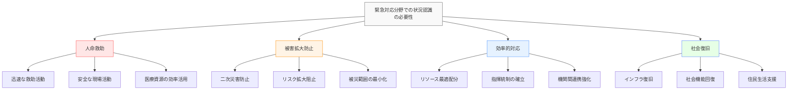
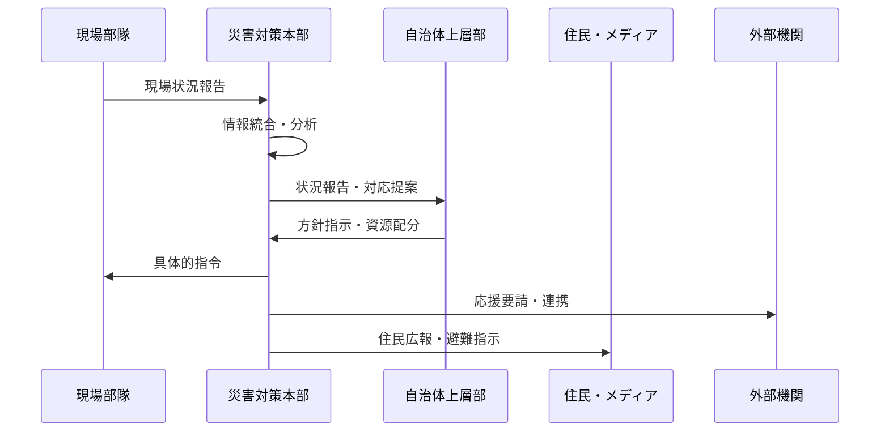
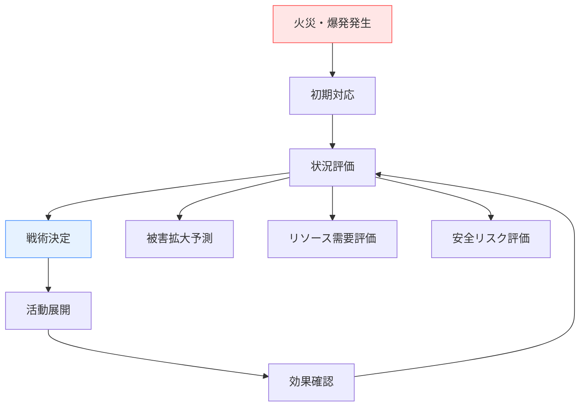
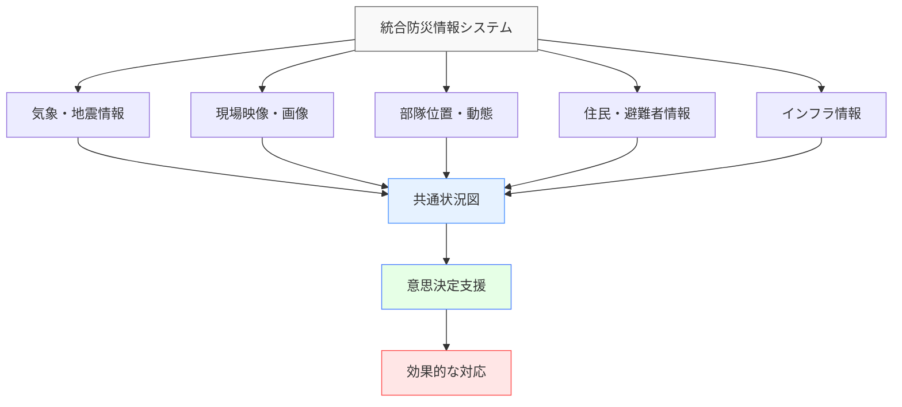
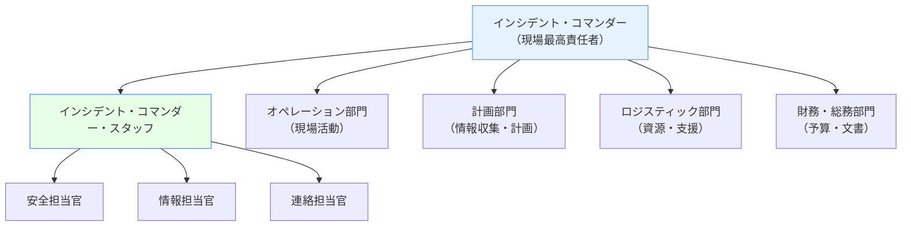
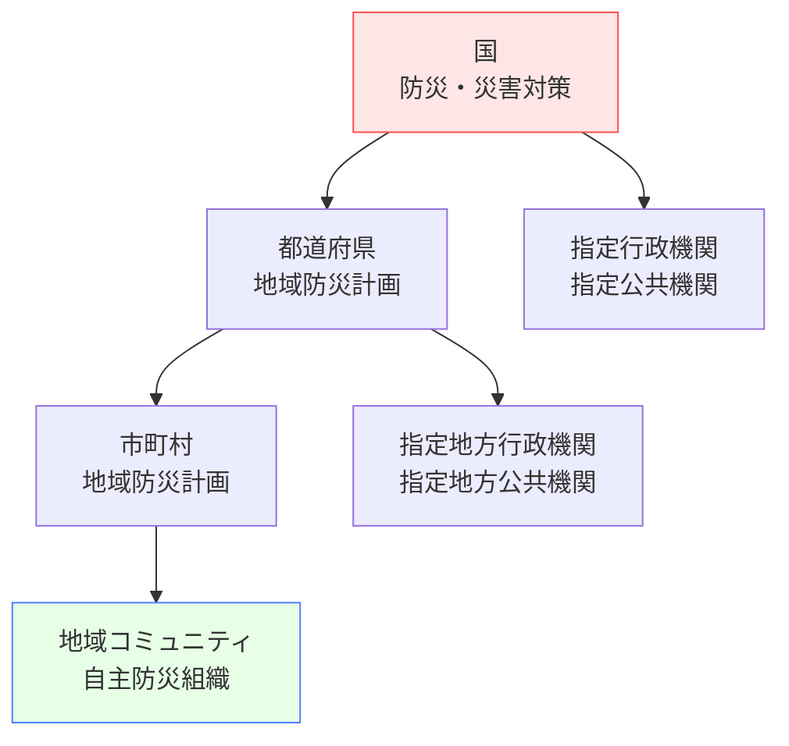
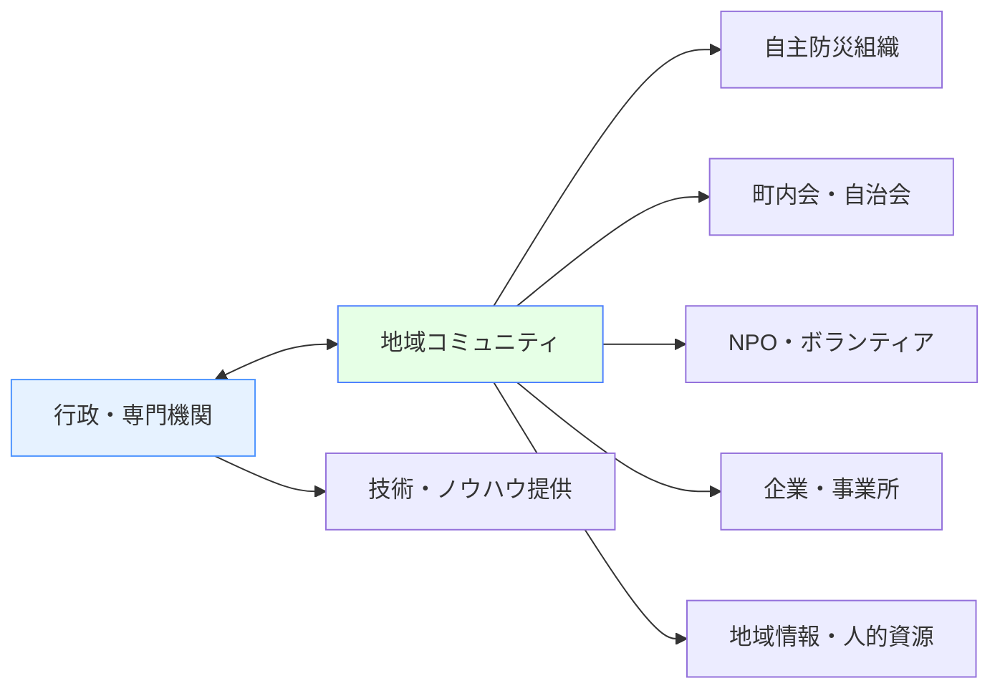

# 緊急対応分野での状況認識

!!! info "このページについて"
    このページでは、緊急対応・危機管理分野における状況認識（Situational Awareness）の重要性と応用について詳しく解説します。消防士、警察官、救急隊員、災害対策本部職員など、緊急事態に対応する全ての職種での状況認識の実践例を学びます。

## 緊急対応分野での状況認識の特徴

緊急対応分野は、予測困難で急速に変化する事態に対し、限られた情報とリソースで最適な対応を求められる環境として、独特の状況認識要件があります。

### 固有の環境特性

| 特性 | 説明 | 状況認識への影響 |
|------|------|----------------|
| **高い不確実性** | 情報不足・錯綜 状況の急変性 | 断片的情報からの推論 仮説検証型の判断 |
| **時間的切迫性** | 一刻を争う状況 ゴールデンタイム | 迅速な意思決定 優先順位の瞬時判断 |
| **多機関連携** | 消防・警察・医療 自治体・ボランティア | 異組織間の情報共有 指揮系統の調整 |
| **物理的危険** | 現場の安全性 二次災害リスク | 安全確保と任務遂行 リスク評価の常時更新 |
| **社会的影響** | 住民避難 社会機能停止 | 広範囲への影響考慮 長期的視点の必要性 |

### 状況認識が求められる理由

## 職種別の状況認識

### 消防士（Firefighter）

消防士は火災現場や救助現場での最前線活動を担い、極めて危険な環境での状況認識が求められます。

#### 消防士の状況認識の3レベル

=== "レベル1: 知覚（Perception）"
    **現場状況・環境からの情報収集**
    
    - **火災状況**: 炎の範囲、煙の色・方向、温度分布
    - **建物構造**: 構造材質、階数、出入口、避難経路
    - **人的情報**: 要救助者の位置、住民の避難状況
    - **環境条件**: 風向・風速、気温、周辺建物
    
    !!! example "知覚の例"
        「3階建て木造住宅、2階北側窓から黒煙、強風により南側延焼の可能性、1階に要救助者の声、周辺住民は避難済み」

=== "レベル2: 理解（Comprehension）"
    **情報の統合と現場状況の把握**
    
    - **火災の性質**: 出火原因、延焼速度、危険物の有無
    - **救助の緊急性**: 要救助者の状態、アクセス方法
    - **構造的安全性**: 建物の耐火性、倒壊リスク
    - **戦術的判断**: 攻撃方針、部隊配置、撤退時期
    
    !!! example "理解の例"
        「出火から20分経過、木造により急速延焼中。北風により隣家への延焼危険大。2階要救助者へは梯子車でアクセス可能。1階構造はまだ安全」

=== "レベル3: 予測（Projection）"
    **火災進展と対応効果の予測**
    
    - **延焼予測**: 現在の消火活動での鎮火見込み
    - **倒壊予測**: 建物構造の持続可能時間
    - **救助計画**: 要救助者への到達・救出所要時間
    - **二次災害**: 爆発、有毒ガス、周辺被害の可能性
    
    !!! example "予測の例"
        「現在の放水で鎮火まで30分。ただし2階床の耐力限界まで15分。梯子車救助は5分で可能。隣家延焼防止のため放水配置変更が必要」

### 警察官（Police Officer）

警察官は事件・事故現場での安全確保、交通整理、避難誘導等を担当します。

#### 警察官の状況認識分野

| 活動分野 | 主な担当業務 | 状況認識のポイント | 特徴的な技能 |
|----------|-------------|-------------------|-------------|
| **交通誘導・規制** | 道路封鎖 迂回路設定 緊急車両誘導 | 交通渋滞の影響 緊急車両の動線 住民の移動パターン | 交通流の読み 迅速な判断 明確な指示 |
| **避難誘導** | 住民誘導 避難所管理 安全確保 | 避難者数・状況 避難経路の安全性 避難所の収容能力 | 群衆心理 リーダーシップ 冷静な対応 |
| **現場保全** | 証拠保全 立入禁止区域設定 報道対応 | 現場の保全範囲 関係者の特定 情報管理 | 観察力 記録能力 判断力 |

### 救急隊員（Emergency Medical Technician）

救急隊員は医療の最前線で、限られた情報・時間で生命に関わる判断を行います。

#### 救急現場での状況認識

=== "現場到着時"
    **初期評価と安全確認**
    
    - 現場の安全性（火災、倒壊、交通危険）
    - 傷病者数と重症度の概算
    - アクセス可能性と搬出経路
    - 必要な追加資源の判断

=== "傷病者評価"
    **医学的状況認識**
    
    - バイタルサイン（意識、呼吸、循環）
    - 受傷機転と外傷の程度
    - 既往歴と服薬状況
    - 搬送先医療機関の選定

### 災害対策本部（Emergency Operations Center）

災害対策本部は、広域的な災害対応の指揮・調整を行う中枢機能です。

#### 災害対策本部の情報処理

## 災害種別での状況認識

### 自然災害

#### 地震災害対応

| 対応段階 | 主な活動 | 状況認識の重点 | 技術的支援 |
|----------|----------|---------------|-----------|
| **発災直後 (0-72時間)** | 被害状況把握 人命救助 避難誘導 | 被害規模の概算 要救助者の位置 二次災害リスク | 地震計ネットワーク ドローン調査 衛星画像解析 |
| **応急対応期 (3日-1週間)** | 生活基盤確保 避難所運営 インフラ復旧 | 住民ニーズ 物資供給状況 復旧優先順位 | 物資管理システム 避難者管理 インフラ監視 |
| **復旧・復興期 (1週間以降)** | 本格復旧 生活再建支援 恒久対策 | 復旧進捗 住民の生活状況 将来リスク | 復旧管理システム 住民管理 ハザードマップ |

#### 台風・豪雨災害対応

=== "台風接近期"
    **事前準備と予防措置**
    
    - 気象予報の詳細分析
    - 避難所開設準備
    - 事前避難の呼びかけ
    - 関係機関との連携体制確立

=== "台風通過期"
    **被害軽減と安全確保**
    
    - リアルタイム被害情報収集
    - 緊急避難指示の発令
    - 救助活動の実施
    - 交通規制と安全確保

### 人為的災害

#### 火災・爆発事故

#### テロ・重大事件

- **現場の安全確保**: 爆発物、化学物質等の危険性評価
- **犯人の動向把握**: 逃走経路、武器の有無、協力者の存在
- **被害者の保護**: 人質の状況、負傷者の救護
- **証拠保全と捜査**: 現場保全、目撃者の確保

## 技術システムと状況認識

### 緊急通信システム

#### 統合防災情報システム

| システム | 主な機能 | 状況認識への貢献 |
|----------|----------|----------------|
| **消防指令センター** | 119番通報受理 部隊出動指令 現場活動支援 | 通報内容の把握 部隊配置の最適化 活動状況の監視 |
| **警察指令センター** | 110番通報受理 警察官配置 事件管理 | 事件・事故の把握 現場対応力の配分 広域連携 |
| **EMIS (Emergency Medical Information System)** | 救急車配置 医療機関情報 搬送調整 | 搬送先の選定 医療資源の把握 患者情報共有 |

#### 情報共有プラットフォーム

### GIS・マッピング技術

#### 災害対応GISの活用

=== "リアルタイム情報表示"
    **動的な状況把握**
    
    - 災害の拡大状況のリアルタイム表示
    - 部隊・車両の位置と移動経路
    - 避難所の開設状況と収容人数
    - インフラの被災・復旧状況

=== "予測・シミュレーション"
    **将来予測による戦略立案**
    
    - 火災延焼シミュレーション
    - 浸水予測モデル
    - 避難経路の安全性評価
    - 交通渋滞予測

### ドローン・IoT技術

#### 無人航空機（UAV/ドローン）の活用

| 用途 | 主な活用場面 | 得られる情報 | 利点 |
|------|-------------|-------------|------|
| **被害状況調査** | 地震・台風後 大規模火災 | 建物損壊状況 道路通行可否 被災範囲 | 迅速・安全 広域カバー 詳細画像 |
| **人命救助支援** | 土砂災害 水害 山岳遭難 | 要救助者の位置 アクセス経路 周辺危険 | 人的リスク回避 夜間対応 狭所侵入 |
| **現場監視** | 群衆整理 警備活動 交通管制 | 群衆動態 交通状況 不審者発見 | 上空視点 継続監視 記録保存 |

#### IoTセンサーネットワーク

- **河川水位センサー**: 氾濫危険の早期検知
- **土砂災害センサー**: 地盤変動・雨量の監視
- **火災感知センサー**: 煙・熱による自動通報
- **放射線モニタ**: 原子力災害時の被曝管理

## 訓練・演習による能力向上

### 図上訓練（図上演習）

#### 災害対応図上訓練の構成

#### 訓練の効果

- **意思決定プロセスの練習**: 限られた情報での判断
- **チーム連携の強化**: 異なる機関間での協調
- **想定外事態への対応**: 複合災害や連鎖的被害
- **改善点の発見**: 手順や体制の見直し

### 実働訓練

#### 総合防災訓練

| 訓練項目 | 主な参加者 | 状況認識の向上効果 |
|----------|-----------|-------------------|
| **避難訓練** | 住民・自治体 消防・警察 | 避難行動の実態把握 ボトルネックの発見 要支援者への対応 |
| **救助訓練** | 消防・警察 自衛隊・医療 | 現場活動の連携 部隊間の情報共有 資機材の効果的活用 |
| **医療救護訓練** | 医療機関 赤十字・DMAT | トリアージの実践 搬送調整 医療資源の配分 |

## インシデント・コマンド・システム（ICS）

### ICSの基本概念

ICS（Incident Command System）は、米国で開発された緊急事態対応の標準化された管理システムです。

#### ICSの組織構造

#### 情報管理と状況認識

- **共通の活動計画**: 全組織が共有する作戦計画
- **定期的な状況報告**: 決められた間隔での情報更新
- **統一された指揮系統**: 明確な責任と権限の体系
- **標準化された用語**: 組織間での誤解防止

## 事例から学ぶ状況認識

### 成功事例

=== "阪神・淡路大震災の教訓"
    **初動対応の重要性**
    
    - 被害状況の早期把握の困難
    - 通信インフラ被災による情報途絶
    - 自衛隊等への応援要請の遅れ
    - **教訓**: 多重化された通信手段、詳細被害調査の迅速化

=== "東日本大震災の対応"
    **複合災害への対応**
    
    - 津波による想定外の被害拡大
    - 原発事故との複合災害
    - 広域避難と長期避難への対応
    - **教訓**: 最悪シナリオの想定、住民との情報共有

### 課題例と改善策

| 課題 | 原因 | 改善策 |
|------|------|--------|
| **情報の錯綜・混乱** | 複数ルートからの 未確認情報 | 情報の一元化 確認手順の標準化 情報源の明確化 |
| **組織間連携不足** | 指揮系統の不明確 情報共有の不備 | ICS導入 合同訓練の実施 標準化された手順 |
| **住民への情報伝達遅れ** | 情報整理に時間 伝達手段の限界 | 多様な伝達手段 事前作成メッセージ SNS活用 |

## 日本の防災・危機管理体制

### 国・自治体の体制

#### 災害対策基本法に基づく体制

#### 自助・共助・公助の概念

- **自助**: 個人・家庭での備えと対応
- **共助**: 地域コミュニティでの助け合い
- **公助**: 行政・公的機関による支援

### 主要な防災関連機関

-   #### 内閣府（防災担当）

    ---

    **国の防災政策の企画・推進**
    
    - 防災基本計画の策定
    - 大規模災害時の政府対応
    - 防災情報システムの整備
    - 国際防災協力

-   #### 消防庁

    ---
    
    **国の消防・救急行政**
    
    - 消防組織法に基づく指導
    - 緊急消防援助隊の運用
    - 救急救命士制度の管理
    - 消防防災科学技術の研究

-   #### 気象庁

    ---
    
    **防災気象情報の提供**
    
    - 地震・津波の監視・警報
    - 台風・豪雨の予報・警報
    - 火山活動の監視・警報
    - 竜巻等激しい現象の情報

## 将来の展望

### AI・機械学習による状況認識強化

#### 災害予測・被害想定の高度化

=== "予測精度の向上"
    **多様なデータ源の統合分析**
    
    - 衛星画像と気象データの融合
    - SNS等からのリアルタイム情報抽出
    - IoTセンサーデータの活用
    - 過去の災害データからの学習

=== "リアルタイム状況把握"
    **動的な状況認識システム**
    
    - 画像・映像の自動解析
    - 異常検知アルゴリズム
    - 被害規模の自動推定
    - 最適な対応戦略の提案

### 国際協力と技術交流

#### 災害対応技術の国際展開

- **日本の防災技術**: 早期警報システム、耐震技術の海外展開
- **国際標準の策定**: ICS等の国際的な災害対応手法の普及
- **研究協力**: 大学・研究機関での国際共同研究
- **人材育成**: 途上国への防災人材育成支援

### 地域との協働

#### 地域コミュニティとの連携強化

## まとめ

緊急対応分野での状況認識は、以下の特徴を持ちます：

### 重要なポイント

1. **不確実性への対応**: 限られた情報での迅速な判断
2. **多機関連携**: 異なる組織間での情報共有と協調
3. **時間的切迫性**: 迅速な対応と継続的な状況更新
4. **技術活用**: GIS、ドローン、AI等による状況認識強化
5. **地域协働**: コミュニティとの連携による効果的対応

### システム開発への示唆

緊急対応分野での状況認識は、システム開発の観点から以下の示唆を与えます：

- **耐障害性設計**: 災害時でも機能するシステム構築
- **分散処理**: 単一障害点を持たないアーキテクチャ
- **リアルタイム通信**: 遅延の少ない情報伝達
- **データ統合**: 異種システム間のデータ連携
- **ユーザビリティ**: 緊急時でも操作しやすいインターフェース
- **スケーラビリティ**: 災害規模に応じたシステム拡張

緊急対応分野は、人命に関わる重大な判断を短時間で行う必要があり、システムの信頼性と可用性が最も重要視される分野です。ここで培われた技術と考え方は、他の分野でのシステム開発においても貴重な指針となります。

## 関連リンク

- [基本概念：状況認識とは](../basics/what-is-sa.md)
- [包括的ガイド：状況認識のトレーニング](../comprehensive-guide/training-sa.md)
- [ソフトウェア：医療・緊急対応ソフトウェア](../software/medical-emergency-software.md)

## 参考文献

1. Buck, D. A., Trainor, J. E., & Aguirre, B. E. (2006). A critical evaluation of the Incident Command System and NIMS. *Journal of Homeland Security and Emergency Management, 3*(3), 1-27.
2. Comfort, L. K. (2007). Crisis management in hindsight: Cognition, communication, coordination, and control. *Public Administration Review, 67*, 189-197.
3. 内閣府. (2020). *防災基本計画*. 
4. Endsley, M. R. (1997). The role of situation awareness in naturalistic decision making. *Naturalistic decision making*, 269-283.
5. 消防庁. (2019). *緊急消防援助隊アクションプラン*.