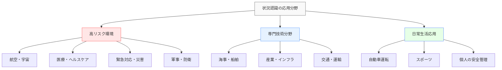

# 状況認識の応用分野

!!! info "このセクションについて"
    このセクションでは、状況認識（Situational Awareness）が実際にどのような分野で応用されているかを詳しく解説します。理論から実践へ、各分野での具体的な活用例とその効果について学びます。

## 応用分野の概要

状況認識は、人間が複雑で動的な環境で効果的に機能するための基本的な認知能力です。この能力は、安全性が重要な様々な分野で応用され、事故防止、効率性向上、パフォーマンス改善に貢献しています。

### 状況認識が特に重要な分野の特徴

状況認識が特に重要となる分野には、以下の共通特徴があります：

- **高いリスクと責任**: 判断ミスが重大な結果を招く可能性
- **動的な環境**: 状況が常に変化し、予測困難な要素が存在
- **時間的制約**: 迅速な判断と対応が求められる
- **情報の複雑性**: 多数の情報源からのデータを統合する必要
- **チーム協調**: 複数の専門家が連携して作業

## 各分野での状況認識の特徴

- ### [航空分野](./aviation.md)

    ---

    **3次元空間での高速移動**
    
    - パイロットの飛行状況把握
    - 航空管制官の空域管理
    - 自動化との協調
    
    **特徴**：高度の技術統合、厳格な手順、国際標準

- ### [海事・船舶分野](./maritime.md)

    ---

    **広大な海域での長期航行**
    
    - 船舶の位置と航路管理
    - 気象・海象条件の監視
    - 港湾での安全管理
    
    **特徴**：長時間監視、気象依存性、国際規則遵守

- ### [医療分野](./medical.md)

    ---

    **人命に関わる診断・治療**
    
    - 患者状態の継続的監視
    - 手術チームの連携
    - 緊急時の迅速な判断
    
    **特徴**：人命重視、多職種連携、不確実性への対応

- ### [緊急対応分野](./emergency.md)

    ---

    **災害・危機管理での迅速対応**
    
    - 災害規模と被害の把握
    - 救援リソースの最適配分
    - 避難・救助活動の調整
    
    **特徴**：不確実性の高い環境、時間的切迫性、多機関連携

- ### [軍事・防衛分野](./military.md)

    ---

    **戦術・戦略レベルでの状況判断**
    
    - 戦場での脅威認識
    - 指揮統制システム
    - インテリジェンス活用
    
    **特徴**：敵対的環境、秘匿性、階層的意思決定

- ### [産業・インフラ](./industrial.md)

    ---

    **大規模システムの安全運用**
    
    - プラント・工場の監視制御
    - 電力・通信インフラ管理
    - 予知保全システム
    
    **特徴**：連続運転、自動化統合、経済性重視

- ### [日常生活](./daily-life.md)

    ---

    **身近な環境での安全確保**
    
    - 自動車運転時の状況判断
    - 個人の安全管理
    - スポーツでの状況認識
    
    **特徴**：身近性、予防重視、個人スキル向上

## 分野別の状況認識の特徴比較

以下の表は、各分野における状況認識の特徴を比較したものです。

| 分野 | 主な環境 | 時間尺度 | 情報の特性 | 主要な認知的課題 | 技術的支援 |
|------|----------|----------|-----------|----------------|----------|
| **航空** | 3次元高速移動 | 秒～分 | 高度に計器化 | 空間位置認識 複数情報統合 | レーダー・GPS 自動操縦 |
| **海事** | 2次元広域移動 | 分～時間 | 視界制限多い | 相対運動予測 気象影響評価 | AIS・レーダー 電子海図 |
| **医療** | 制御された環境 | 秒～日 | 生体情報中心 | 症状パターン認識 治療効果予測 | 患者監視装置 画像診断 |
| **緊急対応** | 混沌・破壊的環境 | 分～時間 | 断片的・変化 | リソース配分 優先順位判断 | 通信システム GIS・ドローン |
| **軍事** | 敵対的環境 | 秒～年 | 不確実・偽装 | 脅威識別 意図推測 | C4ISR 諜報システム |
| **産業** | 制御された環境 | 分～日 | プロセスデータ | 異常検知 最適化判断 | SCADA IoTセンサー |
| **日常** | 社会的環境 | 秒～分 | 感覚情報中心 | リスク認識 行動選択 | スマートフォン ナビゲーション |

## 状況認識応用の発展段階

各分野での状況認識の応用は、以下の段階で発展してきました。

### **第一段階**：基礎理論の確立（1980年代～1990年代）
- 航空分野での理論構築
- Endsleyの3レベルモデル提唱
- 初期の測定手法開発

### **第二段階**：他分野への展開（1990年代～2000年代）
- 医療、軍事、緊急対応への応用
- 分野特有の課題と解決策の発見
- チーム状況認識の概念導入

### **第三段階**：技術統合と実用化（2000年代～2010年代）
- デジタル技術との統合
- 自動化システムとの協調
- 大規模システムへの適用

### **第四段階**：AI・IoT時代の進化（2010年代～現在）
- AI支援による状況認識強化
- IoTによるセンサーネットワーク
- リアルタイム分析と予測

## 今後の発展方向

### 技術統合の進化
- **AI・機械学習**: パターン認識の自動化、異常検知の高度化
- **拡張現実（AR）**: 情報オーバーレイによる認識支援
- **IoT・センサー技術**: リアルタイムデータ収集の高度化

### 新たな応用分野
- **スマートシティ**: 都市規模での状況認識とサービス最適化
- **サイバーセキュリティ**: デジタル脅威への迅速対応
- **宇宙産業**: 地球外環境での運用と探査

### 教育・訓練の革新
- **仮想現実（VR）**: 没入型シミュレーション訓練
- **デジタルツイン**: 現実システムの完全複製での訓練
- **適応学習**: AI支援による個別最適化訓練

## 学習のためのアプローチ

このセクションを効果的に学習するために、以下のアプローチを推奨します。

### 1. 基礎理解の確認
まず「[基本概念](../basics/)」セクションで学んだ内容を確実に理解していることを確認してください。

### 2. 分野間の比較学習
複数の分野のページを読み比べ、共通点と相違点を理解してください。

### 3. 実例と理論の統合
各分野の具体例と状況認識の理論モデルがどのように対応しているかを考察してください。

### 4. 自身の関心分野への適用
ご自身の専門分野や興味のある分野で、状況認識がどのように活用できるかを考えてみてください。

!!! tip "学習のポイント"
    各分野のページでは、理論的な背景から実践的な応用まで幅広く解説しています。最初は概要を把握し、興味のある分野から詳しく読み進めることをお勧めします。

## まとめ

状況認識は、安全性と効率性が要求される様々な分野で不可欠な能力です。各分野固有の特徴と課題がありながらも、状況認識の基本原則は共通しています。技術の発展により、人間の認知能力を支援し、より安全で効率的なシステムの実現が期待されています。

次のステップとして、興味のある分野のページを詳しくご覧ください。各分野での具体的な応用事例、課題、そして将来の展望について深く学ぶことができます。