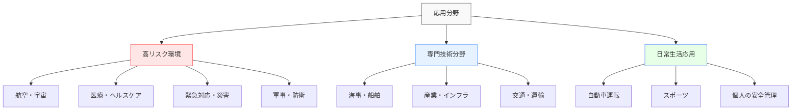
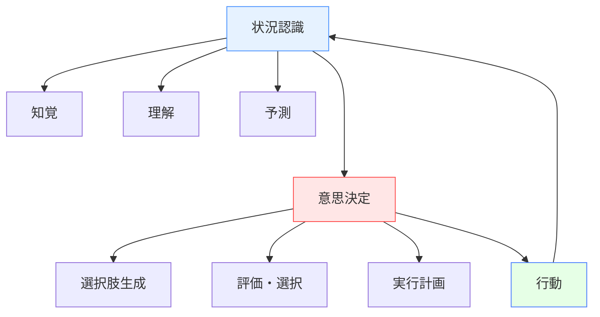

# 状況認識と意思決定の応用分野

!!! info "このセクションについて"
    このセクションでは、状況認識（Situational Awareness）と意思決定（Decision Making）が実際にどのような分野で応用されているかを詳しく解説します。理論から実践へ、各分野での具体的な活用例とその効果について学びます。

## 応用分野の概要

状況認識と意思決定は、人間が複雑で動的な環境で効果的に機能するための基本的な認知能力です。これらの能力は、安全性が重要な様々な分野で応用され、事故防止、効率性向上、パフォーマンス改善に貢献しています。

### 特に重要となる分野の特徴

状況認識と意思決定が特に重要となる分野には、以下の共通特徴があります。

- **高いリスクと責任**: 判断ミスが重大な結果を招く可能性
- **動的な環境**: 状況が常に変化し、予測困難な要素が存在
- **時間的制約**: 迅速な判断と対応が求められる
- **情報の複雑性**: 多数の情報源からのデータを統合する必要
- **チーム協調**: 複数の専門家が連携して作業

!!! info "mermaidによるダイアグラム画像について"
    このサイトでのダイアグラム画像は、[Mermaid](https://mermaid.js.org)にて作成しております。  
    一部細かいところは、 ++alt+"マウスホイール操作"++ で拡大・縮小して確認して下さい。

## 各分野の特徴

- ### 航空分野
  
    ---

    #### 3次元空間での高速移動
    
    - **[状況認識](./aviation-sa)**:  パイロットの飛行状況把握、航空管制
    - **[意思決定](./aviation-dm)**:  飛行計画、緊急時対応、 乗員リソース管理

    #### 特徴
    高度の技術統合、厳格な手順、国際標準

- ### 海事・船舶分野

    ---

    #### 広大な海域での長期航行
    
    - **[状況認識](./maritime-sa)**:  船舶の位置・航路管理、 気象・海象監視
    - **[意思決定](./maritime-dm)**:  航海計画、緊急時対応、チーム協調
    
    #### 特徴
    長時間監視、気象依存性、国際規則遵守

- ### 医療分野

    ---

    #### 人命に関わる診断・治療
    
    - **[状況認識](./medical-sa)**:  患者状態の継続的監視、 手術チームの連携
    - **[意思決定](./medical-dm)**:  診断・治療選択、 リソース配分、倫理的判断
    
    #### 特徴
    人命重視、多職種連携、不確実性への対応

- ### 緊急対応分野

    ---

    #### 災害・危機管理での迅速対応
    
    - **[状況認識](./emergency-sa)**:  災害規模と被害の把握、リソース状況
    - **[意思決定](./emergency-dm)**:  優先順位決定、 リソース配分、避難判断
    
    #### 特徴
    不確実性の高い環境、時間的切迫性、多機関連携

- ### 軍事・防衛分野

    ---

    #### 戦術・戦略レベルでの状況判断
    
    - **[状況認識](./military-sa)**:  戦場での脅威認識、 インテリジェンス活用
    - **[意思決定](./military-dm)**:  戦略的・戦術的判断、 リスク評価、指揮統制
    
    ##### 特徴
    敵対的環境、秘匿性、階層的意思決定

- ### 産業・インフラ

    ---

    #### 大規模システムの安全運用
    
    - **[状況認識と意思決定](./industrial)**:  プラント監視制御、予知保全、 異常対応
    
    #### 特徴
    連続運転、自動化統合、経済性重視

- ### 日常生活

    ---

    #### 身近な環境での安全確保
    
    - **[状況認識と意思決定](./daily-life)**:  自動車運転、個人安全管理、日常判断
    
    #### 特徴
    身近性、予防重視、個人スキル向上

## 状況認識と意思決定の相互関係

各応用分野において、状況認識と意思決定は密接に関連しています。

### 分野別の状況認識と意思決定の特徴比較

以下の表は、各分野における状況認識と意思決定の特徴を比較したものです。

| 分野 | 主な環境 | 時間尺度 | 情報の特性 | 主要な認知的課題 | 意思決定の特徴 |
|------|----------|----------|-----------|----------------|--------------|
| **航空** | 3次元高速移動 | 秒～分 | 高度に計器化 | 空間位置認識 複数情報統合 | 手順ベース チーム協調 |
| **海事** | 2次元広域移動 | 分～時間 | 視界制限多い | 相対運動予測 気象影響評価 | 長期計画 柔軟な調整 |
| **医療** | 制御された環境 | 秒～日 | 生体情報中心 | 症状パターン認識 治療効果予測 | エビデンスベース 倫理的考慮 |
| **緊急対応** | 混沌・破壊的環境 | 分～時間 | 断片的・変化 | リソース配分 優先順位判断 | 時間制約 リスク管理 |
| **軍事** | 敵対的環境 | 秒～年 | 不確実・偽装 | 脅威識別 意図推測 | 階層的 戦略・戦術の統合 |
| **産業** | 制御された環境 | 分～日 | プロセスデータ | 異常検知 最適化判断 | 安全・効率のバランス 手順準拠 |
| **日常** | 社会的環境 | 秒～分 | 感覚情報中心 | リスク認識 行動選択 | 直感的 習慣ベース |

## 発展段階と今後の動向

状況認識と意思決定の応用は、以下の段階で発展してきました。

1. **基礎理論の確立**（1980年代～）: 航空分野での概念確立
2. **分野間の知識移転**（1990年代～）: 様々な分野への概念応用
3. **技術統合**（2000年代～）: デジタル技術との融合
4. **AI・自動化との連携**（2010年代～）: 人間と機械の協調的意思決定

### 今後の発展方向

- **AI支援**: 状況認識と意思決定の各段階における機械学習の活用
- **拡張現実/仮想現実**: 情報提示の革新と訓練方法の進化
- **チーム意思決定**: 分散型・協調型の新しい意思決定モデルの開発
- **リアルタイム分析**: ビッグデータとIoTを活用した状況認識の深化

## 学習のためのアプローチ

このセクションを効果的に学習するために、以下のアプローチを推奨します。

### 1. 基礎理解の確認
まず「[基本概念](../basics/)」セクションで学んだ状況認識と意思決定の基本概念を確実に理解していることを確認してください。

### 2. 分野間の比較学習
複数の分野のページを読み比べ、共通点と相違点を理解してください。各分野固有の課題と解決アプローチに注目しましょう。

### 3. 状況認識と意思決定の連携把握
各分野で状況認識がどのように意思決定に結びついているかを考察してください。両者の相互関係の理解が応用力を高めます。

### 4. 自身の関心分野への適用
ご自身の専門分野や興味のある分野で、これらの概念がどのように活用できるかを考えてみてください。

!!! tip "学習のポイント"
    各分野のページでは、理論的な背景から実践的な応用まで幅広く解説しています。最初は概要を把握し、興味のある分野から詳しく読み進めることをお勧めします。

## まとめ

状況認識と意思決定は、安全性と効率性が要求される様々な分野で不可欠な能力です。各分野固有の特徴と課題がありながらも、基本原則は共通しています。技術の発展により、人間の認知能力を支援し、より安全で効率的なシステムの実現が進められています。

次のステップとして、興味のある分野のページを詳しくご覧ください。各分野での具体的な応用事例、課題、そして将来の展望について深く学ぶことができます。
