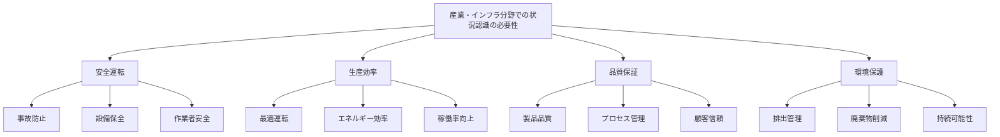
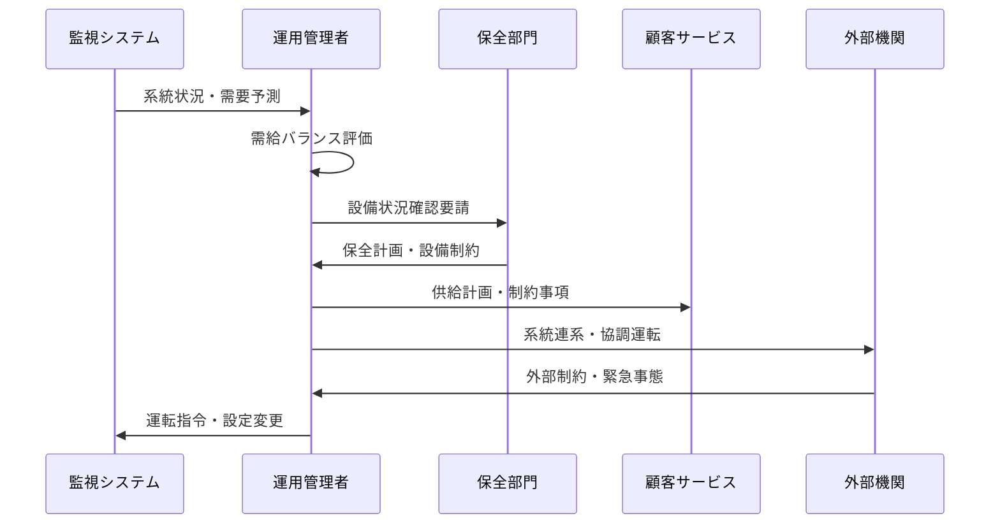
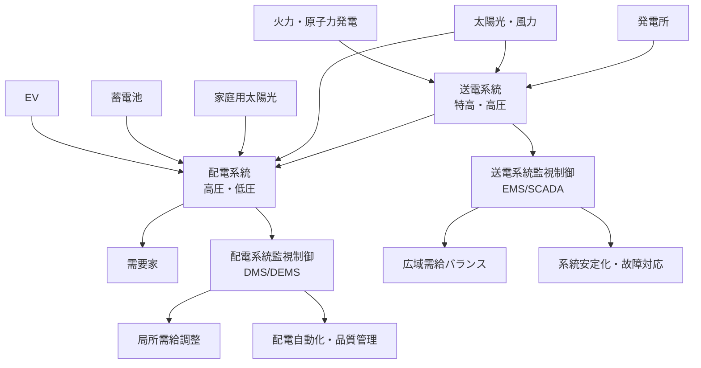
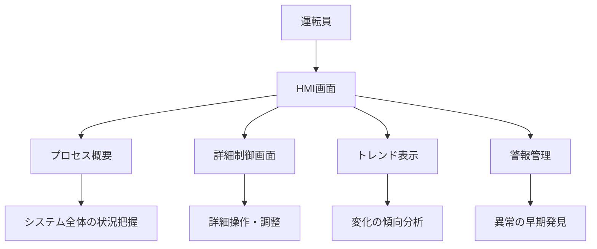
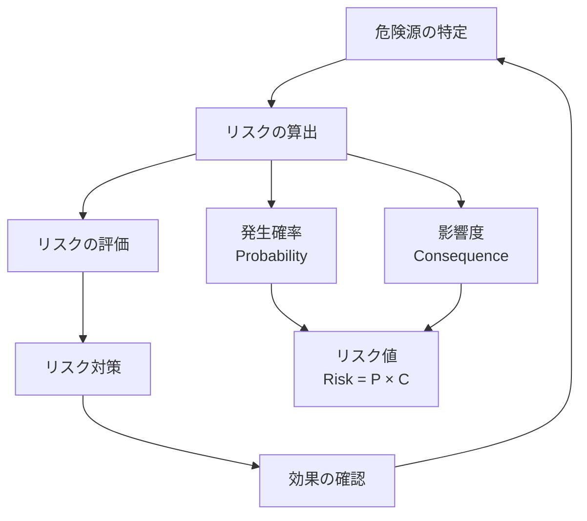
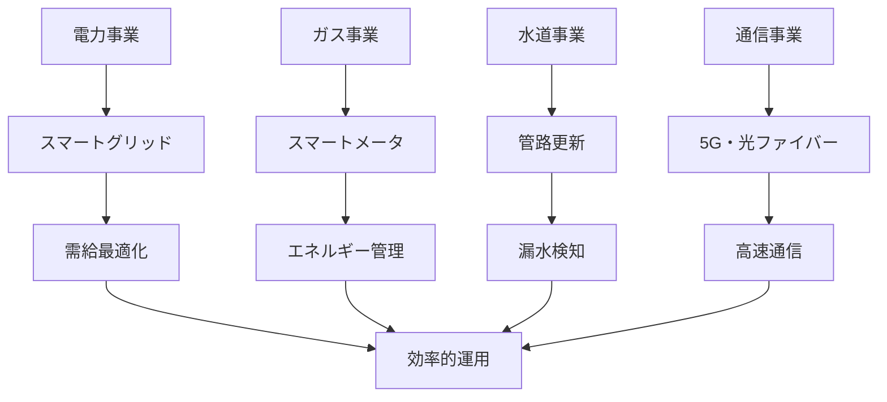
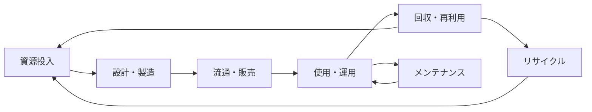

# 産業・インフラ分野での状況認識

!!! info "このページについて"
    このページでは、産業・インフラ分野における状況認識（Situational Awareness）の重要性と応用について詳しく解説します。プラントオペレーター、制御エンジニア、保全技術者、インフラ管理者など、産業システムの安全・安定運用に関わる全ての職種での状況認識の実践例を学びます。

## 産業・インフラ分野での状況認識の特徴

産業・インフラ分野は、社会の基盤となる大規模システムの安全・安定運用を担い、24時間365日の連続運転が求められる環境として、独特の状況認識要件があります。

### 固有の環境特性

| 特性 | 説明 | 状況認識への影響 |
|------|------|----------------|
| **大規模・複雑システム** | 多数の機器・プロセス 複雑な相互依存関係 | 全体俯瞰と詳細把握 システム思考の必要性 |
| **連続運転要求** | 24時間365日稼働 停止の社会的影響大 | 疲労管理 交代勤務での継続性 |
| **経済性重視** | 効率・コスト最適化 収益性の追求 | 安全性と経済性のバランス 長期視点の判断 |
| **環境・安全規制** | 厳格な法規制 社会的責任 | コンプライアンス維持 リスク管理の徹底 |
| **高度自動化** | 制御システム依存 人間の役割変化 | システム監視 異常時の手動介入 |

### 状況認識が求められる理由

## 職種別の状況認識

### プラントオペレーター（Plant Operator）

プラントオペレーターは中央制御室から複雑なプロセスを監視・制御する責任を負います。

#### プラントオペレーターの状況認識の3レベル

=== "レベル1: 知覚（Perception）"
    **プロセス状態・警報からの情報収集**
    
    - **プロセス値**: 温度、圧力、流量、レベル、組成
    - **機器状態**: 運転・停止、故障・正常、効率
    - **警報情報**: 高警報、低警報、機器異常
    - **環境条件**: 外気温、風向・風速、天候状況
    
    !!! example "知覚の例"
        「反応器温度350℃、圧力5.5MPa、流量120m³/h。コンプレッサー2号機に高温警報、外気温35℃、南風10m/s」

=== "レベル2: 理解（Comprehension）"
    **プロセス状況の統合的把握**
    
    - **プロセス均衡**: 物質・熱収支の適切性
    - **制御性能**: 制御ループの安定性、応答性
    - **機器状況**: 性能劣化、メンテナンス必要性
    - **運転効率**: エネルギー消費、収率、品質
    
    !!! example "理解の例"
        「反応器温度上昇は外気温影響と負荷増加が原因。コンプレッサー高温警報は冷却系の能力低下。このまま運転継続可能だが効率低下傾向」

=== "レベル3: 予測（Projection）"
    **プロセス挙動と対応効果の予測**
    
    - **トレンド予測**: 現在の状況継続時の変化
    - **制御効果**: 操作変更による影響
    - **設備寿命**: 機器の残り運転可能時間
    - **市場対応**: 需要変化への対応能力
    
    !!! example "予測の例"
        「現在のトレンドが続けば6時間後に反応器温度限界到達。冷却系能力向上により2℃低下可能。コンプレッサーは48時間以内の点検が必要」

### 制御エンジニア（Control Engineer）

制御エンジニアは制御システムの設計・最適化・保守を担当します。

#### 制御システムの状況認識要素

| 制御レベル | 主な対象 | 状況認識の焦点 | 技術的課題 |
|-----------|----------|---------------|-----------|
| **基本制御 (Regulatory Control)** | 単一ループ制御 PID制御 | 制御性能 安定性 外乱対応 | パラメータ調整 制御構造最適化 |
| **高度制御 (Advanced Control)** | 多変数制御 予測制御 | プロセス相互作用 制約条件 最適化 | モデル精度 計算負荷 実装性 |
| **最適化制御 (Optimization)** | 全体最適化 利益最大化 | 経済性指標 運転制約 市場動向 | 目的関数設定 制約条件 リアルタイム性 |

### 保全技術者（Maintenance Engineer）

保全技術者は設備の健全性維持と寿命延長を担当します。

#### 保全の発展段階

=== "事後保全 (Breakdown Maintenance)"
    **故障発生後の修理**
    
    - 故障現象の把握
    - 原因究明と対策
    - 修理作業の実施
    - 再発防止策の検討

=== "予防保全 (Preventive Maintenance)"
    **定期的な点検・交換**
    
    - 運転時間・カレンダー基準
    - 定期点検の実施
    - 部品交換計画
    - 保全記録の管理

=== "予知保全 (Predictive Maintenance)"
    **状態監視による適時保全**
    
    - 振動・温度・油分析
    - 劣化トレンドの監視
    - 故障予知アルゴリズム
    - 最適保全時期の決定

=== "先制保全 (Proactive Maintenance)"
    **根本原因の除去**
    
    - 故障原因の根本分析
    - 設計改善・運転改善
    - 保全方式の最適化
    - 設備信頼性の向上

### インフラ管理者（Infrastructure Manager）

インフラ管理者は電力・ガス・水道・通信などの社会基盤の運用管理を担当します。

#### インフラ管理の状況認識フロー

## 技術分野別の状況認識

### 化学プラント

#### プロセス安全管理

プロセス安全管理（PSM: Process Safety Management）では、化学プロセスの本質的危険性を管理します。

##### PSMの要素と状況認識

| PSM要素 | 状況認識の役割 | 具体的内容 |
|---------|---------------|-----------|
| **プロセス安全情報** | 危険性の認識 安全限界の把握 | プロセス化学 設備設計 安全データシート |
| **プロセス危険解析** | リスクの理解 対策の予測 | HAZOP解析 LOPA解析 SIL評価 |
| **運転手順書** | 正常・異常時の判断 対応行動の標準化 | 運転手順 緊急時手順 非定常作業手順 |
| **機械整備** | 設備健全性の確認 故障予測 | 点検基準 予備品管理 作業許可 |

### 電力システム

#### 電力系統の状況認識

#### 送電系統の状況認識

=== "需給バランス"
    **広域での需給調整**
    
    - 広域需要予測（気象・社会活動連動）
    - 大規模発電所の発電計画
    - 予備力確保と調整電源管理
    - 地域間電力融通

=== "系統安定度"
    **電力品質と供給信頼度**
    
    - 電圧・周波数の維持
    - 送電線潮流制御
    - 動態安定度解析
    - 保護継電器協調

=== "設備保全"
    **基幹設備の管理**
    
    - 送電線・変電設備診断
    - 絶縁劣化・塩害対策
    - 雷害・災害対応
    - セキュリティ強化

#### 配電系統の状況認識（スマートグリッド）

=== "分散電源統合管理"
    **多様な電源の協調制御**
    
    - 太陽光発電出力予測・制御
    - 蓄電池最適充放電
    - EV急速充電需要管理
    - 家庭用燃料電池統合

=== "配電自動化"
    **停電範囲最小化と復旧迅速化**
    
    - リアルタイム事故検出
    - 自動区間開閉制御
    - 健全区間への自動復電
    - 復旧作業支援

=== "需要家サービス"
    **双方向コミュニケーション**
    
    - スマートメーター活用
    - 家庭エネルギー管理（HEMS）
    - デマンドレスポンス
    - 電力見える化サービス

#### 最新の配電系統技術

| 技術 | 主な機能 | 状況認識への貢献 | 実装状況 |
|------|----------|----------------|----------|
| **スマートメーター** | 30分値電力計測 遠隔検針・制御 | リアルタイム需要把握 停電検知 | 普及率約95% （2023年時点） |
| **DMS (Distribution Management System)** | 配電系統統合管理 最適運用計算 | 系統状態監視 運用計画最適化 | 大手電力会社 導入完了 |
| **DEMS (Distribution Energy Management System)** | 分散電源協調制御 配電最適化 | 分散電源統合 潮流制御 | 実証段階 順次導入 |
| **Power Conditioner (PCS)** | 再エネ系統連系 電力品質制御 | 出力変動抑制 系統影響軽減 | 全再エネ設備 義務化済み |

## 技術システムと状況認識

### SCADA システム

SCADA（Supervisory Control and Data Acquisition）は産業制御システムの中核となる監視制御システムです。

#### SCADAシステムの構成

| 層 | 構成要素 | 機能 | 状況認識への貢献 |
|---|----------|------|----------------|
| **企業層 (Enterprise Level)** | ERP, MIS 生産管理システム | 生産計画 経営判断支援 | 経営レベルの状況認識 長期戦略の策定 |
| **制御層 (Control Level)** | SCADA DCS, PLC | プロセス制御 監視操作 | 運転レベルの状況認識 リアルタイム制御 |
| **フィールド層 (Field Level)** | センサー アクチュエータ | データ収集 機器制御 | 現場レベルの状況認識 直接計測制御 |

#### HMI（Human Machine Interface）設計

### デジタルツイン

#### 産業システムでのデジタルツイン活用

=== "リアルタイム監視"
    **現実とデジタルの同期**
    
    - センサーデータの取り込み
    - モデルとのリアルタイム同期
    - 仮想計測による補完
    - 状態の可視化

=== "予測・最適化"
    **将来状況の予測**
    
    - プロセスシミュレーション
    - 故障予知・寿命予測
    - 運転最適化
    - What-if分析

=== "維持管理"
    **ライフサイクル管理**
    
    - 設備履歴管理
    - 劣化モデル
    - 保全計画最適化
    - 更新時期予測

### AI・機械学習の活用

#### 産業AIの応用領域

| 応用分野 | 主な技術 | 期待効果 | 実装課題 |
|----------|----------|----------|----------|
| **異常検知** | 統計的手法 機械学習 深層学習 | 早期発見 偽警報削減 未知異常検出 | データ品質 モデルの説明性 適用範囲 |
| **予知保全** | 時系列分析 生存分析 特徴量抽出 | 予防的保全 コスト削減 信頼性向上 | データ収集 故障ラベル ROI評価 |
| **プロセス最適化** | 強化学習 進化的計算 最適化手法 | 効率向上 品質改善 省エネルギー | モデル化 制約条件 実装安全性 |

## 安全管理と状況認識

### 機能安全（Functional Safety）

#### IEC 61508/61511 規格

機能安全規格では、システムの安全機能の信頼性を定量化します。

##### SIL（Safety Integrity Level）

| SIL | 機能失敗確率 （1時間あたり） | 機能失敗確率 （要求時） | 適用例 |
|-----|---------------------------|------------------------|-------|
| **SIL 4** | 10⁻⁹ ≤ λ < 10⁻⁸ | 10⁻⁵ ≤ PFD < 10⁻⁴ | 原子力 鉄道信号 |
| **SIL 3** | 10⁻⁸ ≤ λ < 10⁻⁷ | 10⁻⁴ ≤ PFD < 10⁻³ | 化学プラント 製鉄所 |
| **SIL 2** | 10⁻⁷ ≤ λ < 10⁻⁶ | 10⁻³ ≤ PFD < 10⁻² | 機械安全 一般産業 |
| **SIL 1** | 10⁻⁶ ≤ λ < 10⁻⁵ | 10⁻² ≤ PFD < 10⁻¹ | 軽工業 建物設備 |

### リスクマネジメント

#### リスクアセスメントプロセス

## 事故事例と教訓

産業事故の分析から、状況認識の重要性を学ぶことができます。

### 代表的な産業事故と状況認識

=== "チェルノブイリ原発事故（1986年）"
    **制御システムの誤操作と安全意識の欠如**
    
    - **問題点**: 安全システムの無効化、手順無視、警告軽視
    - **SA関連要因**:
        - 知覚の軽視（警告信号の無視）
        - 理解の不足（核反応の暴走メカニズム）
        - 予測の失敗（操作の深刻な結果への認識不足）
    - **教訓**: 安全文化の重要性、多重防護、独立した安全システム

=== "テキサスシティ製油所事故（2005年）"
    **組織的な安全管理の欠陥**
    
    - **問題点**: コスト削減優先、安全投資不足、警告サインの軽視
    - **SA関連要因**:
        - 組織レベルでの状況認識不足
        - 安全リスクへの感度低下
        - 経済性と安全性の不適切なバランス
    - **教訓**: プロセス安全管理の体系化、安全文化の醸成

=== "東日本大震災・福島第一原発事故（2011年）"
    **想定外事象への準備不足**
    
    - **問題点**: 津波想定の過小評価、電源喪失への備え不足
    - **SA関連要因**:
        - リスク認識の範囲不足（複合災害）
        - 長期的視点での状況認識不足
        - シビアアクシデント対応の準備不足
    - **教訓**: リスクの包括的評価、多重防護の強化、危機管理体制

### 状況認識失敗の典型パターン

| 失敗パターン | 産業分野での特徴 | 対策 |
|-------------|-----------------|------|
| **正常化の偏見** | 「いつもの異常」として軽視 慣れによる感度低下 | 異常管理の標準化 定期的な感度チェック |
| **複雑性による見落とし** | 多数の警報による混乱 重要度の判別困難 | 警報管理システム 優先順位の明確化 |
| **組織的要因** | コミュニケーション不足 責任の曖昧さ | 報告体系の明確化 安全文化の醸成 |
| **技術的要因** | 計器の故障・校正不良 制御システムの欠陥 | 冗長化 定期点検・校正 |

## 日本の産業・インフラの現状

### 主要産業での取り組み

#### 製造業のDX推進

=== "自動車産業"
    **トヨタ生産方式の進化**
    
    - カイゼン活動の体系化
    - 見える化による状況認識向上
    - 自動化と人間の協調
    - サプライチェーン全体の最適化

=== "鉄鋼業"
    **高炉・製鋼プロセスの最適化**
    
    - プロセス制御の高度化
    - 品質管理の自動化
    - エネルギー効率の最大化
    - 環境負荷の最小化

=== "化学工業"
    **プロセス安全とDXの融合**
    
    - AIによる異常検知
    - 予知保全の高度化
    - プロセス最適化
    - 安全管理の強化

#### インフラ事業者の現状

### 政府の政策・取り組み

-   #### Society 5.0 と産業変革

    ---

    - **データ駆動型社会**: IoT、ビッグデータ、AIの活用
    - **サイバーフィジカルシステム**: 現実とデジタルの統合
    - **産業構造変革**: 従来産業のデジタル化
    - **人材育成**: DXに対応した人材の育成

-   #### インフラ長寿命化・強靭化

    ---
    
    - **インフラメンテナンス**: 予防保全型への転換
    - **災害対応力強化**: 自然災害への耐性向上
    - **セキュリティ対策**: サイバー攻撃への対策強化
    - **国際競争力**: 技術革新による優位性確保

## 将来の展望

### Industry 4.0 / スマートファクトリー

#### 第四次産業革命の特徴

| 要素技術 | 主な機能 | 期待効果 | 課題 |
|----------|----------|----------|------|
| **IoT・センサー** | データ収集 リアルタイム監視 | 見える化 精密制御 | データ品質 通信遅延 |
| **AI・機械学習** | パターン認識 最適化 | 自動化 高度制御 | 説明可能性 安全保証 |
| **ロボット・自動化** | 無人化 協働作業 | 生産性向上 品質安定 | 安全性 柔軟性 |
| **サイバーセキュリティ** | 情報保護 不正対策 | システム保護 信頼性確保 | 脅威の多様化 対策コスト |

### サーキュラーエコノミー

#### 循環型社会での状況認識

#### 新たな状況認識要求

- **ライフサイクル視点**: 設計から廃棄まで全体最適
- **物質フロー管理**: 資源の追跡・管理
- **環境影響評価**: カーボンフットプリント、LCA
- **サプライチェーン**: 持続可能性の確保

### エネルギーシステムの変革

#### 再生可能エネルギーの大量導入

=== "系統運用の高度化"
    **変動性再エネへの対応**
    
    - 需給予測の精度向上
    - 系統安定化技術
    - 蓄電システムの活用
    - ディマンドレスポンス

=== "分散型エネルギー"
    **地域エネルギーシステム**
    
    - マイクログリッド
    - 仮想発電所（VPP）
    - ピア・ツー・ピア取引
    - エネルギーの地産地消

## まとめ

産業・インフラ分野での状況認識は、以下の特徴を持ちます。

### 重要なポイント

1. **大規模・複雑システム**: 全体俯瞰と詳細把握の両立
2. **連続運転要求**: 24時間365日の安定運用
3. **安全と経済の両立**: リスク管理と効率性の最適化
4. **高度自動化**: 人間とシステムの協調
5. **持続可能性**: 環境・社会・経済の統合的視点

### システム開発への示唆

産業・インフラ分野での状況認識は、システム開発の観点から以下の示唆を与えます。

- **高可用性設計**: 99.9%を超える稼働率要求
- **リアルタイム処理**: ミリ秒単位の応答時間要求
- **拡張性・保守性**: 長期運用（20-30年）への対応
- **サイバーセキュリティ**: OT（制御技術）とIT（情報技術）の融合
- **データ統合**: 多種多様なデータソースの統合
- **可視化・ダッシュボード**: 複雑な情報の分かりやすい表示
- **AI・機械学習**: 大量データからの知見抽出

産業・インフラシステムは、社会基盤を支える重要なシステムであり、ここで培われた技術と概念は、他の分野でのシステム開発においても重要な指針となります。特に、長期運用、高信頼性、継続的改善といった観点は、あらゆるシステム開発で参考になる要素です。

## 関連リンク

- [基本概念：状況認識とは](../../basics/what-is-sa)
- [状況認識の理論と実践：状況認識の測定方法](../../situational-awareness-guide/measuring-sa)
<!-- - [ソフトウェア：産業・インフラ関連ソフトウェア](../../software/industrial-software) -->

## 参考文献

1. Endsley, M. R., & Kiris, E. O. (1995). The out-of-the-loop performance problem and level of control in automation. *Human Factors, 37*(2), 381-394.
2. Sheridan, T. B. (2002). Humans and automation: System design and research issues. John Wiley & Sons.
3. 経済産業省. (2021). *2021年版ものづくり白書*. 
4. IEC 61508. (2010). *Functional safety of electrical/electronic/programmable electronic safety-related systems*. International Electrotechnical Commission.
5. Hollnagel, E., Woods, D. D., & Leveson, N. (Eds.). (2006). Resilience engineering: Concepts and precepts. Ashgate Publishing.