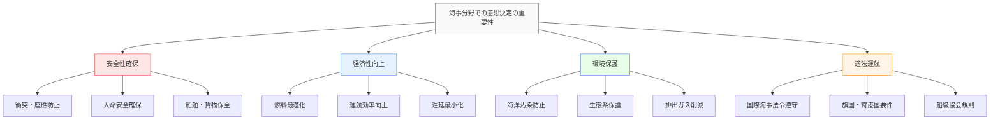
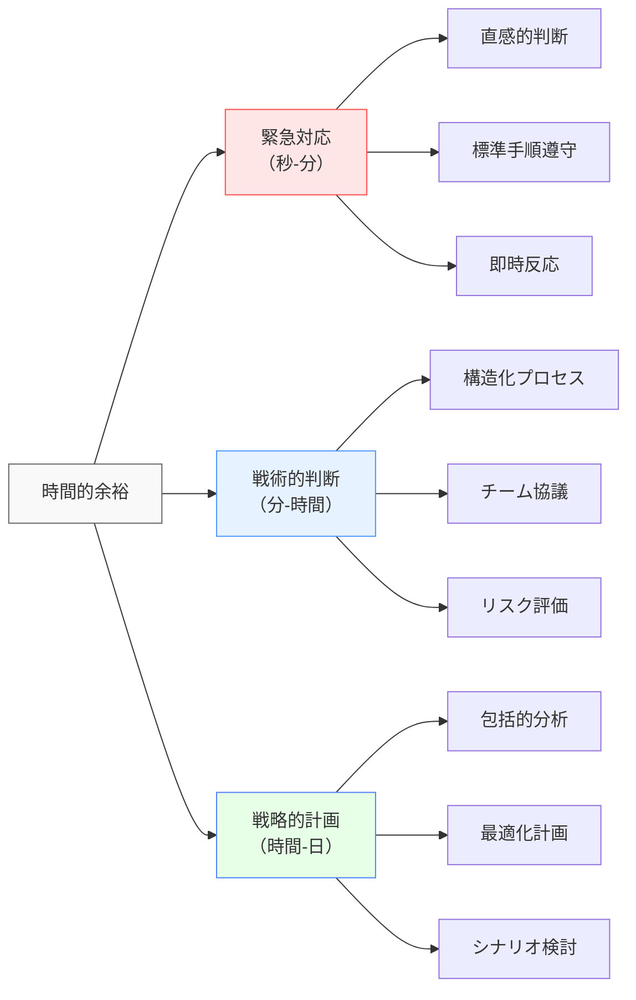
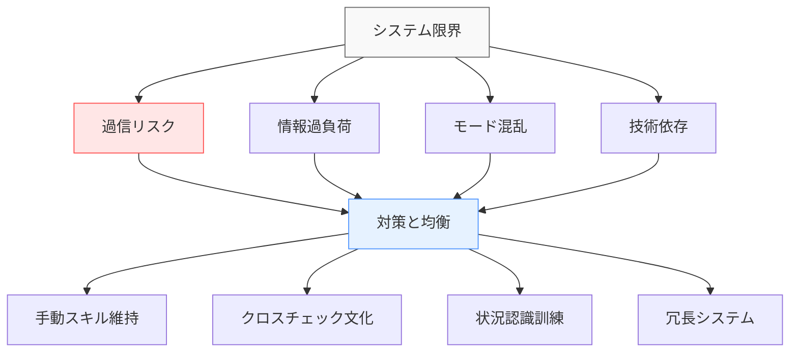
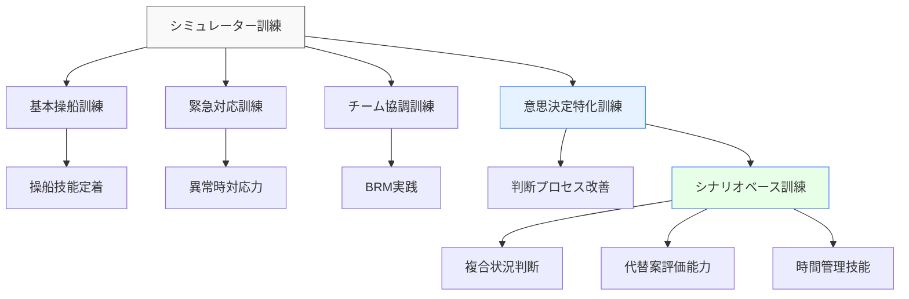
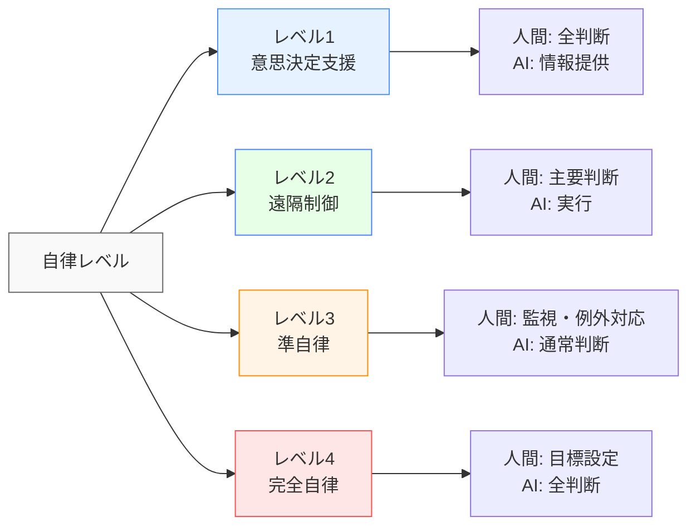
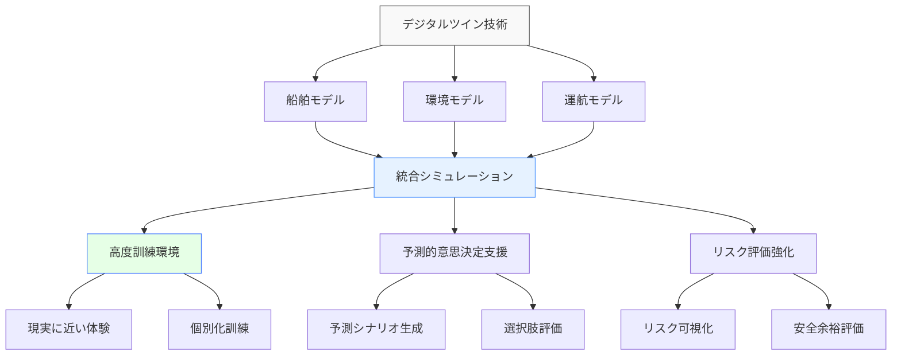

# 海事・船舶分野での意思決定

!!! info "このページについて"
    このページでは、海事・船舶分野における意思決定（Decision Making）の重要性と応用について詳しく解説します。船長、航海士、機関士、水先人など、海事業界に関わる専門職の意思決定プロセスと、その訓練・改善方法について学びます。

## 海事分野での意思決定の特徴

海事分野における意思決定は、広大な海域や港湾での長期間の運航を特徴とし、他の輸送分野とは異なる特性を持っています。

### 固有の環境特性

| 特性 | 説明 | 意思決定への影響 |
|------|------|----------------|
| **広範な時間スケール** | 短期（緊急対応）から<br>長期（航海計画）まで | 戦略的・戦術的判断の併用<br>時間的余裕の使い分け |
| **地理的孤立性** | 陸地から遠く離れた環境<br>限られた支援体制 | 自律的判断の必要性<br>資源制約下での決断 |
| **自然環境依存** | 気象・海象条件の大きな影響<br>予測困難な変化 | 柔軟な計画変更能力<br>不確実性への対応 |
| **国際的環境** | 多国籍クルー<br>多様な港湾・規則 | 文化的差異の考慮<br>状況適応型コミュニケーション |
| **重大な結果** | 環境・財産・人命への影響大<br>高価値資産の責任 | 慎重かつ体系的な判断<br>リスク評価の徹底 |

### 意思決定の重要性



## 意思決定モデルと戦略

### 海事特有の意思決定モデル

=== "マリナー実践モデル"
    #### マリナー実践モデル

    経験豊富な船舶運航者が実際に使用する実践的な意思決定アプローチです。

    ```mermaid
    graph LR
        A[情報収集<br>Information] --> B[状況評価<br>Assessment]
        B --> C[選択肢検討<br>Options]
        C --> D[決定と行動<br>Action]
        D --> E[効果確認<br>Evaluation]
        E --> A
        
        style A fill:#e6f2ff,stroke:#4d94ff
        style C fill:#e6ffe6,stroke:#4d7fff
        style D fill:#ffe6e6,stroke:#ff4d4d
    ```

    ##### マリナーモデルのステップ詳細

    | 段階 | 主な活動 | キー質問 | 意思決定の焦点 |
    |------|----------|----------|---------------|
    | **情報収集** | 航海情報確認<br>気象データ入手<br>交通状況把握 | 「現在の状況は？」<br>「どんな情報が必要か？」 | 正確なデータ収集<br>状況認識の確立 |
    | **状況評価** | 危険要素の特定<br>制約条件の分析<br>優先事項の確認 | 「リスクは何か？」<br>「制約は何か？」 | リスク分析<br>全体状況の理解 |
    | **選択肢検討** | 複数選択肢の特定<br>リスク・利点評価<br>可能性の比較 | 「選択肢は何か？」<br>「トレードオフは？」 | 体系的な比較<br>選択肢の網羅 |
    | **決定と行動** | 最適解の選択<br>命令の発出<br>実行計画の展開 | 「どう行動するか？」<br>「誰が何をするか？」 | 明確な指示<br>決定の実行 |
    | **効果確認** | 結果の監視<br>予測との比較<br>必要な調整 | 「結果は期待通りか？」<br>「調整は必要か？」 | フィードバック分析<br>継続的改善 |


=== "BRM意思決定フレームワーク"
    #### BRM意思決定フレームワーク

    Bridge Resource Management（BRM）は航空分野のCRMを海事分野に適応させたもので、チームでの協調的意思決定を促進します。

    ```mermaid
    graph TD
        A[ブリッジチーム意思決定] --> B[情報共有]
        A --> C[役割分担]
        A --> D[明確な意思疎通]
        A --> E[チーム監視]
        
        B --> B1[状況認識の統合]
        B --> B2[知識の共有]
        
        C --> C1[責任の明確化]
        C --> C2[作業負荷の分散]
        
        D --> D1[標準用語の使用]
        D --> D2[閉ループコミュニケーション]
        
        E --> E1[相互チェック]
        E --> E2[エラー検出]
        
        style A fill:#f9f9f9,stroke:#666
        style B fill:#e6f2ff,stroke:#4d94ff
        style E fill:#e6ffe6,stroke:#4d7fff
    ```

    ##### BRMの主要原則

    | 原則 | 説明 | 意思決定への貢献 |
    |------|------|----------------|
    | **階層を超えた意見交換** | 権威勾配を緩和し<br>全メンバーの参加を促進 | 包括的視点の獲得<br>盲点の減少 |
    | **役割の明確化** | 職務分担と責任の<br>明確な定義 | 混乱の防止<br>包括的監視の確保 |
    | **共有メンタルモデル** | 状況の共通理解と<br>計画の共有 | チーム連携の強化<br>一貫した行動 |
    | **効果的コミュニケーション** | 明確で構造化された<br>情報交換 | 誤解の防止<br>時間効率の向上 |
    | **作業負荷管理** | 個人・チームの<br>負荷の調整 | ストレス軽減<br>パフォーマンス維持 |

### 時間的余裕と意思決定アプローチ

海事分野では、利用可能な時間に応じて異なる意思決定アプローチが適用されます。



## 職種別の意思決定特性

=== "船長（Master）"
    ### 船長（Master）

    船長は船舶の最高責任者として、最終意思決定権と全責任を負います。

    #### 船長の意思決定領域

    | 意思決定領域 | 主要判断事項 | 考慮要素 | 意思決定時間枠 |
    |------------|-------------|----------|--------------|
    | **航海管理** | 航路選択<br>速力設定<br>錨泊判断 | 気象・海象<br>燃料効率<br>到着予定 | 運航全体<br>（長期・戦略的） |
    | **安全管理** | 緊急対応<br>危険回避<br>船体保全 | 乗組員・乗客安全<br>船舶・貨物保全<br>環境保護 | 状況発生時<br>（短期・緊急） |
    | **人員管理** | 当直配置<br>作業許可<br>訓練実施 | 乗員能力<br>疲労管理<br>多文化環境 | 定期的<br>（中期・管理的） |
    | **貨物管理** | 積載計画<br>安定性確保<br>貨物保全 | 船舶安全<br>貨物特性<br>港湾状況 | 港湾作業時<br>（中期・運用的） |

    #### 船長の意思決定バランス

    船長は以下の要素間でバランスを取りながら意思決定を行います。

    ```mermaid
    graph TD
        A[船長の意思決定バランス] --> B[安全性]
        A --> C[スケジュール]
        A --> D[経済性]
        A --> E[法令遵守]
        
        B -.-> C
        C -.-> D
        D -.-> E
        E -.-> B
        
        style A fill:#f9f9f9,stroke:#666
        style B fill:#ffe6e6,stroke:#ff4d4d,stroke-width:2px
    ```

=== "航海士（Navigation Officer）"
    ### 航海士（Navigation Officer）

    航海士は当直責任者として、即時的な航海判断を担当します。

    #### 航海士の意思決定の特徴

    ##### 当直時の主要判断ポイント

    - **他船との遭遇**: 衝突予防規則（COLREG）に基づく回避行動
    - **航路保持**: 計画航路からの逸脱判断と修正
    - **気象対応**: 荒天時の速力調整や針路変更
    - **浅水域航行**: 水深と喫水の安全マージン確保
    - **設備異常**: 航海機器の不具合時の代替手段選択

    ##### 判断フローの例：他船との遭遇

    ```mermaid
    sequenceDiagram
        participant D as 発見
        participant E as 評価
        participant A as 行動
        participant M as 監視
        
        D->>E: 他船の初期探知
        E->>E: 衝突リスク評価
        E->>A: 衝突のおそれ判断
        A->>A: COLREGに基づく行動
        A->>M: 避航効果の監視
        M->>E: 状況再評価
    ```

=== "機関士（Engineering Officer）"
    ### 機関士（Engineering Officer）

    機関士は推進系統と船舶設備の運用・保守に関する意思決定を行います。

    #### 機関部の意思決定領域

    | 意思決定領域 | 主な判断事項 | 特有の考慮点 | 意思決定アプローチ |
    |------------|-------------|------------|-----------------|
    | **機関運転管理** | 出力調整<br>燃料切替<br>パラメータ監視 | 効率最適化<br>排出規制対応<br>故障予兆検知 | データ駆動型<br>予防的対応 |
    | **保守管理** | 整備優先順位<br>部品交換時期<br>修理方法 | 運航スケジュール<br>在庫状況<br>技術制約 | コスト・ベネフィット<br>リスクベース |
    | **故障対応** | 故障原因特定<br>応急処置<br>恒久対策 | 安全性維持<br>二次被害防止<br>運航継続性 | 体系的トラブル<br>シューティング |
    | **資源管理** | 燃料・潤滑油管理<br>予備品確保<br>人員配置 | 航海距離<br>補給機会<br>特殊環境 | 長期計画<br>シナリオベース |

=== "水先人（Pilot）"
    ### 水先人（Pilot）

    水先人は地域特有の専門知識を活かして、狭水域での航行や入出港操船の意思決定を支援します。

    #### 水先業務での意思決定特性

    水先人の意思決定は、短時間で行われる高度に専門的なものです。

    - **局所的知識に基づく判断**: 港湾特有の潮流、水深、風の影響の理解
    - **船舶特性の迅速評価**: 短時間で船舶の操縦性能を把握し対応
    - **船長との協働判断**: 正式な権限は船長にあるが専門的助言を提供
    - **先行的判断**: 問題を事前に予測し、予防的に対処

    ##### 入港操船での判断シーケンス

    ```mermaid
    graph TD
        A[初期評価] --> B[アプローチ計画]
        B --> C[船橋チーム連携]
        C --> D[推進・舵力調整]
        D --> E[速度制御判断]
        E --> F[接岸位置調整]
        F --> G[最終接岸判断]
        
        A --> A1[船舶特性<br>気象条件<br>港湾状況]
        B --> B1[水路選択<br>回頭位置<br>予備計画]
        C --> C1[役割明確化<br>情報共有<br>指示伝達]
        
        style A fill:#e6f2ff,stroke:#4d94ff
        style D fill:#e6ffe6,stroke:#4d7fff
        style G fill:#ffe6e6,stroke:#ff4d4d
    ```

## 意思決定支援システム

### 統合ブリッジシステムと意思決定支援

現代の船舶では、複数のシステムが統合され、乗組員の意思決定を支援しています。

#### 主要な意思決定支援技術

| システム | 主な機能 | 意思決定支援の側面 |
|----------|----------|-------------------|
| **ECDIS<br>(Electronic Chart Display and Information System)** | 電子海図表示<br>航路計画作成<br>安全等深線設定 | 航路選択の最適化<br>危険海域の視覚化<br>航行安全管理 |
| **レーダー/ARPA** | 他船探知・追跡<br>衝突危険度計算<br>回避行動支援 | 衝突リスク評価<br>最適回避方法選択<br>交通状況把握 |
| **航海情報表示システム<br>(Conning Display)** | 操船情報統合<br>推進・舵状態表示<br>環境情報統合 | 直感的状況把握<br>操船パラメータ監視<br>総合判断支援 |
| **VDR<br>(Voyage Data Recorder)** | 航海データ記録<br>音声記録<br>事後分析 | 過去判断の検証<br>改善点の特定<br>再発防止策立案 |

#### 統合ブリッジシステムの限界と対策



### 船舶管理システム

#### 意思決定支援の統合的アプローチ

=== "船舶性能監視システム"
    **効率と安全のバランス判断**
    
    - 燃料消費のリアルタイム監視と最適化提案
    - 推進効率データに基づく速力・出力設定支援
    - 環境規制（排出規制海域等）対応の意思決定支援
    - 船体・プロペラ状態の評価と整備時期判断

=== "陸上支援システム"
    **船陸間の協働意思決定**
    
    - 気象ルーティングによる航路最適化提案
    - 遠隔技術支援による機関トラブル対応判断
    - 港湾情報リアルタイム共有による寄港計画調整
    - フリート全体最適化のための運航調整提案

## 訓練と評価

### 意思決定スキルの訓練アプローチ

#### シミュレーターを活用した訓練



#### BRMトレーニング

BRM（Bridge Resource Management）は、ブリッジチームの効果的な意思決定のための訓練です。

| トレーニング要素 | 内容 | 意思決定能力への効果 |
|----------------|------|-------------------|
| **シナリオ演習** | 複合的な問題設定<br>役割分担実践<br>実時間対応 | 状況対応力向上<br>優先順位付け能力<br>チーム連携強化 |
| **コミュニケーション訓練** | 明確な情報伝達<br>閉ループ確認<br>標準用語使用 | 情報共有最適化<br>誤解防止<br>効率的判断支援 |
| **ケーススタディ** | 実際の事故分析<br>失敗要因特定<br>教訓抽出 | 判断バイアス認識<br>失敗パターン理解<br>予防的思考強化 |
| **リーダーシップ演習** | 役割交代体験<br>権限委譲訓練<br>指示能力開発 | 決断力向上<br>責任感醸成<br>チーム統率力強化 |

### 評価方法

#### 意思決定能力の測定アプローチ

=== "客観的評価"
    **定量的アプローチ**
    
    - **パフォーマンス測定**: 安全パラメータ（最接近距離、余裕水深等）
    - **時間効率性**: 判断速度と適切性のバランス
    - **エラー分析**: 種類・頻度・影響度の統合評価
    - **遵守評価**: 標準手順・規則の適切な適用度

=== "主観的評価"
    **定性的アプローチ**
    
    - **自己評価**: 判断プロセスの振り返りと分析
    - **ピア評価**: チームメンバーからのフィードバック
    - **指導者評価**: 訓練監督者による総合評価
    - **振り返りセッション**: グループディスカッションでの教訓抽出

## 事例分析

### 意思決定成功事例

=== "MS Estonia救助船の判断（1994年）"
    **困難条件下での迅速かつ効果的な意思決定**
    
    #### 状況
    バルト海でエストニア号が沈没し、荒天下で多数の生存者が海上に投げ出された。救助船「Silja Europa」は激しい嵐と高波の中で救助活動を実施。
    
    #### 意思決定プロセス
    - **情報収集**: 遭難信号の確認、位置特定、気象状況評価
    - **リスク評価**: 自船への危険と救助可能性のバランス
    - **資源配分**: 救命艇と乗組員の最適配置
    - **優先順位決定**: 最も生存の可能性がある場所への集中
    - **継続的再評価**: 状況変化に応じた救助戦略の調整
    
    #### 成功要因
    - 明確な指揮系統と役割分担
    - 迅速ながら計画的な判断
    - チーム全体の状況認識共有
    - 困難な条件下での適応的判断
    - 安全性と救助効率のバランス

=== "Mitsui O.S.K. Linesの気象回避判断（2015年）"
    **事前予測に基づく予防的意思決定**
    
    #### 状況
    太平洋を航行中のコンテナ船が、進路上に発達する熱帯低気圧（台風）の予測を受信。
    
    #### 意思決定プロセス
    - **早期情報分析**: 気象予報データの詳細分析と進路予測
    - **シナリオ評価**: 複数の回避オプションの検討（速度調整、進路変更）
    - **リスク・コスト評価**: 各選択肢の安全性、時間、燃料消費の分析
    - **陸上との協議**: 運航管理部門との情報共有と専門助言
    - **段階的実施**: 状況進展に合わせた計画調整
    
    #### 成功要因
    - 予防的思考と早期対応
    - データに基づく体系的判断
    - 船陸協働による判断強化
    - 複数選択肢の準備
    - 継続的状況監視と計画適応

### 意思決定失敗事例

=== "コスタ・コンコルディア号事故（2012年）"
    **不適切な意思決定チェーンによる大規模事故**
    
    #### 状況
    イタリア沿岸でのクルーズ船が船長の判断で予定航路を外れ、島に接近。岩礁に接触して転覆し32名が死亡。
    
    #### 意思決定の問題点
    - **非公式計画変更**: 正規の航路計画プロセスを無視
    - **リスク評価不足**: 接近航行の危険性を過小評価
    - **権威勾配**: 船長の決定に疑問を呈する文化の欠如
    - **状況認識欠如**: 船位と危険の認識不足
    - **危機対応の遅延**: 問題認識後の緊急対応遅延
    
    #### 教訓
    - 標準手順の重要性
    - チェック・バランスの必要性
    - リスク評価の徹底
    - 役割と責任の明確化
    - 緊急時の迅速な状況評価と対応

=== "メガボア号事故（1964年）"
    **チーム意思決定の失敗と情報共有不足**
    
    #### 状況
    東京湾で貨物船メガボア号とタンカー春徳丸が衝突。視界制限状態での不適切な判断が事故の原因。
    
    #### 意思決定の問題点
    - **単独判断**: 当直航海士が船長と相談せず
    - **情報解釈の誤り**: レーダー情報の誤った解釈
    - **不十分な情報共有**: 見張り情報の統合失敗
    - **標準手順無視**: 視界制限時の特別手順不履行
    - **確証バイアス**: 自己の判断が正しいという思い込み
    
    #### 教訓
    - チーム意思決定の重要性
    - 情報の適切な解釈と統合
    - 不確実性下での追加確認
    - 標準手順の遵守
    - バイアス認識と対策

## 将来の展望

### 自律運航船（MASS）と意思決定

#### 自動化レベルと人間の意思決定

自律運航船（MASS: Maritime Autonomous Surface Ship）の発展により、意思決定の責任と役割が変化します。



#### AI支援意思決定の新たな課題

| 課題 | 説明 | 対応アプローチ |
|------|------|--------------|
| **責任の所在** | 自律システムの判断に関する<br>法的・倫理的責任 | 明確な責任フレームワーク<br>段階的実装と検証 |
| **信頼性と検証** | AIの判断プロセスの<br>透明性と検証可能性 | 説明可能AI (XAI)<br>包括的テスト環境 |
| **人間との協調** | AIと人間の強みを活かした<br>意思決定分担 | 適応的自動化<br>人間中心設計 |
| **異常時対応** | 想定外状況での<br>判断能力 | エッジケース訓練<br>ロバスト設計 |
| **倫理的判断** | 倫理的ジレンマ状況での<br>意思決定 | 倫理的ガイドライン<br>価値観の明示的組込み |

### デジタルツインと意思決定訓練



### 国際的な取り組み

<div class="grid cards" markdown>

-   #### IMO（国際海事機関）

    ---

    **安全・効率向上のための国際的取り組み**
    
    - e-Navigation戦略の推進
    - MASSに関する規制フレームワーク整備
    - 人的要因・訓練基準の継続的見直し
    - STCWコードの現代化


-   #### 各国の取り組み

    ---
    
    - **日本**: 自動運航船実証プロジェクト
    - **ノルウェー**: 自律船舶テストエリアの設置
    - **シンガポール**: スマートポート構想と自律船対応
    - **欧州連合**: Sea Traffic Management（STM）

</div>

## まとめ

海事分野での意思決定は、以下の特徴を持ちます。

### 重要なポイント

1. **多層的時間軸**: 緊急判断から長期計画まで幅広い時間スケールでの意思決定
2. **チーム連携**: Bridge Resource Management（BRM）による協調的判断の重要性
3. **環境適応**: 気象・海象条件への継続的対応と計画調整
4. **技術との協調**: 高度なシステムを活用しつつ、人間判断の重要性を維持
5. **国際的枠組み**: 世界共通のルールと地域差を考慮した柔軟な適用

### 成功する意思決定の要素

海事分野で効果的な意思決定を行うための重要な要素。

- **構造化プロセス**: マリナーモデルなどの体系的アプローチの活用
- **プロアクティブ判断**: 予防的思考と先行的対応
- **柔軟な適応性**: 変化する状況への迅速な対応能力
- **効果的コミュニケーション**: チーム内での明確な情報共有
- **経験と訓練の統合**: 実践的知識と理論的基盤の両立
- **継続的学習**: 事例分析と経験からの教訓抽出

海事分野の意思決定は、海洋という予測困難な環境での長期間の安全運航を支える基盤であり、技術の進化とともに今後も発展を続けるでしょう。

## 関連リンク

- [基本概念：意思決定とは](../basics/decision-making.md)
- [海事分野での状況認識](./maritime-sa.md)
- [意思決定の理論と実践：不確実性下の意思決定](../decision-making-guide/uncertainty.md)
- [意思決定トレーニング](../decision-making-guide/decision-training.md)

## 参考文献

1. IMO. (2019). *Bridge Resource Management (BRM) in Practice*. International Maritime Organization.
2. Hetherington, C., Flin, R., & Mearns, K. (2006). Safety in shipping: The human element. *Journal of Safety Research, 37*(4), 401-411.
3. Chauvin, C., Lardjane, S., Morel, G., Clostermann, J. P., & Langard, B. (2013). Human and organisational factors in maritime accidents: Analysis of collisions at sea using the HFACS. *Accident Analysis & Prevention, 59*, 26-37.
4. 国土交通省海事局. (2021). *自動運航船舶の安全設計ガイドライン*. 
5. Cordon, J. R., Mestre, J. M., & Walliser, J. (2017). Human factors in seafaring: The role of situation awareness. *Safety Science, 93*, 256-265.
6. IAMU. (2019). *Maritime Education and Training: Current Practices, Emerging Challenges and Future Directions*. International Association of Maritime Universities.
7. Øvergård, K. I., Nielsen, A. R., Nazir, S., & Sorensen, L. J. (2015). Assessing navigational teamwork through the analysis of team communications. *Procedia Manufacturing, 3*, 2551-2558.
8. 日本海事協会. (2020). *海事産業の自律化に関する研究報告書*. ClassNK.