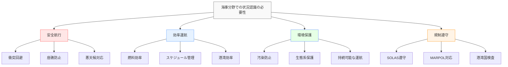
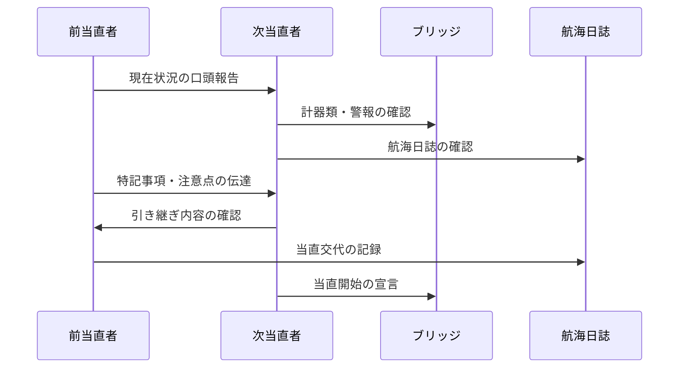
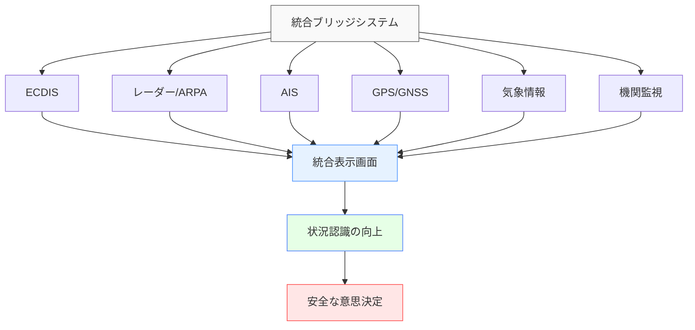
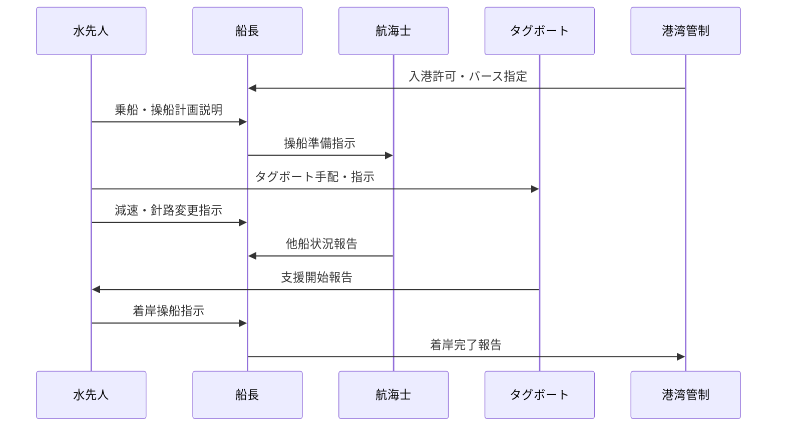
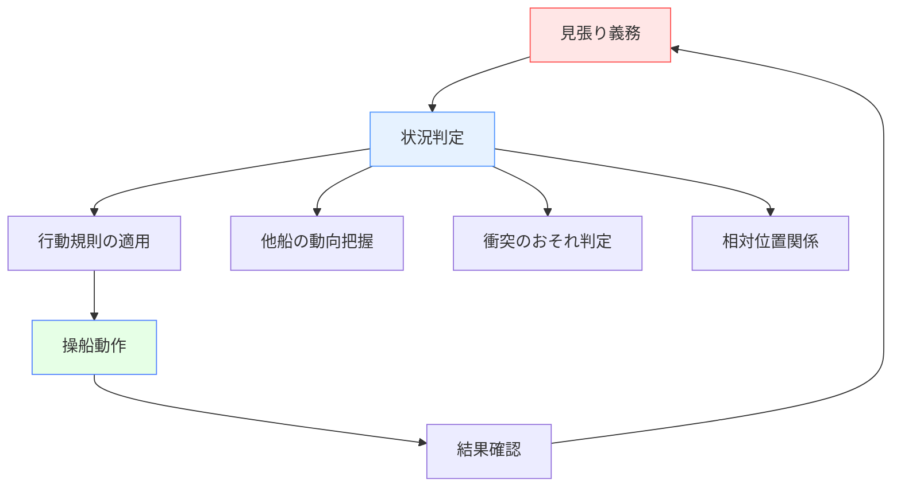
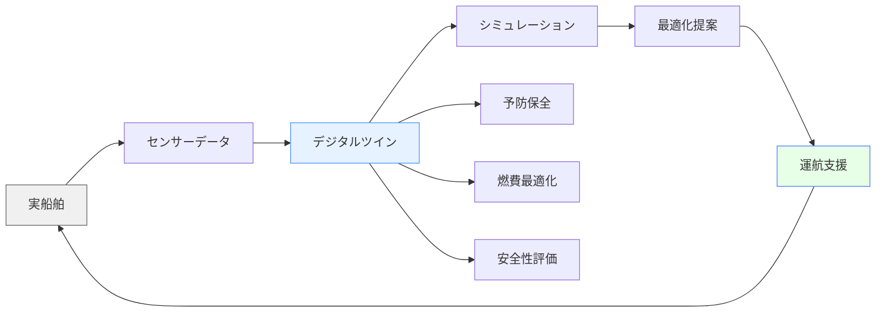

# 海事・船舶分野での状況認識

!!! info "このページについて"
    このページでは、海事・船舶分野における状況認識（Situational Awareness）の重要性と応用について詳しく解説します。船長、航海士、機関士、港湾関係者など、海事業界に関わる全ての職種での状況認識の実践例を学びます。

## 海事分野での状況認識の特徴

海事分野は、広大な海域での長期間の航行を特徴とし、航空分野とは異なる独特の状況認識要件があります。

### 固有の環境特性

| 特性 | 説明 | 状況認識への影響 |
|------|------|----------------|
| **2次元広域移動** | 主に水平面での移動 数千キロの長距離航行 | 相対位置の把握 長期的な航路計画 |
| **時間的余裕** | 航空機に比べ低速移動 意思決定に時間的余裕 | 慎重な判断が可能 予防的対応の重要性 |
| **気象・海象依存** | 海風、波浪、潮流の影響 視界制限（霧、雨等） | 間接情報への高依存 自然条件の予測 |
| **国際航路** | 多国間を移動 異なる規則・慣習 | 国際規則の理解 文化的適応力 |
| **限られた人員** | 少人数での長期航行 24時間体制の維持 | 疲労管理 役割の多重化 |

### 状況認識が求められる理由

## 職種別の状況認識

### 船長（Captain）

船長は船舶運航の最高責任者として、総合的な状況認識が求められます。

#### 船長の状況認識の3レベル

=== "レベル1: 知覚（Perception）"
    **海況・船舶・環境からの情報収集**
    
    - **航海情報**: 位置、針路、速力、水深
    - **気象情報**: 風向・風速、波高、視程、気圧
    - **交通情報**: 他船位置、AIS情報、VHF交信
    - **船舶状態**: 機関状況、荷役状態、安定性
    
    !!! example "知覚の例"
        「現在位置：東経140度30分、北緯35度15分、針路090度、速力12ノット、南西の風15ノット、視程8海里、前方2海里に貨物船」

=== "レベル2: 理解（Comprehension）"
    **情報の統合と航行状況の把握**
    
    - **航行安全の評価**: 現在の针路は安全か、他船との関係
    - **気象影響の判断**: 天候変化が航行に与える影響
    - **スケジュール管理**: 港湾到着予定時刻との整合性
    - **法規制の適用**: 現在海域の適用規則、制限事項
    
    !!! example "理解の例"
        「現在の針路で安全に航行中。前方の貨物船は右舷を通過予定。気圧の低下により6時間後に天候悪化の可能性。現在の速力で予定通り明朝入港可能」

=== "レベル3: 予測（Projection）"
    **将来状況の予測と計画策定**
    
    - **航路予測**: 現在針路の継続可能性と調整の必要性
    - **気象予測**: 天候変化による航行への影響
    - **港湾計画**: 入港時の潮汐、バース状況、荷役計画
    - **緊急時対応**: 異常事態発生時の対応策
    
    !!! example "予測の例"
        「6時間後の低気圧接近により波高3メートル、風速25ノットと予想。現在の針路を10度南に変更し、速力を9ノットに減速することで、安全に航行し、予定より3時間遅れで入港可能」

### 航海士（Navigation Officer）

航海士は航海当直を担当し、継続的な状況監視を行います。

#### 航海当直での状況認識

| 当直時間帯 | 主な監視項目 | 特有の課題 | 対応策 |
|-----------|-------------|-----------|--------|
| **昼間当直 (08:00-12:00, 12:00-16:00)** | 視覚による他船確認 気象観測 位置確認 | 太陽による視界障害 交通量の多い時間帯 | 双眼鏡活用 レーダー併用 頻繁な見張り |
| **夜間当直 (20:00-24:00, 00:00-04:00)** | 灯火による他船識別 レーダー監視 自動操舵監視 | 視界制限 疲労の蓄積 居眠りリスク | 照明調整 定期的な位置確認 アラーム設定 |
| **薄明当直 (04:00-08:00, 16:00-20:00)** | 昼夜の切り替え 漁船活動の監視 沿岸航行 | 急激な視界変化 漁船群との遭遇 沿岸交通 | 早期の灯火点灯 VHF監視強化 減速航行 |

#### 当直交代時の引き継ぎ

### 機関士（Engineering Officer）

機関士は推進システムと船舶の動力系統の監視・管理を担当します。

#### 機関部の状況認識

=== "主機関（メインエンジン）"
    **推進力の管理**
    
    - 回転数、出力、燃料消費の監視
    - 冷却水温度、潤滑油圧力の確認
    - 振動、異音の検知
    - 環境負荷（NOx、SOx排出）の管理

=== "補機類（Auxiliary Machinery）"
    **船舶システムの維持**
    
    - 発電機の運転状況
    - 冷凍・空調システム
    - 舵取機、ウインドラス等の甲板機械
    - 消防・安全システム

=== "燃料・潤滑油管理"
    **エネルギー資源の最適化**
    
    - 燃料消費量の監視と最適化
    - 燃料品質の管理
    - タンク液位の確認
    - 環境規制への対応

### 水先人（Pilot）

水先人は特定海域での専門知識により、船舶の安全な航行を支援します。

#### 水先業務での状況認識

| 段階 | 主な活動 | 状況認識のポイント |
|------|-----------|-------------------|
| **乗船前** | 船舶情報の確認 気象・海象の把握 港湾状況の確認 | 船舶特性の理解 当日の環境条件 港湾交通状況 |
| **乗船時** | 船長・航海士との打合せ 操船設備の確認 航行計画の説明 | チーム状況認識の構築 設備能力の把握 共通理解の確立 |
| **航行中** | 針路・速力の指示 交通整理 緊急時対応 | 動的状況の管理 予測的判断 リスク評価 |
| **着岸時** | 精密な船位制御 タグボート連携 係船作業監督 | 複数要素の統合 チーム協調 安全確保 |

## 技術システムと状況認識

### 航海支援システム

現代の船舶は高度に統合された航海支援システムにより、航海士の状況認識を支援しています。

#### 統合ブリッジシステム（IBS: Integrated Bridge System）

| システム | 主な機能 | 状況認識への貢献 |
|----------|----------|----------------|
| **ECDIS (Electronic Chart Display and Information System)** | 電子海図表示 航路計画作成 | 精密な位置情報 視覚的な航路表示 |
| **レーダー (ARPA: Automatic Radar Plotting Aid)** | 他船探知・追跡 衝突針路の計算 | 他船の動静把握 衝突予測・回避 |
| **AIS (Automatic Identification System)** | 船舶情報の自動交換 VHF統合通信 | 他船の詳細情報 意図の把握 |
| **GPS/GNSS** | 高精度測位 時刻同期 | 正確な位置情報 システム基準 |

#### 航海データの統合表示

### 気象・海象情報システム

#### 海上気象情報の収集・活用

=== "衛星気象情報"
    **広域気象の把握**
    
    - 雲画像による天気系の確認
    - 台風・低気圧の位置・発達予測
    - 海面水温、海氷情報
    - 長期予報による航路計画

=== "数値予報モデル"
    **高精度な気象予測**
    
    - 48-72時間先までの詳細予報
    - 風向風速、波高、視程の予測
    - 局地的な気象変化の把握
    - 最適航路の算出

=== "リアルタイム観測"
    **現在の海況把握**
    
    - 船上気象観測機器
    - 海洋観測ブイからの情報
    - 他船からの気象通報
    - 沿岸観測所のデータ

### 自動化システムとの協調

#### オートパイロット（自動操舵）システム

| 機能 | 特徴 | 人間の役割 | 協調のポイント |
|------|------|-----------|---------------|
| **針路保持** | 設定針路の自動維持 風・潮流の自動修正 | 針路設定・変更 システム監視 | 環境変化への適応 手動介入のタイミング |
| **航跡追従** | 予定航路の自動追従 ウェイポイント間航行 | 航路計画・修正 異常時対応 | 計画の妥当性確認 状況変化への対応 |
| **動的測位** | 位置の自動保持 風・潮流の自動補正 | 位置設定・監視 安全範囲設定 | 環境限界の判断 緊急時の手動制御 |

!!! warning "自動化の限界"
    海上では突発的な気象変化や他船の急激な動きなど、予測困難な状況が発生します。自動化システムへの過度の依存は危険であり、常に手動介入の準備と状況監視が必要です。

## 航行段階別の状況認識

### 出港・離岸

#### 港内航行での状況認識

| 段階 | 主な課題 | 状況認識のポイント | 技術的支援 |
|------|----------|--------------------|-----------|
| **離岸準備** | 係船索解放 機関始動 出港許可 | 港内交通状況 気象条件 潮汐情報 | 港湾管理システム VTMS（船舶通報管制） |
| **港内航行** | 狭い水路 他船との輻輳 速力制限 | 相互運動の予測 操船余地の確保 通信による協調 | AIS 港内レーダー VHF通信 |
| **港外へ** | 航路開始 外洋への変移 針路設定 | 気象変化 航路交通 運航計画 | ECDIS 気象ルーティング 衛星通信 |

### 沖合航行

#### 長距離航海での状況認識

=== "洋上航行"
    **外洋での状況管理**
    
    - **気象管理**: 台風回避、最適航路選択
    - **燃料管理**: 消費量監視、給油港計画
    - **疲労管理**: 当直ローテーション、十分休息
    - **通信管理**: 定期報告、緊急時連絡体制

=== "沿岸航行"
    **沿岸での注意点**
    
    - **交通密度**: 漁船、プレジャーボート等
    - **水深変化**: 浅瀬、暗礁への注意
    - **規制海域**: 漁場、軍事演習場等
    - **緊急避難**: 避難港、錨地の把握

### 入港・着岸

#### 港内操船での高度な状況認識

## 事故事例と教訓

海事業界の事故分析から、状況認識の重要性と失敗要因を学ぶことができます。

### 代表的な海難事故と状況認識

=== "タイタニック号事故（1912年）"
    **見張り不十分による衝突事故**
    
    - **問題点**: 氷山の発見遅れ、適切な見張り体制の欠如
    - **SA関連要因**:
        - 知覚の困難（夜間、海氷の視認困難）
        - 理解の不足（氷山群の危険性軽視）
        - 予測の失敗（衝突回避行動の遅れ）
    - **教訓**: 24時間見張り体制、レーダー・ソナーの重要性

=== "エクソンバルディーズ号事故（1989年）"
    **座礁による大規模油流出**
    
    - **問題点**: 航海士の疲労、自動操舵への過信、ルート変更
    - **SA関連要因**:
        - 疲労による注意力低下
        - 自動化システムへの過信
        - 変更航路での状況認識不足
    - **教訓**: 疲労管理、手動監視の重要性、環境保護意識

=== "コスタコンコルディア号事故（2012年）"
    **不適切な操船による座礁・転覆**
    
    - **問題点**: 規定航路逸脱、危険な接岸試行、避難誘導の混乱
    - **SA関連要因**:
        - リスク評価の甘さ
        - 緊急時の状況判断ミス
        - 乗客への情報伝達の遅れ
    - **教訓**: 安全管理の徹底、緊急時対応訓練

### 状況認識失敗の典型パターン

| 失敗パターン | 典型的状況 | 海事分野の特例 | 予防策 |
|-------------|-----------|---------------|--------|
| **見張り不十分** | 他船・障害物の 発見遅れ | 霧中航行 夜間・悪天候 | レーダー活用 見張り要員増強 |
| **疲労による判断力低下** | 長時間当直 人員不足 | 長期航海 少人数体制 | 適切な休息 当直ローテーション |
| **自動化への過信** | システム監視怠慢 手動介入遅れ | 自動操舵 ECDIS依存 | 定期的な手動確認 常時監視 |
| **コミュニケーション不足** | 情報共有の欠如 指示の不明確 | 多言語環境 文化の違い | 標準用語使用 確認の徹底 |

## 国際規則と状況認識

### SOLAS条約（海上人命安全条約）

#### 状況認識に関連する主要規定

| 章 | 規定内容 | 状況認識との関連 |
|---|----------|----------------|
| **第V章 航行の安全** | 見張り、航海計画 航海機器の搭載 | 継続的監視義務 情報収集手段の確保 |
| **第VI章 貨物** | 貨物の積載・固縛 危険物の管理 | 船舶安定性の把握 危険要因の認識 |
| **第IX章 ISMコード** | 安全管理システム 会社・船舶の責任 | 組織的SA管理 継続的改善 |

### COLREG（海上衝突予防規則）

#### 衝突回避における状況認識

## 将来の展望

### 自律運航船（MASS: Maritime Autonomous Surface Ships）

#### 自動化レベルと人間の役割

| レベル | 名称 | 特徴 | 人間の状況認識 |
|--------|------|------|---------------|
| **レベル1** | 船上有人 部分自動化 | 一部システムの自動化 人間が監視・制御 | 従来同様の SA システム状態も監視 |
| **レベル2** | 船上有人 遠隔制御可能 | 陸上からの遠隔監視 緊急時介入可能 | 船上・陸上双方の SA 通信システム依存 |
| **レベル3** | 船上無人 遠隔制御 | 陸上からの完全制御 定期的な人間判断 | 陸上の状況認識 データに基づく判断 |
| **レベル4** | 船上無人 完全自律 | AI による自律判断 例外時のみ人間介入 | システム設計時の SA 例外事態の対応 |

#### 技術的課題と人間の役割

=== "センサー技術"
    **環境認識の自動化**
    
    - 光学カメラ、赤外線カメラによる視覚情報
    - レーダー、ライダーによる物体検知
    - AIS、衛星通信による情報収集
    - 気象センサーによる環境監視

=== "AI・機械学習"
    **判断の自動化**
    
    - 画像認識による他船・障害物の識別
    - 機械学習による最適航路の選択
    - 予測モデルによる気象・海象の分析
    - 異常検知システムによる機関監視

=== "人間・システム協調"
    **新たな状況認識**
    
    - システム限界の理解と適切な介入
    - 遠隔監視における状況認識の維持
    - AI判断の妥当性評価
    - 例外事態への柔軟な対応

### デジタル技術の活用

#### デジタルツイン技術

#### IoT・ビッグデータの活用

- **船舶データの収集**: 機関性能、燃料消費、航行軌跡
- **気象・海象データ**: 実測値と予測モデルの統合
- **港湾データ**: 入出港記録、荷役効率、待機時間
- **運航最適化**: データ分析による効率向上提案

### 日本での取り組み

-   #### 国土交通省の施策

    ---

    - **海事生産性革命**:  ICT活用による効率化
    - **自動運航船プロジェクト**:  実証実験の推進
    - **カーボンニュートラル港湾**:  脱炭素化の推進

-   #### 産業界の動向

    ---
    
    - **日本郵船・商船三井・川崎汽船**:  自動運航船の開発
    - **三菱造船・今治造船**:  新技術船舶の建造
    - **古野電気・日本無線**:  航海機器の高度化

## まとめ

海事分野での状況認識は、以下の特徴を持ちます：

### 重要なポイント

1. **長期間・広域航行**: 持続的な監視と疲労管理が重要
2. **自然環境依存**: 気象・海象への適応力が必要
3. **国際性**: 多様な規則・文化への対応
4. **技術統合**: 従来技術と新技術の効果的な組み合わせ
5. **将来への対応**: 自動化・AI技術との協調

### システム開発への示唆

海事分野での状況認識は、システム開発の観点から以下の示唆を与えます：

- **長時間運用の考慮**: 疲労やモノトニーへの対策
- **外部環境の変動**: 不確定要素への柔軟な対応
- **グローバル対応**: 多言語・多文化への配慮
- **段階的自動化**: 人間とシステムの適切な役割分担

海事分野の状況認識は、安全性と効率性を両立させながら、環境保護と経済性も考慮した総合的なアプローチとして、今後も発展し続けることが期待されます。

## 関連リンク

- [基本概念：状況認識とは](../basics/what-is-sa.md)
- [状況認識の理論と実践：状況認識の測定方法](../situational-awareness-guide/measuring-sa.md)
- [ソフトウェア：船舶関連ソフトウェア](../software/maritime-sa-software.md)
- [ケーススタディ：海難事故事例](../case-studies/maritime-cases.md)

## 参考文献

1. IMO. (2019). *Guidelines for the regulatory framework for Maritime Autonomous Surface Ships (MASS)*. International Maritime Organization.
2. Endsley, M. R., & Robertson, M. M. (2000). Situation awareness in aircraft maintenance teams. *International Journal of Industrial Ergonomics, 26*(2), 301-325.
3. 国土交通省海事局. (2021). *自動運航船舶の安全設計ガイドライン*. 
4. Chauvin, C., Lardjane, S., Morel, G., Clostermann, J. P., & Langard, B. (2013). Human and organisational factors in maritime accidents: Analysis of collisions at sea using the HFACS. *Accident Analysis & Prevention, 59*, 26-37.
5. IAMSAR Manual. (2019). *International Aeronautical and Maritime Search and Rescue Manual*. IMO/ICAO Joint Publication.