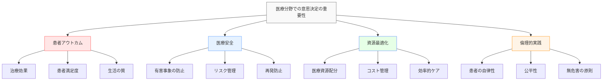
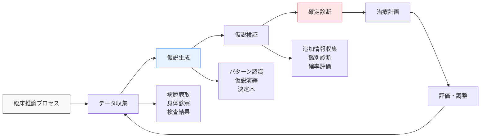
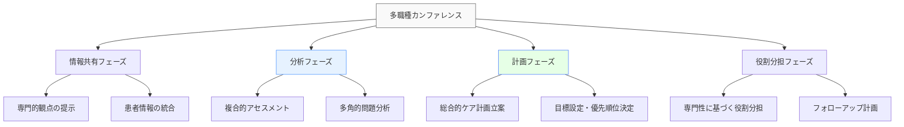
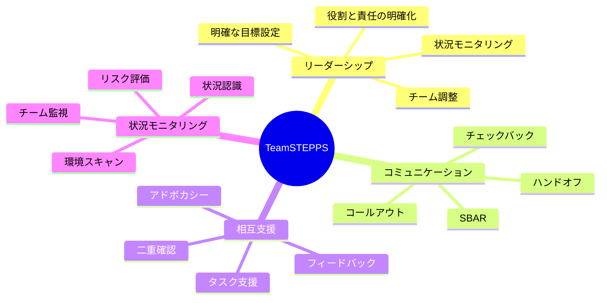
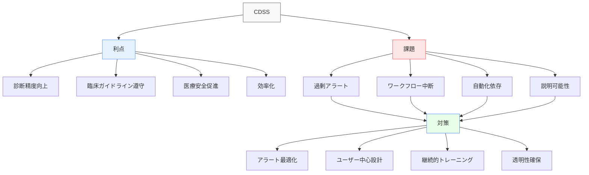
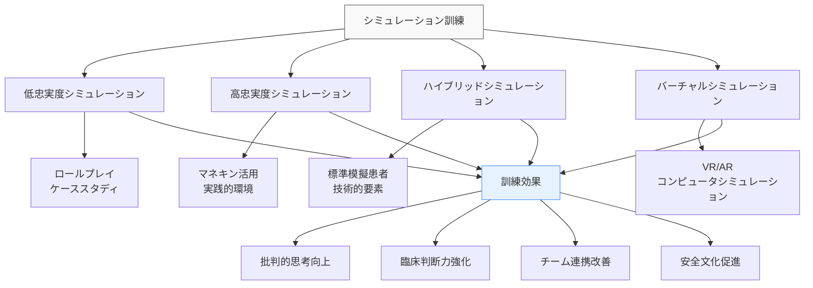
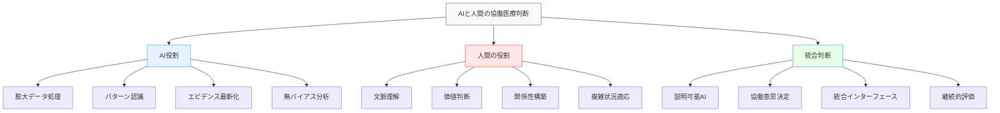

# 医療分野での意思決定

!!! info "このページについて"
    このページでは、医療分野における意思決定（Decision Making）の重要性と応用について詳しく解説します。医師、看護師、医療技師など、医療チームに関わる専門職の意思決定プロセスと、その訓練・改善方法について学びます。

## 医療分野での意思決定の特徴

医療分野における意思決定は、人命に直結し、不確実性が高く、倫理的要素を含む複雑なプロセスです。

### 固有の環境特性

| 特性 | 説明 | 意思決定への影響 |
|------|------|----------------|
| **高い不確実性** | 患者個体差<br>疾病経過の変動性 | 確率論的思考<br>柔軟な計画調整 |
| **時間的変動性** | 緊急から慢性まで<br>多様な時間軸 | 緊急度に応じた判断<br>長期的視点の必要性 |
| **倫理的側面** | 価値観の考慮<br>文化的背景の多様性 | 患者中心の判断<br>倫理原則との調和 |
| **多職種連携** | チーム医療の重要性<br>専門分化 | 意思決定の共有<br>専門知識の統合 |
| **リソース制約** | 限られた医療資源<br>コスト効率性 | 優先順位付け<br>費用対効果の考慮 |

### 医療意思決定の重要性



## 意思決定モデルと戦略

### 医療特有の意思決定モデル

=== "エビデンスに基づく医療 (EBM)"
    #### エビデンスに基づく医療（Evidence-Based Medicine）

    最新かつ最良の科学的証拠と臨床経験、患者の価値観を統合して医療判断を行うアプローチです。

    ```mermaid
    graph LR
        A[エビデンスに基づく<br>医療決定] --> B[研究エビデンス<br>最良の科学的証拠]
        A --> C[臨床経験<br>専門的判断]
        A --> D[患者価値観<br>選好・期待]
        A --> E[臨床状況<br>資源・環境]
        
        B --> F[統合的判断]
        C --> F
        D --> F
        E --> F
        
        style A fill:#f9f9f9,stroke:#666
        style F fill:#e6f2ff,stroke:#4d94ff
    ```

    ##### EBMのステップ

    | ステップ | 内容 | 決定への貢献 |
    |----------|------|-------------|
    | **臨床的疑問の定式化** | PICO形式での問い作成<br>(患者・介入・比較・転帰) | 適切な情報検索<br>的確な焦点化 |
    | **エビデンス検索** | 系統的文献検索<br>信頼性評価 | 最新知見の活用<br>科学的根拠の確保 |
    | **批判的吟味** | 研究デザイン評価<br>結果の妥当性確認 | バイアス特定<br>適用可能性評価 |
    | **患者への適用** | 個別化<br>患者と共有 | 個々の患者への適合<br>価値観の尊重 |
    | **評価** | 効果の測定<br>プロセス改善 | 継続的改善<br>経験の蓄積 |


=== "共有意思決定 (SDM)"
    #### 共有意思決定（Shared Decision Making）

    医療者と患者が情報を共有し、双方の専門性と価値観を尊重しながら共同で決定を行うプロセスです。

    ```mermaid
    graph TD
        A[共有意思決定プロセス] --> B[情報共有]
        A --> C[選択肢提示]
        A --> D[価値観の明確化]
        A --> E[合意形成]
        
        B --> B1[疾患情報]
        B --> B2[治療選択肢と結果]
        B --> B3[エビデンスの質]
        
        C --> C1[有効性比較]
        C --> C2[リスク・ベネフィット]
        C --> C3[不確実性の説明]
        
        D --> D1[患者の優先順位]
        D --> D2[重視する結果]
        D --> D3[リスク許容度]
        
        E --> E1[決定サポート]
        E --> E2[調整と同意]
        E --> E3[フォローアップ計画]
        
        style A fill:#f9f9f9,stroke:#666
        style E fill:#e6f2ff,stroke:#4d94ff
    ```

    ##### 共有意思決定の適用

    | 適用状況 | 例 | 期待される効果 |
    |----------|---|---------------|
    | **複数の選択肢が存在** | 前立腺がん治療法選択<br>出産方法の決定 | 満足度向上<br>自己効力感増強 |
    | **エビデンスの不確実性** | 新薬の長期効果<br>希少疾患の治療 | リスクの共有<br>過度の期待防止 |
    | **価値観が重要な場面** | 終末期ケア決定<br>生活変容治療 | 自律性尊重<br>アドヒアランス向上 |
    | **長期的影響のある判断** | 慢性疾患管理<br>遺伝子検査 | 長期的コミットメント<br>情報に基づく選択 |

### 臨床推論プロセス

臨床推論は医療専門職が診断と治療計画を導き出すための思考プロセスです。



#### 臨床推論の戦略

| 推論戦略 | 説明 | 適用場面 | 長所・短所 |
|----------|------|----------|-----------|
| **パターン認識** | 経験に基づく<br>直感的認識 | 典型例<br>緊急場面 | 迅速・効率的<br>バイアスリスク |
| **仮説演繹法** | 仮説設定と<br>順次検証 | 複雑症例<br>非典型例 | 体系的・網羅的<br>時間を要する |
| **定型スキーマ** | アルゴリズム<br>診断基準 | プロトコル化<br>された状況 | 標準化・一貫性<br>柔軟性不足 |
| **確率論的思考** | 事前確率と<br>尤度比 | スクリーニング<br>検査解釈 | 数量的評価<br>データ依存性 |
| **因果推論** | 病態生理に<br>基づく分析 | 複合病態<br>新規疾患 | 深い理解<br>複雑さ |

## 職種別の意思決定特性

=== "医師（Physician）"
    ### 医師（Physician）

    医師は診断から治療計画、実施、評価までの包括的な医療判断の責任を担います。

    #### 医師の意思決定領域

    | 意思決定領域 | 主要判断事項 | 考慮要素 | 意思決定時間枠 |
    |------------|-------------|----------|--------------|
    | **診断プロセス** | 疾患推定<br>検査選択<br>鑑別診断 | 症状・徴候<br>検査結果<br>疫学的特徴 | 分〜日<br>（状況により可変） |
    | **治療計画** | 治療法選択<br>薬剤選定<br>リスク評価 | エビデンスレベル<br>患者特性<br>副作用プロファイル | 分〜週<br>（疾患により異なる） |
    | **緊急対応** | 即時判断<br>処置優先順位<br>資源活用 | バイタルサイン<br>時間的制約<br>利用可能資源 | 秒〜分<br>（即時的判断） |
    | **終末期ケア** | 延命治療<br>緩和ケア<br>DNR指示 | 患者・家族の希望<br>QOL考慮<br>倫理的側面 | 時間〜月<br>（計画的判断） |

    #### 医師の意思決定バランス

    医師は以下の要素間でバランスを取りながら意思決定を行います。

    ```mermaid
    graph TD
        A[医師の意思決定バランス] --> B[科学的エビデンス]
        A --> C[臨床経験]
        A --> D[患者希望・価値観]
        A --> E[システム制約]
        
        B -.-> C
        C -.-> D
        D -.-> E
        E -.-> B
        
        style A fill:#f9f9f9,stroke:#666
        style B fill:#e6f2ff,stroke:#4d94ff,stroke-width:2px
    ```

=== "看護師（Nurse）"
    ### 看護師（Nurse）

    看護師は患者ケアの最前線で継続的な判断を行い、状態変化の早期発見と対応に重要な役割を果たします。

    #### 看護判断の特徴

    ##### 主要な意思決定シーン

    - **ケアプラン策定**: アセスメント情報に基づく看護計画立案
    - **状態変化対応**: 患者状態悪化時の初期対応と通報判断
    - **優先順位設定**: 複数患者の緊急度・重症度判断
    - **リソース配分**: 限られた時間・資源の効率的配分
    - **患者アドボカシー**: 患者の権利・希望を代弁する判断

    ##### 看護判断のフレームワーク

    ```mermaid
    sequenceDiagram
        participant A as アセスメント
        participant P as 計画
        participant I as 実施
        participant E as 評価
        
        A->>A: 情報収集
        A->>A: データ分析
        A->>P: 看護診断・問題特定
        P->>P: 優先順位決定
        P->>P: ケア目標設定
        P->>I: 具体的介入計画
        I->>I: ケア実施
        I->>I: 継続観察
        I->>E: 結果確認
        E->>E: 目標達成度評価
        E->>A: 再アセスメント
    ```

=== "医療技師・専門職"
    ### 医療技師・専門職

    多様な専門職がそれぞれの専門領域で重要な意思決定を担います。

    #### 専門職種別の意思決定特性

    | 職種 | 主な意思決定領域 | 意思決定の特徴 | 情報源の特性 |
    |------|----------------|---------------|------------|
    | **薬剤師** | 薬物療法管理<br>相互作用評価<br>服薬指導 | 体系的分析<br>安全重視<br>エビデンス依存 | 薬物データベース<br>検査値<br>処方情報 |
    | **放射線技師** | 撮影技術選択<br>画質評価<br>被曝管理 | 技術的判断<br>品質保証<br>安全性配慮 | 画像データ<br>臨床情報<br>技術パラメータ |
    | **臨床検査技師** | 検査方法選択<br>結果解釈<br>精度管理 | 分析的思考<br>標準化重視<br>異常値判断 | 検体情報<br>機器データ<br>基準値 |
    | **理学療法士** | 機能評価<br>治療計画<br>回復目標設定 | 個別化アプローチ<br>機能的視点<br>段階的目標設定 | 身体機能評価<br>患者反応<br>進捗データ |
    | **臨床心理士** | 心理アセスメント<br>介入計画<br>リスク評価 | 解釈的分析<br>関係性重視<br>文脈考慮 | 面接情報<br>検査結果<br>行動観察 |

## チーム医療と意思決定

### 多職種チームでの意思決定

#### 多職種カンファレンス



#### チーム意思決定の促進要因と障壁

| 促進要因 | 説明 | 対応策 |
|----------|------|-------|
| **心理的安全性** | チーム内で意見や<br>懸念を安心して表明できる環境 | リーダーの模範行動<br>建設的フィードバック文化<br>失敗からの学習促進 |
| **共通言語・理解** | 専門用語や概念の<br>相互理解と共有 | 定期的カンファレンス<br>共通ツール活用<br>専門知識の共有 |
| **明確な役割定義** | 各専門職の役割と<br>責任範囲の明確化 | 役割マトリックス作成<br>定期的な役割確認<br>重複領域の明示 |
| **情報アクセス** | 必要な情報への<br>適時適切なアクセス | 電子カルテの最適化<br>情報共有プラットフォーム<br>ハンドオフの標準化 |

| 障壁 | 説明 | 対応策 |
|------|------|-------|
| **専門性の壁** | 専門分野間の<br>理解不足や偏見 | 相互理解教育<br>共同訓練<br>多職種ラウンド |
| **階層構造** | 権威勾配による<br>自由な発言の抑制 | フラット化促進<br>発言機会の均等化<br>リーダーシップ訓練 |
| **コミュニケーション不足** | 不十分・不明確な<br>情報伝達 | 構造化コミュニケーション<br>定期的なブリーフィング<br>フィードバックループ確立 |
| **時間・資源制約** | 意思決定プロセスに<br>必要な時間・資源の不足 | 効率的会議運営<br>優先順位の明確化<br>代替手段の確保 |

### TeamSTEPPS モデル

[TeamSTEPPS](https://www.ahrq.gov/teamstepps/index.html)（Team Strategies and Tools to Enhance Performance and Patient Safety）は、医療チームのパフォーマンス向上と患者安全確保のための体系的アプローチです。

#### TeamSTEPPSの主要コンポーネント



#### SBAR コミュニケーション

効果的な情報伝達のための構造化コミュニケーション手法。

| 要素 | 内容 | 医療での例 |
|------|------|-----------|
| **Situation** | 現在の状況 | 「302号室の佐藤さんの血圧が急上昇しています」 |
| **Background** | 背景情報 | 「高血圧と心不全の既往があり、昨日から利尿剤を増量しています」 |
| **Assessment** | 評価・判断 | 「薬剤の副作用か、疼痛による血圧上昇の可能性があります」 |
| **Recommendation** | 提案・要請 | 「12誘導心電図と追加バイタルチェックを行いたいので、診察をお願いします」 |

## 意思決定支援システム

### 臨床意思決定支援システム（CDSS）

臨床意思決定支援システム（Clinical Decision Support System）は、医療従事者の診断・治療判断を支援するためのデジタルツールです。

#### CDSSの種類と機能

| 種類 | 主な機能 | 意思決定支援の側面 |
|------|----------|-------------------|
| **知識ベース型** | 医学知識データベース<br>エビデンス提供<br>臨床ガイドライン | 情報アクセス効率化<br>最新知見の提供<br>標準化促進 |
| **ルールベース型** | アラート・リマインダー<br>処方チェック<br>診断支援 | エラー防止<br>標準遵守促進<br>見落とし防止 |
| **機械学習型** | パターン認識<br>予測モデル<br>個別化推奨 | 複雑データ分析<br>予後予測<br>リスク層別化 |
| **画像解析型** | 病変検出<br>画像分類<br>解剖学的構造認識 | 診断精度向上<br>読影支援<br>早期発見 |

#### CDSSの利点と課題



!!! warning "CDSSの限界"
    CDSSはツールであり、臨床判断の代替ではありません。システムの提案は常に医療専門職の批判的評価を通じて適用する必要があります。特に、データの質、アルゴリズムの透明性、実装コンテキストに注意が必要です。

### 患者意思決定支援ツール

患者の治療選択や健康管理の意思決定を支援するためのツールも発展しています。

#### 患者意思決定支援の種類

=== "決定補助ツール"
    **治療選択の情報提供と価値観の明確化**
    
    - 疾患・治療に関する客観的情報提供
    - リスク・ベネフィットの視覚的表示
    - 価値観・選好の明確化エクササイズ
    - 患者にとって重要な結果の優先順位付け
    - 構造化された質問による意思決定ガイド

=== "モバイルヘルスアプリ"
    **継続的健康管理判断支援**
    
    - 生体情報のリアルタイムモニタリング
    - 行動変容のフィードバックと提案
    - 薬物療法のリマインダーと服薬管理
    - 症状追跡と医療介入の必要性判断
    - 遠隔医療との連携機能

=== "オンライン意思決定ポータル"
    **包括的健康意思決定プラットフォーム**
    
    - 個人健康記録の統合管理
    - パーソナライズされた健康情報提供
    - 医療チームとの情報共有機能
    - 事前医療指示書や終末期計画作成支援
    - 複雑な治療選択のナビゲーション

## 訓練と評価

### 意思決定スキルの訓練アプローチ

#### シミュレーションベース訓練



#### 症例検討会（Case Conference）

医療現場では、実際の症例を用いた検討会が意思決定スキル向上に効果的です。

| 検討会形式 | 内容 | 意思決定能力への効果 |
|-----------|------|-------------------|
| **臨床病理検討会<br>(CPC)** | 診断が困難だった症例の<br>詳細な検討 | 診断的思考の深化<br>鑑別診断能力強化<br>批判的思考促進 |
| **死亡症例検討会<br>(M&M)** | 有害転帰に至った症例の<br>非懲罰的分析 | システム思考の養成<br>リスク認識向上<br>改善志向の強化 |
| **多職種症例検討会** | 複雑症例の<br>多角的視点からの検討 | 全体像把握能力<br>協働意思決定練習<br>相互理解促進 |
| **倫理症例検討会** | 倫理的ジレンマを<br>含む症例の検討 | 価値観の言語化<br>倫理的感受性向上<br>複雑判断の練習 |

### 意思決定評価手法

#### 多面的評価アプローチ

=== "客観的評価"
    **定量的アプローチ**
    
    - **臨床判断スケール**: 標準化された評価ツール
    - **ケースベースド評価**: 標準化症例での判断評価
    - **診断精度分析**: 感度・特異度・予測値計算
    - **決定分析**: 決断樹・期待効用分析
    - **アウトカム評価**: 患者転帰との関連分析

=== "自己評価・内省"
    **メタ認知的アプローチ**
    
    - **リフレクティブジャーナル**: 判断プロセスの振り返り
    - **思考の言語化**: 意思決定過程の口頭説明
    - **エラー分析**: 診断・治療判断のミスの分析
    - **フィードバック活用**: 第三者評価の取り込み
    - **決定後レビュー**: 実際の結果に基づく再評価

## 事例分析

### 意思決定成功事例

=== "集学的診断困難例の解決"
    **チーム協働による複雑症例の成功例**
    
    #### 状況
    複数の専門家が関与した、診断困難な症例（例：原因不明の全身症状を呈する患者）の診断過程。
    
    #### 意思決定プロセス
    - **広範な情報収集**: 詳細な病歴聴取と全身的検査の実施
    - **チーム形成**: 複数専門分野の専門家による検討チーム結成
    - **構造化アプローチ**: 仮説演繹法を用いた系統的な検討
    - **反証思考の活用**: 主要仮説に対する反証テスト
    - **統合的診断**: 複数の所見・検査結果の総合的解釈
    - **継続的再評価**: 治療反応に基づく診断妥当性の検証
    
    #### 成功要因
    - 多角的視点の活用
    - 診断バイアスの認識と回避
    - 効果的なチームコミュニケーション
    - 患者の全体像把握
    - 根拠に基づく体系的アプローチ

=== "急性期脳卒中チームの意思決定（Code Stroke）"
    **時間制約下の効果的チーム意思決定**
    
    #### 状況
    脳卒中疑いで救急搬送された患者に対する、迅速で協調的な診断と治療判断。
    
    #### 意思決定プロセス
    - **緊急警報発動**: 脳卒中プロトコルの即時起動
    - **役割明確化**: チームメンバーの明確な役割分担
    - **並行処理**: 複数の評価・検査の同時進行
    - **リアルタイム情報共有**: 継続的な所見・検査結果の共有
    - **標準化判断**: 治療適格性の迅速かつ体系的な評価
    - **時間管理**: 「発症から治療」時間の継続的監視
    
    #### 成功要因
    - 明確なプロトコルの存在
    - 事前訓練と役割理解
    - 効率的な情報共有システム
    - 意思決定権限の明確化
    - 時間意識の共有

### 意思決定失敗事例

=== "診断エラーの連鎖"
    **認知バイアスによる判断ミス**
    
    #### 状況
    典型的でない症状を呈した重篤疾患（例：若年者の心筋梗塞、非典型的症状の腹部感染症）の診断遅延例。
    
    #### 意思決定の問題点
    - **アンカリングバイアス**: 初期印象に固執
    - **確証バイアス**: 初期診断を支持する情報のみ重視
    - **利用可能性バイアス**: 頻度の低い疾患の可能性を過小評価
    - **早期クロージャー**: 不十分な情報で診断確定
    - **フレーミング効果**: 患者情報の提示方法に影響された判断
    
    #### 教訓
    - 認知バイアスへの自覚と対策
    - 鑑別診断の体系的検討
    - 反証データの積極的探索
    - ピアレビューの活用
    - 診断プロセスの振り返り

=== "薬物相互作用の見落とし"
    **情報統合の失敗**
    
    #### 状況
    複数の医療機関で処方された薬剤間の重大な相互作用が見落とされ、有害事象に至った例。
    
    #### 意思決定の問題点
    - **情報の分断**: 複数医療機関の情報統合不足
    - **システム依存**: 自動アラートへの過度の依存
    - **知識ギャップ**: 特定の相互作用に関する認識不足
    - **コミュニケーション不足**: 患者・医療者間の薬剤情報共有不足
    - **責任の曖昧さ**: 薬剤調整の責任所在の不明確さ
    
    #### 教訓
    - 包括的薬剤レビューの重要性
    - 情報共有システムの強化
    - 患者教育と参加促進
    - チェックシステムの多層化
    - 明確な責任分担

## 将来の展望

### AI・機械学習と医療意思決定

#### 医療AIの発展段階

| 段階 | 特徴 | 意思決定への影響 | 実装時期 |
|------|------|----------------|----------|
| **診断支援AI** | 画像認識<br>パターン検出<br>診断提案 | 診断精度向上<br>見落とし防止<br>二次意見の提供 | 現在～短期<br>(一部実用化済み) |
| **予測モデル** | 経過予測<br>リスク層別化<br>治療反応予測 | 先制的判断支援<br>個別化治療選択<br>資源最適配分 | 短期～中期<br>(1-5年) |
| **治療推奨AI** | 個別化治療提案<br>多因子分析<br>複合介入計画 | 治療選択最適化<br>新規治療法発見<br>多面的治療管理 | 中期<br>(3-7年) |
| **自律的判断支援** | 継続的学習<br>医学知識統合<br>説明可能な推論 | 複雑判断の協働<br>知識更新支援<br>不確実性管理 | 中長期<br>(5-10年) |
| **包括医療AI** | 全医療データ統合<br>生涯健康管理<br>多層的分析 | 総合的健康最適化<br>予防～治療の連携<br>システム全体最適化 | 長期<br>(10年以上) |

#### AI医療判断の将来像



### 精密医療と意思決定

精密医療（Precision Medicine）は、遺伝情報、環境要因、ライフスタイルなどの個人差を考慮した医療アプローチであり、意思決定プロセスにも変革をもたらします。

#### 精密医療における意思決定の特徴

=== "多層的データ統合"
    **複合的情報に基づく意思決定**
    
    - ゲノム・オミクスデータの臨床解釈
    - 環境要因・生活習慣要因の考慮
    - 縦断的健康データの時系列分析
    - 多様なバイオマーカーの統合評価
    - 疾患サブタイプの精密分類

=== "確率論的アプローチ"
    **不確実性の定量化と管理**
    
    - 個別リスク予測モデルの活用
    - 統計的治療効果予測（PATE分析）
    - ベイズ的アプローチによる継続的更新
    - リスク・ベネフィット比の個別化計算
    - 漸進的治療選択（適応的デザイン）

=== "共同意思決定の複雑化"
    **精密情報時代の患者参加**
    
    - 複雑な確率情報の理解支援
    - 不確実性コミュニケーションの方法
    - 患者価値観と科学的情報の統合
    - 長期的視点での判断プロセス
    - プライバシーと情報共有のバランス

### 日本の医療システムにおける取り組み

<div class="grid cards" markdown>

-   #### 厚生労働省の施策

    ---

    **制度的取り組み**
    
    - 診療ガイドライン整備と普及
    - 臨床研修制度の拡充
    - 医療安全・報告制度の推進
    - 専門医制度の整備


-   #### 学会・専門団体

    ---
    
    **専門的取り組み**
    
    - 診療ガイドライン作成と更新
    - 専門領域別の意思決定支援
    - 医療の質評価指標の開発
    - 倫理的意思決定の指針策定

-   #### 医療機関

    ---
    
    **実践的取り組み**
    
    - 多職種カンファレンスの制度化
    - クリニカルパスの活用
    - 意思決定支援システムの導入
    - 診断エラー防止プログラムの実施

</div>

## まとめ

医療分野での意思決定は、以下の特徴を持ちます。

### 重要なポイント

1. **不確実性の管理**: 限られた情報と不確実性のある環境での判断
2. **多職種協働**: 専門分野を超えた知識と視点の統合による判断
3. **患者中心**: 患者の価値観と希望を尊重した共同意思決定
4. **エビデンス統合**: 科学的根拠と臨床経験、患者要因の調和
5. **倫理的次元**: 価値観と倫理的原則を含む多層的判断

### 成功する意思決定の要素

医療分野で効果的な意思決定を行うための重要な要素。

- **批判的思考**: エビデンスと情報の客観的評価能力
- **メタ認知**: 自己の思考プロセスとバイアスの認識
- **適応的専門性**: 専門知識の柔軟な状況適用能力
- **コミュニケーション**: 複雑情報の効果的な共有能力
- **システム思考**: 個別判断の全体への影響理解
- **不確実性許容**: 完全情報がない状況での判断能力

医療分野の意思決定は、テクノロジーの進化と医学知識の拡大に伴い、ますます複雑化していますが、最終的には人間的価値と科学的判断の調和が中核であり続けるでしょう。

## 関連リンク

- [基本概念：意思決定とは](../../basics/decision-making)
- [医療分野での状況認識](../medical-sa)
- [意思決定の理論と実践：不確実性下の意思決定](../../decision-making-guide/uncertainty)
- [意思決定トレーニング](../../decision-making-guide/decision-training)

## 参考文献

1. Bate, L., Hutchinson, A., Underhill, J., & Maskrey, N. (2012). How clinical decisions are made. *British Journal of Clinical Pharmacology, 74*(4), 614-620.
2. Croskerry, P. (2013). From mindless to mindful practice—cognitive bias and clinical decision making. *New England Journal of Medicine, 368*(26), 2445-2448.
3. Elwyn, G., Frosch, D., Thomson, R., Joseph-Williams, N., Lloyd, A., Kinnersley, P., ... & Barry, M. (2012). Shared decision making: a model for clinical practice. *Journal of General Internal Medicine, 27*(10), 1361-1367.
4. Kahneman, D., & Klein, G. (2009). Conditions for intuitive expertise: a failure to disagree. *American Psychologist, 64*(6), 515.
5. Kawamoto, K., Houlihan, C. A., Balas, E. A., & Lobach, D. F. (2005). Improving clinical practice using clinical decision support systems: a systematic review of trials to identify features critical to success. *BMJ, 330*(7494), 765.
6. Schiff, G. D., Hasan, O., Kim, S., Abrams, R., Cosby, K., Lambert, B. L., ... & McNutt, R. A. (2009). Diagnostic error in medicine: analysis of 583 physician-reported errors. *Archives of Internal Medicine, 169*(20), 1881-1887.
7. Thammasitboon, S., & Cutrer, W. B. (2013). Diagnostic decision-making and strategies to improve diagnosis. *Current Problems in Pediatric and Adolescent Health Care, 43*(9), 232-241.
8. 厚生労働省. (2021). *医療安全対策マニュアル*.
9. 日本医療機能評価機構. (2022). *医療の質向上のための体制整備指針*.
10. 医療の質・安全学会. (2020). *医療における意思決定支援ガイドライン*.