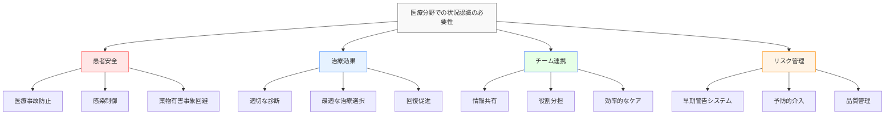
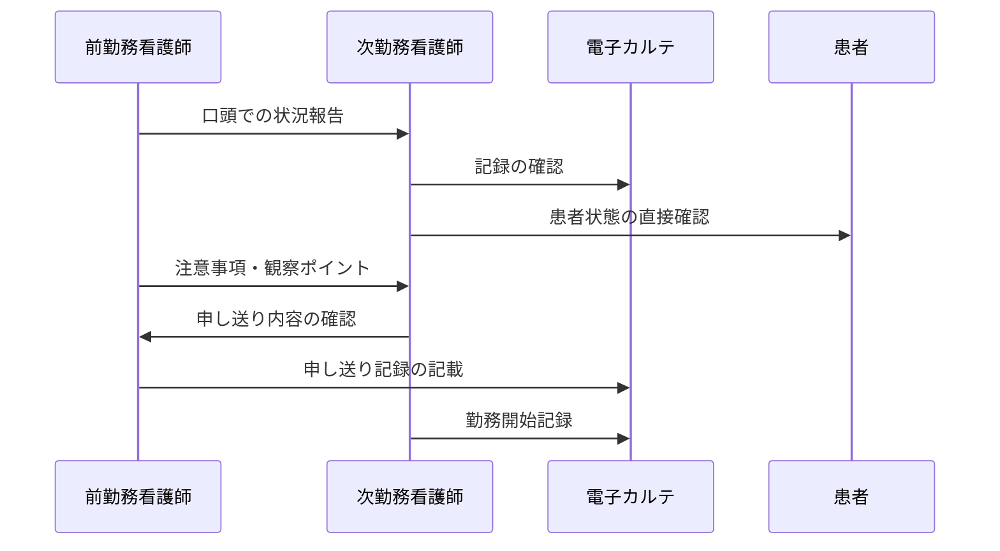
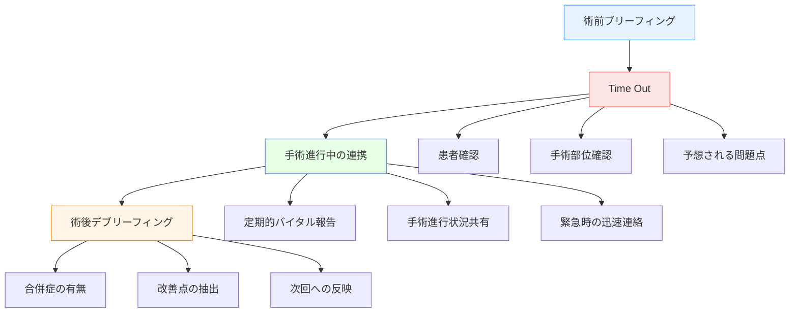
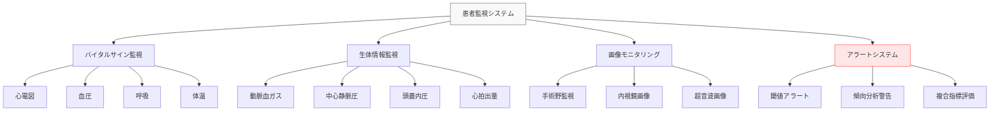
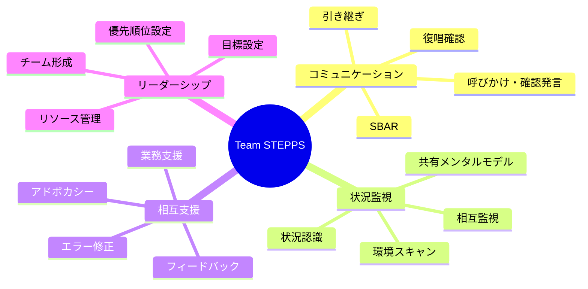
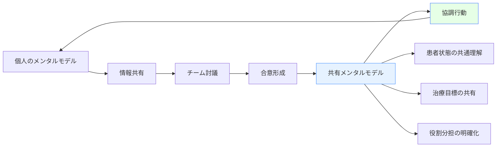
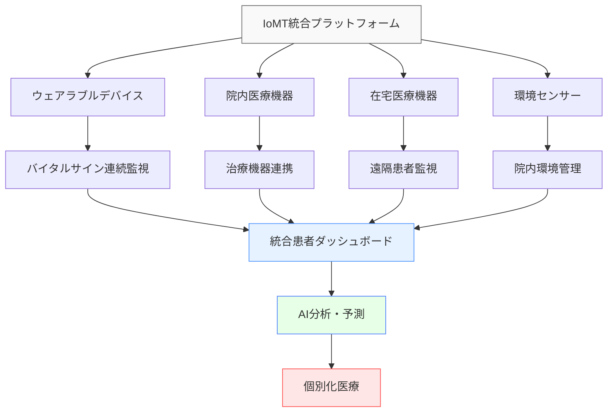

# 医療分野での状況認識

!!! info "このページについて"
    このページでは、医療分野における状況認識（Situational Awareness）の重要性と応用について詳しく解説します。医師、看護師、医療技師など、医療チームに関わる全ての職種での状況認識の実践例を学びます。

## 医療分野での状況認識の特徴

医療分野は、人命に直結する判断が求められ、多職種連携により患者ケアを提供する環境として、独特の状況認識要件があります。

### 固有の環境特性

| 特性 | 説明 | 状況認識への影響 |
|------|------|----------------|
| **人命重視** | 判断ミスが生命に直結 不可逆的な結果の可能性 | 高精度な状況把握 慎重かつ迅速な判断 |
| **多職種連携** | 医師、看護師、技師等 専門分野の異なるチーム | 共有情報の統合 異分野間コミュニケーション |
| **動的な患者状態** | 症状の変化 治療効果の個人差 | 継続的な監視 変化への適応 |
| **不確実性** | 診断の困難性 治療結果の予測困難 | 情報不足下での判断 リスク評価 |
| **時間的切迫性** | 緊急時の迅速対応 タイムクリティカル治療 | 限られた時間での判断 優先順位付け |

### 状況認識が求められる理由

## 職種別の状況認識

### 医師（Physician）

医師は診断・治療の最終責任者として、患者全体の状況を総合的に把握する必要があります。

#### 医師の状況認識の3レベル

=== "レベル1: 知覚（Perception）"
    **臨床情報・検査結果からの情報収集**
    
    - **患者観察**: 意識レベル、呼吸状態、皮膚色、表情
    - **バイタルサイン**: 血圧、心拍数、体温、酸素飽和度
    - **検査データ**: 血液検査、画像診断、生理検査
    - **治療経過**: 薬物投与、処置の効果、副作用
    
    !!! example "知覚の例"
        「血圧90/60、心拍数120、体温38.5℃、呼吸数24回/分、SpO2 95%、血液検査でWBC 15,000、CRP 8.5」

=== "レベル2: 理解（Comprehension）"
    **情報の統合と臨床的意味の把握**
    
    - **症候評価**: 症状のパターン認識と鑑別診断
    - **病態理解**: 病気の進行度と重症度の判断
    - **治療反応**: 投与した治療の効果と副作用の評価
    - **予後予測**: 疾患の一般的経過と個別要因の考慮
    
    !!! example "理解の例"
        「発熱、頻脈、炎症マーカー高値から細菌感染症を疑う。低血圧と頻呼吸は敗血症の初期兆候の可能性。抗生剤投与後も解熱せず、血培養結果待ち」

=== "レベル3: 予測（Projection）"
    **将来の病状変化と治療計画の策定**
    
    - **病状予測**: 現在の治療継続時の病状変化
    - **合併症予測**: 起こりうる合併症とその対応策
    - **治療計画**: 段階的な治療戦略と代替案
    - **資源計画**: 必要な医療資源と人員配置
    
    !!! example "予測の例"
        「現在の抗生剤で48時間以内に改善なければ、薬剤耐性菌の可能性。その場合、広域抗生剤への変更とICU管理を検討。血培養結果により最適抗生剤に調整予定」

### 看護師（Nurse）

看護師は患者に最も長時間接し、継続的な状態変化を観察する立場にあります。

#### 看護師の状況認識の特徴

| 看護場面 | 主な監視項目 | 状況認識のポイント | 技術的支援 |
|----------|-------------|-------------------|-----------|
| **病棟ケア** | 患者の日常状態 内服・注射管理 家族とのコミュニケーション | 微細な変化の検出 治療継続性の確保 心理的ケア | 電子カルテ 内服管理システム ナースコール |
| **手術室** | 術中バイタル 手術進行状況 機器トラブル | 術中合併症の早期発見 術者との連携 清潔操作の維持 | 麻酔監視装置 手術情報システム 中央材料管理 |
| **ICU/CCU** | 重篤患者の監視 人工呼吸器等の管理 家族への説明 | 重要臓器機能の監視 機器操作の確実性 多職種連携 | 患者監視装置 人工呼吸器 ECMO等 |

#### 看護師間の申し送り

### 臨床工学技士・医療技師

専門技術を持つ技士は、医療機器や検査の専門的状況認識を担当します。

#### 技士の専門領域と状況認識

=== "臨床工学技士"
    **医療機器の監視・管理**
    
    - 人工呼吸器、透析装置、体外循環装置の操作・監視
    - 医療機器の安全性確保と性能維持
    - 緊急時の機器トラブル対応
    - 予防保全による機器故障の未然防止

=== "放射線技師"
    **画像診断・放射線治療**
    
    - 撮影技術と画像品質の最適化
    - 被曝線量の管理と安全性確保
    - 画像の技術的評価と撮影条件調整
    - 緊急時の迅速な検査対応

=== "臨床検査技師"
    **検査データの信頼性確保**
    
    - 検体の適切な処理と分析
    - 検査データの品質管理
    - 異常値の再検査と追加検査提案
    - 検査機器の保守管理

## 場面別の状況認識

### 手術室（Operating Room）

手術室は多職種が高度に連携する高リスク環境です。

#### 手術チームの状況認識

| チーム構成 | 主な責任 | 状況認識の焦点 | 連携のポイント |
|-----------|----------|---------------|---------------|
| **執刀医** | 手術手技 術野判断 手術方針決定 | 解剖構造 出血量 手術進行 | 術式説明 予想外の所見共有 |
| **麻酔科医** | 全身管理 疼痛管理 輸液・輸血 | バイタルサイン 麻酔深度 体液バランス | 手術進行への影響 緊急時対応 |
| **手術室看護師** | 器械出し 外回り業務 感染防止 | 手術器具 清潔野 患者安全 | 手術進行に応じた準備 カウント確認 |

#### 手術時の重要なコミュニケーション

### 集中治療室（ICU/CCU）

集中治療室では重篤患者の24時間監視が行われます。

#### ICUでの状況認識の特徴

=== "継続的監視"
    **多パラメータの同時監視**
    
    - 心電図、血圧、中心静脈圧の持続監視
    - 動脈血ガス分析による呼吸・代謝評価
    - 臓器機能指標（腎機能、肝機能等）の追跡
    - 意識レベルと神経学的所見の評価

=== "早期警告システム"
    **状態悪化の兆候検出**
    
    - Modified Early Warning Score（MEWS）等の使用
    - バイタルサインの傾向分析
    - 複数パラメータの組み合わせ評価
    - 自動アラートシステムによる警告

### 救急部（Emergency Department）

救急部では多数の患者を同時に診療し、緊急度の判断が重要です。

#### トリアージと状況認識

| 緊急度 | 症状例 | 状況認識のポイント | 対応時間目標 |
|--------|-------|-------------------|-------------|
| **蘇生（赤）** | 心肺停止 ショック 重篤外傷 | 生命兆候の即座の評価 蘇生処置の優先順位 | 即座 |
| **緊急（橙）** | 急性心筋梗塞 脳梗塞 重症感染症 | 時間的制約のある疾患 専門科への連携タイミング | 15分以内 |
| **準緊急（黄）** | 骨折 腹痛 発熱 | 症状の詳細な評価 検査の必要性判断 | 30分以内 |
| **非緊急（緑）** | 軽症外傷 慢性症状 | 外来対応可能性 患者教育の実施 | 60分以内 |

## 技術システムと状況認識

### 医療情報システム

現代の医療はデジタル化により、情報統合と共有が進んでいます。

#### 主要な医療情報システム

| システム | 主な機能 | 状況認識への貢献 |
|----------|----------|----------------|
| **HIS (Hospital Information System)** | 病院業務の統合管理 | 患者情報の一元化 部門間連携の促進 |
| **EHR (Electronic Health Record)** | 電子カルテシステム | 患者情報の時系列表示 治療歴の把握 |
| **PACS (Picture Archiving and Communication System)** | 医用画像管理 | 画像の迅速な閲覧 過去画像との比較 |
| **LIS (Laboratory Information System)** | 臨床検査情報管理 | 検査結果の推移表示 異常値の強調 |

#### 患者監視システム

### AI・機械学習の活用

#### 医療AIによる状況認識支援

=== "診断支援AI"
    **パターン認識による診断補助**
    
    - 医用画像の異常検出（CT、MRI、X線）
    - 病理診断の精度向上
    - 皮膚疾患の識別支援
    - 眼底検査による糖尿病性網膜症検出

=== "予測AI"
    **患者状態の変化予測**
    
    - 病状悪化の早期予測
    - 入院期間の予測
    - 再入院リスクの評価
    - 薬物有害事象の予測

=== "意思決定支援AI"
    **治療選択の最適化**
    
    - 個別化医療の推奨
    - 薬物相互作用のチェック
    - 治療プロトコールの提案
    - 臨床試験適応の判定

## チーム医療と状況認識

### 多職種チームの状況認識

#### Team STEPPS（Team Strategies and Tools to Enhance Performance and Patient Safety）

現代医療では、Team STEPPSという包括的なチームワーク向上フレームワークが活用されています。

##### Team STEPPSの主要要素

#### SBAR コミュニケーション

効果的な情報伝達のための構造化コミュニケーション手法：

| 要素 | 内容 | 例 |
|------|------|---|
| **Situation** | 現在の状況 | 「3号室の田中さんが胸痛を訴えています」 |
| **Background** | 背景情報 | 「心筋梗塞の既往があり、今朝から胸部不快感を訴えていました」 |
| **Assessment** | 評価・判断 | 「心電図で新たなST変化があり、狭心症の可能性があります」 |
| **Recommendation** | 提案・要請 | 「医師の診察と心酵素の検査をお願いします」 |

### チーム状況認識の構築

#### 共有メンタルモデル

## 事故・インシデント事例と教訓

医療安全の観点から、状況認識の重要性を学べる事例を検討します。

### 代表的な医療インシデントと状況認識

=== "薬物有害事象"
    **薬剤の取り違え・過量投与**
    
    - **問題点**: 類似薬剤名、計算ミス、確認不足
    - **SA関連要因**:
        - 知覚の不備（薬剤名の読み間違い）
        - 理解の欠如（投与量の妥当性確認不足）
        - 予測の失敗（副作用の予想不足）
    - **教訓**: ダブルチェック、薬剤識別システム、電子処方システム

=== "手術部位間違い"
    **Wrong Site Surgery**
    
    - **問題点**: 患者取り違え、手術部位の確認不足
    - **SA関連要因**:
        - 知覚ミス（患者・部位の確認不足）
        - 理解不足（手術情報の共有不備）
        - チーム内SA不足（Time Outの形骸化）
    - **教訓**: WHOサージカルチェックリスト、マーキング、Time Out

=== "院内感染"
    **病院感染の発生・拡大**
    
    - **問題点**: 感染制御策の不備、状況認識の共有不足
    - **SA関連要因**:
        - 環境認識不足（感染経路の把握不足）
        - 情報共有不備（感染情報の伝達遅延）
        - 予測不足（感染拡大リスクの軽視）
    - **教訓**: 感染制御チーム、サーベイランス、迅速な情報共有

### 状況認識失敗の要因と対策

| 失敗要因 | 典型例 | 対策 |
|----------|-------|------|
| **情報不足** | 検査結果の確認漏れ 既往歴の聴取不足 | 電子カルテの活用 標準化された問診 |
| **コミュニケーション不備** | 申し送りの不備 多職種間の情報共有不足 | SBAR手法 チームカンファレンス |
| **認知バイアス** | 確証バイアス アンカリング効果 | セカンドオピニオン チームでの検討 |
| **作業負荷過多** | 疲労による注意力低下 多重業務 | 適切な人員配置 作業の標準化 |

## 将来の展望

### デジタルヘルスと状況認識

#### IoMT（Internet of Medical Things）

医療機器のネットワーク化により、統合的な状況認識が可能になります。

#### テレメディスンと遠隔状況認識

=== "遠隔診療"
    **地理的制約を越えた医療提供**
    
    - 高精細映像による視覚的診察
    - 生体情報のリアルタイム伝送
    - AI支援による診断補助
    - 専門医の遠隔コンサルテーション

=== "遠隔監視"
    **在宅患者の継続的監視**
    
    - ウェアラブルデバイスによる生体情報収集
    - 症状悪化の早期検出
    - 薬物コンプライアンスの監視
    - 家族・介護者への情報提供

### 精密医療と個別化状況認識

#### 個別化された状況認識

- **遺伝子情報**: 薬物代謝、疾病感受性の個別評価
- **病歴分析**: 過去の治療反応からの予測精度向上
- **ライフスタイル**: 患者固有の生活習慣の考慮
- **環境要因**: 地域・季節特性の反映

### 日本での取り組み

-   #### 厚生労働省

    ---

    **政策・制度整備**
    
    - 医療DX推進
    - データヘルス改革
    - 医療安全対策の推進
    - 医療従事者の働き方改革

-   #### 産業界

    ---
    
    **技術開発・実用化**
    
    - 富士通：医療AIプラットフォーム
    - NTTデータ：統合医療情報システム
    - ソニー：医療用AIカメラ
    - オリンパス：内視鏡AI診断支援

-   #### 学会・研究機関

    ---
    
    **研究・標準化**
    
    - 日本医療安全調査機構：事故分析
    - 日本シミュレーション学会：訓練手法開発
    - AMED：医療AI研究開発
    - 各種学会：ガイドライン策定

## まとめ

医療分野での状況認識は、以下の特徴を持ちます：

### 重要なポイント

1. **人命重視**: 最高レベルの正確性と迅速性が要求
2. **多職種連携**: 専門分野を超えた情報統合が必要
3. **個別性**: 患者ごとの特性を考慮した状況認識
4. **技術統合**: AIやIoTによる人間の認知能力補強
5. **継続的改善**: 安全文化と学習組織の構築

### システム開発への示唆

医療分野での状況認識は、システム開発の観点から以下の示唆を与えます：

- **ユーザビリティ**: 緊急時でも操作しやすいインターフェース
- **インテロペラビリティ**: 異なるシステム間のデータ連携
- **セキュリティ**: 患者情報の保護と可用性の両立
- **スケーラビリティ**: 多数の患者・医療者に対応するシステム設計
- **レジリエンス**: 障害時でも最低限の機能を維持するシステム

医療分野の状況認識は、技術の発展と共に、より安全で効率的、かつ個別化された医療の実現に向けて進歩し続けることが期待されます。

## 関連リンク

- [基本概念：状況認識とは](../basics/what-is-sa.md)
- [包括的ガイド：状況認識のトレーニング](../comprehensive-guide/training-sa.md)
- [ソフトウェア：医療・緊急対応ソフトウェア](../software/medical-emergency-sa-software.md)

## 参考文献

1. Flin, R., O'Connor, P., & Crichton, M. (2008). *Safety at the sharp end: A guide to non-technical skills*. Ashgate Publishing.
2. Leonard, M., Graham, S., & Bonacum, D. (2004). The human factor: the critical importance of effective teamwork and communication in providing safe care. *Quality and Safety in Health Care, 13*(suppl 1), i85-i90.
3. Gaba, D. M. (2000). Anaesthesiology as a model for patient safety in health care. *BMJ, 320*(7237), 785-788.
4. Endsley, M. R. (2003). Situation awareness in intensive care units (ICUs): A literature review. *Proceedings of the Human Factors and Ergonomics Society Annual Meeting, 47*(12), 1540-1544.
5. 厚生労働省. (2023). *医療DX推進に向けた提言*. 