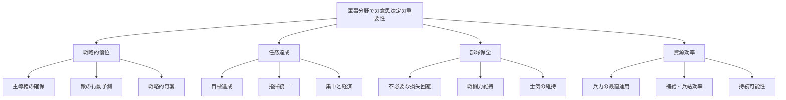
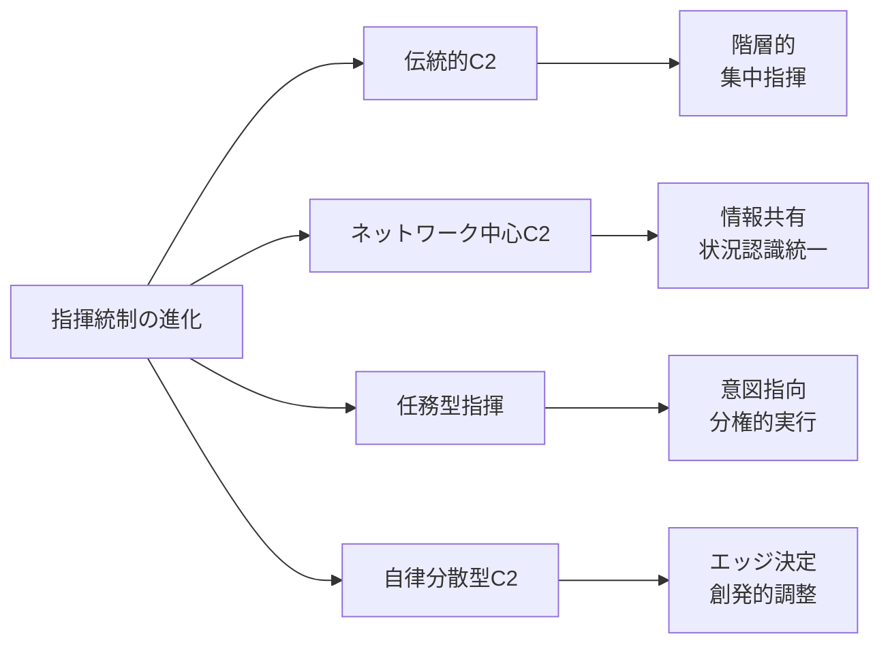
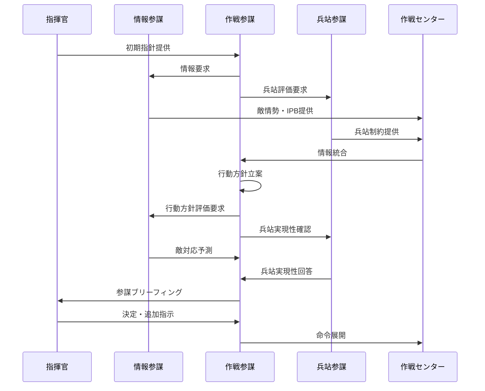
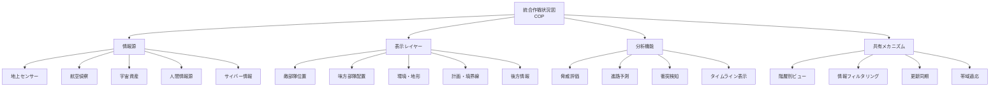
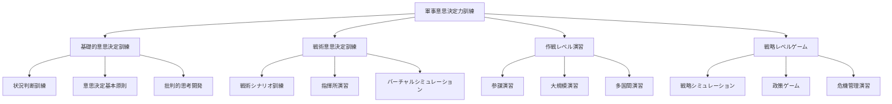
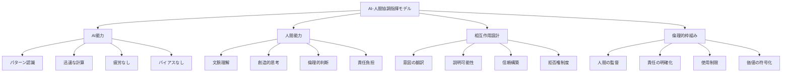

# 軍事・防衛分野での意思決定

!!! info "このページについて"
    このページでは、軍事・防衛分野における意思決定（Decision Making）の重要性と応用について詳しく解説します。指揮官、参謀、部隊長など、軍事・防衛に関わる専門職の意思決定プロセスと、その訓練・改善方法について学びます。なお、本ページは公開されている一般的な概念に基づいて解説しています。

## 軍事分野での意思決定の特徴

軍事・防衛分野における意思決定は、敵対的環境下で、不確実性が高く、重大な結果をもたらす判断を行う必要があります。

### 固有の環境特性

| 特性 | 説明 | 意思決定への影響 |
|------|------|----------------|
| **敵対的環境** | 意図的に対抗する敵の存在<br>欺瞞と妨害 | 対抗的思考の必要性<br>意図予測の重要性 |
| **霧と摩擦** | 不完全な情報<br>計画と実行の乖離 | 不確実性の管理<br>柔軟な適応力 |
| **時間的制約** | 先手の利点<br>機会の窓 | 意思決定サイクルの短縮<br>リスク許容度の判断 |
| **階層的組織** | 明確な指揮系統<br>分散された実行 | 意図指向型指揮<br>分権的実行 |
| **高い結果責任** | 人命と国家安全保障<br>政治的影響 | 倫理的考慮<br>多次元的影響評価 |

### 軍事意思決定の重要性



## 意思決定モデルと戦略

### 軍事特有の意思決定モデル

=== "MDMP（軍事意思決定プロセス）"
    #### MDMP（Military Decision Making Process）

    複雑な作戦計画策定のための体系的、分析的なプロセスです。特に参謀組織を持つ大規模部隊で活用されます。

    ```mermaid
    graph TD
        A[受領] --> B[任務分析]
        B --> C[行動方針の立案]
        C --> D[行動方針の分析]
        D --> E[行動方針の比較]
        E --> F[行動方針の決定]
        F --> G[計画・命令の作成]
        G --> H[計画・命令の改訂]
        
    
    
    
    ```

    ##### MDMPの段階詳細

    | 段階 | 主な活動 | 成果物 | 意思決定者の役割 |
    |------|----------|-------|----------------|
    | **受領** | 上位命令の理解<br>初期ガイダンス<br>予備命令 | 時間計画<br>参謀指示 | 初期ガイダンス提供<br>計画焦点の設定 |
    | **任務分析** | 敵情勢の分析<br>任務詳細化<br>制約条件確認 | 確認された任務<br>指揮官指示<br>CCIR | 任務承認<br>重要情報要求決定 |
    | **行動方針の立案** | 作戦構想作成<br>選択肢生成<br>主要任務組織化 | 複数の行動方針 | 追加ガイダンス<br>クリエイティブ思考促進 |
    | **行動方針の分析** | ウォーゲーミング<br>長所・短所特定<br>リスク評価 | 分析結果<br>判断材料 | 分析要件の指示<br>参加（選択的） |
    | **行動方針の比較** | 評価基準の設定<br>選択肢の比較<br>優先順位付け | 推奨行動方針 | 評価基準の承認<br>質問による検証 |
    | **行動方針の決定** | 参謀ブリーフィング<br>方針選択<br>最終指針提供 | 指揮官決定<br>作戦構想 | 最終決定<br>作戦構想の承認 |
    | **計画・命令の作成** | 詳細計画策定<br>命令書作成<br>付属文書準備 | 作戦命令<br>附属書 | 計画承認<br>最終調整 |
    | **計画・命令の改訂** | 状況変化への対応<br>計画更新<br>対策立案 | 変更命令<br>断片命令 | 変更承認<br>状況適応 |


=== "OODA ループ"
    #### OODA ループ（Observe, Orient, Decide, Act）

    戦術レベルでの迅速な意思決定のための循環的プロセスです。特に航空戦闘から発展し、様々な軍事場面に適用されます。

    ```mermaid
    graph LR
        A[Observe<br>観察] --> B[Orient<br>状況判断]
        B --> C[Decide<br>決定]
        C --> D[Act<br>行動]
        D --> A
        
        A -.-> B
        B -.-> A
        B -.-> C
        C -.-> B
        C -.-> D
        D -.-> C
        D -.-> A
        
    
    
    
    
    ```

    ##### OODAループの理論と応用

    | 要素 | 説明 | 軍事的適用 | 競争優位への貢献 |
    |------|------|-----------|----------------|
    | **Observe<br>(観察)** | 敵・味方・環境の<br>情報収集 | 偵察・監視<br>情報収集活動<br>センサー網 | 状況認識の正確性<br>情報優越性 |
    | **Orient<br>(状況判断)** | 情報の文脈化<br>意味付け<br>状況理解 | インテリジェンス分析<br>脅威評価<br>機会特定 | 認知的枠組みの適応<br>意味ある情報への変換 |
    | **Decide<br>(決定)** | 行動選択<br>リスク評価<br>資源配分 | 戦術選択<br>兵力投入判断<br>目標優先順位 | 意思決定の質と速度<br>イニシアチブの確保 |
    | **Act<br>(行動)** | 決定の実行<br>効果の観察<br>調整 | 火力投射<br>機動<br>電子戦 | 相手のループ妨害<br>敵の予測を上回る速度 |

### 戦略的意思決定の原則

軍事戦略における意思決定は、複数の確立された原則に基づいています。

#### 戦争の原則と意思決定

| 原則 | 説明 | 意思決定への適用 |
|------|------|----------------|
| **目標** | 明確な戦略・戦術目標の<br>設定と維持 | 全ての判断を目標達成に<br>向けて評価 |
| **攻勢** | 主導権を握り<br>行動の自由を確保 | 受動的反応より<br>能動的行動を選択 |
| **集中** | 決定的時間・場所に<br>戦闘力を集中 | 重点課題への<br>資源集中判断 |
| **経済** | 二次的努力への<br>資源最小化 | 資源分配の<br>効率性重視 |
| **機動** | 有利な位置への<br>戦力配置 | 柔軟性と<br>臨機応変な判断 |
| **統一** | 単一の指揮下での<br>統合行動 | 整合的な<br>指揮決定体系 |
| **安全** | 敵の不意打ちへの<br>警戒と準備 | リスク評価と<br>脆弱性管理 |
| **奇襲** | 敵の予期せぬ<br>時間・場所・方法 | 非対称的選択肢の<br>積極的検討 |
| **単純性** | 明確で複雑でない<br>計画と命令 | 実行可能な<br>シンプルな判断 |

## 指揮レベル別の意思決定プロセス

=== "戦略レベル（Strategic Level）"
    ### 戦略レベル（Strategic Level）

    国家安全保障目標の達成のための長期的、総合的な意思決定を行います。

    #### 戦略的意思決定の特徴

    | 特徴 | 説明 | 意思決定への影響 |
    |------|------|----------------|
    | **長期的視野** | 数年〜数十年の展望<br>世代を超えた計画 | 即時利益より<br>持続的優位の重視 |
    | **政軍関係** | 政治的目標と<br>軍事手段の調整 | 政治的考慮と<br>軍事的実現性の均衡 |
    | **総合的アプローチ** | 外交・情報・軍事・経済<br>の統合的活用 | 多次元的手段の<br>組み合わせ最適化 |
    | **資源の割当** | 国家的資源の<br>戦略的配分 | 防衛予算・人材・<br>技術の優先付け |
    | **連合・同盟関係** | 国際的協力と<br>集団安全保障 | 多国間利益の<br>調整と統合 |

    #### 戦略的意思決定のフレームワーク

    ```mermaid
    graph TD
        A[国家安全保障戦略策定] --> B[脅威・機会分析]
        A --> C[国家利益定義]
        A --> D[国家力量評価]
        
        B --> E[戦略的選択肢検討]
        C --> E
        D --> E
        
        E --> F[国家防衛戦略決定]
        F --> G[防衛計画策定]
        F --> H[軍事ドクトリン策定]
        F --> I[同盟・国際協力戦略]
        
        G --> J[資源配分]
        H --> K[作戦レベルへの展開]
        I --> L[国際協調行動]
        
    
    
    
    ```

=== "作戦レベル（Operational Level）"
    ### 作戦レベル（Operational Level）

    戦略目標と戦術行動を結びつける中間レベルの意思決定です。作戦術（Operational Art）の発揮が重要となります。

    #### 作戦レベル意思決定の特徴

    | 意思決定領域 | 主要判断事項 | 考慮要素 | 意思決定時間枠 |
    |------------|-------------|----------|--------------|
    | **作戦計画** | 主要作戦構想<br>作戦配置<br>兵力組成 | 戦略目標<br>敵戦力配置<br>地理的要因 | 数週間〜数か月<br>（作戦サイクル） |
    | **作戦統制** | 主要努力方向<br>時空間調整<br>優先支援 | 作戦進展<br>敵の対応<br>環境変化 | 数日〜数週間<br>（作戦フェーズ） |
    | **戦闘配備** | 部隊配置<br>後方支援<br>連携調整 | 任務要件<br>地形分析<br>脅威評価 | 数時間〜数日<br>（前線展開） |
    | **リソース管理** | 兵站優先順位<br>予備力運用<br>補充計画 | 消耗率<br>補給線状況<br>持続能力 | 数日〜数週間<br>（兵站サイクル） |

    #### 作戦的アート（Operational Art）

    作戦レベルでは、以下の概念を用いて戦略目標と戦術行動を結びつけます。

    - **終末状態（End State）**: 達成すべき最終目標の明確な定義
    - **重心（Center of Gravity）**: 敵の力の源泉と自軍の強み
    - **決定的地点（Decisive Point）**: 重心に影響を与える鍵となる場所や事象
    - **間接的アプローチ（Indirect Approach）**: 敵の予期しない方向からの接近
    - **作戦線（Line of Operation）**: 決定的地点を結ぶ物理的経路
    - **作戦効果線（Line of Effort）**: 非物理的な行動の論理的連鎖
    - **深度と同時性（Depth and Simultaneity）**: 空間・時間・機能にわたる同時作戦

=== "戦術レベル（Tactical Level）"
    ### 戦術レベル（Tactical Level）

    実際の戦闘行動を計画・実行するための直接的な意思決定です。最前線での判断が中心となります。

    #### 戦術レベル意思決定の特徴

    ##### 部隊規模別の意思決定の焦点

    ```mermaid
    graph TD
        A[戦術レベル意思決定] --> B[小隊・中隊レベル]
        A --> C[大隊レベル]
        A --> D[連隊・旅団レベル]
        
        B --> B1[直接接敵作戦]
        B --> B2[即時的戦闘判断]
        B --> B3[小規模機動]
        
        C --> C1[複合小部隊調整]
        C --> C2[限定目標達成]
        C --> C3[戦闘支援統合]
        
        D --> D1[複数大隊運用]
        D --> D2[戦術的支援調整]
        D --> D3[作戦目標への貢献]
        
    
    
    
    
    ```

    ##### 戦術判断の時間軸

    | 判断種別 | 時間枠 | 主な内容 | 判断の特徴 |
    |----------|-------|----------|-----------|
    | **即時判断** | 秒〜分 | 交戦決定<br>緊急回避<br>即応射撃 | 直感的判断<br>訓練依存<br>反射的対応 |
    | **短期判断** | 分〜時間 | 機動方向選択<br>攻撃形態決定<br>部隊再配置 | 限定分析<br>状況適応<br>既存計画調整 |
    | **戦闘計画** | 時間〜日 | 戦闘準備<br>戦術計画策定<br>戦闘隊形決定 | MDTM/TDMP活用<br>地形分析<br>敵情勢評価 |

    ##### 分隊・小隊レベルでの戦術的意思決定プロセス（TDMP）

    小規模部隊向けに簡略化された意思決定プロセスです。

    1. **状況把握**: 受領した任務と現在の状況の理解
    2. **任務分析**: 明示・暗示の任務の特定
    3. **地形・敵情分析**: OCOKA（観測/射界、隠蔽/遮蔽、障害物、重要地形、接近路）分析
    4. **行動方針策定**: 実行可能な選択肢の立案
    5. **計画策定**: 選択した行動方針の詳細な計画
    6. **準備・確認**: 部下への指示と確認
    7. **実行・評価**: 計画の実行と継続的評価

## チーム意思決定と指揮統制

### 指揮統制（C2）システム

指揮統制（Command and Control）は、部隊の行動を指示・調整するための体系です。

#### 指揮統制の発展段階



#### 任務型指揮統制（Mission Command）

現代軍事において重視される指揮哲学です。

| 構成要素 | 説明 | 意思決定への影響 |
|----------|------|----------------|
| **指揮官の意図** | 目的と達成状態の<br>明確な表明 | 下位レベルの判断の<br>一貫性確保 |
| **イニシアチブ** | 全階層での<br>積極的行動促進 | 現場判断の<br>自由度拡大 |
| **任務命令** | 何を・なぜを強調<br>方法は委任 | 創造的問題解決の<br>余地確保 |
| **信頼と相互理解** | 上下・水平の<br>信頼関係構築 | 分権的判断への<br>心理的安全性 |
| **規律あるイニシアチブ** | 枠組み内での<br>自発的行動 | 調和のとれた<br>独創的判断 |
| **リスク許容** | 計算されたリスクの<br>受容 | 積極的判断の<br>奨励 |

### 参謀プロセス

大規模な軍事組織では、指揮官の判断を支援する参謀組織が重要な役割を果たします。

#### 参謀機能と意思決定支援

=== "情報参謀（J/G/S-2）"
    **インテリジェンス支援**
    
    - 敵情報の収集・分析・提供
    - 情報収集計画の立案
    - 敵COAの予測
    - 情報評価と精度確認
    - IPB（インテリジェンス準備）の実施

=== "作戦参謀（J/G/S-3）"
    **作戦計画と実行**
    
    - 作戦計画の立案と調整
    - 現在作戦の監視と管理
    - 訓練と即応態勢の維持
    - 主要行動方針の開発
    - 作戦の時間管理と同期

=== "兵站参謀（J/G/S-4）"
    **後方支援判断**
    
    - 補給・輸送・整備の計画
    - 兵站持続可能性の評価
    - 補給線の選定と維持
    - 兵站リスクの評価
    - 作戦の兵站による制約の特定

#### 参謀プロセスの流れ



## 意思決定支援システム

### 指揮統制情報システム

#### C4ISR システム

Command, Control, Communications, Computers, Intelligence, Surveillance, Reconnaissance（C4ISR）は現代軍事の中核的な情報システムです。

| 構成要素 | 主な機能 | 意思決定支援の側面 |
|----------|----------|-------------------|
| **指揮（Command）** | 指揮権限の実行<br>作戦指揮 | 指揮意図の明確化<br>作戦監視 |
| **統制（Control）** | 作戦の調整<br>進捗管理 | フィードバック<br>調整メカニズム |
| **通信（Communications）** | 情報伝達<br>ネットワーク化 | 時間的即応性<br>情報共有 |
| **コンピュータ（Computers）** | データ処理<br>自動化支援 | 情報処理能力<br>複雑性管理 |
| **情報（Intelligence）** | 敵・環境情報<br>脅威評価 | 敵状況理解<br>予測能力 |
| **監視（Surveillance）** | 継続的観察<br>変化検知 | 早期警戒<br>状況変化把握 |
| **偵察（Reconnaissance）** | 特定情報収集<br>詳細確認 | 情報ギャップ埋め<br>仮説検証 |

#### 統合作戦状況図（COP）



### 意思決定支援ツール

#### 軍事計画・分析ツール

=== "戦場分析ツール"
    **地形・環境分析**
    
    - 地形の軍事的分析（MCOO作成）
    - 観測・射界分析
    - 機動性・障害物分析
    - 重要地形特定
    - 気象影響評価

=== "コース・オブ・アクション分析"
    **行動方針評価**
    
    - 戦闘力比較（Force Ratio）
    - 損耗率予測
    - 時間・空間分析
    - リスク評価マトリックス
    - 相対戦闘力評価（RCP）

=== "兵站計画ツール"
    **後方支援評価**
    
    - 補給需要予測
    - 輸送能力分析
    - 補給線脆弱性評価
    - 整備予測
    - 医療支援計画

=== "ウォーゲーミング"
    **対抗シナリオ検証**
    
    - 行動-反応-対応シーケンス
    - 批判的決心点特定
    - 偶発事態分析
    - 仮説検証
    - フリープレイシミュレーション

## 訓練と評価

### 意思決定訓練アプローチ

#### 多層的訓練システム



#### 効果的な訓練手法

| 訓練手法 | 説明 | 意思決定能力への効果 |
|----------|------|-------------------|
| **Tactical Decision Game<br>(TDG)** | 短時間の状況判断ゲーム<br>限定情報下での判断 | 直感的判断力向上<br>時間圧迫下の意思決定<br>優先順位付け能力 |
| **指揮所演習<br>(CPX)** | 実際の指揮機能の<br>シミュレーション訓練 | 参謀プロセス習熟<br>情報管理能力<br>指揮統制手順 |
| **事例研究** | 歴史的戦闘・作戦の<br>詳細分析 | 文脈理解能力<br>戦史からの教訓<br>複雑性理解 |
| **砂盤演習** | 地形模型を用いた<br>戦術演習 | 空間認識能力<br>部隊運用イメージ<br>計画の視覚化 |
| **After Action Review<br>(AAR)** | 活動後の体系的<br>振り返りと分析 | 自己評価能力<br>継続的改善<br>組織学習 |

### 評価と資格認定

#### 指揮官・参謀の能力評価

=== "定量的評価"
    **数値指標による評価**
    
    - 目標達成率
    - 任務成功指標（MOE/MOP）
    - 資源効率性
    - 時間管理効率
    - エラー/成功率

=== "定性的評価"
    **質的評価アプローチ**
    
    - 意思決定プロセスの評価
    - リーダーシップ効果の観察
    - 複雑状況への適応性
    - クリティカルシンキング
    - チーム構築能力

=== "360度評価"
    **多角的評価フレームワーク**
    
    - 上級指揮官からの評価
    - 同僚・対等者からのフィードバック
    - 部下からの視点
    - 自己評価
    - 外部専門家の意見

## 事例分析

### 意思決定成功事例

=== "湾岸戦争・地上戦作戦（1991年）"
    **包囲迂回機動の成功**
    
    #### 状況
    第一次湾岸戦争において、多国籍軍は正面からの攻撃に見せかけながら、主力を西方から迂回させてイラク軍を包囲するという作戦を実行。
    
    #### 意思決定プロセス
    - **情報収集と分析**: 精密な偵察と情報収集によるイラク軍配置の把握
    - **代替案比較**: 正面突破と迂回機動の比較検討
    - **リスク評価**: 大規模迂回の補給・兵站リスク分析
    - **欺瞞作戦統合**: 敵の注意を逸らす心理戦と欺瞞
    - **任務型指揮の適用**: 下位指揮官への大幅な裁量権付与
    
    #### 成功要因
    - 明確な戦略目標と作戦目標の設定
    - 情報優越性の確立と活用
    - 強力な連合軍指揮統一
    - 機動と奇襲原則の効果的適用
    - 現代技術と古典的軍事原則の融合

=== "アフガン初期作戦（2001年）"
    **特殊部隊と航空力の新たな統合**
    
    #### 状況
    2001年のアフガニスタン作戦における少数の特殊部隊と圧倒的な航空力、現地勢力の組み合わせによる新しい作戦方法の展開。
    
    #### 意思決定プロセス
    - **非対称アプローチ選択**: 通常の大規模地上侵攻ではなく特殊部隊中心の作戦
    - **リスク許容**: 少数部隊投入のリスク受容
    - **革新的統合**: 特殊部隊、精密誘導兵器、現地勢力の新たな組み合わせ
    - **分権的実行**: 現場特殊部隊への大幅な判断権限委譲
    - **適応的計画**: 状況進展に応じた柔軟な計画調整
    
    #### 成功要因
    - 創造的な作戦コンセプト
    - 技術の革新的活用
    - 効果的な同盟構築
    - 分権的意思決定の効果
    - 従来の軍事ドクトリンからの脱却

### 意思決定失敗事例

=== "ソマリア・モガディシュの戦い（1993年）"
    **都市戦での適応的意思決定の課題**
    
    #### 状況
    1993年10月、モガディシュでのミリシア指導者捕獲作戦が予想外の抵抗に遭遇し、18名の米軍兵士が死亡した事例。
    
    #### 意思決定の問題点
    - **情報評価の不足**: 敵の能力と意志の過小評価
    - **リスク分析の甘さ**: 都市環境での脆弱性認識不足
    - **代替計画の欠如**: 作戦が複雑化した場合の対応計画不足
    - **指揮統制の課題**: 複数機関間の調整不足
    - **装備・資源の制約**: 必要な装甲車両等の欠如
    
    #### 教訓
    - 敵の意志と能力の慎重な評価
    - 複雑な環境での作戦の徹底的計画
    - 適切な部隊規模と装備の確保
    - 明確な指揮統制と統一された行動
    - 政治目標と軍事手段の整合性確保

=== "イラク戦争後の占領統治（2003-2004年）"
    **戦略的計画と長期予測の失敗**
    
    #### 状況
    2003年のイラク侵攻後、占領統治計画の不足と不適切な意思決定が反乱拡大に繋がった事例。
    
    #### 意思決定の問題点
    - **戦後計画の不足**: 軍事作戦成功後の統治計画の不備
    - **情勢理解の欠如**: イラク社会・宗派複雑性の過小評価
    - **重要決定の誤り**: イラク軍解体等の影響理解不足
    - **仮定の検証不足**: 「解放者として歓迎される」等の仮定
    - **フィードバック無視**: 現場からの警告信号の軽視
    
    #### 教訓
    - 軍事行動の第二・第三次的効果の検討
    - 文化・社会的文脈の十分な理解
    - 計画の前提条件・仮定の厳格な検証
    - 柔軟で適応的な占領統治計画
    - 戦略目標と実行手段の継続的再評価

## 将来の展望

### AI・機械学習の軍事意思決定への影響

#### 軍事AIの発展段階

| 段階 | 特徴 | 意思決定への影響 | 実装タイムライン |
|------|------|----------------|---------------|
| **情報処理支援** | 大量データ分析<br>パターン認識<br>情報融合 | 情報過負荷軽減<br>意思決定の情報基盤強化 | 現在〜短期<br>(すでに活用中) |
| **意思決定支援** | 選択肢生成<br>結果予測<br>リスク評価 | 判断の質向上<br>検討範囲拡大<br>認知バイアス軽減 | 短期〜中期<br>(1-5年) |
| **自律的意思決定** | 特定領域での<br>自律判断<br>人間監視下実行 | 対応速度向上<br>特定任務の自動化<br>人間の戦略的判断への集中 | 中期<br>(5-10年) |
| **人間-AI協調** | 相互補完的判断<br>強化認知<br>ハイブリッド指揮 | 認知能力拡張<br>戦場理解の変革<br>新たな指揮形態 | 中長期<br>(10-15年) |
| **戦略的共進化** | AI戦略発案<br>超複雑環境での<br>対抗的最適化 | 戦略思考の変革<br>戦争の性質変化<br>倫理的新課題 | 長期<br>(15年以上) |

#### AIと人間指揮官の関係モデル



### マルチドメイン作戦と意思決定

#### 領域横断的調整

従来の陸・海・空に加え、宇宙・サイバー・電磁波領域を含む統合的な作戦環境における意思決定です。

=== "領域横断的シナジー"
    **複数領域の効果統合**
    
    - 領域間の相互依存性理解
    - 非線形的効果の創出
    - クロスドメイン調整メカニズム
    - 効果ベースの目標設定
    - 相互支援関係の最適化

=== "領域拒否環境での対応"
    **アクセス拒否への対策**
    
    - 脆弱性分析と冗長性確保
    - 代替手段の事前計画
    - クロスドメイン解決策
    - 非対称的アプローチ
    - 自律的判断能力の強化

### グレーゾーン対応と複合戦

#### ハイブリッド脅威への意思決定

現代の脅威は従来の軍事行動と非軍事手段を組み合わせたグレーゾーン活動が増加しています。

| グレーゾーン活動 | 意思決定課題 | 対応アプローチ |
|----------------|-------------|--------------|
| **情報操作・偽情報** | 情報の真偽判断<br>プロパガンダ識別 | インテリジェンス強化<br>戦略的コミュニケーション |
| **サイバー攻撃** | 帰属の特定<br>対応の釜合い | 防御的対策<br>抑止力の確立 |
| **代理勢力活用** | 実際の支援者特定<br>適切な対応度合い | 非対称的対応<br>地域パートナー強化 |
| **経済的強制** | 安全保障と経済の境界<br>対抗措置の範囲 | 経済的レジリエンス<br>同盟関係の活用 |
| **法的戦（Lawfare）** | 国際法の曖昧さ<br>対応の正当性 | 法的準備<br>国際規範強化 |

## まとめ

軍事・防衛分野での意思決定は、以下の特徴を持ちます。

### 重要なポイント

1. **構造化プロセス**: MDMPやOODAループなど体系的な意思決定フレームワークの活用
2. **階層的統合**: 戦略・作戦・戦術レベルの整合性ある意思決定
3. **敵対的思考**: 敵の意図と対抗策を常に考慮した思考法
4. **不確実性管理**: 霧と摩擦を前提とした柔軟な対応力
5. **指揮統一**: 明確な指揮系統と統一された行動

### 成功する意思決定の要素

軍事分野で効果的な意思決定を行うための重要な要素。

- **明確な指揮官意図**: 目的と期待される結果の明確な伝達
- **情報優位**: 敵や環境に関する優れた情報収集と分析
- **適応的柔軟性**: 状況変化への迅速かつ効果的な対応能力
- **計算されたリスク**: リスクの理解と許容範囲の明確な設定
- **行動の統一**: 全ての要素が調和して機能する統合性
- **先見性**: 将来的な結果と影響の予測能力

軍事分野の意思決定モデルと実践は、複雑で不確実な環境下での効果的な判断という点で、ビジネスや危機管理など他の分野にも広く応用されています。

## 関連リンク

- [基本概念：意思決定とは](../../basics/decision-making)
- [基本概念：OODAループ](../../basics/ooda-loop)
- [軍事分野での状況認識](../military-sa)
- [意思決定の理論と実践：不確実性下の意思決定](../../decision-making-guide/uncertainty)
- [意思決定トレーニング](../../decision-making-guide/decision-training)

## 参考文献

1. U.S. Army. (2019). *ADP 5-0: The Operations Process*. Headquarters, Department of the Army.
2. Boyd, J. R. (1996). *The Essence of Winning and Losing*. Unpublished lecture notes.
3. Clausewitz, C. v. (1984). *On War* (M. Howard & P. Paret, Trans.). Princeton University Press. (Original work published 1832)
4. Klein, G. (2017). *Sources of Power: How People Make Decisions* (20th Anniversary Edition). MIT Press.
5. NATO. (2017). *Allied Joint Doctrine for the Conduct of Operations* (AJP-3). North Atlantic Treaty Organization.
6. Storr, J. (2009). *The Human Face of War*. Continuum.
7. Van Creveld, M. (1985). *Command in War*. Harvard University Press.
8. Von Neumann, J., & Morgenstern, O. (2007). *Theory of Games and Economic Behavior* (60th Anniversary Commemorative Edition). Princeton University Press.
9. 防衛省. (2022). *防衛白書*. 日本国政府.
10. 統合幕僚監部. (2020). *統合作戦計画の基本概念*. 防衛省.