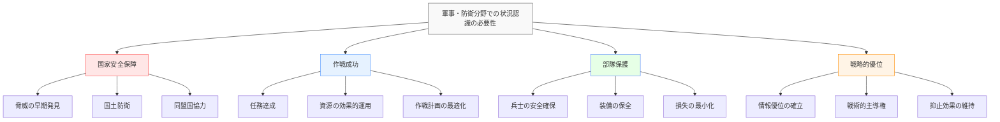
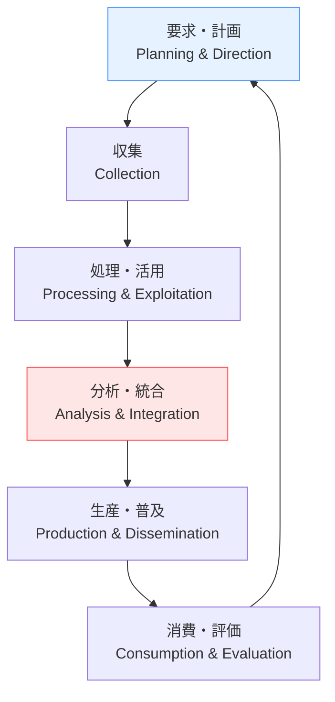
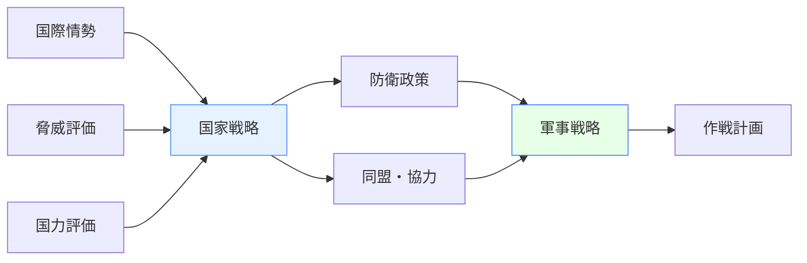
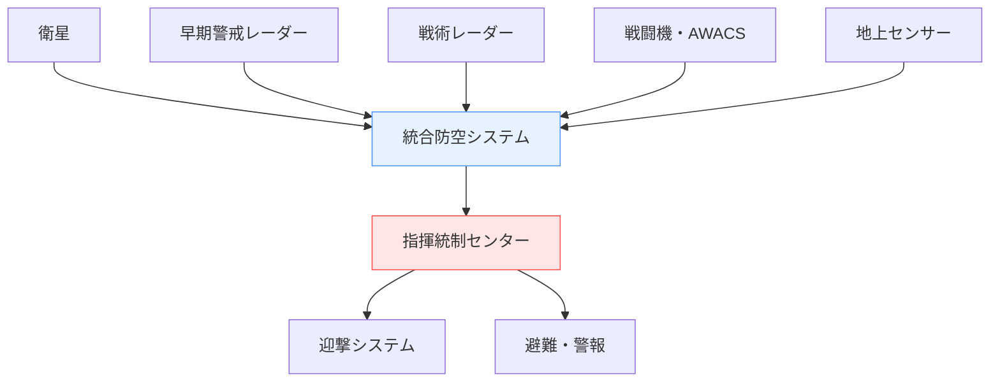
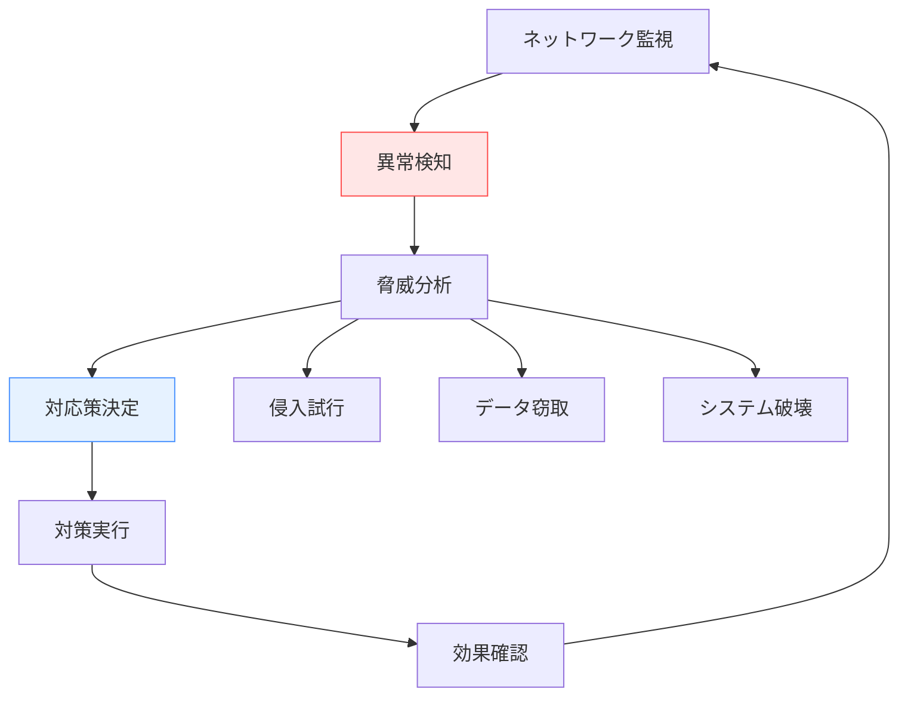
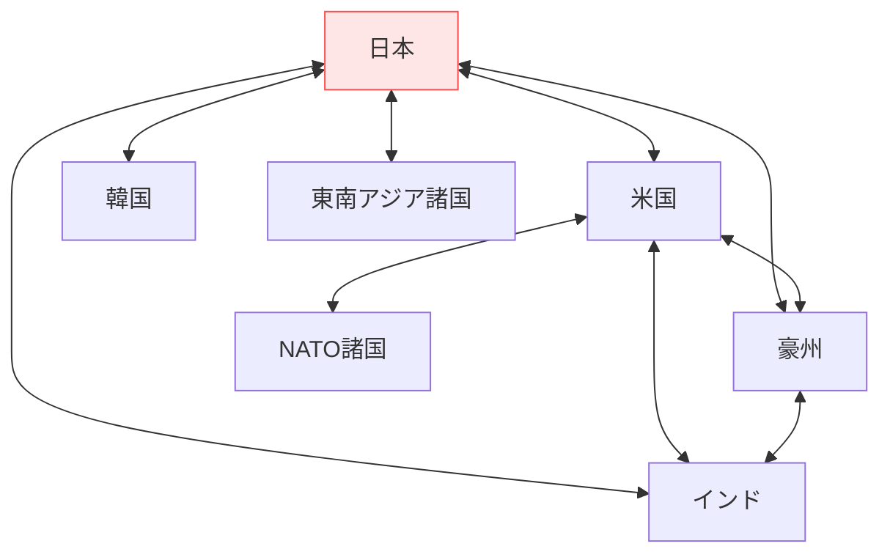
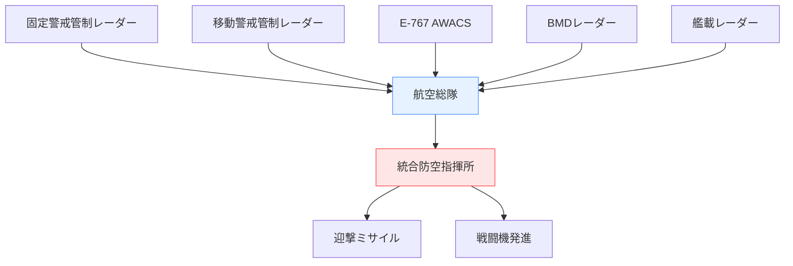
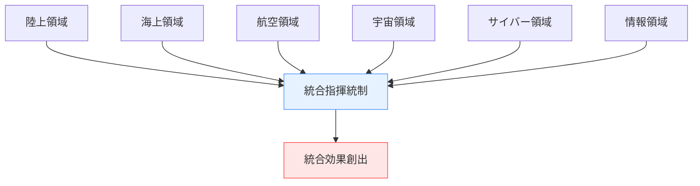

# 軍事・防衛分野での状況認識

!!! info "このページについて"
    このページでは、軍事・防衛分野における状況認識（Situational Awareness）の重要性と応用について詳しく解説します。指揮官、情報分析官、前線部隊など、防衛に関わる様々な職種での状況認識の実践例を学びます。なお、本ページは公開されている一般的な概念に基づいて解説しています。

## 軍事・防衛分野での状況認識の特徴

軍事・防衛分野は、敵対的で予測困難な環境において、国家の安全保障を担う重要な責任を負っており、極めて高度な状況認識が要求される分野です。

### 固有の環境特性

| 特性 | 説明 | 状況認識への影響 |
|------|------|----------------|
| **敵対的環境** | 意図的な妨害・欺瞞 積極的な脅威の存在 | 情報の真偽判定 敵の意図推測 |
| **階層的指揮統制** | 明確な指揮系統 権限と責任の分化 | レベル別情報共有 上意下達の徹底 |
| **多次元作戦** | 陸・海・空・宇宙・サイバー 複合ドメイン | 統合的な状況把握 次元間の連携 |
| **時間的制約** | 迅速な意思決定 機会の窓の短さ | 即時判断能力 先制的対応 |
| **秘匿性要求** | 情報の機密保持 作戦の秘匿性 | 情報区分管理 知る必要性原則 |

### 状況認識が求められる理由

## 職種別の状況認識

### 指揮官（Commander）

指揮官は戦略・戦術レベルで全体的な状況を把握し、部隊に指示を出す最高責任者です。

#### 指揮官の状況認識の3レベル

=== "レベル1: 知覚（Perception）"
    **戦場情報・諜報からの情報収集**
    
    - **敵情報**: 敵部隊の位置、規模、装備、動向
    - **友軍情報**: 味方部隊の配置、状況、戦力
    - **地理情報**: 地形、気象、インフラ状況
    - **時間情報**: 作戦進行状況、補給・増援の見込み
    
    !!! example "知覚の例"
        「敵戦車部隊50両、東方15kmに展開中。味方前線部隊は予定地点に到達。天候晴れ、視界良好。燃料残量60%」

=== "レベル2: 理解（Comprehension）"
    **情報の統合と戦術的意味の把握**
    
    - **脅威評価**: 敵の意図、能力、行動パターンの分析
    - **戦力バランス**: 敵味方の優劣と相互関係
    - **地理的条件**: 地形が作戦に与える影響
    - **時間的制約**: 作戦継続可能時間と締切
    
    !!! example "理解の例"
        「敵は反撃に向け戦力を集中中。現在の戦力比は敵に対し劣勢。東側丘陵地は味方に有利な地形。24時間以内に作戦完了が必要」

=== "レベル3: 予測（Projection）"
    **戦況発展と作戦効果の予測**
    
    - **敵行動予測**: 敵の次の行動と対応策
    - **作戦成功確率**: 現在計画の成功見込み
    - **二次的影響**: 作戦が他の戦線に与える影響
    - **撤退・代替案**: 失敗時の対応計画
    
    !!! example "予測の例"
        「6時間後に敵の反撃開始予想。現計画継続の成功率40%。西側迂回作戦なら成功率70%、ただし完了まで追加12時間必要」

### 情報分析官（Intelligence Analyst）

情報分析官は収集された情報を分析し、指揮官の意思決定を支援します。

#### 情報サイクル（インテリジェンス・サイクル）

#### 分析官の専門分野

| 専門分野 | 主な分析対象 | 状況認識の焦点 | 活用技術 |
|----------|-------------|---------------|----------|
| **HUMINT (Human Intelligence)** | 人間による情報収集 諜報員からの報告 | 敵の意図・計画 社会・政治情勢 | 情報源評価 心理分析 |
| **SIGINT (Signals Intelligence)** | 電子信号の傍受 通信解析 | 電子的な敵活動 通信パターン | 暗号解読 信号処理 |
| **GEOINT (Geospatial Intelligence)** | 衛星・航空画像 地理空間情報 | 物理的配置 地形の戦術的価値 | 画像解析 GIS技術 |
| **IMINT (Image Intelligence)** | 写真・動画解析 視覚情報 | 敵装備・施設 損害評価 | 画像認識 パターンマッチング |

### 前線部隊（Front-line Forces）

前線部隊は直接的な戦闘に従事し、リアルタイムの戦場情報を提供します。

#### 前線での状況認識要素

=== "個人レベル"
    **兵士個人の状況認識**
    
    - 即座の脅威認識（敵兵、爆発物等）
    - 周囲の地形と障害物の把握
    - 僚機・僚友の位置確認
    - 弾薬・装備の状況管理

=== "小部隊レベル"
    **分隊・小隊の状況認識**
    
    - 部隊の配置と移動計画
    - 火力支援の調整
    - 通信・補給の確保
    - 負傷者の後送

=== "戦術部隊レベル"
    **中隊・大隊の状況認識**
    
    - 作戦地域全体の状況
    - 他部隊との連携
    - 作戦目標の進捗
    - 増援・補給の要請

### 軍用機パイロット（Military Pilot）

軍用機パイロットは、高速・高機動環境での戦術的状況認識が求められます。

#### 空中戦での状況認識

| 局面 | 主な課題 | 状況認識の特徴 | 支援技術 |
|------|----------|---------------|----------|
| **空対空戦闘** | 敵機の探知・追跡 ミサイル回避 | 3次元的な機動 高速で変化する状況 | レーダー データリンク HMD |
| **空対地攻撃** | 目標の識別・攻撃 地上防空の回避 | 精密な目標位置 民間施設との区別 | FLIR GPS誘導 レーザー測距 |
| **偵察任務** | 情報収集 隠密性の維持 | 生存性の確保 情報品質の確保 | 高解像度カメラ 電子戦装置 ステルス技術 |

## 作戦レベル別の状況認識

### 戦略レベル（Strategic Level）

#### 国家安全保障の視点

#### 戦略的状況認識の要素

- **国際環境**: 地政学的変化、同盟関係、経済情勢
- **脅威分析**: 潜在的敵対国の能力・意図、テロ・サイバー攻撃
- **国防資源**: 予算、人員、装備、技術水準
- **国民世論**: 防衛政策への支持、戦争継続意思

### 戦術レベル（Tactical Level）

#### 戦場での即時的判断

戦術レベルでは、分単位・秒単位での迅速な判断が生死を分けます。

##### 戦術的意思決定サイクル

| 段階 | 主な活動 | 状況認識の役割 | 所要時間 |
|------|----------|---------------|----------|
| **観察** | 敵情報の収集 戦況の把握 | 現在状況の正確な把握 | 秒～分 |
| **状況判断** | 情報の統合 選択肢の評価 | 意味の理解・解釈 | 分 |
| **決定** | 行動方針の選択 命令の発出 | 将来結果の予測 | 分 |
| **行動** | 計画の実行 結果の監視 | 実行効果の確認 | 分～時間 |

## 技術システムと状況認識

### C4ISR システム

C4ISR（Command, Control, Communications, Computers, Intelligence, Surveillance, Reconnaissance）は、現代軍事における情報優位を実現する統合システムです。

#### システム構成要素

| 要素 | 機能 | 状況認識への貢献 |
|------|------|----------------|
| **Command（指揮）** | 意思決定 命令伝達 | 統一的指揮 迅速な対応 |
| **Control（統制）** | 作戦統制 資源管理 | 協調的行動 効率的運用 |
| **Communications（通信）** | 情報伝達 データ交換 | リアルタイム情報共有 連携強化 |
| **Computers（コンピュータ）** | 情報処理 分析支援 | 大量データ処理 決定支援 |
| **Intelligence（情報）** | 敵情分析 脅威評価 | 敵意図の把握 予測精度向上 |
| **Surveillance（監視）** | 継続監視 変化検出 | 状況変化の把握 早期警戒 |
| **Reconnaissance（偵察）** | 情報収集 確認調査 | 詳細情報取得 計画の精緻化 |

### センサー・監視システム

#### 多層防空・監視網

#### レーダー技術の進化

=== "従来レーダー"
    **機械走査型レーダー**
    
    - 回転アンテナによる走査
    - 限定的な多目標処理
    - 探知・追尾能力
    - 比較的単純な構造

=== "フェーズドアレイレーダー"
    **電子走査型レーダー**
    
    - 電子的ビーム制御
    - 多目標同時処理
    - 高精度・高速追尾
    - 多機能統合

=== "AESAレーダー"
    **能動電子走査レーダー**
    
    - 個別素子制御
    - 柔軟な運用モード
    - 電子戦耐性
    - 高信頼性

### 無人システム（Unmanned Systems）

#### 無人航空機（UAV/UAS）

| 分類 | 特徴 | 主な用途 | 状況認識への活用 |
|------|------|----------|----------------|
| **戦略無人機** | 長時間飛行 高高度運用 | 広域監視 情報収集 | 戦略的状況把握 長期間監視 |
| **戦術無人機** | 中高度・中時間 多用途運用 | 偵察・攻撃 戦場監視 | 戦術的情報 リアルタイム監視 |
| **小型無人機** | 小隊レベル運用 短時間・近距離 | 近距離偵察 目標確認 | 即時情報 死角の監視 |

#### 無人システムの利点

- **人的リスクの回避**: 危険地域での任務遂行
- **長時間運用**: 人間の生理的限界を超えた運用
- **高精度センサー**: 人間を超える探知・識別能力
- **通信データリンク**: リアルタイム情報共有

## サイバー戦と情報戦

### サイバー領域での状況認識

現代戦争では、サイバー空間も重要な戦場となっています。

#### サイバー攻撃の検知・対応

#### サイバー戦での状況認識要素

- **ネットワーク状況**: 通信トラフィック、システム性能
- **脅威インテリジェンス**: 攻撃手法、攻撃主体の特定
- **被害評価**: システム影響、データ損失の範囲
- **対応能力**: 利用可能な対策、復旧手順

### 情報戦・心理戦

#### 情報環境での作戦

- **情報収集**: 敵の宣伝・情報工作の監視
- **情報分析**: 真偽判定、影響度評価
- **対抗情報**: 事実に基づく情報発信
- **世論形成**: 国民・国際社会への働きかけ

## 国際協力と情報共有

### 同盟国・友好国との連携

#### 多国間情報共有

#### 情報共有の利点と課題

##### 利点
- **情報の多様化**: 単独では得られない情報の獲得
- **分析の高度化**: 多角的視点からの分析
- **負担の分散**: 情報収集・分析コストの分担
- **対応の迅速化**: 早期警戒と共同対処

##### 課題
- **機密保持**: 情報漏洩リスクの管理
- **情報格差**: 同盟国間の能力差
- **利害対立**: 国益の違いによる情報制限
- **相互依存**: 過度の依存関係

### 国際標準・プロトコル

#### NATO標準化協定（STANAG）

- **通信プロトコル**: 統一通信手順・暗号化
- **データ交換**: 共通データフォーマット
- **運用手順**: 合同作戦の標準手順
- **装備互換性**: 共通仕様・相互運用性

## 日本の防衛体制と状況認識

### 統合防空システム

#### J-ADR（Japan Air Defense Radar）

### 宇宙・サイバー・電磁波領域

#### 新しい戦闘領域での対応

=== "宇宙領域"
    **宇宙状況監視（SSA）**
    
    - 宇宙デブリの監視
    - 人工衛星の追跡
    - 宇宙天気の監視
    - 宇宙脅威の評価

=== "サイバー領域"
    **サイバー防衛能力**
    
    - ネットワーク監視
    - 侵入検知・防御
    - インシデント対応
    - 能動的サイバー防御

=== "電磁波領域"
    **電子戦能力**
    
    - 電波監視・解析
    - 電子妨害・欺瞞
    - 電子防護
    - 電磁スペクトラム管理

## 将来の展望

### AI・機械学習の活用

#### 軍事AIの応用分野

| 分野 | 主な応用 | 期待効果 | 課題 |
|------|----------|----------|------|
| **画像・信号解析** | 自動目標認識 パターン識別 | 処理速度向上 人的負担軽減 | 精度・信頼性 対抗策耐性 |
| **意思決定支援** | 戦術提案 リスク評価 | 判断の迅速化 最適化計算 | 責任の所在 倫理的判断 |
| **予測分析** | 脅威予測 行動予測 | 先制的対応 計画精度向上 | データ品質 予測精度 |
| **自律システム** | 無人兵器 自動防御 | 24時間運用 即応性向上 | 制御問題 法的・倫理的課題 |

### 量子技術の影響

#### 量子コンピューティング

- **暗号解読**: 現在の暗号の無力化
- **量子暗号**: 理論的に解読不可能な通信
- **最適化計算**: 複雑な作戦計画の最適化
- **シミュレーション**: 高精度な戦況シミュレーション

### 統合多領域作戦（MDO: Multi-Domain Operations）

#### 全領域での統合作戦

## まとめ

軍事・防衛分野での状況認識は、以下の特徴を持ちます：

### 重要なポイント

1. **敵対的環境**: 意図的妨害・欺瞞への対応
2. **階層的指揮統制**: レベル別の情報共有と指揮系統
3. **多次元統合**: 陸海空宇宙サイバーの統合的把握
4. **技術優位**: 先進技術による情報優位の確立
5. **国際協力**: 同盟国との情報共有と共同対処

### システム開発への示唆

軍事・防衛分野での状況認識は、システム開発の観点から以下の示唆を与えます：

- **高信頼性設計**: ミッションクリティカルなシステム要件
- **リアルタイム処理**: 低遅延・高スループットの実現
- **セキュリティ最優先**: 機密性・完全性・可用性の確保
- **相互運用性**: 異なるシステム間の連携能力
- **障害対応**: 攻撃・故障に対する復旧・代替機能
- **スケーラビリティ**: 危機レベルに応じたシステム拡張

軍事・防衛分野は、技術的に最も先進的で、セキュリティ要件が最も厳しい分野です。ここで培われた技術と概念は、民間の重要インフラやセキュリティシステムの開発において重要な指針となります。

## 関連リンク

- [基本概念：状況認識とは](../basics/what-is-sa.md)
- [状況認識の理論と実践：状況認識の測定方法](../situational-awareness-guide/measuring-sa.md)
- [ソフトウェア：軍事ソフトウェア](../software/military-sa-software.md)

## 参考文献

1. Endsley, M. R. (2000). Direct measurement of situation awareness: Validity and use of SAGAT. *Handbook of aviation human factors*, 147-173.
2. Bolstad, C. A., Riley, J. M., Jones, D. G., & Endsley, M. R. (2002). Using goal directed task analysis with Army brigade officers. *Proceedings of the Human Factors and Ergonomics Society Annual Meeting, 46*(3), 251-255.
3. Gorman, J. C., Cooke, N. J., & Winner, J. L. (2006). Measuring team situation awareness in decentralized command and control environments. *Ergonomics, 49*(12-13), 1312-1325.
4. 防衛省. (2022). *令和4年版防衛白書*. 
5. Sarter, N. B., & Woods, D. D. (1991). Situation awareness: A critical but ill-defined phenomenon. *The International Journal of Aviation Psychology, 1*(1), 45-57.