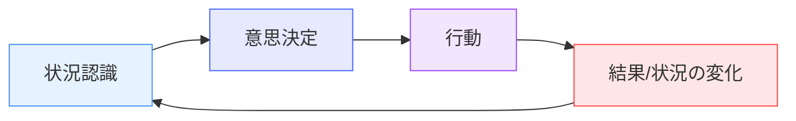
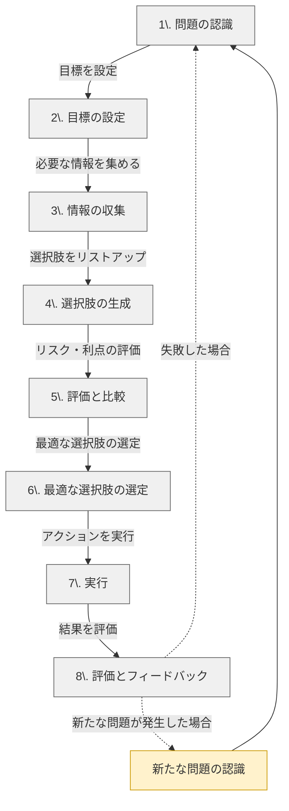

# 意思決定とは（Decision Making）

!!! info "このページについて"
    このページでは、状況認識に基づく意思決定のプロセス、種類、手法について解説します。状況認識は質の高い意思決定の基盤となります。

## 定義と重要性

意思決定（Decision Making）とは、**複数の選択肢の中から最も適切な行動や方針を選び出すプロセス**を指します。個人、組織、政府など、あらゆるレベルで行われ、戦略的、戦術的、日常的な場面で重要な役割を果たします。

!!! info "例えば"
    1982年のワシントンDCでの「エアフロリダ90便」の墜落事故は、パイロットが気象条件の悪化とエンジンの異常を適切に判断できなかった結果でした。状況認識の不備が、意思決定の誤りを引き起こした代表的な例です。

意思決定の質は以下の要因に大きく影響されます。

- **情報の質と量**: 利用可能な情報の正確さと範囲
- **状況認識のレベル**: 状況の知覚、理解、将来予測の精度
- **時間的制約**: 決定までの利用可能な時間
- **リスクと不確実性**: 結果の予測可能性

## 状況認識と意思決定の関係

状況認識と意思決定は密接に関連しています。以下の図は、状況認識が意思決定サイクルにどのように組み込まれるかを示しています。

状況認識の3つのレベル（知覚、理解、予測）はそれぞれ意思決定プロセスに影響します。

- **知覚（レベル1）**: 選択肢の識別と制約条件の認識
- **理解（レベル2）**: 選択肢の意味と影響の評価
- **予測（レベル3）**: 各選択肢の結果の予測と比較

!!! warning "不完全な状況認識の影響"
    状況認識が不完全または不正確な場合、それに基づく意思決定も同様に不適切になる可能性が高まります。例えば、パイロットが高度計の読み取りを誤ると（知覚の誤り）、必要のない高度調整という誤った決定につながる可能性があります。

## 意思決定のプロセス

一般的な意思決定のプロセスは以下のステップで構成されます。

#### 各ステップの詳細

|ステップ|内容|状況認識との関連|
|---|---|---|
|1. 問題の認識|解決すべき課題や機会を特定する|状況の知覚と理解に基づく|
|2. 目標の設定|何を達成したいのか明確にする|将来状態の予測と現状理解の対比|
|3. 情報の収集|意思決定に必要なデータや知識を集める|積極的な環境からの情報収集|
|4. 選択肢の生成|選べる代替案を洗い出し、リストアップする|環境の制約条件と可能性の理解|
|5. 評価と比較|各選択肢のメリット・デメリット、リスク、影響を分析する|選択肢の結果予測に基づく|
|6. 最適な選択肢の選定|分析結果をもとに最も適切な選択肢を選ぶ|予測能力に大きく依存|
|7. 実行|選択した方針に基づいて行動を起こす|実行中も継続的な状況監視が必要|
|8. 評価とフィードバック|結果を評価し、改善点を次の意思決定に反映させる|状況認識能力の向上に貢献|

### 新たな問題が発生するケース

意思決定が成功した場合でも、予期せぬ副作用や長期的な影響によって、新たな問題が発生することがあります。

#### 例
=== "災害対応"
    河川の氾濫防止のために放流を決定したが、下流地域に大規模な浸水被害が発生

=== "都市計画"
    再開発により商業エリアが発展したが、低所得者層が住む住宅が取り壊され、ホームレスが増加

=== "エネルギー政策"
    原発の停止で火力発電に依存した結果、CO2排出量が増加し、長期的な環境問題が深刻化

意思決定の最終フェーズである「評価とフィードバック」では、このような新たな問題を早期に検知し、再度意思決定を行うことが重要です。

## 意思決定の種類

意思決定にはいくつかの種類があり、それぞれに適した状況認識のレベルや範囲が異なります。

=== "戦略的意思決定"
    **概要**: 長期的な視点で行われ、組織や事業の方向性に影響を与える決定
    
    **例**: 新規事業への参入、企業の合併、グローバル展開
    
    **状況認識の特徴**: 広範な環境認識と長期的な予測が必要。マクロレベルの状況理解が重要。

=== "戦術的意思決定"
    **概要**: 中期的な視点で、戦略を達成するための手段を選択する決定
    
    **例**: マーケティング戦略の変更、製品ラインの調整
    
    **状況認識の特徴**: 組織内外の状況バランスの把握と中期的予測が必要。

=== "運用的意思決定"
    **概要**: 日常業務の効率化や最適化を目的とする短期的な決定
    
    **例**: 発注数量の決定、シフト管理の最適化
    
    **状況認識の特徴**: 即時的な環境理解と短期的予測が中心。詳細レベルの状況認識が重要。

## 意思決定を支援する手法

状況認識を活かした効果的な意思決定を支援するための手法がいくつか存在します。

|手法|説明|適した状況|
|---|---|---|
|SWOT分析|内部環境（Strengths, Weaknesses）と 外部環境（Opportunities, Threats）を評価する手法|状況の包括的な理解が必要な場合|
|PDCAサイクル|Plan（計画）、Do（実行）、Check（確認）、 Act（改善）の循環で業務改善を図る|継続的な改善と学習が必要な場合|
|費用便益分析|各選択肢の費用とベネフィットを定量的に評価し比較する|資源配分の最適化が必要な場合|
|決定マトリックス|複数の基準に基づいて選択肢を評価し得点化する|複数の要因を考慮する必要がある場合|
|シナリオプランニング|複数の将来シナリオを想定し、それぞれに対する準備を行う|不確実性が高い環境での長期的決定|

## 分野別の意思決定プロセス

各分野において、状況認識は意思決定プロセスに特有の形で組み込まれています。

=== "航空分野"
    **例**: パイロットは気象条件の悪化に対して、航路変更、高度変更、または目的地変更を決定する必要がある
        
    **プロセス**:  
    1. 気象レーダー、管制官からの情報、視覚的観察から状況を認識（知覚）  
    2. 飛行経路、燃料状況、機体性能との関連で気象の意味を理解（理解）  
    3. 各選択肢（そのまま飛行、迂回、引き返し）の結果を予測（予測）  
    4. 乗客の安全と定時性のバランスを考慮し最適な選択肢を選定  
    5. クルーと協力して決定を実行し、継続的に状況をモニタリング

=== "医療分野"
    **例**: 救急医が複数の患者のトリアージ（治療優先順位決定）を行う
    
    **プロセス**:  
    1. バイタルサイン、外傷の状態、意識レベルを観察（知覚）  
    2. 症状から各患者の緊急度と重症度を判断（理解）  
    3. 治療の遅れが各患者に与える影響を予測（予測）  
    4. 利用可能な医療リソースを考慮して治療順序を決定  
    5. 医療チームに指示を出し、状態変化に応じて優先順位を再評価

=== "災害対応"
    **例**: 豪雨時の避難指示発令の判断
    
    **プロセス**:  
    1. 雨量データ、河川水位、土砂災害警戒情報を収集（知覚）  
    2. 地域の脆弱性、避難所の収容状況を踏まえてリスクを評価（理解）  
    3. 降雨継続による浸水範囲と時間経過を予測（予測）  
    4. 避難指示の発令タイミングと対象地域を決定  
    5. 住民への伝達を実行し、状況変化に応じて指示を更新

=== "行政分野"
    **例**: 都市部での大規模再開発計画の承認判断
    
    **プロセス**:
    1. 人口統計、経済指標、インフラ状況、環境データの収集（知覚）
    2. 現在の都市課題、住民ニーズ、財政状況との関連付け（理解）
    3. 再開発による経済効果、交通流動、環境影響、社会変化の予測（予測）
    4. 短期的・長期的影響、費用対効果、政治的実現可能性を考慮した判断
    5. 段階的な計画実施と継続的なモニタリングによる調整

=== "軍事・警察分野"
    **例**: 人質事案における戦術チームの突入判断  
    
    **プロセス**:
    1. 建物構造、犯人情報、人質状況、周辺環境の情報収集（知覚）  
    2. 犯人の意図、危険度、人質の健康状態、時間経過の影響の評価（理解）  
    3. 交渉継続、待機、突入など各選択肢のリスクと成功確率の予測（予測）  
    4. 人命保護を最優先しつつ、戦術的優位性と状況変化を考慮した判断  
    5. 選択した戦術の実行と状況変化に応じた即時的な計画調整

=== "鉄道分野"
    **例**: 悪天候時の列車運行継続または運休の判断
    
    **プロセス**:  
    1. 気象情報、線路状態、車両状況、乗客数の把握（知覚）  
    2. 安全運行への影響度、代替輸送手段の可能性、影響範囲の特定（理解）  
    3. 天候悪化の進行、運休による連鎖的影響、旅客の滞留状況の予測（予測）  
    4. 安全性を最優先しつつ、社会的影響や経済的損失を考慮した運行判断  
    5. 決定内容の速やかな伝達と、状況変化に応じた運行計画の更新

=== "プラント運転・工場管理"
    **例**: 化学プラントでの異常検知時の対応決定
    
    **プロセス**:  
    1. プロセスパラメータ（温度、圧力、流量）、警報情報、視覚的確認（知覚）  
    2. 異常の原因特定、影響範囲の評価、安全リスクレベルの判断（理解）  
    3. 対応遅延によるプロセス悪化、各対応策の結果、安全影響の予測（予測）  
    4. プラント安全、環境影響、生産損失のバランスを考慮した対応策選択  
    5. 手順に基づく対応実施と継続的なパラメータ監視による再評価

=== "スポーツコーチング"
    **例**: サッカー試合中の戦術変更とメンバー交代
    
    **プロセス**:  
    1. 選手のパフォーマンス、対戦相手の戦術、得点状況、残り時間の把握（知覚）  
    2. チームの強み/弱み、対戦相手の変化、選手の疲労度の分析（理解）  
    3. 戦術変更やメンバー交代による試合展開の変化予測（予測）  
    4. 勝利確率を最大化する戦術とメンバー構成の決定  
    5. 指示の伝達と試合展開に応じた継続的な戦術調整

## 意思決定を妨げる要因

良好な状況認識があっても、以下の要因が意思決定の質を低下させる可能性があります。

### 認知バイアス

!!! example "主な認知バイアス"
    - **確証バイアス**: 既存の信念を支持する情報を優先的に処理する傾向
    - **アンカリング効果**: 最初に得た情報に過度に影響される傾向
    - **可用性ヒューリスティック**: 思い出しやすい事例に基づいて判断する傾向
    - **過信バイアス**: 自分の能力や判断を過大評価する傾向

### その他の障害要因

- **時間的プレッシャー**: 急いで決定を下さなければならない状況
- **グループシンク**: 集団内での調和維持のために批判的思考が抑制される現象
- **感情的要因**: 恐怖、怒り、過度の楽観などの感情が判断に影響
- **情報過多**: 処理しきれない量の情報による判断能力の低下

## 効果的な意思決定のための実践的ヒント

#### 状況認識に基づいた効果的な意思決定のためのヒント

|ヒント|詳細|
|---|---|
|1. **状況認識の質を高める**|・定期的な状況の再評価 ・複数の情報源からの確認 ・先入観を排した観察
|2. **バイアスへの対策**|・意識的にデビルズアドボケート（反対意見）を検討 ・決定前の「プレモーテム」（事前検証）の実施 ・チェックリストの活用
|3. **チーム意思決定の強化**|・多様な視点の統合 ・オープンなコミュニケーション文化の構築 ・共有メンタルモデルの形成
|4. **継続的な学習と改善**|・過去の決定の振り返り ・フィードバックループの確立 ・「弱い信号」への感度向上

## まとめ

質の高い意思決定は良好な状況認識を基盤としています。状況の適切な知覚、理解、予測なしに効果的な決定を下すことは困難です。同時に、優れた状況認識があっても、認知バイアスやその他の障害要因によって意思決定が妨げられることもあります。

効果的な意思決定のためには、状況認識能力の向上と共に、体系的な意思決定プロセスの採用、バイアスへの対策、継続的な学習が重要です。これらの要素が組み合わさることで、個人からチーム、組織に至るまで、あらゆるレベルでの意思決定の質を高めることが可能になります。

次のセクション「[包括的ガイド](../comprehensive-guide/)」では、状況認識と意思決定についてより深く掘り下げていきます。

## 関連リンク
- [状況認識とは](./what-is-sa.md)
- [Endsleyの3レベルモデル](./endsley-model.md)
- [包括的ガイド](../comprehensive-guide/)
- [応用分野での利用](../applications/index.md)
