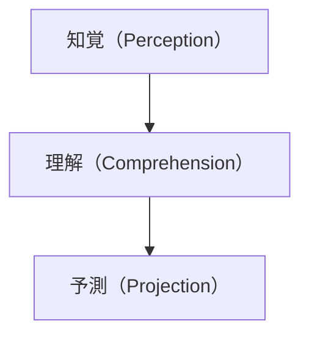
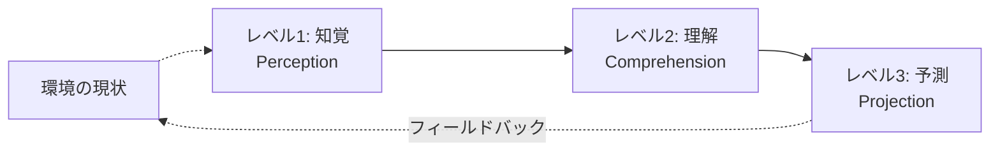
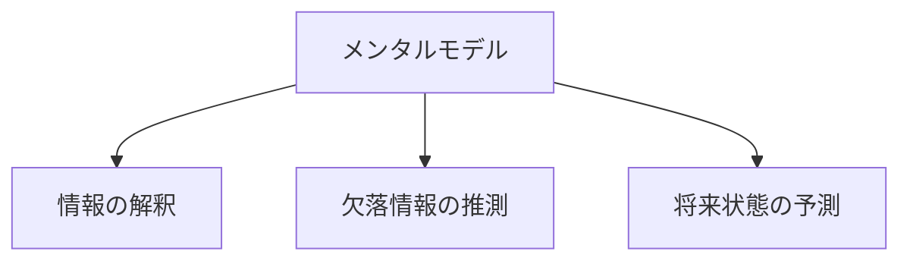

# Endsleyの3レベルモデル

!!! info "このページについて"
    このページでは、Mica R. Endsleyによって提唱された状況認識の3レベルモデルについて詳しく解説します。このモデルは、状況認識研究の基礎となる理論的枠組みです。

## モデルの背景

Mica R. Endsley博士は、1980年代から90年代にかけて、主に航空分野での研究を通じて状況認識（Situation Awareness、以下SA）の概念を体系化しました。当時、航空事故の多くが「パイロットがなぜその状況を適切に認識できなかったのか」という問題に関連していたことから、人間の状況認識プロセスを理解する必要性が高まっていました。

Endsley博士は1995年の論文[^1]で、今日広く受け入れられている状況認識の3レベルモデルを詳細に提示しました。このモデルは、航空業界だけでなく、**軍事作戦の指揮**、**自動車の自動運転**、**災害時の指揮管理**、**医療現場のモニタリング**など、幅広い分野で応用されています。

## 3レベルモデルの概要

Endsleyのモデルでは、状況認識は階層的な3つのレベルから構成されています。

このモデルの重要な特徴は、**各レベルが前のレベルを基盤としている**という点です。つまり、レベル1（知覚）が不完全だと、レベル2（理解）も不完全になり、結果としてレベル3（予測）も不正確になります。

## 理論モデルの視覚化

以下は、状況認識の3レベルを示したフロー図です。

## レベル1: 知覚（Perception）

知覚は、環境内の状態、属性、動的な要素を**感知する**プロセスです。

!!! example "レベル1の要素"
    - 環境内の関連する要素の検出
    - 要素の特性（色、形、音、匂いなど）の認識
    - 要素の位置、動き、状態の把握
    - 現在の時間に対する認識

知覚は単なる感覚的な検出以上のもので、関連情報に**注意を向ける**という能動的なプロセスを含みます。情報の洪水の中から、状況に関連する重要な情報を選別する能力が求められます。

=== "航空分野の例"
    パイロットが計器から高度、速度、方位、燃料量を読み取り、無線から航空管制官の指示を聞き、窓から視界の状態や他の航空機を確認する。

=== "医療分野の例"
    医師が患者の皮膚の色、脈拍、呼吸パターン、体温を観察し、モニターから血圧や酸素飽和度を確認し、検査結果から血液値を把握する。

=== "自動車運転の例"
    ドライバーが速度計や燃料計を確認し、道路標識、信号、他の車両、歩行者、道路状態を認識する。

=== "プール監視員"
    監視員がプール全体の泳者の位置、水面の動き、泳者の表情や動作パターン、プールサイドの行動（走っている子供など）を同時に観察する。

=== "行政/災害対応の例"
    災害対策本部が各地域からの被害報告、気象データ、避難所の状況報告を収集する。

=== "警察/軍事の例"
    警察官が現場での人々の行動、声の調子、手の動き、周囲環境などを観察する。

## レベル2: 理解（Comprehension）

理解は、知覚した個々の要素を統合し、現在の状況の**意味を把握する**プロセスです。このレベルでは、単なるデータの認識を超えて、状況の全体像を形成します。

!!! example "レベル2の要素"
    - 知覚した情報のパターン認識
    - 情報の優先順位付けと関連性の評価
    - 情報の統合と全体像の構築
    - 目標との関連における状況の意味解釈

理解のプロセスは、個人の経験、訓練、専門知識に大きく依存します。同じ情報を知覚しても、経験者と初心者では状況の理解が大きく異なる場合があります。

=== "航空分野の例"
    パイロットが高度、速度、方位、気象情報を統合し、「航空機は現在、予定よりも低い高度で飛行しており、前方には低気圧領域がある」と状況を認識する。

=== "医療分野の例"
    医師が患者の症状、バイタルサイン、検査結果を統合し、「患者は敗血症の初期段階にある可能性が高い」と状況を理解する。

=== "自動車運転の例"
    ドライバーが道路状況と他の車両の動きを統合し、「前方の交差点では右折車が渋滞を引き起こしており、左車線の方が流れが良い」と理解する。

=== "プール監視員"
    泳ぎ方から泳力を判断し、特定の動き（不規則な手の動きや水面下での長時間の停滞）が溺れかけている兆候だと理解する。また、子供と保護者の関係性を把握して監視の必要度を判断する。

=== "行政/災害対応の例"
    収集した情報から被害の規模と分布、リソースの状況、最も支援が必要な地域を把握する。

=== "警察/軍事の例"
    観察した情報から現場の緊張度、潜在的な脅威、状況の安全性を判断する。

## レベル3: 予測（Projection）

予測は、現在の状況の理解に基づいて、**近い将来の状態を予測する**能力です。このレベルが状況認識の最も高度な形態であり、効果的な意思決定の鍵となります。

!!! example "レベル3の要素"
    - 現在の状況から将来の状態の予測
    - 様々な行動選択肢の結果の予測
    - 時間的制約や変化する要素の影響の予測
    - 予期せぬ事態への心の準備

予測能力は経験と専門知識に大きく依存しますが、適切な訓練によって向上させることができます。

=== "航空分野の例"
    パイロットが「このまま飛行を続けると15分後に低気圧領域に入り、乱気流に遭遇する可能性がある。高度を上げるか航路を変更する必要がある」と予測する。

=== "医療分野の例"
    医師が「現在の治療を継続した場合、患者の状態は悪化し、12時間以内に呼吸補助が必要になる可能性が高い。予防的に集中治療室への移動を検討すべきだ」と予測する。

=== "自動車運転の例"
    ドライバーが「前方の車が減速しており、ブレーキランプが点灯している。前方で何か障害物があるか事故が発生している可能性があるため、速度を落とし、車線変更の準備をすべきだ」と予測する。

=== "プール監視員"
    泳者の疲労の兆候や行動パターンから、数分後に危険な状況になる可能性を予測し、事前に近くに移動して準備する。また、混雑度や利用者の年齢構成から事故リスクの高まりを予測する。

=== "行政/災害対応の例"
    現在の状況と気象予報から今後12時間の浸水地域の拡大、避難者数の増加、必要となる物資量を予測する。

=== "警察/軍事の例"
    現在の状況から事態の進展を予測し、介入のタイミングや必要な支援の判断する。

## モデルを支える認知メカニズム

Endsleyのモデルは、以下のような認知プロセスに支えられています。

### 注意（Attention）

注意は限られた資源であり、複数のタスクを同時に行う場合や情報過多の状況では、状況認識が低下する可能性があります。注意の配分は状況認識の質に直接影響します。

!!! warning "注意の分散の影響"
    例えば、パイロットが通信に集中しすぎると、計器の確認が疎かになり、高度の低下に気づかないことがあります。このような「注意のトンネル化」は、危機的状況でよく発生します。

### 作業記憶（Working Memory）

作業記憶は容量に限りがあり、一度に処理できる情報量に制約があります。このため、効果的な状況認識には、情報の効率的な処理と優先順位付けが必要です。

### メンタルモデル（Mental Models）

メンタルモデルは、システムや環境に対する内部表現であり、状況の理解と予測に不可欠です。適切なメンタルモデルを持つことで、少ない情報からでも状況を正確に推測できるようになります。

## 意思決定との関係

Endsleyのモデルでは、状況認識は意思決定の前提条件であり、状況認識の質が意思決定の質に直接影響するとされています。

このサイクルは継続的に繰り返され、新たな状況の変化に応じて状況認識が更新されます。

## モデルの限界と批判

Endsleyのモデルは広く受け入れられていますが、いくつかの批判や代替的な視点も存在します。

=== "状況の主観性"
    状況認識は個人の主観的なプロセスであり、同じ状況でも個人によって認識が異なる場合があります。モデルは個人差を十分に考慮していないという批判があります。

=== "分散認知の視点"
    Stanton等の研究者は、状況認識は個人の頭の中だけではなく、**チーム全体**や**複数のシステム**に分散していると主張しています。「分散状況認識（Distributed SA）」の概念[^2]
    
    例として、航空管制では、パイロット、管制官、地上スタッフがそれぞれ異なる情報を持ち、リアルタイムで共有することで安全な運航が成り立っています。

=== "動的な性質"
    状況認識は静的なものではなく、常に変化するプロセスです。モデルはこの動的な性質を十分に表現していないという指摘もあります。

## まとめ

Endsleyの3レベルモデルは、状況認識のプロセスを知覚、理解、予測という階層的な構造で説明し、状況認識研究の基盤となっています。このモデルは、航空、医療、軍事、緊急対応など多くの分野で応用され、状況認識の向上のための訓練プログラムや支援システムの開発に貢献しています。

| レベル | 概要 | 具体例の要素 |
|--------|------|----------------------------|
| レベル1: 知覚 | 環境情報の感知 | 計器の読み取り、音・視覚の確認 |
| レベル2: 理解 | 状況の意味づけと統合 | 現在の状態の把握、優先判断 |
| レベル3: 予測 | 将来の状態の予測 | 危険の予知、対応判断、行動準備 |

## 関連リンク
- [意思決定とは](../decision-making)
- [状況認識の測定方法](../../situational-awareness-guide/measuring-sa)
- [応用分野での利用](../../applications/)

次のページ「[意思決定とは](../decision-making)」では、状況認識に基づいてどのように意思決定が行われるかについて詳しく解説します。

[^1]: Endsley, M. R. (1995). Toward a theory of situation awareness in dynamic systems. *Human Factors, 37*(1), 32-64.
[^2]: Stanton, N. A., Stewart, R., Harris, D., Houghton, R. J., Baber, C., McMaster, R., Salmon, P., Hoyle, G., Walker, G., Young, M. S., Linsell, M., Dymott, R., & Green, D. (2006). Distributed situation awareness in dynamic systems: Theoretical development and application of an ergonomics methodology. *Ergonomics, 49*(12-13), 1288-1311.
