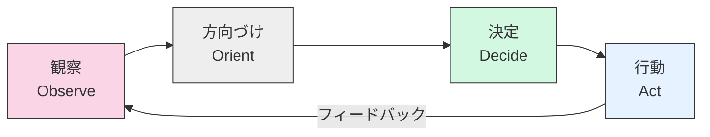
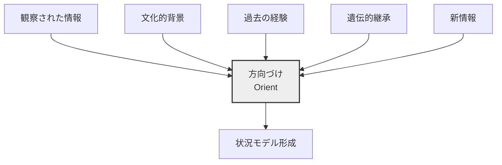
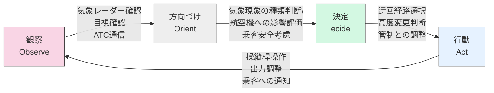

# OODAループ

!!! info "このページについて"
    このページでは、アメリカ空軍のジョン・ボイド大佐（John Boyd）によって開発された意思決定と適応のための概念的フレームワークについて詳しく解説します。

## OODAループとは

OODAループは、アメリカ空軍のジョン・ボイド大佐（John Boyd）によって開発された意思決定と適応のための概念的フレームワークです。「Observe（観察）」「Orient（方向づけ）」「Decide（決定）」「Act（行動）」の頭文字を取ったこの循環的プロセスは、当初は空中戦における戦術的優位性を確保するために考案されましたが、現在では軍事だけでなく、ビジネス戦略、危機管理、法執行、スポーツなど様々な分野で応用されています。

OODAループの核心は、不確実性と変化の激しい環境において、より速く効果的に適応し、意思決定を行うための方法論を提供することにあります。

## OODAループの各段階

### 1. 観察（Observe）

観察段階では、環境から生データを収集します。これには以下が含まれます。

- **外部情報の収集**: 視覚・聴覚などの感覚を通じた環境の直接観察
- **情報源からのデータ獲得**: 報告書、センサーデータ、コミュニケーションなど
- **フィードバックの取り込み**: 過去の行動結果からの情報

重要なのは、観察は単なるデータ収集ではなく、積極的かつ継続的なプロセスであり、状況の変化を敏感に捉える必要があるという点です。状況認識の「知覚」レベルに相当します。

### 2. 方向づけ（Orient）

方向づけは、OODAループの中で最も複雑かつ重要な段階です。ここでは収集した情報を処理し、状況を理解し、その意味を解釈します。

- **分析と統合**: 収集したデータの分析と既存知識との統合
- **文化的伝統の影響**: 個人・組織の価値観や文化による解釈フィルター
- **過去の経験の活用**: 類似状況での経験からの学び
- **新情報の取り込み**: 新たな情報による既存の理解の修正

この段階は、Endsleyの状況認識モデルの「理解」のレベルに相当し、意思決定の基盤となる「状況モデル」を構築します。

### 3. 決定（Decide）

決定段階では、方向づけによって形成された状況理解に基づいて、取るべき行動を選択します。

- **選択肢の生成**: 可能な行動案の創出
- **リスク評価**: 各選択肢のリスクと利益の分析
- **資源配分**: 利用可能なリソースの最適配分の決定
- **意図の明確化**: 何を達成したいのかの明確化

この段階では、状況予測（Endsleyモデルのレベル3）を活用し、各選択肢の結果を予測した上で意思決定を行います。

### 4. 行動（Act）

行動段階では、決定を実行に移します。

- **実施**: 選択した行動計画の実行
- **コミュニケーション**: チームメンバーへの指示・情報共有
- **モニタリング**: 実行中の進捗状況の監視
- **適応**: 必要に応じた即時調整

行動の結果は新たな観察材料となり、OODAループは継続的に回り続けます。

## OODAループの特性と応用

### OODAループの特性

OODAループの重要な特性として以下が挙げられます。

1. **循環性**: 一度きりではなく継続的なプロセス
2. **適応性**: 新しい情報や変化に対応して調整される
3. **速度**: より速くループを回すことが競争優位につながる（「時間的優位性」）
4. **並列処理**: 複数のループが同時に動作可能
5. **暗黙知の活用**: 経験と直感に基づく迅速な判断

### 応用分野

=== "軍事分野"

    - 戦術・戦略立案
    - 指揮統制システム
    - 非対称戦争への対応
    - 特殊作戦計画

=== "ビジネス分野"

    - 競争戦略立案
    - 市場の変化への適応
    - 危機対応マネジメント
    - アジャイル開発手法

=== "危機管理・緊急対応"

    - 災害対応オペレーション
    - 救急医療での意思決定
    - 治安維持活動
    - 航空管制での判断

## 状況認識との関係性

OODAループと状況認識（SA）には密接な関係があります。

| OODA段階 | 状況認識レベル | 関係性 |
|---|---|---|
| 観察（Observe） | レベル1: 知覚 | 環境要素の検出と認識 |
| 方向づけ（Orient） | レベル2: 理解 | 状況要素の統合と意味づけ |
| 決定（Decide） | レベル3: 予測 | 将来状態の予測と行動選択 |
| 行動（Act） | － | SAの結果の実行段階 |

OODAループは状況認識に時間的次元と行動次元を加え、意思決定と実行のプロセス全体をカバーするモデルと言えます。状況認識が「今何が起きているか」を把握するのに対し、OODAループはそれを含みつつ「それに対して何をすべきか」まで拡張しています。

## OODAループの高度化手法

=== "1. ループ速度の向上"

    OODAループの速度を上げるための方法としては以下があります。

    - **意思決定の権限委譲**: 現場レベルでの判断を可能にする
    - **情報共有の効率化**: リアルタイム情報システムの活用
    - **標準操作手順（SOP）の確立**: 定型的状況での反応を自動化
    - **継続的訓練**: ループの各段階を習熟により高速化

=== "2. ループ質の向上"

    単に速いだけでなく、質の高いOODAループを実現するには。

    - **多様な情報源の活用**: 偏りのない状況認識のため
    - **批判的思考の促進**: 仮説検証と想定への挑戦
    - **意識的バイアス対策**: 認知バイアスの認識と軽減
    - **学習文化の醸成**: 失敗からの積極的な学習

=== "3. テクノロジーによる強化"

    現代のOODAループはテクノロジーによって強化されています。

    - **センサー技術**: 観察能力の拡張
    - **ビッグデータ分析**: 大量情報からのパターン発見
    - **AIによる意思決定支援**: 選択肢の評価と提案
    - **シミュレーション**: 行動結果の事前予測
    - **通信システム**: チーム間の連携強化

## 実践例：航空分野におけるOODAループ

航空分野、特にパイロットの意思決定プロセスでは、OODAループが明確に見られます。

### 異常気象遭遇時のOODAループ

=== "**観察（Observe）**"
    - 気象レーダーで前方の気象情報を確認
    - 目視による雲形状や色の観察
    - 管制からの気象情報受信
    - 他機からの無線報告聴取

=== "**方向づけ（Orient）**"
    - 気象現象の種類と強度の判断
    - 現在の機体性能・状態との関連付け
    - 代替経路の利用可能性の評価
    - 乗客の安全・快適性への影響判断

=== "**決定（Decide）**"
    - 気象回避経路の選択
    - 高度変更の必要性判断
    - 速度調整の決定
    - 管制との交渉戦略の決定

=== "**行動（Act）**"
    - 操縦桿操作による針路変更
    - エンジン出力調整
    - 管制との交信
    - 乗客への通知

このプロセスは連続的に繰り返され、新たな気象情報や機体状態に基づいて常に更新されます。パイロットは訓練と経験を通じて、このループを極めて短時間で、時にはほぼ自動的に実行できるようになります。

## OODAループの課題と限界

OODAループは強力な概念フレームワークですが、いくつかの課題と限界も存在します。

=== "情報過負荷"

    |問題|対策|
    |---|---|
    |過剰な情報が観察と方向づけを圧倒する可能性|情報フィルタリングと優先順位付けの仕組み導入|

=== "認知バイアス"

    |問題|対策|
    |---|---|
    |特に方向づけ段階での認知バイアスによる誤判断|バイアス認識訓練と多様な視点の意図的導入|

=== "組織的慣性"

    |問題|対策|
    |---|---|
    |官僚制や階層構造によるループの遅延|権限委譲と分散型意思決定の促進|

=== "不確実性の残存"

    |問題|対策|
    |---|---|
    |完全な情報は得られず、常に不確実性が存在|柔軟性と適応性を重視した意思決定|

## OODAループの発展と将来

=== "理論的発展"

    OODAループは、その基本概念を保ちながらも、認知科学、複雑系理論、ネットワーク理論などの進展により理論的に発展しています。

    - **認知的次元の深化**: 意思決定の神経科学的基盤の解明
    - **集合的OODAループ**: チームや組織レベルでの適用モデル
    - **非線形ダイナミクス**: 複雑適応系としてのOODAプロセス理解

=== "AIとOODAループの融合"

    人工知能技術はOODAループの各段階を強化・自動化する可能性を持っています。

    - **観察段階**: マルチモーダルセンシングとデータ融合
    - **方向づけ段階**: 機械学習による状況理解と文脈化
    - **決定段階**: 意思決定支援システムとリスク分析
    - **行動段階**: 自動化システムと人間-AI協働

=== "今後の研究課題"

    - **測定と評価**: OODAループの効率性・効果性の定量的測定
    - **訓練方法論**: OODAスキル向上のための体系的アプローチ
    - **文化的影響**: 国・組織文化がOODAプロセスに与える影響
    - **倫理的側面**: AI支援下でのOODA実行の倫理的枠組み

## まとめ

### OODAループと状況認識の統合的理解

OODAループは、状況認識を基盤としながらも、それを意思決定と行動へと接続する包括的フレームワークです。状況認識が「何が起きているか」を理解するプロセスであるのに対し、OODAループはさらに「どう反応すべきか」までを含んだ循環的な適応システムとして機能します。

効果的なOODAループの実践には以下が重要です。

1. **状況認識の質**: 正確で包括的な状況理解
2. **適応的思考**: 固定観念にとらわれない柔軟な思考
3. **意思決定の明確さ**: 明確な意図と優先順位に基づく判断
4. **実行の迅速さ**: 決定から行動への迅速な移行
5. **継続的学習**: ループからの学びを次のサイクルへ活かす姿勢

OODAループは単なる理論モデルを超え、実践的な思考法・行動指針として、不確実性と変化の激しい現代において、個人から組織まで様々なレベルで価値を提供し続けています。

次のセクション「[状況認識の理論と実践](../../situational-awareness-guide/)」では、状況認識と意思決定についてより深く掘り下げていきます。

## 参考文献・関連リソース

1. Boyd, J. R. (1987). A discourse on winning and losing. Maxwell Air Force Base, AL: Air University Library Document No. M-U 43947.
2. Osinga, F. P. B. (2007). Science, strategy and war: The strategic theory of John Boyd. Routledge.
3. Richards, C. (2004). Certain to win: The strategy of John Boyd, applied to business. Xlibris Corporation.
4. Ensley, M. R. (1995). Toward a theory of situation awareness in dynamic systems. Human Factors, 37(1), 32-64.
5. Klein, G. (1998). Sources of power: How people make decisions. MIT Press.
6. 松尾芭蕉 (2018). 『不確実性時代の意思決定: OODAループとレジリエント組織』 東洋経済新報社.
7. 防衛研究所 (2020). 『軍事戦略論: OODAループと現代戦闘』 防衛省.