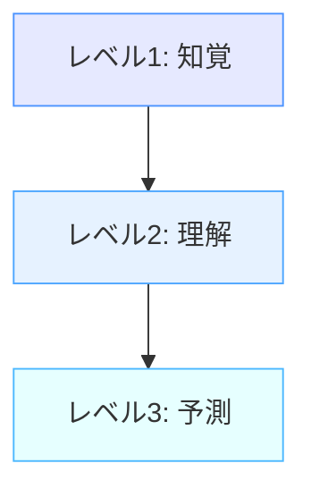

# 状況認識（Situational Awareness）とは

!!! info "このページについて"
    このページでは状況認識の基本的な定義、重要性、および主要な概念を説明します。次のページ「[Endsleyの3レベルモデル](./endsley-model.md)」で詳細な理論的枠組みを解説します。

## 定義

状況認識（Situation Awareness、以下SA）とは、**環境内の要素や出来事を認識し、その意味を理解し、将来の状態を予測する認知能力**です。

より正確には、Mica Endsleyによって以下のように定義されています。

> 「時間と空間の範囲内で環境の要素を認識し、その意味を理解し、近い将来の状態を予測すること」
> 
> <cite>Endsley, 1995[^1]</cite>

[^1]: Endsley, M. R. (1995). Toward a theory of situation awareness in dynamic systems. *Human Factors, 37*(1), 32-64.

## 歴史的背景

状況認識（SA）の概念は、1980年代に軍事航空分野で初めて取り入れられました。  
特に、空中戦闘でのパイロットが迅速に状況を把握し、意思決定を行う必要があったためです。  
その後、航空管制、宇宙産業、原子力発電、さらには自動運転技術にも応用されています。

## 理論モデル

SAを理解する上で重要な理論モデルとして、以下の2つがあります：

1. **Endsleyの3レベルモデル**
    - 知覚 → 理解 → 予測 の3つの階層で状況認識を分類
    - 詳しくは [Endsleyの3レベルモデル](./endsley-model.md) を参照してください。

2. **OODAループ**
    - 観察 (Observe) → 判断 (Orient) → 決定 (Decide) → 行動 (Act) を繰り返すフレームワーク
    - 元々は軍事戦略として生まれ、現在はビジネスや危機管理でも使用されています。

## 関連する研究領域

- **ヒューマンファクター (Human Factors)**  
- **認知科学 (Cognitive Science)**  
- **自律システム (Autonomous Systems)**  

## 状況認識の3つのレベル

Endsleyのモデルでは、状況認識は3つの階層的なレベルに分けられます。

