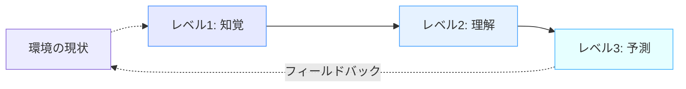

# 状況認識（Situational Awareness）とは

!!! info "このページについて"
    このページでは状況認識の基本的な定義、重要性、および主要な概念を説明します。次のページ「[Endsleyの3レベルモデル](./endsley-model.md)」で詳細な理論的枠組みを解説します。

## 定義

状況認識（Situation Awareness、以下SA）とは、**環境内の要素や出来事を認識し、その意味を理解し、将来の状態を予測する認知能力**です。

より正確には、Mica Endsleyによって以下のように定義されています。

> 「時間と空間の範囲内で環境の要素を認識し、その意味を理解し、近い将来の状態を予測すること」
> 
> <cite>Endsley, 1995[^1]</cite>

[^1]: Endsley, M. R. (1995). Toward a theory of situation awareness in dynamic systems. *Human Factors, 37*(1), 32-64.

## 歴史的背景

状況認識（SA）の概念は、1980年代に軍事航空分野で初めて取り入れられました。  
特に、空中戦闘でのパイロットが迅速に状況を把握し、意思決定を行う必要があったためです。  
その後、航空管制、宇宙産業、原子力発電、さらには自動運転技術にも応用されています。

## 理論モデル

SAを理解する上で重要な理論モデルとして、以下の2つがあります。

-   ### [Endsleyの3レベルモデル](./endsley-model.md)

    ---

    #### 3つの階層で状況認識を分類
    
    - 知覚
    - 理解
    - 予測 
    
    詳しくは [Endsleyの3レベルモデル](./endsley-model.md) を参照してください。

-   ### [OODAループ](./ooda-loop.md)

    ---
    
    #### 4つのプロセスを繰り返すフレームワーク

    - 観察 (Observe)
    - 判断 (Orient) 
    - 決定 (Decide) 
    - 行動 (Act)
    
    元々は軍事戦略として生まれ、現在はビジネスや危機管理でも使用されています。

## 関連する研究領域

- **ヒューマンファクター (Human Factors)**  
- **認知科学 (Cognitive Science)**  
- **自律システム (Autonomous Systems)**  

## 状況認識の3つのレベル

Endsleyのモデルでは、状況認識は3つの階層的なレベルに分けられます。

!!! note "用語について"
    英語の「Projection」は本来「投射」と訳すのが厳密ですが、本サイトでは読みやすさを考慮して以降のページでは主に「予測」という言葉を使用します。どちらも「現在の状況から将来の状態を推測する能力」を指します。

=== "レベル1: 知覚 (Perception)"
    環境内の関連情報を**検出し認識する**基本的な段階です。
    
    - **例**: パイロットが計器から現在の高度、速度、方向を読み取る、医師が患者の顔色や体温を確認する

=== "レベル2: 理解 (Comprehension)"
    知覚した情報を**統合し解釈する**段階です。パターン認識や状況の全体像の形成が含まれます。
    
    - **例**: パイロットが複数の計器の値から航空機の全体的な状態を理解する、医師が複数の症状から特定の疾患の可能性を考える

=== "レベル3: 投射/予測 (Projection)"
    理解した情報に基づいて、環境内の要素の**将来の状態を推測する**最高レベルです。
    
    - **例**: パイロットが現在の航路と気象条件から10分後の飛行状況を予測する、医師が現在の治療方針を継続した場合の患者の回復見込みを予測する

次のページ「[Endsleyの3レベルモデル](./endsley-model.md)」では、Mica R. Endsleyによって提唱された状況認識の3レベルモデルについて詳しく解説します。
