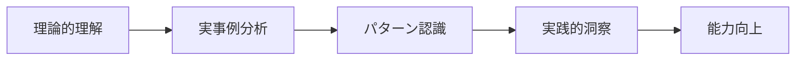

# ケーススタディ

!!! info "このページについて"
    このセクションでは、実際に発生した事例を通じて、状況認識と意思決定の理論がどのように現実世界で機能するか（または機能しなかったか）を学びます。  
    理論の理解を深め、実践的な洞察を得ることで、より効果的な状況認識と意思決定能力の向上を目指します。

## ケーススタディの目的

ケーススタディ分析は、以下の学習目標を持っています。

### 1. 理論と実践の橋渡し
抽象的な理論概念を具体的な現実状況に適用し、理論の実用性と限界を理解します。

### 2. 複雑性の理解
現実世界では複数の要因が相互作用し、教科書的な単純さでは解決できない複雑さがあることを学びます。

### 3. 失敗からの学習
特に失敗事例からは、成功事例以上に多くの教訓を得ることができます。

### 4. 予防的思考の育成
過去の事例を分析することで、類似した問題を未然に防ぐ思考力を養います。

## 分析フレームワーク

各ケーススタディでは、以下の構造化されたアプローチを使用します。

| 分析段階 | 内容 | 目的 |
|---------|------|------|
| **状況設定** | 背景、関係者、環境条件 | 文脈の理解 |
| **状況認識分析** | 各関係者の認識プロセス | 認識の成功と失敗の特定 |
| **意思決定分析** | 決定プロセスと判断基準 | 意思決定の質の評価 |
| **要因分析** | 根本原因と貢献要因 | システム的理解 |
| **教訓抽出** | 学習ポイントと予防策 | 実践的価値の導出 |

## 現在利用可能なケーススタディ

### [羽田空港地上衝突事故（2024年1月2日）](./haneda-airport-collision.md)

**概要**: 海上保安庁機と日本航空機の滑走路上での衝突事故

**主要学習ポイント**:

- 複数関係者間での状況認識の齟齬
- コミュニケーションエラーの連鎖的影響
- 技術支援システムと人間判断の協調
- 緊急時における意思決定プロセス

**関連理論**:

- [Endsleyの3レベルモデル](../basics/endsley-model.md)
- [認知バイアス](../decision-making-guide/cognitive-biases.md)
- [チーム意思決定](../decision-making-guide/team-decision-making.md)
- [不確実性下の意思決定](../decision-making-guide/uncertainty.md)

## ケーススタディの活用方法

### 個人学習者向け

1. **事前準備**: 関連する理論的背景を復習
2. **批判的分析**: 自分ならどう判断したかを考える
3. **比較検討**: 他の類似事例との比較
4. **実践応用**: 自分の分野への教訓の応用

### 教育者向け

1. **討論材料**: グループディスカッションの素材として活用
2. **シミュレーション**: 類似状況のロールプレイ設計
3. **評価課題**: 学習者の理解度測定
4. **研究発展**: より深い調査研究の出発点

### 実務者向け

1. **リスク評価**: 自組織での類似リスクの特定
2. **プロセス改善**: 既存の意思決定プロセスの見直し
3. **訓練設計**: 効果的な訓練プログラムの開発
4. **予防対策**: 事故防止システムの強化

## 倫理的考慮事項

ケーススタディを学習に活用する際は、以下の倫理的原則を遵守します。

!!! warning "重要な注意事項"
    
    **責任追及ではなく学習が目的**

    - 個人や組織を批判することが目的ではありません
    - システム的改善と予防に焦点を当てます
    
    **被害者・関係者への配慮**

    - 事故や事件の被害者への敬意を払います
    - センセーショナリズムを避け、建設的な分析に徹します
    
    **事実に基づく分析**
    
    - 公式調査報告書や信頼できる情報源を使用
    - 推測や憶測を明確に区別します

## 今後の展開

このケーススタディセクションは継続的に拡充していきます。

### 計画中のケーススタディ（予定）
- 海事分野の状況認識事例
- 医療分野の意思決定事例  
- 災害対応における協調的状況認識
- 企業経営における戦略的意思決定

### コミュニティからの貢献
読者の皆様からのケーススタディ提案や分析の貢献も歓迎します。特に以下の分野での事例をお待ちしています。

- 製造業・工場運営
- 交通・物流
- 金融・投資
- 情報技術・サイバーセキュリティ

---

実際の事例から学ぶことで、理論的知識を実践的な智慧に変換し、より良い状況認識と意思決定能力を身につけましょう。

