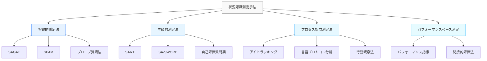

# 状況認識の測定方法

!!! info "このページについて"
    このページでは、状況認識（Situation Awareness）の測定と評価に関する様々な手法について解説します。理論的基盤から実践的な適用まで、状況認識を客観的に評価するための手法を学びます。

## 状況認識測定の重要性

状況認識（SA）を測定する能力は、以下の理由から重要です。

- **トレーニングの有効性評価**: SA向上トレーニングがどの程度効果があるかを定量的に評価できる
- **システム設計の最適化**: 情報表示やインターフェースがSAをどの程度支援するかを測定できる
- **パフォーマンスの予測**: SAのレベルが実際のパフォーマンスにどう影響するかを理解できる
- **安全管理**: 高リスク環境での安全上の問題を特定し、対策を講じる基盤となる

ただし、SAは直接観察できない内的な認知状態であるため、その測定には特別な手法と注意が必要です。

## 測定手法の分類

状況認識の測定手法は、大きく以下のカテゴリに分類できます。

## 主要な測定技法

### ▪️ SAGAT（Situation Awareness Global Assessment Technique）

SAGAT（シチュエーション・アウェアネス・グローバル・アセスメント・テクニック）は、Endsleyによって開発された、状況認識を客観的に測定するための代表的な手法です。

#### 基本的なプロセス

1. シミュレーション環境で課題を実施
2. 予告なくシミュレーションを一時停止（フリーズ）
3. 画面を隠し、状況に関する質問に回答させる
4. 回答と実際の状況を比較して評価

#### 特徴
- Endsleyの3レベルモデル（知覚、理解、予測）に基づいた質問設計
- 直接的かつ客観的な測定が可能
- 様々な分野（航空、交通、医療など）に適用可能
- 記憶に頼るため、短期記憶の影響を受ける可能性がある

**メリット**
- 客観的な測定が可能
- 認知プロセスを明確に評価できる

**デメリット**
- 完全なシミュレーション停止が現実的ではない
- 記憶への依存が強い

!!! example "SAGATの質問例"
    **レベル1（知覚）**: 「現在の高度は？」「視界内の航空機の数は？」  
    **レベル2（理解）**: 「どの航空機が最も接近する危険性がある？」「現在の燃料状態は正常か？」  
    **レベル3（予測）**: 「30秒後の位置はどこになる？」「このままのルートを続けるとどのような問題が発生する可能性がある？」

### ▪️ SART（Situation Awareness Rating Technique）

SARTは、主観的評価に基づく状況認識測定手法です。タスク完了後に、参加者が自身の状況認識を自己評価します。

#### 評価次元

1. **注意の需要**: タスクの複雑性、変動性、注意分散の程度
2. **注意の供給**: 覚醒度、集中力、注意の余裕
3. **理解**: 情報量、情報の質、状況への精通度

#### 特徴

- 実施が比較的容易で、迅速に結果が得られる
- タスクの中断が不要で、自然な流れを妨げない
- 主観的バイアスの影響を受けやすい
- メタ認知能力（自分の認知を認識する能力）に依存する

**メリット**
- 実施が比較的容易で迅速な結果が得られる
- タスクの中断が不要

**デメリット**
- 主観的バイアスの影響を受けやすい
- メタ認知能力に依存する

### ▪️SPAM（Situation Present Assessment Method）

SPAMは、SAGATの一部の限界に対処するために開発された手法です。

#### 基本的なプロセス
1. タスク実行中に質問を音声で提示
2. 参加者は「準備ができた」と答えた後に質問を聞く
3. 質問に回答する（この間も情報は表示されたまま）
4. 応答時間と回答の正確性を記録

#### 特徴
- 記憶への依存が少なく、情報アクセス性に焦点
- 二重課題パラダイムに基づく（注意の分割能力を評価）
- 回答までの準備時間が状況認識の間接的指標となる
- 現実的な中断を模擬できる

**メリット**
- 記憶への依存が少ない
- 現実的なシミュレーション環境に適応

**デメリット**
- 音声質問システムの整備が必要
- マルチタスク処理が苦手な被験者には負担が大きい

=== "SAGATとSPAMの比較"
    | 側面 | SAGAT | SPAM |
    |------|-------|------|
    | **シミュレーション中断** | 完全な中断と画面の隠蔽 | 部分的な中断、情報表示は継続 |
    | **記憶への依存** | 高い（短期記憶に依存） | 低い（情報を参照可能） |
    | **測定対象** | 状況認識の内容 | 状況認識のプロセスと効率 |
    | **リアリズム** | やや低い（完全な中断は現実的でない） | やや高い（実際の作業でも中断はある） |
    | **実装の複雑さ** | 中～高（シミュレーションの完全制御が必要） | 中（音声質問システムの準備が必要） |

### ▪️プローブ質問法

プローブ質問法は、SAGATとSPAMの原理を応用したより柔軟な手法です。

#### 基本的なプロセス

1. タスク実行中に特定のタイミングで質問（プローブ）を提示
2. 参加者はリアルタイムで回答
3. タスクの継続や中断の程度は研究目的に応じて調整可能

#### 特徴
- 様々な状況に柔軟に適用可能
- オンラインでの継続的な測定が可能
- 質問の種類や難易度を調整できる
- 質問自体がパフォーマンスに影響する可能性がある

**メリット**
- 柔軟な適用が可能
- オンラインでの測定ができる

**デメリット**
- 質問内容がパフォーマンスに影響する場合がある
- タイミングの調整が難しい

## プロセス指向測定法

### ▪️ アイトラッキング

アイトラッキングは、視線の動きを追跡することで、注意の配分と情報収集プロセスを評価します。

#### 測定指標

- 注視点の分布と持続時間
- スキャンパターン（視線の移動経路）
- 注視の切り替え頻度
- 特定領域への注目度

#### 利点と限界
- 非侵襲的かつリアルタイムの測定が可能
- 注意の分配を客観的に評価できる
- 視線と注意が常に一致するわけではない（周辺視野の情報処理）
- 機器のキャリブレーションと環境制御が必要

**メリット**
- 非侵襲的でリアルタイム測定が可能
- 注意の分配を客観的に評価できる

**デメリット**
- 視線と注意が常に一致しない
- 機器のキャリブレーションが必要

### ▪️ 言語プロトコル分析

参加者が「考えていることを声に出す」思考発話法を用いて、状況認識のプロセスを評価します。

#### 方法

- 同時プロトコル: タスク実行中にリアルタイムで思考を言語化
- 回顧的プロトコル: タスク完了後にビデオ等を見ながら思考過程を報告

#### 特徴

- 認知プロセスの詳細な質的データが得られる
- 訓練を受けた参加者が必要
- 言語化プロセス自体がタスクパフォーマンスに影響する可能性
- データ分析に時間がかかる

**メリット**
- 認知プロセスの詳細な質的データが得られる
- タスク中の思考を直接観察可能

**デメリット**
- 訓練を受けた参加者が必要
- 言語化がタスクに影響を与える可能性
- データ分析に時間がかかる

### ▪️ 生理学的測定

脳活動や自律神経系の反応を測定することで、状況認識に関連する生理的指標を評価します。

#### 代表的手法

- 脳波測定（EEG）: 認知的負荷やエラー検出に関連する脳波パターン
- 機能的脳画像（fMRI、fNIRS）: 脳の活性化領域の可視化
- 瞳孔径測定: 認知的負荷や覚醒レベルの指標
- 心拍変動（HRV）: ストレスと注意資源の間接的指標

#### 利点と限界
- 客観的で連続的な測定が可能
- 意識的に制御できない反応を捉えられる
- 機器が高価で専門的知識が必要
- データの解釈が複雑（文脈や個人差の影響大）

**メリット**
- 客観的かつ連続的な測定が可能
- 意識的制御が困難な反応を捉えられる

**デメリット**
- 機器が高価で専門知識が必要
- データ解釈が複雑

## パフォーマンスベースの測定

### ▪️ 直接的パフォーマンス指標

タスクの成績を直接測定することで、状況認識の質を間接的に評価します。

#### 代表的指標

- タスク完了時間
- エラー率
- 意思決定の適切さ
- 問題解決の効率性

#### 特徴

- 実世界への関連性が高い
- 実施が比較的容易
- 状況認識以外の要因（技能レベル、身体能力など）も影響
- 状況認識のレベルごとの詳細な評価が難しい

**メリット**
- 実世界での関連性が高い
- 実施が比較的容易

**デメリット**
- 状況認識以外の要因も影響
- 詳細なSAレベル評価は困難

### ▪️ 間接的評価法

特定の状況認識関連行動や対応パターンを観察・評価します。

#### 評価対象
- 情報探索行動の頻度と質
- 異常への対応速度
- コミュニケーションパターン
- 状況変化への適応能力

#### 特徴
- 実際の作業環境での評価が可能
- 観察者の熟練度と解釈に依存
- 評価基準の標準化が難しい場合がある
- 長期的な観察が必要な場合がある

**メリット**
- 実環境での評価が可能
- 行動パターンを詳細に観察できる

**デメリット**
- 観察者の主観に依存
- 評価基準の標準化が難しい
- 長期観察が必要な場合がある

## 測定手法の選択基準

適切な測定手法の選択は、以下の要因によって決定されます。

| 選択要因 | 考慮すべき点 |
|---|---|
| **測定目的** | トレーニング評価、システム設計評価、個人差の測定など |
| **現実性の要件** | 実験室環境か実際の作業環境か |
| **対象とするSAレベル** | 知覚、理解、予測のどのレベルを重視するか |
| **リソース制約** | 利用可能な時間、機器、専門知識 |
| **参加者への影響** | タスク中断の許容度、認知負荷への配慮 |
| **妥当性と信頼性** | 方法論の科学的な堅牢さ |

!!! tip "測定手法の組み合わせ"
    単一の測定手法では状況認識の全側面を捉えることは難しいため、複数の手法を組み合わせたマルチメソッドアプローチが推奨されます。例えば、SAGATによる客観的測定とSARTによる主観的評価を組み合わせることで、より包括的な評価が可能になります。

## 分野別の測定アプローチ

各応用分野によって、特有の測定アプローチがあります。

=== "航空・宇宙"
    - **SAGAT**: パイロットや管制官のシミュレーション訓練での評価
    - **航空特化プローブ**: 標準的な状況に関する質問セット
    - **フライトシミュレータ性能指標**: 飛行パス維持能力、異常対応など
    - **NASA-TLX**: ワークロード評価と状況認識の関連性分析

=== "医療"
    - **SAGAT医療版**: 手術シミュレーションでの一時停止評価
    - **チーム状況認識測定**: 手術チーム全体の共有認識評価
    - **臨床シナリオシミュレーション**: 標準患者での対応評価
    - **生理学的指標**: 手術中のストレスと注意配分の評価

=== "緊急対応・危機管理"
    - **シナリオ後レビュー**: 意思決定ポイントの評価
    - **状況図作成タスク**: 利用可能情報からの状況理解評価
    - **コミュニケーション分析**: 情報共有の効率と正確性
    - **プローブ質問**: 災害対応シミュレーション中の状況把握評価

=== "交通・自動車"
    - **運転シミュレータ測定**: 危険検出能力の評価
    - **注視パターン分析**: 道路状況の認識プロセス評価
    - **ハザード知覚テスト**: 潜在的危険の認識速度と正確性
    - **二次タスク性能**: 状況認識の余裕度評価

## 測定の課題と限界

状況認識の測定には、以下のような固有の課題と限界があります：

### ▪️ 測定の侵襲性

測定プロセス自体がタスクパフォーマンスや状況認識に影響を与える可能性があります（観測者効果）。

#### 対策

- 最小限の介入で測定できる手法の選択
- 測定に慣れるための練習セッションの導入
- 測定影響を考慮した結果解釈

### ▪️ 実世界の複雑性

実験室環境では、実世界の複雑さや文脈を完全に再現することは困難です。

#### 対策

- 高忠実度シミュレーションの活用
- 現場研究との組み合わせ
- エコロジカル妥当性を高めるシナリオ設計

### ▪️ 個人差とチーム要因

状況認識は個人の経験、専門知識、認知スタイルによって大きく異なります。

#### 対策

- 参加者の背景情報の収集と分析への統合
- 十分なサンプルサイズの確保
- 個人内比較デザインの検討

## 最新の測定手法とトレンド

状況認識測定の分野も技術の発展とともに進化しています。

### ▪️ リアルタイム評価システム

- **適応的測定**: 参加者の状態やパフォーマンスに基づいて質問の難易度や頻度を調整
- **埋め込み型評価**: タスクの自然な一部として評価要素を組み込む
- **継続的測定**: 離散的ではなく連続的に状況認識を評価

### ▪️ 機械学習アプローチ

- **行動パターン認識**: 機械学習を用いて状況認識に関連する行動パターンを識別
- **マルチモーダルデータ統合**: 様々なセンサーデータを統合して状況認識を推定
- **リアルタイム予測モデル**: 現在の行動から状況認識レベルをリアルタイムで予測

### ▪️ 遠隔・分散測定

- **オンライン評価ツール**: 物理的距離に関わらず状況認識を評価
- **VR/AR環境での測定**: 仮想/拡張現実環境での状況認識評価
- **モバイル測定アプリ**: フィールド研究のための携帯型評価ツール

## 実践的なアプローチ

実際に状況認識測定を実施する際の実践的なステップを紹介します。

### ▪️ 測定計画の立案

1. **測定目的の明確化**: 何のために測定するのかを明確にする
2. **対象レベルの特定**: 知覚、理解、予測のどのレベルに焦点を当てるか
3. **適切な手法の選択**: 目的と制約に基づいて手法を選定
4. **測定プロトコルの設計**: 具体的な手順と質問/タスクの開発

### ▪️ 質問/プローブの開発

#### 効果的な状況認識評価のための質問開発ガイドライン

- **領域専門家の関与**: 実際の専門家の知識を質問設計に活用
- **バランスの取れたカバレッジ**: 全ての重要な状況要素をカバーする
- **明確さと簡潔さ**: 短時間で理解・回答できる質問設計
- **難易度の適切な分布**: 簡単な質問から難しい質問まで範囲を設定

!!! example "医療分野でのプローブ質問例"
    **レベル1（知覚）**: 「患者の現在の酸素飽和度は？」「最新の心電図で不整脈は見られますか？」  
    **レベル2（理解）**: 「患者の症状は何を示唆していますか？」「この検査結果の臨床的意義は？」  
    **レベル3（予測）**: 「現在の治療を継続した場合、24時間後の患者の状態はどうなると予想されますか？」「どのような合併症リスクがありますか？」

### ▪️ データ分析と解釈

#### 状況認識測定データの分析と解釈のアプローチ

- **多角的評価**: 単一指標ではなく複数の指標を統合
- **コンテキスト考慮**: 状況の複雑さや変動性を考慮した解釈
- **パフォーマンスとの関連**: 状況認識とタスクパフォーマンスの関係分析
- **フィードバックループ**: 評価結果をトレーニングやシステム設計に反映

## まとめ

状況認識の測定は、安全性が重要な複雑なシステムの設計、訓練、評価において不可欠な要素です。測定手法の選択は、研究目的や実践的制約に基づいて慎重に行う必要があります。また、単一の測定手法でなく、複数の手法を組み合わせることで、より包括的な評価が可能になります。

測定技術の進歩とともに、状況認識評価の方法論も進化し続けており、より非侵襲的でリアルタイムな評価が可能になりつつあります。これにより、人間の認知能力を最大限に活かすシステム設計や効果的なトレーニング方法の開発が促進されることが期待されます。

次のページ「[状況認識トレーニング](./training-sa.md)」では、状況認識能力を向上させるための様々なトレーニング手法について解説します。

## 📚 参考文献

1. Endsley, M. R. (1995). Measurement of situation awareness in dynamic systems. *Human Factors, 37*(1), 65-84.
2. Salmon, P. M., Stanton, N. A., Walker, G. H., & Green, D. (2006). Situation awareness measurement: A review of applicability for C4i environments. *Applied Ergonomics, 37*(2), 225-238.
3. Vidulich, M. A., & Hughes, E. R. (1991). Testing a subjective metric of situation awareness. *Proceedings of the Human Factors Society Annual Meeting, 35*(18), 1307-1311.
4. Parasuraman, R., Sheridan, T. B., & Wickens, C. D. (2008). Situation awareness, mental workload, and trust in automation: Viable, empirically supported cognitive engineering constructs. *Journal of Cognitive Engineering and Decision Making, 2*(2), 140-160.
