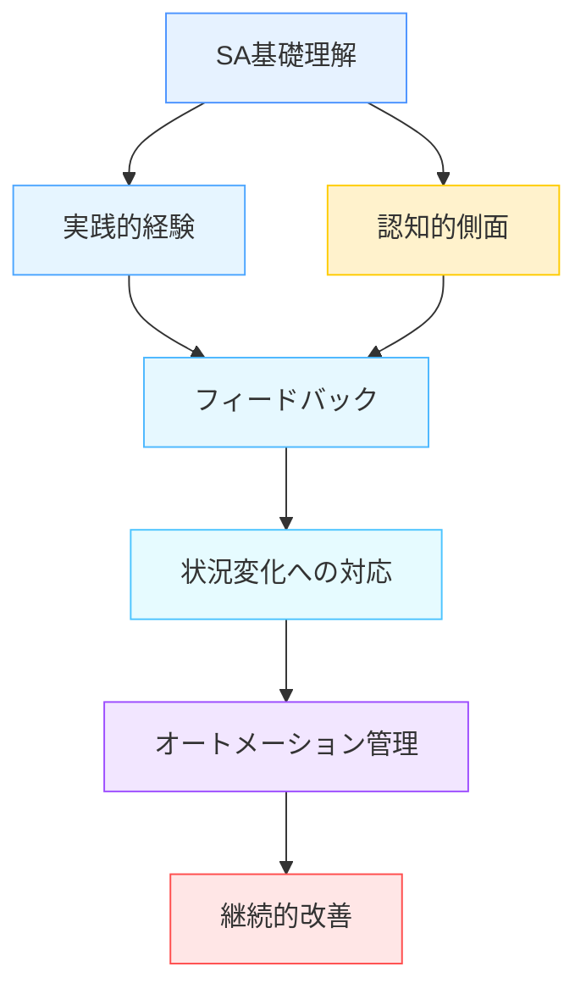

# 状況認識トレーニング

!!! info "このページについて"
    このページでは、状況認識（Situation Awareness）能力を向上させるための様々なトレーニング手法について解説します。個人レベル、チームレベルのトレーニング方法から、シミュレーションベースの高度な訓練まで、実践的なアプローチを学びます。

## 状況認識トレーニングの重要性

状況認識能力は生来的な才能だけでなく、適切なトレーニングによって大幅に向上させることができます。SAトレーニングが重要である理由は以下の通りです。

- **エラー防止**: SAの欠如は多くの事故やインシデントの主要因であり、トレーニングによってこれらを防止できる
- **パフォーマンス向上**: 良好なSAは、より速く正確な意思決定と行動につながる
- **作業負荷管理**: 高負荷状況でも効率的に情報を処理する能力を養成できる
- **適応能力強化**: 予期せぬ状況の変化に迅速に適応する能力を向上させる

状況認識トレーニングは、高リスク環境（航空、医療、軍事など）で特に重要ですが、日常生活や一般的な職場でも有益です。

## 状況認識トレーニングの基本原則

効果的なSAトレーニングは、以下の基本原則に基づいています。

### ▪️ キートレーニング原則

| 原則 | 説明 |
|------|------|
| **基礎理解** | SAの3レベル（知覚、理解、予測）の基本概念と重要性の理解 |
| **実践的経験** | 現実的なシナリオと課題を通じた実践練習 |
| **適切なフィードバック** | パフォーマンスに関する具体的で建設的なフィードバック |
| **段階的難易度** | 基本から複雑なシナリオへの段階的な進行 |
| **メタ認知の促進** | 自身のSAを監視・評価する能力の開発 |
| **転移性の確保** | 訓練内容が実際の業務環境に適用できること |
| **継続的実践** | 定期的なリフレッシャートレーニングと実践 |

!!! warning "訓練の落とし穴"
    トレーニングが実際の作業環境と大きく異なる場合、学習した技能の転移が限定的になる可能性があります。また、トレーニングが単に「正解」を教えるだけでは、予測不可能な状況に対応する能力は養われません。

## 個人レベルのトレーニング手法

個人の状況認識能力を向上させるためのトレーニング手法には、以下のようなものがあります。

### ▪️ 認知的アプローチ

#### 注意管理トレーニング
- スキャニングパターンの最適化（効率的な情報収集方法）
- 注意配分戦略（複数の情報源間での注意の適切な配分）
- 注意切り替え練習（異なる情報源間でのスムーズな移行）

#### メンタルモデル開発
- 環境やシステムの構造的理解の促進
- 典型的なシナリオとパターンの学習
- 因果関係とシステム相互作用の理解

#### 予測能力強化
- 「もし〜ならば」思考の訓練
- 将来状態のシミュレーションと検証
- 異常パターンの早期検出練習

### ▪️ 実践的スキル開発

#### 情報収集スキル
- 関連情報の効率的な抽出方法
- 情報の信頼性と重要性の評価
- 情報ギャップの特定と積極的な情報探索

#### 状況評価技術
- リスクと優先順位の評価
- 複数の情報源からの情報統合
- 矛盾する情報の解決方法

#### 自己モニタリング
- 自身のSAレベルの継続的評価
- SA低下の兆候認識（トンネルビジョン、確証バイアスなど）
- 限界や制約の認識とその管理

!!! example "実践例: OODA（観察・判断・決定・行動）ループトレーニング"
    米軍発祥のOODA（Observe, Orient, Decide, Act）ループは、状況認識とその後の対応をトレーニングするフレームワークです。参加者はシナリオに対して、観察（データ収集）、判断（状況理解）、決定（選択肢評価）、行動（実行）の各ステップを繰り返し練習します。このサイクルを繰り返すことで、迅速かつ効果的なSAと意思決定を養成します。

## チームレベルのトレーニング手法

多くの環境では、個人だけでなくチーム全体の状況認識が重要です。効果的なチームSAトレーニングには以下の要素が含まれます。

### ▪️ 共有状況認識の促進

#### 情報共有訓練
- 効果的なコミュニケーションパターンの練習
- クローズドループコミュニケーション（情報の確認と検証）
- 重要情報の優先順位付けと伝達

#### 共有メンタルモデルの構築
- チーム全体のゴールと制約の明確化
- 役割と責任の理解
- 相互期待とニーズの把握

#### チーム状況更新
- 定期的なブリーフィングとデブリーフィングの実施
- 状況変化の伝達とチーム認識の調整
- 背景情報と文脈の共有

### ▪️ チーム協調トレーニング

#### クロストレーニング
- 他のチームメンバーの役割と視点の理解
- チーム内の相互依存関係の認識
- バックアップ行動の練習

#### チームリーダーシップ訓練
- 状況認識の促進と維持をサポートするリーダーシップ行動
- タスク割り当てと監視
- チーム内でのSA促進と調整

#### 資源調整訓練
- 高負荷状況での作業配分
- チーム内リソースの効率的な活用
- 相互サポートの提供と要請

## シミュレーションベースのトレーニング

シミュレーションは状況認識トレーニングの中核的な要素であり、リスクなく現実的な状況を再現できます。

### ▪️ シミュレーションの種類

=== "フルスケールシミュレーション"
    実際の環境を忠実に再現した高忠実度シミュレーション

    - **例**: フライトシミュレーター、医療シミュレーションセンター、船舶操縦シミュレーター
    - **特徴**: 物理的に忠実な環境、実際の機器、高度な感覚フィードバック
    - **用途**: 高リスク環境での包括的なSAトレーニング、チーム協調練習

=== "部分シミュレーション"
    特定のタスクや機能に焦点を当てた中程度の忠実度のシミュレーション
    
    - **例**: 部分タスクトレーナー、手順シミュレーター、特定の状況シミュレーター
    - **特徴**: 特定のスキルセットに焦点、コスト効率の良さ
    - **用途**: 特定のSA要素（例：計器読み取り、異常検出）の集中トレーニング

=== "コンピューターベース"
    デスクトップやタブレット上で実行される低～中程度の忠実度のシミュレーション
    
    - **例**: シナリオベースの決断ゲーム、インタラクティブケースシミュレーション
    - **特徴**: 広範な普及可能性、低コスト、柔軟性    
    - **用途**: 基本的なSA概念とスキルの導入、自己学習、リフレッシャートレーニング

=== "仮想/拡張現実"
    VR/AR技術を活用した没入型シミュレーション
    
    - **例**: VRヘッドセット使用の訓練、ARスマートグラスによる情報オーバーレイ
    - **特徴**: 高い没入感、リアルな状況判断、物理的制約の克服
    - **用途**: 危険環境のシミュレーション、複合的な情報処理練習

### ▪️ 効果的なシミュレーション設計の原則

効果的なSAトレーニングシミュレーションは、以下の設計原則に基づいています。

- **心理的忠実度**: 実際の作業環境と同様の認知的要求と意思決定プロセスの再現
- **シナリオのリアリズム**: 実際の状況に基づいた現実的なシナリオ設計
- **変動性と不確実性**: 予測可能なパターンを避け、適応能力を養成
- **トリガーイベント**: 特定のSA要素（知覚、理解、予測）を刺激する設計
- **段階的複雑性**: 基本から複雑なシナリオへの段階的な進行
- **統合フィードバック**: パフォーマンスの即時および詳細なフィードバック機能

!!! example "航空分野のシミュレーション例"
    商業航空パイロット向けのSAトレーニングでは、通常運航から緊急時対応までさまざまなシナリオが用意されています。例えば「隠れた異常シナリオ」では、直接的な警告なしに小さな異常が発生し、パイロットがそれを検出し、意味を理解し、将来の影響を予測する能力が試されます。シミュレーション中、トレーナーは「状況冷凍」を行い、パイロットの現在のSAを質問によって評価し、フィードバックを提供します。

## 分野別トレーニングアプローチ

状況認識トレーニングは各分野の特性に合わせて最適化されています。

=== "航空分野"

    * 焦点領域
        - 3D空間における位置認識  
        - 多重情報源からのデータ統合  
        - 自動化システムのモニタリング  
    
    * 特徴的手法
        - Line-Oriented Flight Training (LOFT)  
        - Threat and Error Management (TEM)  
        - 非通常/緊急時手順訓練
    
    * 教育的要素  
        - Crew Resource Management (CRM)  
        - ブリーフィング/デブリーフィング技術  
        - 飛行データ分析に基づくフィードバック

=== "医療分野"
    * 焦点領域
        - 患者状態の連続的モニタリング
        - 複数の専門家間での情報共有
        - 急速に変化する状況への適応
    
    * 特徴的手法
        - 高忠実度患者シミュレーター
        - チームシミュレーション訓練
        - 危機的ケースシナリオ
    
    * 教育的要素
        - チームSTEPPS（TeamStrategies and Tools to Enhance Performance and Patient Safety）
        - 構造化コミュニケーション（SBAR等）
        - 安全文化と非難のない報告システム

=== "軍事・警察分野"
    * 焦点領域
        - 複雑で動的な環境での状況把握
        - 敵・味方・中立の区別
        - 高ストレス下での情報処理
    
    * 特徴的手法
        - タクティカルデシジョンゲーム
        - 実弾訓練と模擬訓練の組み合わせ
        - バーチャルバトルスペースシミュレーション
    
    * 教育的要素
        - After Action Review (AAR)
        - OODA (Observe, Orient, Decide, Act) ループ
        - ストレス下でのSA維持技術

=== "緊急対応分野"
    * 焦点領域
        - 混沌とした環境での状況評価
        - 限られた情報に基づく意思決定
        - 多機関連携のための情報共有
    
    * 特徴的手法
        - 災害シミュレーション訓練
        - テーブルトップ演習
        - 指揮統制訓練
        
    * 教育的要素
        - Incident Command System (ICS)
        - 共通状況図の作成と維持
        - 意思決定ポイント分析

## トレーニング効果の評価

状況認識トレーニングの効果を評価することは、プログラムの改善と参加者の成長のために重要です。

### ▪️ 評価メトリクス

#### 直接的なSA測定
- 前後のSAGAT（Situation Awareness Global Assessment Technique）スコア比較
- シミュレーション中のプローブ質問の正確さ
- SART（Situation Awareness Rating Technique）自己評価の変化

#### 間接的な指標
- エラー率とエラーの種類の変化
- タスク完了時間と効率性
- 意思決定の質と適時性
- リスクの特定と管理の改善

#### 行動観察
- 情報探索行動の変化
- コミュニケーションパターンの改善
- 状況変化への適応能力
- 予測的行動の増加

### ▪️ 包括的評価アプローチ

#### マルチソース評価
- 自己評価と指導者評価の組み合わせ
- 客観的測定と主観的報告の統合
- ピアレビューとチームパフォーマンス評価

#### 長期的追跡
- トレーニング直後と数ヶ月後の評価比較
- 実際の業務環境でのパフォーマンス変化
- リフレッシャートレーニングの必要性判断

#### 継続的改善サイクル
- 評価結果に基づくトレーニングプログラムの修正
- 新たな課題や環境変化への適応
- 最新の研究知見の組み込み

## 新技術を活用したトレーニング手法

テクノロジーの進歩により、新たなSAトレーニング手法が登場しています。

### ▪️ 最新テクノロジー

#### 拡張現実（AR）トレーニング
- 実環境への情報オーバーレイによる学習
- 実際の機器や環境を使用しながらの仮想シナリオ体験
- ハンズフリーで状況認識情報にアクセス

#### 仮想現実（VR）シミュレーション
- 完全没入型の環境での訓練
- 危険や稀なシナリオの安全な再現
- 複数の視点や役割の体験

#### モバイルラーニングプラットフォーム
- いつでもどこでもアクセス可能なトレーニング
- マイクロラーニングによる継続的なスキル開発
- 実際の業務環境に統合した学習

### ▪️ データ駆動型アプローチ

#### 適応型トレーニングシステム
- 学習者のパフォーマンスに基づく自動調整
- 個人の強みと弱みに合わせたカスタマイズ
- AIを活用した進捗分析と推奨

#### 学習分析
- トレーニングデータの詳細な分析
- パフォーマンスパターンの特定
- エビデンスに基づくプログラム最適化

#### シミュレーション後分析ツール
- 詳細なパフォーマンス指標の視覚化
- 決定ポイントと結果の因果関係分析
- エラーパターンの体系的識別

## トレーニングプログラムの設計と実装

効果的なSAトレーニングプログラムを設計・実装するためのステップは以下の通りです。

### ▪️ ニーズアセスメント

#### 1. 対象者の分析
- 現在のSAスキルレベルの評価
- 業務環境と要求事項の理解
- 特定の課題や改善領域の特定

#### 2. 業務分析
- 重要なSA要素と決定ポイントの特定
- 典型的な状況とシナリオの調査
- 必要なスキルと知識の体系化

#### 3. 組織的要因の考慮
- 利用可能なリソースと制約の評価
- 組織文化と学習環境の分析
- 長期的サポート体制の確認

### ▪️ プログラム開発

#### 1. 学習目標の設定
- 明確で測定可能な目標の定義
- SAの3レベル（知覚、理解、予測）に対応した目標
- 短期的スキルと長期的能力開発の区別

#### 2. カリキュラム設計
- 論理的な学習進行の構築
- 理論と実践のバランス
- 適切な評価方法の組み込み

#### 3. 教材・シナリオ開発
- 現実的で関連性の高いシナリオ
- 段階的な難易度設定
- 多様な学習スタイルへの対応

### ▪️ 実装と評価

#### 1. パイロットテスト
- 少人数グループでの試行
- フィードバックの収集と分析
- コンテンツと方法の調整

#### 2. 本格実施
- 講師/ファシリテーターのトレーニング
- 計画的なロールアウト
- 継続的なサポート体制

#### 3. 評価と改善
- 進行中および事後評価の実施
- データに基づくプログラム調整
- 長期的な効果測定と追跡

!!! tip "成功のための実装ヒント"
    - **経営層のサポート確保**: トレーニングの重要性と価値を明確に伝える
    - **成功事例の共有**: 早期の成功事例を組織内で共有し、プログラムの価値を示す
    - **実務への統合**: トレーニングと実際の業務プロセスとの明確な関連付け
    - **継続的な学習文化**: 単発のトレーニングではなく、継続的な学習サイクルの促進

## まとめと実践への橋渡し

状況認識トレーニングは、理論的知識と実践的スキルの両方を統合する継続的プロセスです。最も効果的なトレーニングは以下の要素を組み合わせています。

1. **基本概念の確実な理解**
2. **実践的で関連性の高いシナリオ体験**
3. **適切なフィードバックと振り返り**
4. **個人とチームのスキル開発の統合**
5. **実際の業務環境への転移促進**

状況認識能力の向上は、個人の安全、チームのパフォーマンス、そして組織全体の効果的な運営に貢献します。定期的なトレーニングと継続的な実践により、状況認識は自然な習慣となり、高負荷や予期せぬ状況でも維持できるようになります。

次のセクション「[応用](../applications/)」では、様々な分野での状況認識の実践的な応用について詳しく解説します。

## 参考文献

1. Endsley, M. R., & Garland, D. J. (Eds.). (2000). Situation awareness analysis and measurement. Lawrence Erlbaum Associates.
2. Salas, E., Wilson, K. A., Burke, C. S., & Wightman, D. C. (2006). Does crew resource management training work? An update, an extension, and some critical needs. Human Factors, 48(2), 392-412.
3. Flin, R., O'Connor, P., & Crichton, M. (2008). Safety at the sharp end: A guide to non-technical skills. Ashgate Publishing.
4. Wickens, C. D., & Hollands, J. G. (2000). Engineering psychology and human performance (3rd ed.). Prentice Hall.
5. Fletcher, G., Flin, R., McGeorge, P., Glavin, R., Maran, N., & Patey, R. (2003). Anaesthetists' Non‐Technical Skills (ANTS): Evaluation of a behavioural marker system. British Journal of Anaesthesia, 90(5), 580-588.
