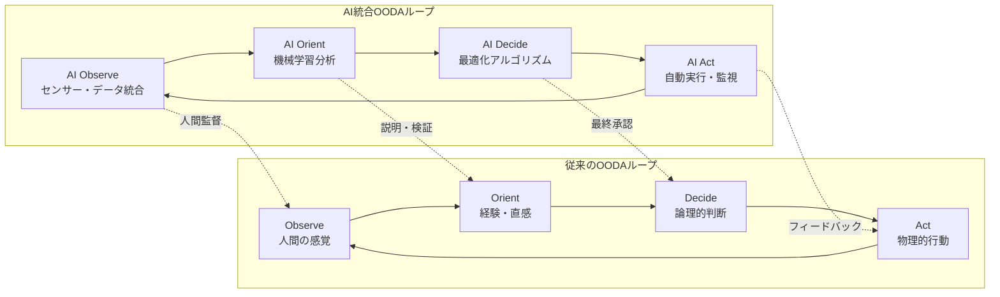
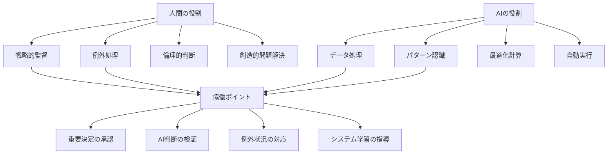

# AI統合OODAループ：次世代意思決定フレームワーク

!!! info "このページについて"

    このページでは、人工知能（AI）技術と統合された現代のOODAループについて詳しく解説します。  
    従来のOODAループにAI技術を融合させることで、より高速で精密、かつ適応的な意思決定を実現する方法を理論と実装の両面から掘り下げます。  
    TypeScriptとRxJSを活用した実践的なコード例により、実際のシステム構築への応用を具体的に示します。

## AI統合OODAループが変える意思決定の世界

従来のOODAループ（Observe-Orient-Decide-Act）は、ジョン・ボイド大佐によって1950年代に提唱された意思決定フレームワークです。しかし、AI技術の急速な発展により、このフレームワークは新たな次元の能力を獲得しています。AI統合OODAループは、人間の直感と経験をAIの分析力と予測能力で補強し、従来不可能だった速度と精度での意思決定を実現します。

## 従来のOODAループ vs AI統合OODAループ

### 進化の比較



### 各段階での進化

| 段階 | 従来手法 | AI統合手法 | 改善効果 |
|---|---|---|---|
| **Observe** | 人間の五感、限定的情報源 | IoT、センサー、多元データストリーム | 24/7監視、客観性、範囲拡大 |
| **Orient** | 経験、直感、認知バイアス | 機械学習、パターン認識、統計分析 | バイアス軽減、精度向上、一貫性 |
| **Decide** | 論理思考、限定的選択肢 | 最適化、シミュレーション、多目的分析 | 最適解発見、リスク定量化 |
| **Act** | 人間による実行、遅延 | 自動化、リアルタイム調整 | 高速実行、継続監視 |

## AI統合OODAループの詳細設計

### 1. AI Observe（AI観察）：多元データ統合監視

#### 人間の感覚を大幅に超えた観察能力を実現します。

AI統合観察システムでは、多様なデータソース（センサー、画像、音声、テキストなど）を非同期ストリームとして処理し、リアルタイムに統合・分析します。データは段階的に品質評価・融合・洞察抽出が行われ、最終的に異常検知や傾向分析が自動的に実施されます。また、過去のパターンや文脈に基づき、次に観察すべき対象をAIが自律的に判断する機能も備えています。

??? TypeScript実装例

    ```typescript
    // AI統合観察システム
    interface AIObservationResult {
      timestamp: Date;
      rawData: MultiModalData;
      processedInsights: ProcessedInsight[];
      anomalies: DetectedAnomaly[];
      trends: IdentifiedTrend[];
      confidence: number;
      dataQuality: DataQualityMetrics;
    }

    interface MultiModalData {
      sensorData: SensorReading[];
      imageData: ImageAnalysis[];
      textData: TextAnalysis[];
      audioData: AudioAnalysis[];
      networkData: NetworkMetrics[];
      userBehaviorData: UserActivity[];
    }

    class AIObservationSystem {
      private dataStreams: Map<string, Observable<any>> = new Map();
      private fusionEngine: DataFusionEngine;
      private anomalyDetector: AnomalyDetectionEngine;
      private trendAnalyzer: TrendAnalysisEngine;
      private qualityAssessor: DataQualityAssessor;
      
      constructor() {
        this.fusionEngine = new MultiModalDataFusion();
        this.anomalyDetector = new RealTimeAnomalyDetection();
        this.trendAnalyzer = new StatisticalTrendAnalysis();
        this.qualityAssessor = new DataQualityAssessment();
        this.initializeDataStreams();
      }
      
      private initializeDataStreams(): void {
        // IoTセンサーストリーム
        this.dataStreams.set('sensors', 
          this.createSensorStream().pipe(
            map(data => this.preprocessSensorData(data)),
            share()
          )
        );
        
        // 画像解析ストリーム
        this.dataStreams.set('vision',
          this.createVisionStream().pipe(
            map(data => this.processImageData(data)),
            share()
          )
        );
        
        // テキスト分析ストリーム
        this.dataStreams.set('text',
          this.createTextStream().pipe(
            debounceTime(1000),
            map(data => this.processTextData(data)),
            share()
          )
        );
        
        // 音声分析ストリーム
        this.dataStreams.set('audio',
          this.createAudioStream().pipe(
            bufferTime(5000),
            map(buffer => this.processAudioData(buffer)),
            share()
          )
        );
      }
      
      // 統合観察の実行
      performAIObservation(): Observable<AIObservationResult> {
        return combineLatest([
          this.dataStreams.get('sensors')!,
          this.dataStreams.get('vision')!,
          this.dataStreams.get('text')!,
          this.dataStreams.get('audio')!
        ]).pipe(
          map(([sensorData, visionData, textData, audioData]) => {
            const multiModalData: MultiModalData = {
              sensorData,
              imageData: visionData,
              textData,
              audioData,
              networkData: this.getCurrentNetworkMetrics(),
              userBehaviorData: this.getCurrentUserActivity()
            };
            
            return multiModalData;
          }),
          
          // データ品質評価
          map(data => ({
            data,
            quality: this.qualityAssessor.assess(data)
          })),
          
          // データ融合
          map(({ data, quality }) => ({
            fusedData: this.fusionEngine.fuse(data),
            quality
          })),
          
          // 洞察抽出
          map(({ fusedData, quality }) => {
            const insights = this.extractInsights(fusedData);
            const anomalies = this.anomalyDetector.detect(fusedData);
            const trends = this.trendAnalyzer.analyze(fusedData);
            
            return {
              timestamp: new Date(),
              rawData: fusedData,
              processedInsights: insights,
              anomalies: anomalies,
              trends: trends,
              confidence: this.calculateConfidence(quality, insights),
              dataQuality: quality
            };
          }),
          
          share()
        );
      }
      
      // リアルタイム異常検知
      private createAnomalyAlert(): Observable<AnomalyAlert> {
        return this.performAIObservation().pipe(
          filter(result => result.anomalies.length > 0),
          map(result => ({
            severity: this.calculateSeverity(result.anomalies),
            anomalies: result.anomalies,
            recommendedActions: this.generateAnomalyActions(result.anomalies),
            confidence: result.confidence
          }))
        );
      }
      
      // 予測的観察（次に何を観察すべきかAIが決定）
      async predictiveObservation(currentContext: ObservationContext): Promise<ObservationStrategy> {
        const historicalPatterns = await this.analyzeHistoricalPatterns(currentContext);
        const predictiveModel = await this.loadPredictiveModel();
        
        const nextObservationPoints = await predictiveModel.predict({
          context: currentContext,
          patterns: historicalPatterns,
          currentState: await this.getCurrentSystemState()
        });
        
        return {
          priorityTargets: nextObservationPoints,
          observationFrequency: this.calculateOptimalFrequency(nextObservationPoints),
          resourceAllocation: this.optimizeResourceAllocation(nextObservationPoints)
        };
      }
    }
    ```

### 2. AI Orient（AI方向づけ）：機械学習による状況分析

#### 観察データを状況理解と意味づけに変換します。

AI方向づけシステムでは、観察結果をもとに機械学習モデルを活用して状況の理解・分類を行い、文脈を加味した意味づけや将来的な予測、リスク評価、機会分析を実施します。これにより、単なる現状把握にとどまらず、戦略的な洞察を抽出することが可能になります。さらに、人間によるフィードバックや概念ドリフトへの対応により、動的な環境に適応できる自己学習型システムを実現します。

??? TypeScript実装例

    ```typescript
    // AI統合状況分析システム
    interface AIOrientationResult {
      situationAssessment: SituationAssessment;
      contextualAnalysis: ContextualAnalysis;
      predictiveInsights: PredictiveInsight[];
      riskEvaluation: RiskEvaluation;
      opportunityIdentification: OpportunityAnalysis;
      confidence: number;
      recommendedActions: string[];
    }

    interface SituationAssessment {
      currentState: SystemState;
      stateClassification: string;
      stateProbability: number;
      keyFactors: Factor[];
      changeVelocity: number;
      stabilityIndex: number;
    }

    class AIOrientationSystem {
      private mlModels: Map<string, MLModel> = new Map();
      private knowledgeBase: KnowledgeBase;
      private contextAnalyzer: ContextualAnalyzer;
      private riskAssessor: RiskAssessmentEngine;
      private opportunityFinder: OpportunityDetector;
      
      constructor() {
        this.initializeMLModels();
        this.knowledgeBase = new DomainKnowledgeBase();
        this.contextAnalyzer = new AdvancedContextAnalyzer();
        this.riskAssessor = new ProbabilisticRiskAssessment();
        this.opportunityFinder = new PatternBasedOpportunityDetector();
      }
      
      private initializeMLModels(): void {
        // 状況分類モデル
        this.mlModels.set('classifier', new EnsembleClassifier({
          models: [
            new RandomForestClassifier(),
            new GradientBoostingClassifier(),
            new NeuralNetworkClassifier()
          ]
        }));
        
        // 時系列予測モデル
        this.mlModels.set('predictor', new LSTMPredictor({
          sequenceLength: 50,
          features: ['system_state', 'external_factors', 'historical_trends']
        }));
        
        // 異常検知モデル
        this.mlModels.set('anomaly', new IsolationForestDetector({
          contamination: 0.1,
          randomState: 42
        }));
      }
      
      // AI状況分析の実行
      async performAIOrientation(
        observationData: AIObservationResult
      ): Promise<AIOrientationResult> {
        // 1. 状況分類
        const situationAssessment = await this.assessCurrentSituation(observationData);
        
        // 2. 文脈分析
        const contextualAnalysis = await this.analyzeContext(
          observationData,
          situationAssessment
        );
        
        // 3. 予測分析
        const predictiveInsights = await this.generatePredictiveInsights(
          observationData,
          contextualAnalysis
        );
        
        // 4. リスク評価
        const riskEvaluation = await this.evaluateRisks(
          situationAssessment,
          predictiveInsights
        );
        
        // 5. 機会分析
        const opportunityIdentification = await this.identifyOpportunities(
          contextualAnalysis,
          predictiveInsights
        );
        
        // 6. 信頼度計算
        const confidence = this.calculateOrientationConfidence([
          situationAssessment,
          contextualAnalysis,
          predictiveInsights
        ]);
        
        // 7. 推奨行動生成
        const recommendedActions = await this.generateRecommendations({
          situation: situationAssessment,
          risks: riskEvaluation,
          opportunities: opportunityIdentification,
          context: contextualAnalysis
        });
        
        return {
          situationAssessment,
          contextualAnalysis,
          predictiveInsights,
          riskEvaluation,
          opportunityIdentification,
          confidence,
          recommendedActions
        };
      }
      
      // 動的学習・適応機能
      async adaptToNewPattern(
        newData: ObservationData[],
        feedback: HumanFeedback[]
      ): Promise<AdaptationResult> {
        // 概念ドリフト検出
        const driftDetection = await this.detectConceptDrift(newData);
        
        if (driftDetection.driftDetected) {
          // モデル再訓練
          const retrainingResult = await this.retrainModels(
            newData,
            feedback,
            driftDetection.driftType
          );
          
          // 性能評価
          const performanceMetrics = await this.evaluateAdaptedModels();
          
          return {
            adaptationPerformed: true,
            driftType: driftDetection.driftType,
            retrainingResult,
            performanceImprovement: performanceMetrics.improvement,
            newModelConfidence: performanceMetrics.confidence
          };
        }
        
        return { adaptationPerformed: false };
      }
      
      // 説明可能性機能
      async explainOrientation(
        orientationResult: AIOrientationResult
      ): Promise<OrientationExplanation> {
        // SHAP値による特徴量重要度
        const featureImportance = await this.calculateFeatureImportance(
          orientationResult.situationAssessment
        );
        
        // 決定木による論理フロー
        const decisionLogic = await this.extractDecisionLogic(orientationResult);
        
        // 自然言語による説明生成
        const naturalLanguageExplanation = this.generateNLExplanation(
          orientationResult,
          featureImportance,
          decisionLogic
        );
        
        return {
          featureImportance,
          decisionLogic,
          naturalLanguageExplanation,
          confidence: orientationResult.confidence,
          keyInsights: this.extractKeyInsights(orientationResult)
        };
      }
    }
    ```

### 3. AI Decide（AI決定）：最適化による意思決定

#### 複数の選択肢から最適解を自動発見します。

AI意思決定システムでは、多数の選択肢と制約条件の中から最適な行動を見つけ出すため、最適化アルゴリズムやシナリオ生成エンジンを用いて意思決定空間を探索します。状況に応じた目的関数を構築し、評価・代替案の提示・リスク分析・実行計画策定までを自動で行います。これにより、複雑な状況でも迅速かつ一貫した判断を下すことが可能になります。

??? TypeScript実装例

    ```typescript
    // AI統合意思決定システム
    interface AIDecisionResult {
      optimalDecision: Decision;
      alternativeDecisions: Decision[];
      decisionRationale: DecisionRationale;
      riskAssessment: DecisionRiskAssessment;
      expectedOutcome: OutcomePrediction;
      confidence: number;
      executionPlan: ExecutionPlan;
    }

    interface Decision {
      id: string;
      action: ActionPlan;
      priority: number;
      resources: ResourceRequirement[];
      timeline: ExecutionTimeline;
      successProbability: number;
      riskLevel: RiskLevel;
    }

    class AIDecisionSystem {
      private optimizationEngine: OptimizationEngine;
      private scenarioGenerator: ScenarioGenerator;
      private riskCalculator: RiskCalculator;
      private outcomePredictor: OutcomePredictor;
      private constraintManager: ConstraintManager;
      
      constructor() {
        this.optimizationEngine = new MultiObjectiveOptimizer();
        this.scenarioGenerator = new MonteCarloScenarioGenerator();
        this.riskCalculator = new ProbabilisticRiskCalculator();
        this.outcomePredictor = new EnsembleOutcomePredictor();
        this.constraintManager = new DynamicConstraintManager();
      }
      
      // AI意思決定の実行
      async performAIDecision(
        orientationResult: AIOrientationResult,
        availableActions: ActionOption[],
        constraints: DecisionConstraint[]
      ): Promise<AIDecisionResult> {
        // 1. 制約条件の設定
        await this.constraintManager.setConstraints(constraints);
        
        // 2. 決定空間の定義
        const decisionSpace = this.defineDecisionSpace(
          availableActions,
          orientationResult.situationAssessment
        );
        
        // 3. 目的関数の構築
        const objectiveFunctions = this.buildObjectiveFunctions(
          orientationResult.riskEvaluation,
          orientationResult.opportunityIdentification
        );
        
        // 4. シナリオ生成
        const scenarios = await this.scenarioGenerator.generate({
          baseState: orientationResult.situationAssessment,
          numScenarios: 1000,
          timeHorizon: '24hours'
        });
        
        // 5. 最適化実行
        const optimizationResult = await this.optimizationEngine.optimize({
          decisionSpace,
          objectiveFunctions,
          constraints,
          scenarios
        });
        
        // 6. 結果の評価と検証
        const evaluatedDecisions = await this.evaluateDecisions(
          optimizationResult.solutions,
          scenarios
        );
        
        // 7. 最適解の選択
        const optimalDecision = this.selectOptimalDecision(evaluatedDecisions);
        
        // 8. 代替案の準備
        const alternativeDecisions = this.prepareAlternatives(
          evaluatedDecisions,
          optimalDecision
        );
        
        // 9. 実行計画の生成
        const executionPlan = await this.generateExecutionPlan(
          optimalDecision,
          orientationResult.situationAssessment
        );
        
        return {
          optimalDecision,
          alternativeDecisions,
          decisionRationale: this.generateRationale(optimalDecision, objectiveFunctions),
          riskAssessment: await this.assessDecisionRisk(optimalDecision, scenarios),
          expectedOutcome: await this.predictOutcome(optimalDecision, scenarios),
          confidence: this.calculateDecisionConfidence(optimizationResult),
          executionPlan
        };
      }
      
      // リアルタイム決定調整
      adjustDecisionRealTime(
        currentDecision: Decision,
        newObservations: Observable<AIObservationResult>
      ): Observable<DecisionAdjustment> {
        return newObservations.pipe(
          // 重要な変化のみに反応
          filter(obs => this.isSignificantChange(obs, currentDecision)),
          
          // 決定の再評価
          switchMap(async (obs) => {
            const reEvaluation = await this.reEvaluateDecision(
              currentDecision,
              obs
            );
            
            if (reEvaluation.adjustmentNeeded) {
              const adjustedDecision = await this.adjustDecision(
                currentDecision,
                obs,
                reEvaluation.adjustmentType
              );
              
              return {
                type: 'adjustment',
                originalDecision: currentDecision,
                adjustedDecision: adjustedDecision,
                reason: reEvaluation.reason,
                confidence: reEvaluation.confidence
              };
            }
            
            return {
              type: 'confirmation',
              decision: currentDecision,
              reason: 'No significant change detected'
            };
          }),
          
          share()
        );
      }
      
      // 意思決定学習機能
      async learnFromDecisionOutcome(
        decision: Decision,
        actualOutcome: ActualOutcome,
        executionMetrics: ExecutionMetrics
      ): Promise<LearningResult> {
        // 予測と実績の比較
        const predictionAccuracy = this.comparePredictionWithActual(
          decision.expectedOutcome,
          actualOutcome
        );
        
        // モデル更新
        const modelUpdates = await this.updatePredictionModels(
          decision,
          actualOutcome,
          predictionAccuracy
        );
        
        // 最適化戦略の改善
        const strategyUpdates = await this.improveOptimizationStrategy(
          decision,
          executionMetrics
        );
        
        // 制約条件の見直し
        const constraintUpdates = await this.reviewConstraints(
          decision,
          actualOutcome
        );
        
        return {
          predictionAccuracy,
          modelUpdates,
          strategyUpdates,
          constraintUpdates,
          overallImprovement: this.calculateOverallImprovement([
            modelUpdates,
            strategyUpdates,
            constraintUpdates
          ])
        };
      }
    }
    ```

### 4. AI Act（AI行動）：自動実行と継続監視

#### 決定された行動を自動実行し、結果を継続監視します。

AI行動システムは、決定された行動を自動で実行し、その進行状況をリアルタイムで監視・調整します。フェーズごとの進行状況を管理し、異常や逸脱が検出された場合には即座に調整やロールバックを実行することで、システムの安定性と信頼性を確保します。また、実行履歴をもとに最適化や改善策の提案も行い、継続的な改善を図ります。

??? TypeScript実装例

    ```typescript
    // AI統合実行システム
    interface AIActionResult {
      executionId: string;
      startTime: Date;
      plannedActions: PlannedAction[];
      executionStatus: ExecutionStatus;
      realTimeMetrics: RealTimeMetric[];
      adjustments: ExecutionAdjustment[];
      completionStatus: CompletionStatus;
    }

    interface ExecutionStatus {
      currentPhase: string;
      progress: number; // 0-100%
      isOnTrack: boolean;
      deviations: Deviation[];
      nextMilestone: Milestone;
    }

    class AIActionSystem {
      private executionEngine: AutomatedExecutionEngine;
      private monitoringSystem: RealTimeMonitoringSystem;
      private adjustmentEngine: DynamicAdjustmentEngine;
      private rollbackManager: RollbackManager;
      private metricsCollector: MetricsCollectionSystem;
      
      constructor() {
        this.executionEngine = new RobustExecutionEngine();
        this.monitoringSystem = new ContinuousMonitoringSystem();
        this.adjustmentEngine = new IntelligentAdjustmentEngine();
        this.rollbackManager = new SafeRollbackManager();
        this.metricsCollector = new ComprehensiveMetricsCollector();
      }
      
      // AI実行の開始
      async executeAIAction(
        decision: AIDecisionResult,
        executionContext: ExecutionContext
      ): Promise<Observable<AIActionResult>> {
        const executionId = this.generateExecutionId();
        
        // 実行前チェック
        const preflightCheck = await this.performPreflightCheck(
          decision,
          executionContext
        );
        
        if (!preflightCheck.canExecute) {
          throw new ExecutionError(
            `Preflight check failed: ${preflightCheck.reason}`
          );
        }
        
        // 実行計画の詳細化
        const detailedPlan = await this.createDetailedExecutionPlan(
          decision.executionPlan,
          executionContext
        );
        
        // 実行開始
        return new Observable<AIActionResult>(observer => {
          this.startExecution(executionId, detailedPlan, observer);
        });
      }
      
      private async startExecution(
        executionId: string,
        plan: DetailedExecutionPlan,
        observer: Observer<AIActionResult>
      ): Promise<void> {
        const startTime = new Date();
        let currentStatus: ExecutionStatus = {
          currentPhase: plan.phases[0].name,
          progress: 0,
          isOnTrack: true,
          deviations: [],
          nextMilestone: plan.phases[0].milestones[0]
        };
        
        // リアルタイム監視の開始
        const monitoringStream = this.monitoringSystem.startMonitoring(
          executionId,
          plan
        );
        
        // 監視データに基づく調整
        const adjustmentStream = monitoringStream.pipe(
          filter(metrics => this.needsAdjustment(metrics, plan)),
          switchMap(metrics => this.generateAdjustments(metrics, plan))
        );
        
        // 実行ストリームの統合
        merge(
          monitoringStream,
          adjustmentStream
        ).subscribe({
          next: (update) => {
            const actionResult = this.buildActionResult(
              executionId,
              startTime,
              plan,
              currentStatus,
              update
            );
            
            observer.next(actionResult);
            currentStatus = actionResult.executionStatus;
          },
          error: (error) => {
            observer.error(this.handleExecutionError(error, executionId));
          },
          complete: () => {
            observer.complete();
          }
        });
        
        // 各フェーズの実行
        for (const phase of plan.phases) {
          try {
            await this.executePhase(phase, executionId);
            currentStatus.currentPhase = phase.name;
            currentStatus.progress = this.calculateProgress(phase, plan);
          } catch (error) {
            // フェーズ実行エラーの処理
            const errorHandling = await this.handlePhaseError(
              error,
              phase,
              executionId
            );
            
            if (errorHandling.shouldRollback) {
              await this.rollbackManager.rollback(executionId, phase);
              observer.error(error);
              return;
            }
            
            if (errorHandling.shouldAdjust) {
              const adjustedPhase = await this.adjustmentEngine.adjustPhase(
                phase,
                error,
                errorHandling.adjustmentStrategy
              );
              await this.executePhase(adjustedPhase, executionId);
            }
          }
        }
      }
      
      // フェーズ実行
      private async executePhase(
        phase: ExecutionPhase,
        executionId: string
      ): Promise<PhaseResult> {
        const phaseStartTime = new Date();
        
        // フェーズ内のアクション実行
        const actionResults = await Promise.allSettled(
          phase.actions.map(action => this.executeAction(action, executionId))
        );
        
        // 失敗したアクションの処理
        const failedActions = actionResults
          .filter(result => result.status === 'rejected')
          .map((result, index) => ({
            action: phase.actions[index],
            error: (result as PromiseRejectedResult).reason
          }));
        
        if (failedActions.length > 0 && phase.failureThreshold <= failedActions.length) {
          throw new PhaseExecutionError(
            `Phase ${phase.name} failed: ${failedActions.length} actions failed`,
            failedActions
          );
        }
        
        return {
          phase: phase.name,
          executionTime: Date.now() - phaseStartTime.getTime(),
          successfulActions: actionResults.filter(r => r.status === 'fulfilled').length,
          failedActions: failedActions.length,
          metrics: await this.metricsCollector.collectPhaseMetrics(phase, executionId)
        };
      }
      
      // 継続的最適化
      optimizeExecution(
        executionHistory: ExecutionHistory[]
      ): Observable<OptimizationResult> {
        return interval(60000).pipe( // 1分間隔で最適化
          switchMap(async () => {
            // 実行パフォーマンス分析
            const performanceAnalysis = await this.analyzeExecutionPerformance(
              executionHistory
            );
            
            // ボトルネック特定
            const bottlenecks = await this.identifyBottlenecks(performanceAnalysis);
            
            // 最適化策の生成
            const optimizations = await this.generateOptimizations(bottlenecks);
            
            // 最適化の適用
            const appliedOptimizations = await this.applyOptimizations(optimizations);
            
            return {
              analysisTimestamp: new Date(),
              performanceMetrics: performanceAnalysis,
              identifiedBottlenecks: bottlenecks,
              appliedOptimizations: appliedOptimizations,
              expectedImprovement: this.calculateExpectedImprovement(appliedOptimizations)
            };
          }),
          
          share()
        );
      }
      
      // 緊急停止・ロールバック機能
      async emergencyStop(
        executionId: string,
        reason: string
      ): Promise<EmergencyStopResult> {
        // 実行の即座停止
        await this.executionEngine.emergencyStop(executionId);
        
        // 状態の保存
        const currentState = await this.captureCurrentState(executionId);
        
        // 安全なロールバックの実行
        const rollbackResult = await this.rollbackManager.safeRollback(
          executionId,
          currentState,
          { reason, priority: 'emergency' }
        );
        
        // 影響範囲の評価
        const impactAssessment = await this.assessStopImpact(
          executionId,
          currentState
        );
        
        return {
          stoppedAt: new Date(),
          executionId,
          reason,
          currentState,
          rollbackResult,
          impactAssessment,
          recoveryRecommendations: this.generateRecoveryRecommendations(
            impactAssessment
          )
        };
      }
    }
    ```

## 統合システムアーキテクチャ

### 全体システム統合

全体統合システムは、Observe→Orient→Decide→Actの各フェーズを統合し、AIによる連続的かつ自律的な意思決定サイクルを実現します。人間の介入ポイントも明示的に組み込まれており、信頼性や透明性を維持しながら高度な意思決定支援が可能になります。システム全体の状態をモニタリングしつつ、継続的な性能最適化とリスク管理を行います。

??? TypeScript実装例

    ```typescript
    // AI統合OODAループ制御システム
    class AIEnhancedOODASystem {
      private observationSystem: AIObservationSystem;
      private orientationSystem: AIOrientationSystem;
      private decisionSystem: AIDecisionSystem;
      private actionSystem: AIActionSystem;
      private coordinationEngine: SystemCoordinationEngine;
      private humanInterface: HumanMachineInterface;
      
      constructor(config: OODASystemConfig) {
        this.observationSystem = new AIObservationSystem();
        this.orientationSystem = new AIOrientationSystem();
        this.decisionSystem = new AIDecisionSystem();
        this.actionSystem = new AIActionSystem();
        this.coordinationEngine = new SystemCoordinationEngine();
        this.humanInterface = new HumanMachineInterface(config.humanOversight);
      }
      
      // 完全なOODAループの実行
      async executeOODALoop(
        initialContext: SystemContext,
        loopConfiguration: OODALoopConfig
      ): Promise<Observable<OODALoopResult>> {
        return new Observable<OODALoopResult>(observer => {
          this.runContinuousOODALoop(
            initialContext,
            loopConfiguration,
            observer
          );
        });
      }
      
      private async runContinuousOODALoop(
        context: SystemContext,
        config: OODALoopConfig,
        observer: Observer<OODALoopResult>
      ): Promise<void> {
        let currentContext = context;
        let loopIteration = 0;
        
        while (config.continuousMode || loopIteration < config.maxIterations) {
          const loopStartTime = new Date();
          
          try {
            // OBSERVE フェーズ
            const observationResult = await firstValueFrom(
              this.observationSystem.performAIObservation().pipe(
                timeout(config.observationTimeout)
              )
            );
            
            // 人間監督ポイント1
            if (config.humanOversight.observationReview) {
              const humanApproval = await this.humanInterface.reviewObservation(
                observationResult
              );
              if (!humanApproval.approved) {
                continue; // 次のループへ
              }
            }
            
            // ORIENT フェーズ
            const orientationResult = await this.orientationSystem.performAIOrientation(
              observationResult
            );
            
            // 人間監督ポイント2
            if (config.humanOversight.orientationReview) {
              const humanApproval = await this.humanInterface.reviewOrientation(
                orientationResult
              );
              if (!humanApproval.approved) {
                continue;
              }
            }
            
            // DECIDE フェーズ
            const decisionResult = await this.decisionSystem.performAIDecision(
              orientationResult,
              config.availableActions,
              config.constraints
            );
            
            // 人間監督ポイント3（最も重要）
            if (config.humanOversight.decisionApproval) {
              const humanApproval = await this.humanInterface.approveDecision(
                decisionResult
              );
              if (!humanApproval.approved) {
                // 代替案の提示
                const alternativeDecision = await this.handleDecisionRejection(
                  decisionResult,
                  humanApproval.rejectionReason
                );
                if (alternativeDecision) {
                  decisionResult = alternativeDecision;
                } else {
                  continue;
                }
              }
            }
            
            // ACT フェーズ
            const actionStream = await this.actionSystem.executeAIAction(
              decisionResult,
              currentContext
            );
            
            // アクション結果の監視
            actionStream.subscribe({
              next: (actionResult) => {
                const loopResult: OODALoopResult = {
                  iteration: loopIteration,
                  timestamp: loopStartTime,
                  duration: Date.now() - loopStartTime.getTime(),
                  observationResult,
                  orientationResult,
                  decisionResult,
                  actionResult,
                  systemState: this.coordinationEngine.getCurrentSystemState(),
                  performance: this.calculateLoopPerformance({
                    observationResult,
                    orientationResult,
                    decisionResult,
                    actionResult
                  })
                };
                
                observer.next(loopResult);
                
                // 次のループのコンテキスト更新
                currentContext = this.updateContext(currentContext, loopResult);
              },
              error: (error) => {
                observer.error(this.handleLoopError(error, loopIteration));
              }
            });
            
            loopIteration++;
            
            // ループ間隔の調整
            if (config.adaptiveInterval) {
              const optimalInterval = this.calculateOptimalInterval(
                observationResult,
                orientationResult
              );
              await this.delay(optimalInterval);
            } else {
              await this.delay(config.fixedInterval);
            }
            
          } catch (error) {
            const errorHandling = await this.handleLoopError(error, loopIteration);
            
            if (errorHandling.shouldTerminate) {
              observer.error(error);
              return;
            }
            
            if (errorHandling.shouldRetry) {
              // エラー回復待機
              await this.delay(errorHandling.retryDelay);
              continue;
            }
          }
        }
        
        observer.complete();
      }
      
      // ループ性能の最適化
      optimizeLoopPerformance(
        performanceHistory: LoopPerformanceHistory[]
      ): Observable<OptimizationRecommendation> {
        return interval(300000).pipe( // 5分間隔
          switchMap(async () => {
            // 性能分析
            const performanceAnalysis = await this.analyzeLoopPerformance(
              performanceHistory
            );
            
            // ボトルネック特定
            const bottlenecks = this.identifyPerformanceBottlenecks(
              performanceAnalysis
            );
            
            // 最適化推奨の生成
            const recommendations = await this.generateOptimizationRecommendations(
              bottlenecks
            );
            
            return {
              timestamp: new Date(),
              performanceAnalysis,
              bottlenecks,
              recommendations,
              expectedImprovement: this.calculateExpectedImprovement(recommendations)
            };
          })
        );
      }
    }
    ```

## 産業別応用事例

### 製造業：スマートファクトリー

**AI統合OODAループによる製造最適化**

- **Observe**: IoTセンサーによる機械状態、品質、環境データの24/7監視
- **Orient**: 機械学習による生産効率分析、異常パターン検出、需要予測
- **Decide**: 最適化アルゴリズムによる生産計画、保守スケジュール決定
- **Act**: 自動生産調整、予防保全の実行、品質管理の自動化

### 金融・投資：アルゴリズム取引

**高頻度取引での活用**

- **Observe**: 市場データ、ニュース、SNSの実時間分析
- **Orient**: 市場センチメント分析、リスク評価、トレンド予測
- **Decide**: ポートフォリオ最適化、取引戦略決定
- **Act**: 自動取引実行、リスク管理、ポジション調整

### 医療：スマート病院

**患者ケアの最適化**

- **Observe**: バイタル監視、診療データ、医療画像の統合分析
- **Orient**: 診断支援、治療効果予測、リスク評価
- **Decide**: 治療計画最適化、リソース配分決定
- **Act**: 治療実行監視、薬剤管理、緊急対応の自動化

### 都市管理：スマートシティ

**都市インフラの最適運営**

- **Observe**: 交通流、エネルギー消費、環境データの都市規模監視
- **Orient**: 都市状況分析、混雑予測、リソース需給分析
- **Decide**: 交通制御、エネルギー配分、公共サービス最適化
- **Act**: 信号制御、電力配信調整、緊急サービス配備

## 実装時の重要考慮事項

### 1. 人間-AI協働設計



### 2. セキュリティ・プライバシー

- **データ暗号化**: 全段階でのデータ保護
- **アクセス制御**: 役割ベースの権限管理
- **監査ログ**: 全ての決定・行動の記録
- **プライバシー保護**: 個人情報の匿名化・仮名化

### 3. 信頼性・可用性

- **冗長性**: 重要コンポーネントの多重化
- **フェイルセーフ**: 障害時の安全停止機能
- **エラー回復**: 自動復旧メカニズム
- **性能監視**: リアルタイム性能追跡

### 4. 説明可能性・透明性

- **判断根拠**: 各段階での意思決定理由の明示
- **信頼度表示**: 予測・判断の確信度の定量化
- **代替案提示**: 複数選択肢とその比較
- **学習過程**: AIの学習・改善プロセスの可視化

## まとめ：AI統合OODAループの実践

AI統合OODAループは、従来の人間中心の意思決定を大幅に強化し、以下の革新をもたらします：

### **主要な利点**

1. **速度**: 人間の認知速度を大幅に超えた高速意思決定
2. **精度**: データ駆動による客観的で一貫した判断
3. **規模**: 大量の情報と複雑な状況への対応能力
4. **継続性**: 24/7の継続的監視と対応
5. **学習能力**: 経験からの自動改善と適応

### **成功の鍵**

- **適切な人間監督**: AIの判断を人間が適切に監督・承認
- **段階的導入**: 重要度の低い領域から徐々に適用範囲を拡大
- **継続的改善**: フィードバックに基づくシステムの継続的向上
- **倫理的配慮**: AIの判断が人間の価値観と整合することの確保
- **透明性確保**: 判断プロセスの可視化と説明可能性の維持

AI統合OODAループは、現代の複雑で変化の激しい環境において、組織や個人の意思決定能力を劇的に向上させる強力なフレームワークです。適切に実装・運用することで、競争優位性の確保と持続可能な成長を実現できるでしょう。

## 参考文献

1. Boyd, J. R. (1976). Destruction and Creation. U.S. Army Command and General Staff College.
2. Boyd, J. R. (1987). Organic Design for Command and Control. U.S. Air Force.
3. Russell, S., & Norvig, P. (2020). Artificial Intelligence: A Modern Approach (4th ed.). Pearson.
4. Brynjolfsson, E., & McAfee, A. (2017). The Business of Artificial Intelligence. Harvard Business Review.
5. Davenport, T. H., & Harris, J. G. (2017). Competing on Analytics: The New Science of Winning. Harvard Business Review Press.
6. 松尾豊. (2020). 人工知能とディープラーニング. KADOKAWA.
7. 野中郁次郎, 竹内弘高. (2020). 知識創造企業. 東洋経済新報社.
8. MIT Technology Review. (2023). AI and Decision Making in the Enterprise. MIT Press.
9. McKinsey Global Institute. (2023). The Age of AI: And Our Human Future. McKinsey & Company.
10. Deloitte Insights. (2023). AI-Powered Decision Making: From Automation to Augmentation. Deloitte.