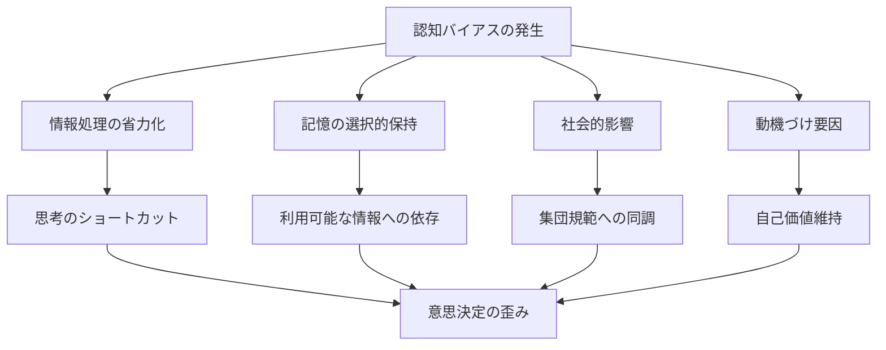
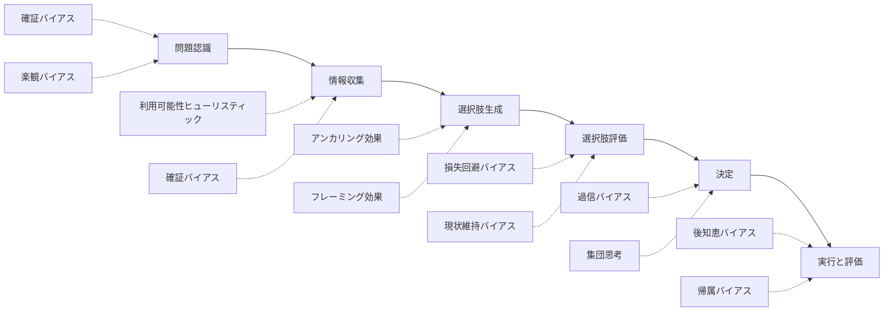

# 認知バイアスと意思決定

!!! info "このページについて"
    このページでは、認知バイアスが意思決定に与える影響について詳しく解説します。  
    ヒューリスティックや感情に起因する典型的なバイアスを分類・図解し、それぞれが意思決定プロセスのどの段階に作用するかを明らかにします。  
    また、バイアスの検出・軽減方法、AIとの協働による対策、具体的なケーススタディを通じて、バイアスに気づき、より良い判断を行うための実践的な知識を提供します。


## 認知バイアスの基本

認知バイアス（認知偏向）とは、人間の思考や判断に系統的に現れる歪みや偏りのことです。これらのバイアスは、意思決定者が「完全に合理的」であることを妨げ、しばしば最適ではない判断や選択へと導きます。認知バイアスは進化的に形成された思考の省エネ機能（ヒューリスティック）から生じることが多く、日常的な素早い判断には有用ですが、重要な意思決定においては問題となり得ます。



## 認知バイアスのカテゴリー

認知バイアスは、その発生メカニズムや影響する思考プロセスによって、いくつかの主要カテゴリーに分類できます。

=== "情報処理バイアス"
    ### 1. 情報処理バイアス

    情報の取捨選択や解釈における偏りを指します。

    | バイアス名 | 内容 | 意思決定への影響 | 例 |
    |----|---|---|---|
    | **確証バイアス** | 既存の信念や仮説を支持する情報を優先的に探し、反証を無視する傾向 | 情報収集の偏り、代替案の過小評価 | 投資家が自分の投資判断を裏付ける情報ばかりを集める |
    | **アンカリング効果** | 最初に提示された情報（アンカー）に引きずられる現象 | 初期値への過度の依存 | 住宅価格の交渉で、最初の提示価格に影響される |
    | **可用性ヒューリスティック** | 思い浮かびやすい事例に基づいて判断する傾向 | 印象的だが稀な事象の過大評価 | メディアで報道された航空事故を恐れて飛行機を避ける |
    | **フレーミング効果** | 情報の提示方法によって判断が変わる現象 | 同じ内容でも表現方法で判断が変化 | 「20%の失敗率」と「80%の成功率」で選択が異なる |

=== "記憶関連バイアス"

    ### 2. 記憶関連バイアス

    記憶の保持や想起に関する偏りです。

    | バイアス名 | 内容 | 意思決定への影響 | 例 |
    |----|---|---|---|
    | **後知恵バイアス** | 結果を知った後で「予測できた」と思い込む傾向 | 失敗からの学習を阻害、責任追及を強化 | 株価暴落後に「明らかな兆候があった」と思い込む |
    | **選択的記憶** | 自分の信念や感情に合致する情報をより良く覚えている傾向 | 過去の経験からの偏った学習 | 成功体験を過大に記憶し、失敗を忘れる |
    | **ピーク・エンド・ルール** | 経験のピーク（最も強い瞬間）と終わり方で評価する傾向 | 全体の経験よりも特定の瞬間で判断 | 最後に良い印象を与えたサービスを高く評価 |

=== "社会的バイアス"

    ### 3. 社会的バイアス

    他者や集団との関係における偏りです。

    | バイアス名 | 内容 | 意思決定への影響 | 例 |
    |----|---|---|---|
    | **集団思考** | 集団の和を重んじるあまり批判的思考が抑制される現象 | 批判的検討の欠如、過度のリスク選好 | 会議で反対意見を言いづらい雰囲気 |
    | **権威バイアス** | 権威ある人の意見を過度に信頼する傾向 | 権威者の意見への過度の依存 | 上司の提案に無批判に従う |
    | **同調バイアス** | 多数派の意見や行動に合わせる傾向 | 独自の判断の抑制 | 周囲が賛成しているから自分も賛成する |
    | **内集団バイアス** | 自分の所属する集団を優遇する傾向 | 自集団の意見や提案への偏り | 自部門の提案を他部門より高く評価する |

=== "自己認知バイアス"

    ### 4. 自己認知バイアス

    自己に関する認知の偏りです。

    | バイアス名 | 内容 | 意思決定への影響 | 例 |
    |----|---|---|---|
    | **過信バイアス** | 自分の能力や判断を過大評価する傾向 | リスクの過小評価、過度の自信 | 自分の投資判断が平均より優れていると思い込む |
    | **コントロール錯覚** | 実際より多くの制御力があると錯覚する傾向 | リスク管理の欠如、運の要素の無視 | ギャンブルで自分にはコツがあると思い込む |
    | **現状維持バイアス** | 変化を避け現状を維持したがる傾向 | 革新的選択肢の回避、消極的決定 | 明らかに良い代替案があっても古いシステムを使い続ける |
    | **埋没費用誤謬** | 既に投資した資源を惜しんで撤退できない誤り | 非合理的な継続投資、撤退の遅れ | 赤字プロジェクトに「ここまで投資したから」と追加投資 |

## 意思決定プロセスでのバイアスの影響

認知バイアスは意思決定の各段階で異なる影響を及ぼします。



### 各段階でのバイアスの例

|段階|バイアス名|説明|
|---|---|---|
|**1. 問題認識段階**|**フレーミングバイアス**|問題の枠組み方によって、認識される問題の性質が変わります|
||**盲点バイアス**|自分の思考の盲点に気づかず、問題の一部を見逃します|
||**楽観バイアス**|リスクを過小評価し、問題の重大性を適切に把握できません|
|**2. 情報収集段階**|**確証バイアス**|既存の考えを支持する情報のみを集めます|
||**選択的知覚**|自分の期待に合致する情報だけに注目します|
||**近視眼的注意**|目前の情報に過度に注目し、長期的要因を無視します|
|**3. 選択肢生成段階**|**機能的固着**|従来の使用法や機能にとらわれ、<br>創造的な選択肢を生み出せません|
||**アンカリング効果**|最初に思いついた選択肢から大きく離れられません|
||**保有効果**|既に持っているものに過大な価値を置き、<br>代替案の検討を妨げます|
|**4. 選択肢評価段階**|**プロスペクト理論<br>バイアス**|利得と損失の評価が非対称的になります|
||**ゼロリスクバイアス**|リスクをゼロにする選択肢を過大評価します|
||**対比効果**|直前に検討した選択肢との比較に影響されます|
|**5. 決定段階**|**過信バイアス**|先延ばしバイアス|
||**損失回避バイアス**|損失を避けるために過度にリスク回避的になります|
||**先延ばしバイアス**|意思決定の快適さを追求するために決定を遅らせます|
|**6. 実行と評価段階**|**後知恵バイアス**|結果を知った後で「わかっていた」と思い込みます|
||**帰属バイアス**|成功は自分の能力、<br>失敗は外部要因のせいと考えます|
||**確証バイアス**|自分の決定が正しかったと証明する情報を選択的に集めます|
    

## 認知バイアスの検出方法

バイアスは気づきにくいため、意識的な検出が重要です。

### 自己診断チェックリスト

以下の質問に「はい」と答えることが多い場合、該当するバイアスの影響を受けている可能性があります。

#### 確証バイアス
- [ ] 自分の考えと異なる意見を聞くと不快になることがある
- [ ] 自分の立場を支持する情報を積極的に探すことが多い

#### 過信バイアス
- [ ] 自分は平均より優れた判断力を持っていると思う
- [ ] 自分の予測が外れたときに驚くことが多い

#### 損失回避
- [ ] 小さな損失の可能性があるだけで選択肢を避ける
- [ ] 利益より損失の方が心理的影響が大きい

#### 集団思考
- [ ] 会議で反対意見を述べるのが難しいと感じる
- [ ] チームの和を乱したくないので批判的意見を控える


### 外部からの検出シグナル

他者がバイアスの影響を受けているサインとして。

- 反対の証拠を提示しても意見が変わらない
- 複数の人が同じ弱点を持つ計画に無批判に同意している
- 失敗の原因を常に外部要因に求める
- 決定の良し悪しを結果だけで判断する

## バイアス軽減の戦略

認知バイアスを完全に取り除くことは困難ですが、以下の戦略で影響を軽減できます。


=== "個人レベルの戦略"

    ### 1. 個人レベルの戦略

    ```mermaid
    graph LR
        A[メタ認知の強化] --> A1[思考プロセスの意識的モニタリング]
        A --> A2[自分の判断への「赤チーム」的質問]
        
        B[多様な視点の獲得] --> B1[反対の視点を意図的に探索]
        B --> B2[複数の参照フレームの使用]
        
        C[バイアスリテラシー向上] --> C1[主要バイアスの学習]
        C --> C2[自己のバイアスパターン認識]
        
        D[思考の外部化] --> D1[思考プロセスの文書化]
        D --> D2[思考の可視化ツールの活用]
        
        A --> E[バイアス軽減]
        B --> E
        C --> E
        D --> E
        
    
    ```

    #### 具体的テクニック

    - **プレモータム分析**: 「この決定が失敗したと想像し、その理由を考える」
    - **悪魔の代弁者**: 意図的に反対の立場から意見を述べる役割を設定
    - **ベースレート考慮**: 類似ケースの統計的頻度を意思決定に取り入れる
    - **決定日記**: 意思決定の理由と期待を事前に記録し、後で検証


=== "チーム・組織レベルの戦略"

    ### 2. チーム・組織レベルの戦略

    ```mermaid
    graph LR
        A[多様性の確保] --> A1[多様なバックグラウンド]
        A --> A2[多様な思考スタイル]
        
        B[構造化された意思決定] --> B1[明示的な判断基準]
        B --> B2[段階的意思決定プロセス]
        
        C[心理的安全性] --> C1[批判的意見の奨励]
        C --> C2[失敗からの学習文化]
        
        D[外部視点の導入] --> D1[外部専門家の関与]
        D --> D2[ステークホルダー視点の考慮]
        
        A -.-> E[組織的バイアス軽減]
        B -.-> E
        C -.-> E
        D -.-> E
        
    
    ```

    #### 組織的アプローチ

    | アプローチ | 内容 | 効果的な状況 |
    |----------|------|------------|
    | **意思決定委員会** | 複数の視点からなる公式委員会 | 重要な戦略的決定 |
    | **段階的承認プロセス** | 異なるレベルでの独立した審査 | 大規模投資、リスクの高い決定 |
    | **匿名フィードバック** | 匿名で反対意見を提出できる仕組み | 権力格差がある環境 |
    | **交差チェック** | 異なるチームやバックグラウンドによる検証 | 専門的判断が必要な場面 |
    | **決定基準の明文化** | 事前に評価基準を明確に文書化 | 主観的評価が入りやすい決定 |

## 認知バイアスと決定支援システム

テクノロジーを活用したバイアス軽減アプローチも発展しています。

### 1. アルゴリズム支援の可能性と課題

??? TypeScript実装例
    この TypeScript 実装は、ユーザーの意思決定行動を分析し、認知バイアスを検出・軽減するアルゴリズムの概念モデルを示しています。  
    以下の機能が含まれています。

    ##### バイアスの検出
    - `detectConfirmationBias`: 検索行動から確証バイアスを検出  
    - `detectAnchoringBias`: 推定課題におけるアンカリング効果の分析

    ##### バイアスの評価
    - 偏りのスコアを算出し、一定の閾値を超えた場合に警告を出力

    ##### 対処戦略の提案
    - `suggestDebiasing` により、認知バイアスの種類に応じた改善アクション（反対視点の導入、確信度の再評価など）を提供

    このようなシステムは、AIによる意思決定支援ツールに組み込まれることで、利用者の判断の質を高める役割を果たします。


    ```typescript
    // バイアス検出・軽減システムの概念的コード例
    class CognitiveBiasDetector {
      private userDecisionHistory: Decision[];
      private benchmarkData: StatisticalData;
      private biasPatterns: BiasPattern[];
      
      constructor() {
        this.userDecisionHistory = [];
        this.benchmarkData = this.loadBenchmarkData();
        this.biasPatterns = this.loadBiasPatterns();
      }
      
      // 確証バイアス検出
      detectConfirmationBias(searchBehavior: SearchBehavior): BiasReport {
        const searchTerms = searchBehavior.getSearchTerms();
        const clickedResults = searchBehavior.getClickedResults();
        
        // 検索行動の偏りを分析
        const bias = this.analyzeSearchBias(searchTerms, clickedResults);
        
        if (bias.score > 0.7) {
          return {
            biasType: 'confirmation',
            severity: this.calculateSeverity(bias),
            suggestions: [
              'あなたは自分の見方を支持する情報を選択的に探している可能性があります',
              '反対の視点を含むキーワードで検索してみてください',
              '次の反論を考慮してください: ' + this.generateCounterarguments()
            ]
          };
        }
        
        return { biasType: 'none' };
      }
      
      // アンカリング効果検出
      detectAnchoringBias(estimationTask: EstimationTask): BiasReport {
        const initialValue = estimationTask.getInitialValue();
        const finalEstimate = estimationTask.getFinalEstimate();
        const statisticalRange = this.benchmarkData.getRange(estimationTask.getCategory());
        
        // アンカーへの引きずられ度合いを計算
        const anchorInfluence = this.calculateAnchorInfluence(
          initialValue, finalEstimate, statisticalRange
        );
        
        if (anchorInfluence > 0.6) {
          return {
            biasType: 'anchoring',
            severity: anchorInfluence,
            suggestions: [
              '初期値に影響されすぎている可能性があります',
              '以下の統計的範囲を参考にしてください: ' + statisticalRange.toString(),
              '問題を分解して個別に推定してみてください'
            ]
          };
        }
        
        return { biasType: 'none' };
      }
      
      // バイアス対策推奨
      suggestDebiasing(context: DecisionContext): DebiasingStrategy[] {
        const detectedBiases = this.detectAllBiases(context);
        const strategies: DebiasingStrategy[] = [];
        
        for (const bias of detectedBiases) {
          switch (bias.type) {
            case 'confirmation':
              strategies.push({
                type: 'perspective_taking',
                description: '反対の立場から考えてみる',
                implementation: this.generatePerspectiveTakingExercise(context)
              });
              break;
            case 'overconfidence':
              strategies.push({
                type: 'confidence_calibration',
                description: '確信度の校正エクササイズ',
                implementation: this.generateConfidenceCalibration(context)
              });
              break;
            // 他のバイアスに対する戦略
          }
        }
        
        return strategies;
      }
      
      // ヘルパーメソッド
      private analyzeSearchBias(terms: string[], clicks: SearchResult[]): BiasAnalysis { /* 実装 */ }
      private calculateAnchorInfluence(
        initial: number, final: number, range: Range
      ): number { /* 実装 */ }
      private detectAllBiases(context: DecisionContext): DetectedBias[] { /* 実装 */ }
      // その他のメソッド
    }
    ```

### 2. 人間-AI協働によるバイアス軽減

| アプローチ | 内容 | 留意点 |
|----------|------|-------|
| **データ駆動判断補助** | 統計的ベースレートの自動提供 | AIの判断も偏る可能性に注意 |
| **バイアス警告システム** | 潜在的バイアスをリアルタイム検出 | 過剰警告による警告疲れに注意 |
| **多角的シナリオシミュレーション** | 異なる前提に基づく複数シナリオの生成 | シミュレーションの限界を認識 |
| **決定履歴の分析** | 過去の決定パターンからのバイアス検出 | プライバシーとデータ保護への配慮 |

## 意思決定改善のためのケーススタディ

=== "投資判断における認知バイアス"
    ### ケース1: 投資判断における認知バイアス

    #### 状況
    大手金融機関の投資チームが新興市場への大規模投資を検討していました。最初のアナリストレポートが非常に楽観的だったため、チームはその方向での検討を進めました。

    #### 発生したバイアス
    - **確証バイアス**: 投資を支持するデータのみを重視
    - **集団思考**: 反対意見を述べにくい雰囲気の形成
    - **過信バイアス**: リスク評価の甘さ

    #### 対策と結果
    - **レッドチーム/ブルーチーム分析**: 意図的に投資に反対するチームを編成
    - **匿名フィードバック**: 匿名でリスク要因を提出できる仕組み
    - **プレモータム**: 「投資が失敗した場合」を想定した分析

    これらの対策により、投資計画は修正され、エクスポージャーの分散化と段階的投資アプローチが採用されました。結果として市場の予期せぬ下落時のリスクを軽減できました。

=== "医療診断におけるバイアス軽減"
    ### ケース2: 医療診断におけるバイアス軽減

    #### 状況
    大学病院の診断プロセスで、特に珍しい疾患の見落としや過剰診断が問題となっていました。

    #### 発生していたバイアス
    - **利用可能性ヒューリスティック**: 印象的な症例に基づく診断
    - **アンカリング効果**: 最初の診断仮説からの脱却困難
    - **後知恵バイアス**: 誤診からの学習阻害

    #### 対策と結果
    - **構造化診断チェックリスト**: 症状ベースの標準化されたプロセス
    - **診断カンファレンス**: 複数の専門医による症例検討
    - **診断信頼度評価**: 各診断に明示的な確信度を付与

    これらの施策により、診断精度が12%向上し、特に珍しい疾患の見落としが30%減少しました。また、不必要な検査の削減にもつながりました。


## ケーススタディ：認知バイアスの複合的影響

実際の事故事例において、複数の認知バイアスがどのように作用するかを分析することで、バイアスの実際的な影響を理解できます。

### [羽田空港地上衝突事故における認知バイアス分析](../../case-studies/haneda-airport-collision)

この事故では、以下のような認知バイアスが関与していた可能性があります。

=== "確証バイアス"
    #### 確証バイアス
    - **海上保安庁機**：救援任務の重要性から「優先して離陸できる」という信念を支持する情報（「ナンバーワン」という表現）に注目し、制限的な側面を無視

=== "確証バイアス"
    #### 注意バイアス
    - **日本航空機**：着陸操作に集中することで、滑走路上の障害物への注意が低下
    - **管制官**：複数機の管理に注意が分散し、監視システムの警報を見逃し

=== "確証バイアス"
    #### 楽観バイアス
    - **全関係者**：「いつものように安全に運航できる」という過度の楽観が、慎重な確認行動を阻害

=== "時間的圧力下でのバイアス増大"
    #### 時間的圧力下でのバイアス増大
    - 年末年始の繁忙期と地震救援という状況が、通常より迅速な判断を求められ、バイアスの影響が拡大

!!! warning "複合的バイアスの危険性"
    この事例は、単一のバイアスではなく、複数のバイアスが組み合わさることで、システム全体の安全性が脅かされることを示しています。バイアス対策も、個人レベルだけでなく、組織・システムレベルでの対応が必要です。

## まとめ：認知バイアスと向き合うために

認知バイアスは完全に排除することはできませんが、その存在を認識し対策を講じることで、より質の高い意思決定が可能になります。

### 実践的アプローチ

1. **認識する**: バイアスの種類と自分の傾向を知る
2. **構造化する**: 意思決定プロセスを明示的に設計する
3. **多様化する**: 異なる視点や情報源を意図的に取り入れる
4. **検証する**: 決定の前提や論理を批判的に検証する
5. **振り返る**: 過去の決定から学び、パターンを認識する

### 継続的な意思決定能力の向上

認知バイアスへの対処は一度の施策ではなく、継続的な取り組みが必要です。個人的な意識向上と組織的な仕組みの両方を活用し、常に意思決定プロセスを改善していく姿勢が重要です。

次のページでは、[不確実性下の意思決定](../uncertainty)について詳しく解説します。

## 参考文献

1. Kahneman, D. (2011). Thinking, Fast and Slow. Farrar, Straus and Giroux.
2. Tversky, A., & Kahneman, D. (1974). Judgment under Uncertainty: Heuristics and Biases. Science, 185(4157), 1124-1131.
3. Ariely, D. (2008). Predictably Irrational: The Hidden Forces That Shape Our Decisions. HarperCollins.
4. Thaler, R. H., & Sunstein, C. R. (2008). Nudge: Improving Decisions about Health, Wealth, and Happiness. Yale University Press.
5. Bazerman, M. H., & Moore, D. A. (2013). Judgment in Managerial Decision Making (8th ed.). Wiley.
6. 楠見孝・道田泰司 (2015). 『批判的思考と市民リテラシー』. 誠信書房.
7. 真壁昭夫 (2018). 『行動経済学 - 経済は「感情」で動いている』. 中公新書.
8. 中谷内一也 (2012). 『リスクの社会心理学 - 人間の理解と信頼の構築に向けて』. 有斐閣.