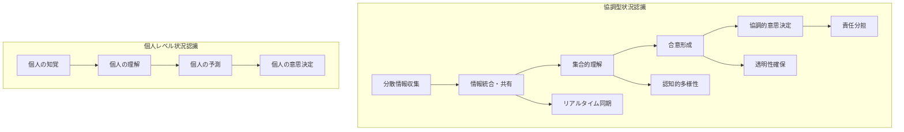
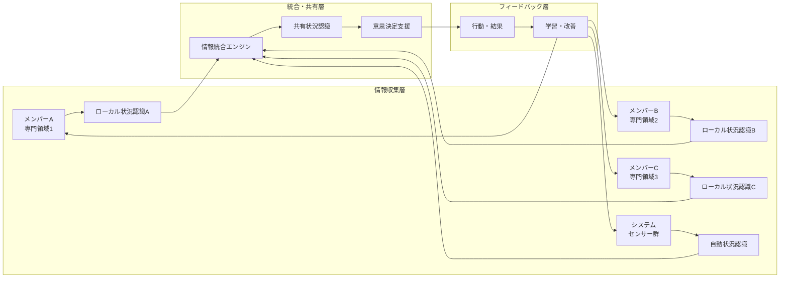
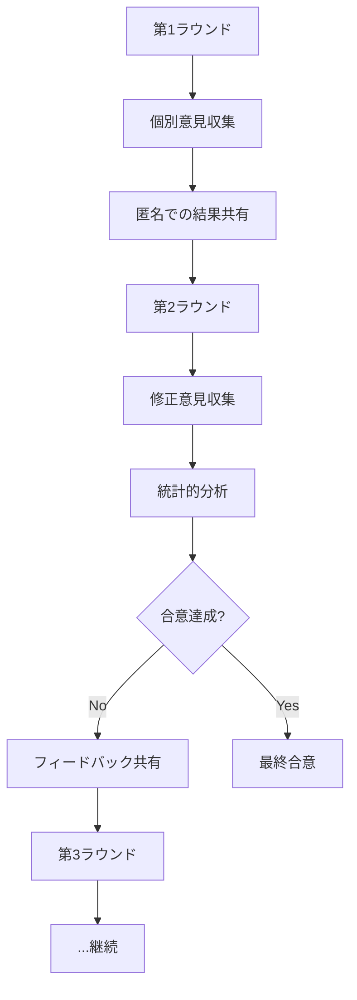
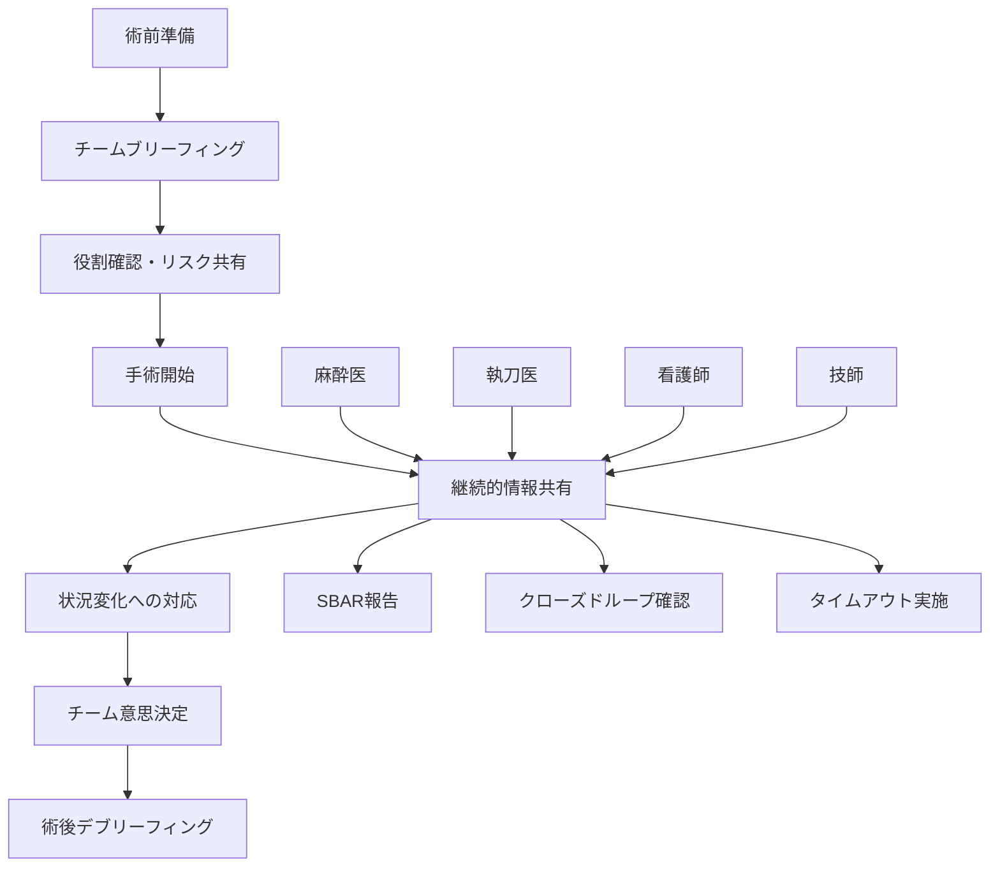

# 協調型状況認識

!!! info "このページについて"

    このページでは、チーム・組織において複数のメンバーが協力して状況認識を構築・共有する「協調型状況認識」について詳しく解説します。  
    個人レベルの状況認識から、チーム共有状況認識（Team Situational Awareness）、分散状況認識（Distributed Situational Awareness）まで、現代の複雑な組織運営に不可欠な協調メカニズムを理論と実践の両面から掘り下げます。  
    RxJSやWeb技術を活用した実装例も含め、実際のシステム構築に役立つ内容となっています。

## 協調型状況認識とは

協調型状況認識（Collaborative Situational Awareness）は、複数の個人やシステムが連携して統合的な状況理解を構築・維持するプロセスです。現代の複雑な業務環境では、単一の個人だけでは把握しきれない情報を、チーム全体で効率的に収集・分析・共有することが不可欠となっています。

### 従来の状況認識との違い



### 協調型状況認識の特徴

| 特徴 | 個人レベル | 協調型 | 利点・課題 |
|---|---|---|---|
| **情報範囲** | 限定的 | 広範囲・多角的 | より包括的だが統合が複雑 |
| **処理能力** | 個人の認知限界 | 分散処理可能 | 高い処理能力だが調整コスト |
| **信頼性** | 個人のバイアス影響 | 相互チェック可能 | 高い信頼性だが合意時間要 |
| **応答速度** | 迅速 | 調整時間必要 | 精度向上と速度のトレードオフ |
| **責任** | 明確 | 分散・共有 | リスク分散だが責任の所在複雑化 |

## 協調型状況認識の基本モデル

### 分散-統合モデル



### Team SA vs Distributed SA

=== "Team SA（チーム状況認識）"
    **定義**: 同一チーム内でのメンバー間状況認識共有

    **特徴**:

    - 共通目標の存在
    - 密接なコミュニケーション
    - 統一された手順・プロトコル
    - 明確な役割分担

    **適用例**:
    
    - 手術チーム
    - 航空機クルー
    - 緊急対応チーム
    - スポーツチーム

=== "Distributed SA（分散状況認識）"
    **定義**: 組織・システム境界を超えた状況認識ネットワーク

    **特徴**:
    
    - 多様な目標・利害
    - 非同期コミュニケーション
    - 異なる手順・プロトコル
    - 重複する責任領域

    **適用例**:
    
    - 災害対応における複数機関連携
    - サプライチェーン管理
    - 国際的な軍事・平和維持活動
    - 分散開発チーム

## 協調プロセスと手法

### 情報共有プロトコル

効果的な協調型状況認識には、構造化された情報共有プロトコルが必要です。

#### SBAR（Situation, Background, Assessment, Recommendation）

医療分野で開発され、多くの分野で採用されている構造化コミュニケーション手法です。

| 要素 | 内容 | 目的 | 例 |
|---|---|---|---|
| **S**ituation | 現在の状況 | 問題の明確化 | 「患者の血圧が急激に低下しています」 |
| **B**ackground | 背景情報 | 文脈の提供 | 「術後2時間、既往歴は高血圧」 |
| **A**ssessment | 評価・分析 | 判断の共有 | 「術後出血の可能性が高いと判断」 |
| **R**ecommendation | 推奨事項 | 行動指針 | 「緊急手術室への移送を推奨」 |

#### CRM（Crew Resource Management）コミュニケーション

航空業界で発達した、チーム内効果的コミュニケーションの原則です。

- **Closed-loop Communication**: 指示→復唱→確認の3段階プロセス
- **Cross-checking**: 相互監視・チェック体制
- **Call-out**: 重要な状況変化の明確な報告
- **Time-out**: 重要決定前の一時停止・確認

### 合意形成メカニズム

#### Delphi法による専門家合意



#### 段階的合意プロセス

1. **情報共有段階**: 全員が同じ情報基盤を持つ
2. **課題特定段階**: 問題点・論点の明確化
3. **選択肢検討段階**: 複数の解決策の検討
4. **評価・議論段階**: 各選択肢の長短評価
5. **合意形成段階**: 最適解への収束
6. **実行計画段階**: 具体的行動計画の策定

## 技術実装：リアルタイム協調システム

### RxJSによる協調状況認識システム

RxJSのリアクティブプログラミングパラダイムを活用した、リアルタイム協調システムの実装例です。

??? TypeScript実装例

    この実装では、RxJSとAngularを活用したリアルタイム協調状況認識システムを構築しています。WebSocketによる双方向通信、状況情報の自動同期、合意形成プロセス、権限管理などを統合した包括的なシステムです。

    ```typescript
    // 協調型状況認識システム（RxJS + Angular）
    import { Injectable } from '@angular/core';
    import { BehaviorSubject, Observable, Subject, combineLatest, merge } from 'rxjs';
    import { map, filter, distinctUntilChanged, debounceTime, share, scan } from 'rxjs/operators';
    import { webSocket } from 'rxjs/webSocket';

    // データ型定義
    interface SituationUpdate {
      id: string;
      timestamp: Date;
      source: ParticipantInfo;
      type: 'perception' | 'analysis' | 'prediction' | 'recommendation';
      content: any;
      confidence: number;
      priority: 'low' | 'medium' | 'high' | 'critical';
    }

    interface ParticipantInfo {
      id: string;
      name: string;
      role: string;
      expertise: string[];
      location: string;
      status: 'active' | 'busy' | 'offline';
    }

    interface CollaborativeSAState {
      participants: ParticipantInfo[];
      sharedSituation: SharedSituationModel;
      activeDiscussions: Discussion[];
      consensusItems: ConsensusItem[];
      alerts: Alert[];
    }

    interface SharedSituationModel {
      currentSituation: SituationElement[];
      trends: TrendAnalysis[];
      predictions: PredictionItem[];
      riskAssessment: RiskAssessment;
      actionPriorities: ActionPriority[];
    }

    @Injectable({
      providedIn: 'root'
    })
    export class CollaborativeSAService {
      private wsConnection$ = webSocket<any>({
        url: 'ws://localhost:8080/collaborative-sa',
        openObserver: {
          next: () => console.log('協調SA接続確立')
        }
      });

      // 状態管理
      private participants$ = new BehaviorSubject<ParticipantInfo[]>([]);
      private situationUpdates$ = new Subject<SituationUpdate>();
      private consensusRequests$ = new Subject<ConsensusRequest>();
      private userActions$ = new Subject<UserAction>();

      // 統合状況認識ストリーム
      private collaborativeSAState$: Observable<CollaborativeSAState>;

      constructor() {
        this.initializeCollaborativeStreams();
      }

      private initializeCollaborativeStreams(): void {
        // WebSocket経由の更新を処理
        this.wsConnection$.subscribe(message => {
          this.handleIncomingMessage(message);
        });

        // 統合状況認識ストリームの構築
        this.collaborativeSAState$ = combineLatest([
          this.participants$,
          this.buildSharedSituationStream(),
          this.buildDiscussionStream(),
          this.buildConsensusStream(),
          this.buildAlertStream()
        ]).pipe(
          map(([participants, sharedSituation, discussions, consensus, alerts]) => ({
            participants,
            sharedSituation,
            activeDiscussions: discussions,
            consensusItems: consensus,
            alerts
          })),
          share()
        );
      }

      // 共有状況認識ストリームの構築
      private buildSharedSituationStream(): Observable<SharedSituationModel> {
        return this.situationUpdates$.pipe(
          // 優先度によるフィルタリング
          filter(update => update.priority !== 'low'),
          
          // 時間窓での集約（5秒間）
          debounceTime(5000),
          
          // 状況要素の統合
          scan((accumulated: SharedSituationModel, update: SituationUpdate) => {
            return this.integrateSituationUpdate(accumulated, update);
          }, this.getInitialSituationModel()),
          
          // 重複除去
          distinctUntilChanged((a, b) => this.compareSituationModels(a, b)),
          
          share()
        );
      }

      // リアルタイム参加者管理
      manageParticipants(): Observable<ParticipantInfo[]> {
        return merge(
          // 新規参加者
          this.wsConnection$.pipe(
            filter(msg => msg.type === 'participant_joined'),
            map(msg => msg.participant)
          ),
          
          // 参加者離脱
          this.wsConnection$.pipe(
            filter(msg => msg.type === 'participant_left'),
            map(msg => msg.participantId)
          ),
          
          // ステータス更新
          this.wsConnection$.pipe(
            filter(msg => msg.type === 'participant_status_changed'),
            map(msg => ({ id: msg.participantId, status: msg.newStatus }))
          )
        ).pipe(
          scan((participants: ParticipantInfo[], event: any) => {
            return this.updateParticipantList(participants, event);
          }, []),
          share()
        );
      }

      // 状況更新の投稿
      postSituationUpdate(update: Omit<SituationUpdate, 'id' | 'timestamp'>): void {
        const fullUpdate: SituationUpdate = {
          ...update,
          id: this.generateUpdateId(),
          timestamp: new Date()
        };

        // ローカルストリームに追加
        this.situationUpdates$.next(fullUpdate);

        // 他の参加者に送信
        this.wsConnection$.next({
          type: 'situation_update',
          update: fullUpdate
        });
      }

      // 合意形成プロセスの開始
      initiateConsensusProcess(topic: string, options: string[], participants: string[]): Observable<ConsensusResult> {
        const consensusId = this.generateConsensusId();
        
        const consensusRequest: ConsensusRequest = {
          id: consensusId,
          topic,
          options,
          participants,
          initiator: this.getCurrentUserId(),
          deadline: new Date(Date.now() + 30 * 60 * 1000), // 30分後
          votingMethod: 'majority'
        };

        // 合意プロセス開始を送信
        this.wsConnection$.next({
          type: 'consensus_request',
          request: consensusRequest
        });

        // 合意結果を監視
        return this.wsConnection$.pipe(
          filter(msg => msg.type === 'consensus_result' && msg.consensusId === consensusId),
          map(msg => msg.result),
          share()
        );
      }

      // インタラクティブディスカッション
      createDiscussionThread(topic: string, initialContent: string): Observable<Discussion> {
        const discussionId = this.generateDiscussionId();
        
        const discussion: Discussion = {
          id: discussionId,
          topic,
          participants: [],
          messages: [{
            id: this.generateMessageId(),
            author: this.getCurrentUserId(),
            content: initialContent,
            timestamp: new Date(),
            type: 'text'
          }],
          status: 'active',
          priority: 'medium'
        };

        this.wsConnection$.next({
          type: 'discussion_created',
          discussion
        });

        // ディスカッション更新を監視
        return this.wsConnection$.pipe(
          filter(msg => msg.type === 'discussion_update' && msg.discussionId === discussionId),
          map(msg => msg.discussion),
          share()
        );
      }

      // 状況認識品質メトリクス
      calculateCollaborationQuality(): Observable<CollaborationQualityMetrics> {
        return this.collaborativeSAState$.pipe(
          map(state => {
            const diversity = this.calculateInformationDiversity(state);
            const timeliness = this.calculateInformationTimeliness(state);
            const consensus = this.calculateConsensusLevel(state);
            const participation = this.calculateParticipationLevel(state);
            
            return {
              informationDiversity: diversity,
              informationTimeliness: timeliness,
              consensusLevel: consensus,
              participationLevel: participation,
              overallQuality: (diversity + timeliness + consensus + participation) / 4
            };
          }),
          share()
        );
      }

      // 状況認識の可視化データ生成
      generateCollaborationVisualization(): Observable<CollaborationVisualizationData> {
        return this.collaborativeSAState$.pipe(
          map(state => ({
            participantNetwork: this.buildParticipantNetworkData(state),
            informationFlow: this.buildInformationFlowData(state),
            consensusProgress: this.buildConsensusProgressData(state),
            situationCoverage: this.buildSituationCoverageData(state)
          })),
          share()
        );
      }

      // プライベートメソッド
      private integrateSituationUpdate(
        current: SharedSituationModel, 
        update: SituationUpdate
      ): SharedSituationModel {
        // 更新内容の統合ロジック
        const updatedSituation = { ...current };
        
        switch (update.type) {
          case 'perception':
            updatedSituation.currentSituation = this.mergePerceptionData(
              current.currentSituation, 
              update.content
            );
            break;
          case 'analysis':
            updatedSituation.trends = this.mergeTrendAnalysis(
              current.trends, 
              update.content
            );
            break;
          case 'prediction':
            updatedSituation.predictions = this.mergePredictions(
              current.predictions, 
              update.content
            );
            break;
          case 'recommendation':
            updatedSituation.actionPriorities = this.mergeRecommendations(
              current.actionPriorities, 
              update.content
            );
            break;
        }
        
        // リスク評価の再計算
        updatedSituation.riskAssessment = this.recalculateRiskAssessment(updatedSituation);
        
        return updatedSituation;
      }

      private calculateInformationDiversity(state: CollaborativeSAState): number {
        // 情報ソースの多様性を計算
        const sources = new Set(
          state.sharedSituation.currentSituation.map(element => element.source)
        );
        const participants = state.participants.length;
        
        return participants > 0 ? sources.size / participants : 0;
      }

      private calculateConsensusLevel(state: CollaborativeSAState): number {
        // 合意レベルを計算
        const completedConsensus = state.consensusItems.filter(item => item.status === 'completed');
        const avgAgreement = completedConsensus.reduce((sum, item) => sum + item.agreementLevel, 0);
        
        return completedConsensus.length > 0 ? avgAgreement / completedConsensus.length : 0;
      }

      // Getter for external access
      getCollaborativeSAState(): Observable<CollaborativeSAState> {
        return this.collaborativeSAState$;
      }
    }

    // Angular Component例
    @Component({
      selector: 'app-collaborative-sa-dashboard',
      template: `
        <div class="collaborative-sa-dashboard">
          <!-- 参加者パネル -->
          <div class="participants-panel">
            <h3>参加者 ({{(participants$ | async)?.length}})</h3>
            <div class="participant-list">
              <div *ngFor="let participant of participants$ | async" 
                   class="participant-item" 
                   [class]="participant.status">
                <span class="name">{{participant.name}}</span>
                <span class="role">{{participant.role}}</span>
                <span class="status">{{participant.status}}</span>
              </div>
            </div>
          </div>

          <!-- 状況概要パネル -->
          <div class="situation-overview">
            <h3>統合状況認識</h3>
            <div class="situation-summary" *ngIf="sharedSituation$ | async as situation">
              <div class="current-situation">
                <h4>現在の状況</h4>
                <div *ngFor="let element of situation.currentSituation" class="situation-element">
                  {{element.description}}
                </div>
              </div>
              
              <div class="risk-assessment">
                <h4>リスク評価</h4>
                <div class="risk-level" [class]="situation.riskAssessment.level">
                  {{situation.riskAssessment.level}}: {{situation.riskAssessment.description}}
                </div>
              </div>
            </div>
          </div>

          <!-- アクティブディスカッション -->
          <div class="discussions-panel">
            <h3>アクティブディスカッション</h3>
            <div class="discussion-list">
              <div *ngFor="let discussion of activeDiscussions$ | async" class="discussion-item">
                <h4>{{discussion.topic}}</h4>
                <div class="message-count">{{discussion.messages.length}} メッセージ</div>
                <button (click)="joinDiscussion(discussion.id)">参加</button>
              </div>
            </div>
          </div>

          <!-- 合意プロセス -->
          <div class="consensus-panel">
            <h3>合意プロセス</h3>
            <div class="consensus-list">
              <div *ngFor="let consensus of consensusItems$ | async" class="consensus-item">
                <h4>{{consensus.topic}}</h4>
                <div class="progress-bar">
                  <div class="progress" [style.width.%]="consensus.progress"></div>
                </div>
                <div class="voting-status">{{consensus.votedCount}}/{{consensus.totalParticipants}} 投票済み</div>
              </div>
            </div>
          </div>
        </div>
      `,
  
    })
    export class CollaborativeSADashboardComponent implements OnInit {
      participants$: Observable<ParticipantInfo[]>;
      sharedSituation$: Observable<SharedSituationModel>;
      activeDiscussions$: Observable<Discussion[]>;
      consensusItems$: Observable<ConsensusItem[]>;

      constructor(private collaborativeSA: CollaborativeSAService) {}

      ngOnInit(): void {
        const state$ = this.collaborativeSA.getCollaborativeSAState();
        
        this.participants$ = state$.pipe(map(state => state.participants));
        this.sharedSituation$ = state$.pipe(map(state => state.sharedSituation));
        this.activeDiscussions$ = state$.pipe(map(state => state.activeDiscussions));
        this.consensusItems$ = state$.pipe(map(state => state.consensusItems));
      }

      joinDiscussion(discussionId: string): void {
        // ディスカッション参加ロジック
      }
    }

    // 結果インターフェース
    interface CollaborationQualityMetrics {
      informationDiversity: number;
      informationTimeliness: number;
      consensusLevel: number;
      participationLevel: number;
      overallQuality: number;
    }

    interface ConsensusRequest {
      id: string;
      topic: string;
      options: string[];
      participants: string[];
      initiator: string;
      deadline: Date;
      votingMethod: 'majority' | 'unanimous' | 'weighted';
    }
    ```

### 分散システムでの状況同期

Web技術を活用した分散環境での状況認識同期システムです。

??? TypeScript実装例

    ```typescript
    // 分散状況認識同期システム
    class DistributedSASyncSystem {
      private peerConnections: Map<string, RTCPeerConnection> = new Map();
      private localSituationState$ = new BehaviorSubject<SituationState>(null);
      private remoteSituationStates$ = new Map<string, BehaviorSubject<SituationState>>();
      private conflictResolver: ConflictResolver;
      
      constructor() {
        this.conflictResolver = new ConflictResolver();
        this.setupPeerToPeerConnections();
      }
      
      // P2P接続の設定
      private setupPeerToPeerConnections(): void {
        // WebRTC設定
        const configuration: RTCConfiguration = {
          iceServers: [
            { urls: 'stun:stun.l.google.com:19302' },
            { urls: 'stun:stun1.l.google.com:19302' }
          ]
        };
        
        // シグナリングサーバーとの接続
        const signalingSocket = io('ws://signaling-server.example.com');
        
        signalingSocket.on('peer-joined', (peerId: string) => {
          this.initiatePeerConnection(peerId, configuration);
        });
      }
      
      // ピア接続の開始
      private async initiatePeerConnection(
        peerId: string, 
        configuration: RTCConfiguration
      ): Promise<void> {
        const peerConnection = new RTCPeerConnection(configuration);
        this.peerConnections.set(peerId, peerConnection);
        
        // データチャンネル設定
        const dataChannel = peerConnection.createDataChannel('situationSync', {
          ordered: true
        });
        
        dataChannel.onopen = () => {
          console.log(`Data channel opened with ${peerId}`);
          this.syncWithPeer(peerId);
        };
        
        dataChannel.onmessage = (event) => {
          this.handleRemoteSituationUpdate(peerId, JSON.parse(event.data));
        };
        
        // ICE候補とオファー/回答の処理
        this.setupICEHandling(peerConnection, peerId);
      }
      
      // 状況データの分散同期
      syncDistributedSituation(): Observable<ConsolidatedSituationState> {
        return combineLatest([
          this.localSituationState$,
          ...Array.from(this.remoteSituationStates$.values())
        ]).pipe(
          map(situationStates => this.consolidateSituationStates(situationStates)),
          distinctUntilChanged(),
          share()
        );
      }
      
      // 状況状態の統合
      private consolidateSituationStates(
        states: SituationState[]
      ): ConsolidatedSituationState {
        const validStates = states.filter(state => state !== null);
        
        if (validStates.length === 0) {
          return this.getEmptyConsolidatedState();
        }
        
        // 複数の状況認識を統合
        const consolidated = {
          perception: this.mergePerceptions(validStates),
          comprehension: this.mergeComprehensions(validStates),
          projection: this.mergeProjections(validStates),
          confidence: this.calculateConsolidatedConfidence(validStates),
          conflicts: this.detectConflicts(validStates),
          timestamp: new Date()
        };
        
        return consolidated;
      }
      
      // コンフリクト解決
      private detectConflicts(states: SituationState[]): ConflictInfo[] {
        const conflicts: ConflictInfo[] = [];
        
        // ペアワイズ比較でコンフリクトを検出
        for (let i = 0; i < states.length; i++) {
          for (let j = i + 1; j < states.length; j++) {
            const conflict = this.conflictResolver.detectConflict(states[i], states[j]);
            if (conflict) {
              conflicts.push(conflict);
            }
          }
        }
        
        return conflicts;
      }
      
      // 合意アルゴリズム（Byzantine Fault Tolerance風）
      reachDistributedConsensus(
        proposedState: SituationState
      ): Observable<ConsensusResult> {
        return new Observable<ConsensusResult>(observer => {
          const consensusRound = this.generateConsensusRoundId();
          const participants = Array.from(this.peerConnections.keys());
          
          // フェーズ1: Prepare
          const preparePromises = participants.map(peerId => 
            this.sendConsensusMessage(peerId, {
              type: 'prepare',
              round: consensusRound,
              proposedState: proposedState
            })
          );
          
          Promise.all(preparePromises).then(() => {
            // フェーズ2: Promise
            const promisePhase$ = this.collectPromiseResponses(consensusRound);
            
            promisePhase$.subscribe(responses => {
              if (this.hasQuorum(responses)) {
                // フェーズ3: Commit
                this.broadcastCommit(consensusRound, proposedState);
                observer.next({
                  success: true,
                  consensusState: proposedState,
                  participantCount: responses.length
                });
              } else {
                observer.next({
                  success: false,
                  reason: 'No quorum reached',
                  participantCount: responses.length
                });
              }
              observer.complete();
            });
          });
        });
      }
    }

    // コンフリクト解決クラス
    class ConflictResolver {
      detectConflict(stateA: SituationState, stateB: SituationState): ConflictInfo | null {
        // 時間ベースの一致確認
        const timeDiff = Math.abs(stateA.timestamp.getTime() - stateB.timestamp.getTime());
        if (timeDiff > 60000) { // 1分以上の差
          return null; // 時間が異なるため比較対象外
        }
        
        // 認識内容の相違確認
        const perceptionConflict = this.comparePerceptions(stateA.perception, stateB.perception);
        const comprehensionConflict = this.compareComprehensions(stateA.comprehension, stateB.comprehension);
        const projectionConflict = this.compareProjections(stateA.projection, stateB.projection);
        
        if (perceptionConflict || comprehensionConflict || projectionConflict) {
          return {
            type: 'content_mismatch',
            stateA: stateA.id,
            stateB: stateB.id,
            conflictAreas: [
              ...(perceptionConflict ? ['perception'] : []),
              ...(comprehensionConflict ? ['comprehension'] : []),
              ...(projectionConflict ? ['projection'] : [])
            ],
            severity: this.calculateConflictSeverity(stateA, stateB)
          };
        }
        
        return null;
      }
      
      resolveConflict(conflict: ConflictInfo, availableStates: SituationState[]): SituationState {
        switch (conflict.type) {
          case 'content_mismatch':
            return this.resolveContentMismatch(conflict, availableStates);
          case 'temporal_inconsistency':
            return this.resolveTemporalInconsistency(conflict, availableStates);
          default:
            return this.defaultResolution(availableStates);
        }
      }
      
      private resolveContentMismatch(
        conflict: ConflictInfo, 
        states: SituationState[]
      ): SituationState {
        // 信頼度ベースの重み付け統合
        const weightedStates = states.map(state => ({
          state,
          weight: state.confidence * this.getSourceCredibility(state.source)
        }));
        
        const totalWeight = weightedStates.reduce((sum, ws) => sum + ws.weight, 0);
        
        // 重み付き平均による統合
        return this.weightedMerge(weightedStates, totalWeight);
      }
    }
    ```

## 協調効果の測定と評価

### 協調品質指標

協調型状況認識の効果を定量的に評価するための指標体系です。

| 指標カテゴリ | 具体的指標 | 測定方法 | 目標値 |
|---|---|---|---|
| **情報品質** | 情報の完全性、正確性、適時性 | 情報監査、精度測定 | >90% |
| **合意効率** | 合意達成時間、合意品質 | プロセス分析 | <30分、>80%満足度 |
| **参加度** | 積極的参加率、貢献度分散 | 行動ログ分析 | >70%、Gini係数<0.4 |
| **意思決定品質** | 決定速度、決定精度、実行成功率 | 成果測定 | <15分、>85%、>90% |

### ROI（投資収益率）分析

協調型状況認識システムの導入効果を経済的に評価します。

#### コスト要素

- **初期導入コスト**: システム開発、教育訓練、プロセス設計
- **運用コスト**: 保守、アップデート、継続教育
- **機会コスト**: 会議時間、調整時間の増加

#### 便益要素

- **意思決定品質向上**: エラー削減、最適化による収益増
- **応答時間短縮**: 迅速な対応による機会損失防止
- **リスク削減**: 事故・トラブルの予防効果
- **学習効果**: 組織全体の能力向上

## 課題と解決策

### 情報過負荷の管理

現代の協調環境では、情報過多により逆に状況認識が悪化するリスクがあります。

#### 課題
- **情報洪水**: 過剰な情報により重要な情報が埋没
- **注意分散**: 複数の情報源への同時注意による認知負荷増大
- **品質低下**: 量を重視することによる情報品質の劣化

#### 解決策
- **適応的フィルタリング**: 個人の役割・専門性に応じた情報フィルタ
- **優先度付けアルゴリズム**: 緊急性・重要性による自動優先順位付け
- **要約・抽象化**: AIによる自動要約、ダッシュボード形式での提示

### コミュニケーション障壁

組織や文化の違いによるコミュニケーション課題への対処法です。

#### 多文化・多言語環境での協調

- **言語障壁**: リアルタイム翻訳、標準化された記号・図表の使用
- **文化的差異**: 文化的背景を考慮したコミュニケーションプロトコル
- **時差問題**: 非同期協調メカニズム、タイムゾーン考慮システム

#### 専門分野間の協調

- **専門用語の違い**: 共通語彙集、自動用語解説システム
- **視点・優先度の違い**: 多角的視点統合、重み付け合意システム
- **責任範囲の曖昧さ**: 明確な責任分担マトリクス、エスカレーション手順

## 産業別応用事例

### 医療における協調型状況認識

#### 手術チームでの実践



**実装要素**:

- **術前ブリーフィング**: 手術計画、リスク要因、役割分担の共有
- **リアルタイム情報共有**: バイタルサイン、進行状況、合併症リスク
- **構造化コミュニケーション**: SBAR、クローズドループ、タイムアウト
- **術後デブリーフィング**: 学習機会、改善点の特定

### 航空業界での協調実践

#### CRM（Crew Resource Management）

**原則**:

1. **状況認識の共有**: フライト状況の全クルー間での共有
2. **意思決定プロセス**: 階層的だが参加型の意思決定
3. **エラー管理**: ヒューマンエラーの予防・検出・回復
4. **コミュニケーション**: 明確・簡潔・確認可能な通信

**実装技術**:

- **ブリーフィング**: 出発前の包括的情報共有
- **クロスチェック**: 相互監視システム
- **コールアウト**: 重要変化の明確な報告
- **デブリーフィング**: フライト後の学習セッション

### 緊急対応における協調

#### 災害対応での多機関連携

**課題**:

- 異なる組織文化・手順
- 限られた通信手段
- 迅速な意思決定の必要性
- リソースの調整

**協調メカニズム**:

- **統合指揮システム（ICS）**: 標準化された指揮構造
- **共通作戦図（COP）**: 統一された状況認識画面
- **定期ブリーフィング**: 定時での情報同期
- **連絡将校（LO）**: 組織間の情報橋渡し役

## 技術トレンドと将来展望

### AI支援協調システム

#### 知的エージェントによる支援

- **自動情報統合**: 複数ソースからの自動的な状況統合
- **合意支援**: 最適解候補の自動生成・評価
- **コンフリクト検出**: 矛盾・対立の早期発見
- **学習・適応**: チーム特性に応じた協調プロセスの最適化

#### 自然言語処理の活用

- **リアルタイム要約**: 大量の報告・議論の自動要約
- **感情分析**: チーム内の心理状態・関係性の把握
- **多言語支援**: 国際チームでのリアルタイム翻訳
- **知識抽出**: 過去の事例からのベストプラクティス抽出

### 拡張現実（AR）・仮想現実（VR）

#### 没入型協調環境

- **仮想会議室**: 地理的制約を超えた協調作業空間
- **3D状況表示**: 複雑な状況の直感的可視化
- **ジェスチャー操作**: 自然なインタラクションによる情報操作
- **共有注釈**: 3D空間での協調的情報付加

### ブロックチェーンによる信頼性確保

- **情報の完全性**: 改ざん不可能な情報記録
- **合意の透明性**: 合意プロセスの完全な記録
- **アクセス制御**: 権限ベースの情報アクセス管理
- **監査可能性**: 全ての意思決定プロセスの追跡可能性

## まとめ

協調型状況認識は、現代の複雑で動的な環境において、個人の認知限界を超えた高度な状況理解と効果的な意思決定を実現する重要なアプローチです。

### 成功要因

1. **構造化されたプロセス**: SBARやCRMなどの実証済み手法の活用
2. **技術的基盤**: リアルタイム通信、データ統合、可視化技術
3. **組織文化**: オープンコミュニケーション、学習志向、信頼関係
4. **継続的改善**: 定期的な評価・フィードバック・改善サイクル

### 実装時の注意点

- **段階的導入**: 小規模から始めて徐々に拡大
- **教育・訓練**: 十分な準備期間とスキル開発
- **変化管理**: 既存の文化・プロセスとの調和
- **技術選択**: 組織の規模・特性に適した技術の選定

協調型状況認識は、AI技術の発展と相まって、今後ますます重要性を増していくと考えられます。組織の競争力向上と安全性確保の両面で、その効果的な実装が求められています。

## 参考文献

1. Endsley, M. R., & Jones, W. M. (2012). Designing for Situation Awareness: An Approach to User-Centered Design (2nd ed.). CRC Press.
2. Salas, E., Prince, C., Baker, D. P., & Shrestha, L. (1995). Situation awareness in team performance: Implications for measurement and training. Human Factors, 37(1), 123-136.
3. Salmon, P. M., Stanton, N. A., Walker, G. H., & Green, D. (2006). Situation awareness measurement: A review of applicability for C4i environments. Applied Ergonomics, 37(2), 225-238.
4. Gorman, J. C., Cooke, N. J., & Winner, J. L. (2006). Measuring team situation awareness in decentralized command and control environments. Ergonomics, 49(12-13), 1312-1325.
5. 安藤昌也. (2016). UXデザインの教科書. 丸善出版.
6. 樽本徹也. (2018). ユーザビリティエンジニアリング原論. 近代科学社.
7. Bolstad, C. A., & Endsley, M. R. (2003). Measuring shared and team situation awareness in the Army's Future Objective Force. Proceedings of the Human Factors and Ergonomics Society Annual Meeting, 47(3), 369-373.
8. Wickens, C. D., Hollands, J. G., Banbury, S., & Parasuraman, R. (2012). Engineering Psychology and Human Performance (4th ed.). Pearson.
9. 海保博之, 原田悦子. (1993). プロトコル分析入門. 新曜社.
10. Vicente, K. J. (1999). Cognitive Work Analysis: Toward Safe, Productive, and Healthy Computer-Based Work. Lawrence Erlbaum Associates.