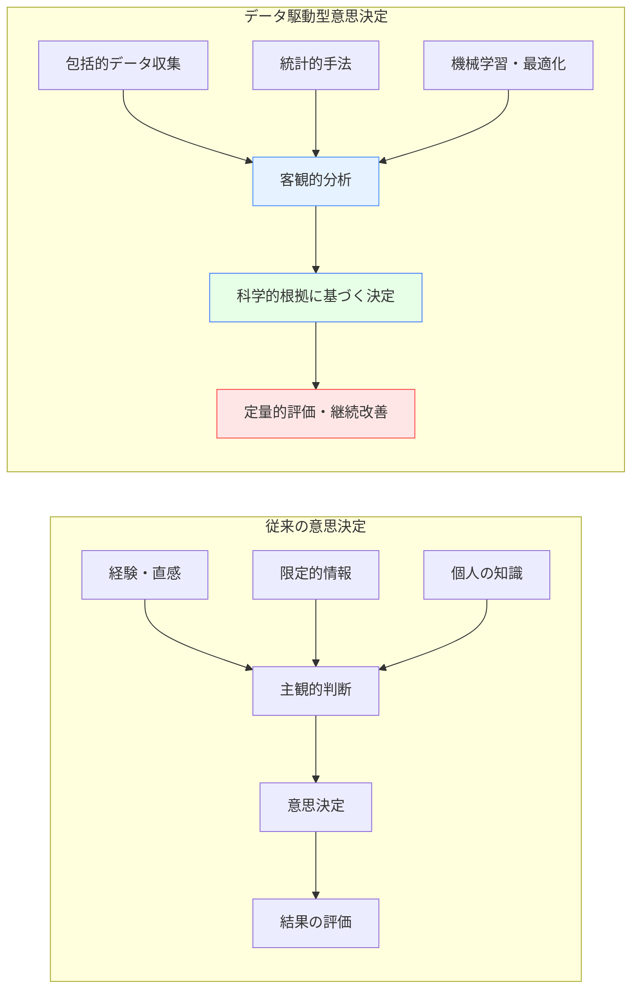
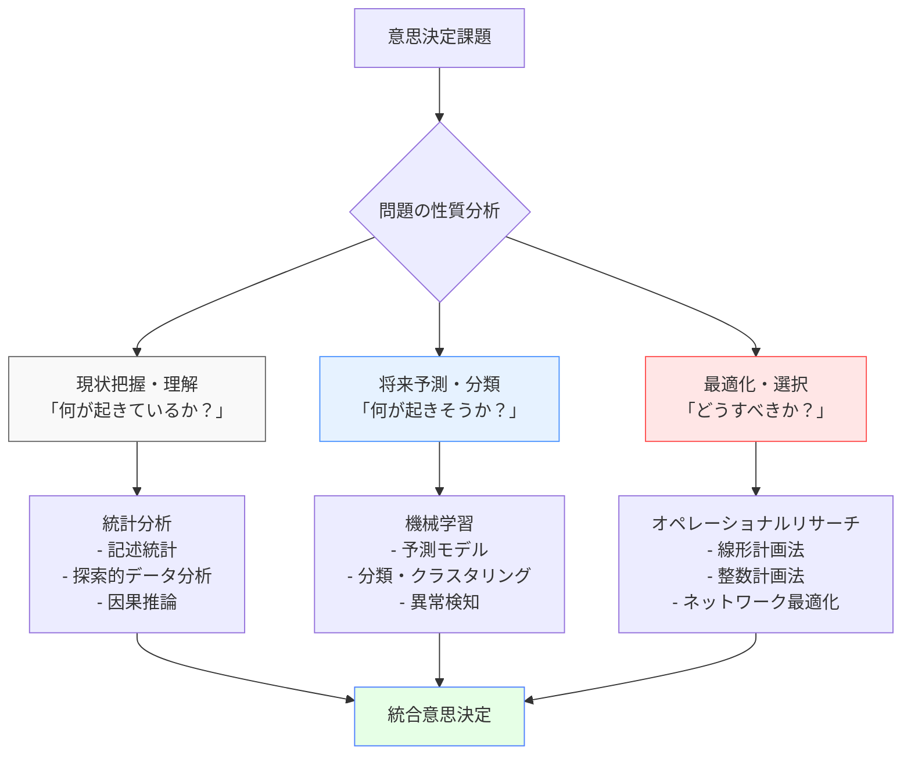
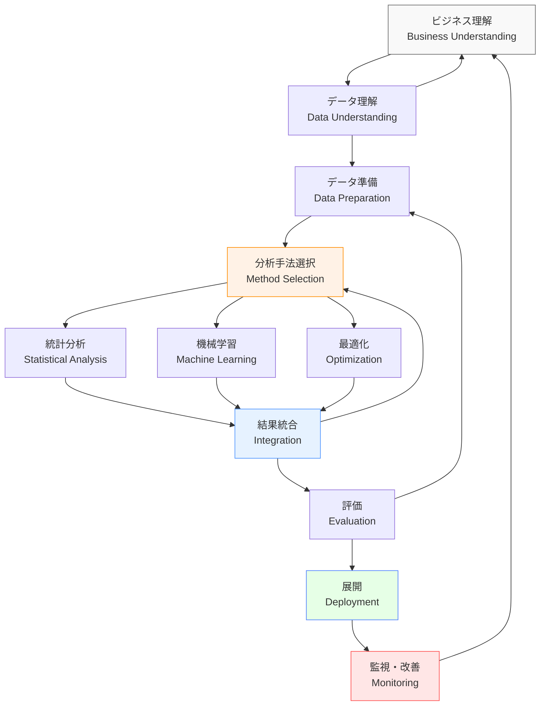
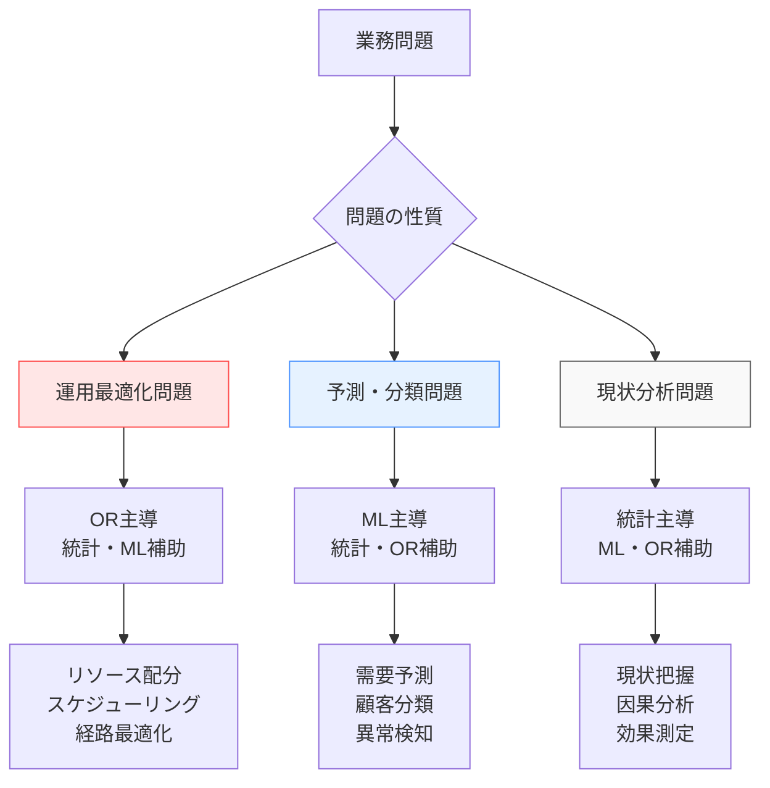
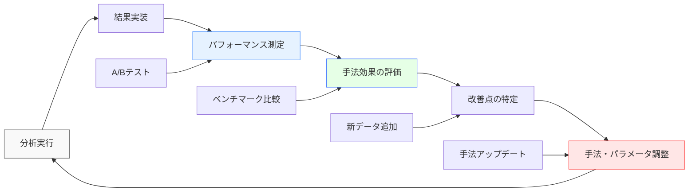

# データ駆動型意思決定

!!! info "このページについて"

    このページでは、データ駆動型意思決定（Data-Driven Decision Making）の理論と実践について詳しく解説します。  
    従来の直感や経験に依存した意思決定から、客観的なデータに基づく科学的な意思決定への転換を支援します。  
    統計分析、機械学習、オペレーショナルリサーチ（OR）など、各種分析手法の適切な使い分けも含めて実践的に解説します。

## データ駆動型意思決定とは

データ駆動型意思決定（DDDM: Data-Driven Decision Making）は、主観的な判断や直感ではなく、客観的なデータの分析結果に基づいて意思決定を行うアプローチです。このアプローチにより、バイアスを減らし、より精度の高い判断を下すことができます。

### 従来の意思決定との比較



| 要素 | 従来の意思決定 | データ駆動型意思決定 |
|---|---|---|
| **情報源** | 経験、直感、限定的データ | 包括的なデータ、統計分析 |
| **プロセス** | 主観的、感情的 | 客観的、論理的 |
| **再現性** | 低い | 高い |
| **バイアス** | 多い | 少ない |
| **評価方法** | 定性的 | 定量的 |
| **改善サイクル** | 長期間 | 短期間・継続的 |

## 意思決定支援における分析手法の役割

データ駆動型意思決定では、問題の性質と意思決定の段階に応じて、適切な分析手法を選択・組み合わせることが重要です。

### 分析手法の分類と役割



| 分析手法 | 主な役割 | 典型的な適用場面 | 提供する価値 |
|---|---|---|---|
| **統計分析** | パターン発見・因果推論 | 現状把握、A/Bテスト、因果関係の検証 | 「何が起きているか」の科学的理解 |
| **機械学習** | 予測・分類・パターン学習 | 需要予測、顧客分類、異常検知 | 「何が起きそうか」の高精度予測 |
| **オペレーショナルリサーチ** | 制約下での最適解導出 | リソース配分、スケジューリング、経路最適化 | 「どうすべきか」の数学的最適解 |

### 手法の使い分け指針

#### 統計分析が適している場面
- データの探索と現状理解
- 施策効果の検証（A/Bテスト）
- 因果関係の特定
- 仮説検定による意思決定

#### 機械学習が適している場面
- 大量データからのパターン発見
- 複雑な予測問題
- 自動分類・クラスタリング
- リアルタイム判定

#### オペレーショナルリサーチが適している場面
- 明確な目的関数と制約条件がある問題
- リソースの最適配分
- スケジューリング・経路問題
- 複数の選択肢からの最適選択

## データ駆動型意思決定のプロセス

### 統合的CRISP-DMプロセス

従来のCRISP-DMを拡張し、最適化段階を組み込んだ統合プロセスです。



## TypeScript実装：統合分析エンジン

### 分析手法統合システム

??? TypeScript実装例

    この実装では、統計分析、機械学習、オペレーショナルリサーチを統合した意思決定支援システムを構築しています。問題の性質を自動判定し、最適な分析手法を選択・組み合わせて、包括的な意思決定支援を提供します。

    ```typescript
    // 統合分析エンジンによる意思決定支援システム
    interface AnalysisRequest {
      problemType: 'descriptive' | 'predictive' | 'prescriptive';
      data: Dataset;
      objective: BusinessObjective;
      constraints?: Constraint[];
      timeframe: TimeConstraint;
      stakeholders: Stakeholder[];
    }

    interface AnalysisResult {
      statisticalInsights: StatisticalInsights;
      predictions?: PredictionResult;
      optimization?: OptimizationResult;
      recommendations: ActionRecommendation[];
      confidence: ConfidenceMetrics;
      methodology: MethodologyReport;
    }

    interface BusinessObjective {
      type: 'maximize' | 'minimize' | 'satisfice';
      target: string;
      success_metrics: string[];
      constraints: OperationalConstraint[];
    }

    class IntegratedDecisionAnalysisEngine {
      private statisticalAnalyzer: StatisticalAnalyzer;
      private machineLearningEngine: MachineLearningEngine;
      private optimizationSolver: OperationsResearchSolver;
      private methodSelector: AnalysisMethodSelector;
      private resultIntegrator: ResultIntegrator;
      
      constructor(config: EngineConfiguration) {
        this.initializeAnalysisEngines(config);
        this.methodSelector = new IntelligentMethodSelector();
        this.resultIntegrator = new MultiMethodResultIntegrator();
      }
      
      private initializeAnalysisEngines(config: EngineConfiguration): void {
        // 統計分析エンジン
        this.statisticalAnalyzer = new ComprehensiveStatisticalAnalyzer({
          methods: [
            'descriptive_statistics', 'hypothesis_testing', 'regression_analysis',
            'correlation_analysis', 'time_series_analysis', 'survival_analysis'
          ],
          significance_level: 0.05,
          correction_methods: ['bonferroni', 'fdr', 'holm']
        });
        
        // 機械学習エンジン
        this.machineLearningEngine = new AdvancedMLEngine({
          algorithms: {
            regression: ['linear', 'polynomial', 'ridge', 'lasso', 'elastic_net', 'random_forest'],
            classification: ['logistic', 'svm', 'random_forest', 'gradient_boosting', 'neural_network'],
            clustering: ['kmeans', 'hierarchical', 'dbscan', 'gaussian_mixture'],
            time_series: ['arima', 'lstm', 'prophet', 'transformer']
          },
          ensemble_methods: ['voting', 'bagging', 'boosting', 'stacking'],
          hyperparameter_tuning: 'bayesian_optimization'
        });
        
        // オペレーショナルリサーチソルバー
        this.optimizationSolver = new OROptimizationSolver({
          solvers: {
            linear_programming: 'simplex',
            integer_programming: 'branch_and_bound',
            nonlinear_programming: 'interior_point',
            network_optimization: 'min_cost_flow',
            dynamic_programming: 'bellman',
            metaheuristics: ['genetic_algorithm', 'simulated_annealing', 'particle_swarm']
          },
          tolerance: 1e-6,
          max_iterations: 10000
        });
      }
      
      // 統合分析の実行
      async performIntegratedAnalysis(
        request: AnalysisRequest
      ): Promise<AnalysisResult> {
        // 1. 問題分析と手法選択
        const methodPlan = await this.methodSelector.selectOptimalMethods(
          request.problemType,
          request.data,
          request.objective
        );
        
        // 2. 段階的分析実行
        const analysisResults = await this.executeAnalysisPipeline(
          request,
          methodPlan
        );
        
        // 3. 結果統合と推奨事項生成
        const integratedResult = await this.resultIntegrator.integrate(
          analysisResults,
          request.objective
        );
        
        return integratedResult;
      }
      
      // 分析パイプラインの実行
      private async executeAnalysisPipeline(
        request: AnalysisRequest,
        methodPlan: AnalysisMethodPlan
      ): Promise<PipelineResult> {
        const results: PipelineResult = {
          statistical: null,
          ml: null,
          optimization: null
        };
        
        // Phase 1: 統計分析（現状理解）
        if (methodPlan.includeStatistical) {
          results.statistical = await this.executeStatisticalAnalysis(
            request.data,
            methodPlan.statisticalMethods
          );
        }
        
        // Phase 2: 機械学習（予測・分類）
        if (methodPlan.includeMachineLearning) {
          results.ml = await this.executeMachineLearningAnalysis(
            request.data,
            methodPlan.mlMethods,
            results.statistical // 統計分析結果を活用
          );
        }
        
        // Phase 3: 最適化（意思決定）
        if (methodPlan.includeOptimization) {
          results.optimization = await this.executeOptimizationAnalysis(
            request,
            results.statistical,
            results.ml
          );
        }
        
        return results;
      }
      
      // 統計分析の実行
      private async executeStatisticalAnalysis(
        data: Dataset,
        methods: StatisticalMethod[]
      ): Promise<StatisticalResults> {
        const results: StatisticalResults = {};
        
        // 記述統計
        if (methods.includes('descriptive')) {
          results.descriptive = await this.statisticalAnalyzer.computeDescriptiveStats(data);
        }
        
        // 相関分析
        if (methods.includes('correlation')) {
          results.correlation = await this.statisticalAnalyzer.analyzeCorrelations(data);
        }
        
        // 回帰分析
        if (methods.includes('regression')) {
          results.regression = await this.statisticalAnalyzer.performRegression(data);
        }
        
        // 仮説検定
        if (methods.includes('hypothesis_testing')) {
          results.hypothesis_tests = await this.statisticalAnalyzer.conductHypothesisTests(data);
        }
        
        // 因果推論
        if (methods.includes('causal_inference')) {
          results.causal_analysis = await this.statisticalAnalyzer.performCausalInference(data);
        }
        
        return results;
      }
      
      // 最適化分析の実行
      private async executeOptimizationAnalysis(
        request: AnalysisRequest,
        statisticalResults: StatisticalResults,
        mlResults: MachineLearningResults
      ): Promise<OptimizationResults> {
        // 最適化問題の定式化
        const optimizationProblem = this.formulateOptimizationProblem(
          request.objective,
          request.constraints,
          statisticalResults,
          mlResults
        );
        
        // 適切なソルバーの選択
        const solver = this.selectOptimalSolver(optimizationProblem);
        
        // 最適化実行
        const solution = await solver.solve(optimizationProblem);
        
        // 感度分析
        const sensitivityAnalysis = await this.performSensitivityAnalysis(
          optimizationProblem,
          solution
        );
        
        // シナリオ分析
        const scenarioAnalysis = await this.performScenarioAnalysis(
          optimizationProblem,
          solution
        );
        
        return {
          optimal_solution: solution,
          sensitivity_analysis: sensitivityAnalysis,
          scenario_analysis: scenarioAnalysis,
          robustness_analysis: await this.assessRobustness(solution)
        };
      }
      
      // 具体的業務問題への適用
      async solveBusiness Problem(
        problemDefinition: BusinessProblemDefinition
      ): Promise<BusinessSolution> {
        switch (problemDefinition.category) {
          case 'resource_allocation':
            return await this.solveResourceAllocation(problemDefinition);
          
          case 'demand_forecasting':
            return await this.solveDemandForecasting(problemDefinition);
          
          case 'price_optimization':
            return await this.solvePriceOptimization(problemDefinition);
          
          case 'supply_chain_optimization':
            return await this.solveSupplyChainOptimization(problemDefinition);
          
          case 'customer_segmentation':
            return await this.solveCustomerSegmentation(problemDefinition);
          
          default:
            return await this.solveGenericProblem(problemDefinition);
        }
      }
      
      // リソース配分問題の解決
      private async solveResourceAllocation(
        problem: ResourceAllocationProblem
      ): Promise<ResourceAllocationSolution> {
        // 1. 統計分析：過去のリソース利用効率分析
        const utilizationAnalysis = await this.statisticalAnalyzer.analyzeResourceUtilization(
          problem.historical_data
        );
        
        // 2. 機械学習：需要予測
        const demandForecast = await this.machineLearningEngine.forecastDemand(
          problem.demand_data,
          problem.forecast_horizon
        );
        
        // 3. 最適化：制約下でのリソース配分最適化
        const allocationProblem = new LinearProgrammingProblem({
          objective: 'maximize_efficiency',
          variables: problem.resources,
          constraints: [
            ...problem.capacity_constraints,
            ...problem.demand_constraints,
            ...this.generateForecastConstraints(demandForecast)
          ]
        });
        
        const optimalAllocation = await this.optimizationSolver.solve(allocationProblem);
        
        return {
          allocation: optimalAllocation.solution,
          expected_efficiency: optimalAllocation.objective_value,
          utilization_insights: utilizationAnalysis,
          demand_forecast: demandForecast,
          sensitivity_analysis: optimalAllocation.sensitivity,
          implementation_plan: this.generateImplementationPlan(optimalAllocation)
        };
      }
      
      // 価格最適化問題の解決
      private async solvePriceOptimization(
        problem: PriceOptimizationProblem
      ): Promise<PriceOptimizationSolution> {
        // 1. 統計分析：価格弾性の推定
        const elasticityAnalysis = await this.statisticalAnalyzer.estimatePriceElasticity(
          problem.sales_data,
          problem.price_data
        );
        
        // 2. 機械学習：需要予測モデル
        const demandModel = await this.machineLearningEngine.buildDemandModel(
          problem.features,
          problem.target_demand
        );
        
        // 3. 最適化：利益最大化価格の決定
        const pricingProblem = new NonlinearProgrammingProblem({
          objective: 'maximize_profit',
          demand_function: demandModel,
          cost_function: problem.cost_function,
          price_bounds: problem.price_bounds,
          elasticity_constraints: elasticityAnalysis.constraints
        });
        
        const optimalPricing = await this.optimizationSolver.solve(pricingProblem);
        
        return {
          optimal_prices: optimalPricing.solution,
          expected_profit: optimalPricing.objective_value,
          elasticity_insights: elasticityAnalysis,
          demand_sensitivity: this.analyzeDemandSensitivity(demandModel),
          competitive_analysis: await this.performCompetitiveAnalysis(optimalPricing),
          implementation_strategy: this.designPricingStrategy(optimalPricing)
        };
      }
      
      // リアルタイム意思決定支援
      createRealTimeDecisionSupport(
        context: DecisionContext
      ): Observable<RealTimeDecisionSupport> {
        return interval(context.refresh_interval).pipe(
          mergeMap(async () => {
            // データ収集
            const currentData = await this.collectRealTimeData(context);
            
            // 迅速分析（軽量版）
            const quickAnalysis = await this.performQuickAnalysis(currentData, context);
            
            // 閾値チェック
            const alerts = this.checkDecisionThresholds(quickAnalysis, context);
            
            // 推奨アクション生成
            const recommendations = await this.generateRealTimeRecommendations(
              quickAnalysis,
              alerts,
              context
            );
            
            return {
              timestamp: new Date(),
              analysis: quickAnalysis,
              alerts: alerts,
              recommendations: recommendations,
              confidence: this.calculateRealTimeConfidence(quickAnalysis)
            };
          }),
          
          // 重要度フィルタリング
          filter(result => result.alerts.length > 0 || result.recommendations.length > 0),
          
          share()
        );
      }
    }

    // 結果インターフェース
    interface PipelineResult {
      statistical: StatisticalResults | null;
      ml: MachineLearningResults | null;
      optimization: OptimizationResults | null;
    }

    interface BusinessSolution {
      solution_type: string;
      primary_recommendations: ActionRecommendation[];
      supporting_analysis: AnalysisEvidence;
      implementation_plan: ImplementationPlan;
      success_metrics: SuccessMetric[];
      risk_assessment: RiskAssessment;
    }
    ```

### 手法選択の自動化

問題の特性に基づいて最適な分析手法を自動選択するシステムです。

??? TypeScript実装例

    ```typescript
    // インテリジェント分析手法選択システム
    class IntelligentMethodSelector {
      private problemClassifier: ProblemClassifier;
      private methodDatabase: AnalysisMethodDatabase;
      private performancePredictor: MethodPerformancePredictor;
      
      constructor() {
        this.problemClassifier = new MLProblemClassifier();
        this.methodDatabase = new ComprehensiveMethodDatabase();
        this.performancePredictor = new EnsemblePerformancePredictor();
      }
      
      // 最適分析手法の選択
      async selectOptimalMethods(
        problemType: ProblemType,
        data: Dataset,
        objective: BusinessObjective
      ): Promise<AnalysisMethodPlan> {
        // 1. 問題特性の分析
        const problemCharacteristics = await this.analyzeProblemCharacteristics(
          problemType, data, objective
        );
        
        // 2. データ特性の分析
        const dataCharacteristics = this.analyzeDataCharacteristics(data);
        
        // 3. 候補手法の生成
        const candidateMethods = this.methodDatabase.getCandidateMethods(
          problemCharacteristics,
          dataCharacteristics
        );
        
        // 4. 手法性能の予測
        const methodPerformances = await Promise.all(
          candidateMethods.map(method => 
            this.performancePredictor.predict(method, problemCharacteristics, dataCharacteristics)
          )
        );
        
        // 5. 最適組み合わせの選択
        const optimalCombination = this.selectOptimalCombination(
          candidateMethods,
          methodPerformances,
          objective
        );
        
        return {
          includeStatistical: optimalCombination.statistical !== null,
          includeMachineLearning: optimalCombination.ml !== null,
          includeOptimization: optimalCombination.optimization !== null,
          statisticalMethods: optimalCombination.statistical?.methods || [],
          mlMethods: optimalCombination.ml?.methods || [],
          optimizationMethods: optimalCombination.optimization?.methods || [],
          expectedPerformance: optimalCombination.expectedPerformance,
          reasoning: optimalCombination.reasoning
        };
      }
      
      // 問題特性の分析
      private async analyzeProblemCharacteristics(
        problemType: ProblemType,
        data: Dataset,
        objective: BusinessObjective
      ): Promise<ProblemCharacteristics> {
        return {
          complexity: this.assessProblemComplexity(problemType, data),
          structure: this.analyzeProblemStructure(objective),
          constraints: this.identifyConstraintTypes(objective.constraints),
          uncertainty: this.assessUncertaintyLevel(data),
          timeframe: this.analyzeTimeConstraints(objective),
          stakeholder_complexity: this.assessStakeholderComplexity(objective)
        };
      }
      
      // データ特性の分析
      private analyzeDataCharacteristics(data: Dataset): DataCharacteristics {
        return {
          size: this.assessDataSize(data),
          dimensionality: this.calculateDimensionality(data),
          quality: this.assessDataQuality(data),
          distribution: this.analyzeDistribution(data),
          temporal_nature: this.analyzeTemporalNature(data),
          missing_patterns: this.analyzeMissingPatterns(data),
          correlation_structure: this.analyzeCorrelationStructure(data)
        };
      }
      
      // 手法組み合わせの評価
      private selectOptimalCombination(
        candidates: CandidateMethod[],
        performances: MethodPerformance[],
        objective: BusinessObjective
      ): OptimalMethodCombination {
        // 多目的最適化による手法選択
        const optimizer = new MultiObjectiveOptimizer({
          objectives: [
            'accuracy',
            'interpretability',
            'computational_efficiency',
            'robustness'
          ],
          weights: this.determineObjectiveWeights(objective)
        });
        
        const combinations = this.generateValidCombinations(candidates);
        const evaluatedCombinations = combinations.map(combination => ({
          combination,
          score: optimizer.evaluate(combination, performances)
        }));
        
        const optimal = evaluatedCombinations.reduce((best, current) => 
          current.score > best.score ? current : best
        );
        
        return {
          ...optimal.combination,
          expectedPerformance: optimal.score,
          reasoning: this.generateSelectionReasoning(optimal.combination, performances)
        };
      }
    }
    ```

## 実践的な適用パターン

### 業務問題別の分析手法選択指針



### 具体的な適用例

#### 1. 製造業での生産計画最適化

**問題設定**: 限られたリソースで最大の利益を上げる生産計画

**分析手法の組み合わせ**:

- **統計分析**: 過去の生産効率・歩留まり分析
- **機械学習**: 需要予測、品質予測
- **OR**: 制約条件下での生産量最適化

```typescript
// 生産計画最適化の例
async function optimizeProductionPlan(data: ProductionData): Promise<ProductionPlan> {
  // 1. 統計分析：生産効率の分析
  const efficiency = await analyzeProductionEfficiency(data.historical);
  
  // 2. 機械学習：需要予測
  const demandForecast = await forecastDemand(data.sales, data.external);
  
  // 3. OR：最適生産計画
  const optimizationProblem = new ProductionOptimizationProblem({
    objective: 'maximize_profit',
    capacity_constraints: data.capacity,
    demand_constraints: demandForecast,
    efficiency_parameters: efficiency
  });
  
  return await solve(optimizationProblem);
}
```

#### 2. 小売業での価格戦略

**問題設定**: 競合と市場動向を考慮した最適価格設定

**分析手法の組み合わせ**:

- **統計分析**: 価格弾性・競合分析
- **機械学習**: 顧客行動予測
- **OR**: 利益最大化価格決定

#### 3. 物流での配送ルート最適化

**問題設定**: 交通状況と配送制約を考慮した効率的ルート

**分析手法の組み合わせ**:

- **統計分析**: 交通パターン・配送時間分析  
- **機械学習**: 交通状況・配送時間予測
- **OR**: 車両ルーティング問題の最適化

## 継続的改善とモニタリング

### 分析結果の評価サイクル



### 各手法の継続的改善

| 手法 | 改善のポイント | 評価指標 | 改善アクション |
|---|---|---|---|
| **統計分析** | 仮説の妥当性、統計的有意性 | p値、効果量、信頼区間 | 新仮説追加、検定手法変更 |
| **機械学習** | 予測精度、汎化性能 | RMSE、MAE、AUC、F1スコア | ハイパーパラメータ調整、特徴量追加 |
| **OR** | 最適解の実現可能性、実装効果 | 目的関数値、制約充足度 | 制約見直し、モデル精緻化 |

## まとめ：統合アプローチの価値

データ駆動型意思決定において、統計分析、機械学習、オペレーショナルリサーチを適切に組み合わせることで、以下の価値を実現できます。

### 統合アプローチの利点

1. **包括的理解**: 現状把握→予測→最適化の全段階をカバー
2. **精度向上**: 各手法の強みを活かした高精度分析
3. **実装可能性**: ORによる実現可能な解の提示
4. **説明可能性**: 統計分析による科学的根拠の提供
5. **継続的改善**: MLによる学習機能の組み込み

### 成功のための重要ポイント

- **問題の性質理解**: 各問題に最適な手法組み合わせの選択
- **データ品質確保**: 全手法の前提となる高品質データの整備
- **段階的アプローチ**: 統計→ML→ORの段階的活用
- **結果の統合**: 各手法の結果を統合した総合判断
- **継続的学習**: 実装結果から次回分析への改善

データ駆動型意思決定は、単一の手法ではなく、問題に応じた最適な手法の組み合わせと継続的な改善により、その真価を発揮します。本章で紹介したフレームワークを活用し、組織の意思決定能力を体系的に向上させることができるでしょう。