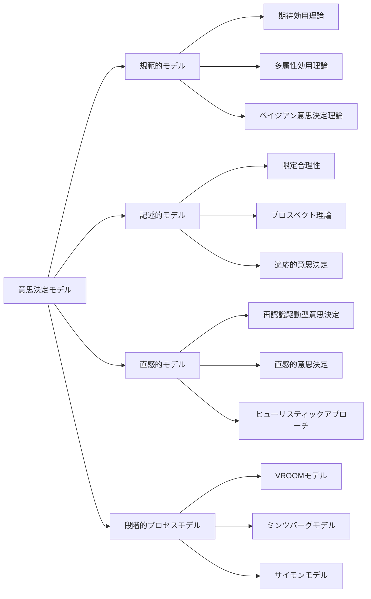
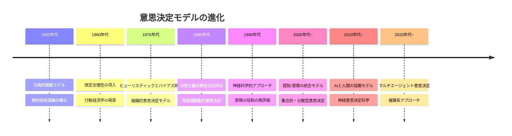

# 意思決定モデル

!!! info "このページについて"

    このページでは、意思決定に関する主要なモデルを体系的に紹介します。  
    理想的な判断を導く「規範的モデル」、現実的な人間行動を説明する「記述的モデル」、経験や直感に基づく「直感的モデル」、そして段階的に構造化された「プロセスモデル」など、多様なアプローチを比較しながら、それぞれの特徴と適用場面を学ぶことができます。

## 意思決定モデルとは

意思決定モデルとは、人間や組織がどのように選択を行うかを説明・予測・指示するための理論的枠組みです。これらのモデルは、実際の意思決定プロセスを理解し改善するための重要な基盤となります。

本ページでは、主要な意思決定モデルを以下のカテゴリーに分類して解説します。

- **規範的モデル**: どのように意思決定すべきかを規定
- **記述的モデル**: 実際にどのように意思決定しているかを説明
- **直感的モデル**: 経験に基づく迅速な判断プロセスを表現
- **段階的プロセスモデル**: 意思決定の進行段階を構造化



## 規範的意思決定モデル

規範的モデルは「理想的な意思決定者はどう判断すべきか」を示す規範的・理想的なアプローチを提供します。論理的一貫性と数学的厳密性に基づき、最適な意思決定方法を規定します。

=== "期待効用理論"

    ### 1. 期待効用理論

    期待効用理論は、不確実性下での意思決定において広く用いられる基本的な規範的モデルです。

    #### 基本概念
    - 各選択肢の結果に確率を掛け合わせた「期待効用」を計算
    - 最も高い期待効用を持つ選択肢を選ぶべき
    - 効用は金銭的価値だけでなく、個人の価値観を反映

    ```
    期待効用 = Σ(結果の効用 × 結果の確率)
    ```

    #### 例: 投資判断

    | 投資選択肢 | 好況時の利益 (30%確率) | 平常時の利益 (50%確率) | 不況時の利益 (20%確率) | 期待効用 |
    |----------|----------------------|---------------------|---------------------|----------|
    | 株式投資   | +1000万円             | +300万円             | -500万円             | +350万円 |
    | 債券投資   | +300万円              | +200万円             | +100万円             | +210万円 |
    | 不動産投資  | +500万円              | +400万円             | -100万円             | +310万円 |

    期待効用理論によれば、最も高い期待効用を持つ株式投資が最適な選択となります。

    #### 長所と限界
    - **長所**: 数学的に厳密、論理的一貫性がある
    - **限界**: 完全な情報と合理性を前提としており、心理的要因を考慮していない

=== "多属性効用理論 (MAUT)"

    ### 2. 多属性効用理論 (MAUT)

    多属性効用理論は、複数の評価基準（属性）を持つ意思決定問題に対処するための拡張されたアプローチです。

    #### 基本概念
    - 各選択肢を複数の属性（基準）で評価
    - 各属性に重みづけを行う
    - 総合評価値に基づいて最適な選択を行う

    ```
    総合評価値 = Σ(属性iの効用 × 属性iの重み)
    ```

    #### 例: 就職先選択

    | 評価基準 | 重み | 企業A (スコア) | 企業B (スコア) | 企業C (スコア) |
    |--------|-----|--------------|--------------|--------------|
    | 給与    | 0.3 | 8 (2.4)      | 9 (2.7)      | 6 (1.8)      |
    | 成長機会 | 0.25 | 9 (2.25)     | 7 (1.75)     | 8 (2.0)      |
    | ワークライフバランス | 0.2 | 6 (1.2) | 5 (1.0) | 9 (1.8) |
    | 職場環境 | 0.15 | 7 (1.05)     | 8 (1.2)      | 8 (1.2)      |
    | 通勤時間 | 0.1 | 5 (0.5)      | 7 (0.7)      | 8 (0.8)      |
    | **総合評価** | 1.0 | **7.4**      | **7.35**     | **7.6**      |

    多属性効用理論によれば、最も高い総合評価を持つ企業Cが最適な選択となります。

    #### 長所と限界
    - **長所**: 複数の評価基準を体系的に統合できる
    - **限界**: 属性間の独立性を仮定、重みづけの主観性

=== "ベイジアン意思決定理論"

    ### 3. ベイジアン意思決定理論

    ベイジアン意思決定理論は、新たな情報が得られた際に確率的信念を更新し、意思決定を改善するアプローチです。

    #### 基本概念
    - 事前確率（初期の信念）から出発
    - 新たな証拠に基づき、ベイズの定理を用いて事後確率を計算
    - 更新された確率に基づいて意思決定を行う

    ```
    P(A|B) = P(B|A) × P(A) / P(B)
    ```

    #### 例: 医療診断

    医師が患者の症状から疾患Dの存在確率を判断する場合

    - 疾患Dの事前確率（一般集団での発生率）: P(D) = 0.01
    - 症状Sが疾患Dの場合に現れる確率: P(S|D) = 0.9
    - 症状Sが疾患Dでない場合に現れる確率: P(S|¬D) = 0.2

    ベイズの定理を用いると
    ```
    P(D|S) = (0.9 × 0.01) / [(0.9 × 0.01) + (0.2 × 0.99)] ≈ 0.043
    ```

    症状Sを観察した後、疾患Dの確率は約4.3%に更新されます。

    #### 長所と限界
    - **長所**: 不確実性の逐次的更新が可能、新情報を体系的に取り入れられる
    - **限界**: 事前確率の設定が主観的、計算が複雑になりうる

## 記述的意思決定モデル

記述的モデルは、人間が実際にどのように意思決定を行うかを現実的に説明することを目的としています。これらのモデルは、認知的制約や心理的要因を考慮に入れています。

=== "限定合理性モデル (Herbert Simon)"

    ### 1. 限定合理性モデル (Herbert Simon)

    ハーバート・サイモンが提唱した限定合理性は、人間の認知的制約を認識し、実際の意思決定プロセスをより現実的に捉えるモデルです。

    #### 基本概念
    - 人間は完全な情報処理能力を持たない
    - 「満足化」: 最適ではなく、満足できる解を探す
    - 探索プロセスの時間と労力の制約を考慮

    ```mermaid
    graph LR
        A[問題認識] --> B[目標設定]
        B --> C[代替案探索]
        C --> D[評価基準設定]
        D --> E[最初の満足できる解を選択]
        E -->|不満足| C
        E -->|満足| F[実行]
        
    
    ```

    #### 例: 住宅選び
    最適な住宅を見つけるために全ての選択肢を評価するのではなく、「予算内」「通勤時間30分以内」「2LDK以上」など最低限の基準を設定し、それを満たす最初の物件を選ぶ。

    #### 長所と限界
    - **長所**: 人間の実際の意思決定をより正確に表現
    - **限界**: 満足化の基準設定が主観的、必ずしも良い結果につながらない

=== "プロスペクト理論 (Kahneman & Tversky)"
    ### 2. プロスペクト理論 (Kahneman & Tversky)

    ダニエル・カーネマンとエイモス・トベルスキーが開発したプロスペクト理論は、リスクと不確実性下での人間の意思決定を説明する心理学的モデルです。

    #### 基本概念
    - **参照点依存性**: 利得・損失は現状からの変化として評価
    - **損失回避**: 同じ金額の利得より損失の方が心理的影響が大きい
    - **確率加重**: 低確率事象を過大評価、高確率事象を過小評価する傾向

    ```mermaid
    graph LR
        subgraph 価値関数
            A[金銭的価値] --> B[主観的価値]
        end
        
        subgraph 特性
            C[損失領域は急峻] --> D[利得よりも損失の影響が大きい]
            E[参照点から離れるほど感度低下] --> F[限界効用逓減]
        end
    ```

    #### 例: フレーミング効果

    以下の2つの表現は同じ状況を表していますが、選択が変わりがちです。

    1. **利得フレーム**: 「このプログラムでは、600人中200人の命が救われる」
    2. **損失フレーム**: 「このプログラムでは、600人中400人が死亡する」

    プロスペクト理論によれば、人々は利得フレームではリスク回避的、損失フレームではリスク選好的になる傾向があります。

    #### 長所と限界
    - **長所**: 実験的に検証された、人間の非合理的選択を説明できる
    - **限界**: 過度に複雑な状況への適用が困難、個人差を十分に考慮していない

=== "適応的意思決定モデル"
    ### 3. 適応的意思決定モデル

    適応的意思決定モデルは、環境の不確実性と変化に対応して戦略を調整する柔軟なアプローチを説明します。

    #### 基本概念
    - 完全な計画より、環境変化への適応を重視
    - フィードバックループを通じた継続的学習
    - 状況に応じた戦略の変更

    ```mermaid
    graph LR
        A[初期計画] --> B[小規模実行]
        B --> C[結果観察]
        C --> D[学習・適応]
        D --> E[計画修正]
        E --> B
        
    
    ```

    #### 例: スタートアップの製品開発
    最初から完全な製品を設計するのではなく、最小限の機能を持つMVP（Minimum Viable Product）をリリースし、ユーザーフィードバックに基づいて継続的に改良していく。

    #### 長所と限界
    - **長所**: 不確実な環境に適合、失敗からの学習を促進
    - **限界**: 短期的な適応が長期的な最適化を阻害する可能性

## 直感的意思決定モデル

直感的モデルは、経験豊富な実務者が実際の状況でどのように迅速な判断を行うかを説明するものです。これらのモデルは特に時間的制約のある状況で重要です。

=== "再認識駆動型意思決定モデル (Klein)"

    ### 1. 再認識駆動型意思決定モデル (Klein)

    ゲイリー・クラインが開発した再認識駆動型意思決定（RPD）モデルは、専門家がどのように直感的に意思決定を行うかを説明します。

    #### 基本概念
    - 過去の経験からのパターン認識に基づく
    - 選択肢の逐次的比較ではなく、状況の認識を重視
    - 最初の実行可能な解決策を採用

    ```mermaid
    graph LR
        A[状況認識] --> B{パターン認識?}
        B -->|はい| C[典型的な行動を想起]
        B -->|いいえ| D[診断的評価]
        D --> A
        C --> E[メンタルシミュレーション]
        E -->|実行可能| F[実行]
        E -->|問題あり| G[修正または代替案]
        G --> E
        
    
    
    ```

    #### 例: 消防士の判断
    経験豊富な消防隊長は、建物内部の火災パターンを瞬時に認識し、「この建物は間もなく崩壊する」と判断して撤退命令を出す。論理的分析ではなく、過去の経験から得たパターン認識に基づく判断。

    #### 長所と限界
    - **長所**: 時間的制約のある状況で効果的、専門家の実際の判断プロセスに合致
    - **限界**: 経験に大きく依存、新奇な状況での限界、バイアスの影響


=== "直感と分析の二重処理モデル"
    ### 2. 直感と分析の二重処理モデル

    「システム1（直感的）」と「システム2（分析的）」の相互作用を説明するモデルです。

    #### 基本概念
    - **システム1**: 速い、自動的、直感的、無意識的
    - **システム2**: 遅い、意識的、分析的、労力を要する
    - 多くの日常的判断はシステム1が主導、システム2は監視・修正役

    ```mermaid
    graph TD
        A[状況] --> B[システム1: 直感的処理]
        A --> C[システム2: 分析的処理]
        B -->|通常の判断| D[行動]
        B -->|異常を検出| C
        C -->|分析・修正| D
        
    
    
    ```

    #### 例: 車の運転
    熟練ドライバーは通常、直感的にブレーキやハンドル操作を行う（システム1）が、異常や危険を感じると意識的な分析モード（システム2）に切り替わる。

    #### 長所と限界
    - **長所**: 認知資源の効率的配分を説明、直感と分析の相補性を捉える
    - **限界**: 両システムの区別が明確でない場合も多い、個人差が大きい


=== "ヒューリスティック意思決定"
    ### 3. ヒューリスティック意思決定

    ヒューリスティック（経験則）は、複雑な問題を簡略化して素早く解決するための精神的ショートカットです。

    #### 主要なヒューリスティック
    - **利用可能性ヒューリスティック**: 思い出しやすい情報に基づいて判断
    - **代表性ヒューリスティック**: ステレオタイプや類似性に基づいて判断
    - **アンカリング効果**: 初期値（アンカー）に影響された判断
    - **感情ヒューリスティック**: 感情的反応に基づく判断

    #### 例: 採用面接での判断
    面接官が最初の印象や特定のエピソードに強く影響され、それに基づいて候補者を評価する。

    #### 長所と限界
    - **長所**: 認知的労力を節約、多くの状況で十分な精度
    - **限界**: 系統的バイアスを生み出す可能性、複雑な問題で誤った判断につながることも

## 段階的プロセスモデル

段階的プロセスモデルは、意思決定を一連の順序だった段階として構造化します。これらのモデルは、意思決定プロセスを計画的に進める際に役立ちます。

=== "サイモンの3段階モデル"
    ### 1. サイモンの3段階モデル

    ハーバート・サイモンが提案した古典的なモデルで、意思決定を3つの主要段階に分けています。

    #### 基本段階
    1. **情報（インテリジェンス）**: 問題の識別と情報収集
    2. **設計**: 可能な選択肢の開発と分析
    3. **選択**: 最適または満足のいく選択肢の選定

    ```mermaid
    graph LR
        A[情報段階] --> B[設計段階]
        B --> C[選択段階]
        C --> D[実行と評価]
        D -.-> A
        
    
    
    
    ```

    #### 長所と限界
    - **長所**: シンプルで理解しやすい、幅広い意思決定問題に適用可能
    - **限界**: 線形的すぎる、フィードバックループが明示的でない

=== "VROOMの規範的意思決定モデル"

    ### 2. VROOMの規範的意思決定モデル

    ビクター・ブルームが開発したこのモデルは、リーダーが状況に応じて最適な意思決定スタイルを選択するのを助けます。

    #### 基本概念
    - 7つの評価質問に基づき意思決定スタイルを選択
    - 権威的、協議的、集団的アプローチの使い分け
    - 決定の質と受容度のバランス重視

    ##### 評価質問
    1. 決定の質の重要性
    2. リーダーの情報・専門性の十分さ
    3. 問題の構造化度
    4. 部下の受容の重要性
    5. リーダーの決定を部下が受け入れる確率
    6. 組織目標との部下の一致度
    7. 部下間の対立の可能性

    ```mermaid
    graph TD
        A[状況分析] --> B{質問1-7の評価}
        B --> C[意思決定スタイル選択]
        C --> D1[AI: 完全に権威的]
        C --> D2[AII: 協議的-個別]
        C --> D3[CI: 協議的-集団]
        C --> D4[GII: 集団的]
        
    
    ```

    #### 長所と限界
    - **長所**: 状況に応じた柔軟なスタイル選択、参加の程度を明示的に考慮
    - **限界**: やや複雑で使いにくい、文化的要因の考慮が不十分

=== "ミンツバーグの意思決定モデル"

    ### 3. ミンツバーグの意思決定モデル

    ヘンリー・ミンツバーグの意思決定モデルは、特に組織的な意思決定プロセスの複雑さと非線形性を強調しています。

    #### 基本概念
    - 意思決定は単純な線形プロセスではない
    - 複数の経路と繰り返しを含む
    - 3つの主要フェーズと7つのルーチン

    ```mermaid
    graph TD
        A[識別フェーズ] --> A1[認識ルーチン]
        A --> A2[診断ルーチン]
        A1 --> A2
        
        A2 --> B[開発フェーズ]
        B --> B1[探索ルーチン]
        B --> B2[設計ルーチン]
        B1 --> B2
        B2 --> B1
        
        B2 --> C[選択フェーズ]
        C --> C1[スクリーニングルーチン]
        C --> C2[評価・選択ルーチン]
        C --> C3[承認ルーチン]
        C1 --> C2
        C2 --> C3
        C2 --> B
        
    
    
    
    ```

    #### 長所と限界
    - **長所**: 実際の組織的意思決定の複雑さを反映、反復的な性質を認識
    - **限界**: 実装が複雑、具体的な指針としては抽象的すぎる場合も

## 意思決定モデルの比較

### 状況に応じたモデル選択

| 状況特性 | 推奨モデル | 理由 |
|--------|----------|-----|
| 明確な目標、定量的データ | 規範的モデル（期待効用、MAUT） | 数学的厳密性による最適化 |
| 複数の評価基準 | 多属性効用理論 | 複数属性の体系的統合 |
| 高い不確実性、学習重視 | ベイジアン意思決定理論 | 確率更新による適応的判断 |
| 時間的制約、経験者の判断 | 再認識駆動型意思決定 | 迅速なパターン認識活用 |
| 認知的制約認識 | 限定合理性 | 満足化による現実的判断 |
| リスク態度の考慮 | プロスペクト理論 | 心理的要因の考慮 |
| リーダーシップ判断 | VROOMモデル | 参加度の適切な調整 |
| 組織的意思決定 | ミンツバーグモデル | プロセスの複雑性認識 |

### 異なる分野での適用

| 分野 | 主に使用されるモデル | 理由 |
|-----|------------------|-----|
| 金融・投資 | 期待効用理論、プロスペクト理論 | リスク・リターンの定量化、心理的バイアスの考慮 |
| 医療 | ベイジアン意思決定、再認識駆動型 | 診断情報の逐次更新、緊急時の迅速判断 |
| 軍事・緊急対応 | 再認識駆動型、VROOM | 時間的制約下の経験活用、明確な指揮系統 |
| 公共政策 | 多属性効用理論、限定合理性 | 多面的評価、政治的制約の認識 |
| 日常的判断 | ヒューリスティック、限定合理性 | 認知的労力の節約、満足化による効率 |

## 意思決定モデルの進化と統合

### 従来モデルから現代モデルへ



### 統合的視点の重要性

現代の意思決定理論では、単一のモデルではなく、状況や目的に応じた複数モデルの統合的活用が重視されています。特に以下の点が重要です。

- **適応的アプローチ**: 状況の複雑さに応じてモデルを選択・組み合わせる
- **認知-感情の統合**: 合理的分析と感情的反応の両方を考慮
- **個人差の認識**: 意思決定スタイルや認知特性の個人差を尊重
- **文脈の重要性**: 文化的・社会的文脈が意思決定に与える影響

## まとめ：効果的な意思決定のために

様々な意思決定モデルの理解は、以下の点で実践的価値があります。

1. **自己認識の向上**: 自分の意思決定プロセスとバイアスへの理解
2. **状況適応能力の強化**: 異なる状況に適したアプローチの選択
3. **コミュニケーションの改善**: 意思決定プロセスの明確な説明と共有
4. **意思決定支援ツールの選択**: 適切なモデルに基づいた支援ツールの活用
5. **継続的学習**: 過去の意思決定からの体系的な学習と改善

効果的な意思決定者は、これらのモデルを理解し、状況に応じて柔軟に適用できる能力を持っています。次のページでは、[認知バイアスと意思決定](../cognitive-biases)について掘り下げていきます。

## 参考文献

1. Simon, H. A. (1997). Administrative Behavior (4th ed.). The Free Press.
2. Kahneman, D., & Tversky, A. (1979). Prospect Theory: An Analysis of Decision under Risk. Econometrica, 47(2), 263-291.
3. Klein, G. (2008). Naturalistic Decision Making. Human Factors, 50(3), 456-460.
4. Vroom, V. H., & Jago, A. G. (1988). The New Leadership: Managing Participation in Organizations. Prentice Hall.
5. Mintzberg, H., Raisinghani, D., & Théorêt, A. (1976). The Structure of "Unstructured" Decision Processes. Administrative Science Quarterly, 21(2), 246-275.
6. Kahneman, D. (2011). Thinking, Fast and Slow. Farrar, Straus and Giroux.
7. 中西晶, 高橋正泰 (2018). 『意思決定論—不確実性に対峙する』 同文館出版.
8. 竹村和久 (2009). 『行動意思決定論—経済行動の心理学』 日本評論社.