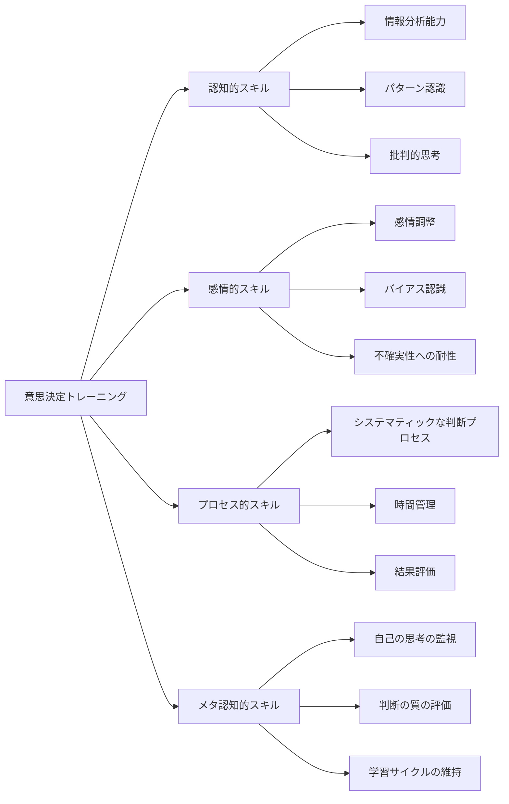
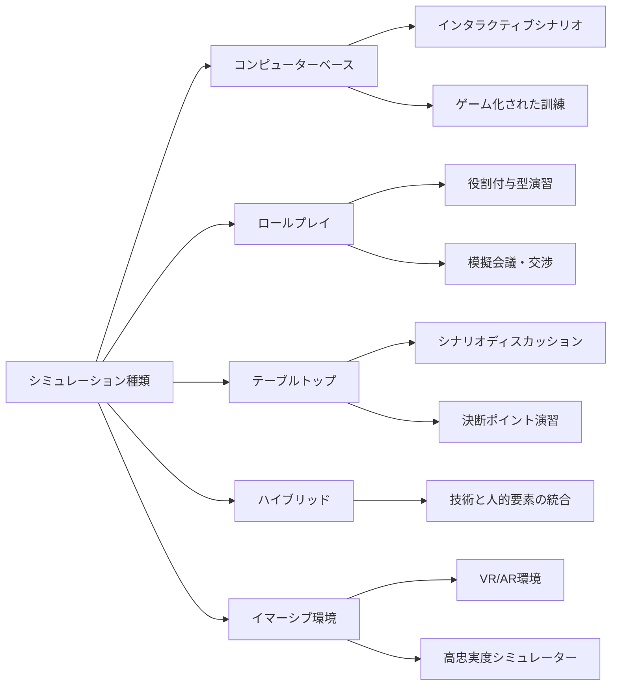
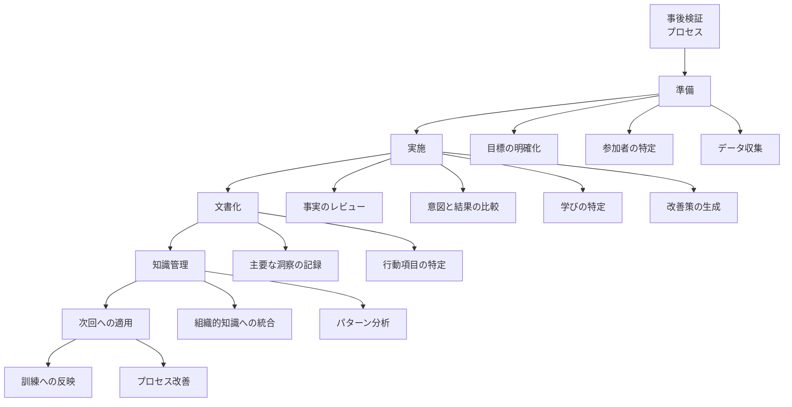
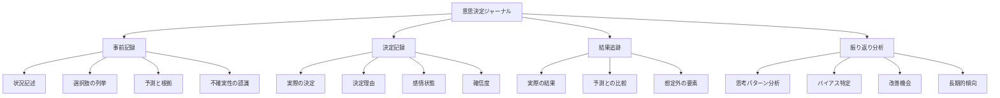
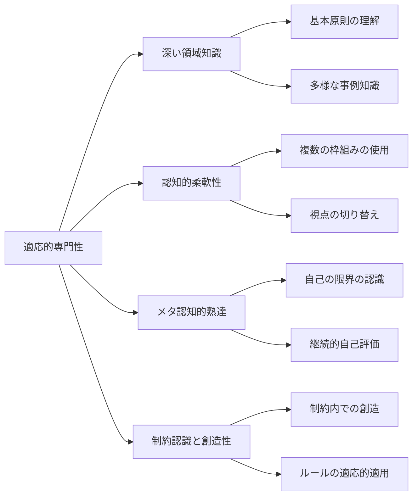
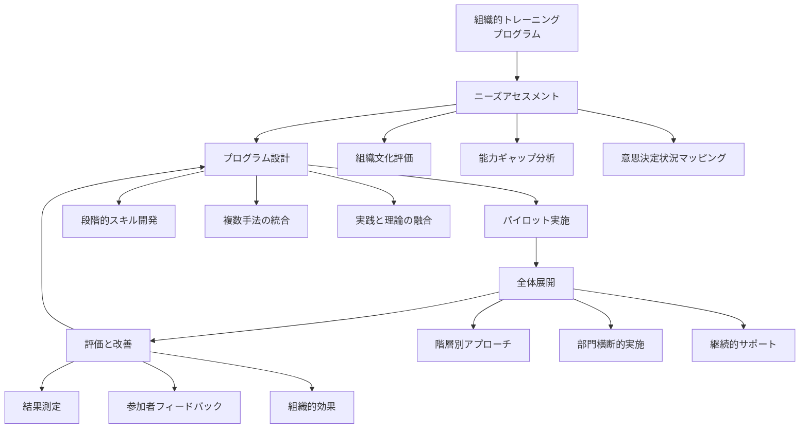
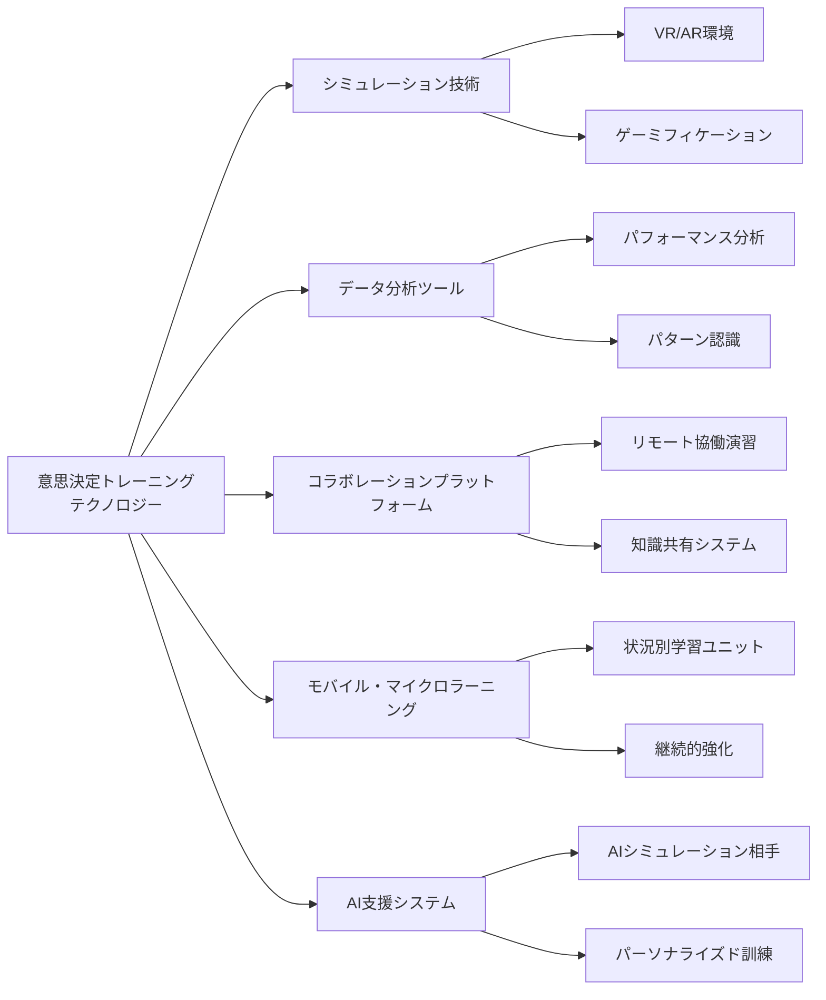
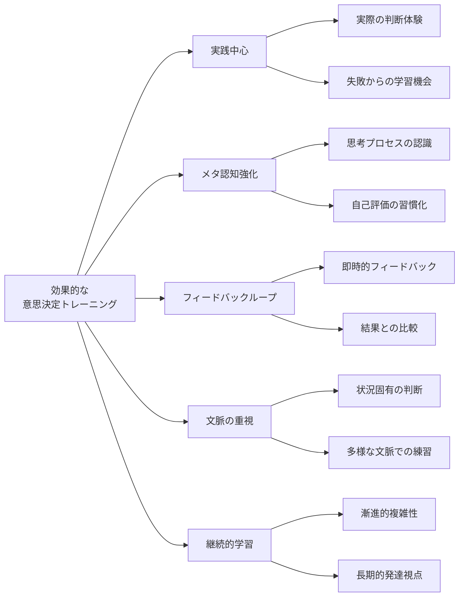

# 意思決定トレーニング

!!! info "このページについて"
    このページでは、意思決定能力を向上させるための体系的なトレーニング手法を解説します。  
    シミュレーションや事後検証（AAR）などの実践的訓練法、意思決定ジャーナルを用いたメタ認知強化、適応的専門性の開発手法など、様々なアプローチを紹介します。
    また、組織的意思決定能力の向上、テクノロジーを活用した新しいトレーニング手法、効果測定の方法についても説明し、意思決定トレーニングを実際に導入するためのフレームワークを提供します。

## 意思決定トレーニングの基本

意思決定トレーニングとは、個人やチームの判断能力を体系的に向上させるための訓練プロセスです。優れた意思決定は生まれつきの才能だけでなく、適切な訓練によって大幅に改善できるスキルです。特に不確実性の高い状況や時間的制約のある場面での判断力を向上させるには、継続的で意図的な訓練が不可欠です。



### トレーニングの対象となる意思決定スキル

意思決定トレーニングは複数の相互関連するスキルを対象としています。

| スキル領域 | 内容 | トレーニング方法 |
|----------|------|----------------|
| **情報処理** | データの収集・分析・統合 | ケース分析、シミュレーション |
| **認知的柔軟性** | 異なる視点の採用、仮説の切り替え | 思考実験、競合仮説分析 |
| **状況判断** | 文脈の理解と適切な判断枠組みの選択 | シナリオ訓練、状況認識テスト |
| **感情管理** | 圧力下での感情の認識と調整 | ストレス下での演習、マインドフルネス |
| **メタ認知** | 自己の思考プロセスの監視と評価 | リフレクティブ・ジャーナル、思考の言語化 |
| **決断力** | 不確実な状況での判断と実行 | タイムプレッシャー演習、判断基準の明確化 |

### トレーニングの基本原則

効果的な意思決定トレーニングは以下の原則に基づきます。

1. **実践中心**: 理論だけでなく実際の判断練習を重視
2. **フィードバックループ**: 迅速で具体的なフィードバックの提供
3. **漸進的複雑性**: 単純から複雑なシナリオへの段階的進行
4. **転移性**: 学習の異なる文脈への応用促進
5. **個別最適化**: 個人の強みと弱みに合わせたカスタマイズ
6. **継続的実践**: 一度きりではなく継続的な能力開発

## シミュレーションと意思決定演習

シミュレーションは意思決定トレーニングの中核をなす手法であり、実際のリスクなしに複雑な状況での判断を練習できる環境を提供します。

### シミュレーションの種類



#### 効果的なシミュレーション設計の原則

| 原則 | 説明 | 実装例 |
|-----|------|-------|
| **現実的な複雑性** | 実際の状況の核心的要素を再現 | 本物のデータ、典型的な制約条件の組込み |
| **時間的要素** | 時間的プレッシャーと変化する状況 | 動的シナリオ、変化するパラメーター |
| **多次元的フィードバック** | 意思決定の様々な側面に関する情報 | プロセス・結果・理由付けの評価 |
| **失敗の安全な空間** | リスクなしに失敗から学べる環境 | 心理的安全性、失敗からの学習促進 |
| **漸進的難易度** | 徐々に複雑さを増す構造 | 基本スキルから高度な判断への段階的進行 |
| **転移性の設計** | 実際の文脈への適用を促進 | 現実に基づくシナリオ、応用討論 |

### 意思決定演習の具体例

=== "クリティカル・インシデント・シミュレーション"

    #### 1. クリティカル・インシデント・シミュレーション

    特に高圧的状況での意思決定トレーニングに効果的な手法です。

    ##### プロセス
    1. **シナリオ設定**: 現実に基づく重大な状況を設定
    2. **情報の段階的提供**: 状況が進展するにつれて情報を追加
    3. **決断ポイント**: 参加者に明示的な判断を求める
    4. **結果のフィードバック**: 決定がもたらす結果をシミュレート
    5. **振り返り**: 判断プロセスと結果の詳細な分析

    ##### 例：航空管制官訓練
    - 複数の航空機が関わる異常気象下での管制シミュレーション
    - システム障害や通信問題などの複雑化要素の追加
    - 優先順位付けと資源配分の判断を要求

=== "競合仮説分析演習"

    #### 2. 競合仮説分析演習

    複数の解釈が可能な曖昧な状況での分析能力を養う手法です。

    ##### プロセス
    1. **情報パッケージの提供**: 曖昧または不完全な情報セット
    2. **仮説生成**: 複数の解釈・仮説の作成
    3. **証拠マトリックス**: 各仮説と証拠の関連付け
    4. **分析と評価**: 最も可能性の高い説明の判断
    5. **実際の解釈との比較**: 思考プロセスの評価

    ##### 例：マーケット分析訓練
    - 新興市場の曖昧な消費者データの解釈
    - 競合企業の行動に関する断片的情報の分析
    - 複数の市場シナリオの評価と優先順位付け

=== "時間制約型意思決定演習"

    #### 3. 時間制約型意思決定演習

    時間的プレッシャー下での判断能力を養うための演習です。

    ##### プロセス
    1. **状況設定**: 明確な判断が必要な状況を提示
    2. **時間制限**: 厳格な時間枠の設定
    3. **情報過負荷**: 関連/非関連情報の混在
    4. **判断実行**: 制限時間内での決定と理由付け
    5. **比較分析**: 異なる時間条件下での判断の比較

    ##### 例：投資判断トレーニング
    - 変動する市場条件下での投資判断
    - 短時間での複数の投資機会の評価
    - 時間経過と共に変化する条件への適応

## 事後検証（After Action Review）

事後検証（AAR）は、行動の後にその経過と結果を体系的に振り返るプロセスであり、意思決定能力の向上に不可欠な手法です。

### 効果的なAARの構造



### AARの核心的質問フレームワーク

| 段階 | 主要な質問 | 目的 |
|-----|----------|------|
| **計画と意図** | 何を達成しようとしていたか？<br>どのような前提があったか？ | 元の意図と文脈の明確化 |
| **実際の出来事** | 実際に何が起きたか？<br>どのような決定がいつ行われたか？ | 事実の客観的な確立 |
| **分析** | なぜそのような結果になったか？<br>どの要因が最も影響したか？ | 因果関係の探究 |
| **代替案** | 他にどのような選択肢があったか？<br>別の決定だとどうなっていたか？ | 思考の幅の拡大 |
| **教訓** | 何を学んだか？<br>次回に活かせる洞察は何か？ | 具体的な学習の抽出 |
| **適用** | この学びをどう活かすか？<br>何を変えるべきか？ | 実践への移行 |

### 異なる文脈でのAAR

#### 1. 即時AARと詳細AAR

| 側面 | 即時AAR | 詳細AAR |
|-----|---------|---------|
| **タイミング** | 行動直後（数分〜数時間以内） | 十分な時間をとって（数日〜数週間） |
| **焦点** | 主要な学習と即時の修正 | 深い分析と長期的改善 |
| **参加者** | 直接関与した少人数 | より広い関係者と専門家 |
| **構造** | 簡略化された質問セット | 包括的なプロセスと多面的分析 |
| **記録** | 簡潔なメモ | 詳細な記録と正式な文書 |
| **適した状況** | 連続した活動、戦術的改善 | 重大な意思決定、戦略的改善 |

#### 2. 失敗からの学習と成功からの学習

| 側面 | 失敗からの学習 | 成功からの学習 |
|-----|--------------|--------------|
| **心理的課題** | 防衛反応、責任回避 | 過信、因果関係の誤帰属 |
| **克服戦略** | 心理的安全性確保<br>システム視点の採用 | 成功の系統的検証<br>偶然と必然の区別 |
| **質問例** | 「どのシステム要因が失敗に寄与したか？」<br>「どのような先行指標を見逃したか？」 | 「なぜ他者が同様の状況で失敗する中成功したか？」<br>「どの要素が必須で、どれが偶然だったか？」 |
| **学習価値** | 障害の特定<br>リスク認識の向上 | ベストプラクティスの確立<br>成功の再現性向上 |

### AAR実施のための組織的条件

効果的なAARには以下の組織的条件が必要です。

- **心理的安全性**: 正直なフィードバックを躊躇なく提供できる環境
- **階層の一時的抑制**: 役職に関わらず自由な発言を促進
- **結果ではなくプロセスへの焦点**: 何が起きたかだけでなく、なぜそうなったかに注目
- **体系的デブリーフィング**: 感情的反応を認識しつつ、構造化された分析へ移行
- **教訓の組織的共有**: 個人の学びを集団的知識へ変換

??? TypeScript実装例

    この TypeScript 実装は、AAR（After Action Review）プロセスのファシリテーションと分析を支援するシステムの設計例です。  
    主な機能は以下の通りです。

    - **セッション準備**  
      過去のデータをもとにタイムラインと重要意思決定点を自動抽出し、ファシリテーションガイドを生成します。

    - **セッション実行**  
      実際の出来事と計画の差異を比較し、構造化ディスカッションを通じて洞察と改善点を抽出します。

    - **組織知識への統合**  
      学びをカテゴリ化し、既存ナレッジベースと統合したうえで、改善提案やトレーニングへの活用を促進します。

    この実装により、AARの実施が属人化せずに構造化・自動化され、継続的な組織学習と改善サイクルをサポートできます。

    ```typescript
    // 事後検証（AAR）ファシリテーションと分析システム
    class AfterActionReviewSystem {
      private sessionData: AARSessionData;
      private participants: Participant[];
      private eventTimeline: TimelineEvent[];
      private decisions: Decision[];
      private contextualFactors: ContextFactor[];
      private learnings: Learning[] = [];
      
      constructor(sessionConfig: AARSessionConfig) {
        this.sessionData = {
          id: generateUniqueId(),
          title: sessionConfig.title,
          date: new Date(),
          objectiveStatement: sessionConfig.objectiveStatement,
          duration: 0,
          status: 'initialized'
        };
        
        this.participants = sessionConfig.participants || [];
        this.eventTimeline = [];
        this.decisions = [];
        this.contextualFactors = [];
      }
      
      // セッション準備フェーズ
      prepareSession(): PreparationSummary {
        // 関連データの収集
        const collectedData = this.collectRelevantData();
        
        // 初期タイムラインの構築
        this.eventTimeline = this.constructInitialTimeline(collectedData);
        
        // 主要な意思決定ポイントの特定
        this.decisions = this.identifyKeyDecisions(this.eventTimeline);
        
        // 文脈的要因の特定
        this.contextualFactors = this.identifyContextualFactors(collectedData);
        
        // ファシリテーションガイドの生成
        const facilitationGuide = this.generateFacilitationGuide();
        
        return {
          timeline: this.eventTimeline,
          decisions: this.decisions,
          contextualFactors: this.contextualFactors,
          facilitationGuide,
          readinessAssessment: this.assessSessionReadiness()
        };
      }
      
      // AARセッションの実施
      conductSession(actualEvents: TimelineEvent[]): SessionResult {
        this.sessionData.status = 'in-progress';
        const startTime = new Date();
        
        // 実際のイベントと計画の比較
        const comparisonResults = this.compareActualToIntended(
          actualEvents, 
          this.eventTimeline
        );
        
        // 構造化された質問を通じたディスカッション
        const discussionResults = this.facilitateStructuredDiscussion(comparisonResults);
        
        // 学びと洞察の抽出
        this.learnings = this.extractLearnings(discussionResults);
        
        // 優先的アクションアイテムの特定
        const actionItems = this.identifyActionItems(this.learnings);
        
        // セッション終了処理
        const endTime = new Date();
        this.sessionData.duration = 
          (endTime.getTime() - startTime.getTime()) / 1000 / 60; // 分単位
        this.sessionData.status = 'completed';
        
        return {
          sessionSummary: this.generateSessionSummary(),
          learnings: this.learnings,
          actionItems,
          participantFeedback: this.collectParticipantFeedback(),
          nextSteps: this.recommendNextSteps()
        };
      }
      
      // 学びの組織的知識への統合
      integrateIntoOrganizationalKnowledge(): KnowledgeIntegrationResult {
        // 学びのカテゴリ化
        const categorizedLearnings = this.categorizeLearnings(this.learnings);
        
        // 既存知識ベースとの関連付け
        const knowledgeConnections = this.connectToExistingKnowledge(categorizedLearnings);
        
        // 訓練プログラムへの統合ポイントの特定
        const trainingIntegrationPoints = this.identifyTrainingIntegrationPoints(
          categorizedLearnings
        );
        
        // プロセス改善提案の生成
        const processImprovementSuggestions = this.generateProcessImprovements(
          this.learnings
        );
        
        return {
          categorizedLearnings,
          knowledgeConnections,
          trainingIntegrationPoints,
          processImprovementSuggestions,
          disseminationPlan: this.createDisseminationPlan()
        };
      }
      
      // ユーティリティメソッド
      private collectRelevantData(): CollectedData { /* 実装 */ }
      private constructInitialTimeline(data: CollectedData): TimelineEvent[] { /* 実装 */ }
      private identifyKeyDecisions(timeline: TimelineEvent[]): Decision[] { /* 実装 */ }
      private identifyContextualFactors(data: CollectedData): ContextFactor[] { /* 実装 */ }
      private generateFacilitationGuide(): FacilitationGuide { /* 実装 */ }
      private assessSessionReadiness(): ReadinessAssessment { /* 実装 */ }
      private compareActualToIntended(
        actual: TimelineEvent[], 
        intended: TimelineEvent[]
      ): ComparisonResult { /* 実装 */ }
      private facilitateStructuredDiscussion(
        comparison: ComparisonResult
      ): DiscussionResult { /* 実装 */ }
      private extractLearnings(discussion: DiscussionResult): Learning[] { /* 実装 */ }
      private identifyActionItems(learnings: Learning[]): ActionItem[] { /* 実装 */ }
      private generateSessionSummary(): SessionSummary { /* 実装 */ }
      private collectParticipantFeedback(): ParticipantFeedback[] { /* 実装 */ }
      private recommendNextSteps(): NextStep[] { /* 実装 */ }
      private categorizeLearnings(learnings: Learning[]): CategorizedLearnings { /* 実装 */ }
      private connectToExistingKnowledge(
        categorized: CategorizedLearnings
      ): KnowledgeConnection[] { /* 実装 */ }
      private identifyTrainingIntegrationPoints(
        categorized: CategorizedLearnings
      ): TrainingIntegrationPoint[] { /* 実装 */ }
      private generateProcessImprovements(
        learnings: Learning[]
      ): ProcessImprovement[] { /* 実装 */ }
      private createDisseminationPlan(): DisseminationPlan { /* 実装 */ }
    }
    ```

## 意思決定ジャーナルとメタ認知強化

メタ認知（自分の思考プロセスについて考える能力）は、意思決定能力の向上において中心的な役割を果たします。意思決定ジャーナルはこのメタ認知能力を体系的に強化するための強力なツールです。

### 意思決定ジャーナルの構造



### 効果的なジャーナリングのためのテンプレート例

=== "事前判断テンプレート"
    #### 事前判断テンプレート

    ```
    日付: [日付]
    決定事項: [判断内容の簡潔な説明]

    1. 状況
      - 現在の状況: [客観的な状況の説明]
      - 制約条件: [時間、リソース、その他の制約]
      - 主要な不確実性: [不明確な要素のリスト]

    2. 選択肢
      - 選択肢A: [説明]
      - 選択肢B: [説明]
      - [...]

    3. 予測
      - 選択肢Aの予測結果: [詳細な予測と確信度(0-100%)]
      - 選択肢Bの予測結果: [詳細な予測と確信度(0-100%)]
      - [...]

    4. 判断プロセス
      - 考慮した主な要因: [要因リスト]
      - 潜在的バイアス: [影響しうるバイアスの認識]
      - 現在の感情状態: [判断時の感情と可能な影響]

    5. 最終判断
      - 選択する行動: [具体的な選択]
      - 理由: [選択の根拠]
      - 総合的確信度: [0-100%]
      - 結果確認時期: [いつ結果を評価するか]
    ```

=== "結果評価テンプレート"

    #### 結果評価テンプレート

    ```
    事前判断日: [元の判断日]
    評価日: [現在の日付]
    決定事項: [元の判断内容]

    1. 実際の結果
      - 何が起きたか: [客観的な結果の説明]
      - 予測との乖離: [予測と実際の差異]
      - 想定外の要素: [予見できなかった要因]

    2. 分析
      - 判断の質: [プロセスの質に関する評価]
      - 有効だった思考: [役立ったアプローチ]
      - 改善すべき点: [次回に変えるべきこと]
      - 識別されたバイアス: [影響したバイアス]

    3. 学び
      - 主要な教訓: [この経験から得た洞察]
      - 今後の応用: [類似状況での適用方法]
      - フォローアップ項目: [さらに探求すべき疑問]
    ```

### メタ認知強化のためのテクニック

| テクニック | 説明 | 実践方法 |
|----------|------|---------|
| **思考の言語化** | 意思決定プロセスを声に出す | 判断中に思考を録音、チームでの思考共有 |
| **確信度校正** | 予測の確信度と実際の正確さの対応改善 | 確率的予測の訓練、フィードバックループ |
| **対抗シナリオ作成** | 現在の考えと反対の可能性を想像 | 「なぜ私は間違っているか」の探索 |
| **認知バイアス日記** | 自分のバイアスパターンの追跡 | 定期的なバイアス自己評価、傾向の記録 |
| **決定マトリックス** | 判断基準と選択肢の明示的評価 | 重み付け基準による構造化比較 |
| **プレモータム分析** | 決定が失敗したと想像し理由を探る | 「この決定が失敗したら、なぜ失敗したか」の分析 |

### 長期的な傾向分析

意思決定ジャーナルを長期間続けることで、以下のような傾向分析が可能になります。

- **判断パターン**: 特定の状況での一貫した反応や選好
- **過信/過小評価**: 確信度と実際の正確さの乖離
- **バイアスの傾向**: 繰り返し現れる認知的歪み
- **環境的影響**: 特定の状況や条件が判断に与える影響
- **改善軌跡**: トレーニングによる判断精度の向上

## 適応的専門性の開発

適応的専門性とは、構造化された専門知識と柔軟な適応能力の両方を備えた専門性のあり方です。特に変化が激しく不確実性の高い環境での意思決定能力の向上に不可欠な概念です。

### 適応的専門性の要素



### 固定的専門性と適応的専門性の比較

| 側面 | 固定的専門性 | 適応的専門性 |
|-----|------------|------------|
| **知識構造** | 標準的手順の暗記<br>単一の確立されたフレームワーク | 原則の深い理解<br>複数のフレームワークの統合 |
| **問題への姿勢** | 既存カテゴリへの当てはめ<br>定型的解決策の適用 | 状況の独自性の認識<br>カスタマイズされたアプローチ |
| **不確実性対応** | 確実性の追求<br>曖昧さの排除 | 不確実性の受容<br>複数の可能性の検討 |
| **学習アプローチ** | 確立された知識の習得<br>効率性の重視 | 継続的な探求<br>境界領域への挑戦 |
| **失敗への態度** | 失敗の回避<br>標準からの逸脱の最小化 | 失敗からの学習<br>実験的アプローチ |

### 適応的専門性開発のためのアプローチ

=== "1. 多様な文脈での経験"
    #### 1. 多様な文脈での経験

    単一の環境だけでなく、多様な状況での意思決定経験を積むことが重要です。

    - **ジョブローテーション**: 異なる役割や部門での経験
    - **クロスファンクショナルプロジェクト**: 多様な専門領域との協働
    - **多様な事例研究**: 様々な状況での意思決定の分析
    - **境界領域の探索**: 専門領域の周辺分野への関与

=== "2. 原則ベースの学習"
    #### 2. 原則ベースの学習

    具体的手順だけでなく、根底にある原則や理論の理解を深めるアプローチです。

    - **理論と実践の往復**: 抽象的原則と具体的適用の行き来
    - **例外事例の分析**: 標準的なルールが適用できない場合の検討
    - **逆向きアプローチ**: 結果から原則を導き出す練習
    - **マルチモデル思考**: 同じ問題に複数の理論的枠組みを適用

=== "3. 反省的実践"
    #### 3. 反省的実践

    自分の思考と実践を常に批判的に検討するプロセスです。

    - **実践コミュニティへの参加**: 専門家同士での対話と批評
    - **継続的な自己評価**: 定期的な能力と知識の棚卸し
    - **パフォーマンスフィードバック**: 多様な情報源からの評価
    - **変革的学習**: 前提や枠組み自体の再検討

=== "4. 創造的制約の活用"
    #### 4. 創造的制約の活用

    制約を創造性の源として活用するアプローチです。

    - **リソース制約下での演習**: 限られた情報や時間での判断訓練
    - **逆転思考**: 通常と逆の前提からの発想
    - **強制的関連付け**: 異分野の概念を適用する練習
    - **ルール修正実験**: 既存ルールの一部変更による効果の検証

## 組織的意思決定トレーニング

個人の意思決定能力向上だけでなく、組織全体の意思決定能力を向上させる体系的なアプローチも重要です。

### 組織的トレーニングプログラムの設計



### 階層別のトレーニングアプローチ

組織の異なるレベルでは、異なる意思決定スキルが求められます。

| 組織レベル | 重点スキル | トレーニング手法 |
|----------|----------|----------------|
| **経営層・上級管理職** | 戦略的思考<br>不確実性への対応<br>複雑系理解 | シナリオプランニング<br>戦略シミュレーション<br>複雑性ワークショップ |
| **中間管理職** | 問題構造化<br>リソース配分<br>集団意思決定促進 | 決定分析演習<br>リソース競合演習<br>ファシリテーション訓練 |
| **現場スーパーバイザー** | 時間制約下の判断<br>優先順位付け<br>例外処理 | ケーススタディ<br>タイムプレッシャー演習<br>異常事態シミュレーション |
| **スタッフ・個人貢献者** | 情報収集と分析<br>基本的判断スキル<br>適切な上申 | 分析スキルワークショップ<br>意思決定基礎訓練<br>コミュニケーション演習 |

### 組織文化との統合

トレーニングプログラムは組織文化と整合し、それを強化するべきです。

| 文化的側面 | トレーニングへの統合方法 | 効果 |
|----------|------------------------|------|
| **意思決定の透明性** | 判断プロセスの明示的記録<br>オープンなAARセッション | 説明責任の向上<br>信頼構築 |
| **実験と学習の奨励** | 安全な失敗の空間の創出<br>革新的アプローチの評価 | 創造性の促進<br>適応力の強化 |
| **データ駆動の判断** | エビデンスベースの意思決定訓練<br>データ解釈スキル開発 | 客観性の向上<br>一貫性の改善 |
| **心理的安全性** | 建設的フィードバック技術<br>多様な視点の尊重 | 率直な議論<br>集合知の活用 |
| **長期的視点** | 長期的シナリオ演習<br>持続可能性考慮の統合 | 戦略的思考<br>短期主義の軽減 |

### トレーニング効果の測定

組織的トレーニングの効果を体系的に測定することが重要です。

#### 評価のレベル

1. **反応**: 参加者の満足度と関与度
2. **学習**: 知識・スキル・態度の変化
3. **行動**: 実際の意思決定行動の変化
4. **結果**: 組織のパフォーマンスへの影響
5. **ROI**: 投資対効果の評価

#### 測定手法の例

- **意思決定の質のチェックリスト**: 主要判断の体系的評価
- **ベンチマークシナリオ**: トレーニング前後での同一シナリオパフォーマンス
- **自己評価と360度フィードバック**: 多面的な能力評価
- **意思決定の帰結追跡**: 実際の結果に基づく評価
- **組織KPIとの連携**: 重要業績指標への影響分析

## テクノロジーを活用したトレーニング手法

最新のテクノロジーは、意思決定トレーニングに新たな可能性をもたらしています。

### デジタルトレーニングプラットフォーム



### 主要なテクノロジー活用領域

#### 1. 仮想・拡張現実（VR/AR）を用いたシミュレーション

没入型環境による高度なシミュレーション体験を提供します。

| アプリケーション | 特徴 | 利点 |
|----------------|------|------|
| **危機対応VR訓練** | 緊急事態の没入型体験<br>ストレス要因の再現 | 実体験に近い訓練<br>安全な環境での極限状況経験 |
| **多視点AR意思決定** | 異なる役割の視点体験<br>リアルタイム情報オーバーレイ | 視点転換能力の向上<br>文脈情報の強化 |
| **バーチャルチームエクササイズ** | 地理的に分散したチームの協働<br>共有仮想空間での意思決定 | グローバルチームのトレーニング<br>文化的要素の統合 |

#### 2. AI支援型トレーニングシステム

AIを活用したパーソナライズドトレーニングにより効率と効果を高めます。

| アプリケーション | 特徴 | 利点 |
|----------------|------|------|
| **適応型学習システム** | 学習進度に応じた難易度調整<br>個人の弱点に焦点 | 効率的な能力開発<br>個別最適化 |
| **AIシミュレーション相手** | 様々な対応を模擬するAIエージェント<br>多様なシナリオ生成 | 無限の練習機会<br>予測不可能な状況への対応 |
| **意思決定パターン分析** | 判断プロセスの自動分析<br>バイアスの検出 | 盲点の発見<br>客観的フィードバック |
| **リアルタイムコーチング** | 意思決定中のプロンプト<br>即時フィードバック | 習慣形成の加速<br>実践的指導 |

??? TypeScript実装例
    この TypeScript 実装は、AIを活用して個別最適化された意思決定トレーニングを提供するシステムの構成を示しています。

    主な機能は以下の通りです。
    
    - **ユーザープロファイル管理**  
      利用者の特性や履歴に応じた学習計画をパーソナライズ

    - **トレーニングセッションの自動生成と実行**  
      スキル分析と過去のパフォーマンスに基づき、最適なモジュールとシナリオを自動で選定・提供

    - **AIコーチによるフィードバックと学習支援**  
      セッション結果を解析し、リアルタイムに指導・次の学習提案を提示

    - **意思決定支援機能**  
      実環境においてもリアルタイムで思考プロンプトやバイアス警告を提示し、判断力を補完

    このシステムは、AIと人間の協働による継続的かつ効果的な意思決定能力開発のモデルを体現しています。

    ```typescript
    // AI支援型意思決定トレーニングシステム
    class AIAssistedDecisionTrainingSystem {
      private userProfile: UserProfile;
      private trainingModules: TrainingModule[];
      private performanceHistory: PerformanceRecord[];
      private aiCoach: AICoachingEngine;
      private scenarioGenerator: ScenarioGenerator;
      
      constructor(userId: string) {
        // ユーザープロファイルの読み込みまたは作成
        this.userProfile = this.loadOrCreateUserProfile(userId);
        
        // トレーニングモジュールの初期化
        this.trainingModules = this.initializeTrainingModules();
        
        // パフォーマンス履歴の初期化
        this.performanceHistory = this.loadPerformanceHistory(userId);
        
        // AIコーチングエンジンの初期化
        this.aiCoach = new AICoachingEngine(this.userProfile);
        
        // シナリオジェネレーターの初期化
        this.scenarioGenerator = new ScenarioGenerator();
      }
      
      // 個別化されたトレーニングセッションの実施
      conductPersonalizedTrainingSession(): TrainingSessionResult {
        // ユーザーの現在のスキルレベルと傾向の分析
        const skillsAnalysis = this.analyzeCurrentSkillsAndTrends();
        
        // 最適なトレーニングモジュールの選択
        const selectedModule = this.selectOptimalModule(skillsAnalysis);
        
        // ユーザーに合わせたシナリオの生成
        const scenario = this.scenarioGenerator.generateTailoredScenario({
          difficulty: this.calculateOptimalDifficulty(),
          focusAreas: skillsAnalysis.priorityAreas,
          contextPreferences: this.userProfile.contextPreferences,
          previousScenarios: this.getRecentScenarios(5)
        });
        
        // トレーニングセッションの実行
        const sessionData = this.executeTrainingSession(selectedModule, scenario);
        
        // パフォーマンスの分析
        const performanceAnalysis = this.analyzePerformance(sessionData);
        
        // AIコーチからのフィードバックと推奨事項
        const coachingFeedback = this.aiCoach.generateFeedback({
          sessionData,
          performanceAnalysis,
          userHistory: this.performanceHistory
        });
        
        // 次のステップと継続学習の推奨
        const nextStepsRecommendation = this.generateNextStepsRecommendation(
          performanceAnalysis
        );
        
        // パフォーマンス履歴の更新
        this.updatePerformanceHistory(performanceAnalysis);
        
        // ユーザープロファイルの更新
        this.updateUserProfile(performanceAnalysis);
        
        return {
          sessionSummary: this.createSessionSummary(sessionData),
          performanceMetrics: performanceAnalysis.metrics,
          strengthsAndWeaknesses: performanceAnalysis.strengthsAndWeaknesses,
          coachingFeedback,
          nextStepsRecommendation,
          learningProgress: this.calculateLearningProgress()
        };
      }
      
      // 実践環境での意思決定サポート
      provideRealTimeDecisionSupport(context: DecisionContext): SupportResult {
        // 状況の分析
        const situationAnalysis = this.analyzeSituation(context);
        
        // 関連するパターンと過去の経験の特定
        const relevantPatterns = this.identifyRelevantPatterns(
          situationAnalysis, this.performanceHistory
        );
        
        // 潜在的なバイアスの警告
        const biasWarnings = this.detectPotentialBiases(
          context, this.userProfile.biasPatterns
        );
        
        // 構造化思考のプロンプト
        const thinkingPrompts = this.generateStructuredThinkingPrompts(
          situationAnalysis
        );
        
        // 意思決定プロセスの記録
        const decisionRecord = this.recordDecisionProcess(context);
        
        return {
          situationInsights: situationAnalysis.keyInsights,
          relevantPatterns,
          biasWarnings,
          thinkingPrompts,
          decisionRecord
        };
      }
      
      // ユーティリティメソッド
      private loadOrCreateUserProfile(userId: string): UserProfile { /* 実装 */ }
      private initializeTrainingModules(): TrainingModule[] { /* 実装 */ }
      private loadPerformanceHistory(userId: string): PerformanceRecord[] { /* 実装 */ }
      private analyzeCurrentSkillsAndTrends(): SkillsAnalysis { /* 実装 */ }
      private selectOptimalModule(analysis: SkillsAnalysis): TrainingModule { /* 実装 */ }
      private calculateOptimalDifficulty(): DifficultyLevel { /* 実装 */ }
      private getRecentScenarios(count: number): Scenario[] { /* 実装 */ }
      private executeTrainingSession(
        module: TrainingModule, 
        scenario: Scenario
      ): SessionData { /* 実装 */ }
      private analyzePerformance(sessionData: SessionData): PerformanceAnalysis { /* 実装 */ }
      private generateNextStepsRecommendation(
        analysis: PerformanceAnalysis
      ): NextStepsRecommendation { /* 実装 */ }
      private updatePerformanceHistory(analysis: PerformanceAnalysis): void { /* 実装 */ }
      private updateUserProfile(analysis: PerformanceAnalysis): void { /* 実装 */ }
      private createSessionSummary(sessionData: SessionData): SessionSummary { /* 実装 */ }
      private calculateLearningProgress(): LearningProgress { /* 実装 */ }
      private analyzeSituation(context: DecisionContext): SituationAnalysis { /* 実装 */ }
      private identifyRelevantPatterns(
        analysis: SituationAnalysis, 
        history: PerformanceRecord[]
      ): Pattern[] { /* 実装 */ }
      private detectPotentialBiases(
        context: DecisionContext, 
        knownPatterns: BiasPattern[]
      ): BiasWarning[] { /* 実装 */ }
      private generateStructuredThinkingPrompts(
        analysis: SituationAnalysis
      ): ThinkingPrompt[] { /* 実装 */ }
      private recordDecisionProcess(context: DecisionContext): DecisionRecord { /* 実装 */ }
    }
    ```

#### 3. モバイル・マイクロラーニング

短時間かつ頻繁なトレーニングを通じて継続的な能力開発を促進します。

| アプリケーション | 特徴 | 利点 |
|----------------|------|------|
| **状況別マイクロレッスン** | 短時間の集中的演習<br>実際の状況に関連した内容 | 日常に統合された学習<br>直接的な応用性 |
| **スペースド・リピティション** | 最適なタイミングでの復習<br>忘却曲線に基づいた間隔 | 長期記憶への定着<br>効率的な学習 |
| **リフレクションプロンプト** | 意思決定後の振り返り促進<br>構造化された質問 | 継続的な内省習慣<br>メタ認知の強化 |
| **ピアラーニングネットワーク** | 同僚との学びの共有<br>集合的知識の活用 | 社会的学習の促進<br>多様な視点の獲得 |

## ケーススタディ：意思決定トレーニングの実践

=== "高信頼性組織の意思決定トレーニング"
    ### ケース1: 航空会社の乗務員意思決定トレーニング

    #### 状況
    国際的な航空会社が、パイロットとキャビンクルーのための統合的意思決定トレーニングプログラムを開発することになりました。特に通常操作を逸脱した状況での判断能力向上が目的でした。

    #### 課題
    - 時間的プレッシャー下での意思決定
    - クルー間の効果的な協働意思決定
    - 標準手順と適応的判断のバランス
    - 多様な異常状況への対応

    #### アプローチ
    航空会社は複合的なトレーニングプログラムを実施しました。

    1. **シミュレーションベース訓練**:
        - 高忠実度フライトシミュレーターでの異常事態対応
        - 段階的な複雑性と時間的プレッシャーの導入
        - クルー・リソース・マネジメント（CRM）の統合

    2. **構造化意思決定プロセス**:
        - FORDEC（事実・選択肢・リスク・決定・実行・チェック）フレームワークの訓練
        - 不確実な状況での判断のための構造化手法
        - 状況認識と意思決定の統合モデル

    3. **事後検証プラクティス**:
        - すべてのシミュレーションセッション後の詳細AARの実施
        - 実際のインシデントの組織的分析と共有
        - 「ノンジャッジメンタル」報告システムによる経験の蓄積

    4. **継続的能力開発**:
        - 定期的なリフレッシャートレーニング
        - オンラインマイクロラーニングモジュール
        - チーム内での知識共有セッション

    #### 結果
    このプログラムにより、乗務員の異常状況への対応能力が大幅に向上しました。特に、標準手順が完全には適用できない状況での適応的判断力が改善し、クルー間のコミュニケーションとチーム意思決定の質が向上しました。また、インシデント報告の質と量が増加し、組織全体の学習サイクルが強化されました。


=== "ビジネスリーダー向け戦略的意思決定トレーニング"
    ### ケース2: テクノロジー企業の経営層意思決定能力開発

    #### 状況
    急成長中のテクノロジー企業が、上級管理職および将来のリーダー候補向けに、不確実性の高い環境での戦略的意思決定能力を開発するプログラムを立ち上げました。

    #### 課題
    - 長期的な影響を持つ決定の質の向上
    - 複雑なデータと不完全情報からの洞察抽出
    - バイアスの認識と軽減
    - 異なる視点の効果的な統合

    #### アプローチ
    企業は12ヶ月の統合プログラムを展開しました。

    1. **認知バイアス認識と対策**:
        - 自己評価と個人的バイアスプロファイルの作成
        - 判断シナリオでのバイアス検出トレーニング
        - 構造化された意思決定ツールの使用訓練

    2. **意思決定ジャーナルの実践**:
        - 個人の重要決定の体系的記録
        - メンターによる定期的レビューと指導
        - グループでのジャーナル共有セッション

    3. **シナリオプランニングワークショップ**:
        - 業界の将来に関する複数シナリオの開発
        - 不確実性要因のマッピング演習
        - 頑健な戦略の策定実習

    4. **戦略的ゲーミフィケーション**:
        - 競合環境のシミュレーションゲーム
        - 複数の市場条件下での意思決定
        - チーム間の戦略的相互作用

    #### 結果
    プログラムの結果、参加者は複雑な戦略的決定に対するより体系的なアプローチを採用するようになりました。特に、長期的影響の考慮、データと直感のバランス、異なる視点の積極的な探索において顕著な改善が見られました。また、経営チーム内の協働的意思決定の質が向上し、主要な戦略的決定に関するより構造化された議論が行われるようになりました。

## まとめ：効果的な意思決定トレーニングの原則

意思決定トレーニングは継続的な能力開発プロセスであり、以下の原則を中心に組み立てるべきです。

### 主要な洞察



### 実践的フレームワーク

1. **意思決定能力の診断**: 現在のスキルと改善領域の評価
2. **個別化トレーニング計画**: 特定の強みと弱みへの対応
3. **多面的アプローチ**: 複数の手法を組み合わせた総合的トレーニング
4. **漸進的難易度**: 簡単な判断から複雑な状況への段階的移行
5. **組織文化との統合**: 日常的実践に組み込まれたトレーニング
6. **継続的測定と適応**: トレーニング効果の評価と継続的改善

### 未来への展望

意思決定トレーニングの分野は、認知科学の発展とテクノロジーの進化により急速に変化しています。今後は、より個別化されたアプローチ、神経科学的知見の統合、AIとの協働的意思決定トレーニングがさらに発展していくでしょう。重要なのは、技術的側面だけでなく、人間の判断の本質的な強みを活かし、テクノロジーと人間の能力を効果的に組み合わせる新しいアプローチの開発です。

意思決定能力の向上は終わりなき旅であり、意図的で体系的なトレーニングを通じて、個人も組織も大幅に判断の質を改善することができます。不確実性と複雑性が増す世界において、優れた意思決定能力は最も重要な競争優位性の一つとなるでしょう。

## 参考文献

1. Klein, G. (2007). The Power of Intuition: How to Use Your Gut Feelings to Make Better Decisions at Work. Currency.
2. Kahneman, D. (2011). Thinking, Fast and Slow. Farrar, Straus and Giroux.
3. Ericsson, K. A., & Pool, R. (2016). Peak: Secrets from the New Science of Expertise. Eamon Dolan/Houghton Mifflin Harcourt.
4. Dweck, C. S. (2006). Mindset: The New Psychology of Success. Random House.
5. Schön, D. A. (1983). The Reflective Practitioner: How Professionals Think in Action. Basic Books.
6. Hoffman, R. R., Ward, P., DiBello, L., Feltovich, P. J., Fiore, S. M., & Andrews, D. (2014). Accelerated Expertise: Training for High Proficiency in a Complex World. Psychology Press.
7. Bransford, J. D., Brown, A. L., & Cocking, R. R. (Eds.). (2000). How People Learn: Brain, Mind, Experience, and School. National Academy Press.
8. Salas, E., Tannenbaum, S. I., Kraiger, K., & Smith-Jentsch, K. A. (2012). The Science of Training and Development in Organizations: What Matters in Practice. Psychological Science in the Public Interest, 13(2), 74-101.
9. 中原淳・石山恒貴 (2019). 『組織開発の探究: 理論に学び、実践に活かす』. ダイヤモンド社.
10. 松尾谷徹・楠見孝 (2015). 『意思決定の認知科学: 不確実な状況下での情報処理』. 朝倉書店.