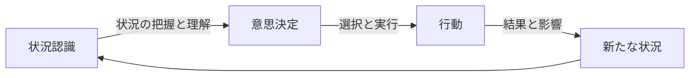
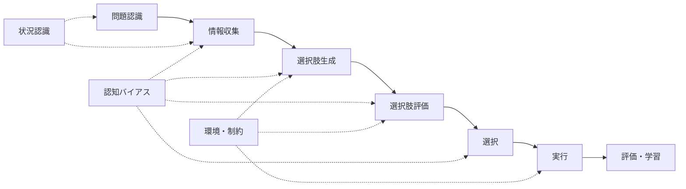
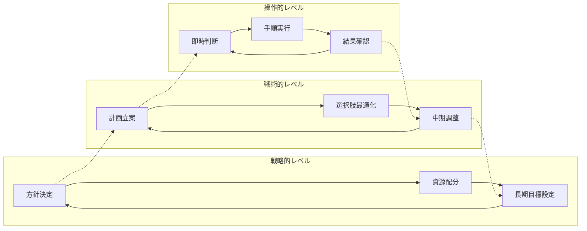
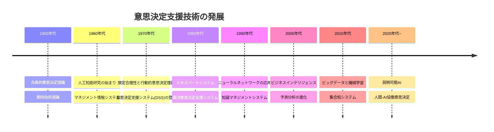

# 意思決定の理論と実践

!!! info "このページについて"
    このページでは、意思決定に関する理論と実践を体系的に解説します。  
    状況認識をもとにした判断や行動のプロセスを明らかにし、個人・チーム・組織レベルでの意思決定能力向上を支援します。

## 概要

意思決定は、状況認識によって得られた理解を行動に変換する重要なプロセスです。本セクションでは、意思決定の理論的基盤から実践的手法まで、体系的に解説します。個人からチーム、組織レベルまでの意思決定プロセスを理解し、より効果的な判断を行うための知識とスキルを提供します。

## 本セクションの目的

意思決定の理論と実践セクションは、以下の目的を持っています。

1. **意思決定の理論的基盤の解説**: 主要な意思決定モデルや理論的枠組みを体系的に理解する
2. **認知プロセスの探求**: 人間の意思決定における認知的側面と限界を把握する
3. **状況要因の分析**: 不確実性やリスクなど、意思決定に影響を与える要因を考察する
4. **チーム・組織の意思決定の理解**: 個人を超えた集団での意思決定プロセスを解明する
5. **意思決定能力の向上**: 訓練方法や支援ツールによる意思決定スキルの開発法を提示する

## 意思決定プロセスの基本構造

意思決定プロセスは一般的に以下の段階から構成されます。

各段階には固有の課題があり、効果的な意思決定のためには、これらの段階を意識的かつ効率的に進める必要があります。

## 本セクションの構成

-   ### [意思決定モデル](./decision-models)

    ---
  
    さまざまな意思決定理論とモデルを解説し、それぞれの特徴、適用範囲、限界を比較します。

    - 規範的モデル
    - 記述的モデル
    - 直感的意思決定モデル
    - 段階的意思決定プロセス

-   ### [認知バイアスと意思決定](./cognitive-biases)

    ---
  
    人間の意思決定に影響を与える認知バイアスと、その克服方法について探求します。

    - 代表的な認知バイアスの種類と影響
    - バイアスの検出と軽減技術
    - メタ認知と批判的思考の重要性
    - 「システム1」と「システム2」思考

-   ### [不確実性下の意思決定](./uncertainty)

    ---
  
    不確実性、リスク、あいまいさが存在する状況での意思決定方法を解説します。

    - リスク評価と管理手法
    - 確率的思考と意思決定
    - 意思決定における時間的要素
    - ロバスト意思決定の原則

-   ### [チーム意思決定](./team-decision-making)

    ---
  
    複数の意思決定者が関わるチームや組織における意思決定の力学と効果的な方法を探ります。

    - 共有メンタルモデルの構築
    - 分散型意思決定と中央集権型意思決定
    - 集団思考と多様性の価値
    - コンセンサス構築と意見の統合

-   ### 現代の意思決定手法
    
    ---

    - **[AI統合OODAループ](./ai-enhanced-ooda)**:  
    AI技術と統合された次世代OODAループによる高速・精密な意思決定フレームワークを解説します。

    - **[データ駆動型意思決定](./data-driven-decisions)**:  
    統計分析・機械学習・オペレーショナルリサーチを統合したデータ中心の意思決定手法を紹介します。

    - **[協調型状況認識](./collaborative-sa)**:  
    チーム・組織における協調的な状況認識の構築と意思決定への活用方法を解説します。

-   ### [意思決定トレーニング](./decision-training)

    ---
  
    意思決定能力を向上させるための訓練方法とアプローチを紹介します。

    - シミュレーションと意思決定演習
    - 事後検証
    - 意思決定ジャーナルとメタ認知強化
    - 適応的専門性の開発

## 異なる領域における意思決定の特性

様々な分野では、意思決定の性質や重点が異なります。以下の表はその特徴を比較したものです。

| 分野 | 時間的制約 | 情報の不確実性 | 結果の重大性 | 主な意思決定モデル |
|-----|------------|--------------|------------|-----------------|
| **航空・操縦** | 非常に厳しい | 中〜高 | 極めて高い | 再認識駆動型、ルールベース |
| **医療・診断** | 状況依存 | 高い | 極めて高い | ベイジアン推論、ヒューリスティック |
| **ビジネス戦略** | 比較的緩やか | 非常に高い | 中〜高 | 規範的、シナリオ計画 |
| **災害対応** | 非常に厳しい | 高い | 極めて高い | 直感的、分散型 |
| **日常生活** | 様々 | 様々 | 低〜中 | ヒューリスティック、満足化 |

## 意思決定の多層構造

意思決定は単一のプロセスではなく、複数の層が相互に影響する複雑なシステムです。

## 状況認識と意思決定の接点

状況認識と意思決定は密接に関連しており、良質な状況認識なしには効果的な意思決定は困難です。一方で、意思決定の目的や視点が状況認識のプロセス自体も方向づけます。

| 状況認識の段階 | 対応する意思決定プロセス | 相互作用 |
|--------------|------------------------|----------|
| **レベル1: 知覚** | 情報収集、問題認識 | 意思決定の目的が何を知覚すべきかを方向づける |
| **レベル2: 理解** | 情報統合、選択肢生成 | 意思決定の枠組みが情報の解釈方法に影響 |
| **レベル3: 予測** | 評価、シナリオ分析 | 予測能力が意思決定の質と迅速性を左右 |

## 意思決定技術の発展

意思決定技術は時代とともに進化してきました。

### 意思決定支援技術の発展タイムライン

## まとめ：意思決定能力の向上に向けて

効果的な意思決定能力の開発には以下の要素が重要です。

1. **理論と実践の統合**: 意思決定モデルの理解とその実践的応用
2. **自己認識の向上**: 自分の認知バイアスと意思決定スタイルの理解
3. **状況適応型アプローチ**: 状況に応じた適切な意思決定手法の選択
4. **継続的学習**: 過去の意思決定からの体系的な学習
5. **ツールと技術の活用**: 適切な意思決定支援システムとフレームワークの利用

意思決定は極めて人間的な活動でありながら、体系的なアプローチによって向上させることが可能です。本セクションでは、理論的理解と実践的スキル開発の両面から、読者の意思決定能力向上をサポートします。

## 本セクションの活用法

本セクションは、以下のような方々に特に価値のある内容を提供します。

- **専門家・実務者**: 各分野での意思決定プロセスを体系化し、向上させたい方
- **管理者・リーダー**: チームや組織の意思決定プロセスを最適化したい方
- **研究者・学生**: 意思決定理論の学術的基盤を理解したい方
- **個人**: 日常生活での判断力を高めたい方

各ページは独立して参照できますが、順に読み進めることで意思決定に関する体系的な理解が得られるよう構成されています。

次のページでは、[意思決定モデル](./decision-models)について詳しく解説します。

## 実事例に見る意思決定の複雑性

複雑な現実環境での意思決定プロセスを理解するために、具体的な事例分析が有効です。

!!! danger "意思決定連鎖の失敗例"
    [羽田空港地上衝突事故](../case-studies/haneda-airport-collision)は、状況認識の誤りが意思決定の連鎖的失敗を引き起こした典型例です。
    
    - **誤認識に基づく決定**：海上保安庁機の滑走路進入決定
    - **継続判断の問題**：日本航空機の着陸継続決定
    - **介入判断の欠如**：管制官の警告対応の遅れ
    
    この事例は、意思決定が孤立して行われるのではなく、相互に影響し合うシステムとして機能することを示しており、本セクションで解説する各理論の実践的重要性を物語っています。