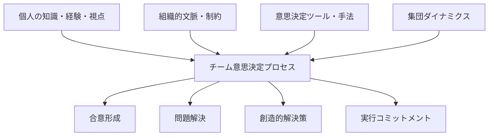
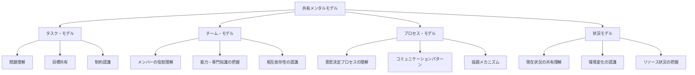
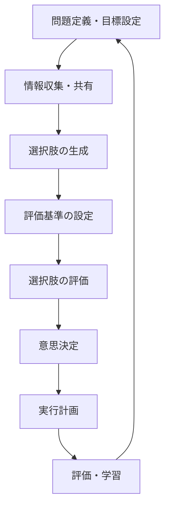
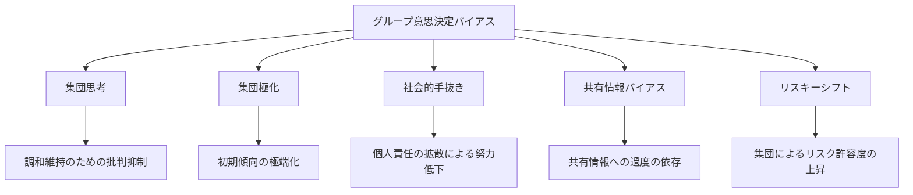
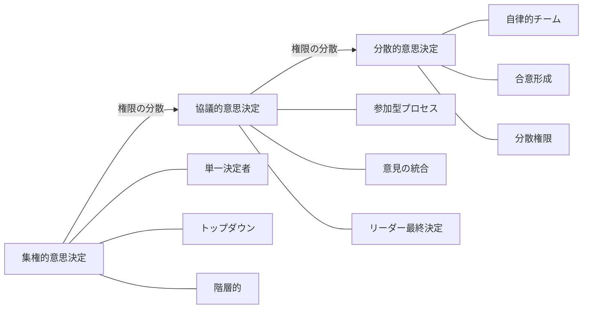
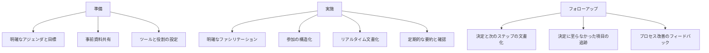
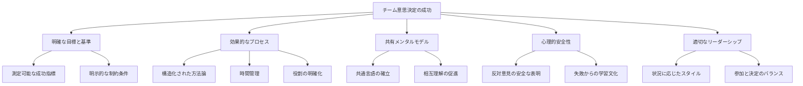

# チーム意思決定

!!! info "このページについて"
    このページでは、チームによる意思決定の基本的な概念、利点と課題、代表的なモデル（コンセンサス型・指揮型・VROOMモデルなど）、および共有メンタルモデルの構築手法を体系的に解説しています。また、テクノロジーやAIの活用、仮想環境での意思決定、ケーススタディを通じて、現代のチーム意思決定の実践的アプローチを紹介します。

## チーム意思決定の基本

チーム意思決定とは、複数の個人が協力して問題を分析し、選択肢を評価し、集合的な判断を行うプロセスです。個人による意思決定と比較して、チーム意思決定は多様な視点や専門知識を活用できる一方で、集団特有のダイナミクスやプロセスの管理が必要になります。

現代の複雑な環境では、単一の個人が全ての情報や専門性を持つことは困難であり、チームによる意思決定の重要性が高まっています。



### チーム意思決定の利点と課題

=== "利点"

    #### 利点

    | 利点 | 説明 | 実現条件 |
    |------|------|---------|
    | **多様な視点の統合** | 異なる経験・背景からの複数の視点 | 心理的安全性、包括的プロセス |
    | **より大きな知識ベース** | 個人を超えた集合的専門知識 | 効果的な知識共有の仕組み |
    | **より良い選択肢の生成** | 創造的なアイデアの相互刺激 | 自由な発想を促す環境 |
    | **実行へのコミットメント向上** | 意思決定への参加による当事者意識 | 真の参加と意見の尊重 |
    | **リスクの分散** | 責任と結果の共有 | 適切な責任分担の枠組み |

=== "課題"

    #### 課題

    | 課題 | 説明 | 対策 |
    |------|------|------|
    | **集団思考** | 調和維持のための批判的思考の抑制 | 意図的な反対意見の奨励、匿名プロセス |
    | **社会的手抜き** | 個人責任の分散による努力低下 | 明確な役割と責任の割り当て |
    | **意思決定の遅延** | 合意形成に時間がかかる | 適切な時間管理と決定ルールの明確化 |
    | **権力・地位の影響** | 階層や権力による意見の偏り | 参加の平等性を確保する構造化手法 |
    | **表層的合意** | 深い理解や本当の合意がない同意 | 理解確認プロセス、反論の奨励 |

## チーム意思決定の主要モデル

=== "コンセンサスモデル vs. 指揮モデル"
    ### コンセンサスモデル vs. 指揮モデル

    ```mermaid
    graph TD
        subgraph "指揮モデル"
            A1[リーダーによる分析] --> A2[リーダーの決定]
            A2 --> A3[チームへの伝達]
            A3 --> A4[実行]
        end
        
        subgraph "コンセンサスモデル"
            B1[共同問題分析] --> B2[選択肢の共同評価]
            B2 --> B3[合意形成]
            B3 --> B4[共同実行]
        end
        
    
    
    
    
    ```

    | モデル | 適した状況 | 利点 | 課題 |
    |-------|----------|------|------|
    | **指揮モデル** | 危機・緊急時<br>高度な専門性が必要<br>明確な階層構造 | 迅速な決定<br>明確な責任所在<br>効率的 | 限られた視点<br>実行コミットメント低下<br>専門知識の未活用 |
    | **コンセンサスモデル** | 複雑な問題<br>多様な専門知識が必要<br>実行に広範なコミットメント要 | 包括的視点<br>高いコミットメント<br>創造的解決策 | 時間がかかる<br>意見対立の可能性<br>集団思考リスク |


=== "VROOMの状況別リーダーシップモデル"
    ### VROOMの状況別リーダーシップモデル

    ビクター・ブルームのモデルでは、状況に応じた意思決定スタイルの選択を提案しています。

    ```mermaid
    graph LR
        A[問題の性質] --> B{時間的制約?}
        B -->|緊急| C[AI: 独断的決定]
        B -->|十分| D{専門知識の所在?}
        
        D -->|リーダーのみ| E[AII: 情報収集後の独断]
        D -->|チーム全体に分散| F{チーム受容の重要性?}
        
        F -->|低い| G[CI: 個別協議]
        F -->|高い| H{対立可能性?}
        
        H -->|低い| I[CII: グループ協議]
        H -->|高い| J[GII: 集団合意形成]
        
    
    
    
    
    
    ```

    | 意思決定スタイル | 内容 | 適した状況 |
    |----------------|------|----------|
    | **AI**: 独断的決定 | リーダーが単独で意思決定 | 緊急事態、専門的決定 |
    | **AII**: 情報収集後の独断 | チームから情報収集後、リーダーが決定 | リーダーに専門性があるが情報が不足 |
    | **CI**: 個別協議 | メンバーと個別に協議し、リーダーが決定 | 対立回避が必要な状況 |
    | **CII**: グループ協議 | 全員での協議後、リーダーが決定 | チームの受容が重要だが対立が少ない |
    | **GII**: 集団合意形成 | グループでの議論と合意形成 | 複雑で多面的な問題、高いコミットメント必要 |

## 共有メンタルモデルの構築

チーム意思決定の質を高めるためには、メンバー間で共有された理解（共有メンタルモデル）を構築することが重要です。

### 共有メンタルモデルの要素



### 共有メンタルモデル構築のアプローチ

| アプローチ | 内容 | 効果 |
|-----------|------|------|
| **事前ブリーフィング** | 目標、役割、プロセスの明確化 | 基本的な共有理解の確立 |
| **チームトレーニング** | シミュレーションや演習による経験共有 | 複雑な状況での協調能力向上 |
| **可視化ツール** | 概念マップ、プロセスダイアグラムの活用 | 抽象的概念の共有理解促進 |
| **構造化コミュニケーション** | 標準化された情報共有プロトコル | 効率的で正確な情報伝達 |
| **アフターアクションレビュー** | 行動と結果の体系的振り返り | 経験からの集合的学習促進 |

??? TypeScript実装例

    ```typescript
    // 共有メンタルモデル構築支援システムの概念的コード
    class SharedMentalModelSystem {
      private team: TeamMember[];
      private sharedDocuments: SharedDocument[];
      private communicationHistory: Communication[];
      private conceptualModel: ConceptMap;
      
      constructor(teamMembers: TeamMember[]) {
        this.team = teamMembers;
        this.sharedDocuments = [];
        this.communicationHistory = [];
        this.conceptualModel = new ConceptMap();
      }
      
      // チームの共有メンタルモデルの現状を評価
      assessSharedUnderstanding(): SharedUnderstandingMetrics {
        const taskAlignment = this.evaluateTaskAlignment();
        const teamAlignment = this.evaluateTeamAlignment();
        const processAlignment = this.evaluateProcessAlignment();
        
        return {
          overallAlignment: (taskAlignment + teamAlignment + processAlignment) / 3,
          taskAlignment,
          teamAlignment,
          processAlignment,
          misalignmentAreas: this.identifyMisalignmentAreas(),
          recommendedActions: this.generateRecommendations()
        };
      }
      
      // タスク理解の一致度評価
      private evaluateTaskAlignment(): number {
        const memberTaskModels = this.team.map(member => member.getTaskModel());
        
        // 目標理解の一致度
        const goalAlignment = this.calculateAlignment(
          memberTaskModels.map(model => model.goals)
        );
        
        // 制約理解の一致度
        const constraintAlignment = this.calculateAlignment(
          memberTaskModels.map(model => model.constraints)
        );
        
        // 問題構造理解の一致度
        const problemAlignment = this.calculateSimilarity(
          memberTaskModels.map(model => model.problemStructure)
        );
        
        return (goalAlignment + constraintAlignment + problemAlignment) / 3;
      }
      
      // 共有理解を高めるためのセッション実施
      facilitateSharedModelSession(sessionType: SharedModelSessionType): SessionResults {
        switch (sessionType) {
          case 'conceptMapping':
            return this.facilitateConceptMappingSession();
          case 'roleDefinition':
            return this.facilitateRoleDefinitionSession();
          case 'processMapping':
            return this.facilitateProcessMappingSession();
          case 'scenarioPlanning':
            return this.facilitateScenarioPlanningSession();
          default:
            throw new Error('不明なセッションタイプ');
        }
      }
      
      // 概念マッピングセッションの実施
      private facilitateConceptMappingSession(): SessionResults {
        // 1. 個別概念マップの作成
        const individualMaps = this.team.map(member => 
          this.elicitConceptMap(member)
        );
        
        // 2. 概念マップの統合
        const integratedMap = this.integrateConceptMaps(individualMaps);
        
        // 3. 統合マップの検証と修正
        const validatedMap = this.validateAndRefineMap(integratedMap, this.team);
        
        // 4. 最終的な共有概念マップを保存
        this.conceptualModel = validatedMap;
        
        // 5. セッション前後での共有理解の変化を評価
        const beforeAlignment = this.previousAlignmentMetrics;
        const afterAlignment = this.assessSharedUnderstanding();
        
        return {
          sessionType: 'conceptMapping',
          alignmentImprovement: afterAlignment.overallAlignment - beforeAlignment.overallAlignment,
          keyInsights: this.extractKeyInsights(validatedMap, individualMaps),
          identifiedGaps: this.identifyConceptualGaps(validatedMap, individualMaps),
          actionItems: this.generateActionItems(validatedMap)
        };
      }
      
      // その他のセッション実施メソッド
      private facilitateRoleDefinitionSession(): SessionResults { /* 実装 */ }
      private facilitateProcessMappingSession(): SessionResults { /* 実装 */ }
      private facilitateScenarioPlanningSession(): SessionResults { /* 実装 */ }
      
      // 補助メソッド
      private calculateAlignment(elements: any[][]): number { /* 実装 */ }
      private calculateSimilarity(structures: any[]): number { /* 実装 */ }
      private elicitConceptMap(member: TeamMember): ConceptMap { /* 実装 */ }
      private integrateConceptMaps(maps: ConceptMap[]): ConceptMap { /* 実装 */ }
      private validateAndRefineMap(map: ConceptMap, team: TeamMember[]): ConceptMap { /* 実装 */ }
      private extractKeyInsights(shared: ConceptMap, individual: ConceptMap[]): Insight[] { /* 実装 */ }
      private identifyConceptualGaps(shared: ConceptMap, individual: ConceptMap[]): Gap[] { /* 実装 */ }
      private generateActionItems(map: ConceptMap): ActionItem[] { /* 実装 */ }
    }
    ```

## 効果的なチーム意思決定のプロセス

### チーム意思決定の基本ステップ




### 各ステップでの効果的手法

#### 1. 問題定義・目標設定

- **成功指標の明確化**: 具体的で測定可能な成功の定義
- **制約条件の特定**: リソース、時間、倫理的制約の明確化
- **問題リフレーミング**: 異なる視点から問題を捉え直す
- **ステークホルダー分析**: 関係者のニーズと期待の把握

#### 2. 情報収集・共有

- **多様な情報源の活用**: データ、専門知識、経験の統合
- **情報の構造化共有**: 重要情報の体系的整理と可視化
- **前提条件の明示化**: 暗黙の前提を明らかにして検証
- **情報ギャップの特定**: 不足情報と入手方法の計画

#### 3. 選択肢の生成

- **ブレインストーミング**: 批判を留保した自由な発想
- **名目集団法**: 個別アイデア生成と統合による社会的影響低減
- **反対の視点採用**: 意図的に異なる立場からの検討
- **類似事例参照**: 過去や他分野の類似問題解決法の参照

#### 4. 評価基準の設定

- **多次元評価フレームワーク**: 複数の観点からの評価軸設定
- **重み付け方式**: 基準の相対的重要性の明確化
- **トレードオフ分析**: 相反する基準間のバランス検討
- **リスク評価基準**: 不確実性と潜在的リスクの評価方法

#### 5. 選択肢の評価

- **多基準分析**: 全選択肢を全基準で体系的に評価
- **シナリオテスト**: 異なる未来シナリオでの堅牢性検証
- **デルファイ法**: 匿名での反復的専門家評価
- **ディベート形式**: 意図的な賛否両論の検討

#### 6. 意思決定

- **段階的合意形成**: 部分的合意から全体合意への段階的進行
- **決定マトリクス**: 評価結果の視覚的統合による判断
- **合意水準の明確化**: 必要な合意レベルの事前定義
- **条件付き合意**: 特定条件下での意思決定と後続ステップの計画

#### 7. 実行計画

- **責任の明確化**: 具体的な役割と期限の設定
- **コミュニケーション計画**: 関係者への決定内容伝達方法
- **マイルストーン設定**: 進捗確認ポイントの特定
- **障害予測と対策**: 潜在的実行障害への事前対応計画

#### 8. 評価・学習

- **設定指標による評価**: 初期の成功指標に基づく結果評価
- **プロセス振り返り**: 意思決定プロセス自体の評価
- **教訓の文書化**: 学びの明示的記録と共有
- **後続決定への反映**: 学びを次の意思決定サイクルに活かす

## チーム意思決定の構造化手法

### 集団の創造性と判断を引き出す手法

| 手法 | 内容 | 利点 | 適した状況 |
|------|------|------|----------|
| **デルファイ法** | 匿名での意見収集と統合を繰り返す | 社会的影響の最小化<br>専門知識の体系的統合 | 専門家間の意見対立<br>地理的に分散したチーム |
| **名目集団法** | 個別のアイデア生成と集団での統合 | 発言の均等化<br>社会的手抜きの軽減 | 創造的なアイデアが必要<br>発言力の差がある場合 |
| **ステップラダー法** | メンバーを段階的に議論に参加させる | 情報の独立性確保<br>全員参加の保証 | 順次的な情報統合が有効<br>初期の意見が重要 |
| **電子ブレインストーミング** | テクノロジーを使った匿名アイデア共有 | 並行処理による効率化<br>社会的抑制の軽減 | 大規模グループ<br>感情的・政治的に微妙な問題 |
| **ディベート方式** | 意図的に賛否両論のチームを設定 | 批判的思考の促進<br>集団思考の防止 | 重要な戦略的決定<br>リスクの高い選択 |
| **KJ法** | アイデアのカード化と体系的整理 | 大量情報の構造化<br>視覚的パターン認識 | 複雑な問題整理<br>多様なアイデアの統合 |

### マルチボーティングと意思決定マトリクス

複数の選択肢から効率的に選定するための構造化手法です。

#### マルチボーティングのプロセス

1. **選択肢の明確化**: 全ての選択肢を明確にリスト化
2. **初期選別**: 各メンバーが一定数の選択肢に投票
3. **絞り込み**: 得票数上位の選択肢を抽出
4. **再投票**: 絞り込まれた選択肢について再度投票
5. **最終選択**: 最終的な得票結果に基づく決定

#### 意思決定マトリクスの例

| 選択肢 | 基準A<br>(重み: 5) | 基準B<br>(重み: 3) | 基準C<br>(重み: 2) | 加重<br>合計 |
|-------|------------------|------------------|------------------|----------|
| **選択肢1** | 4 (20) | 5 (15) | 2 (4) | 39 |
| **選択肢2** | 5 (25) | 3 (9) | 3 (6) | 40 |
| **選択肢3** | 3 (15) | 4 (12) | 5 (10) | 37 |

*括弧内の数値は重み付けスコア（評価×重み）

## チーム意思決定のバイアスと落とし穴

### 主要なグループ意思決定バイアス



#### 集団思考 (Groupthink)

集団の調和維持のために批判的思考が抑制される現象です。

- **症状**: 異論の自己検閲、一致した見解への幻想、反対意見への圧力
- **対策**: 悪魔の代弁者の任命、匿名の意見表明、リーダーの意見表明の遅延

#### 共有情報バイアス (Shared Information Bias)

グループがすでに共有している情報に過度に注目し、固有情報を無視する傾向です。

- **症状**: 議論が既知の情報に集中、新情報の過小評価、視野狭窄
- **対策**: 固有情報の共有促進、役割に基づく情報提供、情報共有の構造化

#### 集団極化 (Group Polarization)

集団の初期傾向がより極端な方向へ強化される現象です。

- **症状**: 議論後の意見の極端化、リスク態度の極端化、少数意見の消失
- **対策**: 多様な意見の意図的な取り込み、バランスの取れた議論促進、冷静な評価奨励

### バイアス対策の統合フレームワーク

| 段階 | 対策 | 実装方法 |
|------|------|---------|
| **事前対策** | チーム構成の多様化 | 認知スタイル、専門性、背景の多様性確保 |
|  | 意思決定プロセスの構造化 | 役割の輪番制、匿名意見収集、段階的参加 |
|  | チームの心理教育 | バイアスに関する認識向上、メタ認知訓練 |
| **実行中対策** | 批判的思考の奨励 | 反対意見の義務化、悪魔の代弁者の任命 |
|  | 情報の構造化共有 | 固有情報の明示的共有、情報マッピング |
|  | プロセスモニタリング | ファシリテーターによるバイアス検知、時間管理 |
| **事後対策** | 意思決定振り返り | 決定プロセスの体系的評価、バイアス分析 |
|  | 代替案の再評価 | 「もし〜だったら」分析、反事実的思考 |
|  | 学習循環の確立 | 教訓の文書化、次回への適用計画 |

## 集権的・分散的意思決定モデル

チーム意思決定は、権限の集中度によっても特徴づけられます。



### 異なるモデルの比較

| 側面 | 集権的意思決定 | 協議的意思決定 | 分散的意思決定 |
|------|--------------|--------------|--------------|
| **意思決定者** | 単一のリーダー | リーダー（チーム意見考慮） | チーム全体または自律的サブグループ |
| **プロセス** | トップダウン | 双方向コミュニケーション | ボトムアップまたは水平的 |
| **メンバーの関与** | 限定的・情報提供のみ | 意見提供・協議への参加 | 完全参加・共同決定 |
| **速度** | 速い | 中程度 | 遅い（単純な問題）／速い（複雑な問題） |
| **適した状況** | 危機・緊急時<br>単純明確な問題<br>高度専門知識が必要 | 中程度の複雑性<br>利害関係者の関与必要<br>専門知識とコミットメント両方必要 | 複雑な問題<br>革新が必要<br>高いコミットメント必要<br>高い自律性環境 |

### 状況に応じた使い分け

組織はしばしば状況に応じて異なる意思決定モデルを使い分けることが有効です。


??? TypeScript実装例
    ```typescript
    // 状況に応じた意思決定モデル選択システムの概念コード
    class DecisionMakingModelSelector {
      private organization: Organization;
      private teamContext: TeamContext;
      private decisionProperties: DecisionProperties;
      
      constructor(
        organization: Organization,
        teamContext: TeamContext,
        decisionProperties: DecisionProperties
      ) {
        this.organization = organization;
        this.teamContext = teamContext;
        this.decisionProperties = decisionProperties;
      }
      
      // 最適な意思決定モデルの推奨
      recommendDecisionModel(): DecisionModelRecommendation {
        // 意思決定の特性評価
        const timeConstraint = this.evaluateTimeConstraint();
        const complexity = this.evaluateComplexity();
        const commitmentNeeded = this.evaluateCommitmentNeeded();
        const expertiseDistribution = this.evaluateExpertiseDistribution();
        const riskLevel = this.evaluateRiskLevel();
        
        // 集権的モデルが適切な条件
        if (
          timeConstraint === 'high' ||
          (complexity === 'low' && expertiseDistribution === 'centralized')
        ) {
          return {
            recommendedModel: 'centralized',
            confidenceLevel: this.calculateConfidence('centralized'),
            rationale: this.generateRationale('centralized'),
            implementation: this.generateImplementationPlan('centralized')
          };
        }
        
        // 協議的モデルが適切な条件
        else if (
          (timeConstraint === 'medium' || complexity === 'medium') &&
          (commitmentNeeded === 'medium' || expertiseDistribution === 'mixed')
        ) {
          return {
            recommendedModel: 'consultative',
            confidenceLevel: this.calculateConfidence('consultative'),
            rationale: this.generateRationale('consultative'),
            implementation: this.generateImplementationPlan('consultative')
          };
        }
        
        // 分散的モデルが適切な条件
        else if (
          (complexity === 'high' || expertiseDistribution === 'distributed') &&
          (commitmentNeeded === 'high' || this.teamContext.autonomyLevel === 'high')
        ) {
          return {
            recommendedModel: 'distributed',
            confidenceLevel: this.calculateConfidence('distributed'),
            rationale: this.generateRationale('distributed'),
            implementation: this.generateImplementationPlan('distributed')
          };
        }
        
        // デフォルトの推奨（ハイブリッドアプローチ）
        else {
          return {
            recommendedModel: 'hybrid',
            confidenceLevel: this.calculateConfidence('hybrid'),
            rationale: this.generateRationale('hybrid'),
            implementation: this.generateImplementationPlan('hybrid')
          };
        }
      }
      
      // モデル選択の詳細分析
      analyzeDecisionModelOptions(): DecisionModelAnalysis {
        const models = ['centralized', 'consultative', 'distributed', 'hybrid'];
        
        // 各モデルの適合性評価
        const modelEvaluations = models.map(model => {
          return {
            model,
            fitScore: this.evaluateModelFit(model),
            strengths: this.identifyStrengths(model),
            weaknesses: this.identifyWeaknesses(model),
            implementationRequirements: this.identifyRequirements(model)
          };
        });
        
        // 状況特性の詳細評価
        const situationalFactors = {
          timeConstraint: this.evaluateTimeConstraint(),
          complexity: this.evaluateComplexity(),
          commitmentNeeded: this.evaluateCommitmentNeeded(),
          expertiseDistribution: this.evaluateExpertiseDistribution(),
          riskLevel: this.evaluateRiskLevel(),
          organizationalCulture: this.evaluateOrganizationalCulture(),
          teamMaturity: this.evaluateTeamMaturity()
        };
        
        return {
          recommendedModel: this.recommendDecisionModel(),
          modelEvaluations,
          situationalFactors,
          sensitivityAnalysis: this.performSensitivityAnalysis()
        };
      }
      
      // 補助メソッド
      private evaluateTimeConstraint(): TimeConstraint { /* 実装 */ }
      private evaluateComplexity(): Complexity { /* 実装 */ }
      private evaluateCommitmentNeeded(): CommitmentLevel { /* 実装 */ }
      private evaluateExpertiseDistribution(): ExpertiseDistribution { /* 実装 */ }
      private evaluateRiskLevel(): RiskLevel { /* 実装 */ }
      private evaluateOrganizationalCulture(): OrganizationalCulture { /* 実装 */ }
      private evaluateTeamMaturity(): TeamMaturity { /* 実装 */ }
      
      private calculateConfidence(model: DecisionModel): number { /* 実装 */ }
      private generateRationale(model: DecisionModel): string { /* 実装 */ }
      private generateImplementationPlan(model: DecisionModel): ImplementationPlan { /* 実装 */ }
      private evaluateModelFit(model: DecisionModel): number { /* 実装 */ }
      private identifyStrengths(model: DecisionModel): Strength[] { /* 実装 */ }
      private identifyWeaknesses(model: DecisionModel): Weakness[] { /* 実装 */ }
      private identifyRequirements(model: DecisionModel): Requirement[] { /* 実装 */ }
      private performSensitivityAnalysis(): SensitivityAnalysis { /* 実装 */ }
    }
    ```

## デジタル時代のチーム意思決定

### テクノロジーがチーム意思決定に与える影響

デジタルツールとAIは、チーム意思決定のプロセスと可能性を変革しています。

| 側面 | 影響 | 機会と課題 |
|------|------|-----------|
| **情報へのアクセス** | 膨大なデータへの即時アクセス | 情報過負荷とキュレーションの必要性 |
| **コミュニケーション** | 地理的制約の排除、非同期協働 | コミュニケーションの質と深さの維持 |
| **意思決定支援** | 分析・シミュレーション・予測能力向上 | 人間判断との適切な統合 |
| **協働プロセス** | リアルタイム共同編集、視覚化 | デジタルディバイドとツール習熟の差 |
| **知識管理** | 過去の決定と結果の体系的記録 | プライバシーとデータ管理の課題 |

### 仮想環境でのチーム意思決定

リモートワークの増加により、仮想環境でのチーム意思決定が一般化しています。

#### 仮想チーム意思決定の課題と対策

| 課題 | 内容 | 対策 |
|------|------|------|
| **非言語コミュニケーションの制限** | 表情やジェスチャーなどの手がかり減少 | ビデオ会議の活用、感情表現のチェックイン |
| **参加の不均衡** | 発言機会の偏り、サイレントメンバー | 構造化された発言機会、ラウンドロビン方式 |
| **集中力と関与の維持** | マルチタスク、注意散漫 | セッションの時間制限、インタラクティブなツール |
| **技術的問題** | 接続問題、ツール不具合 | バックアッププラン、複数チャネルの準備 |
| **文化的・時差の障壁** | 文化的規範の違い、時間帯の違い | 文化的感受性トレーニング、ローテーション会議時間 |

#### 効果的な仮想意思決定のためのフレームワーク



### AIと意思決定支援システム

AIは、チーム意思決定を支援する新たな可能性を提供しています。

| AI応用 | 内容 | 利点と課題 |
|--------|------|-----------|
| **自然言語処理による議事録** | 会話の自動転記・要約・分析 | 記録の効率化、バイアス検出<br>プライバシー懸念、文脈理解の限界 |
| **情報キュレーション** | 関連情報の自動収集・整理 | 情報探索時間の短縮<br>フィルターバブルの危険性 |
| **シミュレーション・予測** | シナリオ分析、結果予測 | 決定の影響理解の向上<br>モデル依存性、予測限界の認識必要 |
| **バイアス検出** | 議論・判断のバイアス分析 | 客観性向上<br>AI自体のバイアス、過度の依存リスク |
| **合意形成支援** | 選好分析、妥協点の特定 | 複雑な選好の理解促進<br>価値の数値化の限界 |

## ケーススタディ：チーム意思決定の実践

=== "多国籍プロジェクトチームの製品開発意思決定"
    ### ケース1: 多国籍プロジェクトチームの製品開発意思決定

    #### 状況
    異なる国と機能部門からのメンバーで構成される新製品開発チームが、技術的アプローチと市場投入戦略について意思決定する必要がありました。メンバー間には文化的背景、専門知識、優先順位の違いがありました。

    #### 課題
    - 地理的・時差的な分散
    - 文化的コミュニケーションスタイルの違い
    - 専門分野の壁を越えた理解
    - 各国市場の特性理解

    #### アプローチ
    チームは段階的な協働意思決定プロセスを採用しました。

    1. **共有メンタルモデル構築**:
        - プロジェクト目標と成功指標の明確化ワークショップ
        - 専門分野の相互学習セッション
        - 各メンバーの文化的背景と意思決定スタイルの共有

    2. **構造化された意思決定プロセス**:
        - 事前情報パッケージの配布
        - デルファイ法による初期選好の匿名収集
        - ファシリテーション付きの仮想ワークショップ
        - 多基準意思決定マトリクス活用

    3. **統合と実装**:
        - 段階的合意形成（全員一致を要する決定と多数決可能な決定の区別）
        - 決定事項の文書化と根拠の明確化
        - フォローアップ責任者の明確な指定

    #### 結果
    このアプローチにより、チームは技術的アプローチについて堅固な合意に達し、各国市場の特性を考慮した柔軟な市場投入戦略を策定できました。また、意思決定プロセス自体が相互理解と信頼関係を強化し、後続の決定がより円滑になりました。

=== "医療チームの緊急対応意思決定"

    ### ケース2: 医療チームの緊急対応意思決定

    #### 状況
    大学病院の集中治療室で、複雑な症状を持つ重症患者に対する治療戦略を決定する必要がありました。医師、看護師、専門技術者から成るチームが、迅速かつ効果的な意思決定を求められていました。

    #### 課題
    - 時間的制約と緊急性
    - 多様な専門分野の統合
    - 階層的な組織文化の影響
    - 不完全で進化する情報

    #### アプローチ
    チームは以下の原則に基づく意思決定モデルを採用しました。

    1. **適応的リーダーシップ**:
        - 状況に応じたリーダーシップの移行（専門領域に基づく）
        - 明確な意思決定ポイントと権限の特定

    2. **構造化されたコミュニケーション**:
        - SBAR（状況-背景-評価-提案）フレームワークの使用
        - 定期的な状況要約と理解確認

    3. **共有状況認識の継続的更新**:
        - 患者データの視覚的表示
        - 新情報の体系的共有と統合
        - 治療目標と制約条件の明示的共有

    4. **段階的決定と迅速な学習サイクル**:
        - 短期間での意思決定と結果評価
        - 治療計画の継続的調整と最適化

    #### 結果
    このチーム意思決定アプローチにより、複数の専門分野からの知見を迅速に統合し、患者の複雑なニーズに対応する柔軟な治療戦略を実施することができました。また、以前は声を上げにくかった役職の低いメンバーからも貴重な観察や提案が引き出され、患者ケアの質が向上しました。

## チーム意思決定のまとめと実践ガイド

### チーム意思決定の成功要因



### 状況別チーム意思決定ガイド

| 状況 | 推奨アプローチ | 主要な成功要因 |
|------|--------------|--------------|
| **緊急時意思決定** | 指揮モデル＋構造化コミュニケーション | 明確な役割、情報の簡潔な共有、事前訓練 |
| **イノベーション意思決定** | 分散型＋創造性促進技法 | 心理的安全性、多様性、実験文化 |
| **リスク管理意思決定** | ディベート方式＋多様な視点の意図的統合 | 批判的思考の奨励、バイアス対策、複数シナリオ検討 |
| **戦略的意思決定** | 協議型＋構造化分析 | 長期視点、多様なステークホルダー考慮、外部視点 |
| **日常的運用意思決定** | 標準化プロセス＋明確な権限委譲 | 効率性、一貫性、適切な自律性のレベル |
| **多文化チーム意思決定** | 文化認識＋明示的プロセス | コミュニケーションスタイルへの配慮、共通理解の確認、参加の平等性 |

### 実践的チェックリスト

#### 意思決定準備チェックリスト

- [ ] 意思決定の目的と期待される成果を明確に定義したか
- [ ] 必要な専門知識を持つ適切なメンバーが参加しているか
- [ ] 意思決定に必要な情報を事前に共有したか
- [ ] 意思決定プロセスと権限を明確にしたか
- [ ] 評価基準と優先順位を事前に合意したか
- [ ] 時間とリソースの制約を認識しているか

#### 意思決定プロセスチェックリスト

- [ ] 全てのメンバーが積極的に参加しているか
- [ ] 意見の多様性を引き出す工夫をしているか
- [ ] バイアスを軽減する措置を講じているか
- [ ] 情報と理由付けが透明に共有されているか
- [ ] 前提条件を明示的に検証しているか
- [ ] 反対意見や懸念を安全に表明できる環境があるか

#### 意思決定フォローアップチェックリスト

- [ ] 決定事項と根拠を明確に文書化したか
- [ ] 次のステップと責任者を明確にしたか
- [ ] 意思決定プロセスを振り返り改善点を特定したか
- [ ] 決定事項をステークホルダーに適切に伝達したか
- [ ] 決定の実施状況をモニタリングする計画があるか
- [ ] 新情報に基づいて決定を調整する仕組みがあるか

## 結論：チーム意思決定の未来

チーム意思決定は複雑で変化する現代環境において、個人の限界を超えた集合知を活用する重要な手段です。効果的なチーム意思決定は、適切なプロセス、ツール、文化、リーダーシップの組み合わせに依存します。

これからの時代、AIやデジタルツールとの協働、分散チームのグローバルな連携、多様性の活用がさらに重要になります。しかし、テクノロジーが進化しても、共有理解の構築、心理的安全性の確保、多様な視点の統合といった人間的要素は、チーム意思決定の核心であり続けるでしょう。

最終的に、最高のチーム意思決定は、構造化されたプロセスと豊かな人間関係を組み合わせ、個人の能力と集合知の両方を最大限に活用するものです。


## 参考文献

1. Janis, I. L. (1982). Groupthink: Psychological Studies of Policy Decisions and Fiascoes (2nd ed.). Houghton Mifflin.
2. Vroom, V. H., & Jago, A. G. (1988). The New Leadership: Managing Participation in Organizations. Prentice Hall.
3. Surowiecki, J. (2004). The Wisdom of Crowds. Doubleday.
4. Stasser, G., & Titus, W. (1985). Pooling of Unshared Information in Group Decision Making: Biased Information Sampling During Discussion. Journal of Personality and Social Psychology, 48(6), 1467-1478.
5. Kerr, N. L., & Tindale, R. S. (2004). Group Performance and Decision Making. Annual Review of Psychology, 55, 623-655.
6. Cannon-Bowers, J. A., & Salas, E. (2001). Reflections on Shared Cognition. Journal of Organizational Behavior, 22(2), 195-202.
7. Hackman, J. R. (2011). Collaborative Intelligence: Using Teams to Solve Hard Problems. Berrett-Koehler Publishers.
8. 三宅なほみ・白水始 (2017). 『協調学習とは―対話を通して理解を深めるアクティブラーニング型授業』. 東京大学出版会.
9. 野中郁次郎・竹内弘高 (1996). 『知識創造企業』. 東洋経済新報社.
10. 西之園晴夫・森田彰・望月紫帆 (2012). 『チームワークと意思決定』. 東信堂.