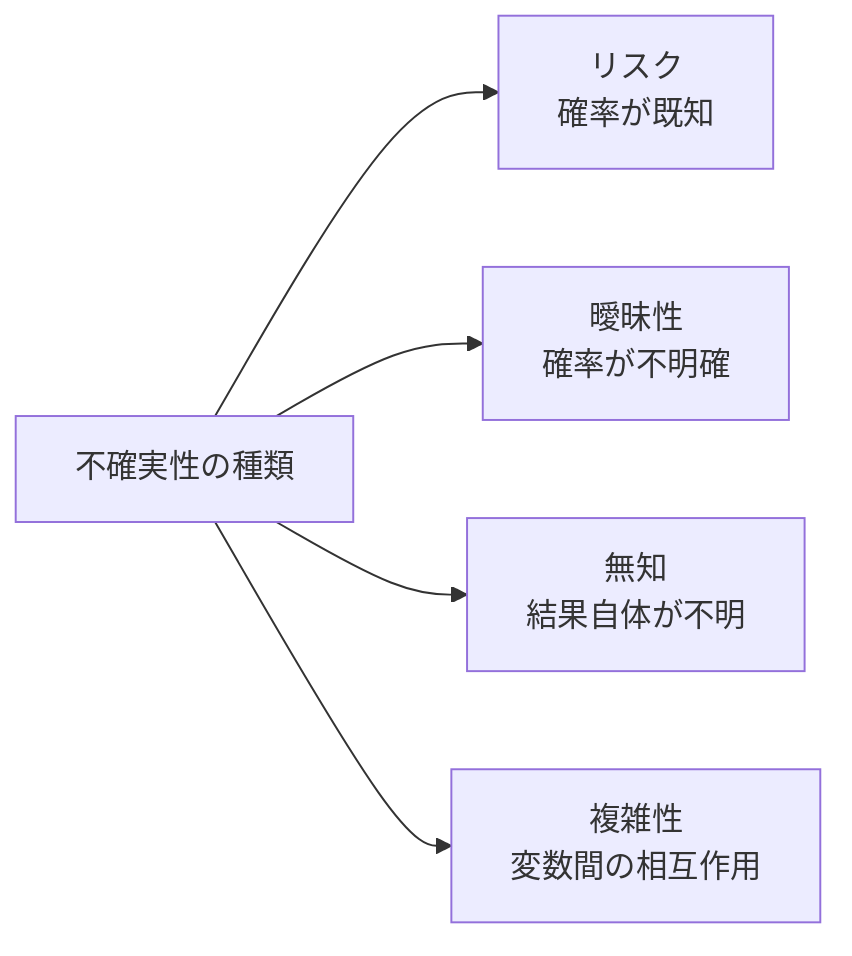
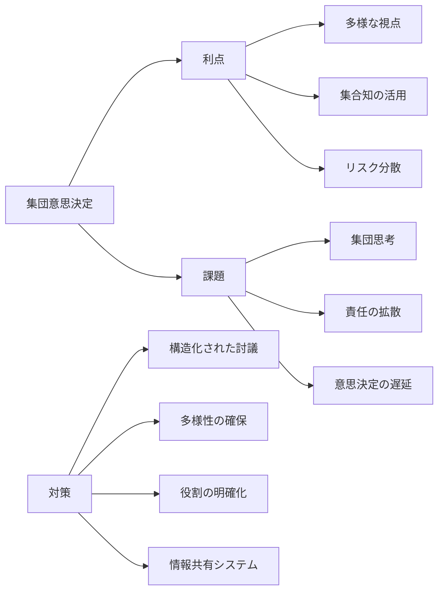
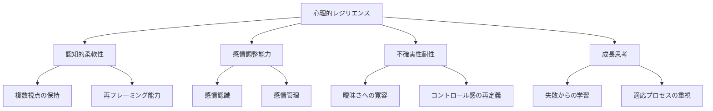

# 不確実性下の意思決定

!!! info "このページについて"
    このページでは、不確実性の概念とその分類、意思決定への影響について詳しく解説します。  
    リスク・曖昧性・無知・複雑性といった不確実性の種類ごとの対応手法や、期待効用理論・プロスペクト理論などの理論的枠組み、シミュレーションや適応的戦略といった実践的アプローチを、組織・個人レベルの観点から体系的に紹介します。  
    AIによる支援やケーススタディも含め、深い不確実性への実践的対処力を養うことを目的としています。

## 不確実性とは何か

不確実性とは、将来の状態や結果を正確に予測できない状況を指します。意思決定においては、完全な情報や確実な予測が得られないまま選択を行わなければならないことが常です。不確実性の存在は、意思決定を複雑にし、時に困難なものにしますが、同時に機会やイノベーションの源泉ともなります。

### 不確実性の種類



#### 1. リスク（計算可能な不確実性）

結果の確率分布が既知の不確実性です。

|特徴|例|対応|
|---|---|---|
|可能な結果と確率が分かっている|サイコロの目、天候予報の確率|確率計算、期待値分析、リスク管理|

#### 2. 曖昧性（計算不能な不確実性）

結果は分かっていても確率が不明または曖昧な状況です。

|特徴|例|対応|
|---|---|---|
|可能な結果は分かるが確率が不明確|新製品の成功率、新興市場の成長見通し|シナリオプランニング、頑健性分析|

#### 3. 無知（根本的不確実性）

何が起こりうるかさえ分からない状況です。

|特徴|例|対応|
|---|---|---|
|未知の未知、予期しない出来事|破壊的技術革新、パンデミックの発生|柔軟性の確保、環境スキャニング|

#### 4. 複雑性に由来する不確実性

多数の要素間の相互作用から生じる予測困難性です。

|特徴|例|対応|
|---|---|---|
|多数の変数と非線形的相互作用|気候システム、金融市場の動向|システム思考、シミュレーション|

### 不確実性のレベル

不確実性は程度によっても分類できます。

| レベル | 特徴 | 例 | 適切な対応 |
|-------|------|------|----------|
| **レベル1<br>未来は明確** | 単一の明確な予測が可能<br>確率分布が既知 | 製品需要の季節変動<br>人口動態変化 | 標準的な予測・分析<br>リスク管理 |
| **レベル2<br>代替的未来** | 複数の明確なシナリオ<br>結果と確率の範囲 | 政策変更の影響<br>競合の市場参入 | シナリオ分析<br>決定木分析 |
| **レベル3<br>可能性の範囲** | 結果の範囲は見えるが<br>特定のシナリオは不明確 | 新興市場への参入<br>技術の長期的影響 | シナリオプランニング<br>リアルオプション |
| **レベル4<br>真の曖昧さ** | 結果の範囲さえ不明<br>予期せぬ事象の可能性 | 破壊的イノベーション<br>地政学的激変 | 弾力性の構築<br>戦略的敏捷性 |

## 不確実性下での意思決定理論

=== "期待効用理論"
    ### 期待効用理論

    期待効用理論は、不確実性下での「合理的」意思決定のための基礎的理論です。

    #### 基本概念

    - 各選択肢について、可能な結果の効用と確率の積の総和を計算
    - 最大の期待効用を持つ選択肢を選ぶべき
    - 期待効用 = Σ(結果の効用 × 結果の確率)

    ```mermaid
    graph TB
        A[選択肢の特定] --> B[各結果の効用評価]
        B --> C[各結果の確率推定]
        C --> D[期待効用の計算]
        D --> E[最大期待効用の選択]
        
    
    
    ```

    #### 例：投資ポートフォリオ選択

    | 投資戦略 | 好況時<br>(30%) | 平常時<br>(50%) | 不況時<br>(20%) | 期待効用 |
    |---------|---------------|---------------|---------------|----------|
    | **積極的成長** | +25% | +8% | -15% | +8.5% |
    | **バランス型** | +15% | +6% | -5% | +6.5% |
    | **保守的** | +8% | +4% | +2% | +4.8% |

    期待効用理論では、最大の期待効用（+8.5%）を持つ積極的成長戦略が最適となります。

    #### 理論の限界

    - 確率の正確な把握が困難
    - 人間の非合理的行動を説明できない
    - 効用の測定・比較の難しさ
    - 極端な結果（破滅的損失など）の扱い

=== "プロスペクト理論"

    ### プロスペクト理論

    カーネマンとトベルスキーが提唱したプロスペクト理論は、人間の実際の意思決定をより正確に説明します。

    #### 主要な洞察

    1. **参照点依存性**: 利得/損失は現状からの変化として評価
    2. **損失回避**: 同額の利得より損失の方が心理的影響が大きい
    3. **価値関数の非線形性**: 大きな金額ほど感応度が低下
    4. **確率の過大・過小評価**: 低確率事象の過大評価、高確率事象の過小評価

    ```mermaid
    graph TB
        A[選択肢の編集] --> B[参照点からの変化として評価]
        B --> C[価値関数による主観的価値変換]
        C --> D[確率加重関数による確率変換]
        D --> E[最大主観的価値の選択]
        
    
    
    ```

    #### 確率加重の例

    | 客観的確率 | 主観的加重（典型的） | 意思決定への影響 |
    |-----------|---------------------|---------------|
    | 0.01 (1%) | 0.05 (5%) | 希少リスクへの過剰反応（航空事故恐怖など） |
    | 0.10 (10%) | 0.18 (18%) | 宝くじへの過大評価 |
    | 0.50 (50%) | 0.42 (42%) | 五分五分の確率の過小評価 |
    | 0.90 (90%) | 0.82 (82%) | 高確率事象への過小評価（安全策の軽視） |
    | 0.99 (99%) | 0.94 (94%) | 確実でないことへの不安（完璧を求める） |

    #### 理論の応用

    - マーケティング：損失回避を利用した訴求（「逃さないで」など）
    - 保険：小確率の損失への過大反応を利用
    - リスクコミュニケーション：フレーミングの影響を考慮


=== "曖昧性回避と意思決定"

    ### 曖昧性回避と意思決定

    曖昧性回避は、確率が明確なリスクよりも曖昧な状況を避ける人間の傾向です。

    #### エルスバーグのパラドックス

    2つの壺があり、一方は赤球と黒球が50個ずつ（壺A）、もう一方は赤球と黒球の合計が100個だが比率不明（壺B）という状況で。

    - 「赤球を引いたら賞金」というゲームでは、多くの人が壺Aを選択
    - 「黒球を引いたら賞金」というゲームでも、多くの人が壺Aを選択

    これは確率が同じでも、曖昧性がある選択肢を避ける傾向を示しています。

    #### 曖昧性への対処

    - **最悪ケース分析**：最悪の結果を想定して対策
    - **情報収集の価値評価**：曖昧性低減のための調査
    - **多様な専門知識の統合**：複数の視点からの確率評価
    - **主観的確率の明示化**：暗黙の判断を明示的に表現

## 不確実性に対応する実践的アプローチ

=== "意思決定の体系的フレームワーク"
    ### 1. 意思決定の体系的フレームワーク

    ```mermaid
    graph TD
        A[問題の構造化] --> B[不確実性の特定と分類]
        B --> C[情報収集と分析]
        C --> D[選択肢の生成]
        D --> E[選択肢の評価]
        E --> F[意思決定と実行]
        F --> G[モニタリングと適応]
        G --> C
        
    
    
    
    
    ```

    #### 問題の明確な構造化

    - **目標の明確化**：何を達成したいのかを具体化
    - **制約条件の特定**：リソース、時間、倫理的制約など
    - **意思決定基準の設定**：優先順位と重み付けの明確化
    - **不確実性の種類の認識**：どの種類の不確実性に直面しているか

=== "不確実性のモデル化技法"
    ### 2. 不確実性のモデル化技法

    #### 確率論的アプローチ

    | 手法 | 適用状況 | 特徴 |
    |-----|----------|------|
    | **確率分布モデリング** | リスクが定量化可能 | 結果の分布全体を表現、信頼区間の設定 |
    | **モンテカルロシミュレーション** | 複雑な相互作用 | 多変数の不確実性を同時に考慮、大量の仮想実験 |
    | **決定木分析** | 段階的選択 | 意思決定の連鎖を表現、条件付き確率の組込み |
    | **ベイジアン更新** | 情報が逐次的に得られる | 事前確率を新情報で更新、学習プロセスの数学的表現 |


    ??? TypeScript実装例
    
        ```typescript
        // モンテカルロシミュレーションによる投資リスク分析の概念コード
        class MonteCarloInvestmentSimulator {
          private investmentAmount: number;
          private yearsToHold: number;
          private annualReturnDistribution: ProbabilityDistribution;
          private inflationDistribution: ProbabilityDistribution;
          private simulationCount: number;
          
          constructor(params: SimulationParameters) {
            this.investmentAmount = params.investmentAmount;
            this.yearsToHold = params.yearsToHold;
            this.annualReturnDistribution = params.returnDistribution;
            this.inflationDistribution = params.inflationDistribution;
            this.simulationCount = params.simulationCount || 10000;
          }
          
          runSimulation(): SimulationResults {
            const finalValues: number[] = [];
            const paths: number[][] = [];
            
            for (let sim = 0; sim < this.simulationCount; sim++) {
              let currentValue = this.investmentAmount;
              const valuePath = [currentValue];
              
              for (let year = 1; year <= this.yearsToHold; year++) {
                // 各年の収益率をランダムサンプリング
                const annualReturn = this.annualReturnDistribution.sample();
                const inflation = this.inflationDistribution.sample();
                
                // 実質収益率を計算
                const realReturn = (1 + annualReturn) / (1 + inflation) - 1;
                
                // 投資価値を更新
                currentValue = currentValue * (1 + realReturn);
                valuePath.push(currentValue);
              }
              
              finalValues.push(currentValue);
              paths.push(valuePath);
            }
            
            return {
              finalValues,
              paths,
              statistics: this.calculateStatistics(finalValues),
              riskMetrics: this.calculateRiskMetrics(finalValues)
            };
          }
          
          private calculateStatistics(values: number[]): StatisticalSummary {
            return {
              mean: this.calculateMean(values),
              median: this.calculateMedian(values),
              standardDeviation: this.calculateStandardDeviation(values),
              percentiles: this.calculatePercentiles(values)
            };
          }
          
          private calculateRiskMetrics(values: number[]): RiskMetrics {
            const initialInvestment = this.investmentAmount;
            
            return {
              probabilityOfLoss: this.calculateProbabilityOfLoss(values, initialInvestment),
              valueAtRisk: this.calculateValueAtRisk(values, 0.05), // 5% VaR
              expectedShortfall: this.calculateExpectedShortfall(values, 0.05),
              maxDrawdown: this.calculateMaxDrawdown(values)
            };
          }
          
          // 統計計算の補助メソッド
          private calculateMean(values: number[]): number { /* 実装 */ }
          private calculateMedian(values: number[]): number { /* 実装 */ }
          private calculateStandardDeviation(values: number[]): number { /* 実装 */ }
          private calculatePercentiles(values: number[]): Record<string, number> { /* 実装 */ }
          
          // リスク指標計算の補助メソッド
          private calculateProbabilityOfLoss(values: number[], threshold: number): number { /* 実装 */ }
          private calculateValueAtRisk(values: number[], alpha: number): number { /* 実装 */ }
          private calculateExpectedShortfall(values: number[], alpha: number): number { /* 実装 */ }
          private calculateMaxDrawdown(values: number[]): number { /* 実装 */ }
        }
        ```

    #### 非確率論的アプローチ

    | 手法 | 適用状況 | 特徴 |
    |-----|----------|------|
    | **シナリオプランニング** | 深い不確実性 | 代替的未来の体系的探索、仮定の検証 |
    | **脆弱性分析** | 予期せぬリスク | システムの弱点・障害点の特定、対策の優先順位付け |
    | **レッドチーム/ブルーチーム** | 複雑な戦略的状況 | 意図的に反対の視点から分析、盲点の発見 |
    | **デルファイ法** | 専門知識の統合 | 専門家の判断を構造化、集合知の活用 |


=== "頑健な意思決定戦略"
    ### 3. 頑健な意思決定戦略

    不確実性が高い状況では、「最適」な選択ではなく「頑健な」選択を目指すことが重要です。

    ```mermaid
    graph LR
        subgraph "意思決定の目標"
            A[最適化] --> B[様々なシナリオで最善の平均結果]
            C[頑健性] --> D[最悪のシナリオでも許容できる結果]
            E[柔軟性] --> F[状況変化への適応能力]
            G[多様性] --> H[複数の選択肢の維持]
        end
        
    
    
    
    
    ```

    #### 頑健性アプローチの主要戦略

    | 戦略 | 内容 | 適用例 |
    |-----|------|-------|
    | **最小最大戦略** | 最悪のケースを最小化 | 重大な下振れリスクがある状況 |
    | **最大最小後悔** | 後悔（機会損失）を最小化 | 複数の選択肢間での選択 |
    | **満足化** | 十分良い結果を確保 | 複雑で最適化困難な状況 |
    | **多様化** | リスクの分散 | 投資ポートフォリオ、経営資源配分 |
    | **リアルオプション** | 将来の柔軟性確保 | 段階的投資、スケーラブル設計 |

    #### 例：プロジェクト投資の頑健性分析

    | 投資戦略 | 好況<br>シナリオ | 基本<br>シナリオ | 不況<br>シナリオ | 最小<br>結果 | 最大<br>後悔 |
    |---------|--------------|--------------|--------------|------------|------------|
    | **大規模一括投資** | +5000万円 | +2000万円 | -3000万円 | -3000万円 | 2000万円 |
    | **段階的投資** | +3000万円 | +1500万円 | -500万円 | -500万円 | 2000万円 |
    | **最小投資** | +1000万円 | +800万円 | +300万円 | +300万円 | 4000万円 |

    最小最大戦略では、最悪の結果が最も良い「最小投資」が選択されます。一方、最大最小後悔では「大規模一括投資」または「段階的投資」が選択されます。

=== "適応的意思決定と実験"
    ### 4. 適応的意思決定と実験

    変化する環境や深い不確実性に対応するための適応的アプローチです。

    ```mermaid
    graph TD
        A[問題の定義] --> B[小規模実験]
        B --> C[結果観察]
        C --> D[学習と適応]
        D --> E[次の実験設計]
        E --> B
        
        C -.-> F[拡大展開の判断]
        F --> G[成功実験の拡大]
        F --> H[失敗からの撤退]
        
    
    
    
    ```

    #### 適応的アプローチの要素

    - **小さく始める**: リスクを限定的にした実験から開始
    - **早期検証**: 核心的な不確実性に関する仮説を優先的に検証
    - **フィードバックループ**: 情報収集と学習の仕組みを設計
    - **失敗許容**: 小さな失敗から学ぶ文化の醸成
    - **オプション価値の認識**: 将来の選択肢を維持する価値

    #### 実装例：スタートアップの製品開発

    1. **MVPアプローチ**: 最小限の機能を持つ製品をリリース
    2. **A/Bテスト**: 複数のバージョンを同時に検証
    3. **ピボット戦略**: 学習に基づく方向転換の意思決定ルール
    4. **段階的資金調達**: 成果指標に連動した追加投資

## 不確実性下での組織的意思決定

### 1. 組織構造と不確実性対応

組織のデザインは不確実性への対応能力に大きく影響します。

| 組織構造 | 不確実性対応の特徴 | 適した環境 |
|---------|-----------------|----------|
| **階層型構造** | 標準化されたプロセス、明確な権限 | 安定的環境、予測可能な不確実性 |
| **マトリックス組織** | 複数の視点、柔軟なリソース配分 | 複数の不確実性要因が存在 |
| **ネットワーク組織** | 高い適応性、情報の迅速な流れ | 高度な不確実性、急速な変化 |
| **アンビデクストラス組織** | 効率と創造の両立、多様な意思決定スタイル | 現在の最適化と将来への適応の両立 |

### 2. 集団意思決定と不確実性

複数の意思決定者が関わる場合の特性と対策です。



#### 構造化された集団意思決定手法

| 手法 | 内容 | 適した状況 |
|-----|------|----------|
| **デルファイ法** | 匿名での意見収集と繰り返しの統合 | 専門家の知見が必要だが社会的影響を排除したい |
| **名目集団法** | 独立した発想と構造化された統合 | 創造的アイデアと評価が必要 |
| **悪魔の代弁者** | 意図的に反対意見を表明する役割 | 集団思考のリスクが高い重要決定 |
| **全員一致の回避** | 合意形成ではなく意見の違いを活用 | 高度に不確実な環境での探索的決定 |

### 3. 意思決定支援システム

テクノロジーを活用した不確実性下での意思決定支援です。

??? TypeScript実装例
    意思決定支援システム（Decision Support System: DSS）は、不確実性下における複雑な選択肢を分析・比較し、最適または頑健な意思決定を行うための支援ツールです。  
    このセクションでは、定量的リスク分析（期待効用分析）、深い不確実性への対応（頑健性分析）、将来の変化への柔軟対応（適応的分析）など、DSS に求められる多様な機能を示し、TypeScript を用いたシステム構築例を通じて、現実の意思決定プロセスにどのように適用できるかを解説します。


    ```typescript
    // 不確実性を考慮した意思決定支援システムの概念コード
    class UncertaintyAwareDSS {
      private decisionContext: DecisionContext;
      private uncertaintyModel: UncertaintyModel;
      private preferenceModel: PreferenceModel;
      private alternativeGenerator: AlternativeGenerator;
      
      constructor(context: DecisionContext) {
        this.decisionContext = context;
        this.uncertaintyModel = new UncertaintyModel(context);
        this.preferenceModel = new PreferenceModel(context);
        this.alternativeGenerator = new AlternativeGenerator(context);
      }
      
      // 意思決定分析の実行
      analyzeDecision(): DecisionAnalysis {
        // 不確実性の特性化
        const uncertaintyProfile = this.uncertaintyModel.characterizeUncertainty();
        
        // 決定問題の種類に基づいたアプローチ選択
        if (uncertaintyProfile.type === 'quantifiable_risk') {
          return this.performExpectedUtilityAnalysis();
        } else if (uncertaintyProfile.type === 'deep_uncertainty') {
          return this.performRobustnessAnalysis();
        } else {
          return this.performAdaptiveAnalysis();
        }
      }
      
      // 期待効用分析（リスクが定量化可能な場合）
      private performExpectedUtilityAnalysis(): DecisionAnalysis {
        const alternatives = this.alternativeGenerator.generateAlternatives();
        const utilityFunction = this.preferenceModel.getUtilityFunction();
        const probabilities = this.uncertaintyModel.getProbabilityDistributions();
        
        // 各選択肢の期待効用を計算
        const analyzedAlternatives = alternatives.map(alt => {
          const expectedUtility = this.calculateExpectedUtility(
            alt, utilityFunction, probabilities
          );
          
          return {
            alternative: alt,
            expectedUtility,
            riskProfile: this.calculateRiskProfile(alt, probabilities),
            sensitivityAnalysis: this.performSensitivityAnalysis(alt, probabilities)
          };
        });
        
        // 結果をランク付け
        const rankedAlternatives = this.rankAlternatives(analyzedAlternatives, 'expectedUtility');
        
        return {
          type: 'expected_utility_analysis',
          rankedAlternatives,
          uncertaintyProfile,
          recommendations: this.generateRecommendations(rankedAlternatives)
        };
      }
      
      // 頑健性分析（深い不確実性の場合）
      private performRobustnessAnalysis(): DecisionAnalysis {
        const alternatives = this.alternativeGenerator.generateAlternatives();
        const scenarios = this.uncertaintyModel.generateScenarios();
        
        // 各選択肢の各シナリオでの結果を評価
        const performanceMatrix = this.evaluatePerformanceAcrossScenarios(alternatives, scenarios);
        
        // 様々な頑健性指標を計算
        const robustnessMetrics = {
          minMax: this.calculateMinMaxMetric(performanceMatrix),
          minRegret: this.calculateMinRegretMetric(performanceMatrix),
          satisficing: this.calculateSatisficingMetric(performanceMatrix)
        };
        
        // 結果のランク付け（複数の頑健性指標に基づく）
        const rankedAlternatives = this.rankAlternativesByRobustness(
          alternatives, robustnessMetrics
        );
        
        return {
          type: 'robustness_analysis',
          rankedAlternatives,
          performanceMatrix,
          robustnessMetrics,
          recommendations: this.generateRobustnessRecommendations(rankedAlternatives)
        };
      }
      
      // 適応的分析（変化する不確実性の場合）
      private performAdaptiveAnalysis(): DecisionAnalysis {
        const initialAlternatives = this.alternativeGenerator.generateInitialActions();
        const futureOptions = this.alternativeGenerator.generateFutureOptions();
        const signposts = this.uncertaintyModel.identifySignposts();
        
        // 適応的戦略のパスウェイを構築
        const adaptivePathways = this.buildAdaptivePathways(
          initialAlternatives, futureOptions, signposts
        );
        
        // 初期アクションの評価
        const evaluatedInitialActions = this.evaluateInitialActions(
          initialAlternatives, adaptivePathways
        );
        
        return {
          type: 'adaptive_analysis',
          evaluatedInitialActions,
          adaptivePathways,
          signposts,
          recommendations: this.generateAdaptiveRecommendations(evaluatedInitialActions)
        };
      }
      
      // 補助メソッド
      private calculateExpectedUtility(
        alternative: Alternative, 
        utilityFunction: UtilityFunction, 
        probabilities: ProbabilityDistribution[]
      ): number { /* 実装 */ }
      
      private calculateRiskProfile(
        alternative: Alternative, 
        probabilities: ProbabilityDistribution[]
      ): RiskProfile { /* 実装 */ }
      
      private performSensitivityAnalysis(
        alternative: Alternative, 
        probabilities: ProbabilityDistribution[]
      ): SensitivityAnalysis { /* 実装 */ }
      
      private evaluatePerformanceAcrossScenarios(
        alternatives: Alternative[], 
        scenarios: Scenario[]
      ): PerformanceMatrix { /* 実装 */ }
      
      // その他のヘルパーメソッド...
    }
    ```

#### 意思決定支援技術の種類

| 技術 | 機能 | 利点 |
|-----|------|-----|
| **シミュレーションツール** | 複雑なシステムの動的モデル化 | 「もし〜なら」分析、動的影響の可視化 |
| **視覚化技術** | 不確実性と選択肢の視覚的表現 | 直感的理解、パターン認識強化 |
| **予測市場** | 集合知による予測の集約 | バイアス軽減、分散した情報の統合 |
| **AI支援分析** | 大量データからのパターン抽出 | 人間が見逃すパターンの検出、処理能力拡大 |

## 不確実性への心理的対応

### 1. 不確実性の心理的影響

不確実性は認知的・感情的に大きな影響を与えます。

| 心理的反応 | 影響 | 対応策 |
|----------|------|-------|
| **不安と恐怖** | リスク回避的判断、決断の遅れ | 感情の認識と分離、段階的意思決定 |
| **認知的閉鎖欲求** | 早急な結論、曖昧さへの不寛容 | 複数解釈の意図的保持、判断保留の訓練 |
| **制御感の喪失** | 過剰な確信、非合理的判断 | 制御可能な領域への集中、帰納的アプローチ |
| **情報過負荷** | 決断疲れ、単純化への逃避 | 情報の構造化、段階的処理 |

### 2. レジリエンスの構築

不確実性に対する心理的レジリエンス（回復力）を高めるアプローチです。



#### レジリエンス向上の実践法

- **認知的再評価**: 不確実性をリスクだけでなく機会としても捉え直す
- **マインドフルネス**: 不確かさへの気づきと受容を高める瞑想的実践
- **複数シナリオ思考**: 多様な未来の可能性を平等に検討する思考習慣
- **小さな実験文化**: 失敗を学習機会として捉える環境づくり
- **意思決定の振り返り**: プロセスと結果を分離した意思決定の評価

## ケーススタディ：不確実性下の意思決定

=== "製薬企業の研究開発投資"
    ### ケース1: 製薬企業の研究開発投資

    #### 状況
    大手製薬企業が複数の有望な化合物の開発に投資する意思決定に直面していました。各化合物には、科学的有効性、規制承認、市場採用など複数の不確実性が存在していました。

    #### 不確実性の特徴
    - **リスク**: 臨床試験の成功確率（過去データから推定可能）
    - **曖昧性**: 競合する治療法の将来的影響
    - **無知**: 未知の副作用の可能性

    #### 意思決定アプローチ
    企業はリアルオプション分析と段階的意思決定アプローチを採用しました。

    1. **ポートフォリオ多様化**: 作用機序の異なる複数の化合物に投資
    2. **段階ゲート方式**: 各開発段階で明確な継続/中止基準を設定
    3. **情報価値分析**: どの不確実性の解消が最も価値があるかを評価
    4. **適応的ライセンス戦略**: 開発段階に応じた柔軟なパートナーシップ

    #### 結果
    このアプローチにより、企業は初期段階で有望性の低い化合物から迅速に撤退し、リソースを有望な候補に集中させることができました。また、予期せぬ副作用が発見された場合にも、迅速に対応できる体制が整いました。


=== "気候変動適応計画"
    ### ケース2: 気候変動適応計画

    #### 状況
    沿岸都市が将来の海面上昇に対する長期的な適応計画を立案する必要がありました。気候変動の進行速度や規模に関する深い不確実性が存在していました。

    #### 不確実性の特徴
    - **曖昧性**: 様々な気候モデルによる予測の相違
    - **深い不確実性**: 排出量シナリオ、氷床崩壊の可能性
    - **複雑性**: 気候、経済、人口動態の相互作用

    #### 意思決定アプローチ
    都市は動的適応経路計画（DAPP）アプローチを採用しました。

    1. **複数シナリオ分析**: 最悪から最良までの複数シナリオを検討
    2. **重要転換点の特定**: どの時点で戦略転換が必要になるかを特定
    3. **シグナル指標の設定**: 海面上昇速度、極端気象の頻度などの監視指標
    4. **柔軟な適応経路**: 初期対策と将来の選択肢を組み合わせた計画

    ```mermaid
    graph LR
        A[現状] --> B[初期対策<br>堤防強化]
        
        B --> C{海面上昇<br>加速?}
        C -->|Yes| D[沿岸域<br>部分撤退]
        C -->|No| E[継続監視]
        
        D --> F{極端洪水<br>増加?}
        E --> F
        
        F -->|Yes| G[大規模<br>再開発]
        F -->|No| H[堤防<br>追加強化]
        
    
    
    
    ```

    #### 結果
    この適応経路計画により、都市は過剰投資を避けつつ、将来の不確実性に柔軟に対応する能力を維持できました。また、住民や企業に将来の計画に関する透明性を提供することで、長期的な投資判断の指針を示すことができました。

## まとめ：不確実性との共存

不確実性は避けられないものですが、適切なアプローチでより良い意思決定が可能になります。

### 主要な洞察

1. **不確実性の種類認識**: 直面している不確実性の種類（リスク、曖昧性、無知、複雑性）を見極める
2. **アプローチの適合**: 不確実性の特性に合わせた意思決定手法を選択する
3. **頑健性の優先**: 「最適」より「頑健」な選択を重視する
4. **適応力の構築**: 柔軟性、学習能力、実験的アプローチを重視する
5. **心理的要因の考慮**: 不確実性への感情的・認知的反応を認識し管理する

### 実践的フレームワーク

1. **問いを明確にする**: 何を決定しようとしているのか、目標は何かを明確にする
2. **不確実性を特定する**: どのような不確実性が存在し、どの程度重要かを評価する
3. **選択肢を生成する**: 異なる未来に対応できる多様な選択肢を考える
4. **選択肢を評価する**: 頑健性、柔軟性、学習機会の観点から選択肢を評価する
5. **監視と学習の仕組みを組み込む**: 継続的な学習と適応のプロセスを設計する

不確実性は単なる障害ではなく、革新と成長の源泉でもあります。不確実性を効果的に管理することで、機会を活かし、リスクを軽減する意思決定が可能になります。

次のページでは、[チーム意思決定](../team-decision-making)について詳しく解説します。

## 参考文献

1. Taleb, N. N. (2012). Antifragile: Things That Gain from Disorder. Random House.
2. Kahneman, D., & Tversky, A. (1979). Prospect Theory: An Analysis of Decision under Risk. Econometrica, 47(2), 263-291.
3. Lempert, R. J., Popper, S. W., & Bankes, S. C. (2003). Shaping the Next One Hundred Years: New Methods for Quantitative, Long-Term Policy Analysis. RAND Corporation.
4. Marchau, V. A. W. J., Walker, W. E., Bloemen, P. J. T. M., & Popper, S. W. (2019). Decision Making under Deep Uncertainty: From Theory to Practice. Springer.
5. Raiffa, H. (1968). Decision Analysis: Introductory Lectures on Choices Under Uncertainty. Addison-Wesley.
6. Gilboa, I. (2009). Theory of Decision under Uncertainty. Cambridge University Press.
7. Knight, F. H. (1921). Risk, Uncertainty, and Profit. Houghton Mifflin.
8. 依田高典 (2016). 『行動経済学: 伝統的経済学との統合による新しい経済学を目指して』. 中公新書.
9. 鈴木公明 (2018). 『決断の技法: 不確実な未来に挑む思考と行動』. ダイヤモンド社.