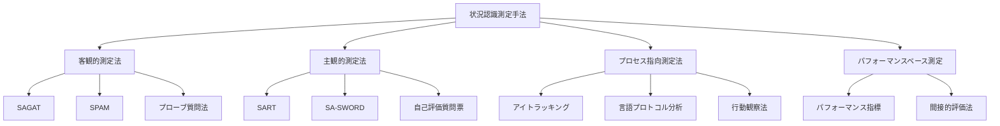

# 状況認識の測定方法

!!! info "このページについて"
    このページでは、状況認識（Situation Awareness）の測定と評価に関する様々な手法について解説します。理論的基盤から実践的な適用まで、状況認識を客観的に評価するための手法を学びます。

## 状況認識測定の重要性

状況認識（SA）を測定する能力は、以下の理由から重要です。

- **トレーニングの有効性評価**: SA向上トレーニングがどの程度効果があるかを定量的に評価できる
- **システム設計の最適化**: 情報表示やインターフェースがSAをどの程度支援するかを測定できる
- **パフォーマンスの予測**: SAのレベルが実際のパフォーマンスにどう影響するかを理解できる
- **安全管理**: 高リスク環境での安全上の問題を特定し、対策を講じる基盤となる

状況認識は直接観察できない目に見えない認知活動であるため、適切な測定が難しいという課題があります。  
そのため、目的に応じて複数の測定手法を使い分けることが重要です。

## 測定手法の分類

状況認識の測定手法は、大きく以下のカテゴリに分類できます。

### 測定方法の選択基準

測定方法の選定にあたっては、以下の観点が重要です。

- **侵襲性（Intrusiveness）**：タスクを中断するかどうか  
- **リアルタイム性**：その場で測定できるか  
- **主観／客観**：被験者の主観に依存するか  
- **定量／定性**：結果が数値で比較可能か  

これらの観点から、状況や目的に応じた手法を選択する必要があります。

## 主要な測定技法の比較

以下の表は、代表的な測定手法について、上記の選択基準に基づいて整理したものです。

各測定手法の特徴を以下の表で比較します。

| 手法 | 測定対象 | 実施方法 | メリット | デメリット | 適用場面 |
|------|----------|----------|----------|-----------|----------|
| **SAGAT** | SA内容の正確性 | シミュレーション一時停止 画面隠蔽後の質問 | 客観的測定 3レベル対応 直接的評価 | 記憶依存 完全中断必要 侵襲的 | 航空訓練 医療シミュレーション 研究用途 |
| **SART** | SA主観的評価 | 自己評価質問票 （注意需要・供給・理解） | 実施容易 中断不要 迅速な結果 | 主観的バイアス メタ認知依存 個人差大 | 日常的評価 自己診断 大規模調査 |
| **SPAM** | SAプロセス効率 | 音声質問 応答時間測定 | 記憶依存少 情報参照可能 現実的中断 | 音声システム必要 二重課題負荷 実装複雑 | 現場訓練 実践的評価 継続的測定 |
| **プローブ質問法** | SA要素別評価 | タスク中の質問 リアルタイム回答 | 柔軟性高 継続的測定 調整可能 | 質問設計困難 パフォーマンス影響 標準化困難 | 特定スキル評価 カスタム評価 研究応用 |

### より詳細な手法比較

=== "主要3手法の詳細比較"
    | 側面 | SAGAT | SPAM | SART |
    |------|-------|------|------|
    | **測定アプローチ** | 客観的測定 | 客観的測定 | 主観的測定 |
    | **シミュレーション中断** | 完全中断・画面隠蔽 | 部分的中断・情報表示継続 | 中断不要 |
    | **記憶への依存** | 高い（短期記憶） | 低い（情報参照可能） | なし（体験の振り返り） |
    | **実施タイミング** | シミュレーション中 | シミュレーション中 | タスク完了後 |
    | **測定内容** | SA内容の正確性 | SAプロセスの効率性 | SA体験の主観的評価 |
    | **実装の複雑さ** | 高い | 中程度 | 低い |
    | **特殊機器・システム** | シミュレーション制御 | 音声質問システム | なし（質問票のみ） |
    | **実施時間** | 長い（準備＋実施） | 中程度 | 短い |
    | **リアリズム** | 低い（完全中断） | 中程度（現実的中断） | 高い（自然な流れ） |
    | **標準化の容易さ** | 高い（質問の標準化） | 中程度 | 高い（質問票の標準化） |
    | **個人差の影響** | 低い | 中程度 | 高い（メタ認知能力） |
    | **大規模実施** | 困難（リソース要） | 困難（システム要） | 容易 |
    | **研究・評価用途** | 実験室研究 | 実験室・現場研究 | 現場評価・自己診断 |

=== "適用場面による使い分け"
    | 場面 | 最適な手法 | 理由 |
    |------|-----------|------|
    | **基礎研究** | SAGAT | 客観的・詳細な測定、3レベル対応 |
    | **訓練効果検証** | SAGAT + SART | 客観的効果と主観的変化の両面 |
    | **実務環境評価** | SPAM + SART | 現実的中断、実施の容易さ |
    | **大規模調査** | SART | 実施の簡便性、コスト効率 |
    | **システム設計評価** | SAGAT + SPAM | 詳細分析と使いやすさの評価 |
    | **継続的モニタリング** | SART | 日常的実施の容易さ |

=== "組み合わせアプローチ"
    ### 複数手法の組み合わせによる相補的評価
    
    #### 包括的評価（SAGAT + SART）

    - 客観的データで実際のSA能力を測定
    - 主観的体験で学習者の認識と感覚を把握
    - 両者の差異から指導ポイントを特定
    
    #### 実践的評価（SPAM + SART）
    
    - 現実的な作業環境での継続的測定
    - 効率性と体験の両面からパフォーマンス評価
    - 長期的なSA能力の変化を追跡
    
    #### 研究用途（3手法併用）

    - 多角的なSA評価による理論的検証
    - 手法間の相関と妥当性の検討
    - SA理論の発展への貢献

### 測定技法別の質問例

=== "SAGATの質問例"
    #### 特徴
    シミュレーション中にランダムなタイミングで一時停止し、参加者の状況認識を評価する 。 評価は以下の3つのレベルに基づいて行われます。  
    
    - **レベル1（知覚）**：環境中の要素の認識
    - **レベル2（理解）**：知覚した情報の意味の把握
    - **レベル3（予測）**：将来の状態の予測

    #### 質問例

    - **レベル1（知覚）**：「現在、交信中の航空機のコールサインは何ですか？」
    - **レベル2（理解）**：「航空機AとBの間に衝突の危険性はありますか？」
    - **レベル3（予測）**：「航空機Cは次にどの方向に進むと予想されますか？」

=== "SPAMの質問例"
    #### 特徴
    シミュレーションを中断せずに、リアルタイムで参加者に質問を行い、反応時間と正確性を測定する 。 主に「要約的（gist-type）」な情報に関する質問が用いられます。  

    #### 質問例

    - 「TWA799とAAL957のうち、どちらの高度が低いですか？」  
    - 「現在、最も混雑している空域はどこですか？」  

=== "SARTの質問例"
    #### 特徴
    タスク終了後に参加者が自己評価を行う主観的な測定法で、以下の3つの主要な次元に基づいて評価されます。

    - **注意資源の需要（D）**：状況が要求する注意の程度
    - **注意資源の供給（S）**：利用可能な注意資源の量
    - **状況の理解度（U）**：状況の把握と理解の程度

    #### 質問例（各項目を1〜7のスケールで評価）
    
    - 「状況の不安定さ（突然変化する可能性）はどの程度でしたか？」
    - 「状況の複雑さ（要素の多さや相互作用の複雑さ）はどの程度でしたか？」
    - 「状況に対する理解度はどの程度でしたか？」

## プロセス指向測定法

行動や生理的指標から状況認識を推測する手法です。

| 測定方法 | 測定内容 | 主な指標 | メリット | デメリット | 適用例 |
|----------|----------|----------|----------|-----------|--------|
| **アイトラッキング** | 視線の動きと注意配分 | 注視点分布 スキャンパターン 注視持続時間 | 非侵襲的 リアルタイム 客観的 | 視線≠注意 機器要 環境制約 | 運転評価 システム設計 専門技能分析 |
| **言語プロトコル分析** | 思考プロセス | 発話内容 認知ストラテジー 問題解決過程 | 詳細な質的データ 思考過程直接観察 認知戦略理解 | 訓練必要 タスク影響 分析時間長 | 専門家研究 認知プロセス解明 システム改善 |
| **生理学的測定** | 認知負荷と覚醒状態 | 脳波（EEG） 瞳孔径 心拍変動 | 客観的 連続的 無意識反応 | 高価な機器 専門知識要 解釈複雑 | 認知負荷評価 ストレス測定 研究応用 |

## パフォーマンスベースの測定

| 評価種類 | 測定内容 | 代表的指標 | 特徴 | 適用場面 |
|----------|----------|-----------|------|---------|
| **直接的指標** | タスク遂行結果 | 完了時間 エラー率 意思決定品質 問題解決効率 | 実世界関連性高 実施容易 多要因影響 詳細分析困難 | 実務評価 総合的パフォーマンス 最終成果測定 |
| **間接的指標** | SA関連行動 | 情報探索行動 異常対応速度 コミュニケーション 適応能力 | 実環境評価可能 観察者依存 標準化困難 長期観察要 | 現場観察 自然環境評価 行動改善指導 |

## 測定手法の選択基準

適切な測定手法の選択は、以下の要因によって決定されます。

| 選択要因 | 主な考慮点 | 推奨手法 |
|----------|-----------|----------|
| **測定目的** | トレーニング評価 システム設計評価 個人差測定 研究目的 | 目的に応じた 組み合わせ |
| **対象SAレベル** | 知覚重視 理解重視 予測重視 全レベル | SAGAT（全レベル） プローブ（特定レベル） |
| **環境制約** | 実験室環境 実働環境 シミュレーション | SAGAT（実験室） 間接指標（実働） SPAM（シミュ） |
| **リソース** | 時間制約 機器制約 専門性要求 | SART（簡易） アイトラッキング（機器） SAGAT（専門性） |

!!! tip "測定手法の組み合わせ"
    単一の測定手法では状況認識の全側面を捉えることは困難です。複数の手法を組み合わせたマルチメソッドアプローチが推奨されます。例えば、SAGATによる客観的測定とSARTによる主観的評価を組み合わせることで、より包括的な評価が可能になります。

## 分野別の測定アプローチ

各応用分野では、特有の測定アプローチが開発されています。

=== "航空・宇宙"
    #### 主要手法
    - **SAGAT航空版**: 標準化されたプローブ質問セット
    - **フライトシミュレータ性能指標**: 飛行パス維持、異常対応
    - **NASA-TLX**: ワークロード評価とSAの関連分析
    
    #### 特徴
    - 高精度シミュレーション環境、標準化された評価プロトコル

=== "医療"
    #### 主要手法
    - **SAGAT医療版**: 手術・患者ケアシナリオでの評価
    - **チームSA測定**: 多職種チーム全体の共有認識評価
    - **臨床シミュレーション**: 標準患者での状況判断評価
    
    #### 特徴
    - 患者安全重視、チーム協調の評価、倫理的配慮

=== "緊急対応・危機管理"
    #### 主要手法
    - **シナリオ後レビュー**: 意思決定ポイントの詳細分析
    - **状況図作成タスク**: 情報統合能力の評価
    - **コミュニケーション分析**: 情報共有の効率と正確性
    
    #### 特徴
    - 不確実性の高い状況、リアルタイム評価、多機関連携

=== "交通・自動車"
    #### 主要手法
    - **運転シミュレータ評価**: ハザード検出能力測定
    - **注視パターン分析**: 道路状況認識プロセス評価
    - **ハザード知覚テスト**: 潜在的危険の認識能力
    
    #### 特徴
    - 動的環境、リスク認識、予測的行動の評価

## 測定における課題と対策

| 課題 | 具体的問題 | 対策アプローチ |
|------|-----------|---------------|
| **測定の侵襲性** | 観測者効果 タスク妨害 自然性の欠如 | 最小介入測定 慣れ練習 影響度考慮解釈 |
| **実世界の複雑性** | 実験室との乖離 文脈の欠如 変動要因多数 | 高忠実度シミュレーション 現場研究併用 エコロジカル妥当性向上 |
| **個人差・チーム要因** | 経験・専門性差 認知スタイル差 チーム動力学 | 背景情報収集 十分サンプルサイズ 個人内比較デザイン |

## 最新の測定技術とトレンド

技術の発展により、新しい測定アプローチが可能になっています。

=== "リアルタイム評価システム"

    |特徴|技術|利点|
    |---|---|---|
    |・適応的測定 ・埋め込み型評価 ・継続的測定|・AIベースの動的質問調整 ・自然なタスク統合 ・ストリーミング分析|・非侵襲的 ・高頻度測定 ・個別最適化|

=== "機械学習アプローチ"
    |特徴|技術|利点|
    |---|---|---|
    |・行動パターン認識 ・マルチモーダル統合 ・予測モデル|・深層学習 ・時系列分析 ・センサーフュージョン|・客観性 ・スケーラビリティ ・新パターン発見|

=== "遠隔・分散測定"
    |特徴|技術|利点|
    |---|---|---|
    |・オンライン評価 ・VR/AR環境 ・モバイルアプリ|・クラウドベース分析 ・没入型環境 ・ウェアラブルセンサー|・アクセシビリティ ・コスト効率 ・柔軟性|

## 実践的な測定実施ガイド

### 測定計画の立案

1. **目的の明確化**: 何のために、何を測定するのか
2. **対象レベルの特定**: 知覚・理解・予測のどこに焦点を当てるか
3. **制約条件の確認**: 時間、予算、参加者、環境の制約
4. **手法の選択**: 目的と制約に最適な手法の組み合わせ

### 実施上の留意点

- **倫理的配慮**: 参加者への十分な説明と同意
- **標準化**: 測定条件の統一と再現性の確保
- **品質管理**: データの信頼性と妥当性の確認
- **継続的改善**: 実施結果に基づく方法論の改善

!!! example "医療分野での測定例"
    - **目的**: 手術チームの状況認識向上トレーニングの効果評価  
    - **手法組み合わせ**: SAGAT（術中の一時停止評価） + チーム コミュニケーション分析 + 術後自己評価  
    - **評価指標**: 重要情報の共有率、異常検知時間、チーム協調スコア  
    - **実施**: 訓練前後の比較、3ヶ月後の追跡評価

## まとめ

状況認識の測定は、安全性が重要なシステムの設計、訓練、評価において不可欠です。測定手法の選択は、目的、制約、対象に基づいて慎重に行う必要があります。単一手法ではなく、複数手法の組み合わせにより、より包括的で信頼性の高い評価が可能になります。

技術の進歩により、より非侵襲的でリアルタイムな評価が可能になりつつあり、人間の認知能力を最大限に活かすシステム設計や効果的なトレーニング方法の開発が期待されます。

次のページ「[状況認識トレーニング](../training-sa)」では、状況認識能力を向上させるための様々なトレーニング手法について解説します。

状況認識の測定は万能な一手法で完結するものではありません。  
複数のアプローチを組み合わせることで、より精緻で信頼性の高い評価が可能になります。

## 参考文献

1. Endsley, M. R. (1995). Measurement of situation awareness in dynamic systems. *Human Factors, 37*(1), 65-84.
2. Salmon, P. M., Stanton, N. A., Walker, G. H., & Green, D. (2006). Situation awareness measurement: A review of applicability for C4i environments. *Applied Ergonomics, 37*(2), 225-238.
3. Vidulich, M. A., & Hughes, E. R. (1991). Testing a subjective metric of situation awareness. *Proceedings of the Human Factors Society Annual Meeting, 35*(18), 1307-1311.
4. Parasuraman, R., Sheridan, T. B., & Wickens, C. D. (2008). Situation awareness, mental workload, and trust in automation: Viable, empirically supported cognitive engineering constructs. *Journal of Cognitive Engineering and Decision Making, 2*(2), 140-160.
