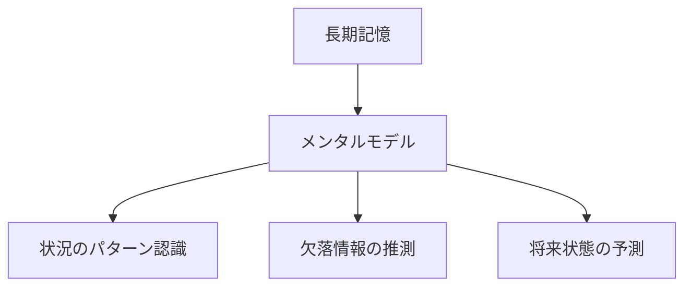
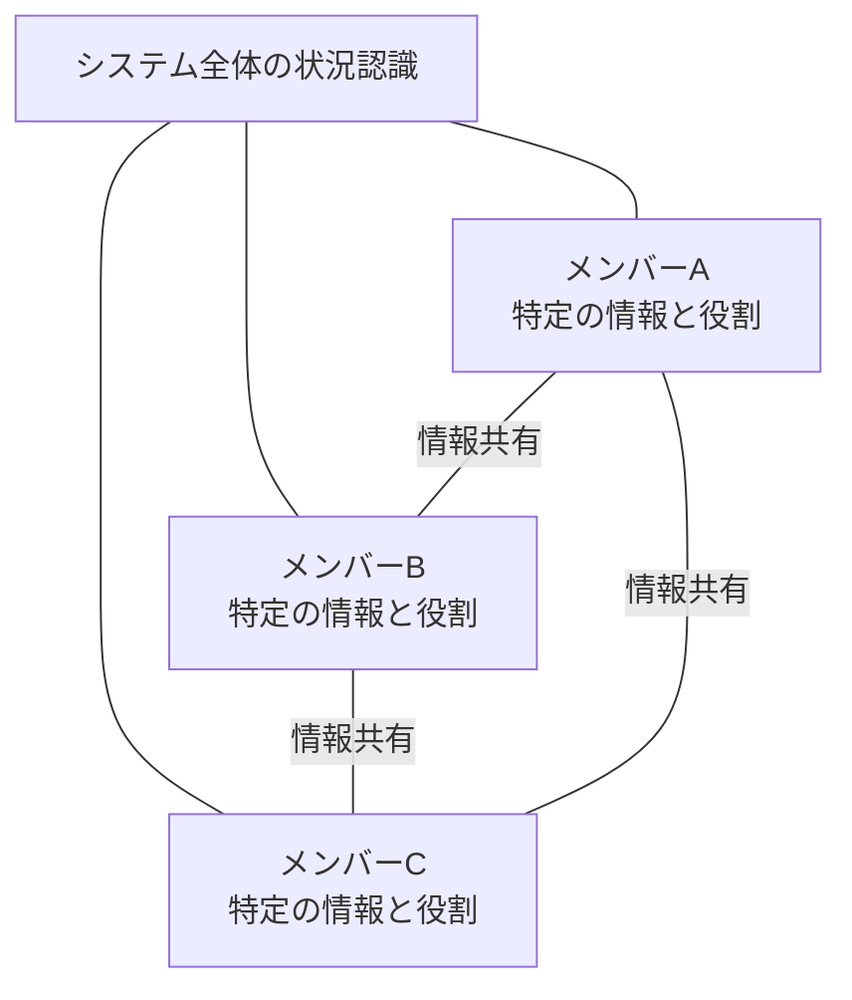

# 状況認識の基本アプローチ

!!! info "このページについて"
    このページでは、状況認識（Situation Awareness）の理論的基盤から実践的応用まで、より深く掘り下げて解説します。基本セクションで学んだ概念をさらに発展させ、認知的側面、応用分野、最新のトレンドについて探求します。
状況認識の向上は、単一の手法や個人努力だけでは実現できません。  
そのため本ページでは、状況認識の改善に必要な3つの観点（個人・チーム・システム）に分類し、それぞれの特性とアプローチを整理します。

## 認知的メカニズムと基盤

人間が環境を正確に把握し、適切な行動をとるためには、複数の認知機能が連携して働く必要があります。本セクションでは、状況認識を構成する主要な認知メカニズムとその相互関係について詳述します。

状況認識を支える主要な認知メカニズムについて詳しく見ていきましょう。

### 注意と作業記憶

状況認識の質は、注意の配分と作業記憶の容量に大きく影響されます。

!!! warning "注意の限界"
    人間の注意資源は限られており、複数のタスクを同時に行う場合、状況認識が低下する可能性があります。  
    例えば、パイロットが通信に集中しすぎると、高度の低下に気づかないことがあります。

#### 注意の管理

|注意の制御|必要な能力|
|---|---|
|選択的注意|関連情報に焦点を当て、不要な情報を除外する能力|
|分散注意|複数の情報源を同時に監視する能力|
|注意の切り替え|異なる情報源間でスムーズに注意を移動させる能力|

#### 作業記憶の役割

- 複数の情報を一時的に保持して処理する
- 新しい情報と長期記憶内の情報を統合する
- 情報の優先順位付けと関連付けを行う

### 長期記憶とメンタルモデル

長期記憶に蓄積された知識と経験は、メンタルモデルを形成し、状況認識を支えます。

#### メンタルモデルの重要性

- システムや環境の内部表現として機能
- 情報の解釈と欠落情報の補完を支援
- 状況変化の予測を可能にする

#### 専門家と初心者の違い

専門家は豊富な経験から構築された洗練されたメンタルモデルを持ち、より少ない情報から状況を正確に理解・予測できます。

人間の情報処理は、既存の知識や期待を基にした「トップダウン処理」と、外界からの新たな情報に反応する「ボトムアップ処理」の両方が組み合わさっています。これらのバランスは、状況をどう捉え、どのように判断するかに大きく影響します。

### トップダウン・ボトムアッププロセス

状況認識は、トップダウンとボトムアップの情報処理の相互作用によって形成されます。

=== "トップダウン処理"
    - 目標や期待に基づいた情報処理
    - 既存のメンタルモデルを使用して情報を解釈
    - 注意の方向付けと情報の優先順位付けに影響
    - **例**: パイロットが離陸前のチェックリストに基づいて特定の情報を探す

=== "ボトムアップ処理"
    - 環境からの刺激に駆動される情報処理
    - 目立つ、予期せぬ、または重要な変化に反応
    - 新たな脅威や機会の検出に重要
    - **例**: 異常な警告音が鳴った際に自動的に注意が向けられる

効果的な状況認識は、これら2つのプロセスのバランスに依存しています。

## 状況認識を阻害する要因

状況認識が低下する主な要因を理解することで、その予防と対策が可能になります。

### 個人的要因

| 要因 | 説明 | 対策 |
|------|------|------|
| **疲労** | 注意力と情報処理能力の低下 | 適切な休息、タスクローテーション |
| **ストレス** | 注意の狭窄、作業記憶容量の減少 | ストレス管理技術、優先順位の明確化 |
| **経験不足** | 不適切なメンタルモデル、手がかりの見落とし | トレーニング、シミュレーション、メンタリング |
| **過信** | 自己の能力や状況理解の過大評価 | 批判的思考の奨励、クロスチェック |
| **認知バイアス** | 確証バイアス、アンカリングなどによる 誤った状況理解 | バイアス認識訓練、多様な視点の考慮 |

### 環境的及びシステム的要因

- **情報過多**: 処理能力を超える量の情報が提示される状況
- **情報の質**: 不明瞭、不正確、または不完全な情報
- **システム設計**: 人間の認知能力を考慮していない設計
- **時間的プレッシャー**: 迅速な状況評価と意思決定を要求される状況
- **チームコミュニケーション**: 不十分または不明確なコミュニケーション

!!! example "航空分野の例"
    1977年のテネリフェ空港事故では、濃霧（環境要因）と誤解を招くコミュニケーション（システム要因）が組み合わさり、2機のボーイング747が滑走路上で衝突しました。この事故は、状況認識の失敗がいかに悲劇的な結果をもたらすかを示しています。

## チームの状況認識

チームの状況認識（Team SA）は、全てのメンバーが必要な情報を持ち、共有し合っている状態を指します。  
単に同じ情報を知っているというだけでなく、「誰が何を知っているか」「誰がどの役割を担うか」を認識し、**分散された認知が調整されている**ことが重要です。

現代の複雑な業務環境では、個人だけでなく、複数の人間が連携して行動するチーム単位での状況認識が重要となります。ここでは、チームでの情報共有と協調を支える概念である「共有状況認識」や「分散状況認識」について解説します。

個人の状況認識を超えて、チーム全体での共有状況認識も重要です。

### 共有状況認識（Shared SA）

チームメンバー間で状況に対する共通理解を持つことは、調整された行動のために不可欠です。

#### 共有状況認識の要素

- チーム全体の目標と制約条件の理解
- 各メンバーの役割と責任の認識
- 重要情報の共有メカニズム
- 共通の用語と手順

#### コミュニケーションの重要性

共有状況認識の維持には効果的なコミュニケーションが不可欠です。クローズドループコミュニケーション（情報の送信、受信、確認）は誤解を防ぎます。

### 分散状況認識（Distributed SA）

Stanton等が提唱した「分散状況認識」の概念は、状況認識はチームやシステム全体に分散しているという見方です。

この視点では、個々のメンバーが完全な状況認識を持つ必要はなく、各自が特定の役割と情報を担当し、必要に応じて情報を共有することで、システム全体として効果的な状況認識が実現されます。

#### 分散状況認識の例

=== "航空管制システム"
    パイロット、管制官、地上スタッフがそれぞれ異なる情報を持ち、連携して飛行の安全を確保

=== "手術チーム"
    外科医、麻酔科医、看護師がそれぞれの専門分野に集中しながら情報を共有し、総合的な患者ケアを提供

## 応用分野別の状況認識：概観

状況認識は多様な分野で応用されており、その概念が広く適用可能であることを示しています。各分野の詳細については[応用セクション](../../applications/index)で解説していますが、ここでは分野横断的な特徴と状況認識の適用パターンを概観します。

### 分野別の状況認識の特徴比較

各応用分野は固有の特性を持ちながらも、状況認識の基本原則を共有しています。以下の表は主要分野における状況認識の特徴を比較したものです。

| 分野 | 時間的制約 | 情報の特性 | 主要な認知的課題 | 特徴的なSA技術 |
|------|------------|------------|------------------|----------------|
| [航空](../../applications/aviation-sa) | 即時～短期 | 3次元空間情報 高度に計器化 | 空間位置認識 複数情報源の統合 | グラスコックピット 自動警報システム |
| [海事・船舶](../../applications/maritime-sa) | 短期～中期 | 2次元広域 視界制限 | 相対運動予測 気象条件の影響評価 | レーダー/AIS 電子海図 |
| [医療](../../applications/medical-sa) | 変動的 (緊急～長期) | 生体情報 複雑な因果関係 | 症状パターン認識 治療効果予測 | 患者モニタリング チェックリスト |
| [軍事・防衛](../../applications/military-sa) | 即時～長期 | 敵味方情報 不確実性が高い | 敵意図の推測 情報の信頼性評価 | C4ISRシステム インテリジェンス分析 |
| [緊急対応・危機管理](../../applications/emergency-sa) | 即時～短期 | 断片的 時間とともに変化 | リソース配分 リスク評価 | 統合指揮システム 状況図作成 |
| [産業・インフラ](../../applications/industrial)* | 即時～中期 | システム状態 プロセスデータ | 異常検知 障害連鎖予測 | SCADA デジタルツイン |
| [日常生活](../../applications/daily-life) | 変動的 | 社会的文脈 環境情報 | 安全リスク認識 社会的手がかり理解 | ナビゲーション 安全教育 |

### 応用分野間の共通パターン

複数の応用分野を横断的に見ると、状況認識に関する以下の共通パターンが浮かび上がります。

|共通パターン|説明|
|---|---|
|情報過負荷とフィルタリング|全ての分野で、関連情報と非関連情報を区別し、限られた注意資源を効率的に配分する必要があります|
|チーム状況認識の重要性|単独の個人ではなく、チーム全体での状況認識の共有が成功の鍵となります。航空機のコックピットクルー、医療チーム、緊急対応チームなど、多くの分野でこれが当てはまります|
|技術支援の進化|各分野で、人間の認知能力を補完・強化するための技術的支援が発展してきました。デジタル化、自動警報、情報統合システムなどが例として挙げられます|
|状況認識の失敗モード|分野を問わず、状況認識の失敗パターンには共通点があります。注意の狭窄、確証バイアス、情報の欠落などが典型的な例です|

### 分野固有の課題と革新

一方で、各分野には固有の課題と革新的アプローチも存在します。

- **航空分野**：空間認識と多次元情報の統合に焦点。自動化とパイロットの状況認識のバランスが課題
- **医療分野**：患者の状態変化の微妙な兆候を検出するための専門的知識と直感の活用が特徴的
- **緊急対応・危機管理**：不完全で変化する情報下での迅速な意思決定能力の養成に注力
- **産業・インフラ**：予測保全と異常検知における状況認識の応用が進展

各分野の詳細については、[応用セクション](../applications/index.md)の各ページで詳しく解説しています。そこでは、具体的な事例、技術的詳細、トレーニング手法などについて学ぶことができます。

## 最新技術トレンドと状況認識の進化

|技術|説明|
|---|---|
|空間コンピューティングと拡張現実（AR）|空間コンピューティングは、物理空間とデジタル情報を統合し、リアルタイムでの状況把握を可能にします。AR技術と組み合わせることで、ユーザーは直感的に情報を理解し、迅速な対応が可能となります。|
|持続可能なコンピューティングとエッジAI|エネルギー効率の高いコンピューティングとエッジAIの導入により、リアルタイムでのデータ処理と状況認識が可能となり、環境への負荷を軽減しつつ、高速な意思決定を支援します。|
|AIガバナンスと説明可能なAI（XAI）|AIの判断プロセスを透明化し、倫理的な問題に対応するためのAIガバナンスとXAIの導入が進んでいます。これにより、AIによる状況認識の信頼性と受容性が向上しています。|
|エージェント型AI（Agentic AI）|エージェント型AIは、自律的に環境を認識し、目的達成のために行動を計画・実行する能力を持ちます。人間の意思決定を補完し、複雑な状況下での対応力を高めます。|
|ニューロモルフィックコンピューティングと神経拡張|人間の神経構造を模倣したニューロモルフィックコンピューティングや、神経拡張技術が登場し、より人間に近い情報処理や状況認識が実現されています。これにより、複雑な環境下での迅速かつ柔軟な対応が可能となります。|

## 日本における状況認識研究と応用

状況認識の理論は欧米で発展してきましたが、日本においてもその応用は広がっており、特に防災や製造業において独自の進化を遂げています。ここでは、日本における代表的な取り組みとその特徴を紹介します。

日本でも様々な分野で状況認識に関する研究や応用が進められています。

### 災害対策と防災分野

日本は自然災害が多い国として、状況認識技術を防災に活用しています。

#### 主要プロジェクト
- 気象庁の緊急地震速報システム
- 国土交通省のXRAIN（高解像度降雨観測レーダー）
- 自治体のハザードマップと避難情報システム
- 防災科学技術研究所のリアルタイム災害情報共有システム

#### 特徴的アプローチ
地域コミュニティと連携した「共助」の防災体制において、住民同士の状況認識共有が重視されています。

### 製造業と産業応用

日本の製造業は、品質管理や効率化のために状況認識技術を積極的に導入しています。

#### 応用例
- トヨタ生産方式におけるアンドン（異常表示）システム
- 工場のIoT化と予知保全システム
- デジタルツインによる生産ラインの可視化
- 熟練技能者のノウハウの形式化と伝承

#### 研究機関
- 産業技術総合研究所（AIST）
- 製造科学技術センター（MSTC）
- 各企業の研究開発部門

## システムの状況認識支援

システム設計においては、人間の認知特性を理解し、それに合わせた情報提示やインタフェース設計が求められます。これにより、ユーザーが効率的かつ正確に状況を把握し、適切な判断を下せるよう支援します。

### システム設計時の考慮点（例）

- 情報の過不足がないように可視化する（Too little / Too much の両方を避ける）
- 注意を引くための優先度指標（色・音・配置）を適切に設計する
- ユーザーの認知モデルと一致したインターフェースにする
- 状況変化に応じて提示情報を動的に切り替える（アダプティブUI）

## まとめと今後の展望

これまで見てきたように、状況認識は多岐にわたる認知的・社会的・技術的要素から成り立っています。あらゆる分野における意思決定や行動の前提として、その重要性は今後さらに高まっていくと考えられます。

状況認識は、単なる情報収集や状況把握を超えた、複雑な認知プロセスです。個人、チーム、組織が効果的に機能するための基盤として、その重要性はますます高まっています。

| アプローチ | 主な対象 | 特徴 | 課題 |
|------------|----------|------|------|
| 個人SA | オペレーター、操縦士など | 認知・注意・記憶に基づく | ストレスや疲労の影響を受けやすい |
| チームSA | 複数の専門職による連携 | 情報共有と役割理解が鍵 | 分散認識と誤解のリスク |
| システムSA | ツール・インタフェース・AI | 設計により状況把握を支援 | 情報過多・設計ミスによる混乱 |

#### 今後の研究課題
- 状況認識を高めるための認知トレーニング法の開発
- AIと人間の協調による状況認識の最適化
- 異なる文化や背景を持つ人々間での共有状況認識の促進
- 複雑な社会技術システムにおける状況認識の理解

#### 将来の展望
状況認識の研究と応用は、自動運転車、スマートシティ、医療AI、危機管理など多くの分野で、人間中心の技術開発を支える重要な概念として発展し続けるでしょう。

## 参考文献と関連リソース

1. Endsley, M. R. (1995). Toward a theory of situation awareness in dynamic systems. *Human Factors, 37*(1), 32-64.
2. Stanton, N. A., et al. (2006). Distributed situation awareness in dynamic systems: Theoretical development and application of an ergonomics methodology. *Ergonomics, 49*(12-13), 1288-1311.
3. Wickens, C. D. (2008). Situation awareness: Review of Mica Endsley's 1995 articles on situation awareness theory and measurement. *Human Factors, 50*(3), 397-403.
4. アッシェンブレンナー, L. (2024). Situational Awareness: The Decade Ahead.

次のページ「[状況認識の測定方法](../measuring-sa)」では、状況認識の質を評価するための様々な手法について詳しく解説します。
