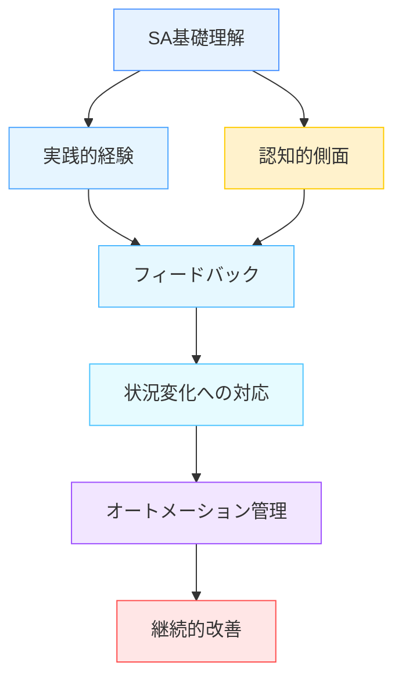
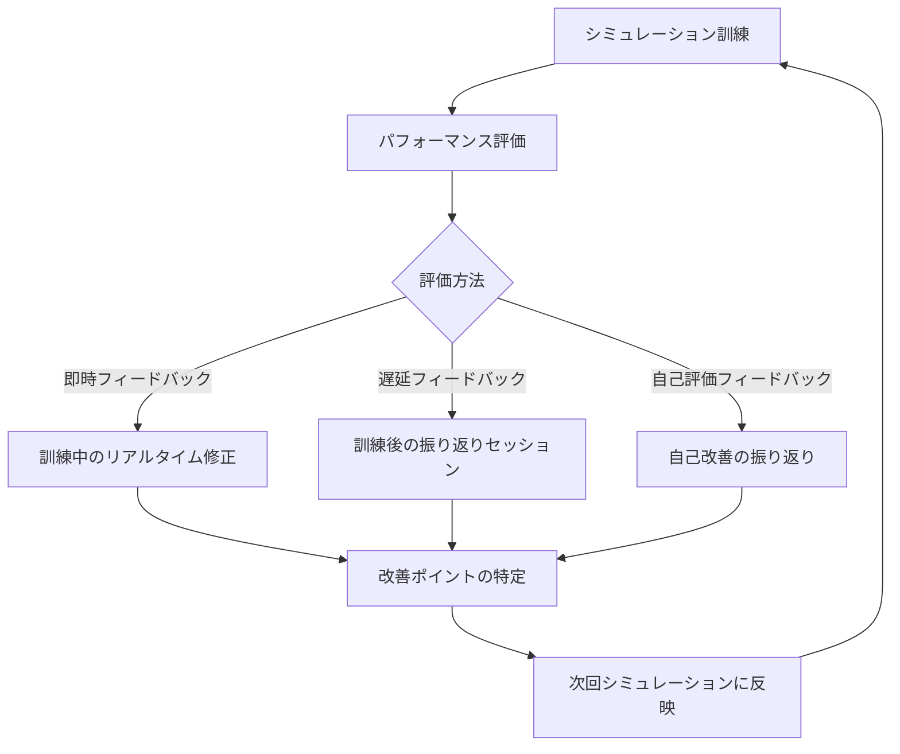
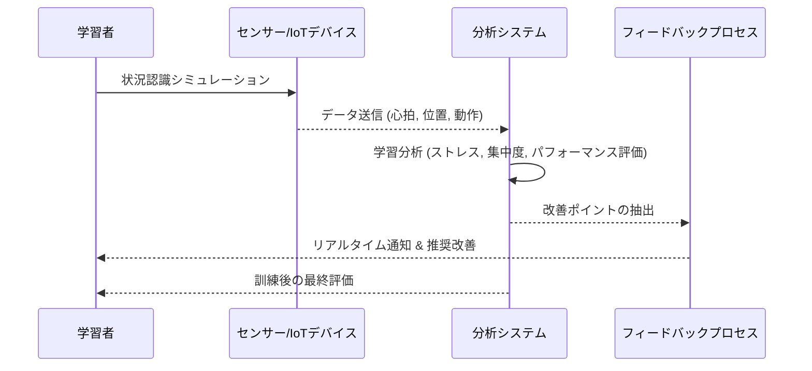
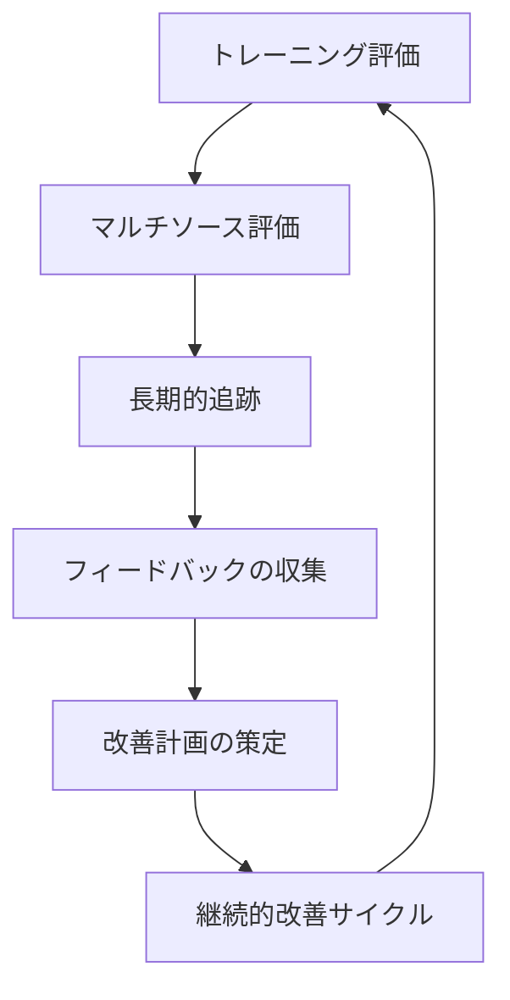

# 状況認識トレーニング

!!! info "このページについて"
    このページでは、状況認識（Situation Awareness）能力を向上させるための様々なトレーニング手法について解説します。個人レベル、チームレベルのトレーニング方法から、シミュレーションベースの高度な訓練まで、実践的なアプローチを学びます。

状況認識力は生まれつきの能力だけでなく、意図的な訓練によって向上させることができます。  
特に高リスク環境においては、訓練によって「気づける人」を育てることが重要です。

## 状況認識トレーニングの重要性

状況認識能力は生来的な才能だけでなく、適切なトレーニングによって大幅に向上させることができます。SAトレーニングが重要である理由は以下の通りです。

- **エラー防止**: SAの欠如は多くの事故やインシデントの主要因であり、トレーニングによってこれらを防止できる
- **パフォーマンス向上**: 良好なSAは、より速く正確な意思決定と行動につながる
- **作業負荷管理**: 高負荷状況でも効率的に情報を処理する能力を養成できる
- **適応能力強化**: 予期せぬ状況の変化に迅速に適応する能力を向上させる

状況認識トレーニングは、高リスク環境（航空、医療、軍事など）で特に重要ですが、日常生活や一般的な職場でも有益です。

## 状況認識トレーニングの基本原則

効果的なSAトレーニングは、以下の基本原則に基づいています。

### キートレーニング原則

| 原則 | 説明 |
|------|------|
| **基礎理解** | SAの3レベル（知覚、理解、予測）の基本概念と重要性の理解 |
| **実践的経験** | 現実的なシナリオと課題を通じた実践練習 |
| **適切なフィードバック** | パフォーマンスに関する具体的で建設的なフィードバック |
| **段階的難易度** | 基本から複雑なシナリオへの段階的な進行 |
| **メタ認知の促進** | 自身のSAを監視・評価する能力の開発 |
| **転移性の確保** | 訓練内容が実際の業務環境に適用できること |
| **継続的実践** | 定期的なリフレッシャートレーニングと実践 |

!!! warning "訓練の落とし穴"
    トレーニングが実際の作業環境と大きく異なる場合、学習した技能の転移が限定的になる可能性があります。また、トレーニングが単に「正解」を教えるだけでは、予測不可能な状況に対応する能力は養われません。

## 個人レベルのトレーニング手法

個人の状況認識能力を向上させるためのトレーニング手法には、以下のようなものがあります。

### 認知的アプローチ
| 手法 | 主な目的 | 具体的内容 | 効果・適用場面 |
|---|---|---|---|
| **注意管理トレーニング** | 限られた注意資源の 効率的活用 | スキャニングパターンの最適化 注意配分戦略 注意切り替え練習 | 情報過多の環境 複数タスクの並行処理 |
| **メンタルモデル開発** | 状況の構造的理解と 意味解釈 | システムの構造的理解 典型的パターンの学習 因果関係の把握 | 専門知識が必要な領域 複雑なシステムの理解 |
| **予測能力強化** | 将来事象の予測と 先制的対応 | 「もし〜ならば」思考 将来状態シミュレーション 異常パターン検出 | リスク管理 プロアクティブな意思決定 |

### 実践的スキル開発
| スキル | 主な目的 | 具体的内容 | 効果・適用場面 |
|---|---|---|---|
| **情報収集スキル** | 必要な情報を効率的に獲得 | 関連情報の効率的な抽出方法 情報の信頼性と重要性の評価 情報ギャップの特定と積極的な情報探索 | 情報過多の環境 不完全な情報での判断 複数情報源の活用 |
| **状況評価技術** | 情報を統合して判断 | リスクと優先順位の評価 複数の情報源からの情報統合 矛盾する情報の解決方法 | 複雑な状況の解析 意思決定の準備段階 不確実性の高い環境 |
| **自己モニタリング** | 自分の認知状態を把握 | 自身のSAレベルの継続的評価 SA低下の兆候認識 （トンネルビジョン、確証バイアスなど） 限界や制約の認識とその管理 | 高ストレス環境 長時間作業 チーム協調が必要な場面 |

!!! example "実践例: OODA（観察・判断・決定・行動）ループトレーニング"
    米軍発祥のOODA（Observe, Orient, Decide, Act）ループは、状況認識とその後の対応をトレーニングするフレームワークです。参加者はシナリオに対して、観察（データ収集）、判断（状況理解）、決定（選択肢評価）、行動（実行）の各ステップを繰り返し練習します。このサイクルを繰り返すことで、迅速かつ効果的なSAと意思決定を養成します。

## チームレベルのトレーニング手法

多くの環境では、個人だけでなくチーム全体の状況認識が重要です。効果的なチームSAトレーニングには以下の要素が含まれます。

### 共有状況認識の促進

| 手法 | 主な目的 | 具体的内容 | 効果・適用場面 |
|------|----------|-----------|-------------|
| **情報共有訓練** | 効果的なコミュニケーション確立 | クローズドループコミュニケーション 重要情報の優先順位付け 明確な情報伝達技術 | 災害対策本部 医療チーム 航空クルー |
| **共有メンタルモデル構築** | チーム全体の共通理解形成 | チーム目標と制約の明確化 役割と責任の理解 相互期待の調整 | 多機関連携 専門分野混成チーム 長期プロジェクト |
| **チーム状況更新** | 状況変化への継続的対応 | 定期的ブリーフィング 状況変化の迅速な共有 背景情報の提供 | 図上演習 動的な現場対応 長時間オペレーション |

### チーム協調トレーニング

| 手法 | 主な目的 | 具体的内容 | 効果・適用場面 |
|------|----------|-----------|-------------|
| **クロストレーニング** | チーム内の相互理解と柔軟性向上 | 他メンバーの役割・視点の理解 相互依存関係の認識 バックアップ行動の練習 | 人員変動の多いチーム 緊急時の代替要員確保 小規模チーム |
| **チームリーダーシップ訓練** | 効果的なチーム統率と調整 | SA促進・維持のリーダーシップ タスク割り当てと監視 チーム内SA促進と調整 | 階層型組織 複雑なプロジェクト 高ストレス環境 |
| **資源調整訓練** | 限られたリソースの最適活用 | 高負荷状況での作業配分 チーム内リソースの効率活用 相互サポートの要請・提供 | リソース制約の厳しい環境 災害対応 緊急医療 |

## シミュレーションベースのトレーニング

シミュレーションは状況認識トレーニングの中核的な要素であり、リスクなく現実的な状況を再現できます。

### シミュレーションの種類

=== "フルスケールシミュレーション"
    実際の環境を忠実に再現した高忠実度シミュレーション

    - **例**: フライトシミュレーター、医療シミュレーションセンター、船舶操縦シミュレーター
    - **特徴**: 物理的に忠実な環境、実際の機器、高度な感覚フィードバック
    - **用途**: 高リスク環境での包括的なSAトレーニング、チーム協調練習

=== "部分シミュレーション"
    特定のタスクや機能に焦点を当てた中程度の忠実度のシミュレーション
    
    - **例**: 部分タスクトレーナー、手順シミュレーター、特定の状況シミュレーター
    - **特徴**: 特定のスキルセットに焦点、コスト効率の良さ
    - **用途**: 特定のSA要素（例：計器読み取り、異常検出）の集中トレーニング

=== "コンピューターベース"
    デスクトップやタブレット上で実行される低～中程度の忠実度のシミュレーション
    
    - **例**: シナリオベースの決断ゲーム、インタラクティブケースシミュレーション
    - **特徴**: 広範な普及可能性、低コスト、柔軟性    
    - **用途**: 基本的なSA概念とスキルの導入、自己学習、リフレッシャートレーニング

=== "仮想/拡張現実"
    VR/AR技術を活用した没入型シミュレーション
    
    - **例**: VRヘッドセット使用の訓練、ARスマートグラスによる情報オーバーレイ
    - **特徴**: 高い没入感、リアルな状況判断、物理的制約の克服
    - **用途**: 危険環境のシミュレーション、複合的な情報処理練習

### 効果的なシミュレーション設計の原則

効果的なSAトレーニングシミュレーションは、以下の設計原則に基づいています。

| 設計原則 | 主な内容 | 期待効果 |
|----------|----------|----------|
| **心理的忠実度** | 実際の作業環境と同様の認知的要求と意思決定プロセスの再現 | 実務に近い認知負荷での訓練により、現場での的確な判断力を養成 |
| **シナリオのリアリズム** | 実際の状況に基づいた現実的なシナリオ設計 | 現実的なストレスや状況変化の体験により、現場での即応力を向上 |
| **変動性と不確実性** | 予測可能なパターンを避け、適応能力を養成 | 予測不可能な環境への対応力と不確実性下での意思決定能力を強化 |
| **トリガーイベント** | 特定のSA要素（知覚、理解、予測）を刺激する設計 | 迅速な情報収集と意思決定を促進し、認知と対応力を強化 |
| **段階的複雑性** | 基本から複雑なシナリオへの段階的な進行 | 確実な成長により、複雑な状況下でも冷静な判断を可能にする |
| **統合フィードバック** | パフォーマンスの即時および詳細なフィードバック機能 | 早期の修正と持続的な改善を促進 |

これらの設計原則に基づくシミュレーションは、以下のような効果をもたらします。

- 現実に即した状況認識の強化
- 高いストレスや複雑な環境下でも正確な意思決定が可能
- チーム間のコミュニケーションと協力関係の強化

### 分野別シミュレーション教育学

シミュレーションベースの状況認識トレーニングは、各分野で独自の学問体系として発展しています。

=== "医療分野"
    - **医療シミュレーション教育学**
        - 組織：SSH、INACSL、日本シミュレーション医学教育学会
        - 特徴：患者安全、ノンテクニカルスキル、多職種連携
        - 認定：CHSE（認定シミュレーション教育者）

=== "航空分野"
    - **航空訓練学**
        - 組織：IATA Training、ICAO
        - 特徴：CRM、TEM、フライトシミュレーション
        - 認定：各国航空当局の認定制度

=== "医療分野"
    - **医療シミュレーション教育学**（Medical Simulation Education）
        - 組織：SSH、INACSL、日本シミュレーション医学教育学会など
        - 特徴：患者安全、ノンテクニカルスキル、多職種連携

=== "航空分野 " 
    - **航空訓練学**（Aviation Training Science）
        - 組織：IATA Training、ICAO、Civil Aviation Training Organization
        - 特徴：CRM（Crew Resource Management）、TEM（Threat and Error Management）

=== "軍事分野"
    - **軍事シミュレーション・ゲーミング学**（Military Simulation & Gaming）
        - 組織：NATO MSG、各国軍事大学院
        - 特徴：戦術訓練、指揮統制、多国間連携

=== "原子力分野"
    - **原子力シミュレーション訓練学**
        - 組織：IAEA、各国原子力関連機関
        - 特徴：プラント運転、緊急時対応、規制要求への対応

=== "海事分野"
    - **海事シミュレーション教育**（Maritime Simulation Education）
        - 組織：IMO（国際海事機関）、各海事大学
        - 特徴：船舶操縦、海上交通管制、海難対応

#### 共通の理論基盤
- 状況認識理論
- チーム協調理論
- 経験学習理論

#### 分野特有の要素
- 規制要求（医療：患者安全、航空：飛行安全など）
- 技術特性（操縦技術、医療技術など）
- リスクの性質（人命、環境、経済など）

### シミュレーション設計の具体例
=== "航空機の緊急着陸シナリオ"
      - フライトシミュレーターでの緊急着陸手順の訓練  
      - 低高度でのエンジン停止や異常警告の処理  
      - チーム間のコミュニケーションと状況共有の強化  

=== "医療チームの蘇生処置シナリオ"
      - シミュレーションセンターでの蘇生処置演習  
      - マルチプレイヤー型VRを活用した複数人での救命処置  
      - タイムクリティカルな判断と役割分担の最適化  

=== "災害対応のシミュレーション例"
      - 大規模地震後の被災地対応  
      - 道路の遮断、停電、救助活動の優先度設定  
      - 無人ドローンとの連携による被害状況の確認  

!!! example "航空分野のシミュレーション例"
    商業航空パイロット向けのSAトレーニングでは、通常運航から緊急時対応までさまざまなシナリオが用意されています。例えば「隠れた異常シナリオ」では、直接的な警告なしに小さな異常が発生し、パイロットがそれを検出し、意味を理解し、将来の影響を予測する能力が試されます。シミュレーション中、トレーナーは「状況冷凍」を行い、パイロットの現在のSAを質問によって評価し、フィードバックを提供します。

### フィードバックサイクルの強化

#### フィードバックサイクルのフローチャート

#### After Action Review (AAR)
- 訓練後の振り返りとパフォーマンス評価  
- 参加者自身が成功点と改善点を分析  
- 実践的な改善プランを共有  

#### フィードバックの種類
- **即時フィードバック**: 訓練中にリアルタイムで修正
- **遅延フィードバック**: 訓練後の振り返りセッション
- **自己評価フィードバック**: 自身で改善点を見つけ出すプロセス

### リアルタイム評価と学習分析

#### リアルタイム評価と学習分析のシーケンス図

#### センサーとIoTデバイスの活用 
- 現場での動きや行動をリアルタイムでキャプチャ
- ストレスや集中度の変化を測定

#### 学習分析と最適化
- データ駆動型のパフォーマンス評価
- 機械学習を用いた行動パターンの発見
- シミュレーション結果の自動分析と改善プラン生成

### 未知の脅威への対応力強化
|訓練項目|主な目的|具体的内容|効果|
|---|---|---|---|
|災害対応シミュレーション|予測困難な自然災害への対応力向上|想定外の地震、津波、火災へのリアクション訓練シミュレーション内でランダムな障害発生|現実の災害発生時に迅速な対応が可能になる被害の最小化と人的リスクの軽減|
|サイバー攻撃対応訓練|不正アクセスや情報漏洩への即時対応|仮想環境での攻撃シナリオ対応データ漏洩やシステムハッキングへの迅速な対処|攻撃の早期発見と封じ込めが可能情報漏洩や業務停止のリスク軽減|
|社会的危機管理|複雑な社会的問題やインフラ停止への適応|パンデミックやインフラ停止への対応シミュレーション複数組織の連携と情報共有の訓練|危機的状況下での組織間の連携が強化される社会的混乱の最小化|

## 分野別トレーニングアプローチ

状況認識トレーニングは各分野の特性に合わせて最適化されています。

=== "航空分野"

    #### 焦点領域
    - 3D空間における位置認識  
    - 多重情報源からのデータ統合  
    - 自動化システムのモニタリング  
    
    #### 特徴的手法
    - Line-Oriented Flight Training (LOFT)  
    - Threat and Error Management (TEM)  
    - 非通常/緊急時手順訓練
    
    #### 教育的要素  
    - Crew Resource Management (CRM)  
    - ブリーフィング/デブリーフィング技術  
    - 飛行データ分析に基づくフィードバック

=== "医療分野"
    #### 焦点領域
    - 患者状態の連続的モニタリング
    - 複数の専門家間での情報共有
    - 急速に変化する状況への適応
    
    #### 特徴的手法
    - 高忠実度患者シミュレーター
    - チームシミュレーション訓練
    - 危機的ケースシナリオ
    
    #### 教育的要素
    - チームSTEPPS（TeamStrategies and Tools to Enhance Performance and Patient Safety）
    - 構造化コミュニケーション（SBAR等）
    - 安全文化と非難のない報告システム

=== "軍事・警察分野"
    #### 焦点領域
    - 複雑で動的な環境での状況把握
    - 敵・味方・中立の区別
    - 高ストレス下での情報処理
    
    #### 特徴的手法
    - タクティカルデシジョンゲーム
    - 実弾訓練と模擬訓練の組み合わせ
    - バーチャルバトルスペースシミュレーション
    
    #### 教育的要素
    - After Action Review (AAR)
    - OODA (Observe, Orient, Decide, Act) ループ
    - ストレス下でのSA維持技術

=== "緊急対応分野"
    #### 焦点領域
    - 混沌とした環境での状況評価
    - 限られた情報に基づく意思決定
    - 多機関連携のための情報共有
    
    #### 特徴的手法
    - 災害シミュレーション訓練
    - テーブルトップ演習
    - 指揮統制訓練
        
    #### 教育的要素
    - Incident Command System (ICS)
    - 共通状況図の作成と維持
    - 意思決定ポイント分析

## トレーニング効果の評価

状況認識トレーニングの効果を評価することは、プログラムの改善と参加者の成長のために重要です。

### 評価メトリクス

|メトリクス|説明|測定方法|適用シナリオ|
|---|---|---|---|
|直接的なSA測定|状況認識の正確性やスピードを測定|・SAGAT （Situation Awareness Global Assessment Technique） ・シミュレーション中のプローブ質問 ・SART （Situation Awareness Rating Technique）|・航空訓練 ・医療シミュレーション ・災害対応|
|間接的な指標|行動の結果としてのSA向上を測定|・エラー率の減少 ・タスク完了時間の短縮 ・意思決定の質の向上|・チーム演習 ・共同作業シミュレーション|
|行動観察|学習者の行動からSAを推測|・情報探索行動の追跡 ・コミュニケーションの質の評価 ・状況変化への適応能力|・現場訓練 ・実践シミュレーション|
|総合的評価|多角的な視点から評価を行う|・自己評価と指導者評価の統合 ・ピアレビュー ・客観的データの解析|・医療チーム評価 ・パイロットの技能検証|
|長期的追跡|学習の定着度と持続性を測定|・トレーニング後の業務パフォーマンス確認 ・リフレッシャートレーニングの効果測定|・継続的な訓練 ・災害対応の年次訓練|

#### 評価アプローチの詳細

##### マルチソース評価
- 自己評価と指導者評価の組み合わせ
- 客観的測定と主観的報告の統合
- ピアレビューとチームパフォーマンス評価

##### 長期的追跡
- トレーニング直後と数ヶ月後の評価比較
- 実際の業務環境でのパフォーマンス変化
- リフレッシャートレーニングの必要性判断

##### 継続的改善サイクル
- 評価結果に基づくトレーニングプログラムの修正
- 新たな課題や環境変化への適応
- 最新の研究知見の組み込み

## 新技術を活用したトレーニング手法

テクノロジーの進歩により、新たなSAトレーニング手法が登場しています。

### 最新技術

| 技術 | 主な特徴 | 主な利点 | 代表的な応用例 |
|---|---|---|---|
| **拡張現実（AR）** | 実環境への情報オーバーレイ | リアルな環境での学習 ハンズフリー情報アクセス コンテキスト認識 | 医療手術ガイダンス 産業保守支援 軍事訓練 |
| **仮想現実（VR）** | 完全没入型シミュレーション環境 | 危険シナリオの安全な体験 高い没入感 コスト効率的な訓練 | 災害対応訓練 航空シミュレーション 医療緊急時対応 |
| **モバイルラーニング** | いつでもどこでもアクセス可能 | 継続的な学習機会 マイクロラーニング 業務統合 | 日常安全教育 リフレッシャートレーニング 現場での即座の参照 |

### 最新技術の取り入れ
状況認識トレーニングは、以下の最新技術によってさらに強化されています。

=== "デジタルツイン（Digital Twin）"
    #### 特徴
    - 現実世界のシステムをリアルタイムでデジタルに再現  
    - 状況認識トレーニングでのシナリオシミュレーションに活用  
    - 動的な環境変化への即時対応とリスク予測が可能  

    #### 利点
    - 現実のシステムのコピーを使用した安全な訓練  
    - モデルを通じたリアルタイムのフィードバック  
    - トラブルシューティングやプロセス改善  

    #### 応用例
    - スマートシティのモニタリング  
    - 航空機のフライトシミュレーション  
    - 医療手術の仮想トレーニング  

=== "AI駆動のシミュレーション最適化"
    #### 特徴
    - 機械学習を活用したシナリオの動的調整  
    - 学習者のパフォーマンスに応じた自動フィードバック  
    - 現実的な意思決定プロセスの強化  

    #### 利点 
    - シナリオの最適化が自動化され、効率的なトレーニング  
    - 適応学習によるスキル習得の迅速化  
    - 個人ごとの進捗に最適なシミュレーション調整  

    #### 応用例
    - スマート工場のオペレーション  
    - 危険区域での自律訓練  
    - パイロットの緊急対応訓練  

=== "XR（Extended Reality: AR+VR）"
    #### 特徴
    - 仮想現実（VR）と拡張現実（AR）の統合  
    - 複合的なシミュレーション環境を構築  
    - 複雑な状況認識を訓練  

    #### 利点
    - 高い没入感と現実的な体験  
    - 危険な環境を仮想で安全に再現  
    - 繰り返し練習が容易  

    #### 応用例
    - 建設現場の安全訓練  
    - 災害対応シミュレーション  
    - 医療手術のトレーニング  

### データ駆動型アプローチ

| アプローチ | 主な機能 | 期待効果 | 適用場面 |
|---|---|---|---|
| **適応型トレーニング** | 学習者の状態に応じた自動調整 AIによる個別最適化 | 個人に合わせた効率的学習 弱点の重点強化 | 個人トレーニング 大規模組織での標準化 |
| **学習分析** | トレーニングデータの詳細分析 パフォーマンスパターン識別 | エビデンスベースの改善 客観的な効果測定 | プログラム評価 研究開発 品質管理 |
| **シミュレーション後分析** | 詳細な行動ログの可視化 決定ポイントの因果分析 | 具体的な改善点の特定 エラーパターンの理解 | デブリーフィング 個別指導 チーム改善 |

## トレーニングプログラムの設計と実装

### トレーニングの必要性

状況認識の欠如は、事故や判断ミスの主因になることが多く、トレーニングは単なる知識習得にとどまらず、行動の変容やチーム全体の認知改善を目的とします。

### トレーニングの設計原則

- 明確な学習目標の設定
- 現実的で関連性の高いシナリオの設計
- 段階的な難易度の調整
- 適切なフィードバックと振り返りを組み込む（例：事後ブリーフィング、セルフレビュー、チームによる相互評価など）
- チームワークとコミュニケーションの強化
- 継続的な評価と改善サイクルの実施

### ニーズアセスメント
| 項目 | 説明 | 具体的内容 |
|---|---|---|
| **対象者の分析** | 現在のSAスキルレベルの評価 | ・現場での作業理解 ・課題と強みの特定 |
| **業務分析** | 重要なSA要素と決定ポイントの特定 | ・典型的な状況とシナリオの調査 ・必要なスキルと知識の体系化 |
| **組織的要因の考慮** | 利用可能なリソースと制約の評価 | ・リソースの可用性 ・組織文化と学習環境の分析 ・長期的サポート体制 |

### プログラム開発
| 項目 | 説明 | 具体的内容 |
|---|---|---|
| **学習目標の設定** | 明確で測定可能な目標の定義 | ・SAの3レベル（知覚、理解、予測）に対応 ・短期的スキルと長期的能力開発 |
| **カリキュラム設計** | 論理的な学習進行の構築 | ・理論と実践のバランス ・適切な評価方法の組み込み |
| **教材・シナリオ開発** | 現実的で関連性の高いシナリオ | ・段階的な難易度設定 ・多様な学習スタイルへの対応 |

### 実装と評価
| 項目 | 説明 | 具体的内容 |
|---|---|---|
| **パイロットテスト** | 少人数グループでの試行 | ・フィードバックの収集と分析 ・コンテンツと方法の調整 |
| **本格実施** | 計画的なロールアウト | ・講師/ファシリテーターのトレーニング ・継続的なサポート体制 |
| **評価と改善** | 進行中および事後評価の実施 | ・データに基づくプログラム調整 ・長期的な効果測定と追跡 |

!!! tip "成功のための実装ヒント"
    - **経営層のサポート確保**: トレーニングの重要性と価値を明確に伝える
    - **成功事例の共有**: 早期の成功事例を組織内で共有し、プログラムの価値を示す
    - **実務への統合**: トレーニングと実際の業務プロセスとの明確な関連付け
    - **継続的な学習文化**: 単発のトレーニングではなく、継続的な学習サイクルの促進

## まとめと実践への橋渡し

状況認識トレーニングは、理論的知識と実践的スキルの両方を統合する継続的プロセスです。最も効果的なトレーニングは以下の要素を組み合わせています。

1. **基本概念の確実な理解**
2. **実践的で関連性の高いシナリオ体験**
3. **適切なフィードバックと振り返り**
4. **個人とチームのスキル開発の統合**
5. **実際の業務環境への転移促進**

状況認識能力の向上は、個人の安全、チームのパフォーマンス、そして組織全体の効果的な運営に貢献します。定期的なトレーニングと継続的な実践により、状況認識は自然な習慣となり、高負荷や予期せぬ状況でも維持できるようになります。

状況認識トレーニングは、一過性の教育ではなく継続的な改善活動と捉えるべきです。  
現場のフィードバックを反映しながら、訓練内容そのものも柔軟に見直していくことが求められます。

次のセクション「[応用](../../applications/)」では、様々な分野での状況認識の実践的な応用について詳しく解説します。

## 参考文献

1. Endsley, M. R., & Garland, D. J. (Eds.). (2000). Situation awareness analysis and measurement. Lawrence Erlbaum Associates.
2. Salas, E., Wilson, K. A., Burke, C. S., & Wightman, D. C. (2006). Does crew resource management training work? An update, an extension, and some critical needs. Human Factors, 48(2), 392-412.
3. Flin, R., O'Connor, P., & Crichton, M. (2008). Safety at the sharp end: A guide to non-technical skills. Ashgate Publishing.
4. Wickens, C. D., & Hollands, J. G. (2000). Engineering psychology and human performance (3rd ed.). Prentice Hall.
5. Fletcher, G., Flin, R., McGeorge, P., Glavin, R., Maran, N., & Patey, R. (2003). Anaesthetists' Non‐Technical Skills (ANTS): Evaluation of a behavioural marker system. British Journal of Anaesthesia, 90(5), 580-588.
