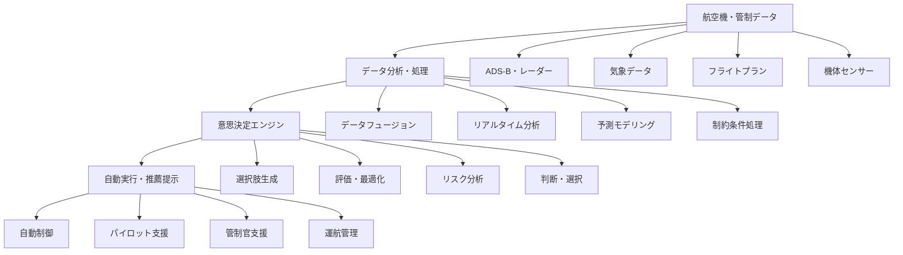

# 航空関連 意思決定支援ソフトウェア

!!! info "このページについて"
    このページでは、航空分野で使用される意思決定支援ソフトウェアについて詳しく解説します。状況認識システムが「情報の提示・可視化」に重点を置くのに対し、意思決定支援システムは「判断・選択・実行」を自動化・支援することに焦点を当てています。フライト計画最適化から自動衝突回避システム、運航管理システムまで、航空安全と効率性を向上させる様々な意思決定支援ソリューションを紹介します。

## 航空意思決定支援ソフトウェアの特徴

航空分野の意思決定支援システムは、瞬時の判断が人命に関わる環境において、最適な選択肢の提示や自動実行を行います。

### 重要な要件と技術実装

| 要件 | 説明 | 技術的実装 | 具体例・ケーススタディ |
|------|------|----------|----------------------|
| **瞬時判断** | ミリ秒単位での意思決定・実行が必要 | リアルタイムアルゴリズム、ハードリアルタイムOS | TCAS（衝突回避システム）：20秒以内での回避指示、パイロットが指示に従い衝突を回避 |
| **自動化** | 人間の反応速度を超える状況での自動判断・実行 | 機械学習、ルールベースエンジン、自動制御システム | オートパイロット：気流変化に対する自動修正、乱気流中でも安定飛行を維持 |
| **最適化** | 複数の制約条件下での最適解選択 | 遺伝的アルゴリズム、線形計画法、制約満足問題解法 | フライト計画最適化：燃料効率・時間・コストを同時最適化し、年間数億円の節約効果 |
| **リスク評価** | 確率的リスクの定量化と意思決定への反映 | ベイジアンネットワーク、モンテカルロシミュレーション | 気象リスク評価：雷雨確率80%時の自動迂回ルート提案により遅延とリスクを最小化 |

### システムアーキテクチャ



## 自動衝突回避システム

### TCAS（Traffic Collision Avoidance System）

TCASは航空機同士の衝突を自動的に検知し、回避機動を指示する意思決定支援システムです。人間の反応速度では対応困難な状況で、自動的に最適な回避行動を決定・指示します。

#### TCAS意思決定ロジック

??? TypeScript実装例
    この TypeScript 実装では、TCAS（衝突回避システム）の意思決定ロジックを構築しています。
    他機との接近状況を分析し、衝突リスクを評価して、最適な回避機動を自動決定・指示します。
    緊急度に応じてTA（交通助言）やRA（回避指示）を生成し、パイロットに即座に伝達します。

    ```typescript
    // TCAS 意思決定支援システム
    interface TCASTarget {
      transponderCode: string;
      relativePosition: RelativePosition;
      relativeVelocity: RelativeVelocity;
      altitude: number;
      verticalRate: number;
      lastUpdate: Date;
      threatLevel: ThreatLevel;
    }

    interface RelativePosition {
      distance: number;        // nautical miles
      bearing: number;         // degrees
      relativeAltitude: number; // feet
    }

    interface RelativeVelocity {
      closure_rate: number;    // knots
      vertical_closure: number; // feet per minute
    }

    enum ThreatLevel {
      NO_THREAT = 0,
      PROXIMITY_ADVISORY = 1,
      TRAFFIC_ADVISORY = 2,
      RESOLUTION_ADVISORY = 3
    }

    interface ResolutionAdvisory {
      type: RAType;
      direction: 'CLIMB' | 'DESCEND' | 'MAINTAIN';
      targetRate: number;      // feet per minute
      urgency: 'PREVENTIVE' | 'CORRECTIVE';
      strengthening?: boolean;
      reversal?: boolean;
      message: string;
    }

    enum RAType {
      CLIMB = 'CLIMB',
      DESCEND = 'DESCEND',
      INCREASE_CLIMB = 'INCREASE_CLIMB',
      INCREASE_DESCENT = 'INCREASE_DESCENT',
      REDUCE_CLIMB = 'REDUCE_CLIMB',
      REDUCE_DESCENT = 'REDUCE_DESCENT',
      MAINTAIN_VERTICAL_SPEED = 'MAINTAIN_VERTICAL_SPEED',
      LEVEL_OFF = 'LEVEL_OFF'
    }

    class TCASDecisionEngine {
      private ownshipData: OwnshipData;
      private targets: Map<string, TCASTarget> = new Map();
      private activeRA?: ResolutionAdvisory;
      private alertSubject = new Subject<TCASAlert>();

      constructor(ownshipData: OwnshipData) {
        this.ownshipData = ownshipData;
        this.setupContinuousMonitoring();
      }

      // 継続的な脅威監視
      private setupContinuousMonitoring(): void {
        interval(1000).pipe( // 1秒間隔での監視
          map(() => this.evaluateAllThreats()),
          filter(threats => threats.length > 0),
          distinctUntilChanged((prev, curr) => this.compareThreats(prev, curr))
        ).subscribe(threats => {
          this.processThreats(threats);
        });
      }

      // 脅威評価・意思決定
      evaluateAllThreats(): TCASTarget[] {
        const threats: TCASTarget[] = [];
        
        for (const [id, target] of this.targets) {
          const threatAssessment = this.assessThreat(target);
          if (threatAssessment.threatLevel > ThreatLevel.NO_THREAT) {
            target.threatLevel = threatAssessment.threatLevel;
            threats.push(target);
          }
        }
        
        return threats.sort((a, b) => b.threatLevel - a.threatLevel);
      }

      // 個別脅威の評価
      private assessThreat(target: TCASTarget): ThreatAssessment {
        // CPA（最接近点）とTCPA（最接近時間）の計算
        const cpaResult = this.calculateCPA(target);
        
        // 脅威判定基準
        const proximityThreshold = 6.0; // nautical miles
        const trafficAdvisoryThreshold = this.calculateTAThreshold(target.altitude);
        const resolutionAdvisoryThreshold = this.calculateRAThreshold(target.altitude);

        let threatLevel = ThreatLevel.NO_THREAT;
        let timeToThreat = Infinity;

        if (cpaResult.tcpa > 0 && cpaResult.tcpa < 120) { // 2分以内
          if (cpaResult.cpa < resolutionAdvisoryThreshold.horizontal && 
              Math.abs(cpaResult.verticalSeparation) < resolutionAdvisoryThreshold.vertical) {
            threatLevel = ThreatLevel.RESOLUTION_ADVISORY;
            timeToThreat = cpaResult.tcpa;
          } else if (cpaResult.cpa < trafficAdvisoryThreshold.horizontal && 
                     Math.abs(cpaResult.verticalSeparation) < trafficAdvisoryThreshold.vertical) {
            threatLevel = ThreatLevel.TRAFFIC_ADVISORY;
            timeToThreat = cpaResult.tcpa;
          } else if (cpaResult.cpa < proximityThreshold) {
            threatLevel = ThreatLevel.PROXIMITY_ADVISORY;
            timeToThreat = cpaResult.tcpa;
          }
        }

        return {
          threatLevel,
          timeToThreat,
          cpaResult,
          recommendedAction: this.determineRecommendedAction(threatLevel, cpaResult, target)
        };
      }

      // CPA（最接近点）計算
      private calculateCPA(target: TCASTarget): CPAResult {
        const ownVelocity = this.ownshipData.velocity;
        const targetVelocity = this.calculateTargetVelocity(target);
        
        // 相対位置・速度ベクトル
        const relativePosition = {
          x: target.relativePosition.distance * Math.cos(target.relativePosition.bearing * Math.PI / 180),
          y: target.relativePosition.distance * Math.sin(target.relativePosition.bearing * Math.PI / 180),
          z: target.relativePosition.relativeAltitude
        };
        
        const relativeVelocity = {
          x: targetVelocity.x - ownVelocity.x,
          y: targetVelocity.y - ownVelocity.y,
          z: target.verticalRate - this.ownshipData.verticalRate
        };

        // TCPA（最接近時間）計算
        const tcpa = -(relativePosition.x * relativeVelocity.x + 
                       relativePosition.y * relativeVelocity.y + 
                       relativePosition.z * relativeVelocity.z) /
                     (relativeVelocity.x * relativeVelocity.x + 
                      relativeVelocity.y * relativeVelocity.y + 
                      relativeVelocity.z * relativeVelocity.z);

        // CPA（最接近距離）計算
        const cpaPosition = {
          x: relativePosition.x + relativeVelocity.x * tcpa,
          y: relativePosition.y + relativeVelocity.y * tcpa,
          z: relativePosition.z + relativeVelocity.z * tcpa
        };

        const horizontalCPA = Math.sqrt(cpaPosition.x * cpaPosition.x + cpaPosition.y * cpaPosition.y);
        const verticalSeparation = Math.abs(cpaPosition.z);

        return {
          tcpa: tcpa,
          cpa: horizontalCPA,
          verticalSeparation: verticalSeparation,
          cpaPosition
        };
      }

      // 回避機動の決定
      generateResolutionAdvisory(threat: TCASTarget): ResolutionAdvisory {
        const cpaResult = this.calculateCPA(threat);
        const ownVerticalRate = this.ownshipData.verticalRate;
        const threatVerticalRate = threat.verticalRate;
        
        // 垂直方向の相対運動を分析
        const relativeVerticalVelocity = threatVerticalRate - ownVerticalRate;
        const verticalSeparation = threat.relativePosition.relativeAltitude;

        // 回避方向の決定ロジック
        let recommendedDirection: 'CLIMB' | 'DESCEND';
        let targetRate: number;
        let urgency: 'PREVENTIVE' | 'CORRECTIVE';

        // 高度差と相対速度に基づく判定
        if (verticalSeparation > 0) {
          // 脅威が上方にある場合
          if (relativeVerticalVelocity > 0) {
            // 脅威が上昇中または自機が降下中
            recommendedDirection = 'DESCEND';
            urgency = 'CORRECTIVE';
            targetRate = Math.max(-2500, ownVerticalRate - 1500); // 最低2500fpm降下
          } else {
            // 脅威が降下中または自機が上昇中
            recommendedDirection = 'CLIMB';
            urgency = 'PREVENTIVE';
            targetRate = Math.min(2500, ownVerticalRate + 1500); // 最大2500fpm上昇
          }
        } else {
          // 脅威が下方にある場合
          if (relativeVerticalVelocity < 0) {
            // 脅威が降下中または自機が上昇中
            recommendedDirection = 'CLIMB';
            urgency = 'CORRECTIVE';
            targetRate = Math.min(2500, ownVerticalRate + 1500);
          } else {
            // 脅威が上昇中または自機が降下中
            recommendedDirection = 'DESCEND';
            urgency = 'PREVENTIVE';
            targetRate = Math.max(-2500, ownVerticalRate - 1500);
          }
        }

        // 既存のRAとの整合性チェック
        if (this.activeRA) {
          const consistency = this.checkRAConsistency(recommendedDirection, this.activeRA);
          if (!consistency.consistent) {
            // 強化または反転が必要
            return this.modifyExistingRA(this.activeRA, consistency.modification);
          }
        }

        const raType = this.determineRAType(recommendedDirection, targetRate, ownVerticalRate);

        return {
          type: raType,
          direction: recommendedDirection,
          targetRate: targetRate,
          urgency: urgency,
          strengthening: false,
          reversal: false,
          message: this.generateRAMessage(raType, recommendedDirection, urgency)
        };
      }

      // RA実行・監視
      executeResolutionAdvisory(ra: ResolutionAdvisory): void {
        this.activeRA = ra;
        
        // パイロットへの即座の通知
        this.alertSubject.next({
          type: 'RESOLUTION_ADVISORY',
          severity: 'CRITICAL',
          message: ra.message,
          advisoryData: ra,
          timestamp: new Date()
        });

        // RA実行の監視
        this.monitorRACompliance(ra);
        
        // オートパイロットへの指示（統合システムの場合）
        if (this.ownshipData.autopilotEngaged) {
          this.sendAutopilotCommand(ra);
        }
      }

      // RA実行監視
      private monitorRACompliance(ra: ResolutionAdvisory): void {
        const monitoringSubscription = interval(500).pipe(
          map(() => this.checkRACompliance(ra)),
          takeUntil(this.alertSubject.pipe(filter(alert => alert.type === 'RA_CLEAR')))
        ).subscribe(compliance => {
          if (!compliance.compliant) {
            this.enhanceRA(ra, compliance.reason);
          } else if (compliance.threatCleared) {
            this.clearResolutionAdvisory();
          }
        });
      }

      // RA解除判定
      private clearResolutionAdvisory(): void {
        if (this.activeRA) {
          this.alertSubject.next({
            type: 'RA_CLEAR',
            severity: 'INFO',
            message: 'CLEAR OF CONFLICT',
            timestamp: new Date()
          });
          
          this.activeRA = undefined;
        }
      }

      // TCASアラートのストリーム
      getAlertStream(): Observable<TCASAlert> {
        return this.alertSubject.asObservable();
      }

      // システム統計情報
      getSystemStatistics(): TCASStatistics {
        return {
          activeTargets: this.targets.size,
          threatsDetected: Array.from(this.targets.values()).filter(t => t.threatLevel > 0).length,
          activeRA: this.activeRA !== undefined,
          systemStatus: this.getSystemStatus(),
          lastUpdate: new Date()
        };
      }
    }

    interface CPAResult {
      tcpa: number;           // Time to CPA (seconds)
      cpa: number;            // Closest Point of Approach (nautical miles)
      verticalSeparation: number; // feet
      cpaPosition: { x: number; y: number; z: number };
    }

    interface ThreatAssessment {
      threatLevel: ThreatLevel;
      timeToThreat: number;
      cpaResult: CPAResult;
      recommendedAction: string;
    }

    interface TCASAlert {
      type: 'PROXIMITY_ADVISORY' | 'TRAFFIC_ADVISORY' | 'RESOLUTION_ADVISORY' | 'RA_CLEAR';
      severity: 'INFO' | 'WARNING' | 'CRITICAL';
      message: string;
      advisoryData?: ResolutionAdvisory;
      timestamp: Date;
    }

    interface TCASStatistics {
      activeTargets: number;
      threatsDetected: number;
      activeRA: boolean;
      systemStatus: SystemStatus;
      lastUpdate: Date;
    }
    ```

## フライト計画最適化システム

### 多目的最適化エンジン

フライト計画最適化システムは、燃料効率、飛行時間、コスト、安全性など複数の目標を同時に最適化する意思決定支援システムです。

??? TypeScript実装例
    この TypeScript 実装では、フライト計画の多目的最適化を行います。
    燃料効率、飛行時間、気象リスク、コストなど複数の目標を同時に考慮し、
    遺伝的アルゴリズムやシミュレーテッドアニーリングを用いて最適解を探索します。

    ```typescript
    // フライト計画最適化システム
    interface FlightPlan {
      flightId: string;
      origin: Airport;
      destination: Airport;
      aircraft: AircraftType;
      departureTime: Date;
      route: Waypoint[];
      altitude: number[];
      speed: number[];
      estimatedFuelConsumption: number;
      estimatedFlightTime: number;
      estimatedCost: number;
      weatherRisk: number;
      trafficComplexity: number;
    }

    interface OptimizationObjectives {
      minimizeFuelConsumption: { weight: number; priority: number };
      minimizeFlightTime: { weight: number; priority: number };
      minimizeCost: { weight: number; priority: number };
      minimizeWeatherRisk: { weight: number; priority: number };
      maximizeSafety: { weight: number; priority: number };
      minimizeEmissions: { weight: number; priority: number };
    }

    interface OptimizationConstraints {
      maxFlightTime?: number;
      maxFuelBudget?: number;
      maxCostBudget?: number;
      mandatoryWaypoints?: Waypoint[];
      avoidanceZones?: AvoidanceZone[];
      altitudeRestrictions?: AltitudeRestriction[];
      timeConstraints?: TimeConstraint[];
      weatherLimitations?: WeatherLimitation[];
    }

    class FlightPlanOptimizer {
      private geneticAlgorithm: GeneticAlgorithmEngine;
      private simulatedAnnealing: SimulatedAnnealingEngine;
      private weatherService: WeatherService;
      private trafficService: TrafficService;
      private performanceModels: Map<string, AircraftPerformanceModel>;

      constructor() {
        this.geneticAlgorithm = new GeneticAlgorithmEngine();
        this.simulatedAnnealing = new SimulatedAnnealingEngine();
        this.weatherService = new WeatherService();
        this.trafficService = new TrafficService();
        this.performanceModels = new Map();
        this.initializePerformanceModels();
      }

      // メインの最適化プロセス
      async optimizeFlightPlan(
        basicPlan: BasicFlightPlan,
        objectives: OptimizationObjectives,
        constraints: OptimizationConstraints
      ): Promise<OptimizedFlightPlan> {
        // 初期解の生成
        const initialSolutions = await this.generateInitialSolutions(basicPlan, constraints);
        
        // 並列最適化実行
        const optimizationResults = await Promise.all([
          this.runGeneticOptimization(initialSolutions, objectives, constraints),
          this.runSimulatedAnnealingOptimization(initialSolutions[0], objectives, constraints),
          this.runDeterministicOptimization(basicPlan, objectives, constraints)
        ]);

        // 最良解の選択
        const bestSolution = this.selectBestSolution(optimizationResults, objectives);
        
        // 解の検証・改良
        const validatedSolution = await this.validateAndRefine(bestSolution, constraints);
        
        // パフォーマンス予測
        const performancePrediction = await this.predictPerformance(validatedSolution);

        return {
          optimizedPlan: validatedSolution,
          performancePrediction,
          optimizationMetrics: this.calculateOptimizationMetrics(basicPlan, validatedSolution),
          alternativePlans: optimizationResults.slice(1, 4), // 上位代替案
          confidence: this.calculateConfidence(validatedSolution),
          sensitivityAnalysis: await this.performSensitivityAnalysis(validatedSolution)
        };
      }

      // 遺伝的アルゴリズムによる最適化
      private async runGeneticOptimization(
        initialSolutions: FlightPlan[],
        objectives: OptimizationObjectives,
        constraints: OptimizationConstraints
      ): Promise<FlightPlan> {
        const gaConfig = {
          populationSize: 100,
          generations: 200,
          crossoverRate: 0.8,
          mutationRate: 0.02,
          eliteSize: 10,
          convergenceThreshold: 0.001
        };

        return new Promise((resolve) => {
          const population = this.initializePopulation(initialSolutions, gaConfig.populationSize);
          let bestSolution = population[0];
          let bestFitness = -Infinity;
          let convergenceCounter = 0;

          for (let generation = 0; generation < gaConfig.generations; generation++) {
            // 評価
            const evaluatedPopulation = population.map(individual => ({
              plan: individual,
              fitness: this.evaluateFitness(individual, objectives)
            }));

            // 選択
            evaluatedPopulation.sort((a, b) => b.fitness - a.fitness);
            const currentBest = evaluatedPopulation[0];

            if (currentBest.fitness > bestFitness) {
              bestFitness = currentBest.fitness;
              bestSolution = currentBest.plan;
              convergenceCounter = 0;
            } else {
              convergenceCounter++;
            }

            // 収束判定
            if (convergenceCounter > 20) break;

            // 次世代生成
            const nextGeneration: FlightPlan[] = [];
            
            // エリート保存
            for (let i = 0; i < gaConfig.eliteSize; i++) {
              nextGeneration.push(evaluatedPopulation[i].plan);
            }

            // 交叉・突然変異
            while (nextGeneration.length < gaConfig.populationSize) {
              const parent1 = this.selectParent(evaluatedPopulation);
              const parent2 = this.selectParent(evaluatedPopulation);
              
              if (Math.random() < gaConfig.crossoverRate) {
                const offspring = this.crossover(parent1, parent2);
                if (Math.random() < gaConfig.mutationRate) {
                  this.mutate(offspring, constraints);
                }
                nextGeneration.push(offspring);
              }
            }

            population.splice(0, population.length, ...nextGeneration);
          }

          resolve(bestSolution);
        });
      }

      // 適応度評価関数
      private evaluateFitness(plan: FlightPlan, objectives: OptimizationObjectives): number {
        const metrics = this.calculatePlanMetrics(plan);
        let totalFitness = 0;

        // 各目標の正規化された値を計算
        const normalizedFuel = 1 - (metrics.fuelConsumption / metrics.maxExpectedFuel);
        const normalizedTime = 1 - (metrics.flightTime / metrics.maxExpectedTime);
        const normalizedCost = 1 - (metrics.totalCost / metrics.maxExpectedCost);
        const normalizedSafety = metrics.safetyScore; // 0-1 で既に正規化済み
        const normalizedWeatherRisk = 1 - metrics.weatherRisk; // 0-1 で既に正規化済み

        // 重み付き合計
        totalFitness += normalizedFuel * objectives.minimizeFuelConsumption.weight;
        totalFitness += normalizedTime * objectives.minimizeFlightTime.weight;
        totalFitness += normalizedCost * objectives.minimizeCost.weight;
        totalFitness += normalizedSafety * objectives.maximizeSafety.weight;
        totalFitness += normalizedWeatherRisk * objectives.minimizeWeatherRisk.weight;

        // 制約違反ペナルティ
        const constraintViolations = this.checkConstraintViolations(plan);
        const penaltyFactor = Math.exp(-constraintViolations.totalViolationScore);

        return totalFitness * penaltyFactor;
      }

      // リアルタイム再最適化
      async reoptimizeInFlight(
        currentPlan: FlightPlan,
        currentPosition: Position,
        updatedConditions: UpdatedConditions
      ): Promise<ReoptimizationResult> {
        // 現在位置からの残り航路を抽出
        const remainingRoute = this.extractRemainingRoute(currentPlan, currentPosition);
        
        // 更新された条件を反映
        const updatedObjectives = this.updateObjectives(currentPlan, updatedConditions);
        const updatedConstraints = this.updateConstraints(currentPlan, updatedConditions);

        // 高速再最適化（限定的探索）
        const reoptimizedRoute = await this.fastReoptimization(
          remainingRoute,
          updatedObjectives,
          updatedConstraints
        );

        // 変更の妥当性評価
        const changeAssessment = this.assessRouteChange(currentPlan, reoptimizedRoute);
        
        if (changeAssessment.beneficial && changeAssessment.feasible) {
          return {
            recommendedChange: true,
            newRoute: reoptimizedRoute,
            benefits: changeAssessment.benefits,
            implementationSteps: this.generateImplementationSteps(reoptimizedRoute),
            urgency: changeAssessment.urgency
          };
        } else {
          return {
            recommendedChange: false,
            reason: changeAssessment.reason,
            alternativeOptions: changeAssessment.alternatives
          };
        }
      }

      // 燃料最適化特化
      optimizeFuelEfficiency(plan: FlightPlan): Promise<FuelOptimizationResult> {
        return new Promise(async (resolve) => {
          // 高度プロファイル最適化
          const optimalAltitudes = await this.optimizeAltitudeProfile(plan);
          
          // 速度プロファイル最適化
          const optimalSpeeds = await this.optimizeSpeedProfile(plan, optimalAltitudes);
          
          // ルート微調整
          const optimalRoute = await this.optimizeRouteForFuel(plan, optimalAltitudes, optimalSpeeds);

          // 燃料節約量計算
          const fuelSavings = this.calculateFuelSavings(plan, {
            altitudes: optimalAltitudes,
            speeds: optimalSpeeds,
            route: optimalRoute
          });

          resolve({
            optimizedAltitudes: optimalAltitudes,
            optimizedSpeeds: optimalSpeeds,
            optimizedRoute: optimalRoute,
            fuelSavings: fuelSavings,
            implementationCost: this.calculateImplementationCost(plan, optimalRoute),
            environmentalBenefit: this.calculateEnvironmentalBenefit(fuelSavings)
          });
        });
      }

      // 機械学習による予測改善
      async improveWithMachineLearning(
        historicalData: FlightPlanHistory[],
        actualPerformance: ActualPerformanceData[]
      ): Promise<ModelImprovement> {
        // フライト性能予測モデルの学習
        const performanceModel = await this.trainPerformanceModel(historicalData, actualPerformance);
        
        // 気象影響予測モデルの学習
        const weatherImpactModel = await this.trainWeatherImpactModel(historicalData, actualPerformance);
        
        // 最適化アルゴリズムのパラメータ調整
        const optimizedParameters = await this.optimizeAlgorithmParameters(historicalData);

        // モデル性能評価
        const modelValidation = await this.validateModels(performanceModel, weatherImpactModel);

        return {
          performanceModel,
          weatherImpactModel,
          optimizedParameters,
          validation: modelValidation,
          expectedImprovement: this.calculateExpectedImprovement(modelValidation),
          deploymentRecommendation: modelValidation.accuracy > 0.85
        };
      }

      // 運航実績フィードバック
      processFeedback(
        plannedRoute: FlightPlan,
        actualFlight: ActualFlightData
      ): Observable<OptimizationInsight> {
        return new Subject<OptimizationInsight>().pipe(
          map(() => {
            // 予測と実績の比較
            const deviationAnalysis = this.analyzeDeviations(plannedRoute, actualFlight);
            
            // 改善ポイントの特定
            const improvementAreas = this.identifyImprovementAreas(deviationAnalysis);
            
            // 次回最適化への反映事項
            const optimizationAdjustments = this.generateOptimizationAdjustments(improvementAreas);

            return {
              flightId: plannedRoute.flightId,
              deviationAnalysis,
              improvementAreas,
              optimizationAdjustments,
              modelUpdateRequired: deviationAnalysis.significantDeviation,
              learningPriority: this.calculateLearningPriority(deviationAnalysis)
            };
          })
        );
      }
    }

    interface OptimizedFlightPlan {
      optimizedPlan: FlightPlan;
      performancePrediction: PerformancePrediction;
      optimizationMetrics: OptimizationMetrics;
      alternativePlans: FlightPlan[];
      confidence: number;
      sensitivityAnalysis: SensitivityAnalysis;
    }

    interface ReoptimizationResult {
      recommendedChange: boolean;
      newRoute?: FlightPlan;
      benefits?: OptimizationBenefits;
      implementationSteps?: ImplementationStep[];
      urgency?: 'LOW' | 'MEDIUM' | 'HIGH' | 'CRITICAL';
      reason?: string;
      alternativeOptions?: FlightPlan[];
    }

    interface FuelOptimizationResult {
      optimizedAltitudes: number[];
      optimizedSpeeds: number[];
      optimizedRoute: Waypoint[];
      fuelSavings: FuelSavings;
      implementationCost: ImplementationCost;
      environmentalBenefit: EnvironmentalBenefit;
    }

    interface OptimizationInsight {
      flightId: string;
      deviationAnalysis: DeviationAnalysis;
      improvementAreas: ImprovementArea[];
      optimizationAdjustments: OptimizationAdjustment[];
      modelUpdateRequired: boolean;
      learningPriority: number;
    }
    ```

## 運航管理・リソース最適化システム

### 統合運航管理システム（IOC）

統合運航管理システムは、航空会社全体の運航リソース（航空機、乗務員、空港スロット等）を最適化する意思決定支援システムです。

??? TypeScript実装例
    この TypeScript 実装では、統合運航管理システム（IOC）を構築しています。
    航空機、乗務員、空港スロットなどのリソースを最適配分し、
    遅延や欠航を最小化しながら効率的な運航を実現します。

    ```typescript
    // 統合運航管理システム
    interface OperationalResource {
      id: string;
      type: ResourceType;
      availability: AvailabilityWindow[];
      capabilities: ResourceCapability[];
      location: Airport;
      status: ResourceStatus;
      constraints: ResourceConstraint[];
    }

    enum ResourceType {
      AIRCRAFT = 'aircraft',
      CREW = 'crew',
      GATE = 'gate',
      SLOT = 'slot',
      GROUND_EQUIPMENT = 'ground_equipment'
    }

    interface Flight {
      flightNumber: string;
      origin: Airport;
      destination: Airport;
      scheduledDeparture: Date;
      scheduledArrival: Date;
      aircraftType: string;
      passengerCount: number;
      requiredResources: ResourceRequirement[];
      status: FlightStatus;
      delays: Delay[];
      alternatives: AlternativeFlight[];
    }

    interface OperationalDisruption {
      id: string;
      type: DisruptionType;
      severity: DisruptionSeverity;
      affectedResources: string[];
      affectedFlights: string[];
      startTime: Date;
      estimatedEndTime?: Date;
      cause: string;
      impact: DisruptionImpact;
    }

    enum DisruptionType {
      WEATHER = 'weather',
      TECHNICAL = 'technical',
      CREW_SHORTAGE = 'crew_shortage',
      AIRPORT_CLOSURE = 'airport_closure',
      AIR_TRAFFIC_CONTROL = 'atc',
      STRIKE = 'strike'
    }

    class IntegratedOperationsCenter {
      private resourceManager: ResourceManager;
      private scheduleOptimizer: ScheduleOptimizer;
      private disruptionManager: DisruptionManager;
      private crewManager: CrewManager;
      private fleetManager: FleetManager;
      private alertSystem: OperationalAlertSystem;

      constructor() {
        this.resourceManager = new ResourceManager();
        this.scheduleOptimizer = new ScheduleOptimizer();
        this.disruptionManager = new DisruptionManager();
        this.crewManager = new CrewManager();
        this.fleetManager = new FleetManager();
        this.alertSystem = new OperationalAlertSystem();
        this.setupRealTimeMonitoring();
      }

      // リアルタイム運航監視
      private setupRealTimeMonitoring(): void {
        // フライト状況の監視
        interval(60000).pipe( // 1分間隔
          mergeMap(() => this.monitorAllFlights()),
          filter(issues => issues.length > 0)
        ).subscribe(issues => {
          this.handleOperationalIssues(issues);
        });

        // リソース状況の監視
        interval(30000).pipe( // 30秒間隔
          mergeMap(() => this.monitorAllResources()),
          filter(alerts => alerts.length > 0)
        ).subscribe(alerts => {
          this.processResourceAlerts(alerts);
        });

        // 予測的問題検知
        interval(300000).pipe( // 5分間隔
          mergeMap(() => this.predictOperationalProblems())
        ).subscribe(predictions => {
          this.handlePredictiveAlerts(predictions);
        });
      }

      // 運航スケジュール最適化
      async optimizeOperationalSchedule(
        timeWindow: TimeWindow,
        constraints: OperationalConstraints
      ): Promise<OptimizedSchedule> {
        // 現在のスケジュール状況を取得
        const currentSchedule = await this.getCurrentSchedule(timeWindow);
        
        // 利用可能リソースの分析
        const resourceAvailability = await this.analyzeResourceAvailability(timeWindow);
        
        // 制約条件の処理
        const processedConstraints = this.processConstraints(constraints, resourceAvailability);
        
        // 最適化問題として定式化
        const optimizationProblem = this.formulateOptimizationProblem(
          currentSchedule,
          resourceAvailability,
          processedConstraints
        );

        // 最適化実行
        const optimizationResult = await this.solveOptimizationProblem(optimizationProblem);
        
        // 実行可能性検証
        const feasibilityCheck = await this.validateScheduleFeasibility(optimizationResult);
        
        if (feasibilityCheck.feasible) {
          return {
            optimizedSchedule: optimizationResult.schedule,
            resourceAllocation: optimizationResult.allocation,
            improvementMetrics: this.calculateImprovements(currentSchedule, optimizationResult.schedule),
            implementationPlan: this.createImplementationPlan(optimizationResult),
            riskAssessment: this.assessImplementationRisks(optimizationResult)
          };
        } else {
          // 実行不可能な場合の代替案生成
          return this.generateFallbackSchedule(currentSchedule, feasibilityCheck.issues);
        }
      }

      // 運航障害対応
      async handleOperationalDisruption(disruption: OperationalDisruption): Promise<DisruptionResponse> {
        // 影響分析
        const impactAnalysis = await this.analyzeDisruptionImpact(disruption);
        
        // 対応策の生成
        const responseOptions = await this.generateResponseOptions(disruption, impactAnalysis);
        
        // 最適な対応策の選択
        const optimalResponse = this.selectOptimalResponse(responseOptions, impactAnalysis);
        
        // 実行計画の作成
        const executionPlan = await this.createExecutionPlan(optimalResponse);
        
        // ステークホルダーへの通知
        const notifications = this.generateNotifications(disruption, optimalResponse);
        
        // 実行開始
        const execution = await this.executeResponse(executionPlan);

        return {
          disruption,
          impactAnalysis,
          selectedResponse: optimalResponse,
          executionPlan,
          notifications,
          execution,
          followUpActions: this.defineFollowUpActions(disruption, optimalResponse)
        };
      }

      // 乗務員スケジューling最適化
      optimizeCrewScheduling(
        flights: Flight[],
        crewAvailability: CrewAvailability[],
        regulations: CrewRegulations
      ): Promise<OptimizedCrewSchedule> {
        return new Promise(async (resolve) => {
          // 乗務員要件の分析
          const crewRequirements = this.analyzeCrewRequirements(flights);
          
          // 法的制約の処理
          const legalConstraints = this.processCrewRegulations(regulations);
          
          // 最適配置アルゴリズム
          const assignment = await this.runCrewAssignmentOptimization({
            requirements: crewRequirements,
            availability: crewAvailability,
            constraints: legalConstraints
          });

          // 配置の検証
          const validation = this.validateCrewAssignment(assignment, legalConstraints);
          
          if (validation.valid) {
            resolve({
              assignment: assignment.schedule,
              coverage: assignment.coverage,
              efficiency: this.calculateCrewEfficiency(assignment),
              complianceStatus: validation.compliance,
              costAnalysis: this.calculateCrewCosts(assignment),
              riskFactors: this.identifyCrewRisks(assignment)
            });
          } else {
            // 制約違反の解決
            const adjustedAssignment = await this.resolveCrewConstraintViolations(assignment, validation);
            resolve(adjustedAssignment);
          }
        });
      }

      // 航空機配置最適化
      async optimizeAircraftAssignment(): Promise<FleetOptimizationResult> {
        // 現在の航空機状況
        const fleetStatus = await this.fleetManager.getCurrentFleetStatus();
        
        // フライトスケジュール要件
        const flightRequirements = await this.getFlightRequirements();
        
        // メンテナンス計画
        const maintenanceSchedule = await this.fleetManager.getMaintenanceSchedule();
        
        // 最適配置計算
        const optimization = await this.runFleetOptimization({
          fleetStatus,
          flightRequirements,
          maintenanceSchedule,
          operationalConstraints: this.getFleetConstraints()
        });

        // 配置変更の実行可能性評価
        const feasibility = this.evaluateFleetChangeFeasibility(optimization);
        
        return {
          optimalAssignment: optimization.assignment,
          utilizationImprovement: optimization.utilizationGain,
          costSavings: optimization.costReduction,
          feasibility,
          implementationTimeline: this.createFleetChangeTimeline(optimization),
          riskMitigation: this.planFleetChangeRisks(optimization)
        };
      }

      // 予測的運航分析
      async predictOperationalPerformance(
        forecastHorizon: number // hours
      ): Promise<OperationalForecast> {
        // 気象予測の取得
        const weatherForecast = await this.getWeatherForecast(forecastHorizon);
        
        // トラフィック予測
        const trafficForecast = await this.getTrafficForecast(forecastHorizon);
        
        // リソース状況予測
        const resourceForecast = await this.forecastResourceAvailability(forecastHorizon);
        
        // 運航パフォーマンス予測
        const performancePrediction = await this.predictPerformanceMetrics({
          weather: weatherForecast,
          traffic: trafficForecast,
          resources: resourceForecast
        });

        // リスク要因の特定
        const riskFactors = this.identifyForecastRisks(performancePrediction);
        
        // 予防的措置の提案
        const preventiveMeasures = this.suggestPreventiveMeasures(riskFactors);

        return {
          forecastPeriod: { start: new Date(), hours: forecastHorizon },
          performancePrediction,
          riskFactors,
          preventiveMeasures,
          confidence: this.calculateForecastConfidence(performancePrediction),
          recommendations: this.generateOperationalRecommendations(performancePrediction, riskFactors)
        };
      }

      // KPI監視・報告
      generateOperationalKPIs(): Observable<OperationalKPIs> {
        return interval(3600000).pipe( // 1時間間隔
          map(() => {
            const currentTime = new Date();
            const last24Hours = new Date(currentTime.getTime() - 24 * 60 * 60 * 1000);
            
            return {
              timestamp: currentTime,
              onTimePerformance: this.calculateOnTimePerformance(last24Hours, currentTime),
              utilizationRates: this.calculateUtilizationRates(last24Hours, currentTime),
              costEfficiency: this.calculateCostEfficiency(last24Hours, currentTime),
              customerSatisfaction: this.estimateCustomerSatisfaction(last24Hours, currentTime),
              resourceEfficiency: this.calculateResourceEfficiency(last24Hours, currentTime),
              environmentalImpact: this.calculateEnvironmentalImpact(last24Hours, currentTime),
              safetyMetrics: this.calculateSafetyMetrics(last24Hours, currentTime),
              profitability: this.calculateProfitability(last24Hours, currentTime)
            };
          })
        );
      }

      // 意思決定支援ダッシュボード
      getDecisionSupportData(): Observable<DecisionSupportData> {
        return combineLatest([
          this.getCurrentOperationalStatus(),
          this.getActiveDisruptions(),
          this.getPendingDecisions(),
          this.getResourceConstraints(),
          this.getPerformanceAlerts()
        ]).pipe(
          map(([status, disruptions, decisions, constraints, alerts]) => ({
            operationalStatus: status,
            activeDisruptions: disruptions,
            pendingDecisions: decisions,
            resourceConstraints: constraints,
            performanceAlerts: alerts,
            decisionRecommendations: this.generateDecisionRecommendations({
              status, disruptions, decisions, constraints, alerts
            }),
            priorityActions: this.identifyPriorityActions({
              status, disruptions, decisions, constraints, alerts
            })
          }))
        );
      }
    }

    interface OptimizedSchedule {
      optimizedSchedule: Flight[];
      resourceAllocation: ResourceAllocation[];
      improvementMetrics: ImprovementMetrics;
      implementationPlan: ImplementationPlan;
      riskAssessment: RiskAssessment;
    }

    interface DisruptionResponse {
      disruption: OperationalDisruption;
      impactAnalysis: ImpactAnalysis;
      selectedResponse: ResponseOption;
      executionPlan: ExecutionPlan;
      notifications: Notification[];
      execution: ExecutionStatus;
      followUpActions: FollowUpAction[];
    }

    interface OptimizedCrewSchedule {
      assignment: CrewAssignment[];
      coverage: CoverageAnalysis;
      efficiency: EfficiencyMetrics;
      complianceStatus: ComplianceStatus;
      costAnalysis: CostAnalysis;
      riskFactors: RiskFactor[];
    }

    interface OperationalForecast {
      forecastPeriod: { start: Date; hours: number };
      performancePrediction: PerformancePrediction;
      riskFactors: RiskFactor[];
      preventiveMeasures: PreventiveMeasure[];
      confidence: number;
      recommendations: OperationalRecommendation[];
    }

    interface OperationalKPIs {
      timestamp: Date;
      onTimePerformance: number;
      utilizationRates: UtilizationRates;
      costEfficiency: CostEfficiencyMetrics;
      customerSatisfaction: number;
      resourceEfficiency: ResourceEfficiencyMetrics;
      environmentalImpact: EnvironmentalMetrics;
      safetyMetrics: SafetyMetrics;
      profitability: ProfitabilityMetrics;
    }
    ```

## 気象意思決定支援システム

### 気象リスク評価・回避システム

航空気象の分析と、それに基づく運航意思決定を支援するシステムです。

??? TypeScript実装例
    この TypeScript 実装では、気象データの分析と運航意思決定支援を行います。
    雷雨、乱気流、着氷など様々な気象リスクを評価し、
    最適な回避ルートや運航判断を自動提案します。

    ```typescript
    // 気象意思決定支援システム
    interface WeatherCondition {
      type: WeatherType;
      severity: SeverityLevel;
      location: GeographicArea;
      timeRange: TimeRange;
      movement: WeatherMovement;
      confidence: number;
      impact: WeatherImpact;
    }

    enum WeatherType {
      THUNDERSTORM = 'thunderstorm',
      TURBULENCE = 'turbulence',
      ICING = 'icing',
      LOW_VISIBILITY = 'low_visibility',
      STRONG_WINDS = 'strong_winds',
      VOLCANIC_ASH = 'volcanic_ash',
      SANDSTORM = 'sandstorm'
    }

    interface WeatherDecision {
      decisionType: WeatherDecisionType;
      recommendation: string;
      rationale: string;
      alternatives: WeatherAlternative[];
      confidence: number;
      timeConstraint: number; // minutes until decision must be made
      cost: DecisionCost;
      risk: RiskAssessment;
    }

    enum WeatherDecisionType {
      CONTINUE_AS_PLANNED = 'continue',
      ROUTE_DEVIATION = 'deviation',
      ALTITUDE_CHANGE = 'altitude_change',
      DELAY_DEPARTURE = 'delay',
      DIVERT_TO_ALTERNATE = 'divert',
      RETURN_TO_ORIGIN = 'return'
    }

    class WeatherDecisionSupportSystem {
      private weatherAnalyzer: WeatherAnalyzer;
      private flightTracker: FlightTracker;
      private routeOptimizer: RouteOptimizer;
      private riskAssessor: WeatherRiskAssessor;
      private decisionEngine: DecisionEngine;

      constructor() {
        this.weatherAnalyzer = new WeatherAnalyzer();
        this.flightTracker = new FlightTracker();
        this.routeOptimizer = new RouteOptimizer();
        this.riskAssessor = new WeatherRiskAssessor();
        this.decisionEngine = new DecisionEngine();
        this.setupWeatherMonitoring();
      }

      // 気象監視・意思決定の自動化
      private setupWeatherMonitoring(): void {
        // 気象データの継続監視
        interval(300000).pipe( // 5分間隔
          mergeMap(() => this.getLatestWeatherData()),
          distinctUntilChanged((prev, curr) => this.compareWeatherConditions(prev, curr)),
          filter(conditions => this.hasSignificantWeatherChanges(conditions))
        ).subscribe(conditions => {
          this.processWeatherUpdate(conditions);
        });

        // 進行中フライトへの影響評価
        interval(180000).pipe( // 3分間隔
          mergeMap(() => this.evaluateActiveFlights())
        ).subscribe(assessments => {
          assessments.forEach(assessment => {
            if (assessment.requiresDecision) {
              this.generateWeatherDecision(assessment);
            }
          });
        });
      }

      // 天候に基づく運航判断
      async makeWeatherDecision(
        flight: FlightInfo,
        weatherConditions: WeatherCondition[],
        operationalConstraints: OperationalConstraints
      ): Promise<WeatherDecision> {
        // 気象影響分析
        const weatherImpact = await this.analyzeWeatherImpact(flight, weatherConditions);
        
        // リスク評価
        const riskAssessment = await this.assessWeatherRisk(flight, weatherImpact);
        
        // 実行可能な選択肢の生成
        const alternatives = await this.generateWeatherAlternatives(flight, weatherConditions, operationalConstraints);
        
        // 各選択肢の評価
        const evaluatedAlternatives = await this.evaluateAlternatives(alternatives, riskAssessment);
        
        // 最適な決定の選択
        const optimalDecision = this.selectOptimalDecision(evaluatedAlternatives);
        
        // 決定の妥当性検証
        const validation = await this.validateDecision(optimalDecision, flight, operationalConstraints);

        if (validation.valid) {
          return optimalDecision;
        } else {
          // 修正された決定を生成
          return this.generateModifiedDecision(optimalDecision, validation.issues);
        }
      }

      // 雷雨回避システム
      async generateThunderstormAvoidance(
        flight: FlightInfo,
        thunderstorms: ThunderstormData[]
      ): Promise<AvoidanceRoute> {
        // 雷雨セルの将来位置予測
        const predictedStorms = await this.predictThunderstormMovement(thunderstorms, flight.estimatedRoute);
        
        // 回避ルートの候補生成
        const avoidanceRoutes = this.generateAvoidanceRoutes(flight.currentRoute, predictedStorms);
        
        // 各ルートの評価
        const routeEvaluations = await Promise.all(
          avoidanceRoutes.map(route => this.evaluateAvoidanceRoute(route, flight, predictedStorms))
        );

        // 最適回避ルートの選択
        const optimalRoute = routeEvaluations.reduce((best, current) => 
          current.score > best.score ? current : best
        );

        // 実行可能性と安全性の最終チェック
        const safetyCheck = await this.validateAvoidanceRoute(optimalRoute.route, flight);

        return {
          originalRoute: flight.currentRoute,
          avoidanceRoute: optimalRoute.route,
          avoidanceReason: this.generateAvoidanceReason(predictedStorms),
          fuelImpact: optimalRoute.fuelImpact,
          timeImpact: optimalRoute.timeImpact,
          safetyMargin: safetyCheck.safetyMargin,
          alternativeRoutes: routeEvaluations.slice(1, 3).map(r => r.route),
          updateRequired: this.calculateRouteUpdateTiming(optimalRoute.route, flight)
        };
      }

      // 乱気流回避・対処システム
      async handleTurbulenceDecision(
        flight: FlightInfo,
        turbulenceData: TurbulenceData
      ): Promise<TurbulenceResponse> {
        // 乱気流の強度・範囲分析
        const turbulenceAnalysis = this.analyzeTurbulenceIntensity(turbulenceData);
        
        // 航空機の耐性評価
        const aircraftCapability = this.evaluateAircraftTurbulenceCapability(flight.aircraftType);
        
        // 対処法の決定
        let response: TurbulenceResponse;

        if (turbulenceAnalysis.severity === 'LIGHT' && aircraftCapability.canHandle) {
          // 軽微な乱気流：継続飛行
          response = {
            action: 'CONTINUE_WITH_CAUTION',
            recommendedActions: [
              'シートベルト着用サイン点灯',
              '客室乗務員への注意喚起',
              '速度調整（推奨速度への変更）'
            ],
            speedAdjustment: this.calculateTurbulenceSpeed(flight.aircraftType, turbulenceAnalysis),
            monitoring: 'CONTINUOUS'
          };
        } else if (turbulenceAnalysis.severity === 'MODERATE') {
          // 中程度の乱気流：高度変更検討
          const altitudeOptions = await this.findSmoothAltitudes(flight.currentPosition, turbulenceData);
          
          if (altitudeOptions.length > 0) {
            response = {
              action: 'CHANGE_ALTITUDE',
              recommendedAltitude: altitudeOptions[0].altitude,
              rationale: `より滑らかな飛行のため${altitudeOptions[0].altitude}ftへの変更を推奨`,
              fuelImpact: altitudeOptions[0].fuelImpact,
              timeImpact: altitudeOptions[0].timeImpact,
              alternativeAltitudes: altitudeOptions.slice(1)
            };
          } else {
            response = {
              action: 'CONTINUE_WITH_ENHANCED_PRECAUTIONS',
              recommendedActions: [
                '速度を乱気流貫通速度に調整',
                '客室サービス中断',
                '頻繁な状況評価'
              ]
            };
          }
        } else {
          // 強い乱気流：迂回必須
          const deviationRoute = await this.generateTurbulenceDeviation(flight, turbulenceData);
          response = {
            action: 'DEVIATE_ROUTE',
            deviationRoute: deviationRoute.route,
            deviationReason: '強い乱気流回避のため',
            estimatedDelay: deviationRoute.delay,
            fuelPenalty: deviationRoute.fuelCost,
            safetyBenefit: deviationRoute.safetyImprovement
          };
        }

        return response;
      }

      // 着氷リスク管理
      async manageIcingRisk(
        flight: FlightInfo,
        icingConditions: IcingConditions
      ): Promise<IcingDecision> {
        // 着氷の程度と危険性評価
        const icingRisk = this.assessIcingRisk(icingConditions, flight.aircraftType);
        
        // 防氷システムの能力評価
        const deicingCapability = this.evaluateDeicingCapability(flight.aircraftType, icingConditions);
        
        let decision: IcingDecision;

        if (icingRisk.severity === 'TRACE' && deicingCapability.adequate) {
          // 軽微な着氷：システム作動で継続可能
          decision = {
            action: 'ACTIVATE_DEICING_SYSTEMS',
            systemsToActivate: deicingCapability.recommendedSystems,
            monitoringFrequency: 'EVERY_2_MINUTES',
            fuelImpact: deicingCapability.fuelConsumption,
            continueThreshold: icingRisk.maxAcceptableAccumulation
          };
        } else if (icingRisk.severity === 'LIGHT_TO_MODERATE') {
          // 中程度の着氷：高度変更または迂回
          const escapeOptions = await this.findIcingEscapeRoutes(flight, icingConditions);
          
          decision = {
            action: 'ESCAPE_ICING_CONDITIONS',
            escapeOptions: escapeOptions,
            recommendedOption: escapeOptions[0],
            urgency: 'MODERATE',
            timeConstraint: this.calculateIcingTimeConstraint(icingRisk)
          };
        } else {
          // 重度の着氷：即座の回避必須
          const emergencyEscape = await this.generateEmergencyIcingEscape(flight, icingConditions);
          
          decision = {
            action: 'IMMEDIATE_ESCAPE',
            emergencyRoute: emergencyEscape.route,
            urgency: 'HIGH',
            rationale: '重度着氷条件のため即座の回避が必要',
            nearestAlternateAirport: emergencyEscape.nearestAlternate,
            declareEmergency: icingRisk.severity === 'SEVERE'
          };
        }

        return decision;
      }

      // 総合的な気象意思決定
      async comprehensiveWeatherDecision(
        flight: FlightInfo,
        allWeatherData: ComprehensiveWeatherData
      ): Promise<ComprehensiveWeatherDecision> {
        // 複数の気象要因の統合評価
        const integratedAssessment = await this.integrateWeatherFactors(allWeatherData, flight);
        
        // 優先度付きリスク評価
        const prioritizedRisks = this.prioritizeWeatherRisks(integratedAssessment);
        
        // 包括的な対処戦略
        const strategy = await this.developComprehensiveStrategy(prioritizedRisks, flight);
        
        // 段階的実行計画
        const executionPlan = this.createWeatherExecutionPlan(strategy);
        
        // コンティンジェンシープラン
        const contingencyPlans = await this.developContingencyPlans(strategy, flight);

        return {
          primaryStrategy: strategy,
          executionPlan: executionPlan,
          contingencyPlans: contingencyPlans,
          riskMitigation: this.planRiskMitigation(prioritizedRisks),
          decisionConfidence: this.calculateDecisionConfidence(integratedAssessment),
          reviewPoints: this.defineReviewPoints(strategy, flight),
          communicationPlan: this.createCommunicationPlan(strategy, flight)
        };
      }

      // 気象学習・改善システム
      improveWeatherDecisions(
        historicalDecisions: WeatherDecisionHistory[],
        outcomes: DecisionOutcome[]
      ): Observable<WeatherDecisionImprovement> {
        return new Subject<WeatherDecisionImprovement>().pipe(
          map(() => {
            // 意思決定の精度分析
            const accuracyAnalysis = this.analyzeDecisionAccuracy(historicalDecisions, outcomes);
            
            // パターン学習
            const learnedPatterns = this.extractDecisionPatterns(historicalDecisions, outcomes);
            
            // モデル改善提案
            const modelImprovements = this.suggestModelImprovements(accuracyAnalysis, learnedPatterns);
            
            // 閾値調整
            const thresholdOptimization = this.optimizeDecisionThresholds(historicalDecisions, outcomes);

            return {
              accuracyMetrics: accuracyAnalysis,
              learnedPatterns: learnedPatterns,
              modelImprovements: modelImprovements,
              optimizedThresholds: thresholdOptimization,
              implementationRecommendations: this.generateImplementationRecommendations(modelImprovements)
            };
          })
        );
      }
    }

    interface AvoidanceRoute {
      originalRoute: FlightRoute;
      avoidanceRoute: FlightRoute;
      avoidanceReason: string;
      fuelImpact: FuelImpact;
      timeImpact: TimeImpact;
      safetyMargin: SafetyMargin;
      alternativeRoutes: FlightRoute[];
      updateRequired: RouteUpdateTiming;
    }

    interface TurbulenceResponse {
      action: 'CONTINUE_WITH_CAUTION' | 'CHANGE_ALTITUDE' | 'CONTINUE_WITH_ENHANCED_PRECAUTIONS' | 'DEVIATE_ROUTE';
      recommendedActions?: string[];
      speedAdjustment?: SpeedAdjustment;
      monitoring?: 'CONTINUOUS' | 'FREQUENT' | 'STANDARD';
      recommendedAltitude?: number;
      rationale?: string;
      fuelImpact?: FuelImpact;
      timeImpact?: TimeImpact;
      alternativeAltitudes?: AltitudeOption[];
      deviationRoute?: FlightRoute;
      deviationReason?: string;
      estimatedDelay?: number;
      fuelPenalty?: number;
      safetyBenefit?: SafetyBenefit;
    }

    interface IcingDecision {
      action: 'ACTIVATE_DEICING_SYSTEMS' | 'ESCAPE_ICING_CONDITIONS' | 'IMMEDIATE_ESCAPE';
      systemsToActivate?: DeicingSystem[];
      monitoringFrequency?: string;
      fuelImpact?: number;
      continueThreshold?: number;
      escapeOptions?: EscapeOption[];
      recommendedOption?: EscapeOption;
      urgency?: 'LOW' | 'MODERATE' | 'HIGH' | 'CRITICAL';
      timeConstraint?: number;
      emergencyRoute?: FlightRoute;
      rationale?: string;
      nearestAlternateAirport?: Airport;
      declareEmergency?: boolean;
    }

    interface ComprehensiveWeatherDecision {
      primaryStrategy: WeatherStrategy;
      executionPlan: ExecutionPlan;
      contingencyPlans: ContingencyPlan[];
      riskMitigation: RiskMitigationPlan;
      decisionConfidence: number;
      reviewPoints: ReviewPoint[];
      communicationPlan: CommunicationPlan;
    }
    ```

## 日本の航空意思決定支援システム事例

### 国内航空会社の事例

#### JAL（日本航空）運航管理システム

| システム名 | 機能 | 意思決定支援の特徴 | 導入効果 |
|-----------|------|------------------|----------|
| **JOPS 2.0** | 統合運航管理、フライト計画最適化 | AI による燃料効率最適化、自動遅延対応 | 燃料費年間約10億円削減、定時運航率向上 |
| **FDMS** | フライトデータ監視・分析 | リアルタイム安全リスク評価、予防保全判断 | 整備コスト15%削減、安全性向上 |
| **Weather Decision Support** | 気象判断支援 | 自動気象リスク評価、迂回ルート提案 | 気象による遅延30%削減 |

#### ANA（全日本空輸）意思決定支援

| システム名 | 機能 | 意思決定支援の特徴 | 導入効果 |
|-----------|------|------------------|----------|
| **ATOMS 3.0** | 次世代運航管理システム | 機械学習による需要予測、動的スケジュール最適化 | 運航効率20%向上、収益性改善 |
| **Predictive Maintenance** | 予測保全システム | IoT データに基づく自動整備判断 | 計画外故障50%削減 |
| **Fuel Optimization Engine** | 燃料最適化 | リアルタイム燃料効率計算、自動フライトプラン調整 | CO₂排出量年間5%削減 |

### 日本発の技術・ベンダー

#### 航空電子・計器メーカー

##### 日本航空電子工業（JAE）

??? TypeScript実装例
    ```typescript
    // 日本の航空電子システム統合例
    interface JapaneseAvionicsSystem {
      flightManagement: FlightManagementComputer;
      weatherRadar: WeatherRadarSystem;
      tcas: TCASSystem;
      navigation: NavigationSystem;
    }

    class JapaneseFlightDecisionSystem {
      // 日本の空域特性を考慮した意思決定
      async optimizeJapaneseAirspaceRoute(
        departure: JapaneseAirport,
        arrival: JapaneseAirport,
        constraints: JapaneseAirspaceConstraints
      ): Promise<OptimizedRoute> {
        // 日本特有の制約（自衛隊訓練空域、富士山周辺制限等）
        const japaneseRestrictions = this.getJapaneseAirspaceRestrictions();
        
        // 季節風・台風を考慮した最適化
        const seasonalFactors = await this.getJapaneseSeasonalFactors();
        
        return this.routeOptimizer.optimize({
          airspaceRestrictions: japaneseRestrictions,
          seasonalFactors,
          traditionalRoutes: this.getTraditionalJapaneseRoutes(departure, arrival)
        });
      }
    }
    ```

#### 空港システム・地上支援

##### 三菱電機・NEC・富士通

??? TypeScript実装例
    ```typescript
    // 日本の空港システム統合
    interface JapaneseAirportSystems {
      // 成田・羽田の高密度運用支援
      slotOptimization: SlotOptimizationSystem;
      groundMovement: GroundMovementDecisionSystem;
      weatherIntegration: JapaneseWeatherIntegration;
    }

    class JapaneseAirportDecisionSupport {
      // 日本の空港特性（高密度、台風、雪氷対応）
      async manageJapaneseAirportOperations(): Promise<OperationalDecision> {
        // 高密度運用時の最適化
        const densityOptimization = await this.optimizeHighDensityOperations();
        
        // 自然災害対応
        const disasterResponse = await this.assessNaturalDisasterImpact();
        
        return this.generateIntegratedDecision(densityOptimization, disasterResponse);
      }
    }
    ```

## 技術トレンドと将来展望

### AI・機械学習の統合

#### 次世代航空AI

??? TypeScript実装例
    ```typescript
    // 次世代航空AI意思決定システム
    class NextGenAviationAI {
      private neuralNetworks: Map<string, NeuralNetwork>;
      private reinforcementLearning: ReinforcementLearningAgent;
      private explainableAI: ExplainableAIEngine;

      // 自律的運航判断AI
      async autonomousOperationalDecision(
        context: OperationalContext
      ): Promise<AutonomousDecision> {
        // 多層ニューラルネットワークによる状況分析
        const situationAnalysis = await this.neuralNetworks.get('situation').predict(context);
        
        // 強化学習による最適行動選択
        const optimalAction = await this.reinforcementLearning.selectAction(situationAnalysis);
        
        // 説明可能なAIによる判断根拠生成
        const explanation = await this.explainableAI.explainDecision(optimalAction);

        return {
          decision: optimalAction,
          confidence: optimalAction.confidence,
          explanation: explanation,
          alternativeOptions: optimalAction.alternatives,
          humanReviewRequired: optimalAction.confidence < 0.9
        };
      }

      // 連合学習による改善
      async federatedLearningImprovement(): Promise<ModelImprovement> {
        // 複数航空会社からの学習データ統合（プライバシー保護）
        const federatedModel = await this.trainFederatedModel();
        
        // 知識蒸留による軽量化
        const distilledModel = await this.distillKnowledge(federatedModel);
        
        return {
          improvedModel: distilledModel,
          performanceGain: await this.evaluateImprovement(distilledModel),
          deploymentStrategy: this.planDeployment(distilledModel)
        };
      }
    }
    ```

### エッジコンピューティング・リアルタイム処理

#### 航空機搭載意思決定システム

??? TypeScript実装例
    ```typescript
    // エッジコンピューティング対応意思決定システム
    class EdgeAviationDecisionSystem {
      private edgeComputing: EdgeComputingPlatform;
      private realTimeProcessor: RealTimeProcessor;
      private cloudSync: CloudSynchronization;

      // 機上エッジでの即座判断
      async onboardRealTimeDecision(
        sensorData: SensorData[],
        emergencyLevel: EmergencyLevel
      ): Promise<EmergencyDecision> {
        // エッジでの高速処理
        const analysis = await this.edgeComputing.processLocally(sensorData);
        
        // 緊急度に応じた判断
        if (emergencyLevel === 'CRITICAL') {
          return this.generateImmediateResponse(analysis);
        } else {
          // 地上との連携判断
          return this.coordinateWithGround(analysis);
        }
      }

      // 5G/6G通信活用
      async ultraLowLatencyCommunication(): Promise<CommunicationChannel> {
        return this.establish6GChannel({
          latency: '<1ms',
          reliability: '99.9999%',
          bandwidth: '10Gbps+'
        });
      }
    }
    ```

### 量子コンピューティング応用

#### 量子最適化による航空運用

??? TypeScript実算例
    ```typescript
    // 量子コンピューティング活用（概念実装）
    interface QuantumOptimizationResult {
      optimalSolution: OptimalSolution;
      quantumAdvantage: number;
      classicalComparison: ClassicalSolution;
    }

    class QuantumAviationOptimizer {
      // 量子アニーリングによる大規模最適化
      async quantumFleetOptimization(
        fleetData: FleetData,
        constraints: OperationalConstraints
      ): Promise<QuantumOptimizationResult> {
        // 量子最適化問題への変換
        const quboProblem = this.convertToQUBO(fleetData, constraints);
        
        // 量子アニーリング実行
        const quantumResult = await this.runQuantumAnnealing(quboProblem);
        
        // 古典解との比較
        const classicalResult = await this.runClassicalOptimization(fleetData, constraints);
        
        return {
          optimalSolution: quantumResult.solution,
          quantumAdvantage: quantumResult.quality / classicalResult.quality,
          classicalComparison: classicalResult
        };
      }
    }
    ```

## まとめ

航空分野の意思決定支援ソフトウェアは、人命に関わる重要性から極めて高い信頼性と精度が要求されます。技術の進歩により、AI・機械学習、量子コンピューティング、エッジコンピューティングなどの先端技術が導入され、より高度で自動化された意思決定支援が実現されています。

### 開発時の重要ポイント

1. **安全性最優先**: フェイルセーフ設計、多重冗長化、人間による最終判断
2. **リアルタイム性**: ミリ秒単位での判断・実行、超低遅延通信
3. **説明可能性**: AI判断の根拠明示、規制当局への説明責任
4. **国際標準準拠**: ICAO、FAA、EASA等の国際規格への適合
5. **継続学習**: 運航実績からの学習、精度向上、適応性確保
6. **統合性**: 既存システムとの連携、段階的導入、互換性確保

### 将来展望

- **完全自律運航**: Level 4自動化に向けた段階的発展
- **予測的保全**: IoT・AIによる故障予測、最適保全計画
- **グローバル最適化**: 全世界規模での航空交通最適化
- **環境配慮**: カーボンニュートラルに向けた運航最適化
- **新技術統合**: eVTOL、超音速機などの新しい航空機への対応

航空分野の意思決定支援システムは、技術革新と安全性要求のバランスを取りながら、より効率的で持続可能な航空運用の実現に貢献していくことが期待されます。

## 関連リンク

- [航空関連 状況認識支援ソフトウェア](../aviation-sa-software)
- [状況認識 vs 意思決定システムの特徴比較](../sa-vs-dm-systems)
- [航空分野での状況認識](../../applications/aviation-sa)
- [航空分野での意思決定](../../applications/aviation-dm)
- [AIと将来展望](../../ai-and-future/)

## 参考文献

1. ICAO. (2021). *Guidelines for AI in Aviation*. International Civil Aviation Organization.
2. FAA. (2020). *NextGen Implementation Plan 2021-2025*. Federal Aviation Administration.
3. Eurocontrol. (2021). *Digital European Sky - AI in ATM*. European Organisation for the Safety of Air Navigation.
4. JAL. (2022). *デジタル変革による運航最適化*. 日本航空技術報告書.
5. ANA. (2022). *次世代運航管理システムATOMS 3.0*. 全日本空輸技術レポート.