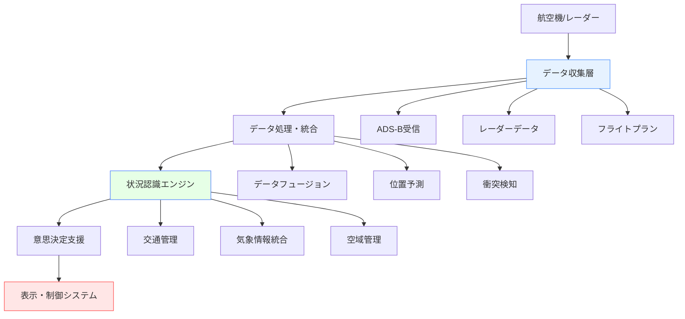
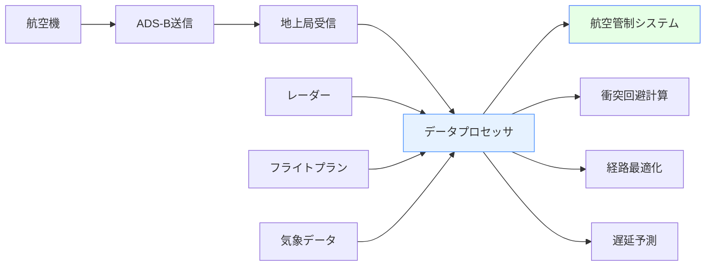
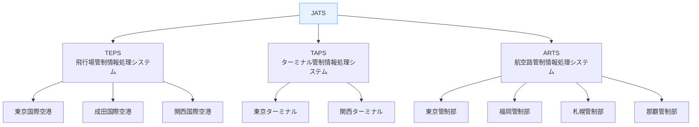

# 航空関連ソフトウェア

!!! info "このページについて"
    このページでは、航空分野で使用される状況認識支援ソフトウェアについて詳しく解説します。フライト追跡システムから航空管制支援ツール、シミュレーター、気象情報システムまで、航空安全と効率性を支える様々なソフトウェアソリューションを紹介します。

## 航空ソフトウェアの特徴

航空分野のソフトウェアは、以下の特殊な要件を満たす必要があります：

### 重要な要件

| 要件 | 説明 | 技術的実装 |
|------|------|----------|
| **リアルタイム性** | 秒単位での状況変化に対応 | 低遅延通信（WebSocket、UDP）<br>イベント駆動アーキテクチャ |
| **高可用性** | 99.9%以上の稼働率 | 冗長化システム<br>フェイルオーバー機構<br>ホットスタンバイ |
| **国際標準準拠** | ICAO、FAA等の規格対応 | 標準化されたデータフォーマット<br>セキュリティプロトコル |
| **3次元表示** | 立体的な空域管理 | 3Dグラフィックス<br>GIS統合<br>WebGL/Three.js |

### アーキテクチャの特徴



## フライト追跡・監視システム

### 一般向けフライト追跡アプリ

#### Flightradar24

| 機能 | 説明 | 技術仕様 |
|------|------|----------|
| **リアルタイム追跡** | 世界中の民間航空機をリアルタイム表示 | ADS-B、MLAT、レーダーデータ統合 |
| **フライト詳細** | 航空機情報、ルート、高度、速度 | RESTful API、WebSocket通信 |
| **AR機能** | スマートフォンカメラ越しに航空機情報表示 | ARCore/ARKit統合 |
| **アラート機能** | 特定フライトの遅延・到着通知 | プッシュ通知、カスタムフィルター |

```typescript
// Flightradar24 API使用例（非公式）
interface FlightData {
  flight_id: string;
  callsign: string;
  latitude: number;
  longitude: number;
  altitude: number;
  speed: number;
  heading: number;
  aircraft_type: string;
}

class FlightTracker {
  async getFlightsInBounds(
    north: number, 
    south: number, 
    east: number, 
    west: number
  ): Promise<FlightData[]> {
    const response = await fetch(
      `https://data-cloud.flightradar24.com/zones/fcgi/feed.js?bounds=${north},${south},${east},${west}`
    );
    return response.json();
  }
}
```

#### FlightAware

| 機能 | 説明 | 特徴 |
|------|------|------|
| **フライト追跡** | 商用・プライベート機の追跡 | より詳細な空港情報 |
| **空港情報** | リアルタイム遅延・キャンセル情報 | FFA統合データ |
| **予測分析** | 遅延予測、到着時刻更新 | 機械学習による予測 |
| **API提供** | 開発者向けAPIサービス | 商用API、詳細なドキュメント |

#### OpenSky Network

```typescript
// OpenSky Network API例（オープンソース）
interface StateVector {
  icao24: string;
  callsign: string;
  origin_country: string;
  time_position: number;
  last_contact: number;
  longitude: number;
  latitude: number;
  baro_altitude: number;
  on_ground: boolean;
  velocity: number;
  true_track: number;
  vertical_rate: number;
}

class OpenSkyClient {
  private readonly baseUrl = 'https://opensky-network.org/api';
  
  async getAllStates(): Promise<StateVector[]> {
    const response = await fetch(`${this.baseUrl}/states/all`);
    const data = await response.json();
    return data.states.map(this.parseStateVector);
  }
  
  private parseStateVector(state: any[]): StateVector {
    return {
      icao24: state[0],
      callsign: state[1]?.trim() || null,
      origin_country: state[2],
      time_position: state[3],
      last_contact: state[4],
      longitude: state[5],
      latitude: state[6],
      baro_altitude: state[7],
      on_ground: state[8],
      velocity: state[9],
      true_track: state[10],
      vertical_rate: state[11]
    };
  }
}
```

### 専門的航空管制システム

#### フライトデータ処理システム



#### 主要システム例

| システム | 開発元 | 主な機能 | 導入地域 |
|----------|--------|----------|----------|
| **STARS** | Raytheon/Lockheed Martin | ターミナル空域管制自動化 | アメリカ（FAA） |
| **iTEC** | Thales | 統合管制システム | ヨーロッパ（Eurocontrol） |
| **NATS iFACTS** | NATS | 次世代航空管制システム | イギリス |
| **JCAB JATS** | 日本 | 航空保安システム | 日本（国土交通省） |

## 航空管制支援ツール

### レーダーデータ処理

```typescript
// レーダーデータ処理の基本構造
interface RadarContact {
  id: string;
  position: {
    latitude: number;
    longitude: number;
    altitude: number;
  };
  velocity: {
    speed: number;
    heading: number;
    vertical_rate: number;
  };
  identification: {
    callsign?: string;
    squawk: string;
    aircraft_type?: string;
  };
  timestamp: Date;
  confidence: number;
}

class RadarProcessor {
  private contacts = new Map<string, RadarContact[]>();
  
  // 複数レーダーからのデータ統合
  fuseRadarData(radarSources: RadarContact[][]): RadarContact[] {
    const fusedData: RadarContact[] = [];
    
    // 位置ベースでの相関処理
    for (const contact of radarSources.flat()) {
      const existing = fusedData.find(c => 
        this.calculateDistance(c.position, contact.position) < 0.1 // 100m以内
      );
      
      if (existing) {
        // 信頼度の高いデータで更新
        if (contact.confidence > existing.confidence) {
          Object.assign(existing, contact);
        }
      } else {
        fusedData.push(contact);
      }
    }
    
    return fusedData;
  }
  
  // 軌道予測
  predictTrajectory(contact: RadarContact, timeAhead: number): Position {
    const { latitude, longitude, altitude } = contact.position;
    const { speed, heading, vertical_rate } = contact.velocity;
    
    // 簡単な線形予測（実際はより複雑な計算）
    const distance = speed * timeAhead;
    const deltaLat = (distance * Math.cos(heading * Math.PI / 180)) / 111000;
    const deltaLng = (distance * Math.sin(heading * Math.PI / 180)) / (111000 * Math.cos(latitude * Math.PI / 180));
    
    return {
      latitude: latitude + deltaLat,
      longitude: longitude + deltaLng,
      altitude: altitude + (vertical_rate * timeAhead)
    };
  }
}
```

### 衝突回避システム（TCAS）

```typescript
// TCAS アルゴリズムの簡単な実装例
class TCASProcessor {
  private readonly ALERT_LEVELS = {
    TRAFFIC_ADVISORY: 1,
    RESOLUTION_ADVISORY: 2
  };
  
  assessThreat(ownship: RadarContact, intruder: RadarContact): TCASAlert | null {
    const separation = this.calculateSeparation(ownship, intruder);
    const closestPointOfApproach = this.calculateCPA(ownship, intruder);
    
    if (this.isImmediateThreat(separation, closestPointOfApproach)) {
      return {
        level: this.ALERT_LEVELS.RESOLUTION_ADVISORY,
        type: 'vertical', // climb/descend
        intruderCallsign: intruder.identification.callsign,
        recommendedAction: this.generateResolutionAdvisory(ownship, intruder)
      };
    } else if (this.isPotentialThreat(separation, closestPointOfApproach)) {
      return {
        level: this.ALERT_LEVELS.TRAFFIC_ADVISORY,
        type: 'advisory',
        intruderCallsign: intruder.identification.callsign,
        recommendedAction: 'monitor'
      };
    }
    
    return null;
  }
  
  private generateResolutionAdvisory(ownship: RadarContact, intruder: RadarContact): string {
    // 相対的な垂直速度を計算
    const relativeVerticalRate = ownship.velocity.vertical_rate - intruder.velocity.vertical_rate;
    
    if (relativeVerticalRate > 0) {
      return 'DESCEND'; // 自機が上昇中なら降下指示
    } else {
      return 'CLIMB';   // 自機が降下中なら上昇指示
    }
  }
}

interface TCASAlert {
  level: number;
  type: string;
  intruderCallsign?: string;
  recommendedAction: string;
}
```

## 気象情報システム

### 航空気象データ

```typescript
// 航空気象情報の統合システム
interface WeatherData {
  timestamp: Date;
  location: {
    latitude: number;
    longitude: number;
    altitude?: number;
  };
  visibility: number;        // km
  windSpeed: number;         // knots
  windDirection: number;     // degrees
  temperature: number;       // Celsius
  dewPoint: number;          // Celsius
  pressure: number;          // hPa
  cloudLayers: CloudLayer[];
  precipitation?: PrecipitationType;
  turbulence?: TurbulenceLevel;
}

interface CloudLayer {
  type: 'FEW' | 'SCT' | 'BKN' | 'OVC';
  altitude: number; // feet
  thickness?: number;
}

class AviationWeatherService {
  private readonly sources = {
    metar: 'https://aviationweather.gov/adds/dataserver_current/httpparam?dataSource=metars',
    taf: 'https://aviationweather.gov/adds/dataserver_current/httpparam?dataSource=tafs',
    radar: 'https://aviationweather.gov/adds/dataserver_current/httpparam?dataSource=radars'
  };
  
  async getCurrentWeather(airportCode: string): Promise<WeatherData> {
    const metarUrl = `${this.sources.metar}&requestType=retrieve&format=xml&stationString=${airportCode}&hoursBeforeNow=1`;
    const response = await fetch(metarUrl);
    const xmlData = await response.text();
    
    return this.parseMetar(xmlData);
  }
  
  async getWeatherForecast(airportCode: string): Promise<WeatherData[]> {
    const tafUrl = `${this.sources.taf}&requestType=retrieve&format=xml&stationString=${airportCode}&hoursBeforeNow=4&timeType=issue`;
    const response = await fetch(tafUrl);
    const xmlData = await response.text();
    
    return this.parseTaf(xmlData);
  }
  
  // 乱気流予測
  async getTurbulenceForecast(
    bounds: { north: number; south: number; east: number; west: number },
    altitudes: number[]
  ): Promise<TurbulenceForecast[]> {
    // 複数の気象モデルからデータを収集
    const gfsData = await this.getGFSData(bounds, altitudes);
    const ecmwfData = await this.getECMWFData(bounds, altitudes);
    
    // アンサンブル予測
    return this.generateTurbulenceEnsemble(gfsData, ecmwfData);
  }
}
```

### 機上気象レーダー統合

```typescript
// 機上気象レーダーデータの統合
class OnboardWeatherRadar {
  private canvas: HTMLCanvasElement;
  private context: CanvasRenderingContext2D;
  
  constructor(canvasElement: HTMLCanvasElement) {
    this.canvas = canvasElement;
    this.context = canvasElement.getContext('2d')!;
  }
  
  renderWeatherData(radarData: WeatherRadarData): void {
    this.context.clearRect(0, 0, this.canvas.width, this.canvas.height);
    
    // 降水強度に基づく色分け
    const colorMap = {
      light: '#00FF00',      // 緑：弱い雨
      moderate: '#FFFF00',   // 黄：中程度の雨
      heavy: '#FF8000',      // オレンジ：強い雨
      severe: '#FF0000',     // 赤：激しい雨
      extreme: '#FF00FF'     // マゼンタ：極端に激しい雨
    };
    
    for (const cell of radarData.cells) {
      this.context.fillStyle = colorMap[cell.intensity];
      this.context.fillRect(
        cell.x - cell.width / 2,
        cell.y - cell.height / 2,
        cell.width,
        cell.height
      );
    }
    
    // パイロットへの推奨ルート表示
    this.renderRecommendedPath(radarData.recommendedPath);
  }
  
  private renderRecommendedPath(path: Point[]): void {
    if (path.length < 2) return;
    
    this.context.strokeStyle = '#00FFFF'; // シアン色
    this.context.lineWidth = 3;
    this.context.setLineDash([10, 5]);
    
    this.context.beginPath();
    this.context.moveTo(path[0].x, path[0].y);
    
    for (let i = 1; i < path.length; i++) {
      this.context.lineTo(path[i].x, path[i].y);
    }
    
    this.context.stroke();
    this.context.setLineDash([]); // リセット
  }
}
```

## フライトシミュレーター・訓練ソフトウェア

### 主要フライトシミュレーター

| ソフトウェア | 開発元 | 特徴 | 対象ユーザー |
|-------------|-------|------|-------------|
| **Microsoft Flight Simulator** | Microsoft/Asobo | 超高精度地形、リアルタイム気象 | 一般ユーザー |
| **X-Plane** | Laminar Research | 物理エンジン重視、plugin豊富 | エンスージアスト・訓練 |
| **Prepar3D** | Lockheed Martin | プロフェッショナル向け、訓練機能 | 訓練機関 |
| **FlightGear** | オープンソース | フリー、カスタマイズ性高 | 開発者・研究機関 |

### シミュレータープラグイン開発

```typescript
// X-Plane プラグイン例（概念的）
interface XPlaneDataRef {
  path: string;
  value: number | number[] | string;
  writable: boolean;
}

class XPlanePlugin {
  private datarefs: Map<string, XPlaneDataRef> = new Map();
  
  // データレファレンスの取得
  getDataref(path: string): number | number[] | null {
    const dataref = this.datarefs.get(path);
    return dataref ? dataref.value : null;
  }
  
  // 航空機状態の監視
  monitorAircraftState(): Observable<AircraftState> {
    return interval(100).pipe( // 10Hz更新
      map(() => ({
        position: {
          latitude: this.getDataref('sim/flightmodel/position/latitude') as number,
          longitude: this.getDataref('sim/flightmodel/position/longitude') as number,
          altitude: this.getDataref('sim/flightmodel/position/elevation') as number
        },
        attitude: {
          pitch: this.getDataref('sim/flightmodel/position/theta') as number,
          roll: this.getDataref('sim/flightmodel/position/phi') as number,
          heading: this.getDataref('sim/flightmodel/position/psi') as number
        },
        velocity: {
          groundSpeed: this.getDataref('sim/flightmodel/position/groundspeed') as number,
          indicatedAirspeed: this.getDataref('sim/flightmodel/position/indicated_airspeed') as number,
          verticalSpeed: this.getDataref('sim/flightmodel/position/vh_ind_fpm') as number
        },
        engine: {
          n1: this.getDataref('sim/flightmodel/engine/ENGN_N1_') as number[],
          egt: this.getDataref('sim/flightmodel/engine/ENGN_EGT_c') as number[],
          fuelFlow: this.getDataref('sim/flightmodel/engine/ENGN_FF_') as number[]
        }
      }))
    );
  }
  
  // 状況認識訓練シナリオ
  createSituationAwarenessScenario(): TrainingScenario {
    return {
      name: "Weather Avoidance Training",
      description: "Navigate around thunderstorms using onboard radar",
      objectives: [
        "Detect weather on radar",
        "Plan deviation route",
        "Execute safe weather avoidance",
        "Maintain situational awareness"
      ],
      initialConditions: {
        position: { lat: 35.0, lng: -97.0, alt: 35000 },
        weather: [
          {
            type: 'thunderstorm',
            position: { lat: 35.5, lng: -96.5 },
            radius: 10,
            intensity: 'severe'
          }
        ]
      },
      triggers: [
        {
          condition: 'distance_to_weather < 50nm',
          action: 'enable_weather_radar'
        },
        {
          condition: 'deviation_initiated',
          action: 'evaluate_decision_quality'
        }
      ]
    };
  }
}

interface AircraftState {
  position: { latitude: number; longitude: number; altitude: number };
  attitude: { pitch: number; roll: number; heading: number };
  velocity: { groundSpeed: number; indicatedAirspeed: number; verticalSpeed: number };
  engine: { n1: number[]; egt: number[]; fuelFlow: number[] };
}

interface TrainingScenario {
  name: string;
  description: string;
  objectives: string[];
  initialConditions: any;
  triggers: Array<{ condition: string; action: string }>;
}
```

## 空港運営・地上支援システム

### ACDM (Airport Collaborative Decision Making)

```typescript
// 空港運営の協調的意思決定システム
interface FlightMovement {
  flightId: string;
  callsign: string;
  aircraftType: string;
  origin?: string;
  destination?: string;
  scheduleTime: Date;
  estimatedTime: Date;
  actualTime?: Date;
  gate?: string;
  stand?: string;
  runway?: string;
  status: FlightStatus;
}

type FlightStatus = 
  | 'scheduled' 
  | 'delayed' 
  | 'boarding' 
  | 'departed' 
  | 'arrived' 
  | 'cancelled';

class ACDMSystem {
  private flights = new Map<string, FlightMovement>();
  private airport: AirportConfig;
  
  constructor(airportConfig: AirportConfig) {
    this.airport = airportConfig;
  }
  
  // 出発時刻の予測と最適化
  calculateOptimalDepartureTimes(): Map<string, Date> {
    const sortedFlights = Array.from(this.flights.values())
      .filter(f => f.status === 'scheduled')
      .sort((a, b) => a.scheduleTime.getTime() - b.scheduleTime.getTime());
    
    const optimizedTimes = new Map<string, Date>();
    let lastDepartureTime = new Date();
    
    for (const flight of sortedFlights) {
      // 最小間隔の確保（航跡乱気流等を考慮）
      const minSeparation = this.calculateMinSeparation(flight);
      const earliestDeparture = new Date(lastDepartureTime.getTime() + minSeparation * 1000);
      
      // スケジュールとの比較
      const optimalTime = new Date(Math.max(
        flight.scheduleTime.getTime(),
        earliestDeparture.getTime()
      ));
      
      optimizedTimes.set(flight.flightId, optimalTime);
      lastDepartureTime = optimalTime;
    }
    
    return optimizedTimes;
  }
  
  // リソース競合の解決
  resolveResourceConflicts(): ResourceAllocation[] {
    const allocations: ResourceAllocation[] = [];
    const gateUsage = new Map<string, TimeSlot[]>();
    const runwayUsage = new Map<string, TimeSlot[]>();
    
    // ゲート割り当ての最適化
    for (const flight of this.flights.values()) {
      const preferredGate = this.findPreferredGate(flight);
      const availableSlot = this.findAvailableSlot(gateUsage, preferredGate, flight);
      
      if (availableSlot) {
        allocations.push({
          flightId: flight.flightId,
          resourceType: 'gate',
          resourceId: preferredGate,
          timeSlot: availableSlot
        });
        
        this.addTimeSlot(gateUsage, preferredGate, availableSlot);
      }
    }
    
    return allocations;
  }
  
  // ターンアラウンド時間の最適化
  optimizeTurnaround(flight: FlightMovement): TurnaroundPlan {
    const services = [
      { name: 'refueling', duration: 20, canParallel: true },
      { name: 'catering', duration: 30, canParallel: true },
      { name: 'cleaning', duration: 25, canParallel: false },
      { name: 'maintenance', duration: 15, canParallel: true },
      { name: 'baggage', duration: 35, canParallel: true }
    ];
    
    // 並行処理可能なサービスをグループ化
    const parallelServices = services.filter(s => s.canParallel);
    const sequentialServices = services.filter(s => !s.canParallel);
    
    // 最適なスケジューリング
    const plan: TurnaroundPlan = {
      flightId: flight.flightId,
      totalDuration: Math.max(
        Math.max(...parallelServices.map(s => s.duration)),
        sequentialServices.reduce((sum, s) => sum + s.duration, 0)
      ),
      schedule: this.createServiceSchedule(services, flight.actualTime || flight.estimatedTime)
    };
    
    return plan;
  }
}

interface AirportConfig {
  code: string;
  runways: Runway[];
  gates: Gate[];
  stands: Stand[];
}

interface ResourceAllocation {
  flightId: string;
  resourceType: 'gate' | 'runway' | 'stand';
  resourceId: string;
  timeSlot: TimeSlot;
}

interface TimeSlot {
  start: Date;
  end: Date;
}

interface TurnaroundPlan {
  flightId: string;
  totalDuration: number; // minutes
  schedule: ServiceSchedule[];
}

interface ServiceSchedule {
  service: string;
  start: Date;
  duration: number;
}
```

## 日本の航空ソフトウェア事例

### 国内開発システム

#### JATS (Japan Air Traffic management System)



#### JAL・ANA社内システム

| 航空会社 | システム名 | 主な機能 |
|----------|-----------|----------|
| **JAL** | JOPS (JAL Operations System) | 運航管理、乗務員管理、整備管理 |
| **ANA** | ATOMS (ANA Total Operations Management System) | 統合運航管理システム |

### 国内ベンダー

#### 主要企業

| 企業 | 主力製品 | 特徴 |
|------|----------|------|
| **NEC** | TEPS II | 管制システム、レーダー処理 |
| **三菱電機** | ARTS | 航空路管制、データ処理 |
| **東芝** | TAPS | ターミナル管制システム |
| **富士通** | 空港システム | 空港運営、チェックインシステム |

## 技術トレンドと将来展望

### 次世代航空管制（NextGen/SESAR）

```typescript
// 4D航法システムの概念実装
interface FourDTrajectory {
  waypoints: Array<{
    position: { lat: number; lng: number; alt: number };
    timeConstraint: Date;
    speedConstraint?: number;
  }>;
  uncertaintyEnvelope: {
    lateral: number;    // nautical miles
    vertical: number;   // feet
    temporal: number;   // seconds
  };
  performance: {
    fuel: number;       // kg
    emissions: number;  // kg CO2
    noise: number;      // dB
  };
}

class FourDNavigationSystem {
  calculateOptimalTrajectory(
    origin: Waypoint,
    destination: Waypoint,
    constraints: FlightConstraints,
    weatherData: WeatherData[],
    trafficDensity: TrafficDensity[]
  ): FourDTrajectory {
    // 多目的最適化（燃費、時間、環境）
    const costFunction = this.createCostFunction(constraints);
    
    // 動的計画法による最適経路計算
    const optimalPath = this.dynamicProgramming(
      origin,
      destination,
      weatherData,
      trafficDensity,
      costFunction
    );
    
    // 不確実性の考慮
    const uncertaintyEnvelope = this.calculateUncertainty(
      optimalPath,
      weatherData,
      trafficDensity
    );
    
    return {
      waypoints: optimalPath,
      uncertaintyEnvelope,
      performance: this.calculatePerformance(optimalPath, weatherData)
    };
  }
  
  // リアルタイム軌道調整
  adjustTrajectoryInFlight(
    currentTrajectory: FourDTrajectory,
    currentPosition: Position,
    updatedConditions: {
      weather?: WeatherData[];
      traffic?: TrafficInfo[];
      constraints?: FlightConstraints;
    }
  ): FourDTrajectory {
    // 現在位置からの軌道再計算
    const remainingWaypoints = currentTrajectory.waypoints.filter(wp => 
      this.isAhead(currentPosition, wp.position)
    );
    
    // 新しい条件での最適化
    return this.calculateOptimalTrajectory(
      { position: currentPosition, time: new Date() },
      remainingWaypoints[remainingWaypoints.length - 1],
      updatedConditions.constraints || {},
      updatedConditions.weather || [],
      updatedConditions.traffic || []
    );
  }
}
```

### 人工知能の活用

```typescript
// AI支援による航空交通管理
class AIAssistedATM {
  private model: TensorFlow.LayersModel;
  
  async loadModel(): Promise<void> {
    this.model = await tf.loadLayersModel('/models/atm-optimization.json');
  }
  
  // 交通渋滞予測
  predictCongestion(
    currentTraffic: TrafficSnapshot,
    weatherForecast: WeatherForecast[],
    flightSchedules: FlightSchedule[]
  ): Promise<CongestionPrediction> {
    // 入力データの正規化
    const normalizedInputs = this.normalizeInputs({
      traffic: currentTraffic,
      weather: weatherForecast,
      schedules: flightSchedules
    });
    
    // モデル推論
    const prediction = this.model.predict(normalizedInputs) as tf.Tensor;
    const predictionData = await prediction.data();
    
    return {
      sectors: this.parseSectorPredictions(predictionData),
      timeHorizon: 120, // minutes
      confidence: this.calculateConfidence(predictionData)
    };
  }
  
  // 最適な制限措置提案
  recommendFlowControl(
    congestionPrediction: CongestionPrediction,
    currentOperations: OperationalData
  ): FlowControlMeasures[] {
    const measures: FlowControlMeasures[] = [];
    
    for (const sector of congestionPrediction.sectors) {
      if (sector.congestionLevel > 0.7) {
        measures.push({
          type: 'ground_delay',
          affectedFlights: this.identifyAffectedFlights(sector),
          delayMinutes: this.calculateOptimalDelay(sector),
          expectedReduction: sector.congestionLevel * 0.3
        });
      }
    }
    
    return measures;
  }
}

interface CongestionPrediction {
  sectors: Array<{
    id: string;
    congestionLevel: number; // 0-1
    peakTime: Date;
    duration: number; // minutes
  }>;
  timeHorizon: number;
  confidence: number;
}

interface FlowControlMeasures {
  type: 'ground_delay' | 'airborne_holding' | 'route_diversion';
  affectedFlights: string[];
  delayMinutes?: number;
  expectedReduction: number;
}
```

## 実装時の考慮事項

### セキュリティ

```typescript
// 航空システムのセキュリティ実装例
class AviationSecurityLayer {
  private encryptionKey: CryptoKey;
  private auditLogger: AuditLogger;
  
  // データ暗号化
  async encryptFlightData(data: FlightData): Promise<EncryptedData> {
    const encrypted = await window.crypto.subtle.encrypt(
      { name: 'AES-GCM', iv: crypto.getRandomValues(new Uint8Array(12)) },
      this.encryptionKey,
      new TextEncoder().encode(JSON.stringify(data))
    );
    
    this.auditLogger.log('data_encrypted', {
      flightId: data.flightId,
      timestamp: new Date()
    });
    
    return { data: encrypted, iv: encrypted.slice(0, 12) };
  }
  
  // アクセス制御
  validateAccess(user: User, resource: string, action: string): boolean {
    const userRoles = user.roles;
    const requiredPermissions = this.getRequiredPermissions(resource, action);
    
    const hasPermission = requiredPermissions.every(permission => 
      userRoles.some(role => role.permissions.includes(permission))
    );
    
    this.auditLogger.log('access_attempt', {
      userId: user.id,
      resource,
      action,
      granted: hasPermission,
      timestamp: new Date()
    });
    
    return hasPermission;
  }
  
  // リアルタイム脅威検知
  monitorAbnormalPatterns(): Observable<SecurityAlert> {
    return merge(
      this.monitorLoginPatterns(),
      this.monitorDataAccess(),
      this.monitorSystemPerformance()
    ).pipe(
      filter(event => this.isAbnormal(event)),
      map(event => this.createSecurityAlert(event))
    );
  }
}
```

### 国際標準への対応

```typescript
// ICAO標準データフォーマット例
interface ICAOFlightPlan {
  // FPL message format
  messageType: 'FPL';
  aircraftIdentification: string;
  flightRules: 'I' | 'V' | 'Y' | 'Z'; // IFR/VFR
  typeOfFlight: 'S' | 'N' | 'G' | 'M' | 'X';
  equipment: {
    aircraft: string; // ICAO aircraft type designator
    wakeCategory: 'L' | 'M' | 'H' | 'J'; // Light/Medium/Heavy/Super
    transponder: string; // ICAO transponder codes
  };
  departure: {
    aerodrome: string; // ICAO airport code
    time: Date;
  };
  cruisingSpeed: string;
  cruisingLevel: string;
  route: string; // ICAO route format
  destination: {
    aerodrome: string;
    totalEET: string; // Estimated Elapsed Time
  };
  alternate?: {
    aerodrome1?: string;
    aerodrome2?: string;
  };
  otherInformation: string;
}

class ICAOMessageProcessor {
  // ICAO標準メッセージのパース
  parseFlightPlan(rawMessage: string): ICAOFlightPlan {
    const fields = rawMessage.split('-');
    
    return {
      messageType: 'FPL',
      aircraftIdentification: this.extractField(fields, 7),
      flightRules: this.extractField(fields, 8)[0] as any,
      typeOfFlight: this.extractField(fields, 8)[1] as any,
      equipment: this.parseEquipment(this.extractField(fields, 9)),
      departure: this.parseDeparture(this.extractField(fields, 13)),
      cruisingSpeed: this.extractCruisingSpeed(this.extractField(fields, 15)),
      cruisingLevel: this.extractCruisingLevel(this.extractField(fields, 15)),
      route: this.extractField(fields, 15).split('/').slice(1).join(' '),
      destination: this.parseDestination(this.extractField(fields, 16)),
      alternate: this.parseAlternate(this.extractField(fields, 16)),
      otherInformation: this.extractField(fields, 18)
    };
  }
  
  // AIXM (Aeronautical Information Exchange Model) 対応
  generateAIXMData(flightPlan: ICAOFlightPlan): string {
    const aixmTemplate = `
      <message:AIXMBasicMessage 
        xmlns:message="http://www.aixm.aero/schema/5.1/message"
        xmlns:gml="http://www.opengis.net/gml/3.2">
        <message:hasMember>
          <aixm:RouteSegment gml:id="${this.generateId()}">
            <aixm:timeSlice>
              <aixm:RouteSegmentTimeSlice gml:id="${this.generateId()}">
                <gml:validTime />
                <aixm:interpretation>BASELINE</aixm:interpretation>
                <aixm:start xlink:href="#${flightPlan.departure.aerodrome}" />
                <aixm:end xlink:href="#${flightPlan.destination.aerodrome}" />
                <aixm:route>${flightPlan.route}</aixm:route>
              </aixm:RouteSegmentTimeSlice>
            </aixm:timeSlice>
          </aixm:RouteSegment>
        </message:hasMember>
      </message:AIXMBasicMessage>
    `;
    
    return aixmTemplate.trim();
  }
}
```

## まとめ

航空関連ソフトウェアは、極めて高い信頼性と精度が要求される分野です。リアルタイム処理、3次元表示、国際標準への準拠など、技術的には最も先進的でありながら、安全性を最優先とした慎重な開発が必要です。

### 開発時の重要ポイント

1. **安全性第一**: 冗長化、フェイルセーフ機能の実装
2. **リアルタイム処理**: 低遅延、高スループットの実現
3. **国際標準準拠**: ICAO、RTCA等の規格への対応
4. **セキュリティ**: 高度な暗号化、アクセス制御
5. **ユーザビリティ**: パイロット・管制官が直感的に操作可能

これらの要件を満たすソフトウェア開発は技術的に挑戦的ですが、航空安全の向上に直接貢献できる意義深い分野です。

## 関連リンク

- [航空分野での状況認識](../applications/aviation.md)
- [気象関連ソフトウェア](./weather-software.md)
- [状況認識のトレーニング](../comprehensive-guide/training-sa.md)
- [AIと将来展望](../ai-and-future/index.md)

## 参考文献

1. ICAO. (2020). *Annex 11 - Air Traffic Services*. International Civil Aviation Organization.
2. FAA. (2019). *NextGen Implementation Plan*. Federal Aviation Administration.
3. Eurocontrol. (2021). *European ATM Master Plan*. European Organisation for the Safety of Air Navigation.
4. RTCA. (2018). *DO-178C - Software Considerations in Airborne Systems*. Radio Technical Commission for Aeronautics.
