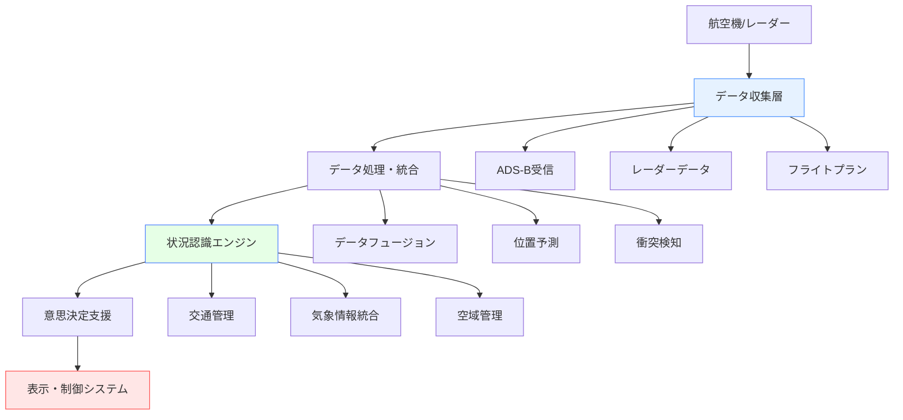
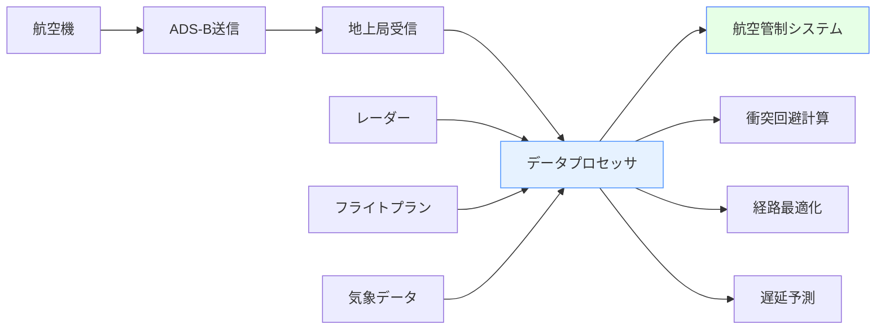
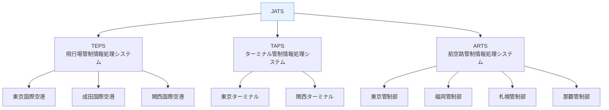

# 航空関連ソフトウェア

!!! info "このページについて"
    このページでは、航空分野で使用される状況認識支援ソフトウェアについて詳しく解説します。フライト追跡システムから航空管制支援ツール、シミュレーター、気象情報システムまで、航空安全と効率性を支える様々なソフトウェアソリューションを紹介します。

## 航空ソフトウェアの特徴

航空分野のソフトウェアは、以下の特殊な要件を満たす必要があります。各要件の技術的な実装例や、実際の航空運用での利用シーン・ケーススタディを交えて解説します。

### 重要な要件と具体的なケーススタディ

| 要件 | 説明 | 技術的実装 | 現実の利用シーン・ケーススタディ |
|------|------|----------|----------------|
| **リアルタイム性** | 秒単位での状況変化に対応し、遅延なく情報を提供する必要があります。 | 低遅延通信（WebSocket、UDP）、イベント駆動アーキテクチャ | **ケース:** 成田空港の着陸進入時、複数機が同時に接近する状況で、航空管制官はレーダー画面上で航空機の位置をリアルタイムに監視。衝突リスクが高まった場合、即座に回避指示を出すことで安全を確保。これには、サブ1秒レベルの遅延で情報が伝達・表示されることが不可欠。 |
| **高可用性** | 24時間365日稼働が求められ、障害時にも即座に復旧できる設計が必須です。 | 冗長化システム、フェイルオーバー機構、ホットスタンバイ | **ケース:** 日本のJATS（航空保安システム）では、管制システムが二重化されており、万一の障害時にもバックアップ系へ自動切替。2018年の台風時、主系が落ちてもバックアップにより航空機誘導が途切れることなく継続された事例がある。 |
| **国際標準準拠** | ICAOやFAAなどの国際規格への対応が不可欠です。 | 標準化データフォーマット（AIXM、FIXM等）、セキュリティプロトコル | **ケース:** 欧州・アジア間のフライトで、航空会社が各国の管制システムとフライトプランを交換。AIXMやFIXM形式でのデータ送受信により、異なる国・システム間でも誤解なく運航情報が共有され、スムーズな国際運用が可能。 |
| **3次元表示** | 立体的な空域・航空機の動態を正確に管理・可視化します。 | 3Dグラフィックス、GIS統合、WebGL/Three.js | **ケース:** 羽田空港の混雑空域で、3D表示により管制官が高度ごとの航空機の重なりや進路を一目で把握。複雑な進入経路や、複数レベルの交差運用でも、直感的な状況認識が可能となり、誤指示や見落としを防止。 |

### アーキテクチャの特徴

以下は航空ソフトウェアの代表的なアーキテクチャ構成です。各ノードがどのようなデータソースから情報を取得し、どんな処理を担うかを強化して説明します。

##### 構成と連携図（Mermaid）

##### 各ノード・層の具体的な説明
|構成|説明|主な入力データソース|主な処理・出力例|
|---|---|---|---|
|**データ収集層**|航空機のADS-B信号、地上レーダー、フライトプラン、気象情報など多様な情報源からデータをリアルタイムで取得。|ADS-B地上局、SSRレーダー、航空会社/空港のフライトプラン、気象API（METAR/TAF）|各センサー/システムからデータを受信し、時刻や機体IDでタグ付けして格納|
|**データ処理・統合**|収集したデータをフュージョン（統合）し、ノイズ除去や重複排除、時系列補正、将来位置予測、衝突検知を行う。|収集層からの統合データ|レーダーとADS-Bの突合、ノイズ除去後の信頼性の高いトラフィック情報生成|
|**状況認識エンジン**|交通密度、気象影響、空域制限など空域全体の状況を解析し、リスクや異常を抽出。|統合データ、気象情報、NOTAM等|混雑度ヒートマップ生成、危険気象領域の自動検出、進入制限区域の監視|
|**意思決定支援**|アラート生成、最適な指示案の提示、シナリオごとの推奨行動を算出。|状況認識エンジンからの解析結果|衝突回避指示、最適ルート提案、遅延予測通知|
|**表示・制御システム**|3D/2D表示、アラート通知、ユーザーインターフェースでのデータ可視化・操作。|意思決定支援層からの出力|3D空域表示、警告ポップアップ、地図や計器との連携|

## フライト追跡・監視システム

### 一般向けフライト追跡アプリ

#### Flightradar24

| 機能 | 説明 | 技術仕様 |
|------|------|------|
| **リアルタイム追跡** | 世界中の民間航空機をリアルタイム表示 | ADS-B、MLAT、レーダーデータ統合 |
| **フライト詳細** | 航空機情報、ルート、高度、速度 | RESTful API、WebSocket通信 |
| **AR機能** | スマートフォンカメラ越しに航空機情報表示 | ARCore/ARKit統合 |
| **アラート機能** | 特定フライトの遅延・到着通知 | プッシュ通知、カスタムフィルター |

##### 強み・技術的特徴・導入事例

| 用途 | 強み | 技術的特徴 | 導入事例 |
|---|---|---|---|
|一般利用者や航空ファンが、飛行中の航空機を地図上でリアルタイム追跡。航空会社や空港も自社便の状況把握に利用|世界最大規模のADS-Bネットワークで、民間機ほぼ全ての動態をカバー|ADS-B/MLAT/レーダーの多重データ統合、WebSocketによる低遅延配信、AR機能で現実空間と連動|航空会社の運航部門、空港案内カウンター、TV報道機関（事故・トラブル時の追跡表示）、旅行アプリ|


??? TypeScript実装例
    この TypeScript 実装では、Flightradar24 の非公式 API を使用して、指定した緯度経度の境界内に存在する全てのフライト情報を取得しています。
    WebSocket 通信を通じてリアルタイムの位置情報を取得し、画面に表示する用途に適しています。

    ```typescript
    // Flightradar24 API使用例（非公式）
    interface FlightData {
      flight_id: string;
      callsign: string;
      latitude: number;
      longitude: number;
      altitude: number;
      speed: number;
      heading: number;
      aircraft_type: string;
    }

    class FlightTracker {
      async getFlightsInBounds(
        north: number, 
        south: number, 
        east: number, 
        west: number
      ): Promise<FlightData[]> {
        const response = await fetch(
          `https://data-cloud.flightradar24.com/zones/fcgi/feed.js?bounds=${north},${south},${east},${west}`
        );
        return response.json();
      }
    }
    ```

#### FlightAware

| 機能 | 説明 | 技術的特徴 |
|------|------|------|
| **フライト追跡** | 商用・プライベート機の追跡 | FAA/世界各国のATCデータ、ADS-B、MLAT統合 |
| **空港情報** | リアルタイム遅延・キャンセル情報 | 空港運用データ、地上管制との連携 |
| **予測分析** | 遅延予測、到着時刻更新 | 機械学習によるETA/遅延予測 |
| **API提供** | 開発者向けAPIサービス | RESTful/Streaming API、詳細なドキュメント |

##### 強み・技術的特徴・導入事例

| 用途 | 強み | 技術的特徴 | 導入事例 |
|---|---|---|---|
|航空会社や空港が運航管理・遅延対応に活用。旅行会社や貨物業者も利用|米国FAAとの公式連携で空港運用データが豊富。機械学習による到着予測や遅延分析が高精度|API経由で自社システムへ容易に組み込める。地上運用との連携やカスタムアラートが可能|米国主要航空会社の運航管理センター、空港ディスパッチ部門、サードパーティの旅行アプリ|

#### OpenSky Network

| 用途 | 強み | 技術的特徴 | 導入事例 |
|---|---|---|---|
|研究者や開発者が航空機動態データを解析・可視化・シミュレーションに利用。新規サービス開発にも|オープンソース・非営利でグローバルなADS-B/MLATデータを無償公開|APIやデータダンプで柔軟な研究が可能。時系列・大量データを分析しやすい。クラウド基盤で運用|大学・研究機関の航空交通解析、AIによる混雑予測の検証、趣味の自作フライトレーダーアプリ|


??? TypeScript実装例
    この TypeScript 実装では、OpenSky Network のオープンソース API を用いて、全ての航空機の現在のステータス情報を取得しています。
    レーダー情報や ADS-B 情報の統合を行い、機体ごとの位置、速度、高度、国籍などの情報を収集し、追跡を行います。

    ```typescript
    // OpenSky Network API例（オープンソース）
    interface StateVector {
      icao24: string;
      callsign: string;
      origin_country: string;
      time_position: number;
      last_contact: number;
      longitude: number;
      latitude: number;
      baro_altitude: number;
      on_ground: boolean;
      velocity: number;
      true_track: number;
      vertical_rate: number;
    }

    class OpenSkyClient {
      private readonly baseUrl = 'https://opensky-network.org/api';
      
      async getAllStates(): Promise<StateVector[]> {
        const response = await fetch(`${this.baseUrl}/states/all`);
        const data = await response.json();
        return data.states.map(this.parseStateVector);
      }
      
      private parseStateVector(state: any[]): StateVector {
        return {
          icao24: state[0],
          callsign: state[1]?.trim() || null,
          origin_country: state[2],
          time_position: state[3],
          last_contact: state[4],
          longitude: state[5],
          latitude: state[6],
          baro_altitude: state[7],
          on_ground: state[8],
          velocity: state[9],
          true_track: state[10],
          vertical_rate: state[11]
        };
      }
    }
    ```

### 専門的航空管制システム

#### フライトデータ処理システム



#### 内部構造・データ処理フロー詳細
- **ADS-B送信/地上局受信**: 航空機が自機位置・速度・高度等をADS-B(1090MHz)で周期送信。地上局がこれを複数点で受信し、時刻・位置を付与。
- **レーダーデータ**: SSR（セカンダリレーダー）や一次レーダーが広域の航空機を捕捉。独自の誤差や遅延を持つが、ADS-Bと補完的。
- **フライトプラン/気象データ**: 航空会社や空港からのフライトプラン、気象庁API等からのMETAR/TAFを取得。
- **データプロセッサ**:
    - **データフュージョン**: 各データを時刻・機体IDで突合。ノイズ除去（例: 高度エラー除外）、重複排除、時系列補正（時刻同期）を実施。
    - **予測処理**: 現在の速度・進路から将来位置を予測。AIやカルマンフィルタ等も利用。
    - **衝突検知**: 近接機同士のCPA（最接近点）計算。閾値超え時にアラート生成。
    - **経路最適化**: 気象・混雑状況・NOTAM（空域制限）等を加味し、最適ルートを計算。
    - **遅延予測**: 到着予定時刻、地上混雑、天候悪化等から遅延を自動予測し、運航計画に反映。
- **リアルタイムデータ処理技術**: WebSocketやgRPCで低遅延配信。ストリーム処理基盤（Apache Kafka等）やインメモリDBによる高速化。

#### 主要システム例と技術

| システム | 開発元 | 主な機能 | 導入地域 |
|---|---|---|---|
| **STARS** | Raytheon/Lockheed Martin | ターミナル空域管制自動化 | アメリカ（FAA） |
| **iTEC** | Thales | 統合管制システム | ヨーロッパ（Eurocontrol） |
| **NATS iFACTS** | NATS | 次世代航空管制システム | イギリス |
| **JCAB JATS** | 日本 | 航空保安システム | 日本（国土交通省） |

## 航空管制支援ツール

### レーダーデータ処理
#### 処理フローと航空安全への貢献

- **データ取得**: 複数のレーダー（一次/二次/SSR）やADS-Bから航空機の位置情報を取得。地理的に分散した複数局のデータを収集し、冗長性とカバレッジを確保。
- **データ統合（フュージョン）**: 異なるソース（例: SSR・ADS-B・MLAT）からのデータを時刻・機体ID・空間位置で突合。ノイズ除去（例: 異常値除外）や信頼度スコア付与。最も信頼性の高い情報を選択。
- **軌道予測**: 現在の速度・進路・高度変化率から将来位置を予測。AIや物理モデルによる複数パターン予測。進路交差や危険接近の早期検知。
- **可視化**: 統合データを3D/2Dで表示。レイヤー切替、ヒートマップ表示、アラート強調等。管制官が直感的に全体状況を把握できる。
- **技術例**: WebSocketやgRPCでのリアルタイム配信、GPUベースの3D描画、ストリーム処理基盤（Apache Kafka等）。
- **航空安全への貢献**: 誤認識や見落としを防ぎ、衝突リスクを大幅に低減。ヒューマンエラーを抑制し、迅速な意思決定支援を実現。


??? TypeScript実装例
    この TypeScript 実装では、複数のレーダーから受信した航空機の位置情報を統合し、ノイズ除去や重複排除を行っています。
    また、リアルタイムでの軌道予測も行い、航空機の安全な航行をサポートするためのデータ処理を行っています。

    ```typescript
    // レーダーデータ処理の基本構造
    interface RadarContact {
      id: string;
      position: {
        latitude: number;
        longitude: number;
        altitude: number;
      };
      velocity: {
        speed: number;
        heading: number;
        vertical_rate: number;
      };
      identification: {
        callsign?: string;
        squawk: string;
        aircraft_type?: string;
      };
      timestamp: Date;
      confidence: number;
    }

    class RadarProcessor {
      private contacts = new Map<string, RadarContact[]>();
      
      // 複数レーダーからのデータ統合
      fuseRadarData(radarSources: RadarContact[][]): RadarContact[] {
        const fusedData: RadarContact[] = [];
        
        // 位置ベースでの相関処理
        for (const contact of radarSources.flat()) {
          const existing = fusedData.find(c => 
            this.calculateDistance(c.position, contact.position) < 0.1 // 100m以内
          );
          
          if (existing) {
            // 信頼度の高いデータで更新
            if (contact.confidence > existing.confidence) {
              Object.assign(existing, contact);
            }
          } else {
            fusedData.push(contact);
          }
        }
        
        return fusedData;
      }
      
      // 軌道予測
      predictTrajectory(contact: RadarContact, timeAhead: number): Position {
        const { latitude, longitude, altitude } = contact.position;
        const { speed, heading, vertical_rate } = contact.velocity;
        
        // 簡単な線形予測（実際はより複雑な計算）
        const distance = speed * timeAhead;
        const deltaLat = (distance * Math.cos(heading * Math.PI / 180)) / 111000;
        const deltaLng = (distance * Math.sin(heading * Math.PI / 180)) / (111000 * Math.cos(latitude * Math.PI / 180));
        
        return {
          latitude: latitude + deltaLat,
          longitude: longitude + deltaLng,
          altitude: altitude + (vertical_rate * timeAhead)
        };
      }
    }
    ```

### 衝突回避システム（TCAS）


??? TypeScript実装例
    この TypeScript 実装では、TCAS（Traffic Collision Avoidance System）の基本的な検知ロジックを構築しています。
    航空機同士の最接近点（CPA）を計算し、衝突の危険がある場合には回避指示を生成します。

    ```typescript
    // TCAS アルゴリズムの簡単な実装例
    class TCASProcessor {
      private readonly ALERT_LEVELS = {
        TRAFFIC_ADVISORY: 1,
        RESOLUTION_ADVISORY: 2
      };
      
      assessThreat(ownship: RadarContact, intruder: RadarContact): TCASAlert | null {
        const separation = this.calculateSeparation(ownship, intruder);
        const closestPointOfApproach = this.calculateCPA(ownship, intruder);
        
        if (this.isImmediateThreat(separation, closestPointOfApproach)) {
          return {
            level: this.ALERT_LEVELS.RESOLUTION_ADVISORY,
            type: 'vertical', // climb/descend
            intruderCallsign: intruder.identification.callsign,
            recommendedAction: this.generateResolutionAdvisory(ownship, intruder)
          };
        } else if (this.isPotentialThreat(separation, closestPointOfApproach)) {
          return {
            level: this.ALERT_LEVELS.TRAFFIC_ADVISORY,
            type: 'advisory',
            intruderCallsign: intruder.identification.callsign,
            recommendedAction: 'monitor'
          };
        }
        
        return null;
      }
      
      private generateResolutionAdvisory(ownship: RadarContact, intruder: RadarContact): string {
        // 相対的な垂直速度を計算
        const relativeVerticalRate = ownship.velocity.vertical_rate - intruder.velocity.vertical_rate;
        
        if (relativeVerticalRate > 0) {
          return 'DESCEND'; // 自機が上昇中なら降下指示
        } else {
          return 'CLIMB';   // 自機が降下中なら上昇指示
        }
      }
    }

    interface TCASAlert {
      level: number;
      type: string;
      intruderCallsign?: string;
      recommendedAction: string;
    }
    ```

## 気象情報システム

### 航空気象データ

航空気象情報は、管制官が視程・雲量・風向で滑走路選定、パイロットが悪天候回避経路を検討、空港運用部門が遅延対応を準備する際に不可欠です。

#### METARとTAFの違い、活用シーン、API取得例

|通報式|説明|活用シーン|API取得例|
|---|---|---|---|
|METAR|空港ごとに1時間ごと発行される観測値（現況）。温度・気圧・視程・雲量・風向風速等を含む。|パイロット：離着陸判断、最終アプローチ直前の運航計画修正。<br>管制官：滑走路運用方針決定。|`https://aviationweather.gov/adds/dataserver_current/httpparam?dataSource=metars&stationString=RJTT&hoursBeforeNow=1`|
|TAF|予報官が発行する24〜30時間先までの天気予報。時系列で風・雲・降水・視程の変化を記述。|パイロット：フライトプラン作成、経路選定、代替空港の判断。<br>運航管理：出発時点での遅延・欠航リスク評価。|`https://aviationweather.gov/adds/dataserver_current/httpparam?dataSource=tafs&stationString=RJTT&hoursBeforeNow=4`|

##### データ処理フロー例
1. **APIからMETAR/TAFを取得** → 2. XML/JSONパースし、必要なパラメータ（視程・風・雲底等）を抽出 → 3. フライトプラン作成時や運航中に参照 → 4. 悪天候時は経路変更や代替空港選定へ即反映


??? TypeScript実装例
    この TypeScript 実装では、航空気象情報（METAR/TAF）をリアルタイムで取得し、解析を行っています。
    空港周辺の視程、風向、降水量などの気象情報を統合し、パイロットや管制官に即時提供するシステムです。

    ```typescript
    // 航空気象情報の統合システム
    interface WeatherData {
      timestamp: Date;
      location: {
        latitude: number;
        longitude: number;
        altitude?: number;
      };
      visibility: number;        // km
      windSpeed: number;         // knots
      windDirection: number;     // degrees
      temperature: number;       // Celsius
      dewPoint: number;          // Celsius
      pressure: number;          // hPa
      cloudLayers: CloudLayer[];
      precipitation?: PrecipitationType;
      turbulence?: TurbulenceLevel;
    }

    interface CloudLayer {
      type: 'FEW' | 'SCT' | 'BKN' | 'OVC';
      altitude: number; // feet
      thickness?: number;
    }

    class AviationWeatherService {
      private readonly sources = {
        metar: 'https://aviationweather.gov/adds/dataserver_current/httpparam?dataSource=metars',
        taf: 'https://aviationweather.gov/adds/dataserver_current/httpparam?dataSource=tafs',
        radar: 'https://aviationweather.gov/adds/dataserver_current/httpparam?dataSource=radars'
      };
      
      async getCurrentWeather(airportCode: string): Promise<WeatherData> {
        const metarUrl = `${this.sources.metar}&requestType=retrieve&format=xml&stationString=${airportCode}&hoursBeforeNow=1`;
        const response = await fetch(metarUrl);
        const xmlData = await response.text();
        
        return this.parseMetar(xmlData);
      }
      
      async getWeatherForecast(airportCode: string): Promise<WeatherData[]> {
        const tafUrl = `${this.sources.taf}&requestType=retrieve&format=xml&stationString=${airportCode}&hoursBeforeNow=4&timeType=issue`;
        const response = await fetch(tafUrl);
        const xmlData = await response.text();
        
        return this.parseTaf(xmlData);
      }
      
      // 乱気流予測
      async getTurbulenceForecast(
        bounds: { north: number; south: number; east: number; west: number },
        altitudes: number[]
      ): Promise<TurbulenceForecast[]> {
        // 複数の気象モデルからデータを収集
        const gfsData = await this.getGFSData(bounds, altitudes);
        const ecmwfData = await this.getECMWFData(bounds, altitudes);
        
        // アンサンブル予測
        return this.generateTurbulenceEnsemble(gfsData, ecmwfData);
      }
    }
    ```

### 機上気象レーダー統合

??? TypeScript実装例
    この TypeScript 実装では、機上の気象レーダーからのデータを処理し、画面に可視化しています。
    降水強度や嵐の位置をリアルタイムで表示し、パイロットが最適な航路を選択できるようサポートします。

    ```typescript
    // 機上気象レーダーデータの統合
    class OnboardWeatherRadar {
      private canvas: HTMLCanvasElement;
      private context: CanvasRenderingContext2D;
      
      constructor(canvasElement: HTMLCanvasElement) {
        this.canvas = canvasElement;
        this.context = canvasElement.getContext('2d')!;
      }
      
      renderWeatherData(radarData: WeatherRadarData): void {
        this.context.clearRect(0, 0, this.canvas.width, this.canvas.height);
        
        // 降水強度に基づく色分け
        const colorMap = {
          light: '#00FF00',      // 緑：弱い雨
          moderate: '#FFFF00',   // 黄：中程度の雨
          heavy: '#FF8000',      // オレンジ：強い雨
          severe: '#FF0000',     // 赤：激しい雨
          extreme: '#FF00FF'     // マゼンタ：極端に激しい雨
        };
        
        for (const cell of radarData.cells) {
          this.context.fillStyle = colorMap[cell.intensity];
          this.context.fillRect(
            cell.x - cell.width / 2,
            cell.y - cell.height / 2,
            cell.width,
            cell.height
          );
        }
        
        // パイロットへの推奨ルート表示
        this.renderRecommendedPath(radarData.recommendedPath);
      }
      
      private renderRecommendedPath(path: Point[]): void {
        if (path.length < 2) return;
        
        this.context.strokeStyle = '#00FFFF'; // シアン色
        this.context.lineWidth = 3;
        this.context.setLineDash([10, 5]);
        
        this.context.beginPath();
        this.context.moveTo(path[0].x, path[0].y);
        
        for (let i = 1; i < path.length; i++) {
          this.context.lineTo(path[i].x, path[i].y);
        }
        
        this.context.stroke();
        this.context.setLineDash([]); // リセット
      }
    }
    ```

## フライトシミュレーター・訓練ソフトウェア

### 主要フライトシミュレーター

| ソフトウェア | 開発元 | 特徴 | 対象ユーザー |訓練用途例|
|---|---|---|---|---|
| **Microsoft Flight Simulator** | Microsoft/Asobo | 超高精度地形、リアルタイム気象、世界全空港再現 | 一般ユーザー・訓練者 | 世界の実景を再現。天候や交通もリアルタイム同期。自家用パイロットの基礎訓練やシナリオ訓練に最適 |
| **X-Plane** | Laminar Research | 物理エンジン重視、plugin豊富、実機に近い挙動 | エンスージアスト・パイロット訓練 | 空力シミュレーションが実機に近い。IFR訓練や計器飛行練習に多用。サードパーティプラグインで航空管制や緊急事態訓練も実現 |
| **Prepar3D** | Lockheed Martin | プロフェッショナル向け、訓練・教育機能、軍用拡張 | 訓練機関・航空会社 | 商用・軍用訓練向け。複数人での連携訓練や、特殊シナリオの再現（例：エンジン故障時の対応）に利用 |
| **FlightGear** | オープンソース | フリー、カスタマイズ性高、研究開発向け | 開発者・研究機関 | ソース公開で研究者が新しい航空管制アルゴリズムや自動運航AIの検証に使用。教育現場でも活用 |


### シミュレータープラグイン開発

??? TypeScript実装例
    この TypeScript 実装では、X-Plane のシミュレーターからリアルタイムでデータを取得し、飛行機の姿勢や位置情報を監視しています。
    訓練シナリオを通じて、天候の変化や異常事態への対応をシミュレーションすることが可能です。

    ```typescript
    // X-Plane プラグイン例（概念的）
    interface XPlaneDataRef {
      path: string;
      value: number | number[] | string;
      writable: boolean;
    }

    class XPlanePlugin {
      private datarefs: Map<string, XPlaneDataRef> = new Map();
      
      // データレファレンスの取得
      getDataref(path: string): number | number[] | null {
        const dataref = this.datarefs.get(path);
        return dataref ? dataref.value : null;
      }
      
      // 航空機状態の監視
      monitorAircraftState(): Observable<AircraftState> {
        return interval(100).pipe( // 10Hz更新
          map(() => ({
            position: {
              latitude: this.getDataref('sim/flightmodel/position/latitude') as number,
              longitude: this.getDataref('sim/flightmodel/position/longitude') as number,
              altitude: this.getDataref('sim/flightmodel/position/elevation') as number
            },
            attitude: {
              pitch: this.getDataref('sim/flightmodel/position/theta') as number,
              roll: this.getDataref('sim/flightmodel/position/phi') as number,
              heading: this.getDataref('sim/flightmodel/position/psi') as number
            },
            velocity: {
              groundSpeed: this.getDataref('sim/flightmodel/position/groundspeed') as number,
              indicatedAirspeed: this.getDataref('sim/flightmodel/position/indicated_airspeed') as number,
              verticalSpeed: this.getDataref('sim/flightmodel/position/vh_ind_fpm') as number
            },
            engine: {
              n1: this.getDataref('sim/flightmodel/engine/ENGN_N1_') as number[],
              egt: this.getDataref('sim/flightmodel/engine/ENGN_EGT_c') as number[],
              fuelFlow: this.getDataref('sim/flightmodel/engine/ENGN_FF_') as number[]
            }
          }))
        );
      }
      
      // 状況認識訓練シナリオ
      createSituationAwarenessScenario(): TrainingScenario {
        return {
          name: "Weather Avoidance Training",
          description: "Navigate around thunderstorms using onboard radar",
          objectives: [
            "Detect weather on radar",
            "Plan deviation route",
            "Execute safe weather avoidance",
            "Maintain situational awareness"
          ],
          initialConditions: {
            position: { lat: 35.0, lng: -97.0, alt: 35000 },
            weather: [
              {
                type: 'thunderstorm',
                position: { lat: 35.5, lng: -96.5 },
                radius: 10,
                intensity: 'severe'
              }
            ]
          },
          triggers: [
            {
              condition: 'distance_to_weather < 50nm',
              action: 'enable_weather_radar'
            },
            {
              condition: 'deviation_initiated',
              action: 'evaluate_decision_quality'
            }
          ]
        };
      }
    }

    interface AircraftState {
      position: { latitude: number; longitude: number; altitude: number };
      attitude: { pitch: number; roll: number; heading: number };
      velocity: { groundSpeed: number; indicatedAirspeed: number; verticalSpeed: number };
      engine: { n1: number[]; egt: number[]; fuelFlow: number[] };
    }

    interface TrainingScenario {
      name: string;
      description: string;
      objectives: string[];
      initialConditions: any;
      triggers: Array<{ condition: string; action: string }>;
    }
    ```

## 空港運営・地上支援システム

### ACDM (Airport Collaborative Decision Making)


??? TypeScript実装例
    この TypeScript 実装では、空港のゲートや滑走路の最適なスケジューリングを行い、リソース競合を解消する役割を持っています。
    フライトの遅延を最小限に抑え、効率的な空港運営を支援します。

    ```typescript
    // 空港運営の協調的意思決定システム
    interface FlightMovement {
      flightId: string;
      callsign: string;
      aircraftType: string;
      origin?: string;
      destination?: string;
      scheduleTime: Date;
      estimatedTime: Date;
      actualTime?: Date;
      gate?: string;
      stand?: string;
      runway?: string;
      status: FlightStatus;
    }

    type FlightStatus = 
      | 'scheduled' 
      | 'delayed' 
      | 'boarding' 
      | 'departed' 
      | 'arrived' 
      | 'cancelled';

    class ACDMSystem {
      private flights = new Map<string, FlightMovement>();
      private airport: AirportConfig;
      
      constructor(airportConfig: AirportConfig) {
        this.airport = airportConfig;
      }
      
      // 出発時刻の予測と最適化
      calculateOptimalDepartureTimes(): Map<string, Date> {
        const sortedFlights = Array.from(this.flights.values())
          .filter(f => f.status === 'scheduled')
          .sort((a, b) => a.scheduleTime.getTime() - b.scheduleTime.getTime());
        
        const optimizedTimes = new Map<string, Date>();
        let lastDepartureTime = new Date();
        
        for (const flight of sortedFlights) {
          // 最小間隔の確保（航跡乱気流等を考慮）
          const minSeparation = this.calculateMinSeparation(flight);
          const earliestDeparture = new Date(lastDepartureTime.getTime() + minSeparation * 1000);
          
          // スケジュールとの比較
          const optimalTime = new Date(Math.max(
            flight.scheduleTime.getTime(),
            earliestDeparture.getTime()
          ));
          
          optimizedTimes.set(flight.flightId, optimalTime);
          lastDepartureTime = optimalTime;
        }
        
        return optimizedTimes;
      }
      
      // リソース競合の解決
      resolveResourceConflicts(): ResourceAllocation[] {
        const allocations: ResourceAllocation[] = [];
        const gateUsage = new Map<string, TimeSlot[]>();
        const runwayUsage = new Map<string, TimeSlot[]>();
        
        // ゲート割り当ての最適化
        for (const flight of this.flights.values()) {
          const preferredGate = this.findPreferredGate(flight);
          const availableSlot = this.findAvailableSlot(gateUsage, preferredGate, flight);
          
          if (availableSlot) {
            allocations.push({
              flightId: flight.flightId,
              resourceType: 'gate',
              resourceId: preferredGate,
              timeSlot: availableSlot
            });
            
            this.addTimeSlot(gateUsage, preferredGate, availableSlot);
          }
        }
        
        return allocations;
      }
      
      // ターンアラウンド時間の最適化
      optimizeTurnaround(flight: FlightMovement): TurnaroundPlan {
        const services = [
          { name: 'refueling', duration: 20, canParallel: true },
          { name: 'catering', duration: 30, canParallel: true },
          { name: 'cleaning', duration: 25, canParallel: false },
          { name: 'maintenance', duration: 15, canParallel: true },
          { name: 'baggage', duration: 35, canParallel: true }
        ];
        
        // 並行処理可能なサービスをグループ化
        const parallelServices = services.filter(s => s.canParallel);
        const sequentialServices = services.filter(s => !s.canParallel);
        
        // 最適なスケジューリング
        const plan: TurnaroundPlan = {
          flightId: flight.flightId,
          totalDuration: Math.max(
            Math.max(...parallelServices.map(s => s.duration)),
            sequentialServices.reduce((sum, s) => sum + s.duration, 0)
          ),
          schedule: this.createServiceSchedule(services, flight.actualTime || flight.estimatedTime)
        };
        
        return plan;
      }
    }

    interface AirportConfig {
      code: string;
      runways: Runway[];
      gates: Gate[];
      stands: Stand[];
    }

    interface ResourceAllocation {
      flightId: string;
      resourceType: 'gate' | 'runway' | 'stand';
      resourceId: string;
      timeSlot: TimeSlot;
    }

    interface TimeSlot {
      start: Date;
      end: Date;
    }

    interface TurnaroundPlan {
      flightId: string;
      totalDuration: number; // minutes
      schedule: ServiceSchedule[];
    }

    interface ServiceSchedule {
      service: string;
      start: Date;
      duration: number;
    }
    ```

## 日本の航空ソフトウェア事例

### 国内開発システム

#### JATS (Japan Air Traffic management System)



##### システム詳細・利用シーン
- **JATS全体**: 日本の航空保安を担う統合システム。全国の空港・管制部で24時間運用され、空域全体の一元管理を実現。
- **TEPS**: 各空港での離着陸順序の最適化、地上走行ルート案内。例: 羽田空港での複数滑走路同時運用や、天候急変時の迅速な滑走路切替。
- **TAPS**: ターミナル空域（空港周辺）の航空機誘導や混雑緩和。例: 成田空港での到着機の順番調整や、悪天候時のホールディング指示。
- **ARTS**: 航空路（巡航中）の交通管理。例: 台風時に日本上空を通過する多国籍航空機のルート再編成や、災害時の緊急機優先誘導。

##### メリット
- 各システム間のリアルタイムなデータ連携で、空域全体の状況を一元管理。
- 遅延・混雑の早期検知や、災害・緊急時の特殊運用にも柔軟対応可能。
- 管制官・運航管理・空港部門間の情報共有が円滑で、ヒューマンエラー防止にも寄与。

#### JAL・ANA社内システム

| 航空会社 | システム名 | 主な機能 | 利用シーン・メリット |
|---|---|---|---|
| **JAL** | JOPS (JAL Operations System) | 運航管理、乗務員管理、整備管理 | JAL運航部門が、フライトスケジュールの最適化、乗務員配置、整備進捗をリアルタイムで一元管理。<br>**例:** 台風接近時、欠航・遅延便の自動再計画や、乗務員の再割当て、整備状況の即時反映。|
| **ANA** | ATOMS (ANA Total Operations Management System) | 統合運航管理システム | ANAが全運航便の状況を可視化し、遅延・欠航判断や地上支援の調整に活用。<br>**例:** 機材トラブル発生時、部門間（運航・整備・地上支援）で即時情報共有・協調対応し、最適な代替機材やリソースを割当て。|


### 国内ベンダー

#### 主要企業

| 企業 | 主力製品 | 特徴 |
|---|---|---|
| **NEC** | TEPS II | 管制システム、レーダー処理 |
| **三菱電機** | ARTS | 航空路管制、データ処理 |
| **東芝** | TAPS | ターミナル管制システム |
| **富士通** | 空港システム | 空港運営、チェックインシステム |

## 技術トレンドと将来展望

### 次世代航空管制（NextGen/SESAR）

| 背景 | 目標 | 技術的課題・実装例 |
|---|---|---|
|従来のレーダー中心の航空管制では増加する航空交通量に対応困難。環境規制や燃料コスト上昇も課題|4D航法（位置＋時間）、デジタル通信、自動化、AI活用による効率化・安全性向上・環境負荷低減|各国・各社のシステム統合、リアルタイム大容量データ処理、サイバーセキュリティ、AIの説明責任、既存設備との互換性。<br>**実装例:** 米国NextGenでは、SWIM（System Wide Information Management）によるデータ共有基盤、欧州SESARではCPDLC（データリンク通信）や4Dトラジェクトリ管理の実証運用。|

??? TypeScript実装例
    この TypeScript 実装では、4D航法（位置、速度、高度、時間）に基づいて航空機の最適な飛行経路を計算します。
    現在の気象データや混雑情報を考慮し、最適な巡航速度とルートを動的に調整します。

    ```typescript
    // 4D航法システムの概念実装
    interface FourDTrajectory {
      waypoints: Array<{
        position: { lat: number; lng: number; alt: number };
        timeConstraint: Date;
        speedConstraint?: number;
      }>;
      uncertaintyEnvelope: {
        lateral: number;    // nautical miles
        vertical: number;   // feet
        temporal: number;   // seconds
      };
      performance: {
        fuel: number;       // kg
        emissions: number;  // kg CO2
        noise: number;      // dB
      };
    }

    class FourDNavigationSystem {
      calculateOptimalTrajectory(
        origin: Waypoint,
        destination: Waypoint,
        constraints: FlightConstraints,
        weatherData: WeatherData[],
        trafficDensity: TrafficDensity[]
      ): FourDTrajectory {
        // 多目的最適化（燃費、時間、環境）
        const costFunction = this.createCostFunction(constraints);
        
        // 動的計画法による最適経路計算
        const optimalPath = this.dynamicProgramming(
          origin,
          destination,
          weatherData,
          trafficDensity,
          costFunction
        );
        
        // 不確実性の考慮
        const uncertaintyEnvelope = this.calculateUncertainty(
          optimalPath,
          weatherData,
          trafficDensity
        );
        
        return {
          waypoints: optimalPath,
          uncertaintyEnvelope,
          performance: this.calculatePerformance(optimalPath, weatherData)
        };
      }
      
      // リアルタイム軌道調整
      adjustTrajectoryInFlight(
        currentTrajectory: FourDTrajectory,
        currentPosition: Position,
        updatedConditions: {
          weather?: WeatherData[];
          traffic?: TrafficInfo[];
          constraints?: FlightConstraints;
        }
      ): FourDTrajectory {
        // 現在位置からの軌道再計算
        const remainingWaypoints = currentTrajectory.waypoints.filter(wp => 
          this.isAhead(currentPosition, wp.position)
        );
        
        // 新しい条件での最適化
        return this.calculateOptimalTrajectory(
          { position: currentPosition, time: new Date() },
          remainingWaypoints[remainingWaypoints.length - 1],
          updatedConditions.constraints || {},
          updatedConditions.weather || [],
          updatedConditions.traffic || []
        );
      }
    }
    ```

### 人工知能の活用
#### AI導入の影響と効率化の具体例

| 影響 | 具体例・実装例 | 将来的な発展可能性 |
|---|---|---|
| AIにより航空交通管理や運航計画が高度自動化<br>人的判断の補助や異常検知の自動化で安全性・効率性が向上 | ・フライト混雑予測→早期に地上待機やルート変更を提案し、遅延や燃料消費を削減<br>・天候リスクの自動検出→パイロットや管制官に危険回避ルートを提示<br>・整備予知保全→AIが機体データを解析し、故障前に部品交換を提案 | ・AIによる自動管制（ヒューマン・イン・ザ・ループ型の意思決定支援）<br>・異常時の自律型対応（例：通信断時の安全誘導）<br>・大規模シミュレーション/最適化による空域設計の革新|


??? TypeScript実装例
    この TypeScript 実装では、航空交通管理における混雑予測や経路最適化を AI モデルで行っています。
    天候や交通状況に基づいて遅延を予測し、リアルタイムで最適なフロー制御を提案します。

    ```typescript
    // AI支援による航空交通管理
    class AIAssistedATM {
      private model: TensorFlow.LayersModel;
      
      async loadModel(): Promise<void> {
        this.model = await tf.loadLayersModel('/models/atm-optimization.json');
      }
      
      // 交通渋滞予測
      predictCongestion(
        currentTraffic: TrafficSnapshot,
        weatherForecast: WeatherForecast[],
        flightSchedules: FlightSchedule[]
      ): Promise<CongestionPrediction> {
        // 入力データの正規化
        const normalizedInputs = this.normalizeInputs({
          traffic: currentTraffic,
          weather: weatherForecast,
          schedules: flightSchedules
        });
        
        // モデル推論
        const prediction = this.model.predict(normalizedInputs) as tf.Tensor;
        const predictionData = await prediction.data();
        
        return {
          sectors: this.parseSectorPredictions(predictionData),
          timeHorizon: 120, // minutes
          confidence: this.calculateConfidence(predictionData)
        };
      }
      
      // 最適な制限措置提案
      recommendFlowControl(
        congestionPrediction: CongestionPrediction,
        currentOperations: OperationalData
      ): FlowControlMeasures[] {
        const measures: FlowControlMeasures[] = [];
        
        for (const sector of congestionPrediction.sectors) {
          if (sector.congestionLevel > 0.7) {
            measures.push({
              type: 'ground_delay',
              affectedFlights: this.identifyAffectedFlights(sector),
              delayMinutes: this.calculateOptimalDelay(sector),
              expectedReduction: sector.congestionLevel * 0.3
            });
          }
        }
        
        return measures;
      }
    }

    interface CongestionPrediction {
      sectors: Array<{
        id: string;
        congestionLevel: number; // 0-1
        peakTime: Date;
        duration: number; // minutes
      }>;
      timeHorizon: number;
      confidence: number;
    }

    interface FlowControlMeasures {
      type: 'ground_delay' | 'airborne_holding' | 'route_diversion';
      affectedFlights: string[];
      delayMinutes?: number;
      expectedReduction: number;
    }
    ```

## 実装時の考慮事項

### セキュリティ
#### 航空システム特有の脅威と対策

| 脅威例 | 防御策・具体例 | 実装上の注意 |
|---|---|---|
|サイバー攻撃（ランサムウェア、DoS）、<br>データ改ざん、<br>無線通信の妨害、<br>内部不正アクセス|強固な暗号化（TLS/SSL、AES等）、多段階認証、アクセス権限の厳格管理、リアルタイム異常検知（SIEM導入）、ネットワーク分離、冗長化・バックアップ。<br>**具体例:** 航空管制システムでは通信経路全体を暗号化し、アクセスログを常時監視。ADS-B受信データの改ざん検知や、内部端末の不正利用監視も組み込む。|法規制（GDPR等）や国際標準（DO-326A等）への準拠。定期的な脆弱性診断・侵入訓練も必須。リアルタイム監視システムの導入・運用体制の構築も重要|


??? TypeScript実装例

    ```typescript
    // 航空システムのセキュリティ実装例
    class AviationSecurityLayer {
      private encryptionKey: CryptoKey;
      private auditLogger: AuditLogger;
      
      // データ暗号化
      async encryptFlightData(data: FlightData): Promise<EncryptedData> {
        const encrypted = await window.crypto.subtle.encrypt(
          { name: 'AES-GCM', iv: crypto.getRandomValues(new Uint8Array(12)) },
          this.encryptionKey,
          new TextEncoder().encode(JSON.stringify(data))
        );
        
        this.auditLogger.log('data_encrypted', {
          flightId: data.flightId,
          timestamp: new Date()
        });
        
        return { data: encrypted, iv: encrypted.slice(0, 12) };
      }
      
      // アクセス制御
      validateAccess(user: User, resource: string, action: string): boolean {
        const userRoles = user.roles;
        const requiredPermissions = this.getRequiredPermissions(resource, action);
        
        const hasPermission = requiredPermissions.every(permission => 
          userRoles.some(role => role.permissions.includes(permission))
        );
        
        this.auditLogger.log('access_attempt', {
          userId: user.id,
          resource,
          action,
          granted: hasPermission,
          timestamp: new Date()
        });
        
        return hasPermission;
      }
      
      // リアルタイム脅威検知
      monitorAbnormalPatterns(): Observable<SecurityAlert> {
        return merge(
          this.monitorLoginPatterns(),
          this.monitorDataAccess(),
          this.monitorSystemPerformance()
        ).pipe(
          filter(event => this.isAbnormal(event)),
          map(event => this.createSecurityAlert(event))
        );
      }
    }
    ```

### 国際標準への対応
#### 標準化の意義と実装の注意点
| 意義 | 実装時の注意 | データ交換フロー・例 |
|---|---|---|
|ICAO、RTCA、Eurocontrolなどの標準化により、国境を越えた運航・情報共有が安全かつ円滑に実現可能|各標準のバージョン差異やローカル要件に注意。データ形式（AIXM、FIXM等）の正しい解釈・変換や、セキュリティ標準への適合も重要。<br>**実装時:** ICAO/RTCA/EUROCAE等の標準文書を精読し、仕様変更時の追従体制も整備|**データ交換フロー例:**<br>1. 航空会社がICAO FPLメッセージを生成→2. AIXM/XML形式で管制システムへ送信→3. 国際共通ゲートウェイで変換・検証→4. 各国管制システムへ配布<br>**例:** ICAO FPLメッセージの厳格なパース、AIXMデータのXMLスキーマ検証、RTCA/DO-178Cに基づくソフトウェア品質保証など|


??? TypeScript実装例

    ```typescript
    // ICAO標準データフォーマット例
    interface ICAOFlightPlan {
      // FPL message format
      messageType: 'FPL';
      aircraftIdentification: string;
      flightRules: 'I' | 'V' | 'Y' | 'Z'; // IFR/VFR
      typeOfFlight: 'S' | 'N' | 'G' | 'M' | 'X';
      equipment: {
        aircraft: string; // ICAO aircraft type designator
        wakeCategory: 'L' | 'M' | 'H' | 'J'; // Light/Medium/Heavy/Super
        transponder: string; // ICAO transponder codes
      };
      departure: {
        aerodrome: string; // ICAO airport code
        time: Date;
      };
      cruisingSpeed: string;
      cruisingLevel: string;
      route: string; // ICAO route format
      destination: {
        aerodrome: string;
        totalEET: string; // Estimated Elapsed Time
      };
      alternate?: {
        aerodrome1?: string;
        aerodrome2?: string;
      };
      otherInformation: string;
    }

    class ICAOMessageProcessor {
      // ICAO標準メッセージのパース
      parseFlightPlan(rawMessage: string): ICAOFlightPlan {
        const fields = rawMessage.split('-');
        
        return {
          messageType: 'FPL',
          aircraftIdentification: this.extractField(fields, 7),
          flightRules: this.extractField(fields, 8)[0] as any,
          typeOfFlight: this.extractField(fields, 8)[1] as any,
          equipment: this.parseEquipment(this.extractField(fields, 9)),
          departure: this.parseDeparture(this.extractField(fields, 13)),
          cruisingSpeed: this.extractCruisingSpeed(this.extractField(fields, 15)),
          cruisingLevel: this.extractCruisingLevel(this.extractField(fields, 15)),
          route: this.extractField(fields, 15).split('/').slice(1).join(' '),
          destination: this.parseDestination(this.extractField(fields, 16)),
          alternate: this.parseAlternate(this.extractField(fields, 16)),
          otherInformation: this.extractField(fields, 18)
        };
      }
      
      // AIXM (Aeronautical Information Exchange Model) 対応
      generateAIXMData(flightPlan: ICAOFlightPlan): string {
        const aixmTemplate = `
          <message:AIXMBasicMessage 
            xmlns:message="http://www.aixm.aero/schema/5.1/message"
            xmlns:gml="http://www.opengis.net/gml/3.2">
            <message:hasMember>
              <aixm:RouteSegment gml:id="${this.generateId()}">
                <aixm:timeSlice>
                  <aixm:RouteSegmentTimeSlice gml:id="${this.generateId()}">
                    <gml:validTime />
                    <aixm:interpretation>BASELINE</aixm:interpretation>
                    <aixm:start xlink:href="#${flightPlan.departure.aerodrome}" />
                    <aixm:end xlink:href="#${flightPlan.destination.aerodrome}" />
                    <aixm:route>${flightPlan.route}</aixm:route>
                  </aixm:RouteSegmentTimeSlice>
                </aixm:timeSlice>
              </aixm:RouteSegment>
            </message:hasMember>
          </message:AIXMBasicMessage>
        `;
        
        return aixmTemplate.trim();
      }
    }
    ```

## まとめ

航空関連ソフトウェアは、極めて高い信頼性と精度が要求される分野です。リアルタイム処理、3次元表示、国際標準への準拠など、技術的には最も先進的でありながら、安全性を最優先とした慎重な開発が必要です。

### 開発時の重要ポイント

1. **安全性第一**: 冗長化、フェイルセーフ機能の実装
2. **リアルタイム処理**: 低遅延、高スループットの実現
3. **国際標準準拠**: ICAO、RTCA等の規格への対応
4. **セキュリティ**: 高度な暗号化、アクセス制御
5. **ユーザビリティ**: パイロット・管制官が直感的に操作可能

これらの要件を満たすソフトウェア開発は技術的に挑戦的ですが、航空安全の向上に直接貢献できる意義深い分野です。

## 関連リンク

- [航空分野での状況認識](../applications/aviation.md)
- [気象関連ソフトウェア](./weather-software.md)
- [状況認識のトレーニング](../comprehensive-guide/training-sa.md)
- [AIと将来展望](../ai-and-future/index.md)

## 参考文献

1. ICAO. (2020). *Annex 11 - Air Traffic Services*. International Civil Aviation Organization.
2. FAA. (2019). *NextGen Implementation Plan*. Federal Aviation Administration.
3. Eurocontrol. (2021). *European ATM Master Plan*. European Organisation for the Safety of Air Navigation.
4. RTCA. (2018). *DO-178C - Software Considerations in Airborne Systems*. Radio Technical Commission for Aeronautics.
