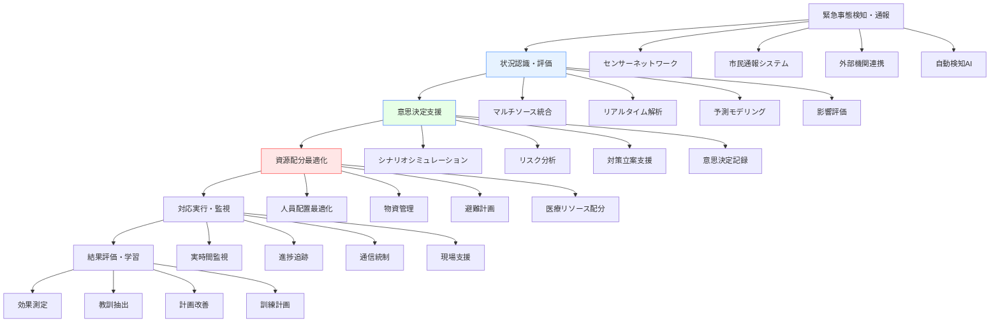

# 緊急事態対応ソフトウェア


!!! info "このページについて"
    このページでは、緊急事態・災害対応分野で使用される状況認識支援ソフトウェアについて詳しく解説します。自然災害、人為的災害、公衆衛生危機、テロ攻撃など様々な緊急事態に対する迅速かつ効果的な対応を支援するソフトウェアソリューションを紹介します。

## 緊急事態対応ソフトウェアの特徴

緊急事態対応分野のソフトウェアは、時間的制約が厳しく、人命に関わる重要性から、他分野とは異なる厳格な要件を満たす必要があります。

### 重要な要件

| 要件 | 説明 | 技術的実装 | 具体例・メリット |
|---|---|---|---|
| 超高可用性・耐障害性 | 災害時でも継続稼働、インフラ被災時の復旧力 | 分散アーキテクチャ、クラウド/オンプレミス冗長化、自律復旧機能 | 地震発生時も指令システム稼働継続、孤立した避難所での情報共有維持 |
| リアルタイム情報処理 | 秒単位での状況変化に即座に対応 | エッジコンピューティング、高速通信、インメモリ処理 | 津波警報の即時配信、火災拡大予測のリアルタイム更新 |
| 大規模並行処理 | 同時多発的な緊急事態への対応 | 分散処理、ロードバランシング、スケーラブルアーキテクチャ | 大地震時の数万件の通報処理、複数避難所の同時管理 |
| 相互運用性 | 異なる組織・システム間の連携 | 標準プロトコル、API統合、データフォーマット標準化 | 警察・消防・自衛隊の情報共有、国際災害救援協力 |
| モバイル対応 | 現場での利用、通信インフラ制約下での動作 | オフライン同期、軽量通信、タッチ操作最適化 | 被災地での情報収集、避難所でのタブレット活用 |

### システムアーキテクチャ



## 統合危機管理システム

### 緊急対策本部支援システム

統合危機管理システムは、緊急事態発生時に設置される対策本部の意思決定を支援する包括的なシステムです。リアルタイムの情報収集、状況分析、対策立案、資源配分を一元管理し、迅速で効果的な災害対応を実現します。


??? TypeScript実装例

    この TypeScript 実装では、緊急対策本部での統合的な危機管理を行い、リアルタイムの状況認識から意思決定支援まで包括的に支援しています。各関係機関との連携やリソース最適配分も自動化されています。

    ```typescript
    // 統合危機管理システムの実装例
    interface EmergencyIncident {
        incidentId: string;
        type: IncidentType;
        severity: SeverityLevel;
        location: EmergencyLocation;
        affectedArea: GeographicArea;
        startTime: Date;
        estimatedDuration: number;
        status: IncidentStatus;
        casualties: CasualtyReport;
        damages: DamageAssessment;
        response: ResponseOperations;
    }

    interface EmergencyLocation {
        coordinates: { latitude: number; longitude: number };
        address: string;
        administrativeArea: string;
        landmarks: string[];
        accessRoutes: RouteInformation[];
        environmentalFactors: EnvironmentalConditions;
    }

    enum IncidentType {
        NATURAL_DISASTER = 'natural_disaster',
        FIRE = 'fire',
        HAZMAT = 'hazmat',
        TERRORIST_ATTACK = 'terrorist_attack',
        INFRASTRUCTURE_FAILURE = 'infrastructure_failure',
        PUBLIC_HEALTH = 'public_health',
        CIVIL_UNREST = 'civil_unrest',
        CYBER_ATTACK = 'cyber_attack'
    }

    enum SeverityLevel {
        LEVEL_1 = '1', // 局地災害
        LEVEL_2 = '2', // 都道府県レベル災害
        LEVEL_3 = '3', // 国家レベル災害
        LEVEL_4 = '4', // 国際支援要請レベル
        LEVEL_5 = '5'  // 国家存亡に関わるレベル
    }

    class IntegratedCrisisManagementSystem {
        private incidentManager: IncidentManager;
        private resourceManager: EmergencyResourceManager;
        private communicationHub: EmergencyCommunicationHub;
        private decisionSupport: DecisionSupportEngine;
        private situationalAwareness: SituationalAwarenessEngine;
        private coordinationCenter: InterAgencyCoordination;

        constructor() {
            this.incidentManager = new IncidentManager();
            this.resourceManager = new EmergencyResourceManager();
            this.communicationHub = new EmergencyCommunicationHub();
            this.decisionSupport = new DecisionSupportEngine();
            this.situationalAwareness = new SituationalAwarenessEngine();
            this.coordinationCenter = new InterAgencyCoordination();
            this.initializeCrisisManagement();
        }

        // 緊急事態統合管理の初期化
        private initializeCrisisManagement(): void {
            // リアルタイム状況監視
            this.situationalAwareness.startContinuousMonitoring().subscribe(update => {
                this.processSituationalUpdate(update);
            });

            // 多機関連携の設定
            this.coordinationCenter.establishConnections([
                'police', 'fire_department', 'medical_services', 'military', 
                'municipal_government', 'prefectural_government', 'national_government',
                'utilities', 'transportation', 'telecom'
            ]);

            // 自動エスカレーション設定
            this.setupAutomaticEscalation();

            // パフォーマンス監視
            this.setupPerformanceMonitoring();
        }

        // 緊急事態の総合対応開始
        async initiateEmergencyResponse(
            incident: EmergencyIncident
        ): Promise<EmergencyResponsePlan> {
            // 即座の影響評価
            const impactAssessment = await this.assessInitialImpact(incident);

            // 対応レベルの決定
            const responseLevel = this.determineResponseLevel(incident.severity, impactAssessment);

            // 初動計画の生成
            const initialResponsePlan = await this.generateInitialResponse(incident, responseLevel);

            // 必要リソースの算出
            const resourceRequirements = await this.calculateResourceRequirements(
                incident, impactAssessment, initialResponsePlan
            );

            // リソース配分の最適化
            const resourceAllocation = await this.optimizeResourceAllocation(resourceRequirements);

            // 関係機関への自動通知
            await this.notifyStakeholders(incident, initialResponsePlan, resourceAllocation);

            // 対策本部の設置
            const commandPost = await this.establishCommandPost(incident, responseLevel);

            // 広域応援の要請判定
            const mutualAidRequirement = await this.assessMutualAidRequirement(
                incident, resourceRequirements, resourceAllocation
            );

            // 住民への情報伝達
            await this.broadcastPublicInformation(incident, initialResponsePlan);

            return {
                incidentId: incident.incidentId,
                responseLevel,
                impactAssessment,
                initialResponsePlan,
                resourceAllocation,
                commandPost,
                mutualAidRequirement,
                timeline: this.createResponseTimeline(incident, initialResponsePlan),
                performanceMetrics: await this.setupResponseMetrics(incident.incidentId)
            };
        }

        // リアルタイム状況認識
        private async updateSituationalAwareness(
            incidentId: string
        ): Promise<SituationalAwarenessUpdate> {
            // マルチソースデータ統合
            const dataIntegration = await this.integrateMultiSourceData(incidentId);

            // 変化点検出
            const changeDetection = await this.detectSignificantChanges(dataIntegration);

            // 予測分析
            const predictions = await this.generatePredictions(dataIntegration);

            // 脅威・リスク評価更新
            const threatAssessment = await this.updateThreatAssessment(
                incidentId, dataIntegration, predictions
            );

            // 対応計画の調整判定
            const planAdjustmentNeeds = await this.assessPlanAdjustmentNeeds(
                incidentId, changeDetection, threatAssessment
            );

            return {
                timestamp: new Date(),
                incidentId,
                dataIntegration,
                changeDetection,
                predictions,
                threatAssessment,
                planAdjustmentNeeds,
                recommendations: await this.generateSituationalRecommendations(
                    changeDetection, threatAssessment, planAdjustmentNeeds
                )
            };
        }

        // 意思決定支援
        async supportDecisionMaking(
            decisionContext: DecisionContext
        ): Promise<DecisionSupportResult> {
            // シナリオシミュレーション
            const scenarioSimulations = await this.runScenarioSimulations(decisionContext);

            // オプション分析
            const optionAnalysis = await this.analyzeDecisionOptions(
                decisionContext.availableOptions,
                scenarioSimulations
            );

            // リスク・ベネフィット評価
            const riskBenefitAnalysis = await this.performRiskBenefitAnalysis(optionAnalysis);

            // 制約条件の確認
            const constraintAnalysis = await this.analyzeConstraints(
                decisionContext.constraints,
                optionAnalysis
            );

            // 推奨案の生成
            const recommendations = await this.generateRecommendations(
                optionAnalysis,
                riskBenefitAnalysis,
                constraintAnalysis
            );

            // 決定事項の記録
            await this.recordDecisionProcess({
                context: decisionContext,
                simulations: scenarioSimulations,
                analysis: optionAnalysis,
                recommendations
            });

            return {
                decisionId: generateUUID(),
                context: decisionContext,
                scenarioSimulations,
                optionAnalysis,
                riskBenefitAnalysis,
                recommendations,
                confidence: this.calculateDecisionConfidence(recommendations),
                implementationPlan: await this.createImplementationPlan(recommendations[0]),
                monitoringRequirements: await this.defineMonitoringRequirements(recommendations[0])
            };
        }

        // 資源管理最適化
        async optimizeResourceManagement(
            incidentId: string
        ): Promise<ResourceOptimizationResult> {
            // 現在のリソース状況取得
            const currentResourceStatus = await this.resourceManager.getCurrentStatus();

            // 需要予測
            const demandForecast = await this.forecastResourceDemand(incidentId);

            // 配置最適化アルゴリズム実行
            const optimalAllocation = await this.calculateOptimalAllocation(
                currentResourceStatus,
                demandForecast
            );

            // 物流計画
            const logisticsPlan = await this.optimizeLogistics(optimalAllocation);

            // 人員配置計画
            const staffingPlan = await this.optimizeStaffing(optimalAllocation);

            // 予備力確保
            const reserveCapacity = await this.calculateReserveCapacity(
                currentResourceStatus,
                optimalAllocation
            );

            // リアルタイム調整メカニズム
            const dynamicAdjustment = this.setupDynamicAdjustment(incidentId);

            return {
                incidentId,
                currentStatus: currentResourceStatus,
                demandForecast,
                optimalAllocation,
                logisticsPlan,
                staffingPlan,
                reserveCapacity,
                dynamicAdjustment,
                efficiency: this.calculateResourceEfficiency(optimalAllocation),
                costOptimization: await this.analyzeCostOptimization(optimalAllocation)
            };
        }

        // 多機関連携調整
        async coordinateMultiAgencyResponse(
            incidentId: string,
            agencies: EmergencyAgency[]
        ): Promise<CoordinationResult> {
            // 連携計画の策定
            const coordinationPlan = await this.developCoordinationPlan(incidentId, agencies);

            // 役割分担の明確化
            const roleAssignments = await this.clarifyRoleAssignments(agencies, coordinationPlan);

            // 通信体制の構築
            const communicationFramework = await this.establishCommunicationFramework(agencies);

            // 指揮統制の調整
            const commandControl = await this.coordinateCommandControl(agencies, roleAssignments);

            // 情報共有メカニズム
            const informationSharing = await this.setupInformationSharing(agencies);

            // 合同訓練計画
            const jointTraining = await this.planJointTraining(agencies, coordinationPlan);

            // パフォーマンス評価
            const performanceEvaluation = this.setupCoordinationEvaluation(agencies);

            return {
                incidentId,
                agencies: agencies.map(a => a.id),
                coordinationPlan,
                roleAssignments,
                communicationFramework,
                commandControl,
                informationSharing,
                jointTraining,
                performanceEvaluation,
                effectiveness: await this.measureCoordinationEffectiveness(agencies),
                challenges: await this.identifyCoordinationChallenges(agencies)
            };
        }

        // パフォーマンス分析と改善
        analyzeEmergencyResponsePerformance(): Observable<PerformanceAnalysis> {
            return interval(60000).pipe( // 1分間隔
                map(() => ({
                    responseTime: this.calculateAverageResponseTime(),
                    resourceUtilization: this.calculateResourceUtilization(),
                    decisionEffectiveness: this.measureDecisionEffectiveness(),
                    communicationEfficiency: this.assessCommunicationEfficiency(),
                    publicSatisfaction: this.measurePublicSatisfaction(),
                    costEfficiency: this.analyzeCostEfficiency(),
                    lessons_learned: this.extractLessonsLearned()
                }))
            );
        }
    }

    interface EmergencyResponsePlan {
        incidentId: string;
        responseLevel: SeverityLevel;
        impactAssessment: ImpactAssessment;
        initialResponsePlan: InitialResponsePlan;
        resourceAllocation: ResourceAllocation;
        commandPost: CommandPostSetup;
        mutualAidRequirement: MutualAidAssessment;
        timeline: ResponseTimeline;
        performanceMetrics: ResponseMetrics;
    }

    interface SituationalAwarenessUpdate {
        timestamp: Date;
        incidentId: string;
        dataIntegration: DataIntegrationResult;
        changeDetection: ChangeDetectionResult;
        predictions: PredictionResult[];
        threatAssessment: ThreatAssessment;
        planAdjustmentNeeds: PlanAdjustmentNeeds;
        recommendations: string[];
    }

    interface DecisionSupportResult {
        decisionId: string;
        context: DecisionContext;
        scenarioSimulations: SimulationResult[];
        optionAnalysis: OptionAnalysis[];
        riskBenefitAnalysis: RiskBenefitAnalysis;
        recommendations: RecommendationOption[];
        confidence: number;
        implementationPlan: ImplementationPlan;
        monitoringRequirements: MonitoringRequirement[];
    }

    interface CoordinationResult {
        incidentId: string;
        agencies: string[];
        coordinationPlan: CoordinationPlan;
        roleAssignments: RoleAssignment[];
        communicationFramework: CommunicationFramework;
        commandControl: CommandControlStructure;
        informationSharing: InformationSharingMechanism;
        jointTraining: JointTrainingPlan;
        performanceEvaluation: CoordinationEvaluation;
        effectiveness: CoordinationEffectiveness;
        challenges: CoordinationChallenge[];
    }
    ```

### 災害情報統合システム

災害情報統合システムは、多様な情報源からのデータを統合し、包括的な状況認識を提供するシステムです。気象情報、地震計データ、衛星画像、ソーシャルメディア、現地からの報告など、様々な情報を融合して災害の全体像を把握します。


??? TypeScript実装例

    この TypeScript 実装では、災害情報の統合とリアルタイム分析を行い、多様な情報源からの包括的な災害状況把握を支援しています。AIによる情報信頼性評価や予測機能も含まれています。

    ```typescript
    // 災害情報統合システムの実装例
    interface DisasterEvent {
        eventId: string;
        type: DisasterType;
        originTime: Date;
        epicenter?: Coordinates;
        magnitude?: number;
        intensity?: IntensityScale;
        affectedRegions: Region[];
        evolving: boolean;
        dataUncertainty: number;
    }

    enum DisasterType {
        EARTHQUAKE = 'earthquake',
        TSUNAMI = 'tsunami',
        TYPHOON = 'typhoon',
        FLOOD = 'flood',
        LANDSLIDE = 'landslide',
        VOLCANIC_ERUPTION = 'volcanic_eruption',
        WILDFIRE = 'wildfire',
        EXTREME_WEATHER = 'extreme_weather'
    }

    interface InformationSource {
        sourceId: string;
        type: SourceType;
        reliability: number;
        latency: number;
        coverage: GeographicArea;
        dataFormat: DataFormat;
        updateFrequency: number;
    }

    enum SourceType {
        SEISMIC_NETWORK = 'seismic_network',
        WEATHER_STATION = 'weather_station',
        SATELLITE_IMAGERY = 'satellite_imagery',
        SOCIAL_MEDIA = 'social_media',
        FIELD_REPORTS = 'field_reports',
        NEWS_MEDIA = 'news_media',
        GOVERNMENT_AGENCIES = 'government_agencies',
        NGO_REPORTS = 'ngo_reports',
        CROWDSOURCING = 'crowdsourcing'
    }

    class DisasterInformationIntegrationSystem {
        private dataIngestion: DataIngestionEngine;
        private informationFusion: InformationFusionEngine;
        private credibilityAssessment: CredibilityAssessmentEngine;
        private spatialAnalysis: SpatialAnalysisEngine;
        private temporalAnalysis: TemporalAnalysisEngine;
        private predictiveModeling: DisasterPredictiveModeling;
        private visualization: DisasterVisualizationEngine;

        constructor() {
            this.dataIngestion = new DataIngestionEngine();
            this.informationFusion = new InformationFusionEngine();
            this.credibilityAssessment = new CredibilityAssessmentEngine();
            this.spatialAnalysis = new SpatialAnalysisEngine();
            this.temporalAnalysis = new TemporalAnalysisEngine();
            this.predictiveModeling = new DisasterPredictiveModeling();
            this.visualization = new DisasterVisualizationEngine();
            this.setupInformationIntegration();
        }

        // 災害情報統合の設定
        private setupInformationIntegration(): void {
            // 多様な情報源からのデータ取得
            this.dataIngestion.setupDataSources([
                { type: SourceType.SEISMIC_NETWORK, sources: ['JMA', 'NIED', 'USGS'] },
                { type: SourceType.WEATHER_STATION, sources: ['AMeDAS', 'WMO_Stations'] },
                { type: SourceType.SATELLITE_IMAGERY, sources: ['Himawari', 'Landsat', 'Sentinel'] },
                { type: SourceType.SOCIAL_MEDIA, sources: ['Twitter', 'Facebook', 'Instagram'] },
                { type: SourceType.NEWS_MEDIA, sources: ['NHK', 'Reuters', 'AP'] }
            ]);

            // リアルタイム処理パイプライン
            this.dataIngestion.getDataStream().subscribe(rawData => {
                this.processIncomingData(rawData);
            });

            // 異常検知
            this.setupAnomalyDetection();

            // 自動アラート
            this.setupAutomaticAlerts();
        }

        // 包括的災害状況分析
        async analyzeComprehensiveDisasterSituation(
            eventId: string
        ): Promise<ComprehensiveDisasterAnalysis> {
            // マルチソース情報融合
            const fusedInformation = await this.fuseMultiSourceInformation(eventId);

            // 信頼性評価
            const credibilityAnalysis = await this.assessInformationCredibility(fusedInformation);

            // 空間分析
            const spatialAnalysis = await this.performSpatialAnalysis(fusedInformation);

            // 時系列分析
            const temporalAnalysis = await this.performTemporalAnalysis(fusedInformation);

            // 影響評価
            const impactAssessment = await this.assessDisasterImpact(
                fusedInformation,
                spatialAnalysis,
                temporalAnalysis
            );

            // 進展予測
            const evolutionPrediction = await this.predictDisasterEvolution(
                fusedInformation,
                temporalAnalysis
            );

            // 二次災害リスク評価
            const secondaryRisks = await this.assessSecondaryDisasterRisks(
                spatialAnalysis,
                evolutionPrediction
            );

            // 情報ギャップ特定
            const informationGaps = await this.identifyInformationGaps(fusedInformation);

            return {
                eventId,
                analysisTimestamp: new Date(),
                fusedInformation,
                credibilityAnalysis,
                spatialAnalysis,
                temporalAnalysis,
                impactAssessment,
                evolutionPrediction,
                secondaryRisks,
                informationGaps,
                confidence: this.calculateOverallConfidence(credibilityAnalysis),
                recommendations: await this.generateAnalysisRecommendations(
                    impactAssessment, evolutionPrediction, secondaryRisks
                )
            };
        }

        // マルチソース情報融合
        private async fuseMultiSourceInformation(
            eventId: string
        ): Promise<FusedDisasterInformation> {
            // 各情報源からのデータ取得
            const seismicData = await this.dataIngestion.getSeismicData(eventId);
            const meteorologicalData = await this.dataIngestion.getMeteorologicalData(eventId);
            const satelliteData = await this.dataIngestion.getSatelliteData(eventId);
            const socialMediaData = await this.dataIngestion.getSocialMediaData(eventId);
            const fieldReports = await this.dataIngestion.getFieldReports(eventId);

            // データ正規化
            const normalizedData = await this.normalizeMultiSourceData({
                seismic: seismicData,
                meteorological: meteorologicalData,
                satellite: satelliteData,
                socialMedia: socialMediaData,
                fieldReports: fieldReports
            });

            // 時空間同期
            const synchronizedData = await this.synchronizeSpatialTemporal(normalizedData);

            // 矛盾解決
            const reconciled = await this.resolveInformationConflicts(synchronizedData);

            // 統合災害モデル構築
            const integratedModel = await this.constructIntegratedDisasterModel(reconciled);

            return {
                eventId,
                fusionTimestamp: new Date(),
                sourceContributions: this.calculateSourceContributions(normalizedData),
                synchronizedData,
                reconciledInformation: reconciled,
                integratedModel,
                uncertaintyMetrics: await this.calculateUncertaintyMetrics(reconciled),
                qualityAssessment: await this.assessIntegratedQuality(integratedModel)
            };
        }

        // ソーシャルメディア分析
        async analyzeSocialMediaForDisaster(
            eventId: string,
            geographicArea: GeographicArea
        ): Promise<SocialMediaAnalysisResult> {
            // ソーシャルメディアデータ収集
            const socialMediaPosts = await this.collectSocialMediaPosts(eventId, geographicArea);

            // 自然言語処理による分析
            const nlpAnalysis = await this.performNLPAnalysis(socialMediaPosts);

            // 位置情報抽出
            const geotagging = await this.extractLocationInformation(socialMediaPosts);

            // 感情分析
            const sentimentAnalysis = await this.analyzeSentiment(socialMediaPosts);

            // 信憑性評価
            const credibilityScoring = await this.assessCredibility(socialMediaPosts);

            // トレンド分析
            const trendAnalysis = await this.analyzeTrends(socialMediaPosts);

            // 早期警戒信号検出
            const earlyWarning = await this.detectEarlyWarningSignals(trendAnalysis);

            // 現地状況推定
            const groundTruthEstimation = await this.estimateGroundTruth(
                nlpAnalysis,
                geotagging,
                credibilityScoring
            );

            return {
                eventId,
                analysisArea: geographicArea,
                postsAnalyzed: socialMediaPosts.length,
                nlpAnalysis,
                geotagging,
                sentimentAnalysis,
                credibilityScoring,
                trendAnalysis,
                earlyWarning,
                groundTruthEstimation,
                keyInsights: await this.extractKeyInsights(nlpAnalysis, trendAnalysis),
                actionableInformation: await this.identifyActionableInformation(groundTruthEstimation)
            };
        }

        // 衛星画像解析
        async analyzeSatelliteImagery(
            eventId: string,
            imageSet: SatelliteImageSet
        ): Promise<SatelliteAnalysisResult> {
            // 変化検出分析
            const changeDetection = await this.performChangeDetection(
                imageSet.beforeImages,
                imageSet.afterImages
            );

            // 被害評価
            const damageAssessment = await this.assessDamageFromImagery(changeDetection);

            // 浸水域特定（洪水の場合）
            const floodMapping = imageSet.disasterType === DisasterType.FLOOD ?
                await this.mapFloodExtent(imageSet.afterImages) : null;

            // 火災範囲特定（山火事の場合）
            const fireMapping = imageSet.disasterType === DisasterType.WILDFIRE ?
                await this.mapFireExtent(imageSet.afterImages) : null;

            // 地形変化解析（地震・地すべりの場合）
            const terrainAnalysis = [DisasterType.EARTHQUAKE, DisasterType.LANDSLIDE].includes(imageSet.disasterType) ?
                await this.analyzeTerrainChanges(changeDetection) : null;

            // 避難者・避難所特定
            const evacuationAnalysis = await this.identifyEvacuationCenters(imageSet.afterImages);

            // インフラ被害評価
            const infrastructureDamage = await this.assessInfrastructureDamage(
                changeDetection,
                damageAssessment
            );

            // 時系列変化追跡
            const temporalEvolution = await this.trackTemporalEvolution(imageSet);

            return {
                eventId,
                imageSet: {
                    acquisitionDates: imageSet.acquisitionDates,
                    resolution: imageSet.resolution,
                    coverage: imageSet.coverage
                },
                changeDetection,
                damageAssessment,
                floodMapping,
                fireMapping,
                terrainAnalysis,
                evacuationAnalysis,
                infrastructureDamage,
                temporalEvolution,
                confidenceMetrics: await this.calculateImageAnalysisConfidence(changeDetection),
                limitations: await this.identifyAnalysisLimitations(imageSet)
            };
        }

        // リアルタイム災害監視
        startRealTimeDisasterMonitoring(
            monitoringParameters: MonitoringParameters
        ): Observable<DisasterMonitoringUpdate> {
            return merge(
                // 地震監視
                this.monitorSeismicActivity(monitoringParameters.seismicConfig),
                // 気象監視
                this.monitorWeatherConditions(monitoringParameters.weatherConfig),
                // 衛星監視
                this.monitorSatelliteData(monitoringParameters.satelliteConfig),
                // ソーシャルメディア監視
                this.monitorSocialMedia(monitoringParameters.socialMediaConfig)
            ).pipe(
                // 異常検知
                filter(update => this.detectAnomalies(update, monitoringParameters)),
                // 統合分析
                map(update => this.performRealTimeAnalysis(update)),
                // アラート判定
                tap(analysis => {
                    if (analysis.alertLevel > monitoringParameters.alertThreshold) {
                        this.triggerAlert(analysis);
                    }
                })
            );
        }

        // 早期警戒システム
        async generateEarlyWarning(
            potentialEvent: PotentialDisasterEvent
        ): Promise<EarlyWarningResult> {
            // リスク評価
            const riskAssessment = await this.assessDisasterRisk(potentialEvent);

            // 確率計算
            const probabilityEstimation = await this.estimateOccurrenceProbability(
                potentialEvent,
                riskAssessment
            );

            // 影響予測
            const impactPrediction = await this.predictPotentialImpact(
                potentialEvent,
                probabilityEstimation
            );

            // 警戒レベル決定
            const warningLevel = this.determineWarningLevel(riskAssessment, impactPrediction);

            // 対象地域特定
            const targetAreas = await this.identifyTargetAreas(potentialEvent, impactPrediction);

            // 推奨行動生成
            const recommendedActions = await this.generateRecommendedActions(
                warningLevel,
                targetAreas,
                impactPrediction
            );

            // 警戒情報配信
            const disseminationPlan = await this.planWarningDissemination(
                warningLevel,
                targetAreas,
                recommendedActions
            );

            return {
                eventId: potentialEvent.eventId,
                warningTimestamp: new Date(),
                riskAssessment,
                probabilityEstimation,
                impactPrediction,
                warningLevel,
                targetAreas,
                recommendedActions,
                disseminationPlan,
                validityPeriod: this.calculateWarningValidity(potentialEvent),
                updateSchedule: this.scheduleWarningUpdates(potentialEvent)
            };
        }
    }

    interface ComprehensiveDisasterAnalysis {
        eventId: string;
        analysisTimestamp: Date;
        fusedInformation: FusedDisasterInformation;
        credibilityAnalysis: CredibilityAnalysis;
        spatialAnalysis: SpatialAnalysis;
        temporalAnalysis: TemporalAnalysis;
        impactAssessment: DisasterImpactAssessment;
        evolutionPrediction: DisasterEvolutionPrediction;
        secondaryRisks: SecondaryRiskAssessment[];
        informationGaps: InformationGap[];
        confidence: number;
        recommendations: string[];
    }

    interface SocialMediaAnalysisResult {
        eventId: string;
        analysisArea: GeographicArea;
        postsAnalyzed: number;
        nlpAnalysis: NLPAnalysisResult;
        geotagging: GeotaggingResult;
        sentimentAnalysis: SentimentAnalysisResult;
        credibilityScoring: CredibilityScoring;
        trendAnalysis: TrendAnalysisResult;
        earlyWarning: EarlyWarningSignal[];
        groundTruthEstimation: GroundTruthEstimation;
        keyInsights: KeyInsight[];
        actionableInformation: ActionableInformation[];
    }

    interface SatelliteAnalysisResult {
        eventId: string;
        imageSet: ImageSetMetadata;
        changeDetection: ChangeDetectionResult;
        damageAssessment: SatelliteDamageAssessment;
        floodMapping?: FloodMappingResult;
        fireMapping?: FireMappingResult;
        terrainAnalysis?: TerrainAnalysisResult;
        evacuationAnalysis: EvacuationAnalysisResult;
        infrastructureDamage: InfrastructureDamageAssessment;
        temporalEvolution: TemporalEvolutionAnalysis;
        confidenceMetrics: AnalysisConfidenceMetrics;
        limitations: AnalysisLimitation[];
    }

    interface EarlyWarningResult {
        eventId: string;
        warningTimestamp: Date;
        riskAssessment: RiskAssessment;
        probabilityEstimation: ProbabilityEstimation;
        impactPrediction: ImpactPrediction;
        warningLevel: WarningLevel;
        targetAreas: TargetArea[];
        recommendedActions: RecommendedAction[];
        disseminationPlan: DisseminationPlan;
        validityPeriod: TimePeriod;
        updateSchedule: UpdateSchedule;
    }
    ```

## 避難・救助活動支援システム

### 避難計画・誘導システム

避難計画・誘導システムは、災害発生時に住民や施設利用者の安全な避難を支援するシステムです。リアルタイムの災害状況と交通情報を元に最適な避難経路を計算し、動的に避難誘導を行います。


??? TypeScript実装例

    この TypeScript 実装では、避難者の特性や災害状況に応じた最適な避難計画の策定と、リアルタイムでの避難誘導を行います。群衆シミュレーションや避難所管理機能も統合されています。

    ```typescript
    // 避難計画・誘導システムの実装例
    interface EvacuationPlan {
        planId: string;
        disasterScenario: DisasterScenario;
        targetPopulation: Population;
        evacuationZones: EvacuationZone[];
        evacuationRoutes: EvacuationRoute[];
        shelters: EvacuationShelter[];
        timeline: EvacuationTimeline;
        resourceRequirements: ResourceRequirements;
        specialNeedsConsiderations: SpecialNeedsGroup[];
    }

    interface EvacuationZone {
        zoneId: string;
        geographicBoundary: GeographicBoundary;
        hazardLevel: HazardLevel;
        population: ZonePopulation;
        vulnerabilityProfile: VulnerabilityProfile;
        evacuationPriority: EvacuationPriority;
        transportationMethods: TransportationMethod[];
        estimatedEvacuationTime: number;
    }

    interface EvacuationRoute {
        routeId: string;
        origin: EvacuationZone;
        destination: EvacuationShelter;
        pathGeometry: RouteGeometry;
        capacity: RouteCapacity;
        accessibility: AccessibilityFeatures;
        hazardExposure: HazardExposure;
        estimatedTravelTime: EstimatedTravelTime;
        alternativeRoutes: AlternativeRoute[];
    }

    enum EvacuationPriority {
        IMMEDIATE = 'immediate', // 即時避難
        HIGH = 'high',          // 高優先度
        MEDIUM = 'medium',      // 中優先度
        LOW = 'low',           // 低優先度
        VOLUNTARY = 'voluntary'  // 自主避難
    }

    class EvacuationPlanningSystem {
        private routeOptimizer: EvacuationRouteOptimizer;
        private crowdSimulator: CrowdSimulator;
        private shelterManager: ShelterManager;
        private transportationManager: TransportationManager;
        private communicationSystem: EvacuationCommunicationSystem;
        private accessibilityAnalyzer: AccessibilityAnalyzer;

        constructor() {
            this.routeOptimizer = new EvacuationRouteOptimizer();
            this.crowdSimulator = new CrowdSimulator();
            this.shelterManager = new ShelterManager();
            this.transportationManager = new TransportationManager();
            this.communicationSystem = new EvacuationCommunicationSystem();
            this.accessibilityAnalyzer = new AccessibilityAnalyzer();
            this.initializeEvacuationSystem();
        }

        // 避難計画の策定
        async developEvacuationPlan(
            disasterScenario: DisasterScenario,
            planningParameters: PlanningParameters
        ): Promise<EvacuationPlan> {
            // 対象人口の分析
            const populationAnalysis = await this.analyzeTargetPopulation(disasterScenario.affectedArea);

            // 避難ゾーンの設定
            const evacuationZones = await this.defineEvacuationZones(
                disasterScenario,
                populationAnalysis
            );

            // 避難所の評価・選定
            const availableShelters = await this.assessAndSelectShelters(
                evacuationZones,
                populationAnalysis
            );

            // 避難ルートの最適化
            const optimizedRoutes = await this.optimizeEvacuationRoutes(
                evacuationZones,
                availableShelters,
                disasterScenario
            );

            // 特別な配慮を要する人への対応
            const specialNeedsPlanning = await this.planSpecialNeedsEvacuation(
                populationAnalysis.specialNeedsGroups,
                evacuationZones,
                availableShelters
            );

            // 群衆シミュレーション
            const crowdSimulation = await this.simulateEvacuationFlow(
                evacuationZones,
                optimizedRoutes,
                populationAnalysis
            );

            // タイムライン策定
            const evacuationTimeline = await this.developEvacuationTimeline(
                crowdSimulation,
                specialNeedsPlanning
            );

            // 資源要件の算出
            const resourceRequirements = await this.calculateResourceRequirements(
                evacuationZones,
                optimizedRoutes,
                specialNeedsPlanning
            );

            return {
                planId: generateUUID(),
                disasterScenario,
                targetPopulation: populationAnalysis,
                evacuationZones,
                evacuationRoutes: optimizedRoutes,
                shelters: availableShelters,
                timeline: evacuationTimeline,
                resourceRequirements,
                specialNeedsConsiderations: specialNeedsPlanning,
                validationResults: await this.validateEvacuationPlan({
                    zones: evacuationZones,
                    routes: optimizedRoutes,
                    shelters: availableShelters,
                    simulation: crowdSimulation
                })
            };
        }

        // リアルタイム避難誘導
        async initiateRealTimeEvacuationGuidance(
            activeIncident: ActiveIncident,
            evacuationPlan: EvacuationPlan
        ): Promise<EvacuationGuidanceOperation> {
            // 現在状況の評価
            const situationAssessment = await this.assessCurrentSituation(activeIncident);

            // 避難計画の動的調整
            const adjustedPlan = await this.adjustEvacuationPlan(
                evacuationPlan,
                situationAssessment
            );

            // 避難指示の発出
            const evacuationOrders = await this.issueEvacuationOrders(
                adjustedPlan,
                situationAssessment
            );

            // 避難誘導の開始
            const guidanceOperations = await this.startGuidanceOperations(adjustedPlan);

            // 交通管制の調整
            const trafficControl = await this.coordinateTrafficControl(
                adjustedPlan.evacuationRoutes,
                situationAssessment
            );

            // 避難所の開設・運営
            const shelterOperations = await this.activateShelterOperations(adjustedPlan.shelters);

            // 進捗監視の開始
            const progressMonitoring = this.startEvacuationProgressMonitoring(activeIncident.incidentId);

            return {
                operationId: generateUUID(),
                incidentId: activeIncident.incidentId,
                adjustedPlan,
                evacuationOrders,
                guidanceOperations,
                trafficControl,
                shelterOperations,
                progressMonitoring,
                communicationChannels: await this.establishCommunicationChannels(adjustedPlan),
                emergencyContacts: await this.compileEmergencyContacts(adjustedPlan)
            };
        }

        // 群衆流動シミュレーション
        async simulateEvacuationFlow(
            evacuationZones: EvacuationZone[],
            routes: EvacuationRoute[],
            population: Population
        ): Promise<CrowdSimulationResult> {
            // シミュレーション環境の構築
            const simulationEnvironment = await this.crowdSimulator.buildSimulationEnvironment(
                evacuationZones,
                routes
            );

            // 避難者エージェントの生成
            const evacueeAgents = await this.createEvacueeAgents(population);

            // 行動モデルの設定
            const behaviorModels = await this.configureBehaviorModels(evacueeAgents);

            // シミュレーション実行
            const simulationRun = await this.crowdSimulator.runSimulation({
                environment: simulationEnvironment,
                agents: evacueeAgents,
                behaviorModels,
                duration: 24 * 3600, // 24時間
                timeStep: 1 // 1秒間隔
            });

            // 結果分析
            const flowAnalysis = await this.analyzeEvacuationFlow(simulationRun);

            // ボトルネック特定
            const bottleneckAnalysis = await this.identifyBottlenecks(flowAnalysis);

            // 最適化提案
            const optimizationSuggestions = await this.generateOptimizationSuggestions(
                bottleneckAnalysis,
                flowAnalysis
            );

            return {
                simulationId: simulationRun.id,
                totalEvacuees: evacueeAgents.length,
                simulationDuration: simulationRun.duration,
                flowAnalysis,
                bottleneckAnalysis,
                optimizationSuggestions,
                performanceMetrics: {
                    totalEvacuationTime: flowAnalysis.totalEvacuationTime,
                    averageEvacuationTime: flowAnalysis.averageEvacuationTime,
                    evacuationRate: flowAnalysis.evacuationRate,
                    congestionLevels: flowAnalysis.congestionMetrics
                },
                sensitivityAnalysis: await this.performSensitivityAnalysis(simulationRun),
                scenarioVariations: await this.testScenarioVariations(simulationRun)
            };
        }

        // 特別な配慮を要する人への避難支援
        async planSpecialNeedsEvacuation(
            specialNeedsGroups: SpecialNeedsGroup[],
            evacuationZones: EvacuationZone[],
            shelters: EvacuationShelter[]
        ): Promise<SpecialNeedsEvacuationPlan> {
            const specialPlans: IndividualSpecialPlan[] = [];

            for (const group of specialNeedsGroups) {
                let groupPlan: IndividualSpecialPlan;

                switch (group.type) {
                    case SpecialNeedsType.MOBILITY_IMPAIRED:
                        groupPlan = await this.planMobilityImpairedEvacuation(group, evacuationZones, shelters);
                        break;
                    case SpecialNeedsType.VISUALLY_IMPAIRED:
                        groupPlan = await this.planVisuallyImpairedEvacuation(group, evacuationZones, shelters);
                        break;
                    case SpecialNeedsType.HEARING_IMPAIRED:
                        groupPlan = await this.planHearingImpairedEvacuation(group, evacuationZones, shelters);
                        break;
                    case SpecialNeedsType.ELDERLY:
                        groupPlan = await this.planElderlyEvacuation(group, evacuationZones, shelters);
                        break;
                    case SpecialNeedsType.INFANTS_CHILDREN:
                        groupPlan = await this.planChildrenEvacuation(group, evacuationZones, shelters);
                        break;
                    case SpecialNeedsType.MEDICAL_DEPENDENCY:
                        groupPlan = await this.planMedicalDependencyEvacuation(group, evacuationZones, shelters);
                        break;
                    case SpecialNeedsType.COGNITIVE_IMPAIRMENT:
                        groupPlan = await this.planCognitiveImpairedEvacuation(group, evacuationZones, shelters);
                        break;
                    default:
                        groupPlan = await this.planGeneralSpecialNeedsEvacuation(group, evacuationZones, shelters);
                }

                specialPlans.push(groupPlan);
            }

            // リソース統合
            const consolidatedResources = await this.consolidateSpecialNeedsResources(specialPlans);

            // 優先度設定
            const prioritization = await this.prioritizeSpecialNeedsEvacuation(specialPlans);

            return {
                specialPlans,
                consolidatedResources,
                prioritization,
                coordinationProtocol: await this.developCoordinationProtocol(specialPlans),
                trainingRequirements: await this.defineTrainingRequirements(specialPlans),
                equipmentRequirements: await this.calculateEquipmentRequirements(specialPlans)
            };
        }

        // 避難所管理
        async manageShelterOperations(
            shelterId: string,
            shelterCapacity: ShelterCapacity
        ): Promise<ShelterManagementResult> {
            // 入館者チェックイン
            const checkinSystem = await this.setupShelterCheckin(shelterId);

            // 収容管理
            const occupancyManagement = await this.manageShelterOccupancy(shelterId, shelterCapacity);

            // 物資管理
            const supplyManagement = await this.manageShelterSupplies(shelterId);

            // 健康管理
            const healthMonitoring = await this.setupHealthMonitoring(shelterId);

            // 衛生管理
            const sanitationManagement = await this.manageSanitation(shelterId);

            // プライベート空間管理
            const privacyManagement = await this.managePrivacySpaces(shelterId);

            // 特別な配慮が必要な人への対応
            const specialNeedsSupport = await this.provideSpecialNeedsSupport(shelterId);

            // 情報管理・伝達
            const informationManagement = await this.manageShelterInformation(shelterId);

            return {
                shelterId,
                checkinSystem,
                occupancyManagement,
                supplyManagement,
                healthMonitoring,
                sanitationManagement,
                privacyManagement,
                specialNeedsSupport,
                informationManagement,
                operationalStatus: await this.assessShelterOperationalStatus(shelterId),
                capacityUtilization: await this.calculateCapacityUtilization(shelterId),
                qualityMetrics: await this.measureShelterQuality(shelterId)
            };
        }

        // 避難進捗監視
        startEvacuationProgressMonitoring(
            incidentId: string
        ): Observable<EvacuationProgressUpdate> {
            return merge(
                // GPS追跡情報
                this.monitorGPSTracking(incidentId),
                // 携帯電話基地局情報
                this.monitorCellTowerData(incidentId),
                // 交通センサー情報
                this.monitorTrafficSensors(incidentId),
                // 避難所チェックイン情報
                this.monitorShelterCheckins(incidentId),
                // 現地からの報告
                this.monitorFieldReports(incidentId)
            ).pipe(
                // 進捗分析
                map(data => this.analyzeEvacuationProgress(data)),
                // 遅れ検出
                tap(progress => {
                    if (progress.delayDetected) {
                        this.handleEvacuationDelay(progress);
                    }
                }),
                // 完了判定
                tap(progress => {
                    if (progress.completionRate > 0.95) {
                        this.checkEvacuationCompletion(incidentId);
                    }
                })
            );
        }
    }

    interface EvacuationGuidanceOperation {
        operationId: string;
        incidentId: string;
        adjustedPlan: EvacuationPlan;
        evacuationOrders: EvacuationOrder[];
        guidanceOperations: GuidanceOperation[];
        trafficControl: TrafficControlMeasures;
        shelterOperations: ShelterOperation[];
        progressMonitoring: Observable<EvacuationProgressUpdate>;
        communicationChannels: CommunicationChannel[];
        emergencyContacts: EmergencyContact[];
    }

    interface CrowdSimulationResult {
        simulationId: string;
        totalEvacuees: number;
        simulationDuration: number;
        flowAnalysis: FlowAnalysis;
        bottleneckAnalysis: BottleneckAnalysis;
        optimizationSuggestions: OptimizationSuggestion[];
        performanceMetrics: EvacuationPerformanceMetrics;
        sensitivityAnalysis: SensitivityAnalysisResult;
        scenarioVariations: ScenarioVariationResult[];
    }

    interface SpecialNeedsEvacuationPlan {
        specialPlans: IndividualSpecialPlan[];
        consolidatedResources: ConsolidatedResources;
        prioritization: EvacuationPrioritization;
        coordinationProtocol: CoordinationProtocol;
        trainingRequirements: TrainingRequirement[];
        equipmentRequirements: EquipmentRequirement[];
    }

    interface ShelterManagementResult {
        shelterId: string;
        checkinSystem: CheckinSystemStatus;
        occupancyManagement: OccupancyManagementStatus;
        supplyManagement: SupplyManagementStatus;
        healthMonitoring: HealthMonitoringStatus;
        sanitationManagement: SanitationManagementStatus;
        privacyManagement: PrivacyManagementStatus;
        specialNeedsSupport: SpecialNeedsSupportStatus;
        informationManagement: InformationManagementStatus;
        operationalStatus: ShelterOperationalStatus;
        capacityUtilization: CapacityUtilization;
        qualityMetrics: ShelterQualityMetrics;
    }
    ```

### 捜索救助システム

捜索救助システムは、災害発生時に行方不明者の捜索や被災者の救助活動を支援するシステムです。ドローン、センサー、GPS技術を活用して効率的な捜索活動を実現し、救助隊の安全と救助活動の成功率向上を支援します。

## 災害対策計画・演習システム

### 防災・BCP支援システム

防災・BCP支援システムは、組織の事業継続計画（Business Continuity Plan）の策定、維持、改善を支援するシステムです。災害リスクの評価から具体的な対策立案、訓練計画、事業継続に必要なリソース管理まで包括的に対応します。


## 日本の緊急事態対応システム事例

### 国家レベルシステム

#### J-ALERT（全国瞬時警報システム）

| 項目 | 内容 |
|---|---|
| 運営主体 | 消防庁 |
| 主な機能 | 弾道ミサイル・地震・津波・気象警報の瞬時配信 |
| 配信手段 | 防災行政無線、緊急速報メール、ケーブルテレビ |
| 特徴 | 人工衛星・地上回線による二重化配信 |

#### L-ALERT（災害情報共有システム）

| 項目 | 内容 |
|---|---|
| 運営主体 | 総務省 |
| 主な機能 | 自治体発信の災害情報を多様なメディアに一斉配信 |
| 配信先 | テレビ・ラジオ・ネット・アプリ |
| 特徴 | 避難情報・被害情報のワンストップ配信 |

#### Em-Net（緊急情報ネットワークシステム）

| 項目 | 内容 |
|---|---|
| 運営主体 | 内閣官房 |
| 主な機能 | 政府・地方公共団体間の緊急情報共有 |
| 利用者 | 国の省庁・都道府県・政令指定都市 |
| 特徴 | 危機管理に特化した専用ネットワーク |

### 自治体・民間レベルシステム

#### 防災行政無線システム

**主要ベンダー**

| ベンダー | 製品・サービス名 | 特徴 |
|---|---|---|
| パナソニック | 防災行政無線システム | IP無線対応、デジタル同報系 |
| 沖電気 | 防災情報システム | 多重無線・有線網構成 |
| 古野電気 | デジタル防災行政無線 | 津波対応、高音質音声配信 |

### 企業向け危機管理システム

#### 富士通

##### 製品
FUJITSU Safety ソリューション

##### 主な機能
- リスク評価・BCP策定支援
- 安否確認システム
- 災害情報配信
- 事業継続管理

??? TypeScript実装例

    ```typescript
    // 富士通系BCP支援システムの実装例
    interface BCPManagementSystem {
        riskAssessment: RiskAssessmentModule;
        safetyConfirmation: SafetyConfirmationModule;
        businessContinuity: BusinessContinuityModule;
        communicationHub: CommunicationModule;
    }

    class FujitsuBCPSolution {
        // 包括的リスク評価
        async performComprehensiveRiskAssessment(
            organization: Organization
        ): Promise<RiskAssessmentResult> {
            // 自然災害リスク評価
            const naturalDisasterRisk = await this.assessNaturalDisasterRisk(organization.locations);
            
            // 事業影響度分析
            const businessImpactAnalysis = await this.analyzBusinessImpact(organization.processes);
            
            // 脆弱性評価
            const vulnerabilityAssessment = await this.assessVulnerabilities(organization);
            
            return {
                overallRiskScore: this.calculateOverallRisk(naturalDisasterRisk, businessImpactAnalysis),
                naturalDisasterRisk,
                businessImpactAnalysis,
                vulnerabilityAssessment,
                prioritizedRisks: this.prioritizeRisks(naturalDisasterRisk, businessImpactAnalysis),
                mitigationStrategies: await this.generateMitigationStrategies(vulnerabilityAssessment)
            };
        }
    }
    ```

#### NEC


##### 製品
NEC 統合防災ソリューション


##### 主な機能
- 災害情報統合・分析
- 避難計画策定
- 被害予測シミュレーション
- 緊急時コミュニケーション

#### 日立

##### 製品
Hitachi Incident Command System


##### 主な機能
- インシデント管理
- 資源配分最適化
- 地理情報統合
- ダッシュボード・分析

## 海外の緊急事態対応システム

### 統合型緊急対応プラットフォーム

#### IBM Emergency Response

##### IBM SPSS Emergency Response

| 特徴 | 説明 |
|---|---|
| プラットフォーム | クラウド・オンプレミス対応 |
| 機能 | 予測分析、リアルタイム監視、資源配分 |
| 統合性 | 既存システムとのAPI連携 |
| AI活用 | 機械学習による被害予測・対応最適化 |

#### Oracle Public Safety

##### Oracle Public Safety Suite

| モジュール | 機能 |
|---|---|
| Computer-Aided Dispatch | 緊急通報受付・車両派遣最適化 |
| Records Management | インシデント記録・証拠管理 |
| Analytics | パフォーマンス分析・予測 |
| Mobile | フィールド対応支援 |

#### Hexagon Safety & Infrastructure

##### HxDR (Hexagon Disaster Relief)

| 特徴 | 内容 |
|---|---|
| 重点領域 | 地理空間情報・測量技術活用 |
| 主要機能 | 3D被害評価、衛星画像解析 |
| 強み | 高精度位置情報、リアルタイム地図更新 |
| 活用事例 | 国際災害救援、インフラ管理 |

### 専門特化型システム

#### Sahana Eden（オープンソース）

##### 概要
災害管理用オープンソースプラットフォーム

| 項目 | 内容 |
|---|---|
| 開発 | Sahana Software Foundation |
| ライセンス | MIT License |
| 主要機能 | 避難所管理、物資管理、ボランティア管理 |
| 活用実績 | ハイチ地震、フィリピン台風、ネパール地震 |

??? TypeScript実装例

    ```typescript
    // Sahana Eden風オープンソース災害管理システム
    class SahanaStyleSystem {
        // 避難所管理
        async manageShelterNetwork(
            disaster: DisasterEvent
        ): Promise<ShelterNetworkStatus> {
            const availableShelters = await this.inventoryShelters(disaster.affectedArea);
            const capacityAnalysis = await this.analyzeShelterCapacity(availableShelters);
            const allocationPlan = await this.optimizeShelterAllocation(capacityAnalysis);
            
            return {
                totalShelters: availableShelters.length,
                totalCapacity: capacityAnalysis.totalCapacity,
                currentOccupancy: capacityAnalysis.currentOccupancy,
                allocationPlan,
                needsAnalysis: await this.analyzeShelterNeeds(disaster)
            };
        }
        
        // ボランティア管理
        async coordinateVolunteers(
            disaster: DisasterEvent
        ): Promise<VolunteerCoordinationResult> {
            const registeredVolunteers = await this.getVolunteerRegistry(disaster.id);
            const skillMatching = await this.matchVolunteerSkills(registeredVolunteers, disaster);
            const assignments = await this.assignVolunteerTasks(skillMatching);
            
            return {
                totalVolunteers: registeredVolunteers.length,
                skillMatching,
                assignments,
                trainingNeeds: await this.identifyTrainingNeeds(registeredVolunteers),
                deploymentPlan: await this.createDeploymentPlan(assignments)
            };
        }
    }
    ```

#### Ushahidi

##### 概要
クライシスマッピング・クラウドソーシングプラットフォーム

| 項目 | 内容 |
|---|---|
| 起源 | ケニア選挙暴動時の情報集約 |
| 主要機能 | リアルタイム情報収集・地図表示 |
| データ源 | SMS、メール、ソーシャルメディア |
| 特徴 | 市民参加型、多言語対応 |

## 新型コロナウイルス対応システム

### 接触者追跡システム

#### COCOA（COVID-19 Contact-Confirming Application）

| 項目 | 内容 |
|---|---|
| 開発 | 内閣官房・厚労省 |
| 技術 | Bluetooth LE、Google/Apple Exposure Notification |
| 機能 | 接触通知、陽性者登録 |
| プライバシー | 個人情報を端末内で分散管理 |

### 健康監視システム

#### HER-SYS（新型コロナウイルス感染者等情報把握・管理支援システム）

| 項目 | 内容 |
|---|---|
| 運営 | 厚生労働省 |
| 目的 | 感染者情報の一元管理 |
| 利用者 | 保健所、医療機関 |
| 機能 | 感染者登録、経過観察、統計分析 |

??? TypeScript実装例

    ```typescript
    // COVID-19対応システムの実装例
    class COVID19ResponseSystem {
        // 接触者追跡
        async performContactTracing(
            positiveCase: PositiveCase
        ): Promise<ContactTracingResult> {
            // Bluetooth接触履歴分析
            const bluetoothContacts = await this.analyzeBluetooth接触s(positiveCase);
            
            // 位置情報ベース接触者特定
            const locationContacts = await this.identifyLocationContacts(positiveCase);
            
            // リスク評価
            const riskAssessment = await this.assessContactRisk(bluetoothContacts, locationContacts);
            
            // 通知送信
            await this.sendExposureNotifications(riskAssessment.highRiskContacts);
            
            return {
                totalContacts: bluetoothContacts.length + locationContacts.length,
                highRiskContacts: riskAssessment.highRiskContacts.length,
                notificationsSent: riskAssessment.highRiskContacts.length,
                followUpRequired: riskAssessment.followUpCases
            };
        }
    }
    ```

## 技術トレンドと将来展望

### AI・機械学習の活用

#### 予測分析
- 災害発生予測の精度向上
- 被害規模のリアルタイム予測
- 資源需要の先読み

#### 自然言語処理
- ソーシャルメディア情報の自動分析
- 多言語対応の緊急情報配信
- 音声認識による緊急通報処理

### IoT・センサー技術

#### 環境監視
- 地震計・津波計ネットワーク
- 気象観測センサー
- インフラ監視センサー

#### 人的・物的資源管理
- RFID・ビーコンによる資源追跡
- ドローンによる被災地調査
- ウェアラブルデバイスによる救助隊員監視

### 5G・エッジコンピューティング

#### 超低遅延通信
- ミリ秒レベルの応答時間
- リアルタイム映像伝送
- 自動運転救急車両

#### 分散処理
- 現地でのデータ処理
- ネットワーク分断時の自律動作
- 負荷分散による可用性向上

## まとめ

緊急事態対応ソフトウェアは、人命に関わる重要性から、極めて高い可用性と信頼性が要求される分野です。AI、IoT、ビッグデータ等の先端技術を活用しながら、迅速で効果的な災害対応を実現することが重要です。

### 開発時の重要ポイント

- **高可用性設計**: 災害時でも継続稼働可能な堅牢なアーキテクチャ
- **リアルタイム処理**: 秒単位での状況変化に即座に対応
- **相互運用性**: 様々な組織・システム間での情報共有
- **使いやすさ**: 緊急時でも直感的に操作できるUI/UX
- **拡張性**: 大規模災害時の負荷増大に対応
- **セキュリティ**: 重要インフラの保護とデータの機密性確保
- **訓練支援**: 定期的な演習による実効性の確保

特に日本では、地震、津波、台風等の自然災害が頻発するため、これらの特性を踏まえた緊急事態対応システムの開発が求められています。技術革新と実践的な防災対策のバランスを取りながら、真に社会の安全・安心に貢献できるソフトウェアの開発が期待されます。
