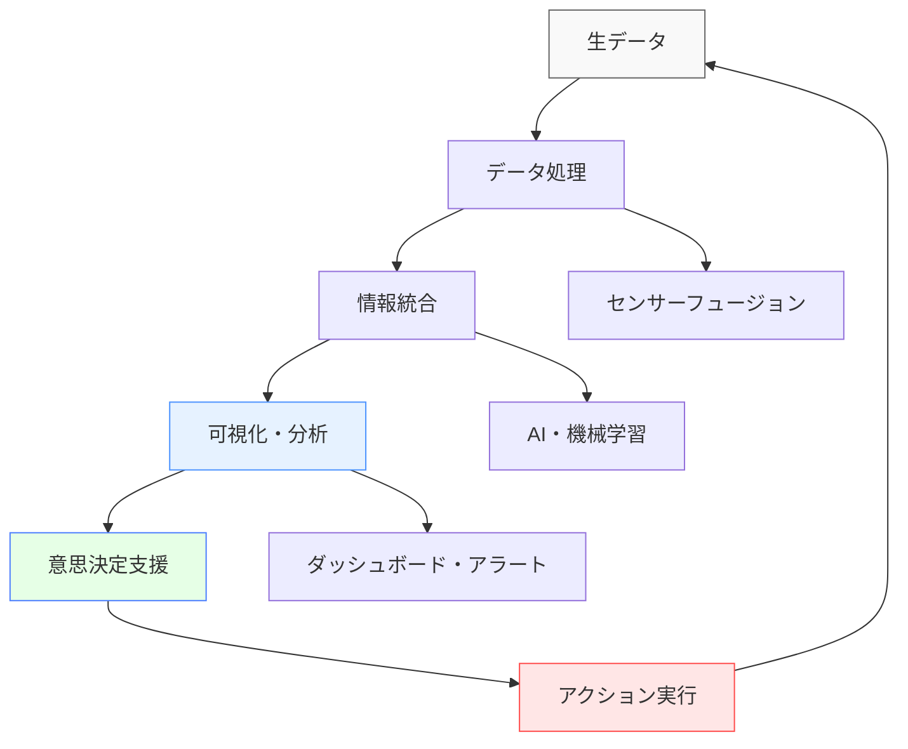
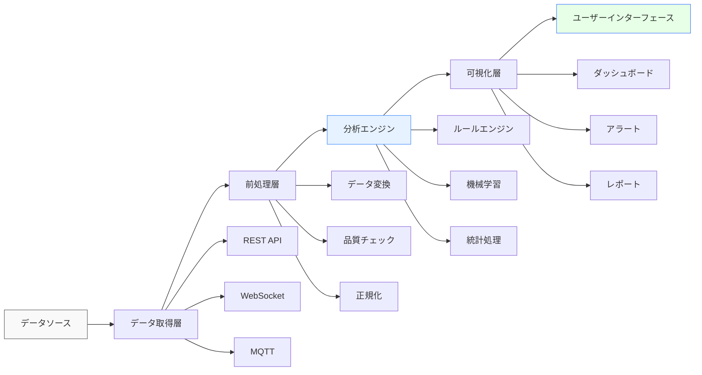
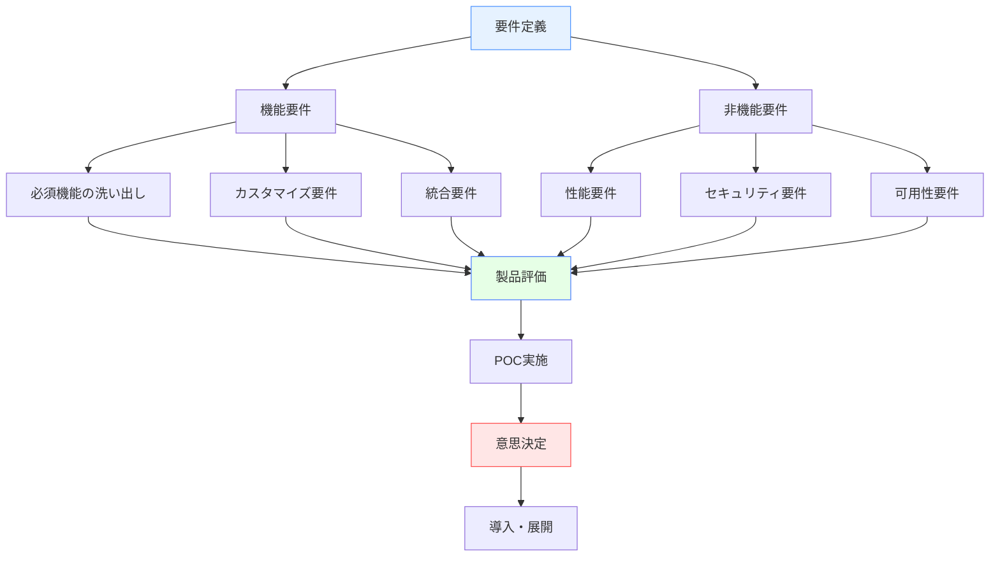

# 状況認識関連ソフトウェア

!!! info "このセクションについて"
    このセクションでは、状況認識（Situational Awareness）を支援する様々なソフトウェアアプリケーションやシステムについて解説します。実際に利用できるツールから企業向けシステムまで、幅広いソフトウェアソリューションを分野別に紹介します。

## ソフトウェアの重要性

状況認識は人間の認知能力に依存する部分が大きいですが、適切なソフトウェアツールの活用により、その能力を大幅に強化することができます。現代のデジタル社会では、リアルタイムデータの処理、複雑な情報の可視化、予測分析などを通じて、より効果的な状況認識が実現されています。

### ソフトウェアによる状況認識の強化



## 分野別ソフトウェア概要

このセクションでは、以下の分野における状況認識ソフトウェアを詳しく解説します。

<div class="grid cards" markdown>

- ### [航空関連ソフトウェア](./aviation-software.md)

    ---

    **飛行安全と効率性を支援**
    
    - フライトレーダー・追跡システム
    - 航空管制支援ツール
    - 気象情報システム
    - フライトシミュレーター

- ### [船舶関連ソフトウェア](./maritime-software.md)

    ---

    **海上航行の安全と効率化**
    
    - 船舶追跡システム（AIS）
    - 電子海図（ECDIS）
    - 気象・海象情報
    - 港湾管理システム

- ### [気象関連ソフトウェア](./weather-software.md)

    ---

    **気象予測と災害対策**
    
    - 天気予報アプリケーション
    - 災害警報システム
    - 農業・エネルギー向け気象データ
    - レーダー・衛星画像解析

- ### [医療・緊急対応ソフトウェア](./medical-emergency-software.md)

    ---

    **医療現場と緊急時対応の支援**
    
    - 患者監視システム
    - 救急指令システム
    - 災害対策ソフトウェア
    - 医療情報統合プラットフォーム

- ### [軍事・防衛ソフトウェア](./military-software.md)

    ---

    **国防と安全保障の技術**
    
    - C4ISRシステム
    - 脅威検知・分析ツール
    - 戦術意思決定支援
    - サイバーセキュリティ

</div>

## 技術的分類

### アーキテクチャ別分類

状況認識ソフトウェアは、技術アーキテクチャの観点から以下のように分類できます。

| アーキテクチャ | 特徴 | 適用分野 | 技術例 |
|---------------|------|----------|--------|
| **リアルタイム処理** | 低遅延データ処理<br>即座の応答性 | 航空管制<br>医療監視<br>緊急対応 | Apache Kafka<br>Redis Streams<br>WebSocket |
| **バッチ処理** | 大量データの一括処理<br>高い計算精度 | 気象予測<br>船舶ルート最適化<br>長期分析 | Apache Spark<br>Hadoop<br>Azure Batch |
| **ハイブリッド** | リアルタイムとバッチの組合せ<br>柔軟性の確保 | 産業制御<br>スマートシティ<br>総合防災 | Lambda Architecture<br>Kappa Architecture |

### データフロー設計



### フロントエンド技術の役割


??? TypeScript実装例
    ```typescript
    // 状況認識ダッシュボードの典型的な構成
    interface SituationalAwarenessDashboard {
      // リアルタイムデータストリーム
      dataStream$: Observable<SensorData[]>;
      
      // 状態管理
      applicationState: {
        currentSituation: SituationState;
        alerts: Alert[];
        userPreferences: UserSettings;
      };
      
      // コンポーネント構成
      components: {
        mapVisualization: MapComponent;
        dataCharts: ChartComponent[];
        alertPanel: AlertComponent;
        controlPanel: ControlComponent;
      };
      
      // イベントハンドリング
      onUserAction(action: UserAction): void;
      onDataUpdate(data: SensorData): void;
      onAlertTriggered(alert: Alert): void;
    }
    ```

## 開発・統合の観点

### API設計とデータ統合

#### RESTful API設計原則


??? TypeScript実装例
    ```typescript
    // 状況認識API の典型的なエンドポイント設計
    interface SituationalAwarenessAPI {
      // 現在の状況取得
      GET: '/api/v1/situation/current';
      
      // 履歴データ取得
      GET: '/api/v1/situation/history?from={timestamp}&to={timestamp}';
      
      // アラート管理
      GET: '/api/v1/alerts';
      POST: '/api/v1/alerts';
      PUT: '/api/v1/alerts/{id}';
      DELETE: '/api/v1/alerts/{id}';
      
      // リアルタイムストリーム
      WebSocket: '/ws/realtime-updates';
    }
    ```

#### データフォーマット標準化


??? TypeScript実装例
    ```typescript
    // 共通データモデル例
    interface SituationData {
      id: string;
      timestamp: Date;
      source: DataSource;
      coordinates?: GeographicCoordinates;
      metrics: {
        [key: string]: number | string | boolean;
      };
      confidence: number; // 0-1の信頼度
      priority: 'low' | 'medium' | 'high' | 'critical';
    }

    interface Alert {
      id: string;
      type: AlertType;
      severity: SeverityLevel;
      message: string;
      actionRequired: boolean;
      expiresAt?: Date;
      metadata: Record<string, any>;
    }
    ```

### PWA・オフライン対応


??? TypeScript実装例
    ```typescript
    // PWA対応の状況認識アプリケーション
    @Injectable()
    export class OfflineCapabilityService {
      private cache = new Map<string, any>();
      
      // オフライン時のデータ管理
      async storeDataOffline(key: string, data: any): Promise<void> {
        // IndexedDBを使用した永続化
        await this.indexedDB.store(key, data);
        this.cache.set(key, data);
      }
      
      // データ同期
      async syncWhenOnline(): Promise<void> {
        if (navigator.onLine) {
          const unsyncedData = await this.getUnsyncedData();
          for (const item of unsyncedData) {
            await this.uploadToServer(item);
          }
        }
      }
      
      // バックグラウンド同期
      registerBackgroundSync(): void {
        if ('serviceWorker' in navigator && 'sync' in window.ServiceWorkerRegistration.prototype) {
          navigator.serviceWorker.ready.then(registration => {
            return registration.sync.register('situation-data-sync');
          });
        }
      }
    }
    ```

### セキュリティ考慮事項

| セキュリティ要素 | 実装方法 | 重要度 |
|-----------------|----------|--------|
| **認証・認可** | OAuth 2.0 / OpenID Connect<br>JWT Token<br>Role-based Access Control | 高 |
| **データ暗号化** | HTTPS/TLS 1.3<br>End-to-End暗号化<br>Database暗号化 | 高 |
| **入力検証** | Input Sanitization<br>SQL Injection Prevention<br>XSS Protection | 高 |
| **監査ログ** | User Action Logging<br>Access Log<br>Change Tracking | 中 |

## パフォーマンス最適化

### フロントエンド最適化


??? TypeScript実装例
    ```typescript
    // 大量データの効率的な表示
    @Component({
      selector: 'sa-data-grid',
      template: `
        <cdk-virtual-scroll-viewport itemSize="50" class="data-viewport">
          <div *cdkVirtualFor="let item of dataStream$ | async" class="data-item">
            {{ item | json }}
          </div>
        </cdk-virtual-scroll-viewport>
      `,
      changeDetection: ChangeDetectionStrategy.OnPush
    })
    export class SituationalAwarenessDataGrid {
      // 仮想スクロールによる大量データの効率的表示
      dataStream$ = this.dataService.getData().pipe(
        // デバウンス処理でUI更新頻度を制御
        debounceTime(100),
        // 変更のあったデータのみ再描画
        distinctUntilChanged(),
        // エラーハンドリング
        catchError(error => {
          console.error('Data loading error:', error);
          return of([]);
        })
      );
    }
    ```

### リアルタイム処理の最適化


??? TypeScript実装例
    ```typescript
    // WebSocketによる効率的なリアルタイム通信
    @Injectable()
    export class RealTimeDataService {
      private ws$: WebSocketSubject<any>;
      
      // Connection pooling
      private connections = new Map<string, WebSocketSubject<any>>();
      
      connect(endpoint: string): Observable<any> {
        if (!this.connections.has(endpoint)) {
          const ws$ = webSocket({
            url: endpoint,
            openObserver: {
              next: () => console.log('Connection established')
            },
            closeObserver: {
              next: () => console.log('Connection closed')
            }
          });
          
          this.connections.set(endpoint, ws$);
        }
        
        return this.connections.get(endpoint)!.pipe(
          // 自動再接続
          retryWhen(errors =>
            errors.pipe(
              delay(5000),
              take(3)
            )
          ),
          // メッセージフィルタリング
          filter(message => this.isValidMessage(message)),
          // メッセージ変換
          map(message => this.transformMessage(message))
        );
      }
    }
    ```

## オープンソースとクローズドソース

### 代表的なオープンソースプロジェクト

| プロジェクト | 分野 | 主な機能 | ライセンス |
|------------|------|----------|-----------|
| **OpenStreetMap** | 地理情報 | オープンな地図データ<br>ルーティング機能 | ODbL |
| **Grafana** | 可視化 | ダッシュボード<br>アラート機能 | Apache 2.0 |
| **Apache Kafka** | データストリーミング | リアルタイムデータ処理<br>高可用性メッセージング | Apache 2.0 |
| **TensorFlow** | 機械学習 | 予測モデル<br>パターン認識 | Apache 2.0 |

### 商用ソフトウェアの優位性

- **技術サポート**: 専門的なサポート体制
- **統合性**: エンドツーエンドのソリューション
- **信頼性**: 企業レベルのSLA保証
- **セキュリティ**: 高度なセキュリティ機能

## 導入・選定ガイド

### 選定基準



### コスト・効果分析

#### TCO（Total Cost of Ownership）

| コスト要素 | 概算比率 | 考慮事項 |
|-----------|----------|----------|
| **初期導入** | 20-30% | ライセンス料、ハードウェア、開発費 |
| **運用・保守** | 40-50% | 人件費、サポート料、インフラコスト |
| **アップデート・拡張** | 15-25% | バージョンアップ、機能追加、スケールアウト |
| **トレーニング・教育** | 5-15% | ユーザー教育、技術習得、継続学習 |

## 将来の動向

### 新技術の統合

=== "人工知能・機械学習"
    **AIによる状況認識の自動化**
    
    - 異常検知アルゴリズムの高度化
    - 自然言語処理による情報抽出
    - コンピュータビジョンによる画像解析
    - 強化学習による最適判断

=== "エッジコンピューティング"
    **リアルタイム処理の分散化**
    
    - レイテンシの最小化
    - ローカル処理による高速化
    - 通信帯域の効率化
    - プライバシー保護の強化

=== "5G・6G通信"
    **超高速・低遅延通信**
    
    - リアルタイムデータ伝送
    - IoTデバイスの大規模接続
    - AR/VRによる情報表示
    - 遠隔監視・制御の高度化

### 標準化の動向

- **IEEE**: IoT・AI関連の標準化
- **ISO**: 品質・セキュリティ標準
- **W3C**: Web技術の標準化
- **OASIS**: データ交換フォーマット

## まとめ

状況認識関連ソフトウェアは、各分野の特性に応じて多様な形で発展してきました。技術の進歩により、より高度で統合的なソリューションが実現されており、人間の認知能力を大幅に拡張しています。

### 重要な選択指針

1. **目的の明確化**: 何のための状況認識か
2. **技術的適合性**: 既存システムとの統合性
3. **拡張性**: 将来の成長への対応
4. **セキュリティ**: データ保護とプライバシー
5. **ユーザビリティ**: 使いやすさと学習コスト

各分野の詳細情報については、右記のリンクからご確認ください。技術的な実装方法や具体的な製品情報を通じて、より効果的な状況認識システムの構築に役立てていただければ幸いです。

## 関連リンク

- [基本概念：状況認識とは](../basics/what-is-sa.md)
- [応用分野：各分野での利用](../applications/index.md)
- [包括的ガイド：状況認識の測定方法](../comprehensive-guide/measuring-sa.md)
- [AIと将来展望：技術的進化](../ai-and-future/index.md)
